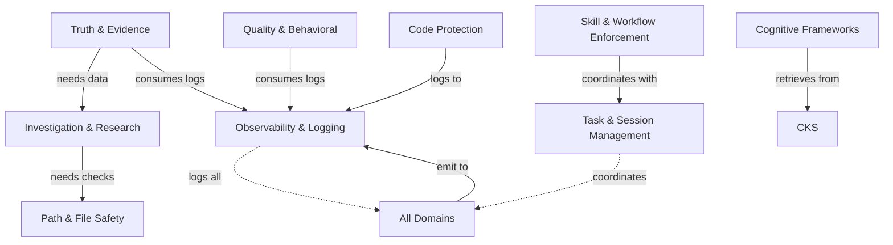

# CSF Hooks Catalog

> **Comprehensive catalog of all Cognitive Steering Framework hooks**
> **Last Updated:** 2026-03-18

---

## Summary

This catalog provides four perspectives on CSF hooks:
1. **By Event Type** - When hooks trigger (SessionStart, UserPromptSubmit, PreToolUse, PostToolUse, Stop)
2. **By Functional Domain** - What behavior they enforce (truth, evidence, quality, constitutional)
3. **By Enforcement Mode** - Architectural view (domains × BLOCK/WARN/SOFT/TRACK)
4. **Domain Ownership** - Ownership tracking and review schedule

**Hook Registration Methods:**
- **settings.json** - Directly registered in Claude Code settings
- **Router** - Consolidated into router files (e.g., Stop_router.py, UserPromptSubmit_router.py)
- **Skill** - Invoked via slash commands (e.g., `/v`, `/tdd`)

---

## By Event Type

### SessionStart Hooks

| Hook | In Settings? | Router | Description |
|------|-------------|--------|-------------|
| `SessionStart_cks_decision_load.py` | Yes | - | Display recent decisions/learnings from CKS |
| `SessionStart_router.py` | Yes | Router v1.0 | Consolidates: capture_settings, cks_restore, session_restore |
| `/search` daemon auto-start (unified router) | No (lazy runtime path) | `unified_router.py` | Starts unified semantic daemon on first search via `DaemonClient(auto_start=True)` |

**Router Details (SessionStart_router.py):**
- `capture_settings` - Capture current settings for session tracking
- `cks_restore` - Restore CKS context from previous session
- `session_restore` - Restore session state after compaction

---

### UserPromptSubmit Hooks

| Hook | In Settings? | Router | Description |
|------|-------------|--------|-------------|
| `UserPromptSubmit_router.py` | Yes | Router v1.0 | **Consolidated router** - See details below |

**Router Details (UserPromptSubmit_router.py):**
Consolidates 25+ hooks into single in-process execution:

*Recent additions (2026-03):*
- `context_summary` (priority 10) - Inject key facts from recent conversation
- `handoff_task_injector` (priority 10) - Inject current task after intra-session compaction
- `declaration_reminder` (priority 20) - Prevent "I'll update template" without execution
- `verify_before_claim` (priority 21) - Remind to verify before existence/absence claims
- `truthfulness_gate` (priority 22) - Enforce proactive honesty on completion queries

*Deprecated (2026-03-11):*
- `breadcrumb_init` - Superseded by workflow_tier_tagging
- `skill_compliance_indicator` - Redundant with step headers

| Priority | Hook Module | Description |
|----------|-------------|-------------|
| -1 | `style_friction` | Observability only, no injection |
| 0 | `consent_granter` | External path consent - runs FIRST |
| 1 | `skill_enforcement` | Slash command detection with pre-execution (loads skill file directly) |
| 2 | `anti_sycophancy` | ADVOCATE PROTOCOL injection for skepticism patterns |
| 3 | `plan_context_injector` | Plan structure injection for /plan commands |
| 4 | `value_check_injection` | Pending value question from previous turn |
| 5 | `speculative_claims_check` | Speculative claims without verification |
| 5.1 | `quantitative_topic_guard` | Prevent ungrounded numeric claims on quantitative topics |
| 6 | `tdd_eval` | TDD skill activation (before implementation) |
| 7 | `concern_detection` | User frustration detection |
| 8 | `diagnostic_injection` | Diagnostic questions require investigation |
| 9 | `cognitive_framework` | Strategic decision cognitive frameworks (4-horizon, IoRT, Value) |
| 10 | `cks_context` | CKS memory injection (progressive disclosure) |
| 10 | `context_summary` | Inject key facts from recent conversation (NEW 2026-03-13) |
| 10 | `handoff_task_injector` | Inject current task after intra-session compaction (NEW 2026-03-18) |
| 11 | `project_docs_context` | Project documentation injection (progressive disclosure) |
| 12 | `unified_injector` | Core injection (solo dev, goal, command, falsification, thinking gate) |
| 13 | `subagent_enforcer` | Execution mode enforcement |
| 14 | `authority_check` | Planning mode detection |
| 15 | `suggestions_file_hint` | Check suggestions file reminder |
| 16 | `topic_switch_check` | Topic switch detection (currently disabled for testing) |
| 17 | `retrospective` | Lesson detection (deferred to separate hook) |
| 18 | `periodic_reminder` | Periodic reminders (deferred to separate hook) |
| 19 | `doc_staleness` | Documentation staleness check |
| ~ | `breadcrumb_init` | ~~DEPRECATED 2026-03-11~~ - Superseded by workflow_tier_tagging |
| ~ | `skill_compliance_indicator` | ~~DEPRECATED 2026-03-11~~ - Redundant with step headers |
| 20 | `declaration_reminder` | Prevent "I'll update template" without execution (NEW 2026-03-16) |
| 21 | `verify_before_claim` | Remind to verify before existence/absence claims (NEW 2026-03-14) |
| 22 | `truthfulness_gate` | Enforce proactive honesty on completion queries (NEW 2026-03-13) |
| 1 | `post_compact_reminder` | Early - compaction context is critical |
| 3 | `pending_action_guard` | Early - scoped authorization |
| 13 | `task_detector` | Mid - contract reminders |

---

### PreToolUse Hooks

| Hook | Matcher | In Settings? | Router | Description |
|------|---------|-------------|--------|-------------|
| `PreToolUse_hook_protection_gate.py` | Write\|Edit\|MultiEdit\|Update | Yes | - | Block Edit/Write on hook files when breaking changes detected |
| `PreToolUse_file_lock.py` | Write\|Edit\|MultiEdit\|Update | Yes | - | Multi-session file locking |
| `PreToolUse_syntax_gate.py` | Write\|Edit\|MultiEdit | Yes | - | Block writes with Python syntax errors |
| `PreToolUse_write_router.py` | Write\|Edit\|MultiEdit | Yes | Router v1.3 | **Consolidated router** - See details below |
| `skill_enforcement_gate.py` | All tools | Yes | - | Block non-Skill tools when slash command pending (minimal, PreToolUse_bash_router also covers) |
| `PreToolUse/PreToolUse_skill_pattern_gate.py` | Bash\|Task | Yes | - | **Skill pattern gate v3.2** - Parallel regex + daemon validation |
| `PreToolUse_falsification_gate.py` | Edit\|Write\|Bash | Yes | - | Falsification gate - verify assumptions before risky operations |
| `skills/tdd/hooks/PreToolUse_tdd_gate.py` | Write\|Edit\|MultiEdit | Yes | - | TDD phase enforcement |
| `shell_complexity_gate.py` | Bash | Yes | - | Warn on complex shell patterns (log-only guidance) |
| `unparseable_command_gate.py` | Bash | Yes | - | Selective: hard-block injection patterns, warn/block opaque mutations via config |
| `recursive_failure_detector.py` | Bash | Yes | - | Detect Catch-22 loops, block repeated failures |
| `PreToolUse_bash_router.py` | Bash | Yes | Router v2.2 | **Consolidated router** - See details below |
| `pre_generation_registry.py` | Read\|Glob\|Grep\|WebFetch | Yes | - | Library-First registry suggestions |
| `path_resolution_orchestrator.py` | Write\|Edit\|MultiEdit\|Bash | Yes | - | SERIAL path resolution (plan_redirector → deny_root_write) |
| `semantic_file_router.py` | Write\|Edit\|MultiEdit\|Bash | Yes | - | Advisory semantic routing (TSK vs /reports) |

**Router Details (PreToolUse_write_router.py) v1.3:**
Consolidates write validation hooks with in-process execution:
- `PreToolUse_investigation_gate.py` - Block modifications without reading target files first
- `session_reversion_check.py` - Check for session reversion attempts (in-process with parity validation)
- `PreToolUse_vague_directive_gate.py` - Block vague directives, require architecture review
- `PreToolUse_gate_3_read_gate.py` - Read-before-write enforcement
- `inherited_choice_validator.py` - Detect versioned patterns in content
- `exec_orchestrator.py` - Subagent delegation decision (in-process with parity validation)
- `test_location_gate` - Block test files in P:/ or __csf root
- `pattern_sanity_check` - Validate pattern specifications
- `progress_gate` - Progress scale validation

**Router Details (PreToolUse_bash_router.py) v2.2:**
Consolidates bash validation hooks with parallel execution:
- **Inline:** `command_intent_gate` - Validate bash commands match slash command intent (session-specific state files)
- `explore_gate` - Block Task tool for code exploration (use Grep/Glob instead)
- `background_guard` - Warn on background task without run_in_background
- `anti_bleed_gate` - Prevent terminal context bleeding between sessions

---

### PostToolUse Hooks

| Hook | Matcher | In Settings? | Router | Description |
|------|---------|-------------|--------|-------------|
| `PostToolUse/task_contract_generator.py` | TaskCreate | Yes | - | Generate contract for task validation |
| `PostToolUse_file_lock.py` | Write\|Edit\|MultiEdit\|Update | Yes | - | Release file lock after write operation |
| `PostToolUse_code_verification_gate.py` | Write\|Edit | Yes | - | Verify Python syntax after write/edit (py_compile) |
| `posttooluse/python_syntax_checker.py` | Edit\|Write\|MultiEdit | No (in-process) | PostToolUse_router.py | ast.parse() syntax check on .py files after Edit/Write/MultiEdit |
| `PostToolUse_hook_protection_gate.py` | Write\|Edit | Yes | - | Validate hook file changes for API breakages |
| `PostToolUse_lint_router.py` | Write\|Edit | Yes | - | Auto-format after edits (ruff, prettier) |
| `PostToolUse_router.py` | .* | Yes | Router v2.1 | **Consolidated router** - See details below (session/terminal context pinning) |
| `repositories/doc_cks_ingester.py` | Write\|Edit | Yes | - | Ingest edited docs into CKS |
| `PostToolUse_task_tracker.py` | TaskCreate\|TaskUpdate\|TaskList | Yes | - | Session-based task coordination |
| `PostToolUse_write_router.py` | Edit\|Write\|MultiEdit | Yes | Router v1.1 | **Consolidated router** - See details below |
| `auto_cks_storage.py` | Edit\|Write | Yes | - | Automatic CKS accumulation |
| `PostToolUse_task_router.py` | Task | Yes | Router v1.0 | **Consolidated router** - See details below |
| `skill_enforcement_gate.py` | Skill | Yes | - | Clear pending skill state after Skill tool used |
| `PostToolUse_next_command_suggester.py` | Skill | Yes | - | Append context-aware next command suggestions |
| `observable_effect_verifier.py` | Edit\|Write | Yes | - | Verify expected side effects from code changes (e.g., logging FileHandler → log files) |

**Router Details (PostToolUse_router.py) v2.1:**
In-process hook execution (~95% latency reduction):
- `FixValidator` - Validates code fixes for syntax/undefined methods
- `ChangeVerification` - Tracks file changes (silent)
- `FalsificationAssessor` - Assesses outcomes against expectations
- `SemanticCompress` - Compresses large outputs asynchronously
- Tool sequence tracking for empirical claims validation
- Session/terminal context pinning:
  - Sets `CLAUDE_SESSION_ID` when session metadata is present
  - Preserves existing `CLAUDE_TERMINAL_ID`, otherwise derives `session_{session_id}`
  - Writes `session_id` and `terminal_id` into tool sequence entries

**Router Details (PostToolUse_task_router.py) v1.0:**
Consolidates task-related hooks:
- `bloat_guard_extended.py` - Solo-dev pattern compliance
- `agent_handoff_validator.py` - Agent handoff validation
- `cks_storage.py` - CKS storage integration

**Router Details (PostToolUse_write_router.py) v1.1:**
Consolidates write-specific validation hooks

---

### Stop Hooks

| Hook | In Settings? | Router | Layer | Description |
|------|-------------|--------|-------|-------------|
| `verify_claims_transcript.py` | Yes | - | 5 | Extract claims from transcript and verify against evidence |
| `Stop_cks_decision_capture.py` | Yes | - | 1 | CKS Decision Capture - Extract decisions using Oppia 5-step |
| `speculation_gate.py` | Yes | - | -2 | Block diagnostic claims without source verification |
| `Stop/contract_validator.py` | Yes | - | -1 | Contract validation for task completion |
| `architecture_evidence_gate.py` | Yes | - | -1 | Conditional block: architecture proposals without this-turn observation tools |
| `StopHook_cross_validator.py` | Yes | - | -1 | Block 'fixed' claims without empirical verification |
| `StopHook_unverified_stance.py` | Yes | - | -1 | Detect skeptical language without verification evidence (anti-sycophancy) |
| `Stop/StopHook_skill_execution_gate.py` | Yes | - | -3 | Skill execution verification (prevents substitution) |
| `StopHook_duplicate_next_steps.py` | Yes | Router | 0 | Detect and warn about duplicate "Next Steps" sections in output |
| `Stop_router.py` | Yes | Router v1.1 | 0 | **Consolidated router** - See details below |
| `assumption_audit_v2.py` | Yes | - | 5 | Assumption audit comparison (session/terminal-filtered evidence window) |
| `auto_commit_hook.py` | Yes | - | 7 | Auto-commit and push on session end |

**Router Details (Stop_router.py) v1.1:**
Consolidates 20+ hooks in priority order:

| Hook Module | Env Var Toggle | Default | Description |
|-------------|----------------|---------|-------------|
| `StopHook_skill_execution_gate.py` | SKILL_EXECUTION_GATE_ENABLED | true | Skill execution verification (prevents substitution) |
| `assumption_audit_v2.py` | ASSUMPTION_AUDIT_V2_ENABLED | true | Blocking assumption audit (v2) |
| `StopHook_reflexion_validator.py` | REFLEXION_VALIDATOR_ENABLED | true | Multi-pass verification loop |
| `Stop_pre_clarification_gate.py` | PRE_CLARIFICATION_GATE_ENABLED | true | Pre-response clarification |
| `Stop_artifact_gate.py` | ARTIFACT_GATE_ENABLED | true | Artifact tracking validation |
| `StopHook_investigation_required.py` | INVESTIGATION_REQUIRED_ENABLED | true | Block claims without investigation |
| `Stop_investigation_validator.py` | INVESTIGATION_LEDGER_ENABLED | false | Block claims without investigation (ledger-based) [DISABLED by default due to missing unified_claim_verifier module] |
| `StopHook_sycophancy_agreement.py` | SYCOPHANCY_AGREEMENT_ENABLED | true | Detect unwarranted agreement patterns |
| `Stop.py` (`anti_sycophancy_quality` in-process gate) | OVERCONFIDENCE_DETECTOR_ENABLED | true | Detect overconfident claims without evidence |
| `Stop.py` (`anti_sycophancy_quality` in-process gate) | LAZY_CLOSURE_DETECTOR_ENABLED | true | Detect work avoidance and premature closure |
| `StopHook_duplicate_next_steps.py` | CSF_DUPLICATE_NEXT_STEPS_ENABLED | true | Detect duplicate "Next Steps" sections in output |
| `StopHook_behavioral_quality_gate.py` | BEHAVIORAL_QUALITY_GATE_ENABLED | true | Lazy fix, thrashing, question mismatch |
| `StopHook_value_assessment.py` | VALUE_ASSESSMENT_ENABLED | true | Value assessment |
| `stop_success_validator.py` | SUCCESS_VALIDATOR_ENABLED | true | Success claim verification |
| `StopHook_cross_validator.py` | CROSS_VALIDATION_HOOK_ENABLED | false | Empirical verification for "fixed" claims |
| `empirical_claims_gate.py` | EMPIRICAL_CLAIMS_GATE_ENABLED | true | Empirical claims validation (v1.5.0) |
| `Stop_historical_claims_gate.py` | HISTORICAL_CLAIMS_GATE_ENABLED | true | Historical claims validation |
| `Stop_absence_claim_gate.py` | ABSENCE_CLAIM_GATE_ENABLED | true | Absence claim validation |
| `constitutional_enforcer.py` | CONSTITUTIONAL_ENFORCER_ENABLED | true | Anti-sycophancy, excuse patterns |
| `StopHook_scope_reduction.py` | SCOPE_REDUCTION_DETECTOR_ENABLED | true | Scope reduction detector |
| `command_execution_validator.py` | COMMAND_EXECUTION_VALIDATOR_ENABLED | true | Command execution validation |
| `inherited_choice_validator.py` | INHERITED_CHOICE_VALIDATOR_ENABLED | true | Versioned pattern detection |
| `conversation_storage.py` | CONVERSATION_STORAGE_ENABLED | true | Conversation storage |
| `entity_correlation_gate.py` | ENTITY_CORRELATION_GATE_ENABLED | true | Entity correlation validation |
| `StopHook_green_state_validator.py` | GREEN_STATE_VALIDATOR_ENABLED | true | Green state validation |
| `StopHook_closure_enforcer.py` | CLOSURE_ENFORCER_ENABLED | true | Closure enforcement |
| `stop-hook.py` | RALPH_LOOP_ENABLED | true | RALPH loop enforcement |
| `Stop_adversarial_gate.py` | ADVERSARIAL_GATE_ENABLED | true | Subagent orchestration gate |

Stop router context handling notes:
- When Stop hook input lacks `response`, router extracts the **latest assistant text** from transcript payloads.
- Transcript extraction only keeps assistant text blocks (`type == "text"`), reducing tool-result contamination in downstream validators.
- Router pins `CLAUDE_SESSION_ID` and preserves/derives `CLAUDE_TERMINAL_ID` for downstream hook consistency.
- Duplicate block suppression uses `STOP_BLOCK_DEDUPE_TTL_SECONDS` (default: `20`) and now keys on session + hook + normalized reason + tools + response hash.
- Post-block observation guard uses `STOP_POST_BLOCK_GUARD_TTL_SECONDS` (default: `1800`) and requires a new observation tool call after evidence-related blocks.

---

### PreCompact Hooks

| Hook | In Settings? | Description |
|------|-------------|-------------|
| `PreCompact_checkpoint_router.py` | Yes | Checkpoint capture before transcript compaction |

**Router Details (PreCompact_checkpoint_router.py):**
Consolidates checkpoint-related hooks

---

### Notification Hooks

| Hook | Matcher | In Settings? | Description |
|------|---------|-------------|-------------|
| `voice_notifications.ps1` | .* | Yes | Voice notifications for task completion |

---

### SessionEnd Hooks

| Hook | In Settings? | Description |
|------|-------------|-------------|
| (None currently) | - | Session-end notifications handled by Stop_router finally block |

**Note:** Session-end notifications (DUF, brainstorm) are now triggered by Stop_router's finally block, not a separate SessionEnd hook.

---

## UserPromptSubmit Modules Domain Mapping

### Overview

The `UserPromptSubmit_modules/` directory contains **47 Python modules** that provide modular functionality for the UserPromptSubmit router. These modules are organized according to the **12 Functional Domains** defined in this catalog.

### Registration Status

| Status | Count | Percentage |
|--------|-------|------------|
| **Registered** (in router) | 8 | 17% |
| **Unregistered** (available but not loaded) | 39 | 83% |
| **Total** | 47 | 100% |

**Registered Modules** (from HOOKS_CATALOG_v3.md):
- `active_command_writer.py`
- `competence_injector.py`
- `anti_sycophancy_injector.py`
- `skill_enforcer.py`
- `plan_injector.py`
- `diagnostic_guard.py`
- `unified_injector.py`
- `declaration_reminder.py` (anti-lazy declaration enforcement)

### Domain Mapping

#### Domain 1: Truth & Evidence (2 modules)

| Module | Description | Registered |
|--------|-------------|------------|
| `verify_before_claim.py` | Verify-before-claiming reminder | No |
| `diagnostic_guard.py` | Diagnostic guard (requires investigation) | Yes |

#### Domain 2: Quality & Behavioral (10 modules)

**Core modules** (3):
| Module | Description | Registered |
|--------|-------------|------------|
| `anti_sycophancy_injector.py` | Anti-sycophancy Layer 1 injector | Yes |
| `continuation_spine.py` | Minimal re-anchoring for short affirmatives | No |
| `declaration_reminder.py` | Declaration reminder (anti-lazy) | Yes |

**External domain** `anti_sycophancy/` (7 modules):
| Module | Description | Registered |
|--------|-------------|------------|
| `affirmation_detector.py` | Detects sycophantic affirmation patterns | No |
| `overconfidence_detector.py` | Detects overconfident claims without evidence | No |
| `lazy_closure_detector.py` | Detects work avoidance and premature closure | No |
| `hypothesis_as_fact_detector.py` | Detects hypotheses presented as facts | No |
| `response_structure_detector.py` | Analyzes response structure for quality issues | No |
| `unverified_stance_detector.py` | Detects skeptical language without verification | No |
| `advocate_injection.py` | ADVOCATE PROTOCOL injection for skepticism | No |

#### Domain 3: Constitutional Patterns (2 modules)

| Module | Description | Registered |
|--------|-------------|------------|
| `truthfulness_gate.py` | Truthfulness gate | No |
| `unified_injector.py` | Core injection (falsification, thinking gate) | Yes |

#### Domain 4: Code Protection (0 modules)

*No modules at this level - code protection hooks are at root level*

#### Domain 5: Investigation & Research (2 modules)

| Module | Description | Registered |
|--------|-------------|------------|
| `intent_extractor.py` | Intent extraction for CKS | No |
| `questioning_integration.py` | Questioning framework | No |

#### Domain 6: Path & File Safety (1 module)

| Module | Description | Registered |
|--------|-------------|------------|
| `path_syntax_corrector.py` | Path syntax corrector | No |

#### Domain 7: Task & Session Management (4 modules)

| Module | Description | Registered |
|--------|-------------|------------|
| `task_detector.py` | Task detector | No |
| `workflow_tier_tagging.py` | Workflow tier tagging | No |
| `memory_size.py` | MEMORY.md enforcement | No |
| `turn_marker.py` | Ensure a DB-backed active turn exists | No |

#### Domain 8: Cognitive Frameworks (7 modules)

| Module | Description | Registered |
|--------|-------------|------------|
| `cognitive_enhancers.py` | Cognitive enhancements | No |
| `unified_detection.py` | Unified detection engine | No |
| `think_trigger.py` | THINK trigger | No |
| `reasoning_mode_selector.py` | Reasoning mode selector | No |
| `config_loader.py` | Config loader | No |
| `conflict_arbiter.py` | Conflict arbiter | No |
| `synergy_detector.py` | Synergy detection | No |

#### Domain 9: Skill & Workflow Enforcement (3 modules)

| Module | Description | Registered |
|--------|-------------|------------|
| `skill_enforcer.py` | Skill enforcer | Yes |
| `skill_compliance_indicator.py` | Skill compliance | No |
| `plan_injector.py` | Plan injector | Yes |

#### Domain 10: Observability & Logging (3 modules)

| Module | Description | Registered |
|--------|-------------|------------|
| `observability.py` | Track selections/metrics | No |
| `performance_monitor.py` | Performance monitoring | No |
| `tag_emission.py` | Tag emission standard | No |

#### Domain 11: Formatting & Style (0 modules)

*No modules at this level - formatting hooks are at root level*

#### Domain 12: CKS (2 modules)

| Module | Description | Registered |
|--------|-------------|------------|
| `coach_note_reader.py` | Coach note reader | No |
| `intent_extractor.py` | Intent extraction (also Domain 5) | No |

### Infrastructure & Utilities (Cross-Cutting)

| Module | Description | Registered |
|--------|-------------|------------|
| `base.py` | Base classes | No |
| `registry.py` | Hook registry | No |
| `operating_rules.py` | Operating rules | No |
| `context_summary.py` | Context summary | No |

### Standalone / Refactoring (9 modules)

| Module | Description | Status |
|--------|-------------|--------|
| `refactor_to_unified.py` | Refactor script | Standalone |
| `convert_to_absolute_imports.py` | Conversion utility | Standalone |
| `test_userpromptsubmit_inprocess.py` | Test file | Test |
| `__init__.py` | Package init | Infrastructure |
| `abstraction_clarity_gate.py` | May be obsolete | Needs review |
| `analysis_protocol_gate.py` | May be obsolete | Needs review |
| `competence_injector.py` | Standalone | Yes (registered) |
| `edit_consent.py` | Edit consent | Standalone |
| `breadcrumb_init.py` | Breadcrumb init | Standalone |

### anti_sycophancy Domain Extension

The `anti_sycophancy/` directory is a **Domain 2 (Quality & Behavioral) extension** with 7 specialized modules:

**Architecture**:
- **Layer 1** (`anti_sycophancy_injector.py`): Entry point, injects ADVOCATE PROTOCOL
- **Layer 2** (`*_detector.py` modules): Pattern detection (affirmation, overconfidence, lazy closure, etc.)
- **Layer 3** (`advocate_injection.py`): ADVOCATE PROTOCOL generation

**Integration**: These modules are used by both UserPromptSubmit (injection) and Stop hooks (detection).

### Module Statistics

| Metric | Count |
|--------|-------|
| Total modules | 47 |
| Registered in router | 8 (17%) |
| Domain 2 modules (Quality & Behavioral) | 10 (21%) |
| Domain 8 modules (Cognitive Frameworks) | 7 (15%) |
| Infrastructure utilities | 4 (9%) |
| Standalone/refactoring | 9 (19%) |

### Key Findings

1. **Low registration rate**: Only 17% of modules are registered in the router
2. **Domain 2 is largest**: Quality & Behavioral has the most modules (10 total, 21%)
3. **Cross-cutting infrastructure**: 4 modules provide base functionality for all domains
4. **External domain integration**: `anti_sycophancy/` domain extends Domain 2 functionality

### Registration Process

To register a module in `UserPromptSubmit_router.py`:

1. **Export `process_prompt()` function**:
   ```python
   def process_prompt(data: dict) -> dict:
       return {"additionalContext": "injection text"}
   ```

2. **Add to router's `import_hook()` function**:
   ```python
   elif name == "your_module_name":
       import your_module_name as mod
       return mod
   ```

3. **Add to `HOOK_PRIORITY` and `HOOK_DISPATCH` dictionaries**:
   ```python
   "your_module_name": 4.5,  # Priority (lower = earlier)
   ```

### Related Documentation

- **Router Implementation**: `UserPromptSubmit_router.py`
- **Runtime Truth**: `HOOKS_CATALOG_v3.md` (registered modules list)
- **Domain Definitions**: See "By Functional Domain" section below
- **anti_sycophancy Architecture**: `anti_sycophancy/README.md` (if exists)

---

## By Functional Domain

### Domain Summary

| # | Domain | Hook Count | Description |
|---|--------|------------|-------------|
| 1 | Truth & Evidence | 12 | Block diagnostic claims without verification, track evidence |
| 2 | Quality & Behavioral | 6 | Detect overconfidence, sycophancy, lazy closure, work avoidance |
| 3 | Constitutional Patterns | 5 | Assumption audit, anti-sycophancy, reflexion validation |
| 4 | Code Protection | 5 | Syntax gates, hook protection, TDD enforcement, Catch-22 detection |
| 5 | Investigation & Research | 3 | Block modifications without reading first, speculation detection |
| 6 | Path & File Safety | 5 | Path resolution, file locking, shell complexity, semantic routing |
| 7 | Task & Session Management | 5 | Task coordination, session tracking, CKS accumulation, checkpoints |
| 8 | Cognitive Frameworks | 2 | Solo dev injection, goal anchoring, diagnostic frameworks |
| 9 | Skill & Workflow Enforcement | 6 | Slash command enforcement, /v workflow state tracking |
| 10 | Observability & Logging | 5 | System 2 debugging, failure recording, outcome validation |
| 11 | Formatting & Style | 2 | Auto-formatting (ruff/prettier), command suggestions |
| 12 | CKS (Constitutional Knowledge System) | 4 | Decision capture, memory injection, automatic storage |

### Truth & Evidence Enforcement

| Hook | Event | Purpose |
|------|-------|---------|
| `speculation_gate.py` | Stop | Block diagnostic claims without source verification |
| `StopHook_investigation_required.py` | Stop | Self-prompt when diagnostic Q answered without investigation |
| `Stop_investigation_validator.py` | Stop | Block claims that exceed investigation ledger |
| `StopHook_cross_validator.py` | Stop | Block "fixed" claims without empirical verification |
| `empirical_claims_gate.py` | Stop | Empirical claims validation (v1.5.0) |
| `verify_claims_transcript.py` | Stop | Extract and verify claims against evidence |
| `architecture_evidence_gate.py` | Stop | Conditional block: architecture signals without this-turn observation tools; otherwise warn on unverified assumptions |
| `PostToolUse/router.py` | PostToolUse | Tool sequence tracking for empirical claims validation |
| `UserPromptSubmit/router.py` (diagnostic_injection) | UserPromptSubmit | Investigation requirement injection |
| `UserPromptSubmit/router.py` (speculative_claims_check) | UserPromptSubmit | Speculative claims detection |
| `UserPromptSubmit/router.py` (quantitative_topic_guard) | UserPromptSubmit | Prevent ungrounded quantitative claims (latency, cost, memory, etc.) |
| `Stop_historical_claims_gate.py` | Stop | Historical claims validation |
| `Stop_absence_claim_gate.py` | Stop | Absence claim validation |

### Quality & Behavioral Gates

| Hook | Event | Purpose |
|------|-------|---------|
| `Stop.py` (`anti_sycophancy_quality` in-process gate) | Stop | Detect overconfident claims without traced evidence |
| `StopHook_sycophancy_agreement.py` | Stop | Detect unwarranted agreement patterns |
| `Stop.py` (`anti_sycophancy_quality` in-process gate) | Stop | Detect work avoidance and premature task closure |
| `StopHook_behavioral_quality_gate.py` | Stop | Lazy fix, tool thrashing, question mismatch |
| `stop_success_validator.py` | Stop | Validate success claims |
| `StopHook_value_assessment.py` | Stop | Value assessment |

### Constitutional Patterns

| Hook | Event | Purpose |
|------|-------|---------|
| `assumption_audit_v2.py` | Stop | Assumption audit compliance |
| `constitutional_enforcer.py` | Stop | Anti-sycophancy, excuse patterns |
| `StopHook_reflexion_validator.py` | Stop | Multi-pass verification loop |
| `Stop_pre_clarification_gate.py` | Stop | Pre-response clarification |
| `UserPromptSubmit/router.py` (anti_sycophancy) | UserPromptSubmit | ADVOCATE PROTOCOL injection |

### Code Protection

| Hook | Event | Purpose |
|------|-------|---------|
| `PreToolUse_hook_protection_gate.py` | PreToolUse | Block Edit/Write on hook files when breaking changes detected |
| `PostToolUse_hook_protection_gate.py` | PostToolUse | Validate hook file changes for API breakages |
| `PreToolUse_syntax_gate.py` | PreToolUse | Block writes with Python syntax errors |
| `PostToolUse_code_verification_gate.py` | PostToolUse | Verify Python syntax after write/edit |
| `posttooluse/python_syntax_checker.py` | PostToolUse | ast.parse() syntax check on .py files after Edit/Write/MultiEdit (advisory, injection-based) |
| `skills/tdd/hooks/PreToolUse_tdd_gate.py` | PreToolUse | TDD phase enforcement |
| `recursive_failure_detector.py` | PreToolUse | Detect Catch-22 loops, block repeated failures |

### Investigation & Research

| Hook | Event | Purpose |
|------|-------|---------|
| `PreToolUse_write_router.py` (investigation_gate) | PreToolUse | Block modifications without reading target files first |
| `PreToolUse_write_router.py` (vague_directive_gate) | PreToolUse | Block vague directives - require architecture review |
| `PostToolUse_speculation_detector.py` | PostToolUse | Early warning for speculation patterns |
| `pre_generation_registry.py` | PreToolUse | Library-First registry suggestions |

### Path & File Safety

| Hook | Event | Purpose |
|------|-------|---------|
| `path_resolution_orchestrator.py` | PreToolUse | SERIAL path resolution (plan_redirector → deny_root_write) |
| `PreToolUse_file_lock.py` | PreToolUse | Multi-session file locking |
| `PostToolUse_file_lock.py` | PostToolUse | Release file lock after write operation |
| `shell_complexity_gate.py` | PreToolUse | Warn on complex shell patterns, enforce safer rewrite guidance |
| `unparseable_command_gate.py` | PreToolUse | Selective: hard-block injection (`eval`/`exec`/complex `$()`); mutation handling is `warn|block` via `UNPARSEABLE_MUTATION_MODE` |
| `semantic_file_router.py` | PreToolUse | Advisory semantic routing (TSK vs /reports) |

### Task & Session Management

| Hook | Event | Purpose |
|------|-------|---------|
| `PostToolUse_task_tracker.py` | PostToolUse | Session-based task coordination |
| `PreToolUse_write_router.py` (session_reversion_check) | PreToolUse | Track session changes for reversion detection |
| `auto_cks_storage.py` | PostToolUse | Automatic CKS accumulation |
| `Stop_artifact_gate.py` | Stop | Artifact tracking validation |
| `PostToolUse/task_contract_generator.py` | PostToolUse | Contract generation for task validation |
| `Stop/contract_validator.py` | Stop | Contract validation for task completion |

### Cognitive Frameworks

| Hook | Event | Purpose |
|------|-------|---------|
| `UserPromptSubmit/router.py` (unified_injector) | UserPromptSubmit | Core injection (solo dev, goal anchor, command directive) |
| `UserPromptSubmit/router.py` (cognitive_framework) | UserPromptSubmit | Strategic decision cognitive frameworks (4-horizon, IoRT, Value) |
| `UserPromptSubmit/router.py` (diagnostic_injection) | UserPromptSubmit | Diagnostic questions require investigation |
| `UserPromptSubmit/router.py` (cks_context) | UserPromptSubmit | CKS memory injection (progressive disclosure) |
| `UserPromptSubmit/router.py` (project_docs_context) | UserPromptSubmit | Project documentation injection (progressive disclosure) |

### Skill & Workflow Enforcement

| Hook | Event | Purpose |
|------|-------|---------|
| `skill_enforcement_gate.py` | PreToolUse | Block non-Skill tools when slash command pending |
| `UserPromptSubmit/router.py` (skill_enforcement) | UserPromptSubmit | Slash command detection with pre-execution (loads skill file directly) |
| `Stop/StopHook_skill_execution_gate.py` | Stop | Skill execution verification (prevents substitution) |
| `PreToolUse/PreToolUse_skill_pattern_gate.py` | PreToolUse | **Skill pattern gate v3.2** - Parallel regex + daemon validation |
| `skills/v/hooks/PostToolUse_v_session_marker.py` | PostToolUse | Create session marker when /v skill invoked |
| `skills/v/hooks/PostToolUse_v_init.py` | PostToolUse | Initialize /v workflow state |

### Observability & Logging

| Hook | Event | Purpose |
|------|-------|---------|
| `PostToolUse/router.py` | PostToolUse | Tool sequence tracking for empirical claims validation |
| `PostToolUse/router.py` (FixValidator) | PostToolUse | Fix validation with syntax/undefined method checks |
| `PostToolUse/router.py` (FalsificationAssessor) | PostToolUse | Falsification assessment + post-action verification |
| `strategy_escalation_tracker.py` | PostToolUse | Strategy escalation - prevent perseveration |
| `PostToolUse/router.py` (SemanticCompress) | PostToolUse | Semantic compression for context management |

### Formatting & Style

| Hook | Event | Purpose |
|------|-------|---------|
| `PostToolUse_lint_router.py` | PostToolUse | Auto-format after edits (ruff, prettier) |
| `PostToolUse_next_command_suggester.py` | PostToolUse | Append context-aware next command suggestions |

### CKS (Constitutional Knowledge System)

| Hook | Event | Purpose |
|------|-------|---------|
| `SessionStart_cks_decision_load.py` | SessionStart | Display recent decisions/learnings from CKS |
| `Stop_cks_decision_capture.py` | Stop | CKS Decision Capture - Extract decisions using Oppia 5-step |
| `UserPromptSubmit/router.py` (cks_context) | UserPromptSubmit | CKS memory injection (progressive disclosure) |
| `auto_cks_storage.py` | PostToolUse | Automatic CKS accumulation |
| `repositories/doc_cks_ingester.py` | PostToolUse | Ingest edited docs into CKS |

---

## By Enforcement Mode (Architectural View)

**Mode Definitions (from ARCHITECTURE.md):**

| Mode | Behavior |
|------|----------|
| BLOCK | Prevents action |
| WARN | Logs but allows |
| SELECTIVE | BLOCK severe, WARN moderate |
| SOFT | Injects LLM self-prompt for reflection (doesn't block) |
| TRACK | Silent state tracking for other hooks to consume |

**Domain × Enforcement Mode Matrix:**

| Domain | BLOCK | WARN | SOFT | TRACK | Total |
|--------|-------|------|------|-------|-------|
| Truth & Evidence | 8 | 1 | 2 | 1 | 12 |
| Quality & Behavioral | 3 | 0 | 3 | 0 | 6 |
| Constitutional Patterns | 3 | 0 | 2 | 0 | 5 |
| Code Protection | 5 | 0 | 0 | 0 | 5 |
| Investigation & Research | 2 | 0 | 0 | 1 | 3 |
| Path & File Safety | 3 | 2 | 0 | 0 | 5 |
| Task & Session Management | 1 | 0 | 0 | 4 | 5 |
| Cognitive Frameworks | 0 | 0 | 2 | 0 | 2 |
| Skill & Workflow Enforcement | 4 | 0 | 0 | 2 | 6 |
| Observability & Logging | 0 | 0 | 0 | 5 | 5 |
| Formatting & Style | 0 | 0 | 0 | 0 | 2 |
| CKS | 0 | 0 | 0 | 1 | 4 |
| **TOTAL** | **29** | **3** | **9** | **14** | **55** |

**Key Observations:**
- **BLOCK mode dominates** (52% of hooks) - System prioritizes prevention over logging
- **TRACK mode** supports cross-cutting concerns (Observability, Task Management)
- **SOFT mode** used for behavioral nudges (Quality, Cognitive Frameworks)
- **WARN mode** minimal - System prefers hard blocks over advisory warnings

---

## Domain Ownership

| Domain | Owner | Contact | Last Review | Review Frequency |
|--------|-------|---------|-------------|------------------|
| Truth & Evidence | self | internal | 2026-02-06 | Monthly |
| Quality & Behavioral | self | internal | 2026-02-06 | Monthly |
| Constitutional Patterns | self | internal | 2026-02-06 | Monthly |
| Code Protection | self | internal | 2026-02-06 | Monthly |
| Investigation & Research | self | internal | 2026-02-06 | Monthly |
| Path & File Safety | self | internal | 2026-02-06 | Monthly |
| Task & Session Management | self | internal | 2026-02-06 | Monthly |
| Cognitive Frameworks | self | internal | 2026-02-06 | Monthly |
| Skill & Workflow Enforcement | self | internal | 2026-02-06 | Monthly |
| Observability & Logging | self | internal | 2026-02-06 | Monthly |
| Formatting & Style | self | internal | 2026-02-06 | Monthly |
| CKS | self | internal | 2026-02-06 | Monthly |

**Ownership Responsibilities:**
- Review hooks in domain monthly for effectiveness
- Propose new hooks for domain gaps identified in operation
- Deprecate obsolete hooks (mark with @deprecated in docstring)
- Update domain documentation in this catalog
- Track domain health metrics (block rates, false positives)

**Solo-Dev Context:**
- "self" owner indicates solo developer environment
- Contact "internal" references local decision tracking
- Team coordination patterns preserved for future scalability

---

## Domain Gap Analysis

| Domain | Coverage | Gaps | Priority | Proposed Hooks | Status |
|--------|----------|------|----------|----------------|--------|
| Truth & Evidence | 85% | Citation validation for external docs | Medium | `citation_gate.py` | Open |
| Quality & Behavioral | 70% | No active praise/pandering detection | Low | `praise_detector.py` | Open |
| Constitutional Patterns | 90% | None critical | - | - | - |
| Code Protection | 95% | TypeScript/JS syntax validation | Low | `typescript_syntax_gate.py` | Open |
| Investigation & Research | 75% | No search-before-claim enforcement | High | `search_prerequisite_gate.py` | In Review |
| Path & File Safety | 90% | Windows-specific path injection checks | Medium | `windows_path_sanitizer.py` | Open |
| Task & Session Management | 85% | No task orphanage detection | Medium | `task_orphan_detector.py` | Open |
| Cognitive Frameworks | 80% | Limited framework diversity | Low | - | Open |
| Skill & Workflow Enforcement | 95% | None critical | - | - | - |
| Observability & Logging | 70% | No performance profiling hooks | Medium | `performance_profiler.py` | Open |
| Formatting & Style | 60% | No markdown linting | Low | `markdown_linter.py` | Open |
| CKS | 80% | No automatic cleanup of stale entries | Medium | `cks_cleanup.py` | Open |

**Gap Scoring:**
- **Coverage:** % of domain's failure modes addressed by existing hooks
- **Priority:** Critical > High > Medium > Low
- **Status:** Open / In Review / Implemented / Deprecated

**Data Sources:**
- ARCHITECTURE.md "Gaps and Opportunities" section
- Session transcript analysis for recurring failure patterns
- Hook block log analysis (`logs/enforcement.jsonl`)

---

## Domain Dependencies

### Dependency Matrix

| Domain | Depends On | Reason |
|--------|------------|--------|
| Observability & Logging | (all domains) | All domains emit logs to this domain |
| Truth & Evidence | Investigation & Research | Requires investigation data for evidence tracking |
| Truth & Evidence | Observability & Logging | Consumes tool execution logs |
| Task & Session Management | (all domains) | Coordinates across domains for session state |
| Quality & Behavioral | Observability & Logging | Needs behavioral logs for pattern detection |
| Cognitive Frameworks | CKS | Retrieves patterns/decisions for injection |
| Skill & Workflow Enforcement | Task & Session Management | Coordinates skill state with session |
| Investigation & Research | Path & File Safety | Needs file safety checks for exploration |
| Code Protection | Observability & Logging | Logs syntax errors for analysis |

### Dependency Visualization



**Legend:**
- `-->` Hard dependency (required for operation)
- `-.->` Soft dependency (optional but beneficial)

**Circular Dependencies:**
- Observability & Logging ↔ All Domains (emits logs consumed by others)
- Task & Session Management ↔ All Domains (coordinates session state)

**Key Insight:** The dependency graph is relatively flat with Observability as the central hub. This design supports independent hook development while maintaining centralized logging.

---

## Environment Variables Reference

### Toggle Hooks

| Env Var | Hook | Default |
|---------|------|---------|
| `SKILL_EXECUTION_GATE_ENABLED` | StopHook_skill_execution_gate.py | true |
| `ASSUMPTION_AUDIT_V2_ENABLED` | assumption_audit_v2.py | true |
| `REFLEXION_VALIDATOR_ENABLED` | StopHook_reflexion_validator.py | false |
| `PRE_CLARIFICATION_GATE_ENABLED` | Stop_pre_clarification_gate.py | true |
| `ARTIFACT_GATE_ENABLED` | Stop_artifact_gate.py | true |
| `INVESTIGATION_REQUIRED_ENABLED` | StopHook_investigation_required.py | true |
| `INVESTIGATION_LEDGER_ENABLED` | Stop_investigation_validator.py | false |
| `SYCOPHANCY_AGREEMENT_ENABLED` | StopHook_sycophancy_agreement.py | true |
| `OVERCONFIDENCE_DETECTOR_ENABLED` | Stop.py (`anti_sycophancy_quality`) | true |
| `LAZY_CLOSURE_DETECTOR_ENABLED` | Stop.py (`anti_sycophancy_quality`) | true |
| `BEHAVIORAL_QUALITY_GATE_ENABLED` | StopHook_behavioral_quality_gate.py | true |
| `VALUE_ASSESSMENT_ENABLED` | StopHook_value_assessment.py | true |
| `SUCCESS_VALIDATOR_ENABLED` | stop_success_validator.py | true |
| `CROSS_VALIDATION_HOOK_ENABLED` | StopHook_cross_validator.py | false |
| `EMPIRICAL_CLAIMS_GATE_ENABLED` | empirical_claims_gate.py | true |
| `EMPIRICAL_OBSERVATION_CACHE_TTL_SECONDS` | empirical_claims_gate.py | 1800 |
| `STOP_BLOCK_DEDUPE_TTL_SECONDS` | Stop_router.py | 20 |
| `STOP_POST_BLOCK_GUARD_TTL_SECONDS` | Stop_router.py | 1800 |
| `HISTORICAL_CLAIMS_GATE_ENABLED` | Stop_historical_claims_gate.py | true |
| `COMMAND_EXECUTION_VALIDATOR_ENABLED` | command_execution_validator.py | true |
| `INHERITED_CHOICE_VALIDATOR_ENABLED` | inherited_choice_validator.py | true |
| `CSF_INVESTIGATION_GATE` | PreToolUse_investigation_gate.py | true |
| `VAGUE_DIRECTIVE_GATE_ENABLED` | PreToolUse_vague_directive_gate.py | true |

---

## Router Architecture

### Why Routers?

**Problem:** Each hook spawn = ~50ms overhead. 18 hooks = ~900ms overhead per prompt.

**Solution:** Consolidate related hooks into single process.

**Performance:**
- Before: ~18 Python process spawns × ~50ms = ~900ms
- After: 1 Python process × ~100ms = ~100ms
- Savings: ~800ms per prompt (~90% reduction)

### Router Summary

| Router | Event | Consolidates | Version | Execution Mode |
|--------|-------|--------------|---------|----------------|
| `UserPromptSubmit_router.py` | UserPromptSubmit | 20+ hooks | v1.0 | In-process |
| `PreToolUse_write_router.py` | PreToolUse | 6 hooks | v1.3 | In-process + subprocess |
| `PreToolUse_bash_router.py` | PreToolUse | 4 hooks | v2.2 | Parallel + subprocess |
| `PostToolUse_router.py` | PostToolUse | 4 hooks | v2.1 | In-process |
| `PostToolUse_write_router.py` | PostToolUse | Multiple | v1.1 | Subprocess |
| `PostToolUse_task_router.py` | PostToolUse | 3 hooks | v1.0 | Subprocess |
| `Stop_router.py` | Stop | 20+ hooks | v1.1 | Subprocess |
| `PreCompact_checkpoint_router.py` | PreCompact | Multiple | - | Subprocess |

### Execution Mode Notes

**In-process routers** (UserPromptSubmit_router, PostToolUse_router):
- Hooks imported as Python modules
- Direct function calls (no subprocess overhead)
- ~95% latency reduction

**Parallel routers** (PreToolUse_bash_router v2.2):
- Parallel-safe hooks run concurrently via ThreadPoolExecutor
- Serial hooks run first (command_intent_gate)
- Timeout attribution for metrics

**Subprocess routers** (Stop_router, others):
- Traditional subprocess.run() for each hook
- Exit code 2 = block (Claude Code protocol)
- Feature flags for individual hooks

---

## File Organization

```
P:\.claude\hooks\
├── __lib/                          # Shared libraries
│   ├── hook_base.py                # @hook_main decorator
│   ├── hook_runner.py              # Subprocess execution wrapper
│   └── ...
├── checkpoint/                      # Checkpoint hooks
│   └── PreCompact_checkpoint_router.py
├── investigation-ledger/            # Investigation tracking
│   └── Stop_investigation_validator.py
├── PostToolUse/                     # PostToolUse-specific hooks
│   └── ...
├── PreToolUse/                      # PreToolUse-specific hooks
│   ├── PreToolUse_skill_pattern_gate.py
│   └── ...
├── repositories/                    # Repository integration
│   ├── doc_cks_ingester.py
│   └── ...
├── Stop/                            # Stop-specific hooks
│   └── StopHook_skill_execution_gate.py
├── session_data/                    # Runtime state
│   ├── hook_decisions_*.jsonl       # Decision logs
│   └── ...
├── skills/                          # Skill-integrated hooks
│   ├── tdd/hooks/
│   └── v/hooks/
├── anti_sycophancy/                 # Anti-sycophancy modules
│   └── advocate_injection.py
├── *router.py                       # Consolidated routers
├── *_gate.py                        # Blocking gates
├── *_validator.py                   # Validation hooks
├── *_detector.py                    # Pattern detectors
├── *_tracker.py                     # State trackers
└── *.py                             # Individual hooks
```

---

## Reference Documentation

| Document | Path |
|----------|------|
| Main README | `P:\.claude\hooks\README.md` |
| Protocol spec | `P:\.claude\hooks\PROTOCOL.md` |
| Architecture | `P:\.claude\hooks\ARCHITECTURE.md` |
| Hook guide | `P:\.claude\hooks\CLAUDE.md` |
| Settings | `P:\.claude\settings.json` |
| Problem statements | `P:\.claude\hooks\STOP_HOOK_TRANSCRIPT_PROBLEM.md` |

---

**Generated:** 2026-03-18
**Framework:** Cognitive Steering Framework (CSF)
**Version:** 2.6
