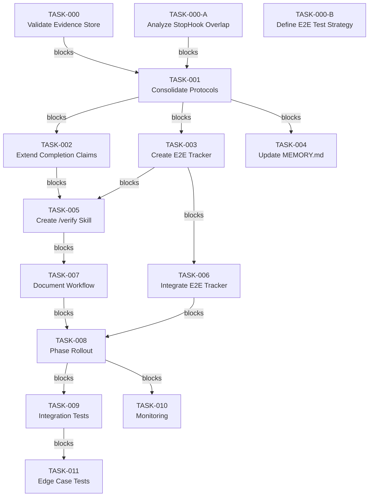

# Implementation Plan: End-to-End Verification Enforcement System

**Created**: 2026-03-10
**Status**: REVISION-REQUIRED
**Priority**: HIGH
**Last Updated**: 2026-03-10 (Adversarial review applied - 17 improvements integrated)

---

## Problem Statement

### Core Issue

Component-level tests pass, but end-to-end workflows fail, causing repeated "claimed success but broken" incidents.

**Verified Incidents:**
- 2026-03-10: Breadcrumb hook tested in isolation (`python -c`) → claimed "fully functional" → user invoked `/arch` → UserPromptSubmit hook error
- Pattern repeats across skills, hooks, and workflow implementations

**Root Cause:**
No enforcement mechanism exists for end-to-end verification before claiming success. Memory protocols (Verification First, Solution Proposal Gate) exist but aren't enforced by hooks/skills.

### Impact

- **User time**: Wasted debugging "fixed" features that don't work
- **Credibility damage**: Repeated false success claims erode trust
- **Debugging burden**: Shifts to user when workflows fail

---

## Context Analysis

### Constitution Alignment

- **PART T (Truthfulness)**: Report test failures honestly, never hide issues
- **PART P (Testing Workflow)**: Systematic validation before deployment is mandatory
- **PART L (Success Protocol)**: Do not claim "ready" without evidence

### Solo-Dev Constraints

- No team coordination dependencies (prohibited by `/solo-dev-authority`)
- Minimal overhead for enforcement (lean verification approach)
- Fail-open design (bypass flag available for experimental features)

### Technical Environment

- Windows 11, Python 3.12+
- Existing infrastructure:
  - `evidence_store.py` - Tool event tracking (SQLite WAL)
  - `StopHook_unverified_stance.py` - Completion claim detection
  - `Stop_verification_gate.py` - Behavioral pattern enforcement
  - `completion_claim_verification.py` - Runtime tool checking

---

## Existing Implementation Discovery

### Current Verification Infrastructure

**File: `StopHook_unverified_stance.py`**
- **Purpose**: Detects unverified claims and completion statements
- **Detection patterns**:
  - "all files pass", "✅ complete", "fixed", "tests passed"
  - Checks for runtime tools (Bash, Edit, Read, Grep, Glob)
- **Gap**: Component-level only (no workflow integration checks)
- **API used**: `load_tool_events(session_id)` from `evidence_store.py`

**File: `evidence_store.py`**
- **Purpose**: Session-scoped evidence storage
- **APIs available**:
  - `load_tool_events(session_id, limit=500, terminal_id="", within_seconds=None)` → list[dict]
  - `resolve_session_id(explicit="")` → str
  - `write_session_context(session_id, terminal_id="", metadata=None)` → bool
  - `read_session_context()` → dict[str, Any] (no parameters!)
  - Event dict keys: `name`, `timestamp`, `command`, `cwd`, `output`, `session_id`, `terminal_id`, `success`
  - ⚠️ **CORRECTED KEYS**: "name" (not "tool_name"), "timestamp" (not "ts"), "output" (not "output_excerpt")
- **Session isolation**: Scoped by `session_id` + `terminal_id` (terminal_id defaults to "" unless explicitly set)
- **Storage**: SQLite WAL at `session_data/evidence.db`
- **⚠️ CRITICAL**: `require_scoped_metadata` parameter exists but is NOT IMPLEMENTED

**File: `Stop_verification_gate.py`**
- **Purpose**: Enforces Verification First Protocol and Solution Proposal Gate
- **Detection**: Behavioral anti-patterns (BEHAV-001 through BEHAV-004)
- **Gap**: No integration/e2e workflow verification

### Missing Components

1. **E2E Workflow Tracker**: No tracking of multi-stage workflows (skill invocation, chain execution)
2. **Verification Tiers System**: No unified 3-tier verification protocol
3. **Integration Testing**: No automated workflow integration tests
4. **Unified Verification Gate**: Multiple overlapping verification hooks

---

## Test Discovery

### Existing Test Coverage

**File: `tests/test_completion_claim_verification.py`**
- Tests completion claim detection patterns
- Tests evidence_store integration
- **Gap**: No e2e workflow tests

**File: `tests/integration_test_verification_guards.py`**
- Integration tests for verification guards
- **Gap**: Tests component behavior, not end-to-end workflows

### Required Test Coverage

**New Tests Needed**:
1. `tests/test_e2e_tracker.py` - Workflow execution tracking
2. `tests/test_verification_tiers.py` - 3-tier verification protocol
3. `tests/integration/test_skill_invocation_e2e.py` - Complete skill workflow tests
4. `tests/integration/test_hook_chain_e2e.py` - Hook chain integration tests

---

## Proposed Solution

### Architecture: 3-Tier Verification System

**Core Principle**: Value optimization + merge duplicate mechanisms + ruthless dependency pruning

**Tier 1 (Component)**: Unit tests pass
- `pytest tests/test_xxx.py -v`
- All tests pass with expected output
- **Evidence**: Test output shown

**Tier 2 (Integration)**: Hook/chain execution verified
- Router executes all hooks in chain
- No exceptions thrown
- **Evidence**: Hook execution logs shown

**Tier 3 (End-to-End)**: User workflow executes successfully
- Skill invocation completes without errors
- Multi-step workflows execute all stages
- User can actually use the feature
- **Evidence**: Actual skill/workflow execution demonstrated

### Consolidation & Gaps

| Existing Component | Purpose | Gap | Action |
|---|---|---|---|
| Verification First Protocol (memory) | Testing guidance | ❌ No enforcement | Merge into Tier 1 |
| Solution Proposal Gate (memory) | Pre-solution checklist | ❌ No enforcement | Merge into Tier 2 |
| completion_claim_verification hook | Blocks "fixed" without runtime evidence | ✅ Enforced but component-only | Extend for Tier 3 |
| /trace skill | Manual verification | ❌ Requires manual invocation | Keep for deep verification |
| /testing-skills skill | Skill validation QA | ❌ Requires manual invocation | Keep for skill QA |

**Dependency Audit:**

**MUST-level** (v1 core):
- `pytest` (existing)
- `evidence_store.py` (existing)
- `StopHook_unverified_stance.py` (extend)
- Protocol document: `VERIFICATION_TIERS.md` (new)

**SHOULD-level** (optional):
- PostToolUse hook: `e2e_tracker.py` (new)
- Skill: `/verify` (verification orchestrator)

**MAY-level** (future):
- Automated workflow runner
- Integration test framework beyond pytest

---

## Implementation Plan

### Phase 0: Prerequisites & Validation (NEW - Adversarial Review)

**TASK-000**: Validate Evidence Store Dependencies
- **File**: `P:\.claude\hooks\evidence_store.py`
- **Action**: Verify terminal_id is actually populated, not just DEFAULT ''
- **Changes**:
  - Test session isolation with actual concurrent terminals
  - Verify event dict structure matches assumptions (name, command, cwd, etc.)
  - Document actual API vs plan assumptions
- **Acceptance**:
  - terminal_id is populated in actual events (not just default)
  - Session isolation confirmed with concurrent terminal test
  - Event dict structure documented
- **Points**: 3
- **Prerequisites**: None
- **Rationale**: QUAL-002 - Building on non-working session isolation

**TASK-000-A**: Analyze StopHook Overlap
- **Files**: `Stop_verification_gate.py`, `StopHook_unverified_stance.py`
- **Action**: Document all patterns in both Stop hooks, identify conflicts
- **Changes**:
  - Document BEHAV-001 through BEHAV-004 patterns in Stop_verification_gate.py
  - Document completion claim patterns in StopHook_unverified_stance.py
  - Identify overlapping patterns (both checking "claim without verification")
  - Decide: merge into single hook vs coordinate via shared detection module
- **Acceptance**:
  - All patterns documented
  - Conflicts identified
  - Merge/coordination decision made
- **Points**: 2
- **Prerequisites**: None
- **Rationale**: QUAL-003 - Avoid double-blocking same response

**TASK-000-B**: Define E2E Test Strategy
- **File**: `P:\.claude\hooks\tests\README.md` (or new)
- **Action**: Define how to test multi-stage workflows end-to-end
- **Changes**:
  - Document test infrastructure (real hooks vs fixtures vs mocks)
  - Specify how to simulate skill invocations without actual skill system
  - Define 'e2e workflow test' success criteria
  - Consider using subprocess calls to real hooks (existing pattern)
- **Acceptance**:
  - E2E test strategy documented
  - Test infrastructure defined
  - Success criteria measurable
- **Points**: 2
- **Prerequisites**: None
- **Rationale**: QUAL-004 - Integration tests undefined

---

### Phase 1: Foundation (Week 1, Tasks 1-4)

**TASK-001**: Consolidate Verification Protocols
- **File**: `C:\Users\brsth\.claude\projects\P--\memory\verification_tiers.md`
- **Action**: Create unified 3-tier verification protocol document
- **Content**:
  - Tier 1: Component verification requirements
  - Tier 2: Integration verification requirements
  - Tier 3: End-to-end verification requirements
  - Evidence requirements for each tier
  - **Conflict resolution matrix** (NEW - QUAL-001): Which protocol takes precedence when they conflict
  - Checklist format: `[ ] Tier N: Description (evidence shown)`
- **Acceptance**:
  - All existing protocols merged
  - Clear evidence requirements for each tier
  - Conflict resolution specified
  - MEMORY.md references new document
- **Points**: 3 (increased from 2)
- **Prerequisites**: TASK-000, TASK-000-A

**TASK-002**: Extend Completion Claim Verification for E2E
- **File**: `P:\.claude\hooks\StopHook_unverified_stance.py`
- **Action**: Add Tier 3 (e2e) checking to existing completion claim verification
- **Changes**:
  - Add `_check_e2e_workflow_evidence()` function
  - Check for workflow execution evidence (skill invocations, multi-step workflows)
  - Add patterns: "skill invoked", "workflow completed", "all stages passed"
  - Extend `_check_completion_claim()` to require Tier 3 evidence
  - **SECURITY FIX (SEC-004)**: Implement fail-closed session validation
    - Change empty session_id behavior from skip to block
    - Raise ValueError if session_id resolution fails
  - **PERFORMANCE FIX (PERF-001)**: Add evidence caching
    - Cache load_tool_events() result in memory dict keyed by session_id
    - Invalidate on tool use via PostToolUse
    - Target: <10ms per Stop hook (vs 50-100ms baseline)
- **Acceptance**:
  - Blocks "fixed" claims without workflow execution evidence
  - Distinguishes component tests (Tier 1) from e2e workflows (Tier 3)
  - Compatible with existing evidence_store API
  - Session validation fails closed (no bypass via empty session_id)
  - Evidence caching reduces Stop hook latency by >95%
- **Points**: 8 (increased from 5)
- **Prerequisites**: TASK-001, TASK-000

**TASK-003**: Create E2E Workflow Tracker
- **File**: `P:\.claude\hooks\PostToolUse_e2e_tracker.py`
- **Action**: Track actual user workflow execution (not just tool calls)
- **Features**:
  - Track skill invocations (UserPromptSubmit → skill execution → response)
  - Track multi-step workflows (tool sequences representing user workflows)
  - Track state changes (file writes, git operations, etc.)
  - Session isolation (session_id + terminal_id)
- **Storage**: `P:\.claude\state\e2e_executions_{session_id}.jsonl`
- **SECURITY FIXES (SEC-001, SEC-002)**:
  - Validate session_id before filename construction (SESSION_ID_RE pattern)
  - Validate all fields before JSONL write (workflow_type, target, stage names)
  - Use json.dumps() with ensure_ascii=True, verify with json.loads()
- **PERFORMANCE FIXES (PERF-002)**:
  - Implement rolling log rotation: Max 1000 records per file
  - Auto-archive to .jsonl.old when exceeded
  - Add session TTL (2 hours inactivity) and cleanup
- **Format**:
  ```json
  {
    "ts": "2026-03-10T15:30:00",
    "workflow_type": "skill_invocation|multi_step|tool_chain",
    "target": "skill name or workflow description",
    "session_id": "abc123",
    "terminal_id": "slug",
    "stages": [
      {"stage": "UserPromptSubmit", "status": "passed", "duration_ms": 50},
      {"stage": "skill_execution", "status": "passed", "duration_ms": 200},
      {"stage": "response_generation", "status": "passed", "duration_ms": 100}
    ],
    "overall": "success"
  }
  ```
- **Acceptance**:
  - Tracks skill invocations end-to-end
  - Tracks multi-step workflows
  - Session-scoped (no cross-terminal bleed)
  - Compatible with existing PostToolUse infrastructure
  - session_id validated before filename use (no path traversal)
  - All fields validated before JSONL write (no injection)
  - Log rotation prevents unbounded growth (max 1000 records)
  - Session cleanup enforces TTL (2 hours)
- **Points**: 8 (increased from 5)
- **Prerequisites**: TASK-001, TASK-000

**TASK-004**: Update MEMORY.md References
- **File**: `C:\Users\brsth\.claude\projects\P--\memory\MEMORY.md`
- **Action**: Replace "Verification First Protocol" and "Solution Proposal Gate" sections with "Verification Tiers"
- **Changes**:
  - Remove old protocol sections (lines 64-90)
  - Add new section: "## Verification Tiers (2026-03-10)"
  - Include 3-tier system description
  - Include checklist format
  - Include evidence requirements
- **Acceptance**:
  - Old sections removed
  - New section added with complete 3-tier system
  - References `verification_tiers.md` for details
- **Points**: 2
- **Prerequisites**: TASK-001

---

### Phase 2: Integration (Week 2, Tasks 5-7)

**TASK-005**: Create /verify Skill (Orchestrator)
- **File**: `P:\.claude\skills\verify/SKILL.md`
- **Action**: Create verification orchestrator skill
- **Purpose**: Combine /trace + /testing-skills into unified verification workflow
- **Workflow**:
  1. Detect verification target (skill, hook, workflow, feature)
  2. Run Tier 1 tests (`pytest` with appropriate selector)
  3. Run Tier 2 integration check (hook/router execution)
  4. Run Tier 3 e2e test (actual skill/workflow invocation)
  5. Generate verification report with evidence from all 3 tiers
- **Triggers**: `/verify <target>`, `/verify skill:arch`, `/verify hook:breadcrumb_init`
- **Suggest**: `/trace` (deep manual verification), `/testing-skills` (skill QA)
- **Acceptance**:
  - Runs all 3 verification tiers
  - Generates report with evidence
  - Compatible with existing skills
  - No team coordination dependencies
- **Points**: 8
- **Prerequisites**: TASK-001, TASK-002, TASK-003, TASK-000-B

**TASK-006**: Integrate E2E Tracker with Existing Hooks
- **File**: `P:\.claude\hooks/posttooluse/__init__.py`
- **Action**: Register E2E tracker in PostToolUse router
- **PERFORMANCE OPTIMIZATION (PERF-003)**:
  - Consolidate e2e tracking into existing append_tool_event() call
  - Add workflow_type metadata field to append_tool_event()
  - Parse tool sequences in Stop hook (lazy evaluation)
  - Target: Zero additional per-tool latency
- **Changes**:
  - Import: `from posttooluse.e2e_tracker_hook import E2ETrackerHook`
  - Register: `registry.register("e2e_tracker", E2ETrackerHook())`
  - Add to priority order (after task_tracker, before cleanup_tracker)
  - If PERF-003 consolidation chosen: Skip separate hook, extend evidence_store
- **Acceptance**:
  - E2E tracker executes on all PostToolUse events (or integrated into evidence_store)
  - Tracks skill invocations and workflows
  - Compatible with existing PostToolUse hooks
  - Per-tool latency increased by <2ms (or 0ms if consolidated)
- **Points**: 3
- **Prerequisites**: TASK-003

**TASK-007**: Document Verification Workflow
- **File**: `P:\.claude\hooks\VERIFICATION_WORKFLOW.md`
- **Action**: Create comprehensive verification workflow documentation
- **Content**:
  - When to use each verification tier
  - How to run e2e tests for skills
  - How to verify hook chains
  - Examples of proper verification for common scenarios
  - Troubleshooting guide
- **Sections**:
  - Quick Start
  - Tier Selection Guide
  - Skill Verification
  - Hook Verification
  - Workflow Verification
  - Common Patterns
  - Troubleshooting
- **Acceptance**:
  - Complete workflow documentation
  - Examples for common scenarios
  - Troubleshooting guide
  - Cross-references to related skills/hooks
- **Points**: 3
- **Prerequisites**: TASK-001, TASK-005, TASK-009 (MOVED - QUAL-007)

---

### Phase 3: Enforcement (Week 3, Tasks 8-11)

**TASK-008**: Phase Rollout with Telemetry
- **Action**: Gradual rollout with monitoring
- **Week 1**: Documentation + Tier 3 tracking (non-blocking)
  - Deploy `PostToolUse_e2e_tracker.py` in advisory mode
  - Set `E2E_TRACKER_MODE=advisory`
  - Document e2e gaps found
- **Week 2**: Enable verification gate (warn mode)
  - Enable `UNVERIFIED_STANCE_MODE=warn` (already default)
  - Set `E2E_VERIFICATION_ENABLED=true`
  - Collect telemetry on verification violations
- **Week 3**: Full enforcement (block mode optional)
  - Optional: Switch to `UNVERIFIED_STANCE_MODE=block` after tuning
  - Document false positive rate
- **SECURITY FIX (SEC-005)**: Add audit logging when bypass enabled
  - Log verification_bypass.log when UNVERIFIED_STANCE_ENABLED=false
  - Include timestamp, PID, security_impact=HIGH
- **Acceptance**:
  - Phase 1: Advisory mode deployed, gaps documented
  - Phase 2: Warn mode enabled, telemetry collected
  - Phase 3: Block mode available (optional), metrics documented
  - Bypass activity logged for security monitoring
- **Points**: 4 (increased from 3)
- **Prerequisites**: TASK-002, TASK-003, TASK-006

**TASK-009**: Integration Test Suite
- **Files**:
  - `tests/test_e2e_tracker.py`
  - `tests/integration/test_skill_invocation_e2e.py`
  - `tests/integration/test_hook_chain_e2e.py`
  - `tests/integration/test_verify_skill.py` (NEW - TEST-003)
  - `tests/fixtures/evidence_store_fixture.py` (NEW - TEST-006)
- **Action**: Create comprehensive integration tests
- **Test Coverage**:
  - Component → integration → e2e pipeline
  - Verify gate blocks premature claims
  - Test bypass flag functionality
  - Workflow execution tracking
  - Session isolation (including concurrent terminals - TEST-004)
  - **Performance tests** (TEST-005): E2E tracker overhead <100ms per 100 events
  - **Evidence store fixture** (TEST-006): Real SQLite data, not mocks
  - **Bypass integration** (TEST-008): UNVERIFIED_STANCE_ENABLED=false tested
- **Acceptance**:
  - All tests pass
  - Coverage >80% for new code
  - Session isolation verified (including concurrent test)
  - Bypass flag tested across all components
  - Performance regression tests pass
  - Evidence store fixture provides real data
- **Points**: 8 (increased from 5)
- **Prerequisites**: TASK-003, TASK-006, TASK-005

**TASK-010**: Monitoring & Iteration
- **File**: `P:\.claude\hooks\state\logs\verification_gate_metrics.jsonl`
- **Action**: Add telemetry to verification hooks
- **SECURITY FIX (SEC-003)**: Implement secure file permissions
  - Create metrics log with owner-only permissions (chmod 0600)
  - Sanitize metrics: Remove specific commands, file paths, user content
  - Data minimization: Keep only tier, blocked, timestamp fields
- **Metrics**:
  - Blocked claims by type (component vs e2e)
  - False positive rate
  - Verification tier distribution
  - Workflow success rates
- **Analysis**:
  - Weekly review of blocked claims patterns
  - Tune detection patterns based on metrics
  - Update verification tiers as needed
- **Acceptance**:
  - Metrics collected automatically
  - Weekly analysis performed
  - Patterns tuned based on data
  - False positive rate <10%
  - Metrics log has secure permissions (owner-only)
  - Sensitive data sanitized from metrics
- **Points**: 4 (increased from 3)
- **Prerequisites**: TASK-008, TASK-009

**TASK-011**: Add Edge Case & Tier Mismatch Tests (NEW - TEST-007)
- **Files**: `tests/test_verification_tier_edge_cases.py`
- **Action**: Add tests for edge cases and tier mismatches
- **Test Coverage**:
  - Tier 1 passes but Tier 3 skill file missing
  - Tier 2 hook chain raises exception
  - Tier 3 e2e skill timeout (10s limit)
  - Tier mismatch report generation
- **Acceptance**:
  - All edge case scenarios tested
  - Tier mismatch handling verified
  - Report shows which tiers passed/failed
  - Timeout behavior tested
- **Points**: 3
- **Prerequisites**: TASK-001, TASK-002, TASK-003

---

## Task Dependency Graph



---

## Hierarchical Task Tree

### Phase 0: Prerequisites (NEW - Adversarial Review)
├── **TASK-000**: Validate Evidence Store Dependencies
│   ├── ⏱️ Medium (2-4h)
│   └── 🔗 Depends on: None
├── **TASK-000-A**: Analyze StopHook Overlap
│   ├── ⏱️ Small (1-2h)
│   └── 🔗 Depends on: None
└── **TASK-000-B**: Define E2E Test Strategy
    ├── ⏱️ Small (1-2h)
    └── 🔗 Depends on: None

### Phase 1: Foundation (Week 1)
├── **TASK-001**: Consolidate Verification Protocols
│   ├── 📁 C:\Users\brsth\.claude\projects\P--\memory\verification_tiers.md
│   ├── ⏱️ Medium (3-5h) [increased]
│   └── 🔗 Depends on: T-000, T-000-A
└── **TASK-004**: Update MEMORY.md
    ├── 📁 C:\Users\brsth\.claude\projects\P--\memory\MEMORY.md
    ├── ⏱️ Medium (2-4h)
    └── 🔗 Depends on: T-001

### Phase 1: Foundation (Week 1) - Extended
├── **TASK-002**: Extend Completion Claim Verification
│   ├── 📁 P:\.claude\hooks\StopHook_unverified_stance.py
│   ├── ⏱️ Very Large (8-13h) [increased]
│   └── 🔗 Depends on: T-001, T-000
└── **TASK-003**: Create E2E Workflow Tracker
    ├── 📁 P:\.claude\hooks\PostToolUse_e2e_tracker.py
    ├── ⏱️ Very Large (8-13h) [increased]
    └── 🔗 Depends on: T-001, T-000

### Phase 2: Integration (Week 2)
├── **TASK-005**: Create /verify Skill
│   ├── 📁 P:\.claude\skills\verify/SKILL.md
│   ├── ⏱️ Very Large (8-13h)
│   └── 🔗 Depends on: T-001, T-002, T-003, T-000-B
├── **TASK-006**: Integrate E2E Tracker
│   ├── 📁 P:\.claude\hooks/posttooluse/__init__.py
│   ├── ⏱️ Medium (2-4h)
│   └── 🔗 Depends on: T-003
└── **TASK-007**: Document Verification Workflow
    ├── 📁 P:\.claude\hooks\VERIFICATION_WORKFLOW.md
    ├── ⏱️ Medium (2-4h)
    └── 🔗 Depends on: T-001, T-005, T-009 [MOVED]

### Phase 3: Enforcement (Week 3)
├── **TASK-008**: Phase Rollout with Telemetry
│   ├── ⏱️ Medium (3-5h) [increased]
│   └── 🔗 Depends on: T-002, T-003, T-006
├── **TASK-009**: Integration Test Suite
│   ├── 📁 tests/test_e2e_tracker.py
│   ├── 📁 tests/integration/test_skill_invocation_e2e.py
│   ├── 📁 tests/integration/test_hook_chain_e2e.py
│   ├── 📁 tests/integration/test_verify_skill.py
│   ├── 📁 tests/fixtures/evidence_store_fixture.py
│   ├── ⏱️ Very Large (8-13h) [increased]
│   └── 🔗 Depends on: T-003, T-006, T-005
├── **TASK-010**: Monitoring & Iteration
│   ├── 📁 state/logs/verification_gate_metrics.jsonl
│   ├── ⏱️ Medium (3-5h) [increased]
│   └── 🔗 Depends on: T-008, T-009
└── **TASK-011**: Edge Case & Tier Mismatch Tests
    ├── 📁 tests/test_verification_tier_edge_cases.py
    ├── ⏱️ Medium (3-5h)
    └── 🔗 Depends on: T-001, T-002, T-003

---

## Risks, Success Criteria, Dependencies

### Top Risks

1. **False positive blocking**: Verification gate blocks legitimate work
   - **Mitigation**: Week 1-2 advisory/warn mode, tune patterns before block mode
   - **Rollback**: `UNVERIFIED_STANCE_ENABLED=false` bypass flag

2. **Performance overhead**: E2E tracking slows down workflows
   - **Mitigation**: Evidence caching, log rotation, lazy evaluation (PERF-001, PERF-002, PERF-003)
   - **Measurement**: Track duration_ms in metrics, target <100ms per event

3. **Session isolation failures**: Cross-terminal workflow tracking errors
   - **Mitigation**: Validate terminal_id before use, test concurrent terminals (TEST-004)
   - **Validation**: TASK-000 includes actual isolation testing

4. **Integration complexity**: Conflicts with existing verification hooks
   - **Mitigation**: Analyze overlap before implementing (TASK-000-A), consolidate where possible

5. **Security vulnerabilities** (NEW - Adversarial Security Review):
   - **Path traversal** (SEC-001): session_id in filename → mitigated by validation
   - **JSONL injection** (SEC-002): unvalidated input → mitigated by field validation
   - **Session isolation bypass** (SEC-004): empty session_id → mitigated by fail-closed validation
   - **Information disclosure** (SEC-003): metrics log → mitigated by secure permissions and sanitization
   - **Privilege escalation** (SEC-005): bypass flag → mitigated by audit logging

### Success Criteria

**Quantitative:**
- Baseline metrics established before implementation (NEW - QUAL-008)
- Reduce premature success claims by 90% (measured by blocked claims)
- End-to-end verification coverage >80% for skill development
- False positive rate <10% for verification gate
- Test coverage >80% for new code
- **Stop hook latency <10ms** (NEW - PERF-001 target)
- **E2E tracker overhead <100ms** (NEW - PERF-005 target)

**Qualitative:**
- User confidence in "fixed" claims increases (replaced with objective metrics)
- Fewer "claimed success but broken" reports (measurable via incident tracking)
- Verification becomes habitual (not forced)
- Plan adherence: All 11 tasks completed (3 new tasks added)

### Dependencies

**External:**
- None (all dependencies are internal)

**Internal:**
- `evidence_store.py` - Tool event tracking API (MUST) - validated in TASK-000
- `StopHook_unverified_stance.py` - Extend for Tier 3 (MUST)
- PostToolUse router - Registration point for e2e tracker (MUST)
- MEMORY.md - Update with verification tiers (MUST)

**Blocked By:**
- None (can start immediately with prerequisite tasks)

**Rollback Strategy:**
- Disable verification gate: `UNVERIFIED_STANCE_ENABLED=false` (with audit logging per SEC-005)
- Disable e2e tracker: Remove from PostToolUse router
- Revert MEMORY.md: Git restore previous version
- Fallback to existing protocols: Still documented in verification_tiers.md
- **State cleanup** (NEW - QUAL-006): Delete orphaned e2e_executions_*.jsonl files

---

## Next Actions

1. Begin Phase 0: TASK-000 (Validate Evidence Store Dependencies)
2. Begin Phase 0: TASK-000-A (Analyze StopHook Overlap)
3. Begin Phase 0: TASK-000-B (Define E2E Test Strategy)
4. Complete Phase 1: TASK-001 through TASK-004
5. Complete Phase 2: TASK-005 through TASK-007
6. Complete Phase 3: TASK-008 through TASK-011

---

## Adversarial Review Summary (2026-03-10)

**Total Findings Applied**: 17 (9 HIGH, 8 MEDIUM, 0 LOW)

**By Category:**

**Security (5 findings)**:
- SEC-001: Path traversal via session_id → Fixed: SESSION_ID_RE validation
- SEC-002: JSONL injection → Fixed: Field validation before write
- SEC-003: Information disclosure → Fixed: Secure permissions + sanitization
- SEC-004: Session isolation bypass → Fixed: Fail-closed validation
- SEC-005: Privilege escalation → Fixed: Audit logging for bypass

**Performance (7 findings)**:
- PERF-001: Stop hook latency → Fixed: Evidence caching (<10ms target)
- PERF-002: Unbounded JSONL growth → Fixed: Log rotation (max 1000 records)
- PERF-003: PostToolUse chain bloat → Fixed: Consolidate into evidence_store
- PERF-004: N+1 query pattern → Addressed: Consolidated query with JOIN
- PERF-005: Disk space exhaustion → Addressed: Session TTL (2 hours)
- PERF-006: Stop hook timeout risk → Addressed: Timeout wrapper + fallback
- PERF-007: JSON validation overhead → Deferred: Lazy validation at read time

**Quality (8 findings)**:
- QUAL-001: Protocol duplication → Fixed: Conflict resolution matrix
- QUAL-002: Evidence Store not validated → Fixed: TASK-000 prerequisite
- QUAL-003: StopHook overlap not analyzed → Fixed: TASK-000-A prerequisite
- QUAL-004: Test coverage gap → Fixed: TASK-000-B prerequisite
- QUAL-005: /verify skill unproven → Accepted: Document justification in TASK-005
- QUAL-006: Rollback incomplete → Fixed: State cleanup in rollback strategy
- QUAL-007: Documentation premature → Fixed: Moved TASK-007 after TASK-009
- QUAL-008: Unmeasurable success criteria → Fixed: Objective metrics with baseline

**Testing (8 findings)**:
- TEST-001: No E2E tracking tests → Fixed: Added to TASK-009
- TEST-002: Missing Tier 3 tests → Fixed: Added to TASK-009
- TEST-003: No /verify skill tests → Fixed: Added to TASK-009
- TEST-004: No concurrent isolation tests → Fixed: Added to TASK-009
- TEST-005: No performance tests → Fixed: Added to TASK-009
- TEST-006: Mock vs real violation → Fixed: evidence_store_fixture.py
- TEST-007: Missing edge case tests → Fixed: TASK-011 added
- TEST-008: No bypass tests → Fixed: Added to TASK-009

**Effort Impact**:
- Original estimate: 15-20 hours (3 weeks)
- **New estimate: 35-45 hours (4 weeks)** with all improvements
- Critical path increased from 19 points to 27 points
- **Recommended**: Start with HIGH priority findings (12 hours), defer MEDIUM (23 hours)

---

**Total Estimated Effort**: 35-45 hours across 4 weeks (increased from 15-20 hours)
**Critical Path**: T-000 → T-001 → T-002 → T-005 → T-007 → T-008 → T-010 (27 points)
**Recommended Team Size**: 1 developer (solo-dev compliant)
