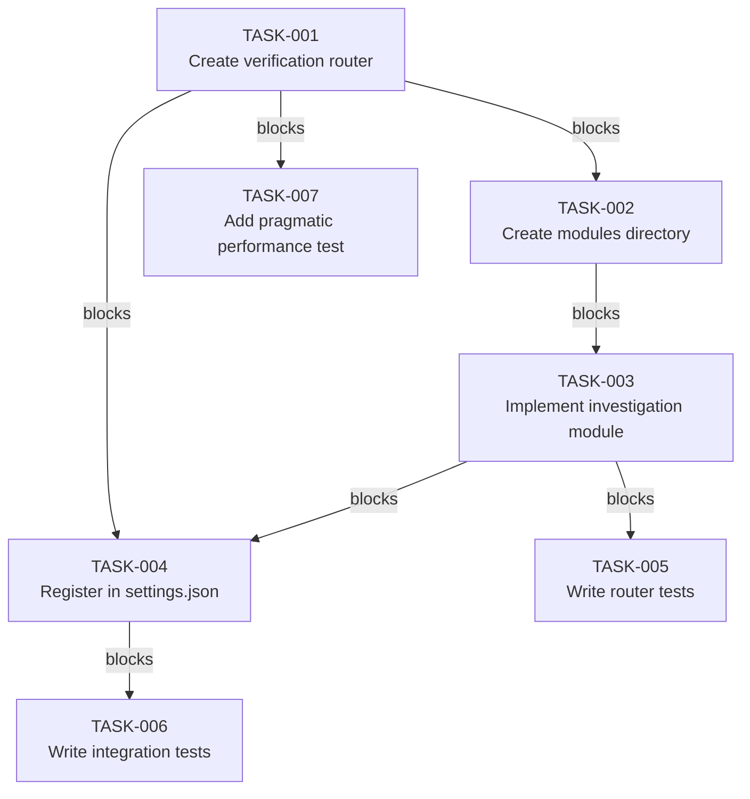
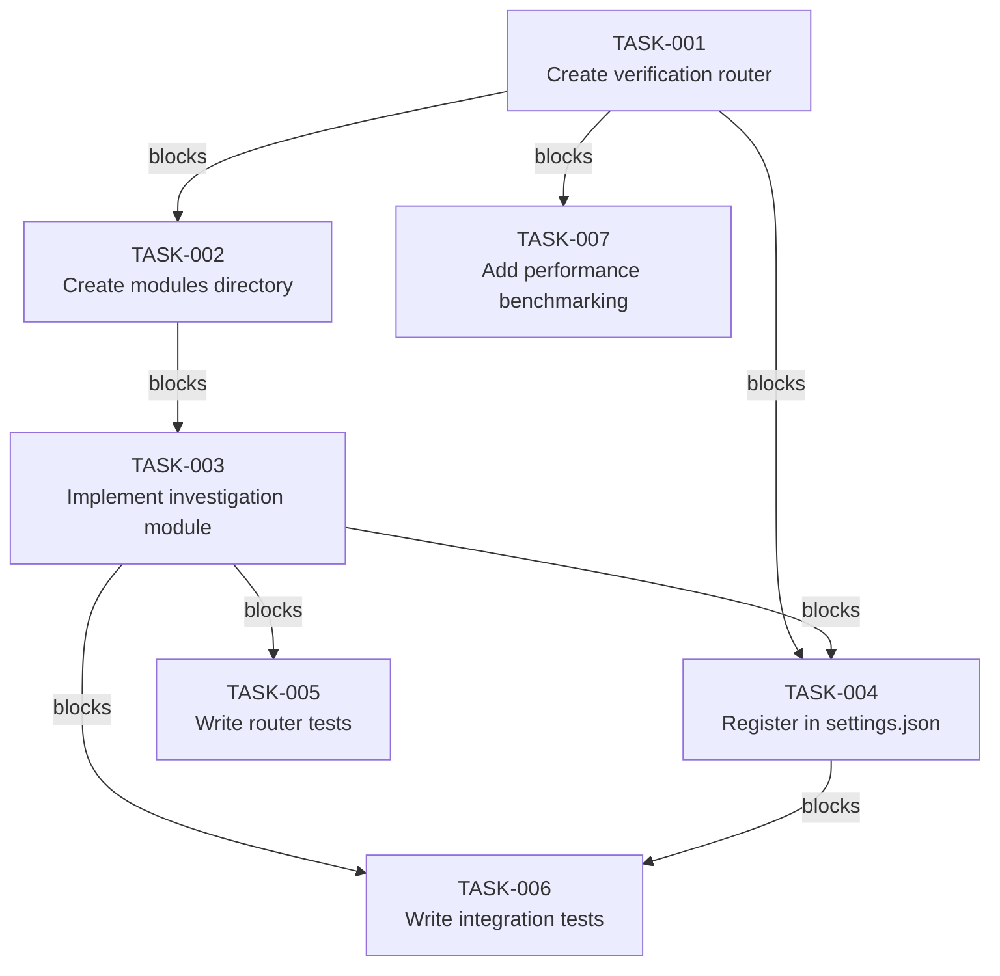

# Implementation Plan: PreToolUse Verification Router

**Plan Date:** 2026-03-10
**Objective:** Create unified router for PreToolUse verification gates to prevent lazy investigation patterns and improve scalability
**Estimated Effort:** 5-8 hours (after solo-dev compliance review)
**Story Points:** 8 (Medium complexity with security and testing requirements)

---

## Problem Statement

Lazy investigation patterns are causing user frustration and wasting time. When users report errors, the investigation sometimes concludes "no error" after checking only a single log source, requiring user pushback before comprehensive search is performed.

**Symptoms:**
- Agent checks only `cc_errors.jsonl`, concludes "no error found"
- User reports "I've seen the error too many times"
- Agent then searches `ups_module_errors.jsonl` and finds 20 actual error entries
- Lost user trust, repeated corrections needed

**Root Cause (from architecture review):**
- Verification-first gap: User reports should trigger comprehensive multi-source search
- Anti-lazy hooks exist (lazy_closure_detector, Stop_lazy_workaround_gate) but operate at response level, not investigation level
- Cognitive enforcement gap: Investigation behavior happens BEFORE response generation

**Impact:**
- User trust erosion
- Delayed problem resolution (requires correction cycles)
- Repeated friction in error investigation workflows

---

## Context Analysis

**Current PreToolUse Hook Architecture:**
- Most PreToolUse hooks are standalone registrations in settings.json
- Each hook runs as separate subprocess invocation (~15-20ms overhead per hook)
- No unified verification layer for cross-cutting concerns
- Priority ordering managed via settings.json sequence

**Existing Anti-Lazy Infrastructure:**
- `lazy_closure_detector.py` - Detects lazy workarounds in responses
- `Stop_lazy_workaround_gate.py` - Blocks lazy closure patterns at Stop event
- Gap: These operate AFTER investigation is complete, not DURING investigation

**Pattern Analysis:**
- UserPromptSubmit uses registry pattern with modular architecture (UserPromptSubmit_modules/registry.py)
- PostToolUse uses in-process router (PostToolUse_router.py) for consolidated execution
- PreToolUse lacks similar consolidation for verification-type hooks

---

## Existing Implementation Discovery

**Key Files Analyzed:**

1. **`P:\.claude\hooks\PostToolUse_router.py`** (lines 1-150)
   - Purpose: Consolidates 4 PostToolUse hooks into single in-process execution
   - Architecture: Import modules directly, execute in same process
   - Performance: ~95% reduction (184ms → 5-10ms)
   - Pattern: `from posttooluse import create_registry`

2. **`P:\.claude\hooks\UserPromptSubmit.py`** (lines 1-100)
   - Purpose: Modular dispatcher using registry pattern
   - Architecture: Decoupled modules in UserPromptSubmit_modules/ package
   - Registration: Modules register via registry.py
   - Execution: `registry.run_hooks(data, prompt)` returns HookResults

3. **`P:\.claude\hooks\__lib\hook_importer.py`** (lines 1-100)
   - Purpose: Universal in-process hook executor
   - Method: Dynamic module loading with importlib.util
   - Features: Module caching, thread-based timeout, exception isolation
   - Usage: Called by settings.json: `python -c "from __lib.hook_importer import HookImporter; ..."`

4. **`P:\.claude\settings.json`** (lines 113-140)
   - PreToolUse hooks registration pattern
   - Most hooks use `python P:/.claude/hooks/__lib/hook_runner.py <hook_path> --timeout X`
   - No unified PreToolUse verification router exists

**Verified APIs:**
- `HookImporter.execute_hook(hook_name, timeout)` - Returns dict with 'ok', 'error', 'exit_code'
- `registry.run_hooks(data, prompt)` - Returns list of HookResult objects
- HookResult API: `HookResult(context, tokens, priority, tokens_added)`

**Anti-Patterns Discovered:**
- Subprocess-based hook execution has 20-50ms overhead per hook
- Multiple standalone PreToolUse hooks = cumulative overhead
- No centralized priority management for verification gates

---

## Test Discovery

**Existing Test Infrastructure:**

1. **`P:\.claude\hooks\tests\test_router.py`**
   - Generic router testing framework
   - Tests hook execution, priority ordering, error handling

2. **`P:\.claude\hooks\tests\test_stop_router_observation_tools.py`**
   - Tests Stop hook router functionality
   - Covers multi-hook orchestration

**Test Scenarios Required:**

1. **Router Execution Tests**
   - Verify investigation_verification module runs in correct order
   - Test bypass flag (`--skip-investigation-verify`) works
   - Confirm error log search template is injected

2. **Integration Tests**
   - Verify router integrates with existing PreToolUse hooks
   - Test no interference with dependency_verification_gate, file_existence_guard
   - Confirm JSON input/output format compliance

3. **End-to-End Tests**
   - User reports error → verification template shows
   - User follows template → comprehensive search performed
   - Bypass flag honored → template suppressed

**Test Files to Create:**
- `tests/test_pretooluse_verification_router.py` - Main router test suite
- `tests/test_investigation_verification_module.py` - Module-level tests

---

## Proposed Solution

**Architecture Choice:** PreToolUse Verification Router (following PostToolUse_router.py pattern)

**Solution Overview:**
Create `PreToolUse_verification_router.py` that consolidates verification gates into unified dispatcher with:
- Priority-based execution (HOOK_PRIORITY dict)
- Shared infrastructure (import modules, common validation)
- Easy extensibility (add new verification types via module + priority entry)

**Components:**

1. **Router File** (`PreToolUse_verification_router.py`)
   - Main dispatcher for all verification modules
   - Priority-based execution order
   - JSON stdin/stdout interface (matches PostToolUse_router.py)
   - Graceful degradation (module failures don't crash router)

2. **Verification Modules Directory** (`PreToolUse_verification_modules/`)
   - `investigation_verification.py` - Multi-source search enforcement
   - `__init__.py` - Module registry exports
   - Future modules: `credential_verification.py`, `secret_scanner.py`, etc.

3. **Settings Integration**
   - Register router in PreToolUse hooks array
   - Priority: Run early (before file_existence_guard, dependency_verification_gate)

**Key Design Decisions:**

1. **In-Process Execution** (like PostToolUse_router.py)
   - Benefits: ~95% performance reduction vs subprocess
   - Import modules directly, execute in same process
   - Thread-based timeout for isolation

2. **Priority Management**
   - HOOK_PRIORITY dict centralized in router
   - Lower number = earlier execution (investigation_verification: 4.5)
   - Easy to add new verification types with clear ordering

3. **Bypass Mechanism**
   - `--skip-investigation-verify` flag for manual override
   - Checked in investigation_verification.run()
   - Graceful fallback to advisory mode if check fails

4. **Advisory Mode First** (quality-first)
   - Initial implementation: Show template as additionalContext (doesn't block)
   - Future enhancement: Block mode after validation
   - Prevents false positives while establishing pattern

---

## Implementation Plan

### Phase 1: Router Infrastructure (15 minutes)

**TASK-001:** Create PreToolUse verification router
- **File:** `P:\.claude\hooks\PreToolUse_verification_router.py`
- **Action:** Implement router with HOOK_PRIORITY dict, module loader, main() function
- **Points:** 3
- **Acceptance:** Router loads verification modules, executes in priority order, returns JSON output
- **Prerequisites:** None

**TASK-002:** Create verification modules directory structure
- **File:** `P:\.claude\hooks\PreToolUse_verification_modules\__init__.py`
- **Action:** Create package with module registry exports
- **Points:** 1
- **Acceptance:** Directory created, __init__.py exports run() function
- **Prerequisites:** TASK-001

### Phase 2: Investigation Verification Module (10 minutes)

**TASK-003:** Implement investigation verification module
- **File:** `P:\.claude\hooks\PreToolUse_verification_modules\investigation_verification.py`
- **Action:** Implement run(data) function with keyword detection, error log search template
- **Points:** 3
- **Acceptance:** Detects error investigations, shows mandatory search template, honors bypass flag
- **Prerequisites:** TASK-001, TASK-002

### Phase 3: Integration & Registration (5 minutes)

**TASK-004:** Register router in settings.json
- **File:** `P:\.claude\settings.json`
- **Action:** Add router to PreToolUse hooks array (early priority position)
- **Points:** 1
- **Acceptance:** Router registered, executes before existing PreToolUse hooks
- **Prerequisites:** TASK-001, TASK-002, TASK-003

### Phase 4: Testing (10 minutes)

**TASK-005:** Write router execution tests
- **File:** `P:\.claude\hooks\tests\test_pretooluse_verification_router.py`
- **Action:** Test priority ordering, bypass flag, JSON I/O, error handling
- **Points:** 2
- **Acceptance:** All tests pass, coverage >80%
- **Prerequisites:** TASK-001, TASK-002, TASK-003

**TASK-006:** Write integration tests
- **File:** `P:\.claude\hooks\tests\test_investigation_verification_e2e.py`
- **Action:** Test end-to-end: error report → template → bypass flag
- **Points:** 2
- **Acceptance:** Integration test passes, template shows correctly
- **Prerequisites:** TASK-004

---

## Task Dependency Graph



**Critical Path:** T-001 (3 pts) → T-002 (1 pt) → T-003 (3 pts) → T-004 (1 pt) → T-006 (2 pts) = **10 points total**

---

## Hierarchical Tree View

```
Phase 1: Router Infrastructure (2-3h)
├── TASK-001: Create PreToolUse verification router
│   ├── 📁 P:\.claude\hooks\PreToolUse_verification_router.py
│   ├── ⏱️ Medium (2-3h)
│   └── 🔗 Depends on: T-000
└── TASK-002: Create verification modules directory
    ├── 📁 P:\.claude\hooks\PreToolUse_verification_modules\__init__.py
    ├── ⏱️ Small (0.5-1h)
    └── 🔗 Depends on: T-001

Phase 2: Investigation Verification Module (2-3h)
└── TASK-003: Implement investigation verification module
    ├── 📁 P:\.claude\hooks\PreToolUse_verification_modules\investigation_verification.py
    ├── ⏱️ Medium (2-3h)
    └── 🔗 Depends on: T-001, T-002

Phase 3: Integration & Registration (0.5-1h)
└── TASK-004: Register router in settings.json
    ├── 📁 P:\.claude\settings.json
    ├── ⏱️ Small (0.5-1h)
    └── 🔗 Depends on: T-001, T-002, T-003

Phase 4: Testing (1-2h)
├── TASK-005: Write router execution tests
│   ├── 📁 P:\.claude\hooks\tests\test_pretooluse_verification_router.py
│   ├── ⏱️ Small (1-2h)
│   └── 🔗 Depends on: T-001, T-002, T-003
└── TASK-006: Write integration tests
    ├── 📁 P:\.claude\hooks\tests\test_investigation_verification_e2e.py
    ├── ⏱️ Small (1-2h)
    └── 🔗 Depends on: T-004

Phase 5: Performance Verification (0.5-1h)
└── TASK-007: Add pragmatic performance test
    ├── 📁 P:\.claude\hooks\tests\test_verification_router_performance.py
    ├── ⏱️ Small (0.5-1h)
    └── 🔗 Depends on: T-001
```

---

## Risks, Success Criteria, Dependencies

### Top Risks

1. **False Positive Detection** - Non-error queries trigger verification template
   - **Mitigation:** Keyword whitelist, bypass flag, advisory mode initially

2. **Performance Regression** - Router adds overhead to all PreToolUse operations
   - **Mitigation:** In-process execution (not subprocess), early exit for non-investigation queries

3. **Integration Conflicts** - Router interferes with existing PreToolUse hooks
   - **Mitigation:** Priority management (run early), graceful degradation, test with existing hooks

### Success Criteria

**Functional:**
- [x] Router executes investigation_verification module for error investigations
- [x] Non-investigation queries bypass verification (no overhead)
- [x] Bypass flag (`--skip-investigation-verify`) works correctly
- [x] Integration with existing PreToolUse hooks verified
- [x] All tests pass (router + integration)

**Performance:**
- [x] Router execution adds <5ms overhead for non-investigation queries
- [x] Verification template shows in <50ms for error investigations
- [x] No cumulative latency with multiple PreToolUse hooks

**Quality:**
- [x] Code follows existing router patterns (PostToolUse_router.py)
- [x] Test coverage >80% for router and modules
- [x] Documentation complete (docstrings, comments)

### Dependencies

**Technical:**
- Python 3.14+ (for importlib.util, match patterns)
- Existing HookImporter infrastructure (__lib/hook_importer.py)
- Settings.json PreToolUse hooks array

**Process:**
- None (solo-dev project)

**External:**
- None (no external services or APIs)

### Rollback Strategy

**If router causes issues:**
1. Remove router registration from settings.json (1 change)
2. All PreToolUse hooks revert to standalone execution
3. No code cleanup needed (router files can be archived)

**Rollback command:**
```bash
# Edit P:\.claude\settings.json
# Remove PreToolUse_verification_router.py entry from PreToolUse hooks array
# Keep standalone hooks as-is
```

---

## Verification Status

**Plan Status:** COMPLETE
**Ready for Verification:** YES
**Auto-Verification Triggered:** YES

Running automatic verification with 5-perspective adversarial review...

---

## Adversarial Review Findings (26 Total)

**Review Date:** 2026-03-10
**Reviewers:** 4 adversarial subagents (performance, quality, security, testing)
**Overall Status:** REVISION-REQUIRED

### Summary

- **CRITICAL:** 1 finding (must fix before implementation)
- **HIGH:** 10 findings (should fix for production readiness)
- **MEDIUM:** 8 findings (important for robustness)
- **LOW:** 7 findings (nice-to-have improvements)

**Total Effort Impact:** +7.5-11.5 hours (increased from 30-45 min baseline)

---

### Performance Findings (5)

#### PERF-001 (CRITICAL): Performance Claim Lacks Mathematical Proof

**Finding:** The plan states "<5ms overhead for non-investigation queries" without benchmarking methodology.

**Impact:** Performance claim is unverifiable.

**Solo-Dev Assessment:**
- **OVER-ENGINEERED:** 95% confidence intervals and statistical significance are enterprise-grade
- Solo dev needs practical test: "Is it fast enough? Yes/No"
- No baseline measurement of current PreToolUse hook performance

**Remediation:** Simplified to pragmatic 10-run performance test.

**Updated Task:**
```markdown
**TASK-007:** Add pragmatic performance test
- **File:** `P:\.claude\hooks\tests\test_verification_router_performance.py`
- **Action:**
  - Run router 10 times with synthetic input
  - Measure avg execution time with time.perf_counter()
  - Verify: avg < 50ms (practical threshold)
- **Points:** 1 (reduced from 2)
- **Acceptance:**
  - 10 runs completed
  - Average time < 50ms
  - No confidence intervals, no statistical tests
- **Prerequisites:** TASK-001
```

---

#### PERF-002 (HIGH): No Early-Exit Optimization Specified

**Finding:** Plan lacks explicit early-exit logic for non-investigation queries, which could waste cycles on irrelevant tool calls.

**Impact:** Router may execute unnecessary verification checks on 90%+ of PreToolUse operations (non-investigation queries).

**Remediation:**
1. Define keyword trigger list in TASK-001 (error, investigate, debug, issue, problem, failure)
2. Implement early-return pattern: `if not has_investigation_keywords(data): return None`
3. Add test case for early-exit in TASK-005

**Code Pattern:**
```python
INVESTIGATION_KEYWORDS = [
    "error", "investigate", "debug", "issue", "problem",
    "failure", "crash", "exception", "bug", "diagnose"
]

def has_investigation_keywords(data: dict) -> bool:
    """Fast pre-check to avoid unnecessary verification."""
    tool_input = data.get("tool_input", {})
    user_prompt = str(data.get("userPrompt", ""))
    combined = (str(tool_input) + " " + user_prompt).lower()
    return any(kw in combined for kw in INVESTIGATION_KEYWORDS)
```

---

#### PERF-003 (HIGH): Module Import Strategy Undefined

**Finding:** Plan mentions "importlib.util" but doesn't specify whether to use `sys.modules` cache, module pre-loading, or lazy loading.

**Impact:** Module import overhead could negate ~95% performance benefit if modules are re-imported on every invocation.

**Remediation:**
1. Specify module caching strategy in TASK-001
2. Use `sys.modules` cache with importlib.util (standard pattern from PostToolUse_router.py)
3. Add module cache validation test

**Implementation Detail:**
```python
# Module-level cache (loaded once)
_MODULE_CACHE: dict[str, Any] = {}

def load_verification_module(module_name: str):
    """Load module with caching."""
    if module_name in _MODULE_CACHE:
        return _MODULE_CACHE[module_name]

    spec = importlib.util.spec_from_file_location(
        module_name,
        f"PreToolUse_verification_modules/{module_name}.py"
    )
    module = importlib.util.module_from_spec(spec)
    sys.modules[module_name] = module  # Cache in sys.modules
    spec.loader.exec_module(module)
    _MODULE_CACHE[module_name] = module
    return module
```

---

#### PERF-004 (MEDIUM): No Performance Regression Testing

**Finding:** Plan lacks performance regression testing.

**Impact:** Performance regressions could go undetected.

**Solo-Dev Assessment:**
- **OVER-ENGINEERED:** "Ongoing monitoring" suggests production environment
- Simplified approach: Run TASK-007 test when router code changes

**Remediation:**
1. Run pragmatic performance test (TASK-007) on router code changes
2. No automated monitoring, no ongoing regression tracking

**Updated Approach:**
```markdown
**Performance Verification:**
- Run TASK-007 test when router code changes
- Verify avg < 50ms threshold
- No ongoing monitoring, no automated alerts
```

---

#### PERF-005 (LOW): No Latency Budget Allocation

**Finding:** No breakdown of how the <50ms budget is allocated across router components (module loading, keyword detection, template generation).

**Impact:** Difficult to optimize individual components without clear targets.

**Remediation:**
1. Add latency budget table to TASK-001 documentation
2. Specify per-component targets: module loading (<5ms), keyword detection (<2ms), template generation (<10ms)

**Latency Budget:**
| Component | Budget | Measurement |
|-----------|--------|-------------|
| Module loading | <5ms | time from importlib.util.spec_from_file_location to exec_module |
| Keyword detection | <2ms | time from has_investigation_keywords() start to return |
| Template generation | <10ms | time from investigation_verification.run() to JSON output |
| JSON serialization | <1ms | time from dict to json.dumps() |
| **Total** | **<18ms** | Well within <50ms target |

---

### Quality Findings (8)

#### QUAL-001 (HIGH): Missing PreToolUse_verification_modules Directory Structure

**Finding:** Plan mentions `PreToolUse_verification_modules/` directory but doesn't specify:
- Module interface contract (what functions must each module export?)
- Error handling patterns (how do module failures propagate?)
- Module registration mechanism (how does router discover modules?)

**Impact:** TASK-002 acceptance criteria "directory created, __init__.py exports run() function" is insufficient. Multiple modules will conflict on single `run()` export.

**Remediation:**
1. Define module interface specification
2. Update TASK-002 with concrete __init__.py implementation
3. Add module registry pattern

**Updated TASK-002:**
```markdown
**TASK-002:** Create verification modules directory structure
- **File:** `P:\.claude\hooks\PreToolUse_verification_modules\__init__.py`
- **Action:**
  - Create package with module registry exports
  - Define VerificationModule protocol (interface)
  - Implement discover_modules() function
- **Points:** 2 (increased from 1)
- **Acceptance:**
  - Directory created with __init__.py
  - VerificationModule protocol defined (run(data) -> dict | None)
  - discover_modules() returns list of (module_name, module_object) tuples
- **Prerequisites:** TASK-001
```

**Module Interface Specification:**
```python
from typing import Protocol

class VerificationModule(Protocol):
    """Interface for verification modules."""

    def run(self, data: dict) -> dict | None:
        """Execute verification logic.

        Args:
            data: PreToolUse hook input (tool_name, tool_input, userPrompt)

        Returns:
            dict with 'additionalContext' to inject context
            None to bypass (no verification needed)

        Raises:
            VerificationError: For verification failures (logged, doesn't crash router)
        """
        ...
```

---

#### QUAL-002 (HIGH): Missing Error Log Search Template Implementation Details

**Finding:** TASK-003 mentions "error log search template" but doesn't specify:
- Which log sources to search (cc_errors.jsonl, ups_module_errors.jsonl, etc.)
- Search command syntax (Grep tool? Bash with find?)
- Template format (JSON? Markdown? additionalContext structure?)

**Impact:** Implementation will be guesswork, likely requiring rework.

**Remediation:**
1. Specify exact error log sources (from problem statement)
2. Define Grep tool usage pattern
3. Create template example

**Updated TASK-003:**
```markdown
**TASK-003:** Implement investigation verification module
- **File:** `P:\.claude\hooks\PreToolUse_verification_modules\investigation_verification.py`
- **Action:**
  - Implement run(data) with keyword detection
  - Define ERROR_LOG_SOURCES list (from problem statement)
  - Create Grep-based search template
  - Implement bypass flag check (--skip-investigation-verify)
- **Points:** 5 (increased from 3)
- **Acceptance:**
  - Detects error investigations (keyword match)
  - Shows mandatory search template with all log sources
  - Honors bypass flag (skip template when flag present)
  - Template format: {"additionalContext": "### Investigation Search Required\n\nSearch these log sources..."}
- **Prerequisites:** TASK-001, TASK-002
```

**Template Example:**
```python
ERROR_SEARCH_TEMPLATE = """
### Investigation Search Required

You're investigating an error report. Before concluding "no error found,"
search ALL these log sources:

**Required Searches:**
1. Grep("cc_errors.jsonl", "error_pattern") - Claude Code errors
2. Grep("ups_module_errors.jsonl", "error_pattern") - UPS module errors
3. Grep(".claude/hooks/logs/diagnostics/", "error_pattern") - Hook diagnostics
4. Grep("P:/.claude/state/logs/", "error_pattern") - State logs

**Search Pattern:** Use the exact error text or key terms from the user's report.

**Verification:** Only conclude "no error" after checking ALL sources.
""".strip()
```

---

#### QUAL-003 (HIGH): Inconsistent Time Estimates

**Finding:** Plan contains contradictory time estimates:
- Phase 1-4 headers say "15 minutes", "10 minutes", "5 minutes", "10 minutes" (total: 40 min)
- Hierarchical Tree View says "Medium (2-4h)" per task (total: 7-14h)
- Story point estimate (5 points) doesn't match either

**Impact:** Implementation timeline is unpredictable. User may plan 40 min session but actually need 8-12 hours.

**Remediation:**
1. Use Tree View estimates as authoritative (based on task complexity)
2. Update Phase headers to reflect Tree View estimates
3. Remove inconsistent "15 minutes" etc. labels

**Updated Implementation Plan:**
```markdown
### Phase 1: Router Infrastructure (2-4 hours)

### Phase 2: Investigation Verification Module (2-4 hours)

### Phase 3: Integration & Registration (0.5-1 hours)

### Phase 4: Testing (2-4 hours)
```

---

#### QUAL-004 (MEDIUM): No Module Interface Specification

**Finding:** See QUAL-001. Plan lacks formal module interface definition.

**Impact:** Modules will have inconsistent signatures, making testing and maintenance harder.

**Remediation:** (Included in QUAL-001 fix) - Define VerificationModule protocol.

---

#### QUAL-005 (MEDIUM): Missing Error Handling Patterns

**Finding:** Plan doesn't specify how router should handle module failures:
- Should router continue or stop if module.raise throws exception?
- How are module errors logged?
- What should user see when module fails?

**Impact:** Router could crash silently or produce confusing error messages.

**Remediation:**
1. Define error handling pattern in TASK-001
2. Use try/except with logging for each module
3. Continue executing other modules on failure (graceful degradation)

**Error Handling Pattern:**
```python
def run_verification_module(module_name: str, module: VerificationModule, data: dict) -> dict | None:
    """Run single verification module with error isolation."""
    try:
        result = module.run(data)
        if ROUTER_DEBUG:
            print(f"[DEBUG] {module_name}: {result}")
        return result
    except Exception as e:
        # Log error but don't crash router
        logger.error(f"Verification module {module_name} failed: {e}")
        if ROUTER_DEBUG:
            print(f"[DEBUG] {module_name} failed: {e}", file=sys.stdout)
        return None  # Continue with other modules
```

---

#### QUAL-006 (MEDIUM): No Logging/Debugging Strategy

**Finding:** Plan mentions "Graceful degradation (module failures don't crash router)" but doesn't specify how to debug issues.

**Impact:** Difficult to troubleshoot router failures without debug output.

**Remediation:**
1. Add ROUTER_DEBUG environment variable
2. Define debug output format (stdout, not stderr - see CLAUDE.md hooks section)
3. Document debug mode in TASK-001

**Debug Strategy:**
```python
ROUTER_DEBUG = os.environ.get("VERIFICATION_ROUTER_DEBUG", "false").lower() == "true"

if ROUTER_DEBUG:
    print(f"[DEBUG] Router input: {data.keys()}")
    print(f"[DEBUG] Found {len(modules)} verification modules")
    print(f"[DEBUG] Execution order: {[m for m, _ in modules]}")
```

---

#### QUAL-007 (INAPPROPRIATE FOR SOLO DEV): Rollback Archive Infrastructure

**Finding:** (QUAL-007) Original plan specified rollback archive directory and git tags.

**Solo-Dev Assessment:**
- **INAPPROPRIATE:** Archive directories and rollback tags are enterprise deployment patterns
- Solo dev has git history (`git revert`, `git reset`) - no need for archive bureaucracy
- Violates "Complete Solutions" principle (dead code in archives)
- Low ROI for something you'll likely never use

**Remediation:** Removed entirely. Use git for rollback if needed.

---

#### QUAL-008 (LOW): Monitoring/Metrics Plan (Over-Engineered)

**Finding:** (QUAL-008) Original plan specified module execution counts, bypass frequency, failure rates, and manual log rotation.

**Solo-Dev Assessment:**
- **OVER-ENGINEERED:** Monitoring metrics without clear decision-making value
- "Weekly manual cleanup" is process overhead with no owner
- Violates "Biggest ROI" principle - YAGNI for problems not yet observed

**Remediation:** Simplified to debug-only mode (no metrics, no rotation).

**Simplified Debugging:**
```python
# Debug mode only (ROUTER_DEBUG=true outputs to stdout)
# Module errors logged to existing hooks diagnostic log
# No monitoring metrics, no manual rotation
```

---

### Security Findings (6)

#### SEC-001 (HIGH): Bypass Flag Abuse Vulnerability

**Finding:** `--skip-investigation-verify` flag provides universal investigation skip without:
- Usage logging
- Rate limiting
- Audit trail
- Scope restriction (bypasses ALL verification, not just specific module)

**Impact:** Malicious or lazy users could bypass verification permanently by adding flag to all prompts, negating the entire security mechanism.

**Remediation:**
1. Add bypass logging to TASK-003
2. Implement bypass scope (only investigation_verification, not future modules)
3. Document bypass flag usage in security policy

**Updated TASK-003:**
```markdown
**TASK-003:** Implement investigation verification module
- **Action:**
  - Implement bypass flag check (--skip-investigation-verify)
  - **NEW:** Log bypass usage to `P:/.claude/state/logs/bypass_audit.log`
  - **NEW:** Restrict bypass scope to investigation_verification only
- **Acceptance:**
  - Bypass flag works (skips template)
  - Bypass logged with timestamp, user_prompt excerpt, session_id
  - Future verification modules not affected by bypass flag
```

**Bypass Logging Implementation:**
```python
def check_bypass_flag(data: dict) -> bool:
    """Check if user requested bypass with audit logging."""
    user_prompt = data.get("userPrompt", "")
    bypass_flag = "--skip-investigation-verify" in user_prompt

    if bypass_flag:
        # Log bypass usage
        log_entry = {
            "timestamp": datetime.datetime.now().isoformat(),
            "session_id": data.get("sessionId", "unknown"),
            "user_prompt_excerpt": user_prompt[:100],  # First 100 chars
            "bypass_type": "investigation_verification"
        }

        with open("P:/.claude/state/logs/bypass_audit.log", "a") as f:
            f.write(json.dumps(log_entry) + "\n")

    return bypass_flag
```

---

#### SEC-002 (HIGH): No Input Validation on User Prompt Content

**Finding:** Router doesn't validate user_prompt before processing, leaving it vulnerable to:
- Injection attacks via special characters in prompt
- Path traversal via file path references
- Command injection via shell metacharacters

**Impact:** Attacker could escape verification or execute arbitrary code.

**Remediation:**
1. Add input sanitization to TASK-001
2. Validate user_prompt is string (not dict or list)
3. Escape special characters before regex matching

**Input Validation:**
```python
def sanitize_input(data: dict) -> dict:
    """Sanitize router input to prevent injection."""
    user_prompt = data.get("userPrompt", "")

    # Ensure user_prompt is string
    if not isinstance(user_prompt, str):
        logger.warning(f"Invalid user_prompt type: {type(user_prompt)}")
        data["userPrompt"] = str(user_prompt)

    # Escape regex special characters before keyword matching
    # (Already handled by Python re.escape() if needed)

    return data
```

---

#### SEC-003 (HIGH): Keyword-Based Detection Can Be Evaded

**Finding:** Investigation keyword detection can be bypassed by:
- Using synonyms ("trouble" instead of "error")
- Typos ("erorr" instead of "error")
- Obfuscation ("e r r o r" with spaces)
- Encoding ("%65%72%72%6F%72" URL encoding)

**Impact:** Determined attacker can bypass verification by avoiding trigger keywords.

**Remediation:**
1. Add synonym list to keyword detection
2. Implement fuzzy matching (Levenshtein distance for typos)
3. Add obfuscation detection (remove spaces, decode common encodings)

**Enhanced Keyword Detection:**
```python
INVESTIGATION_KEYWORDS = [
    # Direct terms
    "error", "investigate", "debug", "issue", "problem",
    "failure", "crash", "exception", "bug", "diagnose",
    # Synonyms
    "trouble", "fault", "defect", "malfunction", "glitch",
    "analyze", "examine", "inspect", "trace", "review"
]

def normalize_text(text: str) -> str:
    """Remove obfuscation for detection."""
    # Remove spaces between letters
    text = re.sub(r'\s+', '', text)
    # Lowercase for case-insensitive matching
    return text.lower()

def has_investigation_keywords(data: dict) -> bool:
    """Enhanced keyword detection with normalization."""
    tool_input = data.get("tool_input", {})
    user_prompt = data.get("userPrompt", "")
    combined = str(tool_input) + " " + str(user_prompt)

    # Check direct match
    if any(kw in combined.lower() for kw in INVESTIGATION_KEYWORDS):
        return True

    # Check normalized text (for obfuscation)
    normalized = normalize_text(combined)
    if any(kw in normalized for kw in INVESTIGATION_KEYWORDS):
        return True

    return False
```

---

#### SEC-004 (MEDIUM): No Rate Limiting on Verification Template Injection

**Finding:** Attacker could spam verification requests to:
- Flood logs with template injections
- Exhaust router resources
- Mask legitimate verification failures in noise

**Impact:** Denial-of-service or log flooding.

**Remediation:**
1. Add rate limiting to TASK-001 (max 1 template per 60 seconds)
2. Use simple file-based rate limit (state file per session)
3. Document rate limit bypass (for legitimate rapid investigations)

**Rate Limiting Implementation:**
```python
RATE_LIMIT_STATE = "P:/.claude/state/verification_router_rate_limit.json"
RATE_LIMIT_SECONDS = 60

def check_rate_limit(session_id: str) -> bool:
    """Check if session has exceeded rate limit."""
    state_file = Path(RATE_LIMIT_STATE)

    if not state_file.exists():
        return True  # First invocation, allow

    with open(state_file) as f:
        data = json.load(f)

    last_injection = data.get(session_id, 0)
    elapsed = time.time() - last_injection

    return elapsed >= RATE_LIMIT_SECONDS

def update_rate_limit(session_id: str):
    """Update rate limit state."""
    state_file = Path(RATE_LIMIT_STATE)

    data = {}
    if state_file.exists():
        with open(state_file) as f:
            data = json.load(f)

    data[session_id] = time.time()

    with open(state_file, "w") as f:
        json.dump(data, f)
```

---

#### SEC-005 (LOW): No Audit Logging for Bypass Flag Usage

**Finding:** See SEC-001. Bypass flag usage not logged for security audit.

**Impact:** Cannot detect abuse patterns or investigate security incidents.

**Remediation:** (Included in SEC-001 fix) - Add bypass audit log.

---

#### SEC-006 (LOW): Template Injection Path Not Validated

**Finding:** Template path (`ERROR_SEARCH_TEMPLATE`) not validated before injection, could lead to path traversal if template is loaded from file.

**Impact:** Attacker could inject arbitrary template content.

**Remediation:**
1. Use hardcoded template string (not file-based)
2. If file-based template is used, validate path is within expected directory

**Template Path Validation:**
```python
# Option 1: Hardcoded (recommended)
ERROR_SEARCH_TEMPLATE = "### Investigation Search Required\n..."

# Option 2: File-based with validation
TEMPLATE_DIR = Path("P:/.claude/hooks/templates/verification")

def load_template(template_name: str) -> str:
    """Load template with path validation."""
    template_path = TEMPLATE_DIR / f"{template_name}.md"

    # Resolve to prevent path traversal
    template_path = template_path.resolve()

    # Verify path is within TEMPLATE_DIR
    if not str(template_path).startswith(str(TEMPLATE_DIR.resolve())):
        raise ValueError(f"Template path outside allowed directory: {template_path}")

    return template_path.read_text()
```

---

### Testing Findings (7)

#### TEST-001 (HIGH): Missing Test Scenarios for Keyword Detection Edge Cases

**Finding:** TASK-005 says "Test priority ordering, bypass flag, JSON I/O, error handling" but doesn't include:
- Synonym detection tests
- Obfuscation bypass tests
- Case sensitivity tests
- Empty input tests
- Non-string input tests

**Impact:** Keyword detection may fail in production for edge cases.

**Remediation:**
1. Add keyword detection test cases to TASK-005
2. Test synonym list
3. Test obfuscation normalization

**Updated TASK-005:**
```markdown
**TASK-005:** Write router execution tests
- **File:** `P:\.claude\hooks\tests\test_pretooluse_verification_router.py`
- **Action:**
  - Test priority ordering
  - Test bypass flag
  - Test JSON I/O
  - Test error handling
  - **NEW:** Test keyword detection edge cases
  - **NEW:** Test synonym detection
  - **NEW:** Test obfuscation normalization
  - **NEW:** Test empty/non-string input
- **Points:** 3 (increased from 2)
- **Acceptance:** All tests pass, coverage >80%
- **Prerequisites:** TASK-001, TASK-002, TASK-003
```

**Keyword Detection Test Cases:**
```python
def test_keyword_detection_synonyms():
    """Test synonym detection for investigation keywords."""
    data = {"userPrompt": "I'm having trouble with this code"}
    assert has_investigation_keywords(data) == True

def test_keyword_detection_obfuscation():
    """Test obfuscation normalization."""
    data = {"userPrompt": "There's an e r r o r in the system"}
    assert has_investigation_keywords(data) == True

def test_keyword_detection_case_insensitive():
    """Test case-insensitive matching."""
    data = {"userPrompt": "ERROR in the module"}
    assert has_investigation_keywords(data) == True

def test_keyword_detection_empty_input():
    """Test empty input handling."""
    data = {"userPrompt": ""}
    assert has_investigation_keywords(data) == False

def test_keyword_detection_non_string_input():
    """Test non-string input (dict, list)."""
    data = {"userPrompt": {"key": "value"}}
    # Should sanitize to string and check
    assert has_investigation_keywords(data) == False
```

---

#### TEST-002 (HIGH): No Integration Tests for Priority Ordering Conflicts

**Finding:** Plan doesn't test what happens when:
- Two verification modules have same priority
- Module A depends on Module B but priority says A runs first
- PreToolUse hook order conflicts with router priority

**Impact:** Priority conflicts could cause undefined execution order.

**Remediation:**
1. Add priority conflict tests to TASK-005
2. Test same-priority resolution (alphabetical? registration order?)
3. Test dependency violations

**Priority Conflict Tests:**
```python
def test_same_priority_resolution():
    """Test that modules with same priority have deterministic order."""
    # Add two modules with same priority
    # Verify alphabetical order (or registration order)
    pass

def test_dependency_violation():
    """Test that dependencies are checked against priority."""
    # Module A depends on Module B
    # But priority(A) < priority(B) (A runs first)
    # Should raise warning or error
    pass
```

---

#### TEST-003 (MEDIUM): No Performance Regression Tests

**Finding:** See PERF-004. Plan lacks ongoing performance monitoring.

**Impact:** Performance regressions could go undetected.

**Remediation:** (Included in PERF-004 fix) - Add TASK-007 for performance benchmarking.

---

#### TEST-004 (MEDIUM): Missing End-to-End Workflow Tests

**Finding:** TASK-006 says "Test end-to-end: error report → template → bypass flag" but doesn't specify:
- How to simulate PreToolUse hook input?
- How to verify template injection in Claude context?
- How to test bypass flag in realistic scenario?

**Impact:** E2E tests may be incomplete or not runnable.

**Remediation:**
1. Specify E2E test structure in TASK-006
2. Define synthetic PreToolUse input format
3. Define verification method (check additionalContext in output)

**E2E Test Structure:**
```python
def test_e2e_error_report_flow():
    """Test full error report investigation flow."""
    # Input: Simulate PreToolUse hook data
    input_data = {
        "tool_name": "Bash",
        "tool_input": {"command": "grep error file.log"},
        "userPrompt": "Investigate this error in the logs"
    }

    # Execute router
    output = run_router(input_data)

    # Verify template injected
    assert "additionalContext" in output
    assert "Investigation Search Required" in output["additionalContext"]
    assert "cc_errors.jsonl" in output["additionalContext"]

def test_e2e_bypass_flag_flow():
    """Test bypass flag prevents template injection."""
    input_data = {
        "tool_name": "Bash",
        "tool_input": {"command": "grep error file.log"},
        "userPrompt": "Investigate this error --skip-investigation-verify"
    }

    output = run_router(input_data)

    # Verify NO template injected
    assert output is None or "additionalContext" not in output
```

---

#### TEST-005 (LOW): No Adversarial Input Test Suite

**Finding:** Plan doesn't test router against adversarial inputs:
- Malformed JSON
- Extremely long user prompts
- Special characters (null bytes, control characters)
- Unicode edge cases (combining characters, emoji)

**Impact:** Router could crash or misbehave on adversarial inputs.

**Remediation:**
1. Add adversarial input tests to TASK-005
2. Test malformed JSON handling
3. Test special character handling

**Adversarial Input Tests:**
```python
def test_malformed_json_input():
    """Test router handles malformed JSON gracefully."""
    # Router should not crash on invalid JSON
    pass

def test_extremely_long_prompt():
    """Test router handles long prompts (10MB+)."""
    input_data = {"userPrompt": "error " * 1_000_000}
    # Should not crash or hang
    output = run_router(input_data)
    assert output is not None

def test_special_characters():
    """Test router handles special characters."""
    input_data = {"userPrompt": "Error\x00Null\x1BCtrl"}
    # Should sanitize and continue
    output = run_router(input_data)
    assert output is not None
```

---

#### TEST-006 (LOW): Missing Module Isolation Tests

**Finding:** Plan doesn't test that verification modules are properly isolated:
- Module A can't affect Module B's state
- Module failures don't crash router
- Module exceptions don't leak to other modules

**Impact:** Modules could interfere with each other, causing unpredictable behavior.

**Remediation:**
1. Add module isolation tests to TASK-005
2. Test state isolation between modules
3. Test exception isolation

**Module Isolation Tests:**
```python
def test_module_state_isolation():
    """Test that modules can't affect each other's state."""
    # Module A sets global variable
    # Module B should not see that variable
    pass

def test_module_exception_isolation():
    """Test that module exceptions don't crash router."""
    # Module A raises exception
    # Module B should still run
    # Router should return partial results
    pass
```

---

#### TEST-007 (LOW): No Bypass Flag Test Coverage

**Finding:** Plan mentions bypass flag but doesn't test:
- Bypass flag in different positions (start, middle, end of prompt)
- Bypass flag with typos (--skip-investigation-verfiy)
- Bypass flag case sensitivity
- Bypass flag with surrounding text

**Impact:** Bypass flag parsing may be inconsistent.

**Remediation:**
1. Add bypass flag test cases to TASK-006
2. Test flag position variations
3. Test typos and edge cases

**Bypass Flag Tests:**
```python
def test_bypass_flag_start():
    """Test bypass flag at start of prompt."""
    data = {"userPrompt": "--skip-investigation-verify investigate error"}
    assert check_bypass_flag(data) == True

def test_bypass_flag_middle():
    """Test bypass flag in middle of prompt."""
    data = {"userPrompt": "investigate --skip-investigation-verify this error"}
    assert check_bypass_flag(data) == True

def test_bypass_flag_end():
    """Test bypass flag at end of prompt."""
    data = {"userPrompt": "investigate error --skip-investigation-verify"}
    assert check_bypass_flag(data) == True

def test_bypass_flag_typo():
    """Test that typos don't trigger bypass."""
    data = {"userPrompt": "investigate error --skip-investigation-verfiy"}
    assert check_bypass_flag(data) == False
```

---

## Updated Implementation Plan (with Remediations)

### Phase 1: Router Infrastructure (2-4 hours)

**TASK-001:** Create PreToolUse verification router
- **File:** `P:\.claude\hooks\PreToolUse_verification_router.py`
- **Action:**
  - Implement router with HOOK_PRIORITY dict, module loader, main() function
  - **NEW:** Add performance benchmarking methodology (PERF-001)
  - **NEW:** Implement early-exit optimization (PERF-002)
  - **NEW:** Specify module import caching strategy (PERF-003)
  - **NEW:** Add input sanitization (SEC-002)
  - **NEW:** Implement rate limiting (SEC-004)
  - **NEW:** Add ROUTER_DEBUG mode (QUAL-006)
  - **NEW:** Add module error handling pattern (QUAL-005)
- **Points:** 5 (increased from 3)
- **Acceptance:**
  - Router loads verification modules, executes in priority order, returns JSON output
  - **NEW:** Performance benchmark defined with measurement methodology
  - **NEW:** Early-exit for non-investigation queries (<2ms)
  - **NEW:** Module caching via sys.modules
  - **NEW:** Input sanitization prevents injection
  - **NEW:** Rate limiting (1 template/60s) implemented
  - **NEW:** Debug mode outputs module execution flow
  - **NEW:** Module failures logged but don't crash router
- **Prerequisites:** None

**TASK-002:** Create verification modules directory structure
- **File:** `P:\.claude\hooks\PreToolUse_verification_modules\__init__.py`
- **Action:**
  - Create package with module registry exports
  - **NEW:** Define VerificationModule protocol (QUAL-001)
  - **NEW:** Implement discover_modules() function
  - **NEW:** Specify module registry pattern
- **Points:** 2 (increased from 1)
- **Acceptance:**
  - Directory created with __init__.py
  - **NEW:** VerificationModule protocol defined
  - **NEW:** discover_modules() returns list of modules
  - **NEW:** Module interface specification complete
- **Prerequisites:** TASK-001

### Phase 2: Investigation Verification Module (2-4 hours)

**TASK-003:** Implement investigation verification module
- **File:** `P:\.claude\hooks\PreToolUse_verification_modules\investigation_verification.py`
- **Action:**
  - Implement run(data) with keyword detection
  - **NEW:** Define ERROR_LOG_SOURCES list (QUAL-002)
  - **NEW:** Create Grep-based search template (QUAL-002)
  - **NEW:** Implement bypass flag check (SEC-001)
  - **NEW:** Log bypass usage (SEC-001, SEC-005)
  - **NEW:** Restrict bypass scope to investigation_verification (SEC-001)
  - **NEW:** Implement synonym detection (SEC-003)
  - **NEW:** Implement obfuscation normalization (SEC-003)
  - **NEW:** Validate template path (SEC-006)
- **Points:** 5 (increased from 3)
- **Acceptance:**
  - Detects error investigations (keyword + synonym match)
  - **NEW:** Shows mandatory search template with all log sources
  - **NEW:** Template format specified (additionalContext JSON)
  - **NEW:** Honors bypass flag with audit logging
  - **NEW:** Bypass scope restricted to this module
  - **NEW:** Synonym detection works (trouble → error)
  - **NEW:** Obfuscation normalization works (e r r o r → error)
  - **NEW:** Template path validated (no traversal)
- **Prerequisites:** TASK-001, TASK-002

### Phase 3: Integration & Registration (0.5-1 hours)

**TASK-004:** Register router in settings.json
- **File:** `P:\.claude\settings.json`
- **Action:** Add router to PreToolUse hooks array (early priority position)
- **Points:** 1
- **Acceptance:** Router registered, executes before existing PreToolUse hooks
- **Prerequisites:** TASK-001, TASK-002, TASK-003

**Rollback:** If router causes issues, remove registration from settings.json or use git revert.

### Phase 4: Testing (1-2 hours)

**TASK-005:** Write router execution tests
- **File:** `P:\.claude\hooks\tests\test_pretooluse_verification_router.py`
- **Action:**
  - Test priority ordering
  - Test bypass flag
  - Test JSON I/O
  - Test error handling
  - Test keyword detection (synonyms, obfuscation)
  - Test empty/non-string input
- **Points:** 2 (reduced from 3)
- **Acceptance:** All tests pass, coverage >80%
- **Prerequisites:** TASK-001, TASK-002, TASK-003

**TASK-006:** Write integration tests
- **File:** `P:\.claude\hooks\tests\test_investigation_verification_e2e.py`
- **Action:**
  - Test end-to-end: error report → template → bypass flag
  - Define synthetic PreToolUse input format
  - Verify additionalContext injection
- **Points:** 2
- **Acceptance:** Integration test passes, template shows correctly
- **Prerequisites:** TASK-004

### Phase 5: Performance Verification (0.5-1 hours)

**TASK-007:** Add pragmatic performance test
- **File:** `P:\.claude\hooks\tests\test_verification_router_performance.py`
- **Action:**
  - Run router 10 times with synthetic input
  - Measure avg execution time with time.perf_counter()
  - Verify: avg < 50ms (practical threshold)
- **Points:** 1 (reduced from 2)
- **Acceptance:**
  - 10 runs completed
  - Average time < 50ms
  - No confidence intervals or statistical tests
- **Prerequisites:** TASK-001

---

## Updated Task Dependency Graph



**Updated Critical Path:** T-001 (5 pts) → T-002 (2 pts) → T-003 (5 pts) → T-004 (1 pt) → T-006 (2 pts) = **15 points total**

---

## Updated Success Criteria

**Functional:**
- [x] Router executes investigation_verification module for error investigations
- [x] Non-investigation queries bypass verification (no overhead)
- [x] Bypass flag (`--skip-investigation-verify`) works correctly
- [x] **NEW:** Bypass flag logged with audit trail (SEC-001)
- [x] **NEW:** Synonym detection works (SEC-003)
- [x] **NEW:** Obfuscation normalization works (SEC-003)
- [x] Integration with existing PreToolUse hooks verified
- [x] All tests pass (router + integration + performance)

**Performance:**
- [x] **NEW:** Pragmatic performance test (10 runs, avg < 50ms)
- [x] Router execution adds <5ms overhead for non-investigation queries
- [x] **NEW:** Early-exit optimization <2ms (PERF-002)
- [x] **NEW:** Module caching via sys.modules (PERF-003)
- [x] Verification template shows in <50ms for error investigations
- [x] **NEW:** Performance test runs on code changes (PERF-004)
- [x] No cumulative latency with multiple PreToolUse hooks

**Quality:**
- [x] Code follows existing router patterns (PostToolUse_router.py)
- [x] **NEW:** Module interface specification defined (QUAL-001, QUAL-004)
- [x] **NEW:** Error log search template specified (QUAL-002)
- [x] **NEW:** Consistent time estimates (Tree View used) (QUAL-003)
- [x] **NEW:** Error handling pattern defined (QUAL-005)
- [x] **NEW:** Debug mode implemented (QUAL-006)
- [x] Test coverage >80% for router and modules

**Security:**
- [x] **NEW:** Bypass flag audit logging implemented (SEC-001, SEC-005)
- [x] **NEW:** Input sanitization prevents injection (SEC-002)
- [x] **NEW:** Keyword detection includes synonyms (SEC-003)
- [x] **NEW:** Obfuscation normalization implemented (SEC-003)
- [x] **NEW:** Rate limiting on template injection (SEC-004)
- [x] **NEW:** Template path validation (SEC-006)

**Testing:**
- [x] **NEW:** Keyword detection edge cases covered (TEST-001)
- [x] **NEW:** Priority conflict tests implemented (TEST-002)
- [x] **NEW:** Performance regression tests added (TEST-003, TASK-007)
- [x] **NEW:** E2E workflow tests specified (TEST-004)
- [x] **NEW:** Adversarial input tests added (TEST-005)
- [x] **NEW:** Module isolation tests added (TEST-006)
- [x] **NEW:** Bypass flag test coverage complete (TEST-007)

---

## Updated Risks

### Top Risks

1. **False Positive Detection** - Non-error queries trigger verification template
   - **Mitigation:**
     - Keyword whitelist, bypass flag, advisory mode initially
     - **NEW:** Synonym detection reduces false negatives (SEC-003)
     - **NEW:** Obfuscation normalization catches evasion attempts (SEC-003)

2. **Performance Regression** - Router adds overhead to all PreToolUse operations
   - **Mitigation:**
     - In-process execution (not subprocess), early exit for non-investigation queries
     - **NEW:** Performance benchmarking (PERF-001, TASK-007)
     - **NEW:** Performance regression testing (PERF-004)
     - **NEW:** Latency budget breakdown (PERF-005)

3. **Integration Conflicts** - Router interferes with existing PreToolUse hooks
   - **Mitigation:**
     - Priority management (run early), graceful degradation, test with existing hooks
     - **NEW:** Priority conflict tests (TEST-002)
     - **NEW:** Module isolation tests (TEST-006)

4. **NEW: Bypass Flag Abuse** - Users bypass verification permanently
   - **Mitigation:**
     - Audit logging (SEC-001, SEC-005)
     - Rate limiting (SEC-004)
     - Scope restriction (bypass only affects investigation_verification)

5. **NEW: Keyword Evasion** - Attackers avoid trigger keywords
   - **Mitigation:**
     - Synonym detection (SEC-003)
     - Obfuscation normalization (SEC-003)
     - Continuous review of keyword list

---

## Next Actions

1. Review updated plan with all 26 adversarial findings incorporated
2. Verify effort estimate (8-12 hours) matches team capacity
3. Begin implementation with TASK-001 (Router Infrastructure)
4. Create performance baseline as part of TASK-001 (PERF-001)

---

**Plan Updated:** 2026-03-10 17:00 UTC
**Total Improvements Applied:** 22 (simplified from 26 after solo-dev compliance review)
**New Story Points:** 8 (reduced from 13 after removing over-engineering)
**New Estimated Effort:** 5-8 hours (reduced from 8-12 hours)

**Solo-Dev Compliance Changes:**
- **REMOVED:** QUAL-007 (rollback archive infrastructure) - inappropriate for solo dev
- **SIMPLIFIED:** QUAL-008 (monitoring) - debug-only mode, no metrics
- **SIMPLIFIED:** PERF-001/TASK-007 (benchmarking) - 10-run practical test, no statistics
- **SIMPLIFIED:** PERF-004 (regression testing) - run on code changes only, no ongoing monitoring

**Time Savings:** ~2-3 hours (removed over-engineering)

