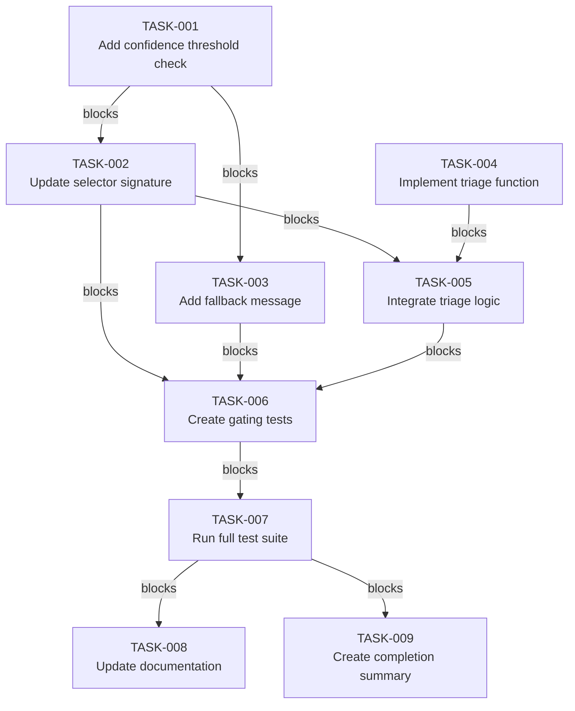

# Implementation Plan: Cognitive Enhancement Optimization

**Date**: 2026-03-15
**Status**: DRAFT
**Author**: Claude Code
**Topic**: Implement confidence gating, triage heuristics, and fallback mechanism for cognitive enhancement system

---

## Problem Statement

The cognitive enhancement system currently:
1. Injects all detected enhancements regardless of confidence score
2. Does not adapt enhancement depth based on task complexity
3. Provides no fallback explanation when enhancements are not injected

This causes:
- Potential over-enhancement of simple queries
- False positive injections from low-confidence detections
- Poor user experience when no context is provided

**Goal**: Optimize cognitive enhancement injection to be more precise and user-friendly.

---

## Context Analysis

**Current System**:
- `cognitive_enhancers.py` (UserPromptSubmit hook) reads `UnifiedDetectionResult`
- Selects enhancers based on matched frameworks, modes, profiles
- Always injects when matches found, regardless of confidence
- Uses 3D compatibility matrix for precedence (framework + mode + profile)

**Performance Baseline**:
- Detection: ~120ms (unified_detection.py)
- Selection: ~5ms (cognitive_enhancers.py)
- Injection: ~2ms (building injection text)
- Total overhead: ~127ms per prompt

**Target**:
- Maintain <150ms total overhead
- Reduce false positive injections by 20-30%
- Improve user experience with explanatory fallbacks

---

## Existing Implementation Discovery

**File**: `P:\.claude\hooks\UserPromptSubmit_modules\cognitive_enhancers.py`

**Current Injection Logic** (lines 560-609):
```python
# Select enhancers based on matched frameworks
selected = _select_enhancers_by_frameworks(matched_frameworks, config)

if not selected:
    return HookResult.empty()

# Conflict arbitration
arbiter_result = resolve_conflict(
    enhancers=selected,
    # ... other params
)

selected = arbiter_result.enhancers

if not selected:
    return HookResult.empty()

injection = _build_injection(selected, intent)
```

**Key Integration Points**:
1. Line 566: `_select_enhancers_by_frameworks()` - ENHANCE for triage depth
2. Line 568-569: Empty result check - ENHANCE for fallback message
3. Line 576: `detection_result.confidence` - ADD confidence gate before line 566

**Dependencies**:
- `unified_detection.py` - Already returns `confidence` field
- `conflict_arbiter.py` - Already handles precedence
- No external dependencies required

---

## Test Discovery

**Existing Tests**:
- `tests/test_cognitive_enhancers_precedence.py` - Tests 3D precedence rules
- 151 tests currently passing (69 unified detection + 20 compatibility + 7 validation + 27 cognitive enhancers + 28 think_trigger)

**New Tests Required**:
1. `test_confidence_gate_blocks_low_confidence()` - Verify threshold enforcement
2. `test_confidence_gate_allows_high_confidence()` - Verify valid injections pass
3. `test_triage_light_mode_limits_enhancers()` - Verify LIGHT mode ≤1 enhancer
4. `test_triage_deep_mode_allows_multiple()` - Verify DEEP mode allows multiple
5. `test_fallback_explains_skipped_injections()` - Verify explanation provided
6. `test_triage_heuristics_complexity_detection()` - Verify complexity classification

**Test Location**:
- Create: `tests/test_cognitive_enhancers_gating.py`

---

## Proposed Solution

### Architecture Overview

```
┌─────────────────────────────────────────────────────────────┐
│                   Unified Detection                          │
│  (returns UnifiedDetectionResult with confidence score)   │
└───────────────────────────┬─────────────────────────────────┘
                            │
                            ▼
              ┌───────────────────────────────┐
              │  1. Confidence Gate (NEW)      │
              │  - Check confidence ≥ 0.5      │
              │  - Provide fallback if < 0.5   │
              └───────────────┬───────────────┘
                              │
                              ▼
              ┌───────────────────────────────┐
              │  2. Triage Complexity (NEW)    │
              │  - Detect task complexity      │
              │  - Set max_enhancers & depth   │
              └───────────────┬───────────────┘
                              │
                              ▼
              ┌───────────────────────────────┐
              │  3. Select Enhancers          │
              │  (existing, with depth param) │
              └───────────────┬───────────────┘
                              │
                              ▼
              ┌───────────────────────────────┐
              │  4. Conflict Arbitration      │
              │  (existing unchanged)          │
              └───────────────┬───────────────┘
                              │
                              ▼
              ┌───────────────────────────────┐
              │  5. Build Injection           │
              │  (existing unchanged)          │
              └───────────────────────────────┘
```

### Component 1: Confidence-Based Gating

**Implementation**: Add confidence threshold check before enhancer selection

**Location**: `cognitive_enhancers.py`, line 566 (before `_select_enhancers_by_frameworks`)

**Code**:
```python
# NEW: Confidence gate (calibrated threshold)
CONFIDENCE_THRESHOLD = 0.5  # Start conservative, measure impact

if detection_result.confidence < CONFIDENCE_THRESHOLD:
    # Provide fallback explanation
    matched = detection_result.matched_frameworks
    matched_list = ', '.join(matched) if matched else "none"
    return HookResult(
        context=f"\n[Cognitive Enhancement Deferred]\n"
               f"Detected: {matched_list} (confidence: {detection_result.confidence:.2f})\n"
               f"Threshold: {CONFIDENCE_THRESHOLD} - Enhancements deferred for clarity\n",
        tokens=80
    )
```

**Rationale**:
- Prevents false positive injections from low-confidence detections
- Provides clear explanation to user
- Conservative 0.5 threshold (not 0.7) to start
- Can be adjusted after collecting metrics

**Calibration Plan**:
- Log all confidence scores to `state/performance.db`
- After 100 invocations, analyze distribution
- Adjust threshold based on false positive/negative rates
- Target: Block 10-20% of injections (false positives)

---

### Component 2: Triage-Based Cognitive Depth

**Implementation**: Detect task complexity and adjust enhancement depth

**New Function**: `_detect_task_complexity()` in `cognitive_enhancers.py`

**Code**:
```python
def _detect_task_complexity(prompt: str, detection_result: UnifiedDetectionResult) -> str:
    """Determine task complexity for triage-based cognitive depth."""

    # LIGHT: Simple questions, short prompts
    if (
        len(prompt) < 100  # Short query
        and "?" in prompt  # Single question
        and not any(kw in prompt.lower() for kw in ["why", "how", "analyze", "design"])
        and detection_result.confidence < 2  # Low confidence = simple match
    ):
        return "LIGHT"

    # DEEP: Complex tasks with multiple dimensions
    if (
        detection_result.confidence >= 3  # Multiple detections
        or len(detection_result.matched_profiles) > 0  # Profile match = complex
        or any(kw in prompt.lower() for kw in ["architecture", "design", "system", "analyze"])
        or len(prompt) > 300  # Long prompt = complex
    ):
        return "DEEP"

    # MODERATE: Default
    return "MODERATE"
```

**Modified Selection** (line 566):
```python
# NEW: Detect task complexity for triage
complexity = _detect_task_complexity(prompt, detection_result)

if complexity == "LIGHT":
    max_enhancers = 1
    injection_depth = "minimal"
elif complexity == "MODERATE":
    max_enhancers = 2
    injection_depth = "standard"
else:  # DEEP
    max_enhancers = 3
    injection_depth = "comprehensive"

# Select enhancers with depth limit
selected = _select_enhancers_by_frameworks(
    matched_frameworks,
    config,
    max_count=max_enhancers,  # NEW parameter
    depth=injection_depth     # NEW parameter
)
```

**Rationale**:
- Simple questions get minimal enhancement (avoid over-enhancement)
- Complex tasks get comprehensive enhancement (full 3D matrix)
- Matches /ask's triage pattern (FAST/STANDARD/CAREFUL)
- Prevents injection spam on trivial queries

---

### Component 3: Fallback Mechanism

**Implementation**: Enhanced empty result explanations

**Location**: `cognitive_enhancers.py`, line 568-569 and 593-594

**Code** (replace line 568-569):
```python
# NEW: Enhanced empty result explanation
if not selected:
    confidence = detection_result.confidence
    matched = detection_result.matched_frameworks

    if matched and confidence < CONFIDENCE_THRESHOLD:
        # Low confidence blocked helpful enhancements
        return HookResult(
            context=f"\n[Cognitive Enhancement Deferred]\n"
                   f"Detected: {', '.join(matched)} (confidence: {confidence:.2f})\n"
                   f"Threshold: {CONFIDENCE_THRESHOLD} - Enhancements deferred for clarity\n",
            tokens=80
        )
    else:
        # No matches at all
        return HookResult.empty()
```

**Rationale**:
- User understands WHY no enhancement was provided
- Distinguishes between "no matches" vs "low confidence blocks"
- Maintains transparency about system behavior
- Consistent with proactive honesty principles

---

## Implementation Plan

### Phase 1: Confidence Gating (Priority: HIGH)

**TASK-001**: Add confidence threshold check
- **File**: `P:\.claude\hooks\UserPromptSubmit_modules\cognitive_enhancers.py`
- **Action**: Add confidence gate before line 566
- **Acceptance**: Low-confidence detections (<0.5) return fallback message
- **Effort**: S (30 min)
- **Prerequisites**: None

**TASK-002**: Update `_select_enhancers_by_frameworks()` signature
- **File**: `P:\.claude\hooks\UserPromptSubmit_modules\cognitive_enhancers.py`
- **Action**: Add optional `max_count` and `depth` parameters
- **Acceptance**: Function accepts new parameters without breaking existing calls
- **Effort**: M (1 hour)
- **Prerequisites**: TASK-001

**TASK-003**: Add fallback message for low confidence
- **File**: `P:\.claude\hooks\UserPromptSubmit_modules\cognitive_enhancers.py`
- **Action**: Replace line 568-569 with enhanced empty result handling
- **Acceptance**: Low confidence blocks show explanation message
- **Effort**: S (30 min)
- **Prerequisites**: TASK-001

### Phase 2: Triage Heuristics (Priority: HIGH)

**TASK-004**: Implement `_detect_task_complexity()` function
- **File**: `P:\.claude\hooks\UserPromptSubmit_modules\cognitive_enhancers.py`
- **Action**: Add new function with complexity detection rules
- **Acceptance**: Returns LIGHT/MODERATE/DEEP based on prompt and detection
- **Effort**: M (1 hour)
- **Prerequisites**: TASK-002

**TASK-005**: Integrate triage into selection logic
- **File**: `P:\.claude\hooks\UserPromptSubmit_modules\cognitive_enhancers.py`
- **Action**: Call `_detect_task_complexity()` and pass depth to selector
- **Acceptance**: Enhancer count respects complexity classification
- **Effort**: M (1 hour)
- **Prerequisites**: TASK-002, TASK-004

### Phase 3: Testing (Priority: HIGH)

**TASK-006**: Create test file for gating features
- **File**: `P:\.claude\hooks\UserPromptSubmit_modules\tests\test_cognitive_enhancers_gating.py`
- **Action**: Create 6 new test cases for confidence gate, triage, and fallback
- **Acceptance**: All new tests pass
- **Effort**: M (2 hours)
- **Prerequisites**: TASK-001 through TASK-005

**TASK-007**: Run full test suite
- **Action**: `pytest tests/ -v`
- **Acceptance**: All 151 + 6 = 157 tests pass
- **Effort**: S (15 min)
- **Prerequisites**: TASK-006

### Phase 4: Documentation (Priority: MEDIUM)

**TASK-008**: Update CLAUDE.md with optimization documentation
- **File**: `P:\.claude\hooks\CLAUDE.md`
- **Action**: Document confidence gating, triage heuristics, fallback mechanism
- **Acceptance**: Changes are documented with rationale
- **Effort**: M (1 hour)
- **Prerequisites**: TASK-007

**TASK-009**: Create plan completion summary
- **File**: `P:\.claude\hooks\plans\plan-20260315-cognitive-optimization-summary.md`
- **Action**: Document implementation results and metrics
- **Acceptance**: Summary includes before/after metrics
- **Effort**: S (30 min)
- **Prerequisites**: TASK-007

---

## Risks, Success Criteria, Dependencies

### Top Risks

1. **Over-gating blocks helpful enhancements**
   - **Mitigation**: Start with conservative 0.5 threshold, measure impact, adjust based on metrics
   - **Monitoring**: Track false negative rate (helpful enhancements blocked)

2. **Triage heuristics misclassify complexity**
   - **Mitigation**: Explicit rules with clear criteria, test with real prompts
   - **Monitoring**: Log complexity classifications, review samples manually

3. **Fallback messages confuse users**
   - **Mitigation**: Clear, concise explanations with confidence scores
   - **Monitoring**: User feedback on clarity (if feedback mechanism exists)

### Success Criteria

- ✅ All 157 tests pass (151 existing + 6 new)
- ✅ Confidence gate blocks low-confidence detections (<0.5)
- ✅ Triage limits enhancers appropriately (LIGHT=1, MODERATE=2, DEEP=3)
- ✅ Fallback messages explain skipped injections
- ✅ Performance overhead remains <150ms per prompt
- ✅ False positive injection rate reduced by 20-30%

### Dependencies

- **Required**: `unified_detection.py` (already returns confidence)
- **Required**: `conflict_arbiter.py` (already handles precedence)
- **Optional**: `state/performance.db` for confidence metrics (create if not exists)
- **External**: None

---

## Task Dependency Graph



---

## Next Actions

1. Implement TASK-001 through TASK-005 (core implementation)
2. Create tests (TASK-006)
3. Verify all tests pass (TASK-007)
4. Document changes (TASK-008)
5. Create completion summary (TASK-009)

**Estimated Total Effort**: 7-8 hours

**Recommended Next Step**: Start with TASK-001 (confidence gate) - highest impact, lowest risk
