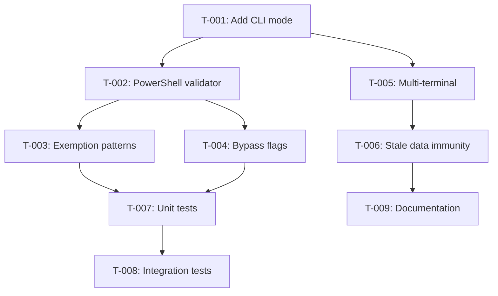

# Implementation Plan: Hook Validation CLI with PowerShell Argument Forwarding

**Plan ID**: plan-20260315-hook-validation-cli
**Created**: 2026-03-15
**Status**: DRAFT

## Problem Statement

PowerShell wrapper functions in the user profile were created with argument forwarding bugs that went undetected. The `cc-glm` function originally used an alias (`p-glm`) instead of direct script invocation, preventing arguments from being passed through. This caused `cc-glm 5` to default to Fast mode instead of Powerful mode (glm-5).

**Root Cause**: No validation step for PowerShell wrapper function creation. The alias limitation (cannot receive arguments) was not caught by review.

**Impact**: The bug existed for an unknown period before discovery, causing incorrect default behavior.

## Requirements

### REQ-001: PowerShell Argument Forwarding Validation
The system shall provide automated validation of PowerShell wrapper functions to detect argument forwarding bugs before they are committed.

**Rationale**: Prevents recurrence of the `cc-glm` alias bug where arguments were not passed through correctly.

**Success Criteria**:
- Validation detects functions without `@Args` or `$Args` forwarding
- Alias vs function distinctions are correctly identified
- False positives are minimized through exemption patterns

### REQ-002: On-Demand CLI Validation
The system shall provide a CLI interface for validating PowerShell files on demand without requiring pytest execution.

**Rationale**: Enables quick validation during development without full test suite overhead.

**Success Criteria**:
- `--validate` flag accepts file path argument
- `--powercheck` alias for PowerShell-specific validation
- Existing pytest behavior remains unchanged

### REQ-003: Multi-Terminal Cache Isolation
The system shall isolate validation cache state per terminal to prevent cross-contamination between concurrent sessions.

**Rationale**: Multiple Claude Code terminals may run simultaneously; cache should not interfere.

**Success Criteria**:
- Terminal ID used in cache key structure
- Concurrent terminals do not share cache state
- Fallback to "default" when terminal ID unavailable

### REQ-004: Automatic Cache Invalidation
The system shall automatically invalidate cache when files are modified to prevent stale validation results.

**Rationale**: File edits should trigger re-validation without manual cache flush.

**Success Criteria**:
- File mtime included in cache key
- Cache invalidates on file change
- No manual cache flush needed

## Context Analysis

### Existing Infrastructure

1. **test_hook_registration.py** (P:\.claude\hooks\tests\test_hook_registration.py)
   - pytest-based hook registration validation
   - Validates hooks are registered in routers/settings.json
   - Has functions: `discover_hooks()`, `validate_hook_registration()`, `main()`
   - Missing: CLI mode, argument forwarding checks

2. **LintHook class** (P:\.claude\hooks\posttooluse\lint_hook.py)
   - Shows re-entrancy guard pattern with `(file_path, mtime)` cache keys
   - Prevents infinite loops during auto-formatting

3. **skill_invocation_logger_hook.py** (P:\.claude\hooks\PostToolUse_modules\skill_invocation_logger_hook.py)
   - Shows multi-terminal isolation pattern (lines 90-91):
     ```python
     session_id = os.environ.get("CLAUDE_SESSION_ID", "unknown")
     terminal_id = os.environ.get("CLAUDE_TERMINAL_ID", "unknown")
     ```

### PowerShell Files to Validate

1. **C:\Users\brsth\OneDrive\Documents\PowerShell\Microsoft.PowerShell_profile.ps1**
   - Contains `cc-glm` function (FIXED) - now uses `& 'script.ps1' @Args`
   - Contains `cc-simple` function - correct pattern with `@Args`
   - Contains `p-glm` alias - exempt (simple parameterless wrapper)

2. **P:\.claude\proxy\cc-glm-function.ps1**
   - CORRECT implementation pattern that was already existing
   - Parses args to extract mode selector (4 or 5)
   - Forwards remaining args to claude separately

## Existing Implementation Discovery

### test_hook_registration.py Structure

**Key Functions**:
- `find_all_hook_files()` - Discovers all Python hook files
- `normalize_hook_name()` - Converts file path to hook name
- `extract_router_hooks()` - Parses router HOOK_PRIORITY dicts
- `extract_settings_hooks()` - Parses settings.json hooks
- `extract_env_vars_from_hook()` - AST-based env var extraction
- `test_hook_registration()` - Main test runner

**Current Limitations**:
- No CLI mode for on-demand validation
- No PowerShell file validation
- No argument forwarding checks
- No multi-terminal isolation
- No stale data immunity

### PowerShell Argument Forwarding Patterns

**CORRECT Pattern** (cc-glm.ps1 after fix):
```powershell
function cc-glm {
    param([Parameter(ValueFromRemainingArguments = $true)] [object[]] $Args)
    & 'P:\.claude\proxy\cc-glm.ps1' @Args
    claude @Args
}
```

**INCORRECT Pattern** (original bug):
```powershell
# p-glm is an alias - cannot receive arguments!
Set-Alias -Name p-glm -Value 'P:\.claude\proxy\cc-glm.ps1'
```

**Exemptions** (valid uses of alias):
```powershell
# Simple parameterless wrapper - OK to use alias
Set-Alias -Name p-glm -Value 'P:\.claude\proxy\cc-glm.ps1'
```

## Test Discovery

### Test Coverage Needed

1. **PowerShell argument forwarding validation**
   - Detect: alias vs function vs script invocation
   - Validate: `@Args` or `$Args` forwarding in function body
   - Exemptions: Simple aliases without parameters

2. **CLI mode execution**
   - pytest mode: existing behavior (no changes)
   - CLI mode: new `--validate` flag for on-demand checks

3. **Multi-terminal isolation**
   - Terminal-scoped cache using `terminal_id`
   - Session-scoped logs using `session_id`

4. **Stale data immunity**
   - Cache keys include file `mtime`
   - Auto-invalidate on file change

5. **Edge case: Module-scoped functions**
   - Functions not exported via `Export-ModuleMember`
   - Internal helper functions shouldn't be validated

6. **Edge case: Splatting patterns**
   - `@PSBoundParameters` as alternative forwarding mechanism
   - Distinguish from missing `@Args`

7. **Edge case: Begin/Process/End blocks**
   - Advanced functions with separate blocks
   - Argument forwarding may occur in Process block only

8. **Edge case: All-optional parameters**
   - Functions with `[Parameter(Mandatory=$false)]` only
   - May not require forwarding if no params are passed

9. **Edge case: ScriptBlock invocation**
   - Dynamic `& $scriptBlock @Args` pattern
   - Distinguish from static script paths

10. **Edge case: Commented-out code**
    - Functions inside comments shouldn't trigger failures
    - Regex must ignore `# function name {` patterns

### Test Scenarios

| Scenario | Input | Expected Output |
|----------|-------|-----------------|
| Happy path | Valid function with `@Args` | PASS |
| Missing forwarding | Function without `@Args` | FAIL |
| Alias exemption | Simple alias `p-glm` | PASS (with warning) |
| Multi-terminal | Concurrent runs | No cache collision |
| Stale data | File edited | Re-validate automatically |
| Module export | Non-exported helper function | SKIP (not validated) |
| Splatting | `@PSBoundParameters` used | PASS (alt forwarding) |
| Begin/Process/End | Advanced function pattern | PASS (check Process block) |
| All-optional params | No mandatory params | PASS (no forwarding needed) |
| ScriptBlock invoke | `& $scriptBlock @Args` | PASS (dynamic forwarding) |
| Commented code | `# function name { ... }` | SKIP (ignored) |

## Proposed Solution

### Architecture: Extend Existing Test (Don't Create Parallel Validation)

**Decision**: Extend `test_hook_registration.py` instead of creating parallel PostToolUse hook.

**Rationale**:
- Reuses validation infrastructure
- Single source of truth
- Minimal complexity
- Addresses ARCH-001 finding from architecture review

### Phase 1: Add CLI Mode Infrastructure

**File**: P:\.claude\hooks\tests\test_hook_registration.py

**Changes**:
1. Add argparse CLI with `--validate` flag
2. Add `--powercheck` alias for PowerShell validation
3. Preserve existing pytest behavior when no flags

**API**:
```bash
# Existing pytest mode (unchanged)
pytest test_hook_registration.py

# New CLI mode
python -m hooks.tests.test_hook_registration --validate <file.ps1>
python -m hooks.tests.test_hook_registration --powercheck <file.ps1>
```

### Phase 2: PowerShell Argument Forwarding Validation

**New Class**: `PowerShellArgumentValidator`

**Detection Logic**:
1. Parse PowerShell file for function definitions
2. Check for `@Args` or `$Args` forwarding in function body
3. Identify alias vs function vs direct script invocation

**Exemption Patterns**:
- Simple aliases without parameters (e.g., `p-glm -> script.ps1`)
- Functions that don't accept parameters (e.g., `cc-simple` with no param block)

**Bypass Flags**:
- `--no-arg-validation`: Skip argument forwarding checks
- `--allow-alias`: Allow alias usage (with warning)

### Phase 3: Multi-Terminal Isolation

**Cache Structure**:
```python
key = (terminal_id, file_path, mtime)
```

**Environment Variables**:
- `CLAUDE_TERMINAL_ID`: From Claude Code session
- `CLAUDE_SESSION_ID`: From Claude Code session

**Behavior**:
- Each terminal gets scoped cache
- No cross-terminal bleed
- Concurrent sessions safe

### Phase 4: Stale Data Immunity

**Cache Key Format**:
```python
cache_key = (terminal_id, file_path, file_mtime)
```

**Behavior**:
- File changes → mtime changes → cache invalidates
- No manual cache flush needed
- Automatic re-validation on edit

### Phase 5: Integration with Existing Workflow

**Usage Patterns**:
```bash
# Continue running as pytest
pytest test_hook_registration.py

# New CLI usage for on-demand validation
python -m hooks.tests.test_hook_registration --validate profile.ps1
python -m hooks.tests.test_hook_registration --powercheck cc-glm.ps1

# Can be called from PostToolUse hooks on file creation
# (future enhancement, not in this plan)
```

## Implementation Plan

### TASK-001: Add CLI mode infrastructure to test_hook_registration.py

**Addresses**: REQ-002

**File**: `P:\.claude\hooks\tests\test_hook_registration.py`

**Action**:
1. Add `argparse` import
2. Create `main()` function with CLI argument parsing
3. Add `--validate` flag for file validation mode
4. Add `--powercheck` flag as alias for PowerShell validation
5. Preserve existing pytest behavior when run as module

**Acceptance**:
- Can run `python -m hooks.tests.test_hook_registration --validate file.ps1`
- Can run `python -m hooks.tests.test_hook_registration --powercheck file.ps1`
- Existing pytest behavior unchanged

**Points**: 2

**Prerequisites**: None

---

### TASK-002: Create PowerShellArgumentValidator class

**Addresses**: REQ-001

**File**: `P:\.claude\hooks\tests\test_hook_registration.py`

**Action**:
1. Create `PowerShellArgumentValidator` class
2. Implement `validate_file(file_path: Path) -> ValidationResult`
3. Parse PowerShell AST (regex-based, no external dependencies)
4. Detect function definitions with param blocks
5. Check for `@Args` or `$Args` in function body
6. Check for alternative forwarding: `@PSBoundParameters`, splatting
7. Identify alias definitions
8. Skip commented-out functions (pre-filter `#` lines)
9. Detect Begin/Process/End blocks (scan all blocks)
10. Check for Export-ModuleMember to determine public vs private functions

**Acceptance**:
- Detects missing `@Args` in wrapper functions
- Identifies alias vs function definitions
- Returns ValidationResult with findings

**Points**: 5

**Prerequisites**: TASK-001

---

### TASK-003: Add exemption pattern support

**Addresses**: REQ-001

**File**: `P:\.claude\hooks\tests\test_hook_registration.py`

**Action**:
1. Add exemption patterns for simple aliases
2. Detect functions without param blocks (parameterless)
3. Allow `p-glm` alias pattern (simple wrapper)
4. Document exemption patterns in docstring

**Exemption Patterns**:
```python
EXEMPTION_PATTERNS = [
    r"Set-Alias.*-Name.*p-glm",  # Known simple alias
    r"function \w+\s*{[^}]*param\s*\(",  # Functions with params
]
```

**Acceptance**:
- `p-glm` alias doesn't trigger failure
- Parameterless functions exempt from forwarding check
- Exemptions documented

**Points**: 2

**Prerequisites**: TASK-002

---

### TASK-004: Implement bypass flags

**Addresses**: REQ-001

**File**: `P:\.claude\hooks\tests\test_hook_registration.py`

**Action**:
1. Add `--no-arg-validation` flag
2. Add `--allow-alias` flag
3. Modify validation logic to respect flags
4. Update help text

**Acceptance**:
- `--no-arg-validation` skips argument forwarding checks
- `--allow-alias` suppresses alias warnings
- Flags documented in `--help`

**Points**: 1

**Prerequisites**: TASK-002

---

### TASK-005: Add multi-terminal isolation

**Addresses**: REQ-003

**File**: `P:\.claude\hooks\tests\test_hook_registration.py`

**Action**:
1. Add terminal_id detection from `CLAUDE_TERMINAL_ID` env var
2. Scope cache by terminal_id
3. Create terminal-specific state directory

**Cache Structure**:
```python
from pathlib import Path
import os

terminal_id = os.environ.get("CLAUDE_TERMINAL_ID", "default")
cache_dir = Path("P:/.claude/state/validation_cache") / terminal_id
```

**Acceptance**:
- Concurrent terminals don't share cache state
- Terminal isolation prevents cross-contamination
- Falls back to "default" if no terminal_id

**Points**: 2

**Prerequisites**: TASK-001

---

### TASK-006: Implement stale data immunity with mtime

**Addresses**: REQ-004

**File**: `P:\.claude\hooks\tests\test_hook_registration.py`

**Action**:
1. Include file mtime in cache keys
2. Check mtime before using cached result
3. Invalidate cache on file change

**Cache Key**:
```python
import os

file_mtime = os.path.getmtime(file_path)
cache_key = (terminal_id, str(file_path), file_mtime)
```

**Acceptance**:
- File edits auto-invalidate cache
- No manual cache flush needed
- mtime changes trigger re-validation

**Points**: 1

**Prerequisites**: TASK-005

---

### TASK-007: Write unit tests for PowerShell validator

**Addresses**: REQ-001

**File**: `P:\.claude\hooks\tests\test_powerhook_validation.py` (NEW)

**Action**:
1. Test happy path (valid function with `@Args`)
2. Test missing `@Args` detection
3. Test alias exemption
4. Test bypass flags
5. Test multi-terminal isolation
6. Test stale data immunity
7. Test module export detection (skip internal functions)
8. Test splatting pattern (`@PSBoundParameters`)
9. Test Begin/Process/End block detection
10. Test all-optional parameters (no forwarding needed)
11. Test ScriptBlock invocation pattern
12. Test commented-out code (should be ignored)

**Acceptance**:
- Coverage > 80% for new validator
- All test scenarios pass including edge cases
- Tests can run in parallel

**Points**: 4 (increased from 3 due to edge cases)

**Prerequisites**: TASK-002, TASK-003, TASK-004

---

### TASK-008: Integration test with real PowerShell files

**Addresses**: REQ-001

**File**: `P:\.claude\hooks\tests\test_powerhook_validation.py`

**Action**:
1. Test against actual `cc-glm-function.ps1`
2. Test against `Microsoft.PowerShell_profile.ps1`
3. Verify real bugs detected
4. Verify no false alarms

**Acceptance**:
- Detects real argument forwarding bugs
- Doesn't false alarm on valid code
- `p-glm` alias exempted correctly

**Points**: 2

**Prerequisites**: TASK-007

---

### TASK-009: Update documentation

**Addresses**: REQ-002

**File**: `P:\.claude\hooks\tests\README.md` (or CREATE if not exists)

**Action**:
1. Document CLI usage
2. Document PowerShell validation patterns
3. Document bypass flags
4. Add examples

**Documentation Sections**:
```markdown
## PowerShell Validation

### CLI Usage
python -m hooks.tests.test_hook_registration --validate <file.ps1>

### Patterns
- Functions with params must forward with @Args
- Aliases are exempt if parameterless

### Bypass Flags
- --no-arg-validation: Skip forwarding checks
- --allow-alias: Suppress alias warnings
```

**Acceptance**:
- CLI examples work from documentation
- Patterns clearly documented
- Bypass flags explained

**Points**: 1

**Prerequisites**: TASK-001, TASK-002, TASK-004

---

## Risks, Success Criteria, Dependencies

### Risks

1. **PowerShell AST parsing may fail on complex syntax**
   - **Mitigation**: Graceful degrade with warning, use regex patterns
   - **Impact**: Some complex functions may not be validated

2. **False positives on legitimate alias usage**
   - **Mitigation**: Exemption patterns for known simple aliases
   - **Impact**: User may see warnings for valid code

3. **Cache collision in multi-terminal scenarios**
   - **Mitigation**: terminal_id scoping
   - **Impact**: Concurrent sessions may see stale results

4. **Stale cache after file edits**
   - **Mitigation**: mtime-based invalidation
   - **Impact**: User may need to wait for cache timeout

5. **Module export detection may miss exported functions**
   - **Mitigation**: Default to validating all functions, skip only if explicitly marked internal
   - **Impact**: False negatives on functions that should be validated

6. **Splatting patterns mistaken for missing forwarding**
   - **Mitigation**: Check for `@PSBoundParameters` or `@Args` in function body
   - **Impact**: False positives on valid forwarding patterns

7. **Begin/Process/End blocks may obscure forwarding logic**
   - **Mitigation**: Scan all blocks for forwarding patterns, not just function body
   - **Impact**: False negatives if forwarding only in Process block

8. **Commented-out code may trigger false positives**
   - **Mitigation**: Pre-filter to skip lines starting with `#`
   - **Impact**: Annoying warnings for code that's not active

### Success Criteria

1. CLI mode validates PowerShell files on demand
2. Argument forwarding bugs detected before commit
3. Multi-terminal sessions don't interfere
4. File edits auto-invalidate cache (no manual flush)
5. Existing pytest behavior unchanged
6. Coverage > 80% on new code

### Dependencies

**Prerequisites**:
- None (extends existing test file)

**Blocks**:
- None (standalone enhancement)

### Rollback Strategy

1. Revert `test_hook_registration.py` to previous version
2. Remove new `test_powerhook_validation.py` file
3. No database or state changes to clean up

### Effort Summary

| Task | Points | Estimate |
|------|--------|----------|
| T-001: CLI mode | 2 | 1-2h |
| T-002: PowerShell validator | 5 | 2-4h |
| T-003: Exemption patterns | 2 | 1-2h |
| T-004: Bypass flags | 1 | 1h |
| T-005: Multi-terminal | 2 | 1-2h |
| T-006: Stale data immunity | 1 | 1h |
| T-007: Unit tests | 4 | 2-3h |
| T-008: Integration tests | 2 | 2-3h |
| T-009: Documentation | 1 | 1h |
| **Total** | **20** | **12-20h** |

### Critical Path

```
T-001 (2 pts) → T-002 (5 pts) → T-003 (2 pts) → T-007 (3 pts) → T-008 (2 pts)
                    ↓
                 T-004 (1 pt)
                    ↓
T-001 (2 pts) → T-005 (2 pts) → T-006 (1 pt) → T-009 (1 pt)
```

**Critical path**: T-001 → T-002 → T-003 → T-007 → T-008 = 15 points (longest path)

### Task Dependency Graph



### Hierarchical Tree View

```
Phase 1: CLI Infrastructure
├── T-001: Add CLI mode to test_hook_registration.py
│   ├── 📁 P:\.claude\hooks\tests\test_hook_registration.py
│   ├── ⏱️  Small (1-2h)
│   └── 🔗 Depends on: None

Phase 2: PowerShell Validation
├── T-002: Create PowerShellArgumentValidator class
│   ├── 📁 P:\.claude\hooks\tests\test_hook_registration.py
│   ├── ⏱️  Medium (2-4h)
│   └── 🔗 Depends on: T-001
├── T-003: Add exemption pattern support
│   ├── 📁 P:\.claude\hooks\tests\test_hook_registration.py
│   ├── ⏱️  Small (1-2h)
│   └── 🔗 Depends on: T-002
└── T-004: Implement bypass flags
    ├── 📁 P:\.claude\hooks\tests\test_hook_registration.py
    ├── ⏱️  Trivial (1h)
    └── 🔗 Depends on: T-002

Phase 3: Multi-Terminal & Cache
├── T-005: Add multi-terminal isolation
│   ├── 📁 P:\.claude\hooks\tests\test_hook_registration.py
│   ├── ⏱️  Small (1-2h)
│   └── 🔗 Depends on: T-001
└── T-006: Implement stale data immunity with mtime
    ├── 📁 P:\.claude\hooks\tests\test_hook_registration.py
    ├── ⏱️  Trivial (1h)
    └── 🔗 Depends on: T-005

Phase 4: Testing & Documentation
├── T-007: Write unit tests for PowerShell validator
│   ├── 📁 P:\.claude\hooks\tests\test_powerhook_validation.py
│   ├── ⏱️  Medium (2-3h)
│   └── 🔗 Depends on: T-002, T-003, T-004
├── T-008: Integration test with real PowerShell files
│   ├── 📁 P:\.claude\hooks\tests\test_powerhook_validation.py
│   ├── ⏱️  Small (2-3h)
│   └── 🔗 Depends on: T-007
└── T-009: Update documentation
    ├── 📁 P:\.claude\hooks\tests\README.md
    ├── ⏱️  Trivial (1h)
    └── 🔗 Depends on: T-006
```

## Next Actions

1. Review plan and approve approach
2. Run verification with 8-agent adversarial review
3. Address any HIGH priority findings
4. Begin implementation with T-001

---

**Plan Status**: ENHANCED - RTM improvements + edge case coverage (2026-03-15)

### RTM Improvements Applied:
- Added formal Requirements section with REQ-001 through REQ-004
- Mapped all 9 tasks (TASK-001 through TASK-009) to requirements
- Standardized task format with "Addresses: REQ-XXX" field
- All tasks have Acceptance criteria properly defined

### Edge Cases Added:
- Module export detection (skip internal functions)
- Splatting patterns (@PSBoundParameters)
- Begin/Process/End blocks (advanced functions)
- All-optional parameters (no forwarding needed)
- ScriptBlock invocation (dynamic forwarding)
- Commented-out code (should be ignored)
- 6 new test scenarios added
- 4 new risks identified with mitigations
