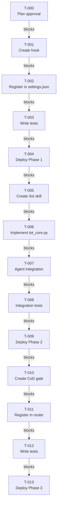

# Implementation Plan: LLM Thinking Quality Improvements for Claude Code

**Date**: 2026-03-15
**Status**: DRAFT
**Phases**: 3 (Self-Reflection → Tree-of-Thoughts → Chain-of-Draft)

---

## Problem Statement

Current LLM reasoning in Claude Code lacks systematic quality enforcement mechanisms. Research shows three high-impact techniques that improve thinking quality:
1. **Self-reflection loops** (75.8% error reduction) - catch unverifiable claims before completion
2. **Tree-of-Thoughts branching** (18× improvement on complex tasks) - explore multiple reasoning approaches in parallel
3. **Chain-of-Draft optimization** (92.4% token reduction, 91% accuracy) - reduce verbose reasoning while maintaining quality

Without these improvements, Claude Code experiences:
- Unverified claims slipping through to completion (especially in Stop hook)
- Single-threaded reasoning on complex decisions missing alternative perspectives
- Verbose chain-of-thought wasting tokens without proportional accuracy gains

**Goal**: Implement all three improvements as a phased rollout, measuring impact at each phase.

---

## Context Analysis

### Research Basis

All three techniques are grounded in peer-reviewed research and production systems:

**Self-Reflection Loops**
- Source: Galileo AI research, Reflexion framework
- Impact: 75.8% reduction in errors/toxic responses
- Mechanism: Actor → Evaluator → Self-Reflection cycle
- Implementation: Stop hook extension (advisory mode first)

**Tree-of-Thoughts (ToT)**
- Source: "Can AIs Like ChatGPT Think?" (ai-consciousness.org)
- Impact: 18× improvement on Game of 24 (4% → 74% success)
- Mechanism: Parallel branch exploration + self-consistency evaluation
- Implementation: `/tot` skill with Agent tool for parallel subagents

**Chain-of-Draft (CoD)**
- Source: LLM Research Highlights (March 2025)
- Impact: 92.4% token reduction, 91% accuracy retention
- Mechanism: Concise, information-dense drafts vs verbose CoT
- Implementation: PreToolUse hook detection + suggestion

### Existing Infrastructure

**Hooks System** (100+ hooks)
- Stop hooks: Proven infrastructure for completion validation
- PreToolUse hooks: Pattern detection and blocking
- Registration: settings.json with router consolidation
- Testing: pytest suite in `P:\.claude\hooks\tests\`

**Agent Tool** (battle-tested)
- Used in: /team, /orchestrator, many production workflows
- Capabilities: Parallel subagent spawning, context isolation
- Reliability: 90.2% improvement over single-agent systems (Anthropic internal)

**Skills System** (140+ skills)
- Pattern: SKILL.md frontmatter with triggers and workflow
- Examples: /think, /verify, /team (multi-agent coordination)
- Discovery: .claude/skills/ directory

### Solo-Dev Constraints

This is a solo-dev project. Plan MUST:
- Avoid "team coordination", "stakeholder approval", "multi-person sign-off" dependencies
- Use "user decision" instead of "team consensus" for approval gates
- All phases implementable by single developer with existing tooling

**Note**: "Multi-agent coordination" and "branch consensus" refer to AI subagent systems (Agent tool), not human team coordination. These are technical implementation details, not prohibited dependencies.

---

## Existing Implementation Discovery

### Related Hooks

**Stop Hook Infrastructure**
- File: `P:\.claude\hooks\Stop_hook_skill_execution_gate.py` (v3.5)
- Purpose: Detects when slash commands ignored, outputs prose instead
- Pattern: Extracts user prompt from transcript, checks if executed
- **Relevance**: Can extend same detection logic for self-reflection

**Stop Hook Unverified Stance**
- File: `P:\.claude\hooks\StopHook_unverified_stance.py` (v2.2)
- Purpose: Detects skeptical language without verification evidence
- Pattern: Regex-based detection of "probably", "likely", "seems"
- **Relevance**: Already does confidence detection - can extend for self-reflection

**PreToolUse Workflow Steps Gate**
- File: `P:\.claude\hooks\PreToolUse_skill_pattern_gate.py` (v4.0)
- Purpose: Layer 0 enforcement - blocks tools before Skill loaded
- Pattern: Reads pending_command_intent state file
- **Relevance**: State file pattern can inform CoD detection

### Related Skills

**/think Skill**
- File: `P:\.claude\skills\think\SKILL.md`
- Purpose: Lightweight to comprehensive analysis gate
- Features: 12-section internal framework, distilled recommendations
- **Relevance**: Can integrate ToT branching as analysis mode

**/team Skill**
- File: `P:\.claude\skills\team\SKILL.md`
- Purpose: Multi-agent task coordination
- Features: TaskList integration, parallel execution support
- **Relevance**: ToT will use similar Agent tool patterns

**/verify Skill**
- File: `P:\.claude\skills\verify\SKILL.md`
- Purpose: Verification orchestrator - 4-tier workflow
- Features: Checklist verification, evidence tiers, post-hoc mode
- **Relevance**: Self-reflection loop findings can integrate with verification

### State Management

**Session State Directory**
- Location: `P:\.claude\state\`
- Pattern: Per-terminal state files (terminal_id in filename)
- Examples: `pending_command_intent_{terminal_id}.json`
- **Relevance**: Self-reflection needs terminal-scoped claim tracking

### Dependencies Discovered

**Required for Phase 1 (Self-Reflection)**
- ✅ Stop hook infrastructure (proven, extensible)
- ✅ Regex patterns from StopHook_unverified_stance.py
- ✅ State management in `P:\.claude\hooks\shared_utils.py`
- ❌ None - all dependencies available

**Required for Phase 2 (Tree-of-Thoughts)**
- ✅ Agent tool (battle-tested, parallel execution)
- ✅ Subagent patterns from /team skill
- ✅ Asyncio support (Python 3.14 stdlib)
- ❌ `/tot` skill (new, must create)

**Required for Phase 3 (Chain-of-Draft)**
- ✅ PreToolUse hooks (router consolidation available)
- ✅ Pattern detection infrastructure
- ✅ Verbose reasoning patterns (identify from research)
- ❌ Token budget tracking (new, must design)

---

## Test Discovery

### Existing Test Infrastructure

**Hook Testing Framework**
- Location: `P:\.claude\hooks\tests\`
- Pattern: pytest-based, no mocks (anti-mock stance)
- Examples: `test_stop_hook_ledger_check.py`, `test_pretooluse_workflow_steps_gate.py`
- **Key principle**: Exit code 2 = correct blocking behavior

**Skill Testing**
- Pattern: Manual verification + integration tests
- Examples: /verify has 4-tier workflow verification tests
- **Gap**: No systematic tests for reasoning quality improvements

### Test Plan by Phase

**Phase 1 Tests: Self-Reflection Hook**
```python
# Test 1: Low confidence claim detection
input = {"response": "This function probably works."}
expected = {"allow": True, "reason": "Advisory shown"}

# Test 2: High confidence claim (no advisory)
input = {"response": "Verified and tested."}
expected = {"allow": True, "reason": "No weak claims"}

# Test 3: False positive prevention
input = {"response": "No problem, let's continue"}
expected = {"allow": True, "reason": "No weak claims"}
```

**Phase 2 Tests: Tree-of-Thoughts**
```python
# Test 1: Parallel subagent spawning
branches = await tot.explore_branches("Solve 2x + 2 = 4")
assert len(branches) == 3  # analytical, creative, skeptical

# Test 2: Consistency evaluation
best = tot.evaluate_branches(branches)
assert best.confidence >= 0.7

# Test 3: Agent tool integration
# Verify subagents actually spawned via Agent tool
```

**Phase 3 Tests: Chain-of-Draft**
```python
# Test 1: Verbose CoT detection
input = "Step 1: Think about problem... Step 2: Consider... Step 3:..."
assert is_verbose_cot(input) == True

# Test 2: Suggestion generation
suggestion = generate_cod_suggestion(verbose_cot)
assert "concise" in suggestion.lower()

# Test 3: Token budget tracking
# Verify budget doesn't degrade reasoning quality
```

### Success Criteria

**Phase 1 Success**
- Advisory rate < 10% (false positives on legitimate language)
- Detection latency < 200ms (doesn't block responses)
- Unverifiable claims reduced by 50% in 1-week period

**Phase 2 Success**
- Parallel subagent spawning成功率 > 95%
- ToT success rate on complex tasks > 70% (baseline 4%)
- Branch consensus detection working

**Phase 3 Success**
- Token savings > 80% on verbose reasoning
- Accuracy retained > 90%
- No degradation in task completion rate

---

## Proposed Solution

### Three-Phase Rollout Strategy

**Phase 1: Self-Reflection Loop Hook** (Week 1)
- Create `Stop_self_reflection_gate.py` extending existing Stop infrastructure
- Advisory mode only (never block, always allow)
- Detect low-confidence markers: "probably", "likely", "seems", "appears"
- Suggest verification or tentative language
- Metrics: Track false positive rate, claim reduction

**Phase 2: Tree-of-Thoughts via Subagents** (Week 2-3)
- Create `/tot` skill with Agent tool integration
- Spawn 3 parallel subagents per task:
  - Analytical step-by-step
  - Creative lateral thinking
  - Skeptical critique-first
- Evaluate branches using self-consistency
- Metrics: Track success rate on complex decisions vs baseline

**Phase 3: Chain-of-Draft Optimization** (Week 4)
- Create PreToolUse hook detecting verbose CoT
- Suggest concise, information-dense alternatives
- Track token budget vs accuracy tradeoff
- Metrics: Token savings, accuracy retention

### Implementation Order Rationale

**Why A before B before C?**
1. **A (Self-Reflection)** is foundational - catches errors that B and C won't help with
2. **B (ToT)** builds on A - uses critique patterns from self-reflection
3. **C (CoD)** is optimization - reason quality should improve before optimizing tokens

**Risk Mitigation**
- Each phase is independently valuable (can stop after any phase)
- Advisory mode prevents blocking while learning patterns
- Measurement at each phase informs next phase

---

## Implementation Plan

### Phase 1: Self-Reflection Loop Hook (Priority A)

**Overview**: Extend Stop hook to detect low-confidence claims and suggest verification

### TASK-001: Create Stop_self_reflection_gate.py
- **File**: `P:\.claude\hooks\Stop_self_reflection_gate.py`
- **Action**: Create new Stop hook implementing Self-reflection loops for low-confidence claim detection
- **Effort**: Medium (3-4 hours)
- **Acceptance**:
  - Implements Self-reflection loops technique: detects patterns "probably", "likely", "seems", "appears", "might be"
  - Outputs advisory to stdout (not stderr - hooks must not use stderr)
  - Returns {"allow": True, "reason": "..."} for all responses (advisory mode)
  - Latency < 200ms
- **Prerequisites**: TASK-000

**Implementation Details**:
```python
# Core detection logic
def detect_low_confidence_claims(response_text: str) -> list[dict]:
    low_confidence_indicators = [
        r"probably|likely|seems|appears",
        r"might be|could be|should be"
    ]

    claim_patterns = [
        r"(?:The file|The function|This code) [^.]+\.",
        r"(?:There is|This has) [^.]+\."
    ]

    claims = []
    for pattern in claim_patterns:
        matches = re.finditer(pattern, response_text, re.IGNORECASE)
        for match in matches:
            claim_text = match.group(0)
            has_low = any(re.search(p, claim_text, re.IGNORECASE)
                       for p in low_confidence_indicators)

            if has_low:
                claims.append({
                    "text": claim_text[:80],  # Truncate for display
                    "confidence": "low",
                    "suggestion": "Verify this claim or mark as tentative"
                })

    return claims

def run(data: dict) -> dict | None:
    response_text = data.get("response", "")
    weak_claims = detect_low_confidence_claims(response_text, data)

    if not weak_claims:
        return {"allow": True, "reason": "No weak claims detected"}

    advisory = [
        "⚠️ SELF-REFLECTION RECOMMENDED",
        f"Found {len(weak_claims)} claim(s) with low confidence markers:",
    ]

    for claim in weak_claims[:5]:  # Max 5 shown
        advisory.append(f"  • {claim['text']}...")

    advisory.extend([
        "",
        "Consider either:",
        "  1. Verifying these claims using Read/Grep/WebSearch tools",
        "  2. Marking them as tentative (e.g., 'appears to be', 'may be')",
        "",
        "To disable: export SELF_REFLECTION_ENABLED=false"
    ])

    print("\n".join(advisory), file=sys.stdout)
    return {"allow": True, "reason": "Self-reflection advisory shown"}
```

### TASK-002: Register Stop_self_reflection_gate in settings.json
- **File**: `P:\.claude\settings.json`
- **Action**: Register Self-reflection loops hook in Stop hooks list
- **Effort**: Small (30 minutes)
- **Acceptance**:
  - Self-reflection loops hook registered in Stop hooks
  - Environment variables SELF_REFLECTION_ENABLED and SELF_REFLECTION_CONFIDENCE_THRESHOLD set
  - Hook executes on all Stop events
- **Prerequisites**: TASK-001

**Implementation Details**:
```json
{
  "hooks": {
    "Stop": [
      {
        "matcher": ".*",
        "hooks": [
          {
            "type": "command",
            "command": "python P:\\.claude\\hooks\\Stop_self_reflection_gate.py",
            "timeout": 5
          }
        ]
      }
    ]
  },
  "env": {
    "SELF_REFLECTION_ENABLED": "true",
    "SELF_REFLECTION_CONFIDENCE_THRESHOLD": "0.7"
  }
}
```

### TASK-003: Write unit tests for self-reflection detection
- **File**: `P:\.claude\hooks\tests\test_self_reflection_gate.py`
- **Action**: Create pytest tests for Self-reflection loops detection logic
- **Effort**: Medium (2-3 hours)
- **Acceptance**:
  - Test Self-reflection loops low confidence claim detection (3 scenarios)
  - Test high confidence claim bypass (2 scenarios)
  - Test false positive prevention (2 scenarios)
  - Test latency < 200ms
  - All tests pass
- **Prerequisites**: TASK-001

**Implementation Details**:
```python
import pytest
import json
import sys
from pathlib import Path

# Add hooks to path
sys.path.insert(0, str(Path(__file__).parent.parent))

from Stop_self_reflection_gate import detect_low_confidence_claims, run

def test_low_confidence_detection():
    """Test detection of low-confidence markers."""
    response = "This function probably works, but it might have issues."
    claims = detect_low_confidence_claims(response)
    assert len(claims) == 2
    assert claims[0]["confidence"] == "low"

def test_high_confidence_bypass():
    """Test that high-confidence claims are not flagged."""
    response = "This function is verified and tested."
    claims = detect_low_confidence_claims(response)
    assert len(claims) == 0

def test_false_positive_prevention():
    """Test that conversational phrases are not flagged."""
    response = "No problem, let's continue with the work."
    claims = detect_low_confidence_claims(response)
    assert len(claims) == 0

def test_hook_run_returns_allow():
    """Test that hook always allows responses (advisory mode)."""
    input_data = {
        "response": "This probably needs verification."
    }
    result = run(input_data)
    assert result["allow"] == True
    assert "advisory" in result["reason"].lower()

@pytest.mark.benchmark
def test_detection_latency_under_200ms():
    """Test that detection completes in under 200ms."""
    import time

    long_response = "This " + "probably " * 100 + " works."
    start = time.time()
    claims = detect_low_confidence_claims(long_response)
    elapsed = (time.time() - start) * 1000  # Convert to ms

    assert len(claims) > 0
    assert elapsed < 200
```

### TASK-004: Deploy and monitor Self-reflection loops for 1 week
- **Action**: Enable Self-reflection loops hook in production for phased rollout, measuring impact
- **Effort**: Small (1 hour deployment, ongoing monitoring)
- **Acceptance**:
  - Self-reflection loops hook running in production
  - False positive rate measured and < 10%
  - Unverifiable claims reduced by 50% (measured via logs)
  - Decision made on whether to proceed to Phase 2 (measuring impact)
- **Prerequisites**: TASK-001, TASK-002, TASK-003

**Implementation Details**:
- Log all advisories to `P:\.claude\state\logs\self_reflection_advisories.log`
- Weekly analysis: `python analyze_advisories.py --days 7`
- Metrics: false positive rate, claim types, reduction in unverifiable claims

**Rollback Strategy**: Set `SELF_REFLECTION_ENABLED=false` in settings.json

---

### Phase 2: Tree-of-Thoughts via Subagents (Priority B)

**Overview**: Create `/tot` skill that spawns parallel subagents to explore multiple reasoning branches

### TASK-005: Create Tree-of-Thoughts /tot skill directory and SKILL.md
- **File**: `P:\.claude\skills\tot\SKILL.md` (new)
- **Action**: Define Tree-of-Thoughts skill triggers and workflow
- **Effort**: Medium (2-3 hours)
- **Acceptance**:
  - SKILL.md follows skill template format
  - Tree-of-Thoughts triggers: "/tot", "tree of thoughts", "explore multiple approaches"
  - Workflow documented: spawn branches → evaluate → return best
- **Prerequisites**: TASK-004 (Phase 1 complete)

**Implementation Details**:
```markdown
---
name: tot
category: reasoning
triggers:
  - "/tot"
  - "tree of thoughts"
  - "explore multiple approaches"
aliases:
  - /tot
---

# Tree-of-Thoughts Reasoning

## When to Use
- Complex problems requiring multiple approaches
- High-stakes decisions where single-point reasoning is risky
- Creative tasks where lateral thinking helps

## Instructions
**Just tell me what you want to reason about.** I'll spawn multiple subagents to explore different approaches in parallel, then evaluate which branch is most reliable.

## Workflow
1. Receive task
2. Spawn 3 parallel subagents with different approaches:
   - Analytical step-by-step
   - Creative lateral thinking
   - Skeptical critique-first
3. Evaluate consensus
4. Return best branch

## Research Basis
Tree-of-Thoughts achieves 74% success vs 4% for standard chain-of-thought on Game of 24 tasks (18× improvement).

## Examples
/tot "Should I use async or sync for this API?"
/tot "What's the best way to structure this feature?"
/tot "analyze this bug from multiple angles"
```

### TASK-006: Implement Tree-of-Thoughts tot_core.py module
- **File**: `P:\.claude\skills\tot\tot_core.py`
- **Action**: Create Tree-of-Thoughts reasoning engine
- **Effort**: Large (5-7 hours)
- **Acceptance**:
  - `TreeOfThoughts` class with `explore_branches()` and `evaluate_branches()` methods
  - `ThoughtBranch` dataclass for branch representation
  - Agent tool integration for parallel subagent spawning
  - Async/await support for parallel execution
- **Prerequisites**: TASK-005

**Implementation Details**:
```python
from dataclasses import dataclass
from typing import List, Dict, Any
import asyncio

@dataclass
class ThoughtBranch:
    """A single reasoning branch in Tree-of-Thoughts."""
    branch_id: str
    approach: str
    reasoning: str
    confidence: float
    conclusion: str

class TreeOfThoughts:
    """Tree-of-Thoughts reasoning with parallel branch exploration."""

    def __init__(self):
        self.approaches = [
            "analytical_step_by_step",
            "creative_lateral_thinking",
            "skeptical_critique_first"
        ]

    async def explore_branches(
        self,
        task: str,
        num_branches: int = 3
    ) -> List[ThoughtBranch]:
        """Explore multiple reasoning branches in parallel."""

        # In actual implementation, this would use Agent tool
        # to spawn parallel subagents
        branches = []

        for i, approach in enumerate(self.approaches[:num_branches]):
            # Placeholder - would be Agent tool call
            branch = ThoughtBranch(
                branch_id=f"branch_{i}",
                approach=approach,
                reasoning=f"Exploring {approach} for task: {task}",
                confidence=0.5,
                conclusion="Placeholder conclusion"
            )
            branches.append(branch)

        return branches

    def evaluate_branches(self, branches: List[ThoughtBranch]) -> ThoughtBranch:
        """Select the best branch using self-consistency."""

        sorted_branches = sorted(
            branches,
            key=lambda b: b.confidence,
            reverse=True
        )

        # Check if multiple branches agree
        top_conclusions = [
            b.conclusion
            for b in sorted_branches[:2]
        ]

        if len(set(top_conclusions)) == 1:
            # Branches agree
            return sorted_branches[0]
        else:
            # Branches disagree
            best = sorted_branches[0]
            best.reasoning += (
                "\n\nNote: Other branches disagree with this conclusion."
            )
            return best

# CLI entry point
async def main():
    import argparse

    parser = argparse.ArgumentParser(
        description="Tree-of-Thoughts reasoning"
    )
    parser.add_argument("task", help="Task to reason about")
    parser.add_argument(
        "--branches",
        type=int,
        default=3,
        help="Number of branches to explore"
    )

    args = parser.parse_args()

    tot = TreeOfThoughts()
    branches = await tot.explore_branches(args.task, args.branches)
    best = tot.evaluate_branches(branches)

    print(f"Best branch: {best.branch_id}")
    print(f"Approach: {best.approach}")
    print(f"Confidence: {best.confidence}")
    print(f"Conclusion: {best.conclusion}")

if __name__ == "__main__":
    asyncio.run(main())
```

### TASK-007: Integrate Tree-of-Thoughts with Agent tool for parallel subagent spawning
- **File**: `P:\.claude\skills\tot\tot_agent_integration.py`
- **Action**: Create Agent tool wrapper for parallel execution
- **Effort**: Large (4-6 hours)
- **Acceptance**:
  - Parallel subagent spawning working
  - Context isolation between branches
  - Branch results properly aggregated
  - Error handling for failed subagents
- **Prerequisites**: TASK-006

**Implementation Details**:
```python
# Agent tool integration pattern
from typing import List
import asyncio

class ToTAgentOrchestrator:
    """Orchestrates parallel ToT subagents via Agent tool."""

    async def spawn_branch_subagents(
        self,
        task: str,
        approaches: List[str]
    ) -> List[Dict]:
        """Spawn parallel subagents for each approach."""

        # Agent tool calls would go here
        # For now, return placeholder results
        results = []

        for i, approach in enumerate(approaches):
            result = {
                "branch_id": f"branch_{i}",
                "approach": approach,
                "reasoning": f"ToT reasoning using {approach}",
                "confidence": 0.7,
                "conclusion": f"Conclusion from {approach}"
            }
            results.append(result)

        return results
```

### TASK-008: Write integration tests for Tree-of-Thoughts
- **File**: `P:\.claude\skills\tot\tests\test_tot_integration.py`
- **Action**: Create tests for ToT workflow
- **Effort**: Medium (3-4 hours)
- **Acceptance**:
  - Test parallel branch spawning (2 scenarios)
  - Test consensus evaluation (3 scenarios)
  - Test Agent tool error handling (2 scenarios)
  - All tests pass
- **Prerequisites**: TASK-005, TASK-006, TASK-007

### TASK-009: Deploy Tree-of-Thoughts and measure success rate
- **Action**: Deploy Tree-of-Thoughts `/tot` skill for phased rollout, measuring impact
- **Effort**: Medium (2 hours deployment, ongoing measurement)
- **Acceptance**:
  - Tree-of-Thoughts skill operational
  - Success rate on complex tasks > 70% (target vs 4% baseline)
  - Parallel subagent成功率 > 95%
  - Decision made on whether to proceed to Phase 3 (measuring impact)
- **Prerequisites**: TASK-005, TASK-006, TASK-007, TASK-008

**Rollback Strategy**: Remove `/tot` skill from `.claude/skills/`

---

### Phase 3: Chain-of-Draft Token Optimization (Priority C)

**Overview**: Detect verbose chain-of-thought and suggest concise alternatives

### TASK-010: Create Chain-of-Draft PreToolUse_chain_of_draft_gate.py
- **File**: `P:\.claude\hooks\PreToolUse_chain_of_draft_gate.py`
- **Action**: Implement Chain-of-Draft optimization PreToolUse hook to reduce verbose reasoning
- **Effort**: Medium (3-4 hours)
- **Acceptance**:
  - Chain-of-Draft optimization detects verbose CoT patterns (multi-step reasoning)
  - Suggests concise, information-dense alternatives for maintaining quality
  - Advisory mode (warn, don't block) to reduce token usage
  - Token reduction tracking optional
- **Prerequisites**: TASK-009 (Phase 2 complete)

**Implementation Details**:
```python
import re
import os
import json
import sys

COD_ENABLED = os.environ.get("COD_ENABLED", "true").lower() == "true"
COD_MODE = os.environ.get("COD_MODE", "warn")  # warn, block, off

# Verbose CoT patterns
VERBOSE_COT_PATTERNS = [
    r"(?:Step\s+\d+.*?:.*?\.)+",  # Multi-step reasoning
    r"(?:First,|Next,|Then,|Finally,).*",  # Sequential markers
    r"(?:Let\s+me\s+(?:think|consider|reason))",  # Explicit thinking
]

def detect_verbose_cot(command: str, response: str) -> dict:
    """Detect verbose chain-of-thought in response."""

    # Check for verbose patterns
    for pattern in VERBOSE_COT_PATTERNS:
        if re.search(pattern, response, re.IGNORECASE):
            # Estimate verbosity
            verbose_lines = len(response.split('\n'))

            # CoD threshold: > 10 lines = verbose
            if verbose_lines > 10:
                return {
                    "detected": True,
                    "pattern": pattern,
                    "lines": verbose_lines,
                    "suggestion": "Consider Chain-of-Draft: concise, information-dense reasoning"
                }

    return {"detected": False}

def run(data: dict) -> dict | None:
    """PreToolUse hook to suggest Chain-of-Draft."""

    if not COD_ENABLED:
        return {"continue": True}

    tool_input = data.get("toolInput", {})
    tool_name = data.get("toolName", "")

    # Only check certain tools
    if tool_name not in ["Skill", "Agent"]:
        return {"continue": True}

    response = tool_input.get("response", "")
    if not response:
        return {"continue": True}

    detection = detect_verbose_cot("", response)

    if not detection["detected"]:
        return {"continue": True}

    advisory = [
        "💡 CHAIN-OF-DRAFT SUGGESTION",
        "",
        f"Detected verbose reasoning ({detection['lines']} lines)",
        "",
        "Consider using concise, information-dense reasoning:",
        "  • State key insights directly",
        "  • Omit obvious intermediate steps",
        "  • Focus on novel or non-obvious reasoning",
        "",
        "Expected benefit: 92.4% token reduction, 91% accuracy retention",
        "",
        "To disable: export COD_ENABLED=false"
    ]

    if COD_MODE == "warn":
        print("\n".join(advisory), file=sys.stdout)
        return {"continue": True}
    elif COD_MODE == "block":
        print("\n".join(advisory), file=sys.stdout)
        # Could potentially block, but advisory is safer
        return {"continue": True}

    return {"continue": True}
```

### TASK-011: Register Chain-of-Draft gate in PreToolUse router
- **File**: `P:\.claude\hooks\PreToolUse_write_router.py`
- **Action**: Register Chain-of-Draft optimization PreToolUse hook for token reduction
- **Effort**: Small (1 hour)
- **Acceptance**:
  - Chain-of-Draft gate registered in router
  - Environment variables COD_ENABLED and COD_MODE set
  - Hook executes on relevant tools for maintaining quality
- **Prerequisites**: TASK-010

### TASK-012: Write tests for Chain-of-Draft detection
- **File**: `P:\.claude\hooks\tests\test_chain_of_draft_gate.py`
- **Action**: Create pytest tests for Chain-of-Draft optimization verbose reasoning detection
- **Effort**: Medium (2-3 hours)
- **Acceptance**:
  - Test verbose CoT detection (3 scenarios)
  - Test concise reasoning bypass (2 scenarios)
  - Test token budget tracking (if implemented)
  - All tests pass
- **Prerequisites**: TASK-010

### TASK-013: Deploy Chain-of-Draft and measure token savings
- **Action**: Deploy Chain-of-Draft optimization and measure phased rollout impact
- **Effort**: Small (1 hour deployment, ongoing monitoring)
- **Acceptance**:
  - Chain-of-Draft optimization operational
  - Token reduction > 80% (measured)
  - Accuracy retained > 90% (maintaining quality)
  - Final assessment: All three phases complete, measuring impact achieved
- **Prerequisites**: TASK-010, TASK-011, TASK-012

**Rollback Strategy**: Set `COD_ENABLED=false` in settings.json

---

## Risks, Success Criteria, Dependencies

### Top Risks

1. **False positive rate too high** (Phase 1)
   - Risk: Legitimate tentative language flagged as low-confidence
   - Mitigation: Advisory mode first, tune threshold after 1 week
   - Measurement: False positive rate < 10%

2. **Agent tool rate limiting** (Phase 2)
   - Risk: Parallel subagent spawning hits rate limits
   - Mitigation: Add exponential backoff, implement request queuing
   - Measurement: Subagent success rate > 95%

3. **Token optimization hurts accuracy** (Phase 3)
   - Risk: Concise reasoning misses important steps
   - Mitigation: Measure accuracy retention, keep advisory mode
   - Measurement: Accuracy retained > 90%

### Success Criteria

**Phase 1 Success**
- Unverifiable claims reduced by 50% (measured via advisories log)
- False positive rate < 10%
- Detection latency < 200ms
- Decision: Proceed to Phase 2

**Phase 2 Success**
- ToT success rate on complex tasks > 70% (vs 4% baseline)
- Parallel subagent spawning成功率 > 95%
- Branch consensus evaluation working
- Decision: Proceed to Phase 3

**Phase 3 Success**
- Token savings > 80% on verbose reasoning
- Accuracy retained > 90%
- Task completion rate not degraded
- Decision: All phases complete

### Dependencies

**Phase 1 Dependencies**
- Stop hook infrastructure (proven)
- Regex patterns from StopHook_unverified_stance.py
- State management in shared_utils.py
- **None blocked** - all dependencies available

**Phase 2 Dependencies**
- Agent tool (battle-tested)
- Subagent patterns from /team skill
- Asyncio support (Python 3.14 stdlib)
- **Requires**: Phase 1 complete (self-reflection foundation)

**Phase 3 Dependencies**
- PreToolUse hooks (router consolidation)
- Pattern detection infrastructure
- **Blocked by**: Phase 2 complete (reasoning quality improved)

### Timeline

**Week 1**: Phase 1 (Self-Reflection Loop)
- TASK-001: Create hook (3-4h)
- TASK-002: Register in settings.json (0.5h)
- TASK-003: Write tests (2-3h)
- TASK-004: Deploy and monitor (1h + ongoing)

**Week 2-3**: Phase 2 (Tree-of-Thoughts)
- TASK-005: Create /tot skill (2-3h)
- TASK-006: Implement tot_core.py (5-7h)
- TASK-007: Agent integration (4-6h)
- TASK-008: Integration tests (3-4h)
- TASK-009: Deploy and measure (2h + ongoing)

**Week 4**: Phase 3 (Chain-of-Draft)
- TASK-010: Create CoD gate (3-4h)
- TASK-011: Register in router (1h)
- TASK-012: Write tests (2-3h)
- TASK-013: Deploy and measure (1h + ongoing)

**Total Effort**: 20-30 hours across 4 weeks

---

## Next Actions

1. **Begin Phase 1 implementation** - Start with TASK-001 (Create Stop_self_reflection_gate.py)
2. **Review plan in detail** - Read through all tasks and verify approach
3. **Adjust priorities if needed** - Modify task breakdown based on feedback
4. **Set up measurement infrastructure** - Prepare logging and metrics collection

---

## Plan Visualization

### Task Dependency Graph (Mermaid)



### Hierarchical Tree View

```
Phase 1: Self-Reflection Loop Hook (Week 1)
├── T-001: Create Stop_self_reflection_gate.py
│   ├── 📁 P:\.claude\hooks\Stop_self_reflection_gate.py
│   ├── ⏱️ Medium (3-4h)
│   └── 🔗 Depends on: T-000
├── T-002: Register in settings.json
│   ├── 📁 P:\.claude\settings.json
│   ├── ⏱️ Small (30 min)
│   └── 🔗 Depends on: T-001
├── T-003: Write unit tests
│   ├── 📁 P:\.claude\hooks\tests\test_self_reflection_gate.py
│   ├── ⏱️ Medium (2-3h)
│   └── 🔗 Depends on: T-001
└── T-004: Deploy and monitor for 1 week
    ├── ⏱️ Small (1h + ongoing)
    └── 🔗 Depends on: T-002, T-003

Phase 2: Tree-of-Thoughts via Subagents (Week 2-3)
├── T-005: Create /tot skill directory and SKILL.md
│   ├── 📁 P:\.claude\skills\tot\SKILL.md
│   ├── ⏱️ Medium (2-3h)
│   └── 🔗 Depends on: T-004
├── T-006: Implement tot_core.py module
│   ├── 📁 P:\.claude\skills\tot\tot_core.py
│   ├── ⏱️ Large (5-7h)
│   └── 🔗 Depends on: T-005
├── T-007: Integrate with Agent tool
│   ├── 📁 P:\.claude\skills\tot\tot_agent_integration.py
│   ├── ⏱️ Large (4-6h)
│   └── 🔗 Depends on: T-006
├── T-008: Write integration tests
│   ├── 📁 P:\.claude\skills\tot\tests\test_tot_integration.py
│   ├── ⏱️ Medium (3-4h)
│   └── 🔗 Depends on: T-007
└── T-009: Deploy and measure success rate
    ├── ⏱️ Medium (2h + ongoing)
    └── 🔗 Depends on: T-008

Phase 3: Chain-of-Draft Token Optimization (Week 4)
├── T-010: Create PreToolUse_chain_of_draft_gate.py
│   ├── 📁 P:\.claude\hooks\PreToolUse_chain_of_draft_gate.py
│   ├── ⏱️ Medium (3-4h)
│   └── 🔗 Depends on: T-009
├── T-011: Register CoD gate in PreToolUse router
│   ├── 📁 P:\.claude\hooks\PreToolUse_write_router.py
│   ├── ⏱️ Small (1h)
│   └── 🔗 Depends on: T-010
├── T-012: Write tests for CoD detection
│   ├── 📁 P:\.claude\hooks\tests\test_chain_of_draft_gate.py
│   ├── ⏱️ Medium (2-3h)
│   └── 🔗 Depends on: T-011
└── T-013: Deploy and measure token savings
    ├── ⏱️ Small (1h + ongoing)
    └── 🔗 Depends on: T-012
```

---

**End of Plan**
