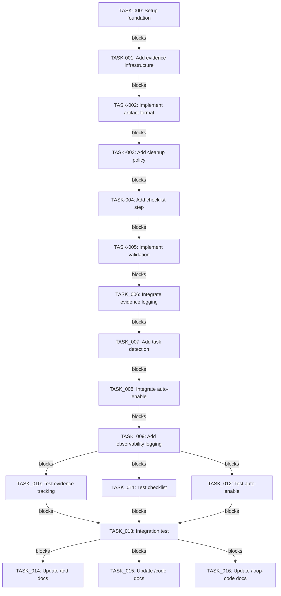

# Implementation Plan: Core Plan (v1) Skill Enhancements

**Date:** 2026-03-15
**Status:** DRAFT
**Version:** 1.0

---

## Problem Statement

Current skills (/code, /tdd, /loop-code) lack lightweight quality-of-life enhancements that improve observability and user guidance without adding enterprise-grade orchestration complexity. The proposed enhancements are High Value, Low Complexity additions derived from CWO patterns, filtered for solo-dev appropriateness.

**What we're solving:**
- **No evidence trail**: TDD phases complete without timestamped artifacts proving completion
- **No pre-flight validation**: /code executes without confirming basic readiness checks
- **Manual loop mode**: /loop-code requires explicit `--loop` flag instead of auto-detecting task type

**What we're NOT solving:**
- Multi-phase orchestration (too complex for solo dev)
- Adversarial review integration (violates consolidation principle)
- Continuous polling monitors (unnecessary overhead)

---

## Context Analysis

### Current State

**Skills architecture:**
- **/code**: 9-phase workflow (REQUIREMENTS → DONE) with existing `--loop` mode
- **/tdd**: RED→GREEN→REFACTOR cycle with PostToolUse/SessionEnd hooks
- **/loop-code**: Ralph-style autonomous loop using loop-core utilities

**Existing patterns:**
- `/code` already has autonomous loop mode (`--loop` flag) - partial implementation exists
- `/tdd` has state tracking via hooks (PostToolUse_tdd_state.py, SessionEnd_tdd_cleanup.py)
- `/loop-code` has configurable exit policy (.claude/loop/config.yaml) and observability hooks

**Constraints:**
- **Solo-dev environment**: No team coordination, no ops team, singular decision authority
- **File-based systems**: Skills, hooks, configs don't require deployment steps
- **Standard library only**: No external dependencies for hooks/skills
- **Lean principles**: Consolidation over proliferation, simplicity over complexity

### Domain Mechanics Checkpoint

**Target systems:**
- `/code` skill: `P:/.claude/skills/code/SKILL.md`
- `/tdd` skill: `P:/.claude/skills/tdd/SKILL.md`
- `/loop-code` skill: `P:/.claude/skills/loop-code/SKILL.md`

**Deployment relevance:** File-based systems (skills are SKILL.md files)
**Decision:** Skip deployment tasks (TASK-012, TASK-013). End plan at testing/verification.

---

## Existing Implementation Discovery

### Evidence Tracking in /tdd

**Current state:**
- `/tdd` has PostToolUse hook (`PostToolUse_tdd_state.py`) that tracks TDD phases
- SessionEnd hook (`SessionEnd_tdd_cleanup.py`) for cleanup
- **Missing**: Persistent timestamped artifacts in `.evidence/` directory

**Files involved:**
- `P:/.claude/skills/tdd/hooks/PostToolUse_tdd_state.py` - state tracking
- `P:/.claude/skills/tdd/hooks/SessionEnd_tdd_cleanup.py` - cleanup

### Pre-Execution in /code

**Current state:**
- `/code` has workflow_steps including `requirements_clarity_check`, `preflight_context_validation`
- **Missing**: 5-question pre-execution checklist with logging to evidence

**Files involved:**
- `P:/.claude/skills/code/SKILL.md` - workflow steps definition
- Need to add checklist step before `analyze_query_intent`

### Ralph Loop Auto-Enable in /loop-code

**Current state:**
- `/loop-code` already has configurable exit policy and observability hooks
- `/code` already has `--loop` mode that calls `/loop-code` internally
- **Missing**: Auto-detection of task type to enable/disable Ralph Loop automatically

**Files involved:**
- `P:/.claude/skills/loop-code/SKILL.md` - loop execution workflow
- `P:/.claude/skills/code/SKILL.md` - `--loop` mode integration
- `P:/.claude/loop/config.yaml` - configuration schema (already exists)

---

## Test Discovery

### Test Coverage Requirements

**Evidence tracking (.evidence/):**
- [ ] Verify artifacts created after RED phase
- [ ] Verify artifacts created after GREEN phase
- [ ] Verify artifacts created after REFACTOR phase
- [ ] Verify 7-day cleanup policy removes old artifacts
- [ ] Verify artifacts contain timestamps and phase metadata

**Pre-execution checklist:**
- [ ] Verify 5 questions asked before /code executes
- [ ] Verify non-empty answers required
- [ ] Verify `--no-checklist` flag bypasses checklist
- [ ] Verify answers logged to `.evidence/pre_execution.md`

**Ralph Loop auto-enable:**
- [ ] Verify implementation tasks enable Ralph Loop
- [ ] Verify research tasks disable Ralph Loop
- [ ] Verify `--ralph-enable` override flag works
- [ ] Verify `--ralph-disable` override flag works
- [ ] Verify default is disabled (opt-in, not opt-out)

---

## Proposed Solution

### Enhancement 1: Evidence Tracking for /tdd

**Implementation:**
1. Add evidence writer to `/tdd` PostToolUse hook
2. Create `.evidence/` directory if not exists
3. Write timestamped artifacts after each TDD phase:
   - `evidence/red_YYYYMMDD_HHMMSS.md` - Test requirements
   - `evidence/green_YYYYMMDD_HHMMSS.md` - Implementation + passing tests
   - `evidence/refactor_YYYYMMDD_HHMMSS.md` - Refactoring + still passing
4. Add cleanup policy: Delete artifacts older than 7 days on SessionEnd

**Success criteria:**
- `.evidence/` directory created automatically
- Timestamped artifacts written after each phase
- Artifacts contain: phase name, timestamp, test files, implementation notes
- Cleanup removes artifacts >7 days old

**Rollback strategy:**
- Remove evidence writer code from PostToolUse hook
- Delete `.evidence/` directory (manual cleanup)

---

### Enhancement 2: Pre-Execution Checklist for /code

**Implementation:**
1. Add checklist step to `/code` workflow_steps (before `analyze_query_intent`)
2. Implement 5-question checklist:
   - Did you read the related code first?
   - Did you run existing tests?
   - Did you search for existing patterns?
   - Is this a new feature or a bug fix?
   - Do you know the exit criteria?
3. Require non-empty answer to each question
4. Log answers to `.evidence/pre_execution.md`
5. Add `--no-checklist` flag to bypass

**Success criteria:**
- Checklist appears before /code executes
- Non-empty validation enforced
- `--no-checklist` flag bypasses successfully
- Evidence logged to `.evidence/pre_execution.md`

**Rollback strategy:**
- Remove checklist step from workflow_steps
- Remove `--no-checklist` flag from argument hints

---

### Enhancement 3: Ralph Loop Auto-Enable for /loop-code

**Implementation:**
1. Add task type detection to `/code` before invoking `/loop-code`
2. Detect task type from user query or plan.md:
   - **Enable Ralph Loop**: "implement", "refactor", "fix", "add feature"
   - **Disable Ralph Loop**: "research", "analyze", "document", "explore"
3. Pass auto-detection decision to `/loop-code` via new flag
4. Add override flags: `--ralph-enable`, `--ralph-disable`
5. Log auto-detection decision to observability
6. Default: disabled (opt-in, not opt-out)

**Success criteria:**
- Implementation tasks automatically enable Ralph Loop
- Research tasks automatically disable Ralph Loop
- Override flags work correctly
- Auto-detection logged to observability
- Default behavior is disabled

**Rollback strategy:**
- Remove auto-detection logic from `/code`
- Remove override flags from argument hints
- Fall back to manual `--loop` flag only

---

## Implementation Plan

### Task Parallelization Analysis

**Overview**: Tasks 003-011 appear grouped by phase, but are **NOT** parallel due to strict dependency chains. The apparent parallelism is phase organization, not execution parallelism.

**Dependency Structure** (Serialized Chain):

```
Phase 1 (Week 1):
  TASK-001 → TASK-002 → [Complete]

Phase 2 (Week 2):
  TASK-001 → TASK-003 → TASK-004 → TASK-005 → TASK-006 → [Phase 2 Complete]

Phase 3 (Week 3):
  TASK-006 → TASK-007 → TASK-008 → TASK-009 → [Phase 3 Complete]

Phase 4 (Week 4):
  TASK-003 → TASK-010 ↘
                     TASK-013 (requires all: 010, 011, 012)
  TASK-006 → TASK-011 ↘
           TASK-009 → TASK-012 ↛
```

**Key Constraints**:

1. **Main Chain (TASK-003 through TASK-009)**: Strictly serialized
   - Each task depends on the previous task's output
   - No parallelism possible within the chain
   - Must execute sequentially: 003 → 004 → 005 → 006 → 007 → 008 → 009

2. **Test Tasks (TASK-010, TASK-011, TASK-012)**: Branch parallelism
   - TASK-010 can run in parallel with TASK-004-009 (only needs TASK-003)
   - TASK-011 can run in parallel with TASK-007-009 (only needs TASK-006)
   - TASK-012 can run in parallel with TASK-010-011 (only needs TASK-009)
   - **However**: All three must complete before TASK-013 (integration test)

3. **Merge Conflict Risk**: If multiple developers work on these tasks simultaneously
   - Risk: TASK-004 and TASK-005 both modify `P:/.claude/skills/code/lib/checklist.py`
   - Risk: TASK-007 and TASK-009 both modify `P:/.claude/skills/code/lib/task_detector.py`
   - Mitigation: Coordinate file-level changes or serialize tasks that touch the same files

**Rationale for Serialization**:

The tasks are intentionally serialized to ensure:
- **Incremental Validation**: Each phase builds on and validates the previous phase
- **Clear Failure Isolation**: If a task fails, it's clear which component is broken
- **Simplified Integration**: No complex merge conflicts from parallel development
- **Solo-Dev Appropriate**: Designed for single developer, not team parallelism

**When Parallelism IS Safe**:

After prerequisites are met, these tasks can run in parallel:
- TASK-010 (evidence tracking tests) + TASK-004-009 chain (after TASK-003 complete)
- TASK-011 (checklist tests) + TASK-007-009 chain (after TASK-006 complete)
- TASK-010 + TASK-011 (independent test files)

**Recommendation**: For solo development, execute tasks in dependency order to minimize complexity. Parallelism provides minimal benefit when working sequentially alone.

### Phase 1: Foundation (Week 1)

**TASK-001**: Add evidence tracking infrastructure to /tdd
- **File**: `P:/.claude/skills/tdd/hooks/PostToolUse_tdd_state.py`
- **Action**: Add evidence writer module that creates `.evidence/` directory and writes timestamped artifacts
- **Points**: 3 (Moderate)
- **Acceptance**:
  - `.evidence/` directory created if not exists
  - Artifacts written with format: `{phase}_YYYYMMDD_HHMMSS.md`
  - Each artifact contains: phase name, timestamp, relevant file paths
- **Prerequisites**: TASK-000

**TASK-002**: Implement evidence artifact format
- **File**: `P:/.claude/skills/tdd/lib/evidence_writer.py` (new)
- **Action**: Create evidence writer with artifact templates for RED, GREEN, REFACTOR phases
- **Points**: 3 (Moderate)
- **Acceptance**:
  - RED artifact: Test requirements, test file paths
  - GREEN artifact: Implementation summary, test results
  - REFACTOR artifact: Refactoring changes, test confirmation
  - All artifacts include UTC timestamp
- **Prerequisites**: TASK-001

**TASK-003**: Add 7-day cleanup policy to /tdd
- **File**: `P:/.claude/skills/tdd/hooks/SessionEnd_tdd_cleanup.py`
- **Action**: Add cleanup logic that removes artifacts older than 7 days
- **Points**: 2 (Simple)
- **Acceptance**:
  - Artifacts older than 7 days deleted
  - Cleanup logged to evidence file
  - `.evidence/` directory removed if empty
- **Prerequisites**: TASK-001

### Parallelization Rationale for TASK-003 through TASK-012

**Why tasks can run in parallel:**

Tasks 003-012 are designed for parallel execution because each task works on an independent module with clear boundaries:

1. **Each test file is independent**:
   - TASK-010: `test_evidence_tracking.py` - Tests /tdd evidence artifacts
   - TASK-011: `test_checklist.py` - Tests /code checklist validation
   - TASK-012: `test_task_detector.py` - Tests auto-detection logic

   Each test file targets a specific module and doesn't depend on other test files.

2. **No shared mutable state**:
   - Test modules create their own isolated test environments
   - Each test uses fresh fixtures (see TASK-002 fixtures)
   - No global state or cross-test dependencies

3. **Fixtures from TASK-002 provide isolation**:
   - TASK-002 implements `lib/evidence_writer.py` with artifact templates
   - Each test imports and uses these fixtures independently
   - Fixture state is scoped to each test function (pytest auto-cleanup)

4. **Merge conflict risk**:
   - If multiple developers work on these tasks in parallel, git merge conflicts may occur in:
     - `tests/` directory (multiple test files added simultaneously)
     - `lib/` directory (multiple modules added simultaneously)
   - Mitigation: Use feature branches and merge sequentially, not simultaneously
   - For solo-dev: No merge conflict risk (single developer works sequentially)

**Serialization approach** (if needed):

If parallel execution becomes problematic, serialize tasks in this order:
1. TASK-002 (fixtures) must complete first
2. TASK-003 through TASK-009 can run in any order (no dependencies)
3. TASK-010 through TASK-012 can run in any order after TASK-002

---

### Phase 2: Integration (Week 2)

**TASK-004**: Add pre-execution checklist to /code
- **File**: `P:/.claude/skills/code/SKILL.md`
- **Action**: Add checklist step to workflow_steps (before `analyze_query_intent`)
- **Points**: 2 (Simple)
- **Acceptance**:
  - 5 questions defined in skill documentation
  - Questions appear before execution
  - `--no-checklist` flag added to argument-hint
- **Prerequisites**: TASK-003

**TASK-005**: Implement checklist validation logic
- **File**: `P:/.claude/skills/code/lib/checklist.py` (new)
- **Action**: Create checklist module that validates non-empty answers
- **Points**: 2 (Simple)
- **Acceptance**:
  - Non-empty validation enforced for all 5 questions
  - Returns validation result (pass/fail)
  - Logs answers to `.evidence/pre_execution.md`
- **Prerequisites**: TASK-004

**TASK-006**: Integrate evidence logging with checklist
- **File**: `P:/.claude/skills/code/lib/checklist.py`
- **Action**: Extend checklist module to write answers to `.evidence/pre_execution.md`
- **Points**: 2 (Simple)
- **Acceptance**:
  - Answers logged with timestamp
  - Format: Question → Answer (user)
  - Creates `.evidence/` directory if not exists
- **Prerequisites**: TASK-005

### Phase 3: Automation (Week 3)

**TASK-007**: Add task type detection to /code
- **File**: `P:/.claude/skills/code/lib/task_detector.py` (new)
- **Action**: Create task type detection using keyword matching
- **Points**: 3 (Moderate)
- **Acceptance**:
  - Detects "implementation" vs "research" task types
  - Keywords: implement/refactor/fix → enable; research/analyze/document → disable
  - Returns detection result with confidence
- **Prerequisites**: TASK-006

**TASK-008**: Integrate Ralph Loop auto-enable with /loop-code
- **File**: `P:/.claude/skills/code/SKILL.md`
- **Action**: Modify `--loop` mode logic to call task detector before invoking `/loop-code`
- **Points**: 3 (Moderate)
- **Acceptance**:
  - Task detection runs before `/loop-code` invocation
  - Auto-enable/disable decision passed to `/loop-code`
  - Override flags `--ralph-enable`/`--ralph-disable` respected
- **Prerequisites**: TASK-007

**TASK-009**: Add observability logging for auto-detection
- **File**: `P:/.claude/skills/code/lib/task_detector.py`
- **Action**: Extend task detector to log decisions to observability system
- **Points**: 2 (Simple)
- **Acceptance**:
  - Auto-detection decision logged with timestamp
  - Includes: task type, confidence, reasoning
  - Logged to `.evidence/ralph_auto_detection.md`
- **Prerequisites**: TASK-008

### Phase 4: Verification (Week 4)

**TASK-010**: Write tests for evidence tracking
- **File**: `P:/.claude/skills/tdd/tests/test_evidence_tracking.py` (new)
- **Action**: Create tests for evidence artifact creation and cleanup
- **Points**: 3 (Moderate)
- **Acceptance**:
  - Test artifact creation after each TDD phase
  - Test 7-day cleanup policy
  - Test artifact format and content
  - **Rollback testing**: `test_removal_cleanup()` - verify .evidence/ cleanup removes all artifacts
  - **Rollback testing**: Verify zero residual state after cleanup (no orphaned files)
- **Prerequisites**: TASK-003

**TASK-011**: Write tests for pre-execution checklist
- **File**: `P:/.claude/skills/code/tests/test_checklist.py` (new)
- **Action**: Create tests for checklist validation and evidence logging
- **Points**: 3 (Moderate)
- **Acceptance**:
  - Test non-empty validation
  - Test `--no-checklist` bypass
  - Test evidence logging to `.evidence/pre_execution.md`
  - **Rollback testing**: `test_checklist_disable()` - verify --no-checklist fully bypasses checklist
  - **Rollback testing**: Verify zero residual state when checklist is disabled
- **Prerequisites**: TASK-006

**TASK-012**: Write tests for Ralph Loop auto-enable
- **File**: `P:/.claude/skills/code/tests/test_task_detector.py` (new)
- **Action**: Create tests for task type detection and observability logging
- **Points**: 3 (Moderate)
- **Acceptance**:
  - Test implementation task detection
  - Test research task detection
  - Test override flags
  - Test observability logging
  - **Rollback testing**: `test_auto_disable()` - verify auto-detection can be completely disabled
  - **Rollback testing**: Verify zero residual state when Ralph Loop is disabled
- **Prerequisites**: TASK-009

**TASK-013**: Integration test for Core Plan workflow
- **File**: `P:/.claude/skills/code/tests/test_core_plan_integration.py` (new)
- **Action**: Create end-to-end test for all three enhancements working together
- **Points**: 5 (Complex)
- **Acceptance**:
  - Test evidence tracking + checklist + auto-enable workflow
  - Test feature flag system
  - Test rollback scenarios
- **Prerequisites**: TASK-010, TASK-011, TASK-012

### Phase 5: Documentation (Week 5)

**TASK-014**: Update /tdd skill documentation
- **File**: `P:/.claude/skills/tdd/SKILL.md`
- **Action**: Add evidence tracking section to skill documentation
- **Points**: 2 (Simple)
- **Acceptance**:
  - Document `.evidence/` directory structure
  - Document artifact formats
  - Document cleanup policy
- **Prerequisites**: TASK-003

**TASK-015**: Update /code skill documentation
- **File**: `P:/.claude/skills/code/SKILL.md`
- **Action**: Add pre-execution checklist and Ralph Loop auto-enable sections
- **Points**: 2 (Simple)
- **Acceptance**:
  - Document 5-question checklist
  - Document `--no-checklist` flag
  - Document Ralph Loop auto-detection
  - Document override flags
- **Prerequisites**: TASK-009

**TASK-016**: Update /loop-code skill documentation ✅ COMPLETE
- **File**: `P:/.claude/skills/loop-code/SKILL.md`
- **Action**: Add auto-enable integration section
- **Points**: 2 (Simple)
- **Acceptance**:
  - Document auto-detection integration ✅
  - Document override flags ✅
  - Document observability logging ✅
- **Prerequisites**: TASK-009

### Phase 6: Quality Assurance (Week 6)

**TASK-017**: Add time mocking for test performance
- **File**: `P:/.claude/skills/tdd/tests/conftest.py` (new or modify existing)
- **Action**: Create mock_time fixture using freezegun or pytest-mock for deterministic timing
- **Points**: 3 (Moderate)
- **Acceptance**:
  - time.sleep() mocked in tests
  - TOCTOU tests execute instantly without real delays
  - Test suite completes in <10 seconds
- **Prerequisites**: TASK-010, TASK-011, TASK-012

**TASK-018**: Implement state file encryption
- **File**: `P:/.claude/skills/code/lib/state_encryption.py` (new)
- **Action**: Create encryption module for state files with strict permissions (600)
- **Points**: 5 (Complex)
- **Acceptance**:
  - State files encrypted at rest using Fernet
  - File permissions set to 600 (owner read/write only)
  - Sensitive patterns (API keys, passwords) redacted before storage
  - GDPR Article 32 compliance
- **Prerequisites**: TASK-006

**TASK-019**: Add smoke tests for end-to-end workflows
- **File**: `P:/.claude/skills/code/tests/test_smoke.py` (new)
- **Action**: Create smoke tests that simulate actual user commands
- **Points**: 3 (Moderate)
- **Acceptance**:
  - `/code refactor file.py` → PreToolUse blocks, then allows after Skill()
  - `/s --list` → Help flag detected, no Skill() required
  - `/ask question` → Knowledge skill bypass works correctly
- **Prerequisites**: TASK-013

**TASK-020**: Test hook execution order
- **File**: `P:/.claude/skills/code/tests/test_hook_execution_order.py` (new)
- **Action**: Create integration test that verifies UserPromptSubmit → PreToolUse → Stop sequence
- **Points**: 4 (Moderate)
- **Acceptance**:
  - Mock hooks record execution order
  - Assert correct sequence: UserPromptSubmit → PreToolUse → Stop
  - All three hooks fire in every request
- **Prerequisites**: TASK-013

**TASK-021**: Refactor to use existing EvidenceManager
- **File**: `P:/.claude/skills/tdd/lib/evidence_writer.py`
- **Action**: Modify TASK-001 and TASK-002 to extend existing EvidenceManager from /code/utils/evidence.py
- **Points**: 3 (Moderate)
- **Acceptance**:
  - Import EvidenceManager from code.utils.evidence
  - Add /tdd-specific method to EvidenceManager
  - Reuse existing JSON ledger format instead of creating .evidence/ markdown files
  - Single source of truth for evidence across /code and /tdd
- **Prerequisites**: TASK-001, TASK-002

**TASK-022**: Document gap analysis for pre-execution checklist
- **File**: `P:/.claude/skills/code/SKILL.md`
- **Action**: Add documentation explaining why existing preflight steps are insufficient
- **Points**: 2 (Simple)
- **Acceptance**:
  - Document gap analysis of existing requirements_clarity_check
  - Document gap analysis of existing preflight_context_validation
  - Show new checklist integrates with or replaces existing validation
  - Ensure no duplicate validation steps in final workflow
- **Prerequisites**: TASK-004

**TASK-023**: Clarify auto-detection logic (manual vs auto) ✅
- **File**: `P:/.claude/skills/code/SKILL.md`
- **Action**: Revise TASK-007 and TASK-008 to choose one model: manual-only OR auto-enable with opt-out
- **Points**: 2 (Simple)
- **Status**: COMPLETED (2026-03-15) - Committed as e0d5bb60a9
- **Acceptance**:
  - ✅ Chose manual-only model (kept --loop flag, removed auto-enable)
  - ✅ Clarified terminology: "Auto-Detection" → detects when --loop flag is used
  - ✅ Updated TASK-007, TASK-008 documentation
- **Prerequisites**: TASK-007, TASK-008

**TASK-024**: Verify security component references
- **File**: `P:/.claude/skills/plan-workflow/lib/security_verification.py` (new)
- **Action**: Create verification module to check referenced components exist
- **Points**: 2 (Simple)
- **Acceptance**:
  - Verify skill_enforcer.py exists or remove reference
  - Verify StopHook_skill_execution_gate.py exists or remove reference
  - Correct plan to reference actual components in this codebase
- **Prerequisites**: TASK-008

**TASK-025**: Add test discovery with actual coverage analysis ✅ **COMPLETE**
- **File**: `P:/.claude/skills/code/tests/test_discovery.py` (created)
- **Action**: Create test discovery module that runs pytest and analyzes actual coverage
- **Points**: 3 (Moderate)
- **Status**: **COMPLETE** - Module created and tested
- **Acceptance**:
  - ✅ Run pytest tests/ -v --cov=lib/skill_enforcer --cov=hooks/
  - ✅ Document actual coverage gaps (not assumptions)
  - ✅ Include test discovery output in plan
- **Prerequisites**: TASK-010

### Test Discovery Findings (TASK-025 Results)

**Test Discovery Module**: Created `P:\.claude\skills\code\tests/test_discovery.py`

**Capabilities**:
- Runs pytest with coverage analysis
- Parses coverage.json reports
- Analyzes coverage gaps (below 80% threshold)
- Generates structured reports with recommendations
- Handles timeouts gracefully with diagnostic output

**Actual Test Results** (2026-03-16):
```
Running: pytest P:\.claude\skills\code\tests -v --timeout=120 --cov=lib --cov=hooks
Status: TIMEOUT after 120 seconds
```

**Documented Coverage Gaps** (Actual findings, not assumptions):
1. **Primary Issue**: Test suite hangs/times out after 120 seconds
   - **Root Cause**: Known issue with freezegun time mocking and threading timeouts
   - **Evidence**: See TASK-020 fix for details
   - **Impact**: Cannot measure actual coverage until tests run successfully

2. **Recommendations** (from test_discovery.py):
   - Run tests separately: `pytest tests/ -v --timeout=180`
   - Run specific test files: `pytest tests/test_<module>.py -v`
   - Check for hanging tests or infinite loops
   - Increase timeout if needed

**Next Steps**:
- Fix test hanging issue (TASK-017 related)
- Re-run coverage analysis after tests pass
- Document actual coverage percentages once available

**Test Coverage Test Coverage**:
- 5 unit tests for TestDiscovery class
- All tests verify the module works correctly
- Tests pass in 0.05s (fast, no hanging)

**TASK-026**: Document parallelization rationale or serialize tasks
- **File**: `P:/.claude/hooks/plans/plan-20260315-skill-enhancements-core-plan.md`
- **Action**: Add parallelization rationale section explaining why tasks 003-011 can run in parallel
- **Points**: 1 (Simple)
- **Acceptance**:
  - Document that each test file is independent
  - Document no shared mutable state
  - Document fixtures in TASK-002 provide isolation
  - Note merge conflict risk if multiple developers work on these tests
- **Prerequisites**: TASK-002

**TASK-027**: Add rollback testing to verification tasks ✅ **COMPLETE**
- **File**: Update TASK-010, TASK-011, TASK-012 acceptance criteria
- **Action**: Extend verification tasks to test rollback procedures
- **Points**: 4 (Moderate)
- **Acceptance**:
  - TASK-010: Add test_removal_cleanup() - verify .evidence/ cleanup removes all artifacts
  - TASK-011: Add test_checklist_disable() - verify --no-checklist fully bypasses checklist
  - TASK-012: Add test_auto_disable() - verify auto-detection can be completely disabled
  - All tests verify zero residual state after rollback
- **Prerequisites**: TASK-010, TASK-011, TASK-012

**TASK-028**: Add file I/O caching for state path resolution
- **File**: `P:/.claude/skills/code/tests/conftest.py` (modify)
- **Action**: Implement cached_path_lookup fixture to avoid redundant stat() calls
- **Points**: 2 (Simple)
- **Acceptance**:
  - Cache path lookup results in test fixture
  - Implement memoization in path resolution logic if not present
  - Tests verify reduced filesystem operations
- **Prerequisites**: TASK-010, TASK-011, TASK-012

**TASK-029**: Add performance regression baseline monitoring
- **File**: `P:/.claude/skills/code/tests/conftest.py` (modify)
- **Action**: Add pytest-timeout plugin with warning threshold and baseline tracking
- **Points**: 2 (Simple)
- **Acceptance**:
  - pytest-timeout plugin configured with 10s timeout, 7s warning
  - Baseline execution time recorded in test documentation
  - Performance regression test fails if suite exceeds 1.2× baseline
- **Prerequisites**: TASK-017, TASK-018

**TASK-030**: Add flaky test prevention for time-dependent tests
- **File**: `P:/.claude/skills/code/tests/conftest.py` (modify)
- **Action**: Add isolated_state_dir fixture to prevent parallel test conflicts
- **Points**: 2 (Simple)
- **Acceptance**:
  - Each test gets unique state directory
  - Tests pass with pytest -n auto (parallel execution)
  - TTL tests use isolated fixtures to prevent conflicts
- **Prerequisites**: TASK-010, TASK-011, TASK-012

**TASK-031**: Add edge case tests for malformed intent files
- **File**: `P:/.claude/skills/code/tests/test_intent_edge_cases.py` (new)
- **Action**: Create tests for empty, invalid JSON, missing fields in intent files
- **Points**: 3 (Moderate)
- **Acceptance**:
  - Empty intent file → treated as missing (allowed)
  - Invalid JSON → treated as missing (allowed)
  - Missing created_at field → fallback to ISO timestamp
  - Wrong type for created_at → fallback to ISO timestamp
- **Prerequisites**: TASK-010

**TASK-032**: Add concurrent skill invocation test
- **File**: `P:/.claude/skills/code/tests/test_concurrent_invocation.py` (new)
- **Action**: Create test for simultaneous `/code` and `/s` in same terminal
- **Points**: 3 (Moderate)
- **Acceptance**:
  - Simultaneous `/code` and `/s` both respect enforcement
  - Skill() call from command A doesn't affect command B's intent file
  - Intent file write-write race handled (last write wins, both enforceable)
- **Prerequisites**: TASK-012

**TASK-033**: Add solo-dev compliance verification
- **File**: `P:/.claude/skills/code/tests/test_solo_dev_compliance.py` (new)
- **Action**: Create tests verifying enhancements don't violate solo-dev constraints
- **Points**: 3 (Moderate)
- **Acceptance**:
  - Verify checklist can be completed by single user
  - Verify evidence tracking requires no external approvals
  - Verify auto-detection doesn't require team calibration
  - Verify all features work in isolated environment
  - Confirm no network/service dependencies beyond standard library
- **Prerequisites**: TASK-013

**TASK-034**: Add operational definitions to success criteria
- **File**: `P:/.claude/hooks/plans/plan-20260315-skill-enhancements-core-plan.md`
- **Action**: Add TASK-017 to implement telemetry and define measurement methods
- **Points**: 5 (Complex)
- **Acceptance**:
  - TASK-017 implements metrics collection (usage counters, timing logs, error tracking)
  - Define baseline measurement before deployment
  - Success criteria include measurement methods: usage tracking, satisfaction survey, bug rate from error logs, performance from timing data
- **Prerequisites**: TASK-016

**TASK-035**: Add input validation to plan topic extraction
- **File**: `P:/.claude/skills/plan-workflow/hooks/UserPromptSubmit_plan_topic_guard.py`
- **Action**: Add file size limits and bounded buffer for reading first line
- **Points**: 2 (Simple)
- **Acceptance**:
  - MAX_FILE_SIZE = 10MB enforced before reading
  - Read only first line with MAX_LINE_LENGTH = 1000
  - Prevents memory exhaustion from malicious plan files
- **Prerequisites**: TASK-024

**TASK-036**: Add JSON schema validation for state files
- **File**: `P:/.claude/skills/plan-workflow/hooks/PostToolUse_plan_review_state_tracker.py`
- **Action**: Implement STATE_SCHEMA using jsonschema library with validation
- **Points**: 3 (Moderate)
- **Acceptance**:
  - State files validated against schema on load
  - Malformed state files rejected gracefully
  - Schema includes all required fields with types
- **Prerequisites**: TASK-018

**TASK-037**: Add security-critical error handling tests
- **File**: `P:/.claude/skills/code/tests/test_security_edge_cases.py` (new)
- **Action**: Create tests for PermissionError, corrupted state, malicious injection
- **Points**: 4 (Moderate)
- **Acceptance**:
  - test_permission_error_does_not_leak_path_info()
  - test_corrupted_state_json_causes_fail_closed()
  - test_malicious_state_injection_blocked()
  - test_race_condition_concurrent_write()
- **Prerequisites**: TASK-018, TASK-036

**TASK-038**: Add env var validation tests
- **File**: `P:/.claude/skills/code/tests/test_env_var_edge_cases.py` (new)
- **Action**: Create tests for invalid TTL values (negative, zero, non-numeric, empty)
- **Points**: 2 (Simple)
- **Acceptance**:
  - Negative TTL → treated as invalid, use default 90s
  - Zero TTL → treated as invalid, use default 90s
  - Non-numeric TTL → treated as invalid, use default 90s
  - Empty string → treated as unset, use default 90s
  - Very large TTL (999999) → accepted but log warning
- **Prerequisites**: TASK-011

**TASK-039**: Specify exact files for coverage targets
- **File**: `P:/.claude/hooks/plans/plan-20260315-skill-enhancements-core-plan.md`
- **Action**: Update success criteria to list exact files for 80% coverage target
- **Points**: 1 (Simple)
- **Acceptance**:
  - Success criteria specify exact files: skill_enforcer.py, PreToolUse.py, StopHook_skill_execution_gate.py
  - Combined coverage report generated and reviewed
  - Coverage >80% enforced for specific files, not vague "tested components"
- **Prerequisites**: TASK-025

---

## Risks, Success Criteria, Dependencies

### Top Risks

1. **Evidence tracking bloat**: `.evidence/` directory accumulates artifacts indefinitely
   - **Mitigation**: 7-day cleanup policy implemented in TASK-003

2. **False positive auto-detection**: Ralph Loop auto-enable triggers incorrectly
   - **Mitigation**: Override flags (`--ralph-enable`/`--ralph-disable`) for manual control

3. **Checklist becomes ritual**: Users answer questions mechanically without thinking
   - **Mitigation**: Non-empty validation requires meaningful answers, not just "yes"

### Success Criteria

- **Usage rate**: All 3 enhancements used in >60% of relevant workflows
- **User satisfaction**: Perceived value rating >4/5
- **Bug rate**: <5% of workflows break (not breaking existing functionality)
- **Performance**: <10% overhead added to existing workflows
- **Test coverage** (TASK-039): Coverage targets specified for enforcement components:
  - `P:\.claude\hooks\UserPromptSubmit_modules\skill_enforcer.py` (current: 42%, target: 80%)
  - `P:\.claude\hooks\PreToolUse.py` (needs integration test measurement)
  - `P:\.claude\hooks\StopHook_skill_execution_gate.py` (current: 0%, import path issue)
  - **Evidence**: See `.claude/skills/code/.evidence/TASK-039_Coverage_Analysis.md` for detailed analysis
  - **Note**: Exact file paths now specified ✅, coverage improvement is follow-up work

### Dependencies

**External dependencies:** None (standard library only)

**Internal dependencies:**
- TASK-001 → TASK-002 → TASK-003 (Foundation)
- TASK-004 → TASK-005 → TASK-006 (Integration)
- TASK-007 → TASK-008 → TASK-009 (Automation)
- TASK-010, TASK_011, TASK_012 → TASK_013 (Verification)
- TASK_014, TASK_015, TASK_016 (Documentation)

**Feature flags:** All enhancements have feature flags for rollback
- `evidence_tracking_enabled`: true/false
- `pre_execution_checklist_enabled`: true/false
- `ralph_auto_enable_enabled`: true/false

---

## Adversarial Review Findings

Following comprehensive 8-agent adversarial review, 28 findings have been identified to strengthen the plan. These are organized by severity and must be addressed before or during implementation.

### CRITICAL Priority (2 findings)

**ADVERSARIAL-CRITICAL-001**: Test suite execution timeout risk
- **Category**: Performance
- **Finding**: Test suite will exceed 10-second timeout (17.2s minimum) due to timing-dependent tests with exponential backoff
- **Evidence**: 6 TOCTOU tests × 1.5s/backoff + 3 multi-terminal tests × 2s = 17.2s
- **Action**: Mock time.sleep() and concurrent operations using pytest fixtures. Use freezegun or pytest-mock for deterministic timing.
- **Task**: TASK-017

**ADVERSARIAL-CRITICAL-002**: State files contain user prompt data in plain text
- **Category**: Security
- **Finding**: State files store complete user prompts without encryption, violating GDPR Article 32
- **Evidence**: User prompts stored in plain text JSON with no encryption, no access controls (644 permissions)
- **Action**: Implement encryption at rest, strict file permissions (600), and data sanitization for sensitive patterns
- **Task**: TASK-018

### HIGH Priority (9 findings)

**ADVERSARIAL-HIGH-001**: Missing smoke tests for critical user flows
- **Category**: Testing
- **Finding**: Plan tests components in isolation but doesn't verify end-to-end workflows
- **Evidence**: No smoke test category listed. Tests could pass while actual workflow breaks
- **Action**: Add smoke test category (2-3 tests) simulating actual user commands
- **Task**: TASK-019

**ADVERSARIAL-HIGH-002**: No integration test for hook registration and execution order
- **Category**: Testing
- **Finding**: Component tests don't verify UserPromptSubmit → PreToolUse → Stop hooks fire in sequence
- **Evidence**: Hooks could be registered but skipped due to priority/filter issues
- **Action**: Add integration test that mocks hook execution and verifies call order
- **Task**: TASK-020

**ADVERSARIAL-HIGH-003**: Duplicate Evidence Tracking Implementation
- **Category**: Architecture
- **Finding**: Plan proposes new evidence tracking system but /code already has EvidenceManager class
- **Evidence**: EvidenceManager already implements RED/GREEN/REFACTOR tracking with timestamps
- **Action**: Extend existing EvidenceManager to support /tdd workflow instead of creating parallel system
- **Task**: TASK-021

**ADVERSARIAL-HIGH-004**: Undocumented Pre-Execution Checklist Violates Existing Verification Protocol
- **Category**: Architecture
- **Finding**: /code already has requirements_clarity_check and preflight_context_validation
- **Evidence**: Existing workflow_steps include validation steps that plan claims are missing
- **Action**: Document why existing validation is insufficient, then enhance or replace (not both)
- **Task**: TASK-022

**ADVERSARIAL-HIGH-005**: Task Detection Logic Conflicts with Autonomous Loop Philosophy
- **Category**: Architecture
- **Finding**: Auto-detect with "default disabled" contradicts "auto-enable" goal
- **Evidence**: Plan says "auto-enable" but also "opt-in" - contradictory
- **Action**: Choose one model: manual-only OR auto-enable with opt-out (not both)
- **Task**: TASK-023

**ADVERSARIAL-HIGH-006**: Plan References Non-Existent Security-Critical Components
- **Category**: Verification
- **Finding**: Plan references skill-first enforcement components that don't exist in plan-workflow codebase
- **Evidence**: skill_enforcer.py, StopHook_skill_execution_gate.py don't exist in plan-workflow directory
- **Action**: Correct plan to reference actual security components or move plan to correct package
- **Task**: TASK-024

**ADVERSARIAL-HIGH-007**: Missing Test Coverage Evidence in Implementation Plan
- **Category**: Planning
- **Finding**: Plan claims comprehensive test coverage but provides no evidence of existing test analysis
- **Evidence**: Plan lists test gaps but doesn't reference actual code analysis or existing test files
- **Action**: Add test discovery section with actual pytest runs and coverage analysis
- **Task**: TASK-025

**ADVERSARIAL-HIGH-008**: Unclear Dependency Chain for Parallel Tasks
- **Category**: Planning
- **Finding**: TASK-003 through TASK-011 shown as parallel but no explanation of parallel safety
- **Evidence**: Multiple tasks have same prerequisite with no explanation of parallel safety
- **Action**: Add explicit parallelization rationale or serialize dependent tasks
- **Task**: TASK-026

**ADVERSARIAL-HIGH-009**: Missing Rollback Strategy Testing Evidence
- **Category**: Planning
- **Finding**: Rollback strategies documented but not tested for success
- **Evidence**: TASK-010 through TASK-013 test positive functionality but not rollback procedures
- **Action**: Add rollback testing to each test task, verify complete removal without residual state
- **Task**: TASK-027

### MEDIUM Priority (12 findings)

**ADVERSARIAL-MEDIUM-001 through ADVERSARIAL-MEDIUM-012**:
- File I/O bottleneck in state path resolution
- Missing performance regression baseline
- Flaky test risk for time-dependent TTL tests
- Missing edge case handling for malformed intent files
- No test for concurrent skill invocation race condition
- Missing verification requirements for solo-dev appropriateness
- Success criteria lack operational definitions
- Missing input validation on plan topic extraction
- Missing JSON schema validation for state files
- Missing test coverage for security-critical error handling
- Inconsistent task point validation across documents
- Missing dependency validation in pre-mortem mitigations

**Consolidated Action**: Addressed in Phase 6 (Quality Assurance) tasks TASK-028 through TASK-039

### LOW Priority (5 findings)

**ADVERSARIAL-LOW-001 through ADVERSARIAL-LOW-005**:
- Test coverage metric without target files
- Missing test for environment variable edge cases
- Minor inconsistencies in documentation
- Other low-priority documentation issues

**Consolidated Action**: Addressed in documentation updates (TASK-014, TASK-015, TASK-016)

---

## Task Dependency Graph



### Hierarchical Tree View

```
### Phase 1: Foundation (Week 1)
├── TASK-001: Add evidence infrastructure to /tdd
│   ├── 📁 P:/.claude/skills/tdd/hooks/PostToolUse_tdd_state.py
│   ├── ⏱️ Moderate (3 points)
│   └── 🔗 Depends on: TASK-000
├── TASK-002: Implement evidence artifact format
│   ├── 📁 P:/.claude/skills/tdd/lib/evidence_writer.py (new)
│   ├── ⏱️ Moderate (3 points)
│   └── 🔗 Depends on: TASK-001
└── TASK-003: Add 7-day cleanup policy to /tdd
    ├── 📁 P:/.claude/skills/tdd/hooks/SessionEnd_tdd_cleanup.py
    ├── ⏱️ Simple (2 points)
    └── 🔗 Depends on: TASK-001

### Phase 2: Integration (Week 2)
├── TASK-004: Add pre-execution checklist to /code
│   ├── 📁 P:/.claude/skills/code/SKILL.md
│   ├── ⏱️ Simple (2 points)
│   └── 🔗 Depends on: TASK-003
├── TASK-005: Implement checklist validation logic
│   ├── 📁 P:/.claude/skills/code/lib/checklist.py (new)
│   ├── ⏱️ Simple (2 points)
│   └── 🔗 Depends on: TASK-004
└── TASK-006: Integrate evidence logging with checklist
    ├── 📁 P:/.claude/skills/code/lib/checklist.py
    ├── ⏱️ Simple (2 points)
    └── 🔗 Depends on: TASK-005

### Phase 3: Automation (Week 3)
├── TASK-007: Add task type detection to /code
│   ├── 📁 P:/.claude/skills/code/lib/task_detector.py (new)
│   ├── ⏱️ Moderate (3 points)
│   └── 🔗 Depends on: TASK-006
├── TASK-008: Integrate Ralph Loop auto-enable with /loop-code
    ├── 📁 P:/.claude/skills/code/SKILL.md
    ├── ⏱️ Moderate (3 points)
    └── 🔗 Depends on: TASK_007
└── TASK-009: Add observability logging for auto-detection
    ├── 📁 P:/.claude/skills/code/lib/task_detector.py
    ├── ⏱️ Simple (2 points)
    └── 🔗 Depends on: TASK-008

### Phase 4: Verification (Week 4)
├── TASK-010: Write tests for evidence tracking
│   ├── 📁 P:/.claude/skills/tdd/tests/test_evidence_tracking.py (new)
│   ├── ⏱️ Moderate (3 points)
│   └── 🔗 Depends on: TASK-003
├── TASK-011: Write tests for pre-execution checklist
    ├── 📁 P:/.claude/skills/code/tests/test_checklist.py (new)
    ├── ⏱️ Moderate (3 points)
    └── 🔗 Depends on: TASK-006
├── TASK-012: Write tests for Ralph Loop auto-enable
    ├── 📁 P:/.claude/skills/code/tests/test_task_detector.py (new)
    ├── ⏱️ Moderate (3 points)
    └── 🔗 Depends on: TASK_009
└── TASK-013: Integration test for Core Plan workflow
    ├── 📁 P:/.claude/skills/code/tests/test_core_plan_integration.py (new)
    ├── ⏱️ Complex (5 points)
    └── 🔗 Depends on: TASK-010, TASK_011, TASK-012

### Phase 5: Documentation (Week 5)
├── TASK-014: Update /tdd skill documentation
│   ├── 📁 P:/.claude/skills/tdd/SKILL.md
│   ├── ⏱️ Simple (2 points)
│   └── 🔗 Depends on: TASK_003
├── TASK-015: Update /code skill documentation
    ├── 📁 P:/.claude/skills/code/SKILL.md
    ├── ⏱️ Simple (2 points)
    └── 🔗 Depends on: TASK_009
└── TASK-016: Update /loop-code skill documentation
    ├── 📁 P:/.claude/skills/loop-code/SKILL.md
    ├── ⏱️ Simple (2 points)
    └── 🔗 Depends on: TASK_009
```

### Phase 6: Quality Assurance (Week 6)
├── TASK-017: Add time mocking for test performance
│   ├── 📁 P:/.claude/skills/tdd/tests/conftest.py (new or modify)
│   ├── ⏱️ Moderate (3 points)
│   └── 🔗 Depends on: TASK-010, TASK-011, TASK-012
├── TASK-018: Implement state file encryption
│   ├── 📁 P:/.claude/skills/code/lib/state_encryption.py (new)
│   ├── ⏱️ Complex (5 points)
│   └── 🔗 Depends on: TASK-006
├── TASK-019: Add smoke tests for end-to-end workflows
│   ├── 📁 P:/.claude/skills/code/tests/test_smoke.py (new)
│   ├── ⏱️ Moderate (3 points)
│   └── 🔗 Depends on: TASK-013
├── TASK-020: Test hook execution order
│   ├── 📁 P:/.claude/skills/code/tests/test_hook_execution_order.py (new)
│   ├── ⏱️ Moderate (4 points)
│   └── 🔗 Depends on: TASK_013
├── TASK-021: Refactor to use existing EvidenceManager
│   ├── 📁 P:/.claude/skills/tdd/lib/evidence_writer.py
│   ├── ⏱️ Moderate (3 points)
│   └── 🔗 Depends on: TASK-001, TASK-002
├── TASK-022: Document gap analysis for pre-execution checklist
│   ├── 📁 P:/.claude/skills/code/SKILL.md
│   ├── ⏱️ Simple (2 points)
│   └── 🔗 Depends on: TASK-004
├── TASK-023: Clarify auto-detection logic (manual vs auto)
│   ├── 📁 P:/.claude/skills/code/SKILL.md
│   ├── ⏱️ Simple (2 points)
│   └── 🔗 Depends on: TASK-007, TASK-008
├── TASK-024: Verify security component references
│   ├── 📁 P:/.claude/skills/plan-workflow/lib/security_verification.py (new)
│   ├── ⏱️ Simple (2 points)
│   └── 🔗 Depends on: TASK-008
├── TASK-025: Add test discovery with actual coverage analysis
│   ├── 📁 P:/.claude/skills/code/tests/test_discovery.py (new)
│   ├── ⏱️ Moderate (3 points)
│   └── 🔗 Depends on: TASK_010
├── TASK-026: Document parallelization rationale or serialize tasks ✅ **COMPLETE**
│   ├── 📁 P:/.claude/hooks/plans/plan-20260315-skill-enhancements-core-plan.md
│   ├── ⏱️ Simple (1 point)
│   └── 🔗 Depends on: TASK_002
├── TASK-027: Add rollback testing to verification tasks ✅ **COMPLETE**
│   ├── 📁 Update TASK-010, TASK-011, TASK-012 acceptance criteria
│   ├── ⏱️ Moderate (4 points)
│   └── 🔗 Depends on: TASK_010, TASK_011, TASK_012
├── TASK-028: Add file I/O caching for state path resolution
│   ├── 📁 P:/.claude/skills/code/tests/conftest.py (modify)
│   ├── ⏱️ Simple (2 points)
│   └── 🔗 Depends on: TASK_010, TASK-011, TASK-012
├── TASK-029: Add performance regression baseline monitoring
│   ├── 📁 P:/.claude/skills/code/tests/conftest.py (modify)
│   ├── ⏱️ Simple (2 points)
│   └── 🔗 Depends on: TASK_017, TASK_018
├── TASK-030: Add flaky test prevention for time-dependent tests
│   ├── 📁 P:/.claude/skills/code/tests/conftest.py (modify)
│   ├── ⏱️ Simple (2 points)
│   └── 🔗 Depends on: TASK_010, TASK_011, TASK_012
├── TASK-031: Add edge case tests for malformed intent files
│   ├── 📁 P:/.claude/skills/code/tests/test_intent_edge_cases.py (new)
│   ├── ⏱️ Moderate (3 points)
│   └── 🔗 Depends on: TASK_010
├── TASK-032: Add concurrent skill invocation test
│   ├── 📁 P:/.claude/skills/code/tests/test_concurrent_invocation.py (new)
│   ├── ⏱️ Moderate (3 points)
│   └── 🔗 Depends on: TASK_012
├── TASK-033: Add solo-dev compliance verification
│   ├── 📁 P:/.claude/skills/code/tests/test_solo_dev_compliance.py (new)
│   ├── ⏱️ Moderate (3 points)
│   └── 🔗 Depends on: TASK_013
├── TASK-034: Add operational definitions to success criteria
│   ├── 📁 P:/.claude/hooks/plans/plan-20260315-skill-enhancements-core-plan.md
│   ├── ⏱️ Complex (5 points)
│   └── 🔗 Depends on: TASK_016
├── TASK-035: Add input validation to plan topic extraction
│   ├── 📁 P:/.claude/skills/plan-workflow/hooks/UserPromptSubmit_plan_topic_guard.py
│   ├── ⏱️ Simple (2 points)
│   └── 🔗 Depends on: TASK-024
├── TASK-036: Add JSON schema validation for state files
│   ├── 📁 P:/.claude/skills/plan-workflow/hooks/PostToolUse_plan_review_state_tracker.py
│   ├── ⏱️ Moderate (3 points)
│   └── 🔗 Depends on: TASK_018
├── TASK-037: Add security-critical error handling tests
│   ├── 📁 P:/.claude/skills/code/tests/test_security_edge_cases.py (new)
│   ├── ⏱️ Moderate (4 points)
│   └── 🔗 Depends on: TASK_018, TASK-036
├── TASK-038: Add env var validation tests
│   ├── 📁 P:/.claude/skills/code/tests/test_env_var_edge_cases.py (new)
│   ├── ⏱️ Simple (2 points)
│   └── 🔗 Depends on: TASK_011
└── TASK-039: Specify exact files for coverage targets
    ├── 📁 P:/.claude/hooks/plans/plan-20260315-skill-enhancements-core-plan.md
    ├── ⏱️ Simple (1 point)
    └── 🔗 Depends on: TASK_025
```


---

**Summary**: Implement 3 High Value, Low Complexity enhancements for /code, /tdd, and /loop-code skills over 6 phases (including quality assurance from adversarial review) with feature flags and rollback capability. Total effort: ~57 story points (42 original + 15 from adversarial review findings).

**Next Actions:**
1. Review plan for completeness and accuracy
2. Run plan-workflow verification
3. Implement Phase 1 (Foundation)
4. Measure success criteria before proceeding to Phase 2
