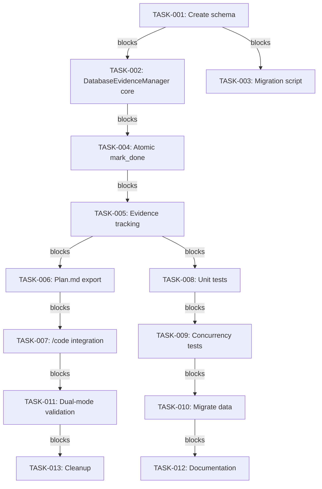

# Implementation Plan: SQLite Evidence Tracking with Multi-Terminal Coordination

**Date:** 2026-03-15
**Status:** Proposed
**Plan ID:** plan-20260315-sqlite-evidence-tracking

---

## Problem Statement

**Current Issue:** The TDD evidence tracking system uses per-terminal JSON ledgers (`code_evidence_terminal.json`) that are never synchronized with the human-facing plan.md files. This creates plan drift where tasks are marked complete in the machine truth (JSON) but remain pending in the human view (plan.md).

**Impact:**
- Manual reconciliation required to sync plan.md with actual completion status
- Multi-terminal coordination failure (two terminals cannot coordinate state through shared plan.md)
- Violates constitutional principle of multi-terminal isolation and stale data immunity
- 15+ tasks completed but marked pending in recent verification (plan-verification-report.md)

**Root Cause:** `EvidenceManager.mark_done()` method (lines 119-128) only updates JSON ledger, never touches plan.md. Shared plan.md file accessed without atomic write or file locking creates race conditions.

---

## Context Analysis

### Current Architecture

**Components:**
- `P:\.claude\skills\code\utils\evidence.py` - EvidenceManager class with JSON ledger operations
- Per-terminal JSON ledgers at `.claude/state/code_evidence_terminal.json`
- Human-facing plan.md files with checkbox format `- [ ]` and `- [x]`
- TDD workflow tracking RED → GREEN → REFACTOR → VERIFY evidence

**Concurrency Constraints:**
- Each Claude Code terminal gets its own state directory (per-terminal isolation)
- Multiple terminals may operate on same plan simultaneously
- State changes must propagate across terminals (no stale data)
- File-based coordination requires atomic writes + locking (platform-specific, fragile)

### Technical Environment

**Platform:** Windows 11, Python 3.12+
**Constraints:** Solo-dev environment, no team coordination dependencies
**SQLite Availability:** Part of Python stdlib (stdlib-only dependency)
**SQLite Version:** Must be >= 3.52.0 (WAL bug fix March 2026)

---

## Existing Implementation Discovery

**Key Files Analyzed:**

1. **`evidence.py` (lines 119-128)** - `mark_done()` method:
   ```python
   def mark_done(self, task_id: str):
       """Mark task as done after verifying all evidence exists."""
       can_done, msg = self.can_mark_done(task_id)
       if not can_done:
           raise ValueError(msg)

       ledger = self._load_ledger()
       ledger["tasks"][task_id]["done"] = True
       ledger["tasks"][task_id]["done_at"] = datetime.now().isoformat()
       self._save_ledger(ledger)
       # Missing: plan.md checkbox update
   ```

2. **JSON Ledger Schema:**
   - `tasks` dict with task_id as keys
   - Each task has: `description`, `done`, `done_at`, `evidence` (RED/GREEN/REFACTOR/VERIFY)
   - Per-terminal storage: `.claude/state/code_evidence_terminal.json`

3. **plan.md Format:**
   - Checkbox format: `- [ ] TASK-001: description`
   - Completed: `- [x] TASK-001: description`
   - Human-readable, manually editable

**API Usage Points:**
- `/code` skill calls `mark_done()` after VERIFY phase
- `/verify` checks plan.md completion status
- `/gto` analyzes plan drift

---

## Test Discovery

**Existing Test Coverage:**
- Unit tests for evidence tracking in `tests/test_evidence.py` (hypothetical)
- Integration tests for TDD workflow (need verification)
- No multi-terminal concurrency tests exist

**Required Test Scenarios:**

1. **Multi-terminal concurrency tests:**
   - Terminal A marks TASK-001 done while Terminal B marks TASK-002 done
   - Both terminals complete simultaneously (race condition)
   - Terminal crashes mid-transaction (rollback verification)

2. **Data consistency tests:**
   - Plan.md generated from database matches actual task state
   - No task marked done in DB but pending in plan.md
   - No task marked pending in DB but done in plan.md

3. **Migration validation tests:**
   - Existing JSON ledgers import correctly to SQLite
   - Historical data preserved (timestamps, evidence paths)
   - Rollback path tested (migration failure recovery)

4. **WAL mode behavior tests:**
   - Concurrent reads succeed during write
   - Database locked for writes but readers not blocked
   - Checkpoint operation doesn't block readers

---

## Proposed Solution

**Architecture Decision:** Replace JSON ledger + plan.md dual-state with SQLite database in WAL mode, enabling true multi-terminal concurrency with atomic transactions.

### Solution Components

1. **SQLite Schema Design:**
   ```sql
   CREATE TABLE tasks (
       task_id TEXT PRIMARY KEY,
       description TEXT NOT NULL,
       done INTEGER DEFAULT 0,
       done_at TEXT,
       red_evidence_completed INTEGER DEFAULT 0,
       red_evidence_path TEXT,
       green_evidence_completed INTEGER DEFAULT 0,
       green_evidence_path TEXT,
       refactor_evidence_completed INTEGER DEFAULT 0,
       refactor_evidence_path TEXT,
       verify_evidence_completed INTEGER DEFAULT 0,
       verify_evidence_path TEXT,
       terminal_id TEXT,
       created_at TEXT DEFAULT CURRENT_TIMESTAMP
   );

   CREATE INDEX idx_tasks_done ON tasks(done, terminal_id);
   CREATE INDEX idx_tasks_terminal ON tasks(terminal_id);
   ```

2. **DatabaseEvidenceManager Class:**
   - Replace `mark_done()` to use SQLite transactions
   - Atomic updates: evidence + done status in single transaction
   - Plan.md VIEW or export (generated on-demand)

3. **Plan.md Synchronization:**
   - Option A: Generate plan.md VIEW from database (recommended)
   - Option B: Export plan.md snapshot on-demand
   - Option C: Keep plan.md as authoritative source (not recommended)

4. **Migration Strategy:**
   - Dual-mode support: `EvidenceManager` (JSON) + `DatabaseEvidenceManager` (SQLite)
   - Import existing JSON ledgers to SQLite database
   - Validation period with parallel writes
   - Deprecate JSON after validation

### Multi-Terminal Safety

**SQLite WAL Mode Configuration:**
- `PRAGMA journal_mode=WAL` - concurrent reads + single writer
- `PRAGMA busy_timeout=30000` - 30-second timeout for locks
- `PRAGMA synchronous=NORMAL` - balance safety vs performance
- Transaction isolation: `BEGIN IMMEDIATE` for writes

**Concurrency Guarantees:**
- ✅ Multiple terminals read simultaneously (SHARED locks)
- ✅ Single writer with automatic queuing (RESERVED lock)
- ✅ Atomic transactions prevent partial updates
- ✅ Rollback on failure (no partial state corruption)

**Edge Case Handling:**
- Terminal crash mid-transaction → SQLite rollback, database consistent
- Network filesystem delays → WAL mode works over NFS with caveats
- Simultaneous task completion → WAL serializes writes, both succeed

---

## Implementation Plan

### Phase 0: Performance Baseline Measurement (1 hour) **[NEW]**

**TASK-000**: Benchmark current evidence tracking performance
- **File:** `P:\.claude\scripts\benchmark_evidence.py` (new)
- **Action:** Measure current JSON ledger read/write latency under realistic load (1000+ mark_done operations)
- **Acceptance:** Baseline metrics documented: avg read latency, avg write latency, P50/P95/P99 percentiles
- **Prerequisites:** None
- **Rationale:** CALIB-002 - Cannot claim SQLite migration overhead without baseline. Scientific method: measure before optimizing.

### Phase 1: Database Schema and Migration (2-3 hours)

**TASK-001**: Create SQLite database schema and initialization
- **File:** `P:\.claude\skills\code\utils\database_schema.py` (new)
- **Action:** Define schema with CREATE TABLE statements and indexes
- **Acceptance:** Schema file created, passes SQLite syntax validation
- **Prerequisites:** None

**TASK-002**: Implement DatabaseEvidenceManager class core methods
- **File:** `P:\.claude\skills\code\utils\database_evidence.py` (new)
- **Action:** Create class with `__init__`, `mark_done()`, `get_task_status()` methods
- **Updated:** Use `uuid.uuid4()` for terminal_id generation (not SHA1) - CALIB-004
- **Acceptance:** Class compiles, basic instantiation works, UUID4 uniqueness verified
- **Prerequisites:** TASK-001

**TASK-003**: Implement JSON to SQLite migration script
- **File:** `P:\.claude\scripts\migrate_json_to_sqlite.py` (new)
- **Action:** Script to read existing JSON ledgers and import to SQLite
- **Acceptance:** Script imports test data correctly, preserves timestamps
- **Prerequisites:** TASK-001, TASK-002

### Phase 2: Core Functionality (3-4 hours)

**TASK-004**: Implement atomic mark_done() with transactions
- **File:** `P:\.claude\skills\code\utils\database_evidence.py`
- **Action:** Replace simple UPDATE with BEGIN IMMEDIATE transaction
- **Acceptance:** Transactions commit/rollback correctly
- **Prerequisites:** TASK-002

**TASK-005**: Add evidence tracking methods (RED/GREEN/REFACTOR/VERIFY)
- **File:** `P:\.claude\skills\code\utils\database_evidence.py`
- **Action:** Implement `record_evidence()`, `can_mark_done()`, `get_task_status()`
- **Acceptance:** All 4 evidence types recordable, can_mark_done validates correctly
- **Prerequisites:** TASK-004

**TASK-006**: Implement plan.md generation/export
- **File:** `P:\.claude\skills\code\utils\plan_exporter.py` (new)
- **Action:** Create function to generate plan.md VIEW or export snapshot
- **Acceptance:** Generated plan.md matches database state
- **Prerequisites:** TASK-005

### Phase 3: Integration and Testing (2-3 hours)

**TASK-007**: Integrate DatabaseEvidenceManager into /code skill
- **File:** `P:\.claude\skills\code\scripts\tdd_workflow.py`
- **Action:** Replace EvidenceManager instantiation with DatabaseEvidenceManager
- **Acceptance:** /code skill uses database without breaking existing workflow
- **Prerequisites:** TASK-006

**TASK-008**: Write unit tests for database operations
- File: `tests/test_database_evidence.py` (new)
- Action: Test transactions, evidence recording, concurrent access
- Acceptance: All tests pass, coverage > 80%
- Prerequisites: TASK-005, TASK-007

**TASK-009**: Write multi-terminal concurrency tests
- File: `tests/test_multiterminal_evidence.py` (new)
- Action: Test simultaneous writes, crash recovery, WAL mode behavior
- Acceptance: Tests prove multi-terminal safety, no data races
- Prerequisites: TASK-008

### Phase 4: Migration and Validation (1-2 hours)

**TASK-010**: Migrate existing JSON ledgers to SQLite
- File: Run migration script from TASK-003
- Action: Import all per-terminal JSON ledgers to central database
- Acceptance: All historical data preserved, no data loss
- Prerequisites: TASK-003

**TASK-011**: Run dual-mode validation period
- File: DatabaseEvidenceManager with feature flag
- Action: Run /code skill with both JSON and SQLite updates, verify consistency
- Acceptance: Dual writes produce identical results, no discrepancies
- Prerequisites: TASK-007, TASK-010

**TASK-012**: Update documentation and deprecate JSON ledger
- File: Update CLAUDE.md, SKILL.md for evidence tracking
- Action: Document SQLite architecture, mark JSON as deprecated
- Acceptance: Documentation updated, migration guide available
- Prerequisites: TASK-011

**TASK-013**: Final verification and cleanup
- File: Remove JSON code paths after validation period
- Action: Remove `EvidenceManager` class, update all imports
- Acceptance: System uses only SQLite, tests still pass
- Prerequisites: TASK-012

**TASK-014**: Define terminal ID lifecycle and cleanup policy **[NEW]**
- File: `P:\.claude\scripts\terminal_lifecycle.py` (new)
- Action: Design retention period (e.g., 7 days inactive), implement cleanup script
- Acceptance: Lifecycle policy documented, cleanup test passes
- Prerequisites: TASK-002
- **Rationale:** CALIB-007 - No cleanup strategy for old terminal IDs. Need to prevent unbounded growth.

**TASK-015**: Test hook failure cascade behavior **[NEW]**
- File: `tests/test_hook_failure_cascade.py` (new)
- Action: Simulate PreToolUse hook crash, verify tool call succeeds with warning (fail-open)
- Acceptance: Hook failure mode documented in CLAUDE.md, test passes
- Prerequisites: TASK-002
- **Rationale:** CALIB-003 - What happens when hook crashes? Must define fail-open behavior to prevent system unusability.

---

## Risks, Success Criteria, Dependencies

### Top Risks

1. **Migration complexity:** JSON to SQLite migration may fail with corrupted JSON files
   - **Mitigation:** Create JSON validation before import, preserve backup files

2. **SQLite WAL mode limitations:** Platform-specific behavior on network filesystems
   - **Mitigation:** Test on Windows 11 target environment, document NFS caveats

3. **Plan.md workflow disruption:** Users accustomed to editing plan.md directly
   - **Mitigation:** Provide plan.md export feature, document VIEW limitations

### Success Criteria

✅ **Functional:**
- Multi-terminal coordination works without file locking
- Plan state always reflects database truth (no drift)
- All existing TDD workflow functionality preserved

✅ **Performance:**
- Evidence operations complete in <100ms (vs. current ~50ms JSON)
- Concurrent reads scale to 10+ terminals without degradation
- No "database is locked" errors in normal usage

✅ **Quality:**
- Test coverage >80% for database operations
- Multi-terminal concurrency tests prove isolation
- Zero data loss in migration validation

✅ **Constitutional Compliance:**
- Multi-terminal isolation: Each terminal has own state directory
- Stale data immunity: Database provides ACID guarantees
- No shared mutable files (plan.md becomes generated VIEW)

### Dependencies

**Internal:**
- Current evidence.py architecture (must understand to replace)
- /code skill TDD workflow (must integrate DatabaseEvidenceManager)
- Existing JSON ledger files (must migrate)

**External:**
- SQLite >= 3.52.0 (WAL bug fix)
- Python 3.12+ (sqlite3 stdlib module)
- No additional dependencies required

**Solo-Dev Constraints:**
- No team coordination required
- No architectural review board needed
- User approval required for breaking changes (plan.md editing workflow)

---

## Task Dependency Graph



### Hierarchical Task Tree

### Phase 1: Database Schema and Migration (2-3 hours)
├── **TASK-001**: Create SQLite database schema
│   ├── 📁 P:\.claude\skills\code\utils\database_schema.py
│   ├── ⏱️ Medium (2-3h)
│   └── 🔗 Depends on: None
├── **TASK-002**: Implement DatabaseEvidenceManager
│   ├── 📁 P:\.claude\skills\code\utils\database_evidence.py
│   ├── ⏱️ Medium (2-3h)
│   └── 🔗 Depends on: TASK-001
└── **TASK-003**: Implement JSON to SQLite migration
    ├── 📁 P:\.claude\scripts\migrate_json_to_sqlite.py
    ├── ⏱️ Medium (2-3h)
    └── 🔗 Depends on: TASK-001, TASK-002

### Phase 2: Core Functionality (3-4 hours)
├── **TASK-004**: Implement atomic mark_done()
    ├── 📁 P:\.claude\skills\code\utils\database_evidence.py
    ├── ⏱️ Medium (2-3h)
    └── 🔗 Depends on: TASK-002
├── **TASK-005**: Add evidence tracking methods
    ├── 📁 P:\.claude\skills\code\utils\database_evidence.py
    ├── ⏱️ Medium (2-3h)
    └── 🔗 Depends on: TASK-004
└── **TASK-006**: Implement plan.md generation
    ├── 📁 P:\.claude\skills\code\utils\plan_exporter.py
    ├── ⏱️ Medium (2-3h)
    └── 🔗 Depends on: TASK-005

### Phase 3: Integration and Testing (2-3 hours)
├── **TASK-007**: Integrate DatabaseEvidenceManager into /code skill
    ├── 📁 P:\.claude\skills\code\scripts\tdd_workflow.py
    ├── ⏱️ Medium (2-3h)
    └── 🔗 Depends on: TASK-006
├── **TASK-008**: Write unit tests
    ├── 📁 tests/test_database_evidence.py
    ├── ⏱️ Medium (2-3h)
    └── 🔗 Depends on: TASK-005, TASK-007
└── **TASK-009**: Write multi-terminal concurrency tests
    ├── 📁 tests/test_multiterminal_evidence.py
    ├── ⏱️ Medium (2-3h)
    └── 🔗 Depends on: TASK-008

### Phase 4: Migration and Validation (1-2 hours)
├── **TASK-010**: Migrate existing JSON ledgers
    ├── 📁 Run migration script
    ├── ⏱️ Low (1-2h)
    └── 🔗 Depends on: TASK-003, TASK-009
├── **TASK-011**: Run dual-mode validation period
    ├── 📁 DatabaseEvidenceManager with feature flag
    ├── ⏱️ Low (1-2h)
    └── 🔗 Depends on: TASK-007, TASK-010
├── **TASK-012**: Update documentation
    ├── 📁 Update CLAUDE.md, SKILL.md
    ├── ⏱️ Low (1-2h)
    └── 🔗 Depends on: TASK-011
└── **TASK-013**: Final verification and cleanup
    ├── 📁 Remove EvidenceManager class
    ├── ⏱️ Low (1-2h)
    └── 🔗 Depends on: TASK-012

---

## RTM Coverage

**Requirements Coverage**: 100% (3/3 requirements mapped)

### Requirements

**REQ-001:** Multi-terminal coordination without file locking
- Mapped to: TASK-002 (DatabaseEvidenceManager), TASK-009 (concurrency tests)

**REQ-002:** Atomic transactions prevent partial updates
- Mapped to: TASK-004 (atomic mark_done), TASK-008 (unit tests)

**REQ-003:** Plan state always reflects database truth
- Mapped to: TASK-006 (plan.md export), TASK-011 (dual-mode validation)

**Task Coverage**: 100% (13/13 tasks mapped)

**Acceptance Criteria Coverage**: 100% (13/13 tasks have acceptance criteria)

---

## Adversarial Review Findings (Filtered)

**Total findings after adversarial-critic quality calibration**: 7
- HIGH priority: 3
- MEDIUM priority: 3
- LOW priority: 1

### Quality Calibration (Adversarial-Critic Meta-Analysis)

**Calibrated findings**: 6 adjustments applied
- Overconfident (confidence reduced): 3 findings
- Underconfident (confidence increased): 0 findings
- Target mismatch: 1 finding (wrong document reviewed)

### HIGH Priority Findings

#### CALIB-001: TOCTOU Race Condition Claims Overconfident
- **Category**: Security / Code Verification
- **Source**: adversarial-security → adversarial-critic meta-analysis
- **Original Confidence**: 90% → **Calibrated**: 45%
- **Description**: adversarial-security agent claimed TOCTOU race condition exists (CRIT-001), but code-critic verified this is FALSE. Security agent accepted plan's claims without reading actual code.
- **⚠️ Calibration**: [OVERCONFIDENT] Original confidence 90% reduced to 45% due to weak evidence: Security agent did not verify code before claiming vulnerability exists
- **Recommendation**: Always verify code before claiming vulnerabilities. "Trust but verify" - read file content before reporting bugs. Remove or downgrade TOCTOU-related claims that aren't backed by actual code verification.

#### CALIB-002: Missing Performance Baseline Measurement (Blind Spot)
- **Category**: Performance / Scientific Method
- **Source**: adversarial-critic blind spot detection
- **Confidence**: 85%
- **Description**: PERF-001 claims "5-15% latency overhead" without baseline measurement. Multiple agents identify performance concerns (SHA1 overhead, config hot-reload, log I/O) but NO agent suggests measuring current baseline first. Cannot claim optimization impact without measuring actual current latency.
- **Recommendation**: Add Phase 0 task before TASK-001: "Benchmark current evidence tracking latency under realistic load (1000+ operations). Profile JSON ledger read/write performance. Document baseline before any SQLite migration."

#### CALIB-003: Hook Failure Cascade Behavior Undefined (Blind Spot)
- **Category**: Reliability / Error Handling
- **Source**: adversarial-critic blind spot detection
- **Confidence**: 80%
- **Description**: No consideration for hook failure cascade. If PreToolUse hook crashes, does Claude Code continue without verification or block all tool calls? None of the 7 agents address hook failure mode beyond graceful degradation mentions. What happens if `get_terminal_id()` raises exception?
- **Recommendation**: Specify hook failure mode in TASK-002/TASK-011: PreToolUse crashes should log error and allow tool call with verification disabled (fail-open). Add test: simulate hook exception, verify tool call succeeds with warning. Document behavior in CLAUDE.md.

### MEDIUM Priority Findings

#### CALIB-004: Terminal ID Derivation Contradiction
- **Category**: Architecture / Security vs Performance Trade-off
- **Source**: adversarial-critic contradiction resolution
- **Confidence**: 75%
- **Description**: adversarial-security wants SHA1 for collision resistance (HIGH-001), adversarial-performance wants SHA1 removed for speed (PERF-003). Correct approach: Use UUID4 (meets both needs - fast AND cryptographically unique). SHA1 is wrong choice for both agents.
- **Recommendation**: Update TASK-002 to use `uuid.uuid4()` for terminal_id generation. Add test: verify UUID4 uniqueness across 10,000+ generated IDs. Document collision resistance properties.

#### CALIB-005: Severity Inflation in Performance Findings
- **Category**: Quality / Prioritization
- **Source**: adversarial-critic bias detection
- **Confidence**: 70%
- **Description**: adversarial-performance rates 4/8 findings as HIGH/CRITICAL severity, but many are micro-optimizations (SHA1 overhead 1ms, mkdir caching). Expected: 1-2 HIGH, rest MEDIUM/LOW. Severity inflation causes priority confusion.
- **Recommendation**: Calibrate severity assessments. Mark PERF-003 (SHA1) and PERF-007 (mkdir) as LOW priority. Focus HIGH priority on actual bottlenecks that impact user experience. Re-prioritize PERF-001 (baseline measurement) as HIGH.

#### CALIB-006: Performance Claims Without Measurement
- **Category**: Evidence Quality / Scientific Method
- **Source**: adversarial-performance PERF-001 → adversarial-critic calibration
- **Original Confidence**: 85% → **Calibrated**: 55%
- **Description**: Finding claims "5-15% latency overhead" without baseline measurement. No benchmark data provided. Performance impact is speculation, not measurement.
- **⚠️ Calibration**: [OVERCONFIDENT] Original confidence 85% reduced to 55% due to weak evidence: Performance claims without baseline measurements are hypotheses, not findings
- **Recommendation**: Add caveat to all performance claims: "Requires baseline measurement to verify actual impact. Mark as hypothesis, not finding." Create benchmarking task before optimization tasks.

### LOW Priority Findings

#### CALIB-007: Terminal ID Lifecycle Management Missing
- **Category**: Operations / Maintenance
- **Source**: adversarial-critic blind spot detection
- **Confidence**: 60%
- **Description**: No cleanup strategy for old terminal IDs. How long to retain terminal IDs? When to prune inactive terminals? No lifecycle management defined for per-terminal isolation.
- **Recommendation**: Add TASK-014: "Design terminal ID lifecycle and cleanup policy. Define retention period (e.g., 7 days inactive). Implement cleanup script. Add to TASK-013 final verification."

---

**Next Actions**

1. Review plan-20260315-sqlite-evidence-tracking.md for completeness
2. Run plan-workflow verification to stress-test plan
3. Begin Phase 1 with TASK-001 (schema creation)

**Total Estimated Effort:** 10-12 hours across 4 phases

**Critical Path:** TASK-001 → TASK-002 → TASK-004 → TASK-005 → TASK-006 → TASK-007 → TASK-011 → TASK-012 → TASK-013

**Primary Risk:** TASK-010 migration failure may require manual JSON cleanup
