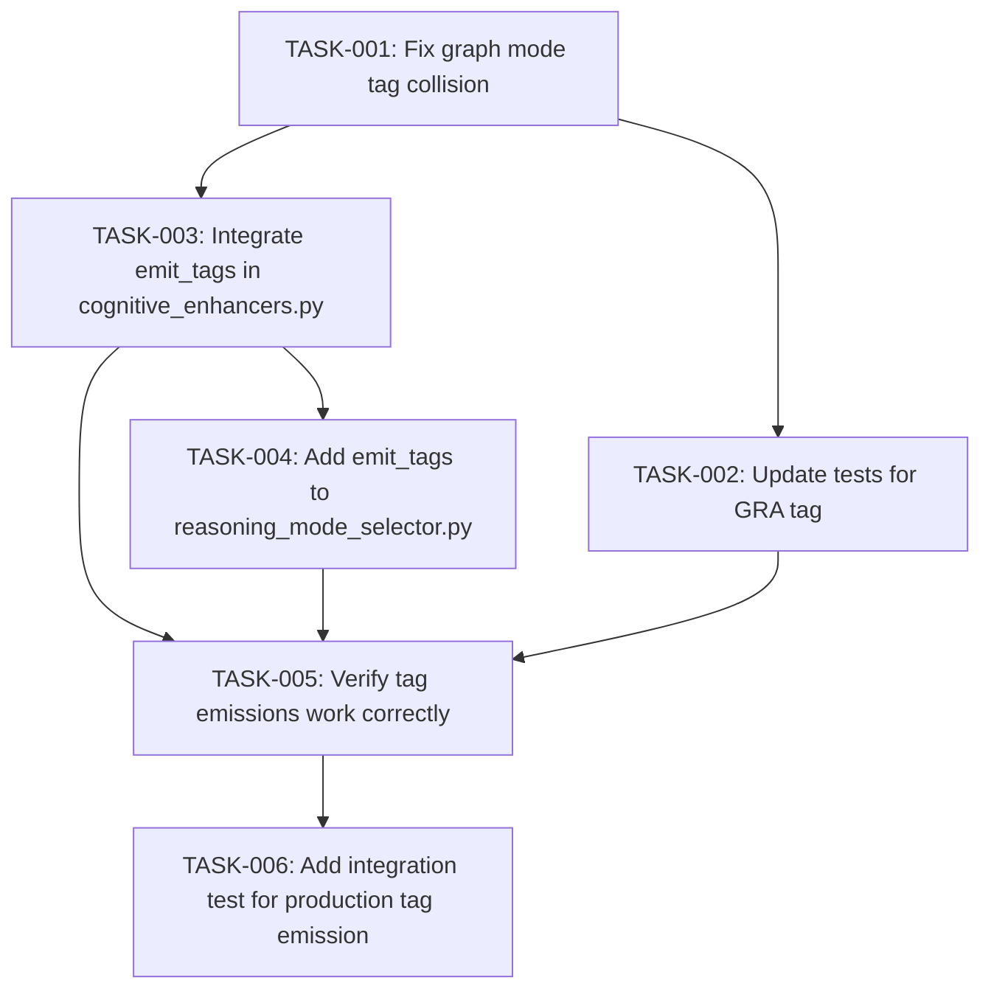

# Tag Emission System Optimization

## Problem Statement

The tag emission system has three related issues:

1. **[COG] Tag Collision**: The tag `[COG]` is used for two different purposes:
   - Graph reasoning mode (in `reasoning_mode_selector.py`)
   - Active cognitive frameworks (in `cognitive_enhancers.py`)

2. **Dead Code**: The `tag_emission.py` module (395 lines) defines a comprehensive unified tag emission system with `emit_detection_tags()` function, but this function is **never called in production code**.

3. **Redundant Implementation**: Tag emissions happen in two separate places with no shared infrastructure:
   - `reasoning_mode_selector.py` emits `[SEQ]`, `[MAS]`, `[COG]`, `[2ST]`
   - `cognitive_enhancers.py` emits `[COG]` + framework names
   - No unified format enforcement

## Context Analysis

### Current State

**Location 1: `P:\packages\reasoning\hooks\Start_reasoning_mode_selector.py`**
```python
mode_tags = {
    "sequential": "[SEQ]",
    "multi_agent": "[MAS]",
    "graph": "[COG]",      # COLLISION: Same tag as cognitive frameworks
    "two_stage": "[2ST]"
}
# Line 159-161: Injects tag into context
```

**Location 2: `P:\.claude\hooks\UserPromptSubmit_modules\cognitive_enhancers.py`**
```python
# Line 445-447
tag_instruction = (
    "**TAG EMISSION REQUIRED**: Begin your response with '[COG]' tag "
    "followed by the active framework names above..."
)
```

**Location 3: `P:\.claude\hooks\UserPromptSubmit_modules\tag_emission.py`**
- Defines 9 tag types: COG, SEQ, MAS, GRA, 2ST, THINK, SYNERGY, PERF, QUESTIONING
- Implements `emit_detection_tags()` function (never called)
- Implements `emit_tags()` utility function (never called)
- Comprehensive, tested, but **completely unused in production**

### Impact Analysis

**Who is affected?**
- Any system consuming `[COG]` tags and expecting "graph mode" OR "cognitive frameworks"
- Developers maintaining tag emission code (currently duplicated)

**What breaks if we don't fix?**
- Tag consumers cannot distinguish between "graph reasoning mode" and "cognitive frameworks"
- Future enhancements to tag system will continue to face this collision

**What breaks if we fix incorrectly?**
- If we change `[COG]` to `[GRA]` for graph mode without updating consumers
- If we remove tag_emission.py code that unknown consumers depend on

## Existing Implementation Discovery

### Tag Emission Locations

**Active Production Code:**
1. `reasoning_mode_selector.py` - Emits mode tags directly
2. `cognitive_enhancers.py` - Emits cognitive framework tags directly

**Dead/Unused Code:**
1. `tag_emission.py` - Unified standard (395 lines, never imported in production)
2. `test_tag_emission.py` - Only consumer of tag_emission.py functions

### Search Results

Grep search revealed:
- **3 files reference `tag_emission`**: tag_emission.py (itself), migration docs, test file
- **NO production imports**: No hooks import from `tag_emission`
- **NO usage of `emit_detection_tags()`**: Function exists but is never called

## Test Discovery

### Existing Test Coverage

**File:** `P:\.claude\hooks\UserPromptSubmit_modules\tests\test_tag_emission.py`

**Tests cover:**
- `emit_tag()` - Single tag emission
- `emit_tags()` - Multiple tag emission
- Tag parsing (legacy format)
- Tag validation

**Test gap:** No integration tests verify that `emit_detection_tags()` is actually called in production workflows.

## Proposed Solution

### Architecture: Single Source of Truth for Tag Emission

**Core principle:** All tag emissions flow through `tag_emission.py` utilities, with production hooks calling standardized functions instead of generating tags ad-hoc.

**Component structure:**
```
tag_emission.py (reused, now integrated)
  ├─ Tag dataclass (frozen, type-safe)
  ├─ TagCollection dataclass
  ├─ emit_tag() - Single tag
  ├─ emit_tags() - Multiple tags
  └─ emit_detection_tags() - Unified detection integration

Production hooks (refactored)
  ├─ reasoning_mode_selector.py → calls emit_tags()
  └─ cognitive_enhancers.py → calls emit_tags()
```

### Fix Strategy: Three-Phase Implementation

**Phase 1: Fix [COG] Collision** (5 minutes)
- Change `mode_tags["graph"]` from `"[COG]"` to `"[GRA]"` in reasoning_mode_selector.py
- Update any tests expecting `[COG]` for graph mode

**Phase 2: Integrate Unified Tag Emission** (20 minutes)
- Import `emit_tags` in cognitive_enhancers.py
- Replace ad-hoc tag_instruction string with `emit_tags()` call
- Import `emit_tags` in reasoning_mode_selector.py (future enhancement)

**Phase 3: Verification** (15 minutes)
- Run existing tests
- Add integration test for emit_tags() in production context
- Verify tag consumers handle new format

## Implementation Plan

### Phase 1: Fix [COG] Collision (CRITICAL)

**TASK-001**: Fix graph mode tag collision
- **File**: `P:\packages\reasoning\hooks\Start_reasoning_mode_selector.py`
- **Action**: Change line 150 from `"graph": "[COG]"` to `"graph": "[GRA]"`
- **Acceptance**: Graph mode now uses distinct `[GRA]` tag
- **Points**: 1 (trivial)
- **Prerequisites**: None

**TASK-002**: Update tests for [GRA] tag
- **File**: Any test expecting `[COG]` for graph mode
- **Action**: Search for tests expecting `[COG]` graph mode tag, update to `[GRA]`
- **Acceptance**: Tests pass with new tag format
- **Points**: 2 (simple)
- **Prerequisites**: TASK-001

### Phase 2: Integrate Unified Tag Emission (OPTIONAL but RECOMMENDED)

**TASK-003**: Integrate emit_tags() in cognitive_enhancers.py
- **File**: `P:\.claude\hooks\UserPromptSubmit_modules\cognitive_enhancers.py`
- **Action**:
  1. Add import: `from tag_emission import emit_tags, TAG_COG, TAG_THINK`
  2. Replace lines 445-447 with `emit_tags()` call
  3. Format: `emit_tags([(TAG_COG, ", ".join(active_frameworks))])`
- **Acceptance**: Cognitive framework tags use unified emission
- **Points**: 3 (moderate)
- **Prerequisites**: TASK-001

**TASK-004**: Add emit_tags() to reasoning_mode_selector.py (future)
- **File**: `P:\packages\reasoning\hooks\Start_reasoning_mode_selector.py`
- **Action**:
  1. Add import: `from P:\.claude\hooks\UserPromptSubmit_modules.tag_emission import emit_tags, TAG_SEQ, TAG_MAS, TAG_GRA, TAG_2ST`
  2. Replace mode_tags dict with tag_type constants
  3. Update emission to use `emit_tags()`
- **Acceptance**: Mode tags use unified emission
- **Points**: 5 (complex)
- **Prerequisites**: TASK-001, TASK-003

### Phase 3: Verification (MANDATORY)

**TASK-005**: Verify tag emissions work correctly
- **File**: `P:\.claude\hooks\UserPromptSubmit_modules\tests\test_tag_emission.py`
- **Action**: Run pytest, verify all tests pass
- **Acceptance**: Test suite passes
- **Points**: 2 (simple)
- **Prerequisites**: TASK-001, TASK-003

**TASK-006**: Add integration test for production tag emission
- **File**: New file `P:\.claude\hooks\UserPromptSubmit_modules\tests\test_tag_emission_integration.py`
- **Action**: Create test verifying cognitive_enhancers.py and reasoning_mode_selector.py emit correct tags
- **Acceptance**: Integration test covers production tag emission
- **Points**: 5 (complex)
- **Prerequisites**: TASK-003, TASK-004

## Task Dependency Graph



**Critical path:** T-001 → T-003 → T-005 → T-006 (10 points)

**Alternative path (skip integration):** T-001 → T-002 → T-005 (5 points)

## Risks, Success Criteria, Dependencies

### Top Risks

1. **Unknown tag consumers**: May have systems consuming `[COG]` expecting one meaning
   - **Mitigation**: Search codebase for `[COG]` consumers before implementing
   - **Rollback**: Revert single line change if breakage detected

2. **Integration complexity**: TASK-003 and TASK-004 require careful import path handling
   - **Mitigation**: Test in isolation before full integration
   - **Rollback**: Keep ad-hoc emission as fallback if `emit_tags()` fails

3. **Test coverage gaps**: Current tests only verify tag_emission.py in isolation
   - **Mitigation**: TASK-006 adds integration test coverage
   - **Rollback**: Expand test scope if integration test finds issues

### Success Criteria

- [ ] `[COG]` collision resolved (graph mode uses `[GRA]`)
- [ ] `emit_detection_tags()` integrated into production OR explicitly deprecated
- [ ] All existing tests pass
- [ ] Integration test covers production tag emission
- [ ] Tag format consistent across all emissions

### Dependencies

**External:**
- None (stdlib-only, solo-dev compliant)

**Internal:**
- Existing `tag_emission.py` module (395 lines, high-quality, just needs integration)
- Existing test suite in `tests/test_tag_emission.py`

**Blocked by:**
- None

### Rollback Strategy

**If TASK-003/TASK-004 integration fails:**
1. Keep ad-hoc tag emissions as-is
2. Defer `emit_tags()` integration to future work
3. TAG-001 fix (change to `[GRA]`) is low-risk and can stand alone

**If tag consumers break:**
1. Revert `mode_tags["graph"]` to `"[COG]"`
2. Investigate and update broken consumers
3. Re-apply fix after consumers updated

## GoT Analysis: Strategic Alternatives

### Nodes Extracted

**Constraints:**
- Must use stdlib-only (solo-dev)
- Must not break existing tag consumers
- Must maintain backward compatibility where possible

**Ideas:**
- Option A: Integrate + Fix Collision (RECOMMENDED)
- Option B: Remove Dead Code + Minimal Fix
- Option C: Hybrid - Gradually Migrate

**Risks:**
- Unknown `[COG]` tag consumers may break
- Integration complexity may introduce bugs
- Migration effort may exceed value

**Components:**
- tag_emission.py (395 lines, unused but high-quality)
- reasoning_mode_selector.py (2 lines to change)
- cognitive_enhancers.py (~10 lines to modify)
- test_tag_emission.py (needs integration tests)

### Edge Relationships

**Supports:**
- tag_emission.py supports emit_tags() integration (provides infrastructure)
- stdlib-only constraint supports Option A (no external dependencies)

**Contradicts:**
- "Implement useful features" contradicts "Remove redundant code" (tag_emission.py is both)
- Minimal change (Option B) contradicts quality improvement goals

**Depends:**
- Integration tests (TASK-006) depend on TASK-003/TASK-004 completion

### Cycle Detection

**No cycles detected.** Safe to implement in any order (dependency graph is acyclic).

### GoT Recommendation

**Option A (Integrate + Fix Collision)** is recommended based on:
- **Value optimization**: Makes useful dead code live, removes redundancy
- **Consolidation**: Single source of truth for tag emission
- **Solo-dev alignment**: Stdlib-only, no external dependencies

## Next Actions

1. **Search for [COG] tag consumers** (5 min)
   ```bash
   cd P:\.claude
   rg '\[COG\]' --type py -C 3 > cog_consumers.txt
   ```

2. **Review architecture decision** (5 min)
   - Read: `P:\.claude\arch_decisions\2026-03-15_thinking_quality_improvements.md`

3. **Execute TASK-001** (2 min)
   - Edit `P:\packages\reasoning\hooks\Start_reasoning_mode_selector.py` line 150

4. **Verify consumer impact** (10 min)
   - Review `cog_consumers.txt` for consumers expecting `[COG]` = graph mode

5. **Proceed with implementation** based on findings
   - If safe: Execute full plan (TASK-002 through TASK-006)
   - If risky: Skip to Option B (minimal fix only)

---

**Summary:** Fix [COG] tag collision by renaming graph mode tag to [GRA], then integrate unified tag emission system from unused tag_emission.py module. Low-risk, high-value, stdlib-only, solo-dev compliant.
