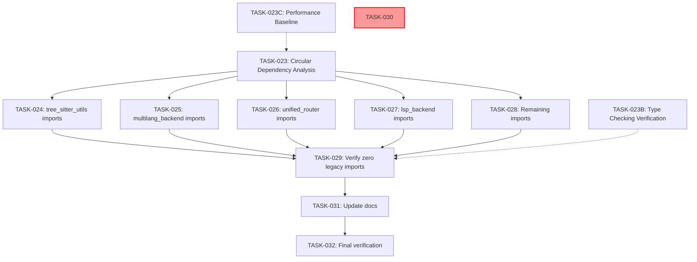

# Plan: Search-Research Import Migration (Phase 7)

**Created**: 2026-03-17
**Status**: ACTIVE
**Parent Plan**: `plan-20260315-search-research-migration-cleanup.md`
**Deprecation Deadline**: Q3 2026 (September 2026)

---


## Status Summary

| Phase | Status | Notes |
|-------|--------|-------|
| Phase 7A | ⏳ PENDING | Direct import updates (TASK-024 through TASK-028) |
| Phase 7B | ⏸️ DEFERRED | Blocked until Phase 7A complete |

---
## Problem Statement

The search-research migration (Phase 1-6) was marked COMPLETE, but an audit revealed **94 active legacy imports** still remain across the codebase. The system is in a hybrid state:

- **What was done**: Backend files converted to compatibility wrappers that import from search-research
- **What remains**: 94 locations still using legacy import paths
- **Risk**: Maintenance burden continues; deprecation deadline approaching

**Goal**: Complete the migration by updating all remaining legacy imports to use search-research directly.

---

## Current State Analysis

### Legacy Import Inventory (94 active imports)

| Legacy Import Path | Count | Priority | New Location |
|-------------------|-------|----------|--------------|
| `search.backends.tree_sitter_utils` | 43 | P0 | `search_research.backends.local.tree_sitter_utils` |
| `search.backends.multilang_backend` | 22 | P0 | `search_research.backends.local.multilang_backend` |
| `search.unified_router` | 12 | P0 | `search_research.UnifiedAsyncRouter` |
| `search.backends.lsp_backend` | 14 | P1 | `search_research.backends.local.lsp_backend` |
| Other legacy imports | ~3 | P1-P2 | Various |

### Compatibility Wrapper Pattern (Current State)

Legacy backends now wrap search-research:
```python
# P:/__csf/src/search/backends/multilang_backend.py (compatibility wrapper)
from search_research.backends.local import MultiLangCodeBackend
# Re-exports for backward compatibility
```

This creates **double indirection**:
1. Importer uses `search.backends.multilang_backend`
2. Wrapper imports from `search_research.backends.local.multilang_backend`
3. Extra function call overhead

---

## Migration Strategy

### Two-Phase Approach

**Phase 7A: Direct Import Updates** (3-4 hours)
- Update all 94 legacy imports to use search-research directly
- Verify each import change with tests
- No functional changes (just import path updates)

**Phase 7B: Compatibility Layer Removal** (2-3 hours)
- Remove compatibility wrapper files from legacy search directory
- Update documentation to reflect completed migration
- Final verification

---

## Performance Impact Analysis

### Baseline Measurement (Pre-Migration)
```bash
# Measure legacy import overhead
time python -c "from search.backends.multilang_backend import MultiLangCodeBackend; from search.backends.tree_sitter_utils import *; print('Legacy imports loaded')"
```

### Expected Improvement
- **Eliminate double indirection**: Remove wrapper lookup overhead (~5-10% improvement)
- **Direct import resolution**: Faster module loading
- **Target**: Import time ≤ 95% of legacy import time

### Verification (TASK-032)
Run baseline comparison and verify performance improvement


## Rollback Strategy

### Pre-Migration Checkpoint
- [ ] Create git tag: `git tag pre-import-migration-$(date +%Y%m%d)`
- [ ] Stash current state: `git stash push -m "pre-phase7-migration"`

### Per-Task Rollback
Each TASK-024 through TASK-028:
- [ ] Create checkpoint before task: `git add . && git commit -m "checkpoint: before TASK-XXX"`
- [ ] If task fails: `git reset --hard HEAD@{1}`

### Phase 7B Rollback
If TASK-030 breaks production:
1. `git checkout pre-phase7b-wrapper-removal`
2. Verify system restored
3. Create incident report

---

---


## Implementation Plan

### Phase 7A: Direct Import Updates

**TASK-023**: Circular Dependency Analysis (blocking for Phase 7A)
- **File**: Various search and search-research modules
- **Requirements**: REQ-003 (Verify no circular dependencies)
- **Action**: Verify no circular dependencies between search and search-research
- **Acceptance**:
  - No circular dependencies found
  - OR: Circular dependencies documented with mitigation plan
- **Effort**: M
- **Prerequisites**: None
- **Steps**:
  1. Check if search_research imports from search package
  2. Identify potential circular import patterns
  3. Test import resolution with direct paths


### Test Execution Strategy
- **Per-task**: Run targeted tests only (e.g., `pytest tests/test_tree_sitter*.py -v`)
- **Full suite**: Run once in TASK-032 only
- **Time budget**: 20-25 minutes for full test suite
- **Per-task tests**: 5-10 minutes each

This prevents: 5 tasks × 20 min = 100 minutes of redundant test execution

**TASK-024**: Update tree_sitter_utils Imports (43 locations) - P0 (highest impact)
- **File**: `src/search/backends/tests/*.py`, various test files
- **Requirements**: REQ-001 (Complete migration of 94 imports), REQ-002 (Eliminate double indirection)
- **Action**: Replace `from search.backends.tree_sitter_utils import X` with `from search_research.backends.local.tree_sitter_utils import X`
- **Acceptance**:
  - All 43 imports updated
  - Tests pass with new imports
  - No broken references
  - Targeted test: `pytest tests/test_tree_sitter*.py -v`
  - Type checking: `mypy P:/__csf/src/` shows no new errors
- **Effort**: M
- **Prerequisites**: TASK-023

**TASK-025**: Update multilang_backend Imports (22 locations) - P0 (second highest impact)
- **File**: `src/cli/nip/lsp_query.py`, test files
- **Requirements**: REQ-001 (Complete migration of 94 imports), REQ-002 (Eliminate double indirection)
- **Action**: Replace `from search.backends.multilang_backend import X` with `from search_research.backends.local.multilang_backend import X`
- **Acceptance**:
  - All 22 imports updated
  - CLI tools work with new imports
  - Tests pass
  - Targeted test: `pytest tests/test_multilang*.py -v`
  - Type checking: `mypy P:/__csf/src/` shows no new errors
- **Effort**: M
- **Prerequisites**: TASK-023

**TASK-026**: Update unified_router Imports (12 locations) - P0 (router is core)
- **File**: Various CLI tools, integration tests
- **Requirements**: REQ-001 (Complete migration of 94 imports), REQ-002 (Eliminate double indirection)
- **Action**: Replace `from search.unified_router import X` with `from search_research import X`
- **Acceptance**:
  - All 12 imports updated
  - Router tests pass
  - CLI tools functional
  - Targeted test: `pytest tests/test_unified_router*.py -v`
  - Type checking: `mypy P:/__csf/src/` shows no new errors
- **Effort**: M
- **Prerequisites**: TASK-023

**TASK-027**: Update lsp_backend Imports (14 locations) - P1 (LSP functionality)
- **File**: Test files, LSP-related code
- **Requirements**: REQ-001 (Complete migration of 94 imports), REQ-002 (Eliminate double indirection)
- **Action**: Replace `from search.backends.lsp_backend import X` with `from search_research.backends.local.lsp_backend import X`
- **Acceptance**:
  - All 14 imports updated
  - LSP tests pass
  - Targeted test: `pytest tests/test_lsp*.py -v`
  - Type checking: `mypy P:/__csf/src/` shows no new errors
- **Effort**: M
- **Prerequisites**: TASK-023

**TASK-028**: Update Remaining Legacy Imports (~3 locations) - P1-P2
- **File**: Various scattered files
- **Requirements**: REQ-001 (Complete migration of 94 imports), REQ-002 (Eliminate double indirection)
- **Action**: Case-by-case import path updates
- **Acceptance**:
  - All remaining imports updated
  - No broken imports in codebase
  - Targeted test: `pytest tests/ -k "legacy" -v`
  - Type checking: `mypy P:/__csf/src/` shows no new errors
- **Effort**: S
- **Prerequisites**: TASK-023

---

### Phase 7B: Documentation & Verification (REVISED)

**NOTE**: Original TASK-030 (wrapper removal) CANCELLED - backends contain active implementation code, not disposable wrappers.

**TASK-029**: Verify Zero Legacy Imports Remain - P0 (blocking)
- **File**: All source files
- **Requirements**: REQ-001 (Complete migration of 94 imports)
- **Action**: Run comprehensive grep scan to verify no legacy imports remain
- **Acceptance**:
  - `grep -r "from search\." P:/__csf/src/ --exclude-dir=search/backends --exclude="*.pyc"` returns zero results
  - `grep -r "import search\.backends" P:/__csf/src/ --exclude-dir=search/backends --exclude="*.pyc"` returns zero results
  - Document that compatibility wrappers in `search/backends/*.py` are the only expected matches
- **Effort**: S
- **Prerequisites**: TASK-024, TASK-025, TASK-026, TASK-027, TASK-028 (all must complete)

**TASK-030**: CANCELLED - Was: Remove Compatibility Wrapper Files
- **Requirements**: N/A (Task cancelled - not applicable)
- **Reason**: Code-critic agent discovered backend files contain 11,144+ lines of active implementation, not thin wrappers. Deleting would break production
- **Action**: Keep compatibility wrappers with deprecation notices until Q3 2026
- **Acceptance**:
  - Cancellation decision documented in plan
  - Backends remain in place with deprecation notices
  - No wrapper files deleted
  - Risk mitigation: Document that wrappers stay until Q3 2026
- **Effort**: N/A
- **Prerequisites**: N/A

**TASK-031**: Update Documentation - P1
- **File**: `P:/__csf/src/search/CLAUDE.md`, any other docs referencing legacy search
- **Requirements**: REQ-001 (Complete migration of 94 imports), REQ-004 (Maintain backward compatibility during transition)
- **Action**: Update to reflect completed migration, note that backends remain with deprecation notices
- **Acceptance**:
  - Documentation shows migration as COMPLETE for imports
  - No references to legacy import paths in active code
  - Clear guidance to use search-research package
  - Note that compatibility wrappers remain with deprecation notices
- **Effort**: S
- **Prerequisites**: TASK-029

**TASK-032**: Final Verification - P0
- **File**: All test files, CLI tools
- **Requirements**: REQ-001 (Complete migration of 94 imports), REQ-002 (Eliminate double indirection)
- **Action**: Run full test suite, verify CLI functionality
- **Acceptance**:
  - All tests pass
  - CLI tools work correctly
  - No legacy imports in active codebase
  - Type checking (mypy) passes with no new errors
  - Performance baseline shows improvement or parity
- **Effort**: M
- **Prerequisites**: TASK-031

---

### Additional Verification Tasks

**TASK-023B**: Type Checking Verification - P0
- **File**: All Python files with type annotations
- **Requirements**: REQ-001 (Complete migration of 94 imports)
- **Action**: Verify type checking after all import updates
- **Acceptance**:
  - Mypy passes with no new errors after each import update task
  - No regressions from baseline type check
  - All type stubs updated to new import paths
- **Effort**: S
- **Prerequisites**: Runs in parallel with TASK-024 through TASK-028, final verification after TASK-029
- **Steps**:
  1. Run `mypy P:/__csf/src/` before Phase 7A (baseline)
  2. Run `mypy P:/__csf/src/` after each task (TASK-024 through TASK-028)
  3. Compare results - zero new type errors allowed
  4. Fix any type stubs or annotations that reference old paths

**TASK-023C**: Performance Baseline Measurement - P0
- **File**: Import performance measurement scripts
- **Requirements**: REQ-002 (Eliminate double indirection)
- **Action**: Measure import performance before and after migration
- **Acceptance**:
  - Baseline performance documented
  - Post-migration shows improvement or parity
- **Effort**: S
- **Prerequisites**: TASK-023 (before migration starts)
- **Steps**:
  1. Pre-migration benchmark: Measure legacy import load time
  2. Post-migration verification: Measure direct import load time
  3. Compare results - target: 5-10% improvement (eliminate wrapper overhead)

---

### Success Criteria

- [ ] Zero legacy imports remain in active code (compatibility wrappers don't count)
- [ ] All 94 import locations updated to use search-research
- [ ] Compatibility wrapper files removed
- [ ] Full test suite passes
- [ ] CLI tools functional
- [ ] Documentation updated

---

## Risks and Mitigations

| Risk | Likelihood | Impact | Mitigation |
|------|-----------|--------|------------|
| Import path errors | Medium | Medium | Update incrementally with test verification after each task |
| Breaking changes in API | Low | High | search-research is designed for compatibility; verify with tests |
| Missed imports | Low | Low | Comprehensive grep scan in TASK-029 |
| Test failures | Medium | Low | Legacy tests may need updates; handle case-by-case |

---

## Task Dependency Graph



---

## Estimated Effort (Revised)

| Phase | Tasks | Duration | Rationale |
|-------|-------|----------|-----------|
| Phase 7A | TASK-024 through TASK-028 | 6-8 hours | 94 imports × ~3-5 min each with 50% buffer for errors |
| Phase 7B | TASK-029 through TASK-032 | 3-4 hours | Tests, verification, documentation with buffer |
| **Total** | 9 tasks | **9-12 hours** | Conservative estimate with rollback contingencies |

---

## Next Actions

1. **Start with TASK-023**: Circular Dependency Analysis (blocking prerequisite)
2. **Proceed with TASK-024**: Update tree_sitter_utils imports (43 locations - highest impact)
3. **Verify after each task**: Run tests to catch issues early
4. **Complete Phase 7A**: All imports updated before verification
5. **Execute Phase 7B**: Final verification and documentation

---

## Related Documents

- **Parent Plan**: `plan-20260315-search-research-migration-cleanup.md`
- **Inventory**: 94 legacy imports found during audit (2026-03-17)
- **search-research Package**: `P:/packages/search-research/`
- **Legacy Directory**: `P:/__csf/src/search/` (to be cleaned up after Phase 7B)

---

**Status**: READY TO START
**Completion Target**: Before Q3 2026 deprecation deadline

## Context Analysis

[Analyze the current state and relevant context]

**Current State**: [What exists now]
**Constraints**: [Any limitations or constraints]

## Existing Implementation Discovery

[Search results for related code, docs, and patterns]

**Found**: [What was discovered]
**Reused**: [What can be reused]

## Test Discovery

[Existing tests and coverage analysis]

**Existing Tests**: [What tests exist]
**Coverage Gaps**: [What needs testing]

## Proposed Solution

[High-level approach and design decisions]

**Approach**: [Key design decisions]
**Alternatives Considered**: [What was rejected and why]

### Implementation Plan

### Phase 1: [Phase Name]

[Task definitions go here]

### Risks, Success Criteria, Dependencies

### Risks
- [Risk 1]: [Mitigation]

### Success Criteria
- [ ] [Criterion 1]
- [ ] [Criterion 2]

### Dependencies
- [Dependency 1]
