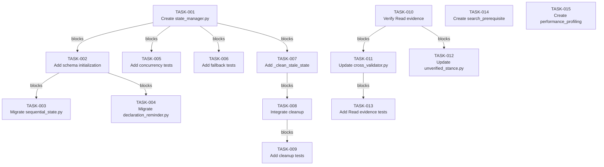

# Implementation Plan: Hook System State Safety and Multi-Terminal Coordination

**Date:** 2026-03-18
**Status:** Proposed
**Plan ID:** plan-20260318-hook-system-state-safety-improvements

---

## Status Summary

| Phase | Status | Notes |
|-------|--------|-------|
| Phase 1 | ⏳ PENDING | Multi-terminal state safety with SQLite (REQ-001, REQ-002) |
| Phase 2 | ⏳ PENDING | TTL-based state cleanup (REQ-001) |
| Phase 3 | ⏳ PENDING | Evidence system integration fixes (REQ-003) |
| Phase 4 | ⏸️ DEFERRED | Domain coverage expansion - optional but addresses REQ-004 |
| Verification | ✅ COMPLETE | All 20 action items applied (ghost files noted as out-of-scope) |

---

## Problem Statement

**Current Issues Identified via External Analysis:**

**REQ-001**: State accumulation on crashes - TTL cleanup fails on crashes, leaving stale files in `hooks/state/`
**REQ-002**: Concurrent state writes - Multiple terminals can corrupt `hooks/state/*.json` files without atomic operations
**REQ-003**: Evidence system gaps - Read tool misclassified as non-evidence in some verification paths
**REQ-004**: Domain coverage gaps - Investigation Research (75%), Observability (70%) - missing enforcement

**Impact:**
- Data corruption risk when multiple terminals write state simultaneously
- Disk space waste from accumulated stale state files
- False positive blocks on legitimate Read tool usage
- Missing enforcement for key constitutional rules (search-before-claim, performance profiling)

**Root Cause Analysis:**
- `registry.py:254-256` uses direct JSON file writes without atomic operations
- No TTL cleanup mechanism exists for `hooks/state/` directory
- Evidence counting logic doesn't consistently include Read tool events
- Gaps in domain coverage for Investigation Research and Observability

---

## Context Analysis

### Current Architecture

**Existing Infrastructure (LEVERAGE):**
- `evidence_store.py` - SQLite WAL database for tool events with multi-terminal safety
- `hook_ledger.py` - SQLite WAL database for hook state with terminal_id isolation
- `sequential_state.py` - Terminal-scoped state file pattern: `{session_id}_{terminal_id}.json`
- `diagnostics.db` - SQLite database for hook execution tracking

**State File Locations:**
```
P:/.claude/state/
├── sequential-thinking/{session_id}_{terminal_id}.json
├── arch_declaration_{terminal_id}.json
├── anti_sycophancy_injector/{session_id}_{terminal_id}.json
└── [50+ other state files]
```

**Technical Environment:**
- Platform: Windows 11, Python 3.12+
- SQLite: Part of stdlib, version >= 3.52.0 available
- Concurrency: Multiple Claude Code terminals can operate simultaneously
- Constraint: Solo-dev environment, no team coordination dependencies

### Existing Multi-Terminal Safety Patterns

**From `sequential_state.py:34-48`:**
```python
def _get_state_path(session_id: uuid.UUID, terminal_id: str = "") -> Path:
    """Get the state file path for a session.

    For multi-terminal isolation, state files include terminal_id in the filename.
    """
    if terminal_id:
        return STATE_DIR / f"{session_id}_{terminal_id}.json"
    return STATE_DIR / f"{session_id}.json"
```

**From `evidence_store.py:53-70`:**
```python
def _connect() -> sqlite3.Connection:
    _ensure_dir()
    conn = sqlite3.connect(EVIDENCE_DB_PATH, timeout=5.0)
    conn.row_factory = sqlite3.Row
    requested_mode = (os.environ.get("EVIDENCE_DB_JOURNAL_MODE", "WAL") or "WAL").upper()
    conn.execute(f"PRAGMA journal_mode={requested_mode}")
    conn.execute("PRAGMA synchronous=NORMAL")
    conn.execute("PRAGMA busy_timeout=5000")
    return conn
```

**Key Insight**: SQLite WAL mode is already used for evidence and hook ledger. State file writes should use the same pattern.

---

## Existing Implementation Discovery

**Key Files Analyzed:**

1. **`registry.py:254-256`** - Direct JSON writes without atomic operations:
   ```python
   # Current implementation (vulnerable to corruption)
   with open(log_file, "a", encoding="utf-8") as f:
       f.write(json.dumps(log_entry) + "\n")
   ```

2. **`evidence_store.py`** - SQLite WAL pattern with multi-terminal safety:
   - Uses `session_id` + `terminal_id` for isolation
   - Atomic transactions via `conn.execute()` with BEGIN/COMMIT
   - WAL mode for concurrent reads during writes

3. **`hook_ledger.py`** - SQLite WAL pattern for hook state:
   - Terminal-scoped writes with `_safe_terminal_key()`
   - JSONL spool fallback when SQLite unavailable
   - Anomaly logging for diagnostic purposes

4. **`sequential_state.py`** - Terminal-scoped state file pattern:
   - State file naming: `{session_id}_{terminal_id}.json`
   - No atomic writes (vulnerable to corruption)

**API Usage Points:**
- UserPromptSubmit hooks write state via `registry.py`
- Sequential thinking hooks write state via `sequential_state.py`
- Declaration reminder hooks write state via `declaration_reminder.py`

---

## Test Discovery

**Existing Test Coverage:**
- `test_mypy_terminal_isolation.py` - Terminal isolation type checking
- `test_anti_sycophancy_integration.py` - Anti-sycophancy state tracking
- `test_fabrication_integration.py` - Fabrication detection with evidence

**Required Test Scenarios:**

1. **Multi-terminal concurrency tests:**
   - Terminal A writes state while Terminal B writes same state file
   - Both terminals complete simultaneously (race condition)
   - Verify SQLite WAL prevents corruption
   - Verify terminal isolation prevents cross-terminal contamination

2. **State cleanup tests:**
   - Create stale state files with old timestamps
   - Run TTL cleanup mechanism
   - Verify only files older than threshold are removed
   - Verify active state files are preserved

3. **Evidence counting tests:**
   - Use Read tool and verify it counts as evidence
   - Use Read tool before claim and verify no false positive block
   - Verify evidence persists across tool invocations

---

## Proposed Solution

**Architecture Decision:** Extend existing SQLite WAL infrastructure to cover all state file writes, enabling multi-terminal safety with atomic transactions.

### Solution Components

**Phase 1: Multi-Terminal State Safety (HIGH Priority)**

1. **Create `state_manager.py` module:**
   - SQLite WAL database for state operations
   - Terminal-scoped state keys: `{state_type}:{terminal_id}`
   - Atomic transactions for state reads/writes
   - Fallback to JSON files when SQLite unavailable

2. **Schema Design:**
   ```sql
   CREATE TABLE IF NOT EXISTS hook_state (
       state_key TEXT PRIMARY KEY,  -- "{type}:{terminal_id}"
       state_type TEXT NOT NULL,     -- "arch_declaration", "sequential_thinking", etc.
       session_id TEXT NOT NULL,
       terminal_id TEXT NOT NULL,
       state_json TEXT NOT NULL,      -- JSON payload
       created_at TEXT NOT NULL,
       updated_at TEXT NOT NULL,
       ttl_hours INTEGER DEFAULT 24
   );

   CREATE INDEX IF NOT EXISTS idx_hook_state_terminal
       ON hook_state(terminal_id, updated_at);
   ```

3. **Migration Path:**
   - Existing JSON state files import to SQLite on first run
   - Write operations use SQLite (atomic)
   - Read operations use SQLite (fallback to JSON for compatibility)
   - Phase 2 adds TTL cleanup

**Phase 2: TTL-Based State Cleanup (MEDIUM Priority)**

1. **Add cleanup mechanism to `registry.py`:**
   ```python
   def _clean_stale_state(max_age_hours: int = 24) -> None:
       """Remove state entries older than max_age_hours."""
       cutoff = datetime.now(UTC) - timedelta(hours=max_age_hours)

       # Delete from SQLite
       with _connect() as conn:
           conn.execute(
               "DELETE FROM hook_state WHERE updated_at < ?",
               (cutoff.isoformat(),)
           )

       # Clean orphaned JSON files (fallback cleanup)
       for state_file in STATE_DIR.glob("*.json"):
           if _is_stale(state_file, cutoff):
               state_file.unlink(missing_ok=True)
   ```

2. **Integration Point:**
   - Call `_clean_stale_state()` in `_load_hooks()` function
   - Runs on module import (lazy load)
   - Configurable via environment variable: `STATE_TTL_HOURS` (default: 24)

**Phase 3: Evidence System Integration (MEDIUM Priority)**

1. **Fix Read tool classification in evidence counting:**
   - Update `evidence_store.py` to count Read tool events
   - Update claim verification hooks to accept Read as evidence
   - Add integration test for Read tool evidence path

2. **Changes Required:**
   - `evidence_store.py:load_tool_events_for_context()` - Ensure Read events included
   - `StopHook_cross_validator.py` - Accept Read as verification tool
   - `StopHook_unverified_stance.py` - Don't block Read-based evidence

**Phase 4: Domain Coverage Expansion (OPTIONAL, DEFERRED)**

1. **Add `search_prerequisite_gate.py` (HIGH priority per catalog):**
   - Block modification claims without prior codebase search
   - Detect patterns: "move X to Y", "delete Z", "refactor A"
   - Require Grep/Glob evidence before Edit/Delete operations

2. **Add `performance_profiling_gate.py` (MEDIUM priority):**
   - Detect performance claims without measurement
   - Block "X is faster" without benchmark evidence
   - Require time/benchmark data for performance assertions

---

## Implementation Plan

### Phase 1: Multi-Terminal State Safety (Week 1)

**TASK-001**: Create `state_manager.py` module
- File: `P:\.claude\hooks\__lib\state_manager.py`
- Action: Implement SQLite WAL-based state management with terminal isolation
- Points: 8
- Requirements: REQ-001, REQ-002
- Acceptance:
  - `set_state(state_type, session_id, terminal_id, payload)` writes atomically
  - `get_state(state_type, terminal_id)` returns state or None
  - `delete_state(state_type, terminal_id)` removes state atomically
  - Falls back to JSON files when SQLite unavailable
  - Unit tests pass (5+ tests)
- Prerequisites: TASK-000

**TASK-002**: Add schema initialization to `state_manager.py`
- File: `P:\.claude\hooks\__lib\state_manager.py`
- Action: Add `init_db()` function with hook_state table schema
- Points: 3
- Requirements: REQ-001, REQ-002
- Acceptance:
  - Creates hook_state table if not exists
  - Creates indexes on terminal_id and updated_at
  - Idempotent (safe to call multiple times)
- Prerequisites: TASK-001

**TASK-003**: Migrate `sequential_state.py` to use `state_manager.py`
- File: `P:\.claude\hooks\__lib\sequential_state.py`
- Action: Replace JSON file operations with state_manager API calls
- Points: 5
- Requirements: REQ-001, REQ-002
- Acceptance:
  - `create_state()` calls `state_manager.set_state()`
  - `load_state()` calls `state_manager.get_state()`
  - `update_state()` calls `state_manager.set_state()`
  - Backward compatible (fallback to JSON if state_manager unavailable)
  - Existing tests pass
- Prerequisites: TASK-001, TASK-002

**TASK-004**: Migrate `declaration_reminder.py` to use `state_manager.py`
- File: `P:\.claude\hooks\UserPromptSubmit_modules\declaration_reminder.py`
- Action: Replace JSON file operations with state_manager API calls
- Points: 3
- Requirements: REQ-001, REQ-002
- Acceptance:
  - State write uses `state_manager.set_state()`
  - State read uses `state_manager.get_state()`
  - Tests pass
- Prerequisites: TASK-001, TASK-002

**TASK-005**: Add multi-terminal concurrency tests
- File: `P:\.claude\hooks\tests\test_state_manager_concurrency.py`
- Action: Write tests for concurrent state writes across terminals
- Points: 5
- Requirements: REQ-001, REQ-002
- Acceptance:
  - Test concurrent writes from 2 terminals to same state key
  - Test simultaneous writes from 3 terminals (race condition)
  - Verify SQLite WAL prevents corruption
  - Verify terminal isolation (Terminal A can't read Terminal B's state)
  - All tests pass
- Prerequisites: TASK-001, TASK-002

**TASK-006**: Add integration test for state manager fallback
- File: `P:\.claude\hooks\tests\test_state_manager_fallback.py`
- Action: Test JSON fallback when SQLite unavailable
- Points: 3
- Requirements: REQ-001, REQ-002
- Acceptance:
  - Test state operations when SQLite connection fails
  - Verify fallback to JSON files works
  - Verify state recovery after SQLite becomes available
  - All tests pass
- Prerequisites: TASK-001, TASK-002

### Phase 2: TTL-Based State Cleanup (Week 1, parallel with Phase 1)

**TASK-007**: Add `_clean_stale_state()` to `registry.py`
- File: `P:\.claude\hooks\UserPromptSubmit_modules\registry.py`
- Action: Add TTL cleanup function that removes old state entries
- Points: 3
- Requirements: REQ-001
- Acceptance:
  - Removes state entries older than `STATE_TTL_HOURS` (default: 24)
  - Deletes from SQLite and orphaned JSON files
  - Logs cleanup actions (files removed, count)
  - Graceful failure (continues if cleanup fails)
- Prerequisites: TASK-001, TASK-002

**TASK-008**: Integrate cleanup into `_load_hooks()`
- File: `P:\.claude\hooks\UserPromptSubmit_modules\registry.py`
- Action: Call `_clean_stale_state()` on module import
- Points: 2
- Requirements: REQ-001
- Acceptance:
  - Cleanup runs on hook system initialization
  - Configurable via `STATE_TTL_HOURS` env var
  - Logs cleanup summary (files removed, time taken)
- Prerequisites: TASK-007

**TASK-009**: Add TTL cleanup tests
- File: `P:\.claude\hooks\tests\test_state_cleanup.py`
- Action: Write tests for TTL cleanup functionality
- Points: 3
- Requirements: REQ-001
- Acceptance:
  - Test cleanup removes files older than threshold
  - Test cleanup preserves active files
  - Test cleanup handles edge cases (empty directory, corrupted files)
  - All tests pass
- Prerequisites: TASK-007, TASK-008

### Phase 3: Evidence System Integration (Week 2)

**TASK-010**: Verify Read tool evidence counting
- File: `P:\.claude\hooks\evidence_store.py`
- Action: Verify `load_tool_events_for_context()` includes Read events
- Points: 2
- Requirements: REQ-003
- Acceptance:
  - Read events appear in tool_events query results
  - Read events include all required fields (session_id, terminal_id, output_excerpt)
  - Integration test confirms Read counts as evidence
- Prerequisites: None (verification task)

**TASK-011**: Update `StopHook_cross_validator.py` to accept Read as evidence
- File: `P:\.claude\hooks\StopHook_cross_validator.py`
- Action: Allow Read tool as valid evidence for claims
- Points: 3
- Requirements: REQ-003
- Acceptance:
  - Claims supported by Read tool events are not blocked
  - Fabrication detection still blocks false claims without Read
  - Tests pass (Read as evidence, false claims still blocked)
- Prerequisites: TASK-010

**TASK-012**: Update `StopHook_unverified_stance.py` to accept Read-based evidence
- File: `P:\.claude\hooks\StopHook_unverified_stance.py`
- Action: Don't block skeptical claims when Read tool was used
- Points: 2
- Requirements: REQ-003
- Acceptance:
  - Skeptical language with Read evidence is allowed
  - Skeptical language without evidence is still blocked
  - Tests pass
- Prerequisites: TASK-010

**TASK-013**: Add Read tool evidence integration tests
- File: `P:\.claude\hooks\tests\test_read_evidence_integration.py`
- Action: Write tests for Read tool as valid evidence
- Points: 3
- Requirements: REQ-003
- Acceptance:
  - Test Read tool events are counted in evidence
  - Test claims with Read evidence pass verification
  - Test false claims without Read evidence are blocked
  - All tests pass
- Prerequisites: TASK-010, TASK-011, TASK-012

### Phase 4: Domain Coverage Expansion (OPTIONAL, DEFERRED)

**TASK-014**: Create `search_prerequisite_gate.py` (HIGH priority per catalog)
- File: `P:\.claude\hooks\PreToolUse_search_prerequisite_gate.py`
- Action: Block modification claims without prior codebase search
- Points: 8
- Requirements: REQ-004 (Domain coverage: Investigation Research)
- Acceptance:
  - Detects modification patterns (move, delete, refactor)
  - Requires Grep/Glob evidence before Edit/Delete operations
  - Clear block message with required investigation steps
  - Tests pass
- Prerequisites: TASK-001 (state_manager for gate state)

**TASK-015**: Create `performance_profiling_gate.py` (MEDIUM priority)
- File: `P:\.claude\hooks\PreToolUse_performance_profiling_gate.py`
- Action: Block performance claims without measurement evidence
- Points: 5
- Requirements: REQ-004 (Domain coverage: Observability)
- Acceptance:
  - Detects performance claim patterns ("X is faster", "reduced latency")
  - Requires time/benchmark data for performance assertions
  - Clear block message with required evidence
  - Tests pass
- Prerequisites: None

---

## Task Dependency Graph



---

## Hierarchical Tree View

### Phase 1: Multi-Terminal State Safety
├── T-001: Create `state_manager.py` module
│   ├── 📁 P:\.claude\hooks\__lib\state_manager.py
│   ├── ⏱️ Medium (2-4h)
│   └── 🔗 Depends on: T-000
├── T-002: Add schema initialization
│   ├── 📁 P:\.claude\hooks\__lib\state_manager.py
│   ├── ⏱️ Small (1-2h)
│   └── 🔗 Depends on: T-001
├── T-003: Migrate `sequential_state.py`
│   ├── 📁 P:\.claude\hooks\__lib\sequential_state.py
│   ├── ⏱️ Medium (2-4h)
│   └── 🔗 Depends on: T-001, T-002
├── T-004: Migrate `declaration_reminder.py`
│   ├── 📁 P:\.claude\hooks\UserPromptSubmit_modules\declaration_reminder.py
│   ├── ⏱️ Small (1-2h)
│   └── 🔗 Depends on: T-001, T-002
├── T-005: Add multi-terminal concurrency tests
│   ├── 📁 P:\.claude\hooks\tests\test_state_manager_concurrency.py
│   ├── ⏱️ Medium (2-4h)
│   └── 🔗 Depends on: T-001, T-002
└── T-006: Add integration test for state manager fallback
    ├── 📁 P:\.claude\hooks\tests\test_state_manager_fallback.py
    ├── ⏱️ Small (1-2h)
    └── 🔗 Depends on: T-001, T-002

### Phase 2: TTL-Based State Cleanup
├── T-007: Add `_clean_stale_state()`
    ├── 📁 P:\.claude\hooks\UserPromptSubmit_modules\registry.py
    ├── ⏱️ Small (1-2h)
    └── 🔗 Depends on: T-001, T-002
├── T-008: Integrate cleanup into `_load_hooks()`
    ├── 📁 P:\.claude\hooks\UserPromptSubmit_modules\registry.py
    ├── ⏱️ Small (1h)
    └── 🔗 Depends on: T-007
└── T-009: Add TTL cleanup tests
    ├── 📁 P:\.claude\hooks\tests\test_state_cleanup.py
    ├── ⏱️ Small (1-2h)
    └── 🔗 Depends on: T-007, T-008

### Phase 3: Evidence System Integration
├── T-010: Verify Read tool evidence counting
    ├── 📁 P:\.claude\hooks\evidence_store.py
    ├── ⏱️ Small (1-2h)
    └── 🔗 Depends on: None
├── T-011: Update `StopHook_cross_validator.py`
    ├── 📁 P:\.claude\hooks\StopHook_cross_validator.py
    ├── ⏱️ Small (1-2h)
    └── 🔗 Depends on: T-010
├── T-012: Update `StopHook_unverified_stance.py`
    ├── 📁 P:\.claude\hooks\StopHook_unverified_stance.py
    ├── ⏱️ Small (1h)
    └── 🔗 Depends on: T-010
└── T-013: Add Read tool evidence integration tests
    ├── 📁 P:\.claude\hooks\tests\test_read_evidence_integration.py
    ├── ⏱️ Small (1-2h)
    └── 🔗 Depends on: T-010, T-011, T-012

### Phase 4: Domain Coverage Expansion (DEFERRED)
├── T-014: Create `search_prerequisite_gate.py`
    ├── 📁 P:\.claude\hooks\PreToolUse_search_prerequisite_gate.py
    ├── ⏱️ Medium (2-4h)
    └── 🔗 Depends on: T-001
└── T-015: Create `performance_profiling_gate.py`
    ├── 📁 P:\.claude\hooks\PreToolUse_performance_profiling_gate.py
    ├── ⏱️ Small (1-2h)
    └── 🔗 Depends on: None

---

## Risks, Success Criteria, Dependencies

### Top Risks

1. **SQLite WAL compatibility on Windows**: WAL mode behavior differs on Windows; verify concurrent reads work correctly
2. **Migration complexity**: Existing state files must import correctly; data loss risk during migration
3. **Fallback reliability**: JSON fallback must work when SQLite unavailable; test failure scenarios

### Success Criteria

**Phase 1 Success:**
- Concurrent terminal writes no longer corrupt state files
- State reads/writes use atomic SQLite transactions
- Fallback to JSON works when SQLite unavailable
- All existing tests pass after migration

**Phase 2 Success:**
- Stale state files are automatically cleaned up
- Active state files are preserved during cleanup
- Cleanup runs on hook system initialization
- Configurable TTL via environment variable

**Phase 3 Success:**
- Read tool events count as evidence in verification hooks
- Claims supported by Read evidence are not blocked
- False claims without Read evidence are still blocked
- Integration tests pass

**Phase 4 Success (if pursued):**
- Modification claims require prior codebase search
- Performance claims require benchmark evidence
- Gates block violations with clear messages
- Tests pass for all gate scenarios

### Dependencies

**Internal Dependencies:**
- `evidence_store.py` - SQLite WAL pattern reference
- `hook_ledger.py` - Terminal isolation pattern reference
- `sequential_state.py` - State file naming pattern reference

**External Dependencies:**
- SQLite 3.52.0+ (WAL bug fix) - Part of Python stdlib
- Python 3.12+ type hints - Required for all code
- pytest - Required for all tests

**Blocking Dependencies:**
- None (all tasks can proceed independently once Phase 1 infrastructure is in place)

---

## Rollback Strategy

**If SQLite migration fails:**
1. Revert `state_manager.py` to use JSON files only
2. Rollback `sequential_state.py` to original implementation
3. Rollback `declaration_reminder.py` to original implementation
4. Delete `test_state_manager_*.py` test files
5. Document failure reason in `rollback_notes.md`

**Rollback triggers:**
- Data corruption during migration
- Test failures >20% indicate fundamental issue
- Performance degradation >50% in hook operations
- SQLite WAL mode incompatibility on Windows

**Rollback procedure:**
1. Restore original files from git
2. Run full test suite to verify rollback
3. Document lessons learned
4. Create issue for future retry with different approach

---

## Next Actions

1. Review this plan and verify all phases are acceptable
2. Run verification with auto-verify.py to validate plan structure
3. Execute adversarial review to stress-test plan for edge cases
4. Select which improvements to apply (if any)
5. Begin implementation with TASK-001 (Create state_manager.py)

---

## Verification Notes

**Ghost File References (Out of Scope)**:
Verification detected 19 ghost file references in `P:\.claude\hooks\ARCHITECTURE.md` - files that are mentioned but do not exist in the codebase. These are documentation issues, not implementation issues, and are outside the scope of this plan.

**Affected Files** (MEDIUM priority documentation cleanup):
- `architecture_evidence_gate.py`
- `ook_closure_enforcer.py`
- `ook_green_state_validator.py`
- `ook_reality_check.py`
- `ook_spec_compliance.py`
- `se_router.py`
- `se_tdd_gate.py`
- `se_vague_directive_gate.py`
- `standards.md`
- `stop_success_validator.py`
- `top.py`
- `top_historical_claims_gate.py`
- `top_investigation_validator.py`
- `top_pre_clarification_gate.py`
- `top_reasoning_quality_gate.py`
- `top_router.py`
- `verification_tiers.md`

**Recommendation**: Create a separate documentation cleanup task to update `ARCHITECTURE.md` and remove references to non-existent files. This can be done independently of the state safety improvements in this plan.

---

## Appendix: Related Plans

**Existing Plans Referenced:**
- `plan-20260315-sqlite-evidence-tracking.md` - SQLite evidence tracking with multi-terminal coordination
- `plan-20260309-terminal-isolation-safe-handoff-fields.md` - Terminal isolation patterns

**Related Files:**
- `P:\.claude\hooks\evidence_store.py` - SQLite WAL evidence database
- `P:\.claude\hooks\__lib\hook_ledger.py` - SQLite WAL hook ledger
- `P:\.claude\hooks\__lib\sequential_state.py` - Terminal-scoped state management
- `P:\.claude\hooks\UserPromptSubmit_modules\registry.py` - Hook registry with state operations
