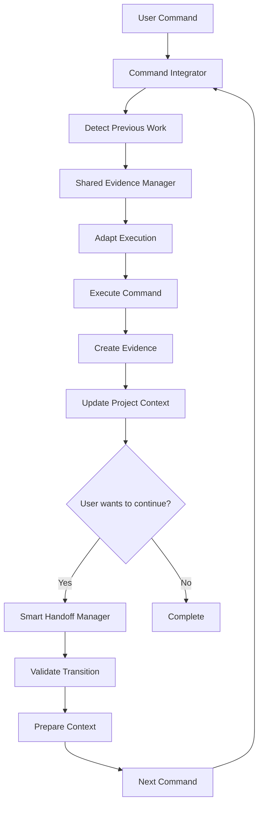

# Universal Command Integration Framework

## **Overview**

The Universal Command Integration Framework enables **command-agnostic workflow execution** where users can start with ANY command (`/ask`, `/cwo12`, `/research`, `/exec`, etc.) and seamlessly continue with others. The system automatically detects previous work, inherits context, prevents redundant work, and provides smooth transitions between commands.

## **Problem Solved**

**Before**: Users needed to know which command to use and when
- ❌ User expertise required for command selection
- ❌ Work lost when switching between commands
- ❌ Redundant analysis and research
- ❌ Fixed entry points and rigid workflows

**After**: Users just describe what they want, system handles the orchestration
- ✅ Start with ANY command - system adapts
- ✅ Seamless context preservation across commands
- ✅ Intelligent redundant work prevention
- ✅ Flexible, adaptive workflows

## **Core Components**

### 1. **Shared Evidence Manager** (`shared_evidence_manager.py`)
- **Project Context**: Unified project state across all commands
- **Evidence Storage**: Standardized evidence format and storage
- **Work Detection**: Automatic detection of previous command executions
- **Quality Tracking**: Quality scores and gate validation across commands

### 2. **Smart Handoff Manager** (`smart_handoff_manager.py`)
- **Transition Validation**: Ensures command handoffs are appropriate
- **Context Preparation**: Prepares context for target command
- **Quality Assessment**: Evaluates if handoff meets quality thresholds
- **Recommendation Engine**: Provides next-step recommendations

### 3. **Command Integration Utils** (`command_integration_utils.py`)
- **Universal Integrator**: Common integration functionality for all commands
- **Adaptive Execution**: Adapts command execution based on previous work
- **Evidence Creation**: Standardized evidence creation and storage
- **Next Action Logic**: Intelligent recommendation system

## **Integration Architecture**



## **Key Features**

### **1. Command-Agnostic Entry Points**
```yaml
# Users can start anywhere
/research "user authentication best practices"     # ✅ Works
/cwo12 "implement authentication system"          # ✅ Works
/ask "analyze authentication requirements"        # ✅ Works
/exec "quick authentication prototype"           # ✅ Works
```

### **2. Bidirectional Context Detection**
```python
# Any command can detect work from any other command
detected_work = evidence_manager.detect_previous_work("/cwo12")

# Returns:
{
    'ask_completed': CommandEvidence or None,
    'research_completed': CommandEvidence or None,
    'planning_done': CommandEvidence or None,
    'execution_started': CommandEvidence or None,
    'validation_done': CommandEvidence or None,
    'project_context': ProjectContext or None
}
```

### **3. Smart Redundant Work Prevention**
```python
# System automatically avoids duplicate work
adaptation = integrator.adapt_execution(user_input, detected_work)

# Returns:
{
    'avoids_redundant_work': [
        'duplicate research',
        'redundant input analysis',
        'duplicate planning'
    ],
    'builds_upon': [
        'existing research findings',
        'strategic planning',
        'architecture design'
    ]
}
```

### **4. Quality-Aware Handoffs**
```python
# Only allows handoffs when quality thresholds are met
handoff_result = handoff_manager.execute_smart_handoff(
    from_command="/ask",
    to_command="/cwo12",
    user_request="continue with implementation"
)

# Validates:
# - Transition compatibility
# - Quality gate satisfaction
# - Context preservation
# - Prerequisite completion
```

## **Command Integration Examples**

### **Scenario 1: Research → CWO12**
```bash
# User starts with research
/research "authentication best practices"

# Later continues with CWO12
/cwo12 "implement authentication system"

# System automatically:
# ✅ Detects /research completion
# ✅ Inherits research findings
# ✅ Continues from Step 3 (planning)
# ✅ Avoids redundant research
```

### **Scenario 2: CWO12 → Exec**
```bash
# User starts with CWO12 planning
/cwo12 "plan user management system"

# Later switches to execution
/exec "implement according to plan"

# System automatically:
# ✅ Detects CWO12 planning completion
# ✅ Inherits strategic plan
# ✅ Continues with enhanced execution
# ✅ Maintains quality standards
```

### **Scenario 3: Ask → Multiple Commands**
```bash
# User starts with analysis
/ask "analyze microservices requirements"

# Can continue with any:
/cwo12 "implement microservices"      # Full workflow
/speckit.plan "design architecture"   # Planning focus
/research "deep investigation"        # Research focus
/exec "quick prototype"              # Execution focus
```

## **Quality Standards**

### **Evidence Quality Thresholds**
```yaml
command_specific_thresholds:
  /cwo12: 0.90      # High - orchestrates complete workflows
  /gw.code-review: 0.95  # Highest - validates all work
  /qual-gate: 0.85   # Standard - quality validation
  /ask: 0.80         # Entry point - lower threshold
  /research: 0.85    # Research - evidence quality focus
  /exec: 0.85        # Implementation - code quality focus
```

### **Cross-Command Quality Gates**
```yaml
quality_gates:
  input_validation: "Step 1 completion with ≥85% quality"
  research_validation: "Evidence depth ≥90%"
  planning_validation: "Strategic plan quality ≥90%"
  implementation_validation: "Code quality ≥85%"
  final_validation: "Overall project quality ≥95%"
```

## **File Structure**

```
.claude/integration/
├── universal_command_integration.yaml    # Configuration and standards
├── shared_evidence_manager.py           # Evidence and context management
├── smart_handoff_manager.py            # Command handoff logic
├── command_integration_utils.py        # Common integration utilities
├── integration_demo.py                 # Demonstration script
└── INTEGRATION_SUMMARY.md              # This documentation

.speckit/evidence/shared/               # Shared evidence storage
├── ask_*.json                          # /ask evidence files
├── research_*.json                     # /research evidence files
├── cwo12_*.json                        # /cwo12 evidence files
└── ...                                  # Other command evidence

.speckit/state/                         # Project state management
├── project_*.json                      # Project context files
└── handoff_history.json                # Handoff history
```

## **Usage Integration**

### **For Command Developers**
```python
# Simple integration for any command
from command_integration_utils import get_command_integrator

# Initialize integrator for your command
integrator = get_command_integrator("/your_command")

# Initialize execution with context detection
execution_context = integrator.initialize_execution(user_input)

# Adapt execution based on previous work
adaptation = integrator.adapt_execution(user_input, execution_context['detected_work'])

# Execute your command with adapted approach
results = execute_your_command(user_input, adaptation)

# Create evidence for other commands
evidence = integrator.create_command_evidence(
    execution_context=execution_context,
    results_summary=results.summary,
    quality_metrics=results.quality_scores,
    evidence_paths=results.file_paths
)

# Get recommendations for next actions
recommendations = integrator.recommend_next_actions(execution_context, evidence)
```

### **For Users**
```bash
# Users just use commands normally - system handles integration
/ask "analyze system requirements"           # Start anywhere
/research "investigate best practices"       # Switch anytime
/cwo12 "implement complete solution"        # Continue with workflow
/exec "build the solution"                  # Adapt as needed

# System automatically:
# 1. Detects previous work
# 2. Inherits relevant context
# 3. Adapts execution approach
# 4. Prevents redundant work
# 5. Provides next-step recommendations
```

## **Benefits Realized**

### **1. User Experience**
- **No Learning Curve**: Users don't need to understand command specializations
- **Flexible Workflows**: Start anywhere, continue anywhere
- **Continuous Context**: No work lost when switching approaches
- **Intelligent Guidance**: System suggests optimal next steps

### **2. Development Efficiency**
- **No Redundant Work**: Automatic duplicate prevention
- **Quality Consistency**: Unified quality standards across commands
- **Evidence Reuse**: Previous work enhances current execution
- **Smart Adaptation**: Commands adapt based on project state

### **3. System Architecture**
- **Loose Coupling**: Commands work independently but coordinate
- **Shared Standards**: Common evidence and quality frameworks
- **Extensible Design**: Easy to add new commands to the ecosystem
- **Robust Error Handling**: Graceful fallbacks and recovery

## **Future Enhancements**

### **Phase 2: Advanced Features**
- **Parallel Execution**: Coordinate multiple commands simultaneously
- **Learning Integration**: System learns from user patterns
- **Performance Optimization**: AI-driven command selection
- **Enterprise Integration**: Team coordination and collaboration

### **Phase 3: Ecosystem Expansion**
- **Third-Party Commands**: Enable external command integration
- **Workflow Templates**: Predefined patterns for common scenarios
- **Custom Integration Rules**: User-defined command coordination
- **Analytics Dashboard**: Usage patterns and optimization insights

---

**The Universal Command Integration Framework transforms the user experience from "know which command to use" to "just tell me what you need" - the system handles the orchestration, adaptation, and optimization automatically.**
