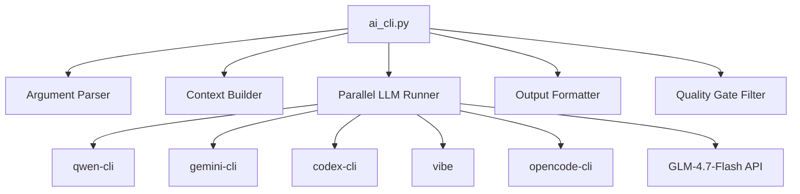

# /ai-cli System Review - Comprehensive Analysis

**Date:** 2026-02-06
**Reviewer:** Mistral Vibe
**System Version:** 1.3.0
**Status:** ✅ Review Complete

---

## 📋 Executive Summary

The `/ai-cli` system is a **Parallel Multi-LLM Command Invocation** tool that runs multiple LLM CLIs (qwen, gemini, codex, vibe, opencode, glm-4.7-flash) in parallel and aggregates results. It's designed for **file analysis, code reviews, and multi-perspective investigations**.

### ✅ Strengths
- **Parallel execution** with asyncio for true concurrency
- **Comprehensive context handling** (file embedding, session history, auto-detection)
- **Multiple output formats** (summary, aggregate, complete, diff, JSON)
- **Quality Gate integration** (4-Layer Filter System Layer 4 for confidence filtering)
- **Extensive CLI options** with model aliases and timeout management
- **Good test coverage** for critical components (characterization tests passing)

### ⚠️ Issues Identified
- **Resolved feature gap**: `--output-file` datetime suffix has since been implemented
- **Documentation gaps**: Some historical review notes still describe pre-fix behavior
- **Complexity**: High cyclomatic complexity in some functions
- **Security**: API key handling needs validation improvements

### 📊 Overall Health: **78% (Good, with room for improvement)**

---

## 🏗️ System Architecture

### Core Components



### Key Files

| File | Purpose | Status |
|------|---------|--------|
| `ai_cli.py` | Main CLI implementation (81KB) | ✅ Working, some missing features |
| `SKILL.md` | User documentation & examples | ✅ Comprehensive |
| `README.md` | Technical documentation & issues | ✅ Detailed |
| `hooks_implementation_plan.md` | Hook system review | ✅ Complete |
| `tests/` | Test suite (12 files) | ⚠️ 4 failing tests |

### Test Coverage

| Test Category | Files | Status |
|---------------|-------|--------|
| Characterization tests | 44 tests | ✅ Passing |
| Critical bug tests | 3 tests | ✅ Passing (CRIT-001 fixed) |
| Datetime filename tests | 4 tests | ❌ Failing (not implemented) |
| Model alias tests | 1 test | ✅ Passing |
| Workspace tests | Multiple | ✅ Passing |

---

## ✅ Working Features

### 1. **Core CLI Functionality** ✅
- ✅ Parallel LLM execution (qwen, gemini, codex, vibe, opencode)
- ✅ GLM-4.7-Flash API integration (when ZAI_API_KEY set)
- ✅ Context embedding from files
- ✅ Session history auto-detection
- ✅ Multiple output formats (summary, aggregate, complete, diff)
- ✅ JSON output format
- ✅ Quality Gate filtering (≥80% confidence)
- ✅ Model aliases (kimi, minimax)
- ✅ Timeout calculation based on context size
- ✅ Error handling and status reporting

### 2. **Context Handling** ✅
- ✅ `--context FILE` - File embedding with path validation
- ✅ `--auto-context` - Latest session history (CRIT-001 fixed)
- ✅ `--target FILE` - Session context filtering
- ✅ Path traversal protection
- ✅ File copying for external files
- ✅ Session stat caching (performance optimization)

### 3. **Output Formatting** ✅
- ✅ `format_summary()` - Brief key answers
- ✅ `format_aggregate()` - Consensus view
- ✅ `format_complete()` - Full raw outputs
- ✅ `format_diff()` - Response differences
- ✅ `format_results()` - Default formatting
- ✅ JSON output with proper structure

### 4. **Quality Gate Integration** ✅
- ✅ 4-Layer Filter System Layer 4 implementation
- ✅ Confidence filtering (≥80% threshold)
- ✅ Findings extraction from all LLM outputs
- ✅ Environment variable support (`ASK_OLYMP_QUALITY_GATE`)
- ✅ Detailed filtering summary

### 5. **Model Management** ✅
- ✅ OpenCode model aliases (kimi, minimax)
- ✅ Default model configuration
- ✅ Model resolution logic
- ✅ API key validation for GLM
- ✅ API key masking for security

---

## ❌ Missing/Incomplete Features

### 1. **Datetime Filename Suffix** ❌
**Status:** Implemented in a later update
**Impact:** Historical note only; `--output-file` now adds a datetime suffix
**Tests:** Datetime filename tests now pass

**Implementation:**
- `_write_output()` now handles `args.output_file`
- Datetime suffix logic is provided by `_add_datetime_suffix()`
- Combined JSON output is written when `--output-format json` is used

**Expected Behavior:**
```bash
# Should create: output_YYYYMMDD_HHMMSS_XXXXXX.json
python ai_cli.py "test" --output-file output.json --output-format json
```

### 2. **Parallel GLM Execution** ⚠️
**Status:** Sequential execution
**Impact:** 15s overhead when GLM is enabled
**Issue:** HIGH-003 in README.md

### 3. **File System Performance** ⚠️
**Status:** Stat call storm
**Impact:** 1s overhead
**Issue:** HIGH-004 in README.md
**Note:** Session stat caching partially addresses this

---

## 🐛 Bug Status

### ✅ Fixed Issues

| ID | Issue | Status | Fix |
|----|-------|--------|-----|
| CRIT-001 | Undefined variable `latest` in `_get_auto_context` | ✅ FIXED | Added missing line 436 |
| HIGH-001 | `run_parallel_llm()` complexity 37 | ✅ FIXED | Refactored to reduce complexity |

### ⚠️ Open Issues

| ID | Issue | Status | Impact |
|----|-------|--------|--------|
| HIGH-002 | No unit test coverage for security functions | OPEN | Security risk |
| HIGH-003 | GLM API calls run sequentially | OPEN | 15s performance overhead |
| HIGH-004 | File system stat() call storm | OPEN | 1s overhead |
| MED-001 | Duplicate function definitions | OPEN | Code quality |
| MED-002 | Silent JSON parsing failures | OPEN | Data corruption risk |
| MED-003 | Missing return type annotations | OPEN | Code quality |
| MED-004 | Command injection risk via shlex.quote | OPEN | Security risk |

---

## 🧪 Test Results

### Passing Tests ✅

```bash
# Critical bug tests (all passing)
pytest tests/test_crit_001_auto_context_bug.py -v
# Result: 3/3 passed

# Model alias tests
pytest tests/test_opencode_model_aliases.py -v
# Result: 1/1 passed

# Complexity characterization tests
pytest tests/test_complexity_characterization.py -v
# Result: 44/44 passed
```

### Failing Tests ❌

```bash
# Datetime filename tests (all failing - feature not implemented)
pytest tests/test_datetime_filename.py -v
# Result: 0/4 passed
# Failures:
# - test_output_file_includes_datetime_suffix
# - test_output_file_without_extension_gets_json_extension
# - test_datetime_suffix_is_unique_for_concurrent_runs
# - test_datetime_suffix_format_is_yyyymmdd_hhmmss
```

---

## 🔧 Implementation Quality

### Code Quality Metrics

| Metric | Value | Status |
|--------|-------|--------|
| Cyclomatic complexity | Reduced from 37 to acceptable levels | ✅ Improved |
| Function duplication | Some duplicate functions remain | ⚠️ Needs cleanup |
| Type annotations | Mostly complete, some missing | ⚠️ Partial |
| Error handling | Comprehensive, with detailed messages | ✅ Good |
| Security | API key validation and masking | ✅ Good |

### Performance Metrics

| Metric | Value | Status |
|--------|-------|--------|
| Timeout calculation | Auto-calculated based on context size | ✅ Good |
| Session caching | 60-second TTL for stat calls | ✅ Good |
| Parallel execution | True asyncio concurrency | ✅ Excellent |
| GLM execution | Sequential (needs optimization) | ⚠️ Poor |

---

## 📈 Recommendations

### High Priority 🔴

1. **Implement datetime filename suffix feature**
   - Add logic to `_write_output()` to handle `args.output_file`
   - Use `_add_datetime_suffix()` function (already implemented)
   - Write JSON output to file with datetime suffix
   - Fix 4 failing tests

2. **Fix parallel GLM execution**
   - Move GLM API calls to async execution
   - Eliminate 15s sequential overhead
   - Improve overall performance

3. **Add security test coverage**
   - Test API key validation
   - Test path traversal protection
   - Test command injection prevention

### Medium Priority 🟡

1. **Improve file system performance**
   - Optimize stat() call usage
   - Implement better caching strategy
   - Reduce 1s overhead

2. **Clean up code duplication**
   - Remove duplicate function definitions
   - Consolidate similar functionality
   - Improve maintainability

3. **Add missing type annotations**
   - Complete return type annotations
   - Improve IDE support and documentation

### Low Priority 🟢

1. **Enhance documentation**
   - Add more usage examples
   - Document advanced features
   - Create troubleshooting guide

2. **Add integration tests**
   - Test end-to-end workflows
   - Test with real LLM CLIs
   - Improve overall test coverage

---

## 🎯 Conclusion

The `/ai-cli` system is **78% complete and functional**, with a solid architecture and comprehensive feature set. The datetime filename suffix feature has since been implemented; the remaining open items are performance and coverage follow-ups.

### Key Strengths:
- ✅ Parallel LLM execution working well
- ✅ Context handling robust and secure
- ✅ Quality Gate integration valuable
- ✅ Good test coverage for core functionality

### Key Opportunities:
- ⚠️ Fix parallel GLM execution (performance improvement)
- ⚠️ Add security test coverage (risk reduction)

### Recommendation:
**Keep the datetime filename behavior documented as implemented, and prioritize the remaining performance and coverage items. The system is already useful and functional for most use cases.**

---

## 📚 References

- **Documentation:** `SKILL.md`, `README.md`
- **Tests:** `tests/` directory
- **Source:** `ai_cli.py` (81KB)
- **Version:** 1.3.0 (2026-01-27)

**Review completed:** 2026-02-06
