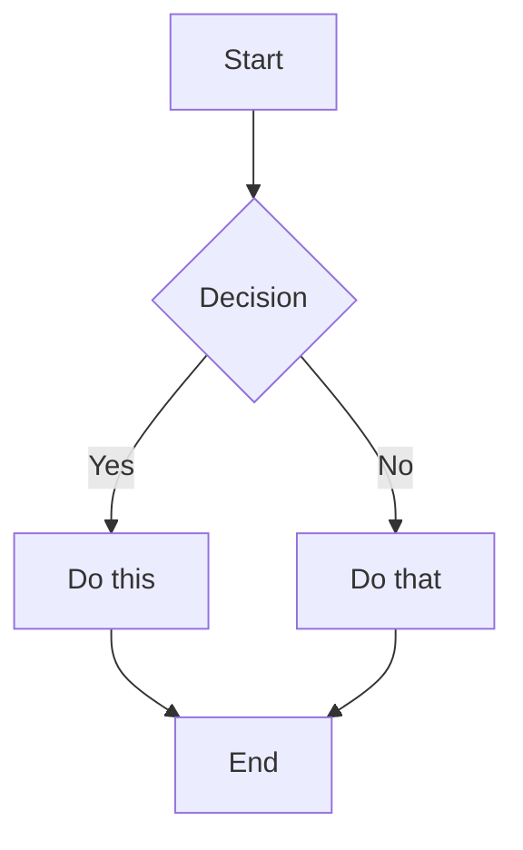
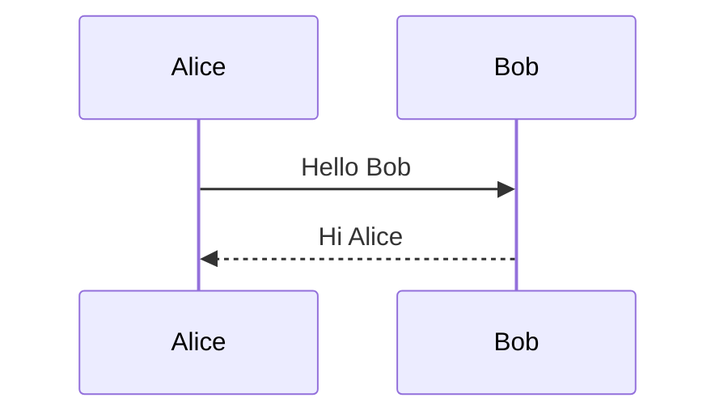
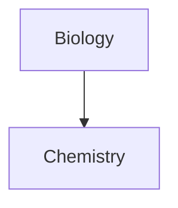

# heyitsnoah-claudesidian.md
heyitsnoah/claudesidian

Branch:

 

main

  |  

Path:

 

/ (full repo)

  |  

Source:

 https://github.com/heyitsnoah/claudesidian

 

Total:

 ~64,671 words (~258,684 chars)

File tree

📄 CHANGELOG.md

 

📄 CLAUDE-BOOTSTRAP.md

 

📄 CONTRIBUTING.md

 

📄 FIRST_RUN

 

📄 LICENSE

 

📄 README.md

 

📄 install.sh

 

📄 package-lock.json

 

📄 package.json

 

📁 00_Inbox/

 

📄 README.md

 

📄 Welcome.md

 

📁 01_Projects/

 

📄 README.md

 

📁 02_Areas/

 

📄 README.md

 

📁 03_Resources/

 

📄 README.md

 

📁 04_Archive/

 

📄 README.md

 

📁 05_Attachments/

 

📄 README.md

 

📁 06_Metadata/

 

📄 README.md

 

📁 06_Metadata/Reference/

 

📄 Common Claude Code Prompts.md

 

📁 06_Metadata/Templates/

 

📄 Daily Note Template.md

 

📄 Project Template.md

 

📄 Research Note Template.md


--------------------------------------------------------------------------------


Repository files


--------------------------------------------------------------------------------


📄 

00_Inbox/README.md

 _(

file

)

# 📥 Inbox

Your capture zone for new ideas, quick thoughts, and unprocessed information.

## Purpose

The Inbox is a **temporary** holding area designed for:
- Quick capture without worrying about organization
- Daily notes and journaling
- Web clippings and interesting finds
- Meeting notes before processing
- Random thoughts and ideas

## How to Use

### Daily Workflow
1. **Capture first, organize later** - Don't slow down to categorize
2. **Use daily notes** - One note per day for stream of consciousness
3. **Dump links and quotes** - Save now, process later
4. **Don't let it pile up** - Process weekly

### Weekly Processing
Every week, review your inbox and:
- Move project-related notes to `01_Projects/`
- Move ongoing topics to `02_Areas/`
- Move reference material to `03_Resources/`
- Archive completed items to `04_Archive/`
- Delete what's no longer relevant

## Claude Code Commands

### Quick Capture


Create a new note in 00_Inbox called [title]

 

with these thoughts: [content]


### Process Inbox


Review all notes in 00_Inbox.

 

Help me decide where each should go

 

based on the PARA method.


### Find Connections


Look at recent notes in my inbox.

 

What patterns or themes do you see?

 

What existing notes might these connect to?


## Tips

- **Don't aim for perfection** - The inbox is meant to be messy
- **Use descriptive filenames** - Makes processing easier
- **Date your notes** - YYYY-MM-DD format helps with sorting
- **Link liberally** - Even to notes that don't exist yet
- **Review regularly** - Don't let items sit for more than 2 weeks

## File Naming

Suggested formats:
- Daily notes: `2024-03-15.md`
- Quick captures: `2024-03-15 - Meeting with Team.md`
- Web clips: `2024-03-15 - Article Title - Source.md`
- Ideas: `Idea - Brief Description.md`

Remember: The Inbox is where ideas begin, not where they live forever.


📄 

00_Inbox/Welcome.md

 _(

file

)

# Welcome to Your AI-Powered Second Brain

This is your Inbox - a temporary landing zone for new ideas, quick captures, and daily thoughts.

## Your First Steps

1. **Start Claude Code** in this directory
2. **Tell it you're in thinking mode**: "I'm exploring [topic] in thinking mode"
3. **Let it search and ask questions** to help you think
4. **Capture insights** as you go

## Quick Tips

- Don't worry about organization initially - just capture
- Process your inbox weekly (move items to Projects/Areas/Resources)
- Use Daily Notes for stream-of-consciousness capture
- Let Claude Code help you find connections

## Try This Now

Ask Claude Code:


I'm new to this vault. Can you help me understand

 

how to use you as a thinking partner?

 

Let's explore a topic I'm curious about.


## Remember

The goal isn't to create perfect notes - it's to enhance your thinking. This system grows more valuable over time as you add more notes and Claude Code helps you discover connections you didn't see before.

---
*Move this to Archive once you're comfortable with the system*


📄 

01_Projects/README.md

 _(

file

)

# 🎯 Projects

Active initiatives with specific outcomes and deadlines.

## Purpose

Projects are **time-bound efforts** with:
- Clear objectives and deliverables
- Defined start and end dates
- Specific success criteria
- Measurable outcomes

## What Belongs Here

### Good Projects
- "Q1 2024 Marketing Strategy" ✓
- "Website Redesign" ✓
- "Book Writing - AI & Creativity" ✓
- "Conference Talk - BRXND NYC" ✓

### Not Projects (These go in Areas)
- "Health" ✗ (ongoing, no end date)
- "Learning" ✗ (continuous activity)
- "Team Management" ✗ (ongoing responsibility)

## Project Structure

Each project should have:


Project_Name/

 

├── README.md           # Project overview and status

 

├── Research/          # Background materials

 

├── Daily_Progress/    # Log of work sessions

 

├── Drafts/           # Work in progress

 

├── Resources/        # Supporting documents

 

└── Output/          # Final deliverables


## Claude Code Workflows

### Starting a Project


Create a new project called [name] in 01_Projects.

 

Set it up with the standard folder structure.

 

I'm in thinking mode - help me define objectives.


### Project Research


I'm working on [project name].

 

Search my vault for relevant existing notes.

 

What connections exist to my other work?


### Daily Progress


Create a progress note for today in [project]/Daily_Progress.

 

Here's what I accomplished: [summary]

 

Questions that came up: [list]


### Project Status


Review all notes in [project folder].

 

What's the current status?

 

What are the key insights so far?

 

What's left to complete?


### Project Completion


Project [name] is complete.

 

Create a retrospective covering:

Objectives vs outcomes

Key learnings

What to do differently next time

 

Then help me archive it properly.


## Project Lifecycle

1. **Initiation**: Define objectives, success criteria
2. **Research**: Gather relevant information
3. **Development**: Daily progress, iterative work
4. **Review**: Regular status checks
5. **Completion**: Final output, retrospective
6. **Archive**: Move to 04_Archive with summary

## Tips for Success

- **Start with clear objectives** - Vague projects never end
- **Use the template** - Consistency helps Claude Code help you
- **Log progress daily** - Even "no progress" is worth noting
- **Review weekly** - Keep projects on track
- **Complete or kill** - Don't let projects linger

## When to Archive

Move projects to `04_Archive/` when:
- All objectives are complete
- The project is cancelled
- It's been inactive for 30+ days
- It's transformed into an Area (ongoing)

Always create a summary note before archiving!


📄 

02_Areas/README.md

 _(

file

)

# 🔄 Areas

Ongoing responsibilities and spheres of activity you maintain over time.

## Purpose

Areas are **ongoing responsibilities** that:
- Have no end date
- Require continuous attention
- Define your roles and commitments
- Need regular maintenance

## What Belongs Here

### Personal Areas
- Health & Fitness
- Finances
- Relationships
- Personal Development
- Home & Environment

### Professional Areas
- Team Management
- Client Relationships
- Professional Skills
- Industry Knowledge
- Networking

### Creative Areas
- Writing Practice
- Content Creation
- Learning & Research
- Side Projects

## Area Structure

Each area might contain:


Area_Name/

 

├── README.md          # Overview and principles

 

├── Goals/            # Current focus areas

 

├── Resources/        # Reference materials

 

├── Reviews/          # Periodic check-ins

 

└── Ideas/           # Future possibilities


## Claude Code Workflows

### Area Review


Review my [area name] area.

 

What patterns do you see in recent notes?

 

What aspects need more attention?


### Setting Goals


Help me set quarterly goals for [area].

 

Based on recent activity, what should I prioritize?


### Finding Gaps


Analyze my [area] notes.

 

What important topics am I not tracking?

 

What questions should I be asking?


### Cross-Area Analysis


Compare my [Area A] and [Area B] notes.

 

Where do they overlap?

 

How might they inform each other?


## Area vs Project

**Ask yourself**: Does this have an end date?

| Area (Ongoing) | Project (Time-bound) |
|---------------|---------------------|
| "Health" | "Lose 10 pounds by June" |
| "Finances" | "Create 2024 budget" |
| "Writing" | "Finish blog post series" |
| "Learning" | "Complete Python course" |
| "Clients" | "Deliver Project X" |

## Maintenance Practices

### Weekly
- Quick scan of each area
- Note any urgent needs
- Capture new ideas

### Monthly
- Review goals and progress
- Update resource lists
- Clean up old notes

### Quarterly
- Deep review with Claude Code
- Adjust focus areas
- Archive outdated material

## Claude Code Prompts

### Health Check


Do a health check on all my areas.

 

Which have recent activity?

 

Which have been neglected?


### Balance Assessment


Looking at my areas, where am I spending most energy?

 

What's out of balance?


### Integration Opportunities


Find connections between my different areas.

 

Where could better integration create value?


## Tips

- **Areas inform Projects** - Projects often emerge from area needs
- **Keep them active** - Dead areas should be archived
- **Review regularly** - Areas drift without attention
- **Document standards** - What does "good" look like?
- **Track metrics** - Even qualitative areas benefit from measurement

## Remember

Areas are the backdrop of your life. They don't complete, but they evolve. Use Claude Code to help you see patterns and maintain balance across all your responsibilities.


📄 

03_Resources/README.md

 _(

file

)

# 📚 Resources

Your personal knowledge base of reference materials and evergreen notes.

## Purpose

Resources are **reference materials** that:
- You might need someday
- Aren't tied to specific projects
- Represent topics of ongoing interest
- Build your knowledge base over time

## What Belongs Here

### Categories to Consider


03_Resources/

 

├── Articles/          # Saved web content

 

├── Books/            # Book notes and summaries

 

├── Concepts/         # Evergreen idea notes

 

├── People/           # Notable people and thinkers

 

├── Tools/            # Software, methods, frameworks

 

├── Quotes/           # Memorable quotes

 

├── Examples/         # Case studies, references

 

└── Learning/         # Course notes, tutorials


### Good Resources
- Tutorial on Python decorators
- Article about mental models
- Book notes from "Thinking, Fast and Slow"
- Framework for decision-making
- List of cognitive biases
- Industry trend analysis

## Organization Principles

### By Topic, Not Source
❌ "Articles from Medium"
✅ "AI Development Techniques"

### Evergreen Over Ephemeral
❌ "News from March 2024"
✅ "Principles of Network Effects"

### Atomic Notes
- One concept per note
- Self-contained understanding
- Heavily linked to related ideas

## Claude Code Workflows

### Building Knowledge


I'm researching [topic].

 

What do I already have in Resources?

 

What gaps exist in my knowledge?


### Making Connections


Find all resources related to [concept].

 

How do different sources approach this?

 

What patterns emerge?


### Creating Synthesis


Review all notes about [topic] in Resources.

 

Create a synthesis document of key insights.


### Finding Examples


I need examples of [concept].

 

Search my resources for relevant cases.


## Resource Development

### From Consumption to Creation
1. **Capture**: Save interesting content
2. **Process**: Extract key ideas
3. **Connect**: Link to existing notes
4. **Develop**: Build your own understanding
5. **Create**: Generate original insights

### Progressive Summarization
- First pass: Highlight interesting parts
- Second pass: Bold the most important
- Third pass: Create summary at top
- Fourth pass: Extract to own note

## Claude Code Prompts

### Knowledge Audit


Analyze my Resources folder.

 

What topics am I building expertise in?

 

Where are the gaps?


### Connection Discovery


Find surprising connections between

 

different topics in my Resources.


### Learning Path


Based on my resources about [topic],

 

what should I learn next?

 

Create a learning path.


### Concept Clarification


Explain [concept] using examples

 

from my existing resources.


## Best Practices

### Naming Conventions
- Clear, descriptive titles
- Include key concepts in name
- Avoid dates (unless historical)
- Use consistent formatting

### Note Structure
```markdown
# Concept Name

## Summary
One paragraph overview

## Key Points
- Main idea 1
- Main idea 2
- Main idea 3

## Connections
- Related to: Other Concept
- Contrasts with: Different Idea
- Examples: Case Study

## Sources
- Original article/book/video


Maintenance

Review and update regularly

Merge duplicate concepts

Strengthen connections

Delete what's no longer relevant

Tips

Quality over quantity

 - Better to deeply understand few concepts

Your words matter

 - Rewrite in your own understanding

Links are gold

 - Connections create value

Review regularly

 - Unused knowledge fades

Share freely

 - Teaching solidifies understanding

Remember

Resources are your external brain. The value isn't in collecting, but in connecting and creating. Use Claude Code to help you see patterns and build understanding across your entire knowledge base.


### 📄 `04_Archive/README.md` _(_file_)


🗄️ Archive

Inactive items preserved for future reference.

Purpose

The Archive stores:

Completed projects with their outputs

Inactive areas no longer maintained

Old notes for historical reference

Deprecated resources

Past experiments and iterations

What Goes Here

From Projects

Completed projects with final deliverables

Cancelled projects with lessons learned

Projects inactive for 30+ days

From Areas

Areas no longer relevant to your life

Responsibilities you've handed off

Roles you no longer have

From Resources

Outdated information (but historically interesting)

Superseded frameworks or methods

Old versions of evolved ideas

From Inbox

Processed items no longer needed

Old daily notes (after extraction)

Random captures without lasting value

Organization

04_Archive/
├── Projects_2024/     # Completed projects by year
├── Projects_2023/
├── Old_Areas/        # Discontinued areas
├── Daily_Notes/      # Old daily captures
├── Ideas/           # Ideas that didn't develop
└── Miscellaneous/   # Everything else


Archival Process

Before Archiving Projects

Create completion summary

Extract reusable insights to Resources

Document lessons learned

Update any related Areas

Move entire folder with structure intact

Sample Completion Summary

# Project: [Name] - Completion Summary

**Duration**: Start date - End date **Status**: Completed/Cancelled/Suspended

## Objectives

- Original goal 1 ✓
- Original goal 2 ✓
- Original goal 3 ✗

## Key Outcomes

- What was delivered
- What impact it had
- What value was created

## Lessons Learned

- What worked well
- What didn't work
- What to do differently

## Reusable Assets

- Templates created: link
- Processes developed: link
- Insights gained: link

## Related Notes

- Continues in: Area name
- See also: Related project


markdown

Claude Code Workflows

Archive Project

Help me archive [project name].
Create a completion summary.
Extract reusable insights to Resources.
Move everything to Archive.


Search Archive

Search the archive for anything about [topic].
I need historical context.


Year in Review

Review all archived projects from [year].
What patterns do you see?
What did I accomplish?


Resurrect Project

I want to revive [archived project].
What was the status when archived?
What would need updating?


Archive Philosophy

It's Not a Graveyard

Archives preserve institutional memory

Old projects inform new ones

Patterns emerge over time

Ideas can be resurrected

It's Not a Dumping Ground

Archive thoughtfully

Maintain some organization

Keep summaries accessible

Delete true junk

Claude Code Prompts

Historical Analysis

Look at my archived projects.
What types of things do I tend to start but not finish?
What themes recur?


Knowledge Mining

Search the archive for any mentions of [concept].
How has my thinking evolved?


Pattern Recognition

Analyze my project completion rate.
What factors correlate with success?
What patterns predict failure?


Maintenance

Quarterly

Review recent additions

Ensure summaries exist

Check for resurrection candidates

Annually

Major archive cleanup

Delete what's truly dead

Extract any missed insights

Reorganize if needed

Tips

Date everything

 - Future you will thank you

Summarize always

 - Context fades quickly

Link liberally

 - Connections survive archival

Search often

 - Archives are meant to be used

Delete fearlessly

 - Not everything needs keeping

Remember

The Archive is your institutional memory. It's not about holding onto

 

everything, but about preserving what might inform future work. Use Claude Code

 

to help you see patterns across time and extract wisdom from experience.


### 📄 `05_Attachments/README.md` _(_file_)


📎 Attachments

Storage for images, PDFs, and other non-text files.

Purpose

Centralized location for:

Images and screenshots

PDFs and documents

Spreadsheets and data files

Audio and video files

Any binary files referenced in notes

Organization

05_Attachments/
├── Organized/          # Processed files with good names
│   ├── Images/
│   ├── PDFs/
│   └── Data/
├── IMG_*.png          # Unprocessed phone images
├── Screenshot*.png    # Unprocessed screenshots
├── CleanShot*.png    # Unprocessed CleanShot files
└── *.pdf             # Various PDFs


Naming Conventions

Before Processing

IMG_1234.png

 (from phone)

Screenshot 2024-03-15 at 2.30.45 PM.png

CleanShot 2024-03-15 at 14.30.45.png

document(1).pdf

After Processing

2024-03-15_Project_Architecture_Diagram.png

2024-03-15_Meeting_Whiteboard.jpg

API_Documentation_v2.pdf

Customer_Interview_Transcript.pdf

Helper Scripts

Run these with 

pnpm

:

Viewing Status

attachments:list

 - List unprocessed files

attachments:count

 - Count unprocessed files

attachments:organized

 - Count organized files

attachments:sizes

 - Show largest files

attachments:recent

 - Files added in last 7 days

Finding Issues

attachments:orphans

 - Files not referenced anywhere

attachments:refs [filename]

 - Find references to file

Organization

attachments:create-organized

 - Create Organized folder

Claude Code Workflows

Process Screenshots

Look at recent screenshots in 05_Attachments.
Based on their content, suggest better names.
Help me organize them.


Find Orphans

Find all attachments not referenced in any notes.
Should any be deleted?


Rename Batch

Review unprocessed images in Attachments.
Suggest descriptive names based on content.


Clean Up

Find duplicate images in Attachments.
Find files over 10MB.
What can be compressed or removed?


Best Practices

File Sizes

Keep images under 2MB for Git

Compress large PDFs

Use external storage for video

Optimize images before committing

Naming

Include date: 

YYYY-MM-DD

Be descriptive but concise

Use underscores not spaces

Include version numbers if relevant

Linking

# Embedding images
!/05_Attachments/Organized/diagram.png

# Linking PDFs
/05_Attachments/Organized/document.pdf

# With descriptions
!/05_Attachments/Organized/chart.png


markdown

Processing Workflow

Capture

: Save files to 

05_Attachments/

Review

: Look at content, determine purpose

Rename

: Give descriptive, dated name

Organize

: Move to 

Organized/

 subfolder

Link

: Update references in notes

Clean

: Remove orphaned files

Claude Code Prompts

Vision Analysis

Analyze the images in Attachments.
What do they contain?
Suggest appropriate names and organization.


Bulk Processing

Process all CleanShot files from this week.
Rename based on content.
Move to Organized.


Storage Audit

Analyze attachment storage:
- Total size
- Largest files
- File type distribution
- Orphaned files


Tips

Process weekly

 - Don't let files pile up

Name immediately

 - Context fades fast

Link purposefully

 - Only embed what adds value

Compress aggressively

 - Storage adds up

Delete liberally

 - Not every screenshot matters

Git Considerations

.gitignore suggestions

*.mp4
*.mov
*.zip
.DS_Store
files_over_10mb/


For Large Files

Use Git LFS for files over 10MB

Consider external storage

Link to cloud storage instead

Keep local but gitignore

Remember

Attachments support your notes, they don't replace them. A well-named, well-organized attachment is worth a thousand random screenshots. Use Claude Code's vision capabilities to help process and organize visual content efficiently.


### 📄 `06_Metadata/README.md` _(_file_)


⚙️ Metadata

Vault configuration, documentation, and organizational tools.

Purpose

The metadata folder contains:

Documentation about the vault

Templates for consistent note creation

Reference guides and how-tos

Agent configurations

Workflow documentation

Structure

06_Metadata/
├── Reference/         # Guides and documentation
├── Templates/        # Note templates
├── Agents/          # Claude Code agent configs
├── Workflows/       # Documented processes
└── Archive/        # Old configurations


What Lives Here

Reference

This vault's documentation

Claude Code prompt library

Style guides

Workflow documentation

Learning resources

Templates

Project templates

Daily note templates

Meeting templates

Research templates

Review templates

Agents

Thinking partner instructions

Research assistant config

Editor agent setup

Custom agent definitions

Workflows

Weekly review process

Project completion checklist

Inbox processing guide

Archive procedures

Using Templates

Manual

Copy template content

Create new note

Paste and fill in

With Claude Code

Create a new project using the project template.
Name it [Project Name] and put it in 01_Projects.


Creating Custom Agents

Save agent instructions as markdown files:

# Agent: [Name]

You are a [role description].

## Core Behaviors
- Behavior 1
- Behavior 2

## Workflow
1. Step 1
2. Step 2

## Constraints
- Don't do X
- Always do Y


markdown

Then reference in Claude Code:

Use the instructions in 06_Metadata/Agents/[agent].md
and help me with [task].


Claude Code Prompts

Template Usage

Show me available templates in 06_Metadata/Templates.
Create a new [type] note using the appropriate template.


Documentation

Check 06_Metadata/Reference for documentation on [topic].
Update the guide based on what we just learned.


Workflow Execution

Run the weekly review workflow from 06_Metadata/Workflows.
Guide me through each step.


Maintenance

Regular Updates

Update templates based on usage

Document new workflows as they emerge

Archive outdated configurations

Keep reference docs current

Version Control

Track changes to workflows

Document why changes were made

Keep archive of old versions

Date major updates

Best Practices

Document as you go

 - Capture workflows while fresh

Iterate templates

 - Improve based on usage

Share configurations

 - What works for you might help others

Keep it simple

 - Complex systems break

Date everything

 - Context matters

Remember

Metadata is the operating system of your vault. Good metadata means consistent structure, repeatable workflows, and scalable growth. This is where you document not just what you know, but how you work.


### 📄 `06_Metadata/Reference/Common Claude Code Prompts.md` _(_file_)


Common Claude Code Prompts

A collection of useful prompts for working with Claude Code in your vault.

Starting Work

Beginning a Session

I'm starting work for today. 
Can you review what I was working on yesterday 
and help me pick up where I left off?


Setting the Mode

I'm in thinking mode, not writing mode.
Please help me explore [topic] by asking questions
and searching for relevant notes.


Research & Synthesis

Finding Connections

Search my vault for anything related to [topic].
What patterns or connections do you see?


Synthesizing a Project

Review all notes in [project folder].
Create a synthesis of the key themes, insights, and open questions.


Weekly Review

Look at all notes created this week.
What are the main themes? 
What connections exist between different projects?


Organization

Processing Inbox

Review items in 00_Inbox.
Suggest where each should be moved based on PARA method.
Which items could be combined or linked?


Finding Orphans

Find notes that aren't linked to any other notes.
Suggest potential connections.


Cleaning Attachments

Review files in 05_Attachments.
Which ones aren't referenced in any notes?
Which could be better named?


Writing & Creation

Moving to Writing Mode

I'm ready to move from thinking to writing mode.
Based on our research in [project], 
help me create an outline for [deliverable].


Improving a Draft

Review [document].
Don't rewrite it, but give me specific feedback on:
- Structure and flow
- Gaps in logic or evidence
- Areas that need clarification


Learning & Development

Exploring a New Topic

I want to learn about [topic].
Start by searching my vault for any existing knowledge.
Then help me identify what I need to research.


Making an Argument

I'm trying to argue that [thesis].
Search my notes for supporting evidence.
What counterarguments should I address?


Project Management

Project Status

Review the project in [folder].
What's the current status?
What are the next actions needed?


Creating a Retrospective

[Project] is now complete.
Review all notes and create a retrospective covering:
- What was accomplished
- Key learnings
- What to do differently next time


Daily Operations

Morning Review

Good morning. Show me:
- Any notes modified yesterday
- Open tasks or questions
- What should I focus on today?


End of Day Wrap-up

End of day review:
- What did I accomplish today?
- What questions or ideas emerged?
- What should I prioritize tomorrow?


Advanced Techniques

Cross-Project Analysis

Compare insights from [Project A] and [Project B].
What patterns exist across both?
What could each learn from the other?


Knowledge Gaps

Analyze my notes on [topic].
What aspects am I missing?
What questions haven't I asked?


Idea Development

I have this rough idea: [idea]
Search for related concepts in my vault.
Help me develop this into something more concrete.


Tips for Effective Prompts

Be specific about mode

 (thinking vs writing)

Reference specific folders

 when relevant

Ask for questions

, not just answers

Request synthesis

, not just search

Iterate freely

 - have a conversation

Remember

Claude Code has access to your entire vault

It can create, edit, and organize files

Use it as a thinking partner, not just a tool

The best prompts emerge from your specific needs


### 📄 `06_Metadata/Templates/Daily Note Template.md` _(_file_)


{{date:YYYY-MM-DD}}

Capture

Questions

Insights

Connections

For Tomorrow


--------------------------------------------------------------------------------


End of day: Ask Claude Code to review and find connections


### 📄 `06_Metadata/Templates/Project Template.md` _(_file_)


{{title}}

Project Overview

Start Date

: {{date}}

 

Target Completion

:

 

Status

: Active

Objectives

[ ]

[ ]

[ ]

Context

Success Criteria

Key Resources

Progress Log

{{date}} - Project Initiated

Set up project structure

Initial research phase

Open Questions

Next Actions

[ ]

[ ]


--------------------------------------------------------------------------------


Using Claude Code? Say: "I'm working on {{title}} in thinking mode. Let's explore."


### 📄 `06_Metadata/Templates/Research Note Template.md` _(_file_)


{{title}}

Source

: [URL or reference]

 

Date

: {{date}}

 

Tags

: #research

Summary

Key Insights

Notable Quotes

Questions Raised

Connections

See: related note

Contradicts: other perspective

Builds on: foundation concept

Action Items

[ ]


--------------------------------------------------------------------------------


For synthesis: "Review all research notes in [folder] and identify patterns"


### 📄 `CHANGELOG.md` _(_file_)


Changelog

All notable changes to claudesidian will be documented in this file.

The format is based on 

Keep a Changelog

https://keepachangelog.com/en/1.1.0/

,

 

and this project adheres to

 

Semantic Versioning

https://semver.org/spec/v2.0.0.html

.

 - 2026-01-13

Changed

Updated 

@modelcontextprotocol/sdk

 to v1.25.2 (fixes HIGH severity ReDoS and DNS rebinding vulnerabilities)

Updated dev dependencies (eslint, prettier, typescript-eslint) to latest versions

Added

MIT license attribution for kepano/obsidian-skills (json-canvas, obsidian-bases, obsidian-markdown)

Added 

.worktrees/

 to gitignore for git worktree workflow support

Security

Fixed 5 Dependabot security alerts (3 high, 2 moderate)

 - 2026-01-13

Fixed

Preserve CJK (Chinese/Japanese/Korean) characters in filename sanitization for 

firecrawl-batch.sh

Replace sed with cut in 

/upgrade

 command for zsh compatibility

 - 2026-01-13

Added

New 

.claude/skills/

 directory with auto-triggered skills system

obsidian-markdown

 - Obsidian Flavored Markdown reference (wikilinks, callouts, embeds)

obsidian-bases

 - .base file creation and editing guide

json-canvas

 - .canvas file creation and editing guide

systematic-debugging

 - 4-phase debugging methodology

skill-creator

 - Guide for creating new skills and commands

git-worktrees

 - Git worktree workflow guide

New 

/pragmatic-review

 command for YAGNI/KISS-focused code review

Default mode: Fast scan for over-engineering

Deep mode (--deep): 6-pass comprehensive review

CI mode (--ci): Non-interactive for GitHub Actions

Skill discovery hook that lists available skills when user mentions "skill"

Updated 

.prettierignore

 to exclude markdown files

 - 2025-10-13

Fixed

Corrected hardcoded folder paths to use underscores instead of spaces

Fixed 

transcript-extract.sh

: 

00 Inbox/Clippings

 → 

00_Inbox/Clippings/

Fixed 

firecrawl-batch.sh

: 

00 Inbox/Clippings

 → 

00_Inbox/Clippings/

Fixed 

update-attachment-links.js

: 

05 Attachments

 → 

05_Attachments

Fixed 

fix-renamed-links.js

: 

05 Attachments

 → 

05_Attachments

Fixed example paths in 

GEMINI_VISION_QUICK_START.md

Removed security risk in 

firecrawl-batch.sh

 by eliminating 

source ~/.zshrc

Corrected non-existent file references in Gemini Vision documentation

Added

Custom output directory flag (

-o|--output-dir

) for 

firecrawl-batch.sh

Documentation for new output directory options in README.md

 - 2025-01-17

Added

New 

/install-claudesidian-command

 for creating shell alias/function to

 

launch vault from anywhere

iCloud Drive vault detection and import support in 

/init-bootstrap

 (macOS

 

only)

Fish shell support for launcher command with proper function syntax

Comprehensive user input path validation with helpful error messages

Platform detection for cross-platform compatibility (Linux, macOS, Windows)

Fixed

Critical shell injection vulnerability in launcher command with proper path

 

escaping

Backup creation before modifying shell configuration files

iCloud sync state checking with soft warnings for incomplete downloads

Shell detection now uses default shell instead of current session shell

Existing alias/function replacement with user confirmation

Improved error handling documentation with explanations

Security

Path escaping for vault paths with spaces, quotes, and special characters

Timestamped backups before modifying shell configs

Input validation for user-provided vault paths

Security considerations section in documentation

 - 2025-01-17

Fixed

Improved upgrade command to prevent interactive prompts and hanging

Enhanced upgrade command with explicit backup steps and non-interactive file

 

replacement

Refined upgrade command based on real usage feedback for better reliability

Applied linting fixes to upgrade command for code quality

 - 2025-01-17

Added

New 

/download-attachment

 command for downloading web content and files to

 

Obsidian attachments folder

New 

/pull-request

 command for creating PRs with intelligent change analysis

 

and description generation

Both commands integrate seamlessly with Obsidian's vault structure

Fixed

Security improvements in download command based on PR review feedback

Code formatting to pass lint checks

 - 2025-01-17

Added

Comprehensive linting and formatting setup with ESLint and Prettier

Configuration files organized in 

.config/

 folder for better project

 

structure

GitHub Action workflow for automated lint checks on pull requests

Package manager specification for consistent dependency management

Fixed

Resolved lonely if ESLint warning for cleaner code

GitHub Action configuration for proper pnpm setup

Added packageManager field to ensure consistent tooling across environments

 - 2025-01-15

Fixed

Corrected GitHub Action configuration to use claude_args instead of

 

allowed_tools

Fixed workflow validation error for allowed tools parameter

 - 2025-01-15

Added

GitHub Actions workflow for Claude Code integration

Claude can now respond to @claude mentions in issues and PRs

Configured permissions for Claude to create PRs and push changes

Added allowed tools configuration for pnpm, git, gh CLI operations

User restriction to repository owner for security

Development workflow option in init-bootstrap

Personal vault users: Removes .github folder

Contributors: Keeps GitHub workflows for development

 - 2025-01-14

Fixed

Corrected Firecrawl script examples to use 

npm run

 commands

Added contributing guideline about reviewing AI-generated content before

 

submission

Removed

Removed Common Patterns section from README (redundant)

 - 2025-01-14

Changed

Enhanced Gemini Vision documentation to explain direct image/PDF processing

 

benefits

Enhanced Firecrawl documentation to explain full-text capture and context

 

preservation

Added detailed API key setup instructions for both Gemini and Firecrawl

Removed

Removed Essential Workflows section from README (redundant with command

 

descriptions)

 - 2025-01-14

Added

Enhanced upgrade command documentation with detailed usage examples and safety

 

features

Contributing section with guidelines for community contributions

MIT license file for clear open-source licensing

Changed

Improved documentation clarity on Claude Code commands vs agents distinction

Updated contributing guidelines to encourage PRs for commands, agents, and

 

core updates

Removed

Removed thinking-partner agent (keeping slash command only)

 - 2025-01-13

Fixed

Added critical warnings to upgrade command documentation

Emphasized requirement to show diffs before applying changes

Added correct vs wrong implementation examples

Prevents loss of user customizations during upgrades

 - 2025-01-13

Fixed

Release command now automatically creates GitHub release using gh CLI

Prevents missing GitHub releases (like v0.8.2-v0.8.5 were)

Extracts release notes from CHANGELOG.md for GitHub release body

 - 2025-01-13

Changed

Improved semantic versioning guidelines in release command with clearer

 

decision guide

 - 2025-01-13

Fixed

Upgrade command now works without git connection for disconnected users

Clone latest version to .tmp/ directory instead of requiring upstream remote

Use .tmp/ instead of /tmp/ to hide upgrade files from Obsidian

Added user choice prompt when local modifications are detected

Added verification step to ensure all files were properly addressed

Added .tmp/ to .gitignore for cleaner repository

 - 2025-01-13

Fixed

Simplified upgrade command to systematically check all system files

Created upgrade checklist to track progress file-by-file

Filtered upgrades to only claudesidian system files, not user content

Added explicit file-by-file diff review before updating

Made upgrade process resumable with checklist tracking

 - 2025-01-13

Fixed

Improved init-bootstrap vault selection for multiple vaults

Added explicit confirmation before importing any vault

Enhanced user identification prompts with better explanations

Added disambiguation prompts to find the right person when researching

Clear instructions to never proceed without explicit vault confirmation

 - 2025-01-13

Fixed

Improved SessionStart hook formatting with arrow indicators for commands

Fixed update notification display to show clean output instead of raw JSON

Enhanced visual layout of first-run and update messages

 - 2025-01-13

Changed

Updated README with comprehensive feature descriptions including:

Smart vault analysis and pattern detection capabilities

User research and profile building features

Automatic update notification system

Web research capabilities with Firecrawl

Complete list of available commands including /upgrade

 - 2025-01-13

Added

Automatic update check on session start

SessionStart hook that fetches latest version from GitHub and compares to

 

local

Update notifications when newer versions are available

check-updates npm script for version comparison

Works even after disconnecting from original repository

Changed

Enhanced release command documentation with clearer semantic versioning

 

guidelines

Better guidance on when to use feat: vs fix: vs refactor: in commits

 - 2025-01-13

Added

Comprehensive vault analysis using tree, note sampling, and pattern detection

Enhanced profile building with URL fetching and custom context

Dynamic date generation for timestamps in CLAUDE.md

"Later" option for Gemini Vision and Firecrawl setup

Multiple vault import options (yes/no/skip/path)

Deeper research capabilities with disambiguation confirmation

Changed

init-bootstrap now analyzes vault structure before importing

Always confirms user identity even with single search result

Waits to create folders until after organization method selection

Detects plugins and attachments automatically instead of asking

Firecrawl presented as research game-changer with better explanation

Profile building includes comprehensive background from provided URLs

Fixed

Correct file counting without depth limits

Proper ordering of import before personalization questions

More accurate detection of user preferences from existing vault

 - 2025-01-13

Added

Intelligent vault import that preserves existing structure in OLD_VAULT folder

Auto-detection of existing Obsidian vaults by searching for .obsidian folders

User research and disambiguation for personalized setup

Automatic detection of file naming patterns and folder organization

Vault configuration saved to .claude/vault-config.json for future reference

Educational explanations during each setup step

Support for both pnpm and npm package managers

Comprehensive Obsidian file copying (plugins, trash, settings)

Clear examples for folder naming when cloning repository

Changed

init-bootstrap now imports entire vault structure safely without data loss

Gemini Vision and Firecrawl prompts clarify tools are already included

README includes examples of custom folder names when cloning

Removed unnecessary questions by detecting patterns automatically

 - 2025-01-13

Added

First-run welcome message using SessionStart hook

FIRST_RUN marker file to detect fresh installations

Markdown-formatted welcome prompt with setup instructions

Automatic detection and guidance for new users

Changed

init-bootstrap now removes FIRST_RUN marker after setup completion

Hook configuration uses inline commands (no external scripts needed)

 - 2025-01-13

Added

Simplified setup process with enhanced init-bootstrap command:

Automatic disconnection from original repository

Folder rename assistance for non-git users

Support for both git clone and ZIP download methods

Clear prompts for importing existing Obsidian vaults

Multiple setup paths in README for different user skill levels

Changed

init-bootstrap now handles complete environment setup including git management

README updated with clearer Quick Start instructions for both technical and

 

non-technical users

 - 2025-01-13

Fixed

Removed CLAUDE.md and settings.local.json from repository tracking

These user-specific files are now generated locally by init-bootstrap

Added both files to .gitignore to prevent accidental commits

Clean repository structure for new users

 - 2025-01-13

Added

Intelligent upgrade command (

/upgrade

) with AI-powered semantic merging

Smart conflict resolution that preserves user customizations while adding new

 

features

Automatic backup system with rollback capabilities

Selective update categories (AI-mergeable, auto-safe, protected)

Based on 2025 best practices for LLM-powered code migration

 - 2025-01-13

Changed

Updated init-bootstrap command and settings configuration

 - 2025-01-13

Fixed

Corrected all documentation to use proper slash command syntax (/command-name)

Fixed examples showing incorrect 'claude run' syntax

Updated README, CLAUDE.md, install.sh, and command docs

 - 2025-01-13

Changed

Updated README to use init-bootstrap command instead of install.sh

Simplified Quick Start instructions to 2-step process

Added examples of pre-configured commands in README

 - 2025-01-13

Added

Release command for automated version management and releases

Gemini Vision video analysis support:

Local video files (MP4, AVI, MOV, WebM, MKV, WMV, FLV, 3GP, M4V)

Direct YouTube URL analysis without download

Automatic video processing state detection

Updated documentation with video analysis examples

Changed

Enhanced init-bootstrap command with full environment setup including MCP

 

configuration

Updated Gemini Vision MCP server to support video formats

 - 2025-01-13

Added

Initial release of claudesidian - Claude Code + Obsidian starter kit

PARA method folder structure (00_Inbox through 06_Metadata)

Bootstrap initialization system via 

claude run init-bootstrap

Pre-configured Claude Code commands:

thinking-partner - Collaborative thinking mode

inbox-processor - Organize captures

research-assistant - Deep dive into topics

daily-review - End of day reflection

weekly-synthesis - Find patterns in your week

create-command - Build new custom commands

de-ai-ify - Remove AI writing patterns

add-frontmatter - Add metadata to notes

init-bootstrap - Interactive setup wizard

Claude Code agents for specialized workflows

Helper scripts:

firecrawl-batch.sh - Batch web scraping

firecrawl-scrape.sh - Single URL scraping

fix-renamed-links.js - Fix broken links after renames

update-attachment-links.js - Update attachment references

transcript-extract.sh - Extract YouTube transcripts

vault-stats.sh - Show vault statistics

Attachment management commands via pnpm

Gemini Vision MCP server for image/PDF analysis (optional)

CLAUDE-BOOTSTRAP.md template for configuration

Comprehensive README with setup instructions

Install script for automated setup

Git integration with proper .gitignore

Changed

Replaced static CLAUDE.md with dynamic init-bootstrap command

Security

API keys stored in environment variables

.mcp.json gitignored for security


### 📄 `CLAUDE-BOOTSTRAP.md` _(_file_)


Obsidian Vault Guidelines - Bootstrap Template

Getting Started with Claude Code + Obsidian

Quick Setup

Start every session

: Run 

git pull

 to sync latest changes

After changes

: Commit and push to preserve your work

Use built-in tools

: Prefer WebSearch and WebFetch for web content

Version Control Best Practices

CRITICAL - START EVERY SESSION

: Always run 

git pull

 at the beginning of

 

each new Claude session to ensure you have the latest changes from the remote

 

repository.

Commit workflow

:

After creating new notes: 

git add .

 → 

git commit -m "message"

 → 

git push

After significant edits: Commit and push immediately

Use 

git status

 to check for modifications

When agents modify files: Always commit those changes

Folder Structure (PARA Method)

vault/
├── 00_Inbox/           # Temporary capture point
├── 01_Projects/        # Time-bound initiatives
├── 02_Areas/           # Ongoing responsibilities
├── 03_Resources/       # Reference materials
├── 04_Archive/         # Completed/inactive items
├── 05_Attachments/     # Images, PDFs, etc.
│   └── Organized/      # Processed attachments
└── 06_Metadata/        # Documentation & templates
    ├── Reference/      # Guides and standards
    ├── Plans/          # Strategic documents
    └── Templates/      # Reusable structures


PARA Method Details

Projects (01)

Time-bound initiatives with clear completion criteria

Examples: Writing a paper, developing a presentation

Recommended subfolders: Research/, Drafts/, References/, Output/

Areas (02)

Ongoing responsibilities without end dates

Examples: Health, Finances, Professional Development

Create dedicated notes with links to related resources

Resources (03)

Topics of interest for reference

Knowledge bases organized by subject

Use for information not tied to specific projects

Archive (04)

Completed or inactive items

Maintain same folder structure as active sections

Review periodically for reactivation

Inbox Management

Core Principles

Inbox is temporary, not permanent storage

Process weekly using Capture → Process → Organize workflow

Maintain <20 items at any time

Files to Keep in Inbox

CRITICAL

: Files with number prefixes (00-06) stay permanently

Recent daily/weekly summaries (last 3 months)

Active notes being processed

Processing Workflow

Delete obsolete information

Move relevant material to PARA locations

Convert actions into project tasks

Tag items needing more processing with 

#needs-processing

File Organization Guidelines

Naming Conventions

Daily notes: 

YYYY-MM-DD - Topic

Meeting notes: 

Meeting - [Topic] - YYYY-MM-DD

Ideas: 

Idea - [Brief Description]

Resources: 

Resource - [Topic] - [Source]

Movement Rules

Use 

mv

 command (not 

cp

) to avoid duplicates

Verify destination folders exist first

Update internal links after moves

Add YAML frontmatter when organizing

Attachments Management

Organization

Store all non-text files in 

05_Attachments/

Processed files → 

05_Attachments/Organized/

Naming: 

[RelatedNote]_[Description].[ext]

Helper Scripts

pnpm attachments:list        # List unprocessed files
pnpm attachments:organized   # Count organized files
pnpm attachments:orphans     # Find unreferenced files
pnpm attachments:update-links # Update links after moving


bash

Web Content Workflow

Built-in Tools (Preferred)

WebSearch

: For general web searches

WebFetch

: For specific URLs

Save to appropriate folder based on content type

Custom Scripts (When Needed)

Single URL: 

pnpm firecrawl:scrape <url> <output>

Batch URLs: 

pnpm firecrawl:batch <url1> <url2>

Saves to 

00_Inbox/Clippings/

 with frontmatter

Writing Style Guidelines

Structure

Use 

WikiLinks

 for internal references

Include YAML frontmatter (dates, tags, status)

Consistent Markdown formatting

Specific, consistent tags

Style Preferences

Direct and confident statements

Avoid clichéd transitions

Let statements stand on their own

No unnecessary lead-ins

AI Assistant Guidelines

Before Any Organization

Map complete folder structure: 

find . -type d | sort

Document in 

06_Metadata/STRUCTURE.md

Verify all destination folders exist

Working with Content

Respect numbered core files (never move 00-06 prefixed files)

Always use 

mv

 not 

cp

 when organizing

Preserve and update bidirectional links

Add appropriate YAML frontmatter

Simple Commands Only

REQUIRED

: Direct, basic commands without filtering

FORBIDDEN

: Complex regex, piped commands, find with filters

Example RIGHT: 

ls -1

 then manually select files

Example WRONG: 

ls | grep pattern

 or 

find . -name "*.png"

Daily Workflows

Start of Day

Run 

git pull

Check inbox for items to process

Review active projects

End of Day

Process new inbox items

Commit and push changes

Update project notes

Weekly Review

Process entire inbox

Archive completed projects

Update area notes

Review and consolidate resources

Project Lifecycle

Starting a Project

Create folder in 

01_Projects/[ProjectName]

Add subfolders: Research/, Drafts/, Output/

Create README with objectives and timeline

During Project

Keep all related materials in project folder

Link to relevant resources and areas

Regular commits to track progress

Completing a Project

Create project summary note

Move entire folder to 

04_Archive/

Update relevant area notes

Commit with completion message

Best Practices

Organization

Keep folder structure shallow (max 3 levels)

Create subfolders only with 7+ related notes

Use linking over deep nesting

Include README in major folders

Content Creation

Capture first, organize later

One idea per note

Link generously

Tag consistently

Maintenance

Weekly inbox processing

Monthly project reviews

Quarterly archive cleanup

Regular git commits


--------------------------------------------------------------------------------


This is a bootstrap template. Customize based on your workflow and needs.


### 📄 `CONTRIBUTING.md` _(_file_)


Contributing to Claudesidian

Thank you for your interest in contributing to claudesidian! This document

 

provides guidelines for contributing to the project.

Development Setup

Fork the repository

Clone your fork: 

git clone https://github.com/yourusername/claudesidian.git

Install dependencies: 

pnpm install

Create a feature branch: 

git checkout -b feature/your-feature-name

Commit Message Convention

We follow 

Conventional Commits

https://www.conventionalcommits.org/

 for clear

 

commit history:

feat:

 New feature

fix:

 Bug fix

docs:

 Documentation changes

style:

 Code style changes (formatting, etc.)

refactor:

 Code refactoring

test:

 Test additions or changes

chore:

 Maintenance tasks

Examples:

feat: add new research-assistant command
fix: correct attachment link updates in scripts
docs: update README with MCP setup instructions


Versioning

We use 

Semantic Versioning

https://semver.org/

:

MAJOR (1.0.0): Breaking changes

MINOR (0.1.0): New features (backward compatible)

PATCH (0.0.1): Bug fixes (backward compatible)

Pull Request Process

Update the CHANGELOG.md with your changes under "Unreleased"

Update documentation if needed

Ensure all scripts still work

Submit PR with clear description of changes

Changelog Updates

When contributing, add your changes to CHANGELOG.md under the "Unreleased"

 

section:

## [Unreleased]

### Added

- Your new feature here

### Fixed

- Your bug fix here


markdown

Use these categories:

Added

 - New features

Changed

 - Changes to existing functionality

Deprecated

 - Features to be removed

Removed

 - Removed features

Fixed

 - Bug fixes

Security

 - Security updates

Release Process (Maintainers)

Update version in package.json

Move "Unreleased" items to new version in CHANGELOG.md

Commit: 

git commit -m "chore: release v0.2.0"

Tag: 

git tag v0.2.0

Push: 

git push && git push --tags

Create GitHub Release from tag, using changelog content

Code Style

Use clear, descriptive variable names

Comment complex logic

Keep functions focused and small

Test your changes thoroughly

Questions?

Feel free to open an issue for discussion before making large changes.


### 📄 `FIRST_RUN` _(_file_)


[167 bytes — binary/file excluded]


### 📄 `LICENSE` _(_file_)


[1,076 bytes — binary/file excluded]


### 📄 `README.md` _(_file_)


Claudesidian: Claude Code + Obsidian Starter Kit

Turn your Obsidian vault into an AI-powered second brain using Claude Code.

What is this?

This is a pre-configured Obsidian vault structure designed to work seamlessly

 

with Claude Code, enabling you to:

Use AI as a thinking partner, not just a writing assistant

Organize knowledge using the PARA method

Maintain version control with Git

Access your vault from anywhere (including mobile)

Quick Start

1. Get the Starter Kit

Option A: Clone with Git

# Clone with your preferred folder name (replace 'my-vault' with any name you like)
git clone https://github.com/heyitsnoah/claudesidian.git my-vault
cd my-vault

# Examples:
# git clone https://github.com/heyitsnoah/claudesidian.git obsidian-notes
# git clone https://github.com/heyitsnoah/claudesidian.git knowledge-base
# git clone https://github.com/heyitsnoah/claudesidian.git second-brain


bash

Option B: Download ZIP (no Git required)

Click "Code" → "Download ZIP" on GitHub

Extract to your desired location

Open the folder in Claude Code

2. Run the Setup Wizard

# Start Claude Code in the directory
claude

# Run the interactive setup wizard (in Claude Code)
/init-bootstrap


bash

This will:

Install dependencies automatically

Disconnect from the original claudesidian repository

Intelligently analyze

 your existing vault structure and patterns

Import your existing Obsidian vault

 safely to OLD_VAULT/ (if you have one)

Research your public work

 for personalized context (with your permission)

Ask you about your workflow preferences

Create a personalized CLAUDE.md configuration

Set up your folder structure

Optionally configure Gemini Vision for image/video analysis

Optionally configure Firecrawl for web research

Initialize Git for version control

3. Open in Obsidian (Optional but Recommended)

Download 

Obsidian

https://obsidian.md

Open vault from the claudesidian folder

This gives you a visual interface alongside Claude Code

4. Your First Session

Tell Claude Code:

I'm starting a new project about [topic].
I'm in thinking mode, not writing mode.
Please search my vault for any relevant existing notes,
then help me explore this topic by asking questions.


Or use one of the pre-configured commands (in Claude Code):

/thinking-partner   # For collaborative exploration
/daily-review       # For end-of-day reflection
/research-assistant # For deep dives into topics


Folder Structure

claudesidian/
├── 00_Inbox/           # Temporary capture point for new ideas
├── 01_Projects/        # Active, time-bound initiatives
├── 02_Areas/           # Ongoing responsibilities
├── 03_Resources/       # Reference materials and knowledge base
├── 04_Archive/         # Completed projects and inactive items
├── 05_Attachments/     # Images, PDFs, and other files
├── 06_Metadata/        # Vault configuration and templates
│   ├── Reference/      # Documentation and guides
│   └── Templates/      # Reusable note templates
└── .scripts/           # Helper scripts for automation


Key Concepts

Thinking Mode vs Writing Mode

Thinking Mode

 (Research & Exploration):

Claude asks questions to understand your goals

Searches existing notes for relevant content

Helps make connections between ideas

Maintains a log of insights and progress

Writing Mode

 (Content Creation):

Generates drafts based on your research

Helps structure and edit content

Creates final deliverables

The PARA Method

Projects

: Have a deadline and specific outcome

Example: "Q4 2025 Marketing Strategy"

Create a folder in 

01_Projects/

Areas

: Ongoing without an end date

Example: "Health", "Finances", "Team Management"

Lives in 

02_Areas/

Resources

: Topics of ongoing interest

Example: "AI Research", "Writing Tips"

Store in 

03_Resources/

Archive

: Inactive items

Completed projects with their outputs

Old notes no longer relevant

Claude Code Commands

Pre-configured AI assistants ready to use:

thinking-partner

 - Explore ideas through questions

inbox-processor

 - Organize your captures

research-assistant

 - Deep dive into topics

daily-review

 - End of day reflection

weekly-synthesis

 - Find patterns in your week

create-command

 - Build new custom commands

de-ai-ify

 - Remove AI writing patterns from text

upgrade

 - Update to the latest claudesidian version

init-bootstrap

 - Re-run the setup wizard

install-claudesidian-command

 - Install shell command to launch vault from

 

anywhere

Run with: 

/[command-name]

 in Claude Code

Staying Updated with 

/upgrade

Claudesidian automatically checks for updates when you start Claude Code and

 

will remind you to run 

/upgrade

 when new features are available.

The upgrade command intelligently merges new features while preserving your

 

customizations:

# Preview what would be updated (recommended first)
/upgrade check

# Run the interactive upgrade
/upgrade

# Skip confirmations for safe updates (advanced)
/upgrade force


bash

What the upgrade does:

Creates a timestamped backup before making any changes

Shows you diffs for each file before updating

Preserves your personal notes and customizations

Only updates system files (commands, agents, scripts)

Never touches your content folders (00_Inbox, 01_Projects, etc.)

Provides rollback capability if needed

Safety features:

All your personal content is protected

Complete backup created in 

.backup/upgrade-[timestamp]/

File-by-file review and confirmation

Progress tracked in 

.upgrade-checklist.md

Can be stopped and resumed at any time

Vision & Document Analysis (Optional)

With 

Google Gemini

https://ai.google.dev/

 MCP configured, Claude Code can

 

process your attachments directly without having to describe them. This means:

Direct image analysis

: Claude sees the actual image, not your description

PDF text extraction

: Full document text without copy-pasting

Bulk processing

: Analyze multiple screenshots or documents at once

Smart organization

: Auto-generate filenames based on image content

Comparison tasks

: Compare before/after screenshots, designs, etc.

Why this matters

: Instead of describing "a screenshot showing an error

 

message", Claude Code directly sees and reads the error. Perfect for debugging

 

UI issues, analyzing charts, or processing scanned documents.

Getting a Gemini API key:

Visit 

Google AI Studio

https://aistudio.google.com

Sign in with your Google account

Click "Get API key" in the left sidebar

Create a new API key (it's free!)

Set it in your environment: 

export GEMINI_API_KEY="your-key-here"

See 

.claude/mcp-servers/README.md

 for full setup instructions

Web Research (Optional)

With 

Firecrawl

https://www.firecrawl.dev/

 configured, our helper scripts

 

fetch and save full web content directly to your vault. This means:

Full text capture

: Scripts pipe complete article text to files, not

 

summaries

Context preservation

: Claude doesn't need to hold web content in memory

Batch processing

: Save multiple articles at once with 

firecrawl-batch.sh

Clean markdown

: Web pages converted to readable, searchable markdown

Permanent archive

: Your research stays in your vault forever

Why this matters

: Instead of Claude reading a webpage and summarizing it

 

(losing detail), the scripts save the FULL text. Claude can then search and

 

analyze thousands of saved articles without hitting context limits. Perfect for

 

research projects, documentation archives, or building a knowledge base.

Example workflow:

# Save a single article
npm run firecrawl:scrape -- "https://example.com/article" "03_Resources/Articles"

# Batch save multiple URLs
npm run firecrawl:batch -- urls.txt "03_Resources/Research"


bash

Getting a Firecrawl API key:

Visit 

Firecrawl

https://www.firecrawl.dev

 and sign up

Get 300 free credits to start (open-source, can self-host)

Go to your dashboard to find your API key

Copy the key (format: 

fc-xxxxx...

)

Set it in your environment: 

export FIRECRAWL_API_KEY="fc-your-key-here"

Helper Scripts

Run these with 

pnpm

:

attachments:list

 - Show unprocessed attachments

attachments:organized

 - Count organized files

attachments:sizes

 - Find large files

attachments:orphans

 - Find unreferenced attachments

vault:stats

 - Show vault statistics

Advanced Setup

Quick Launch from Anywhere

Install a shell command to launch your vault from any directory:

# In Claude Code, run:
/install-claudesidian-command


bash

This creates a 

claudesidian

 alias that:

Changes to your vault directory automatically

Tries to resume your existing session (if one exists)

Falls back to starting a new session

Returns to your original directory when done

Usage:

# From anywhere in your terminal:
claudesidian

# It will automatically resume your last session or start a new one


bash

The command is added to your shell config (~/.zshrc, ~/.bashrc, etc.) so it

 

persists across terminal sessions.

Git Integration

Initialize Git for version control:

git init
git add .
git commit -m "Initial vault setup"
git remote add origin your-repo-url
git push -u origin main


bash

Best practices:

Commit after each work session

Use descriptive commit messages

Pull before starting work

Mobile Access

Set up a small server (mini PC, cloud VPS, or home server)

Install Tailscale for secure VPN access

Clone your vault to the server

Use Termius or similar SSH client on mobile

Run Claude Code remotely

Custom Commands

Create specialized commands by saving instructions in 

.claude/commands/

:

Research Assistant

 (

06_Metadata/Agents/research-assistant.md

):

You are a research assistant.

- Search the vault for relevant information
- Synthesize findings from multiple sources
- Identify gaps in knowledge
- Suggest areas for further exploration


markdown

Tips & Best Practices

From Experience

Start in thinking mode

: Resist the urge to generate content immediately

Be a token maximalist

: More context = better results

Save everything

: Capture chats, fragments, partial thoughts

Trust but verify

: Always read AI-generated content

Break your flow

: AI helps you resume easily

Troubleshooting

Claude Code can't find my notes

Make sure you're running Claude Code from the vault root directory

Check file permissions

Verify markdown files have 

.md

 extension

Git conflicts

Always pull before starting work

Commit frequently with clear messages

Use branches for experimental changes

Attachment management

Run 

npm run attachments:create-organized

 to set up folders

Use helper scripts to find orphaned files

Keep attachments under 10MB for Git

Philosophy

This setup is based on key principles:

AI amplifies thinking, not just writing

Local files = full control

Structure enables creativity

Iteration beats perfection

The goal is insight, not just information

Contributing

We welcome contributions from the community! This is a living template that gets

 

better with everyone's input.

How to Contribute

Fork the repository

 on GitHub

Create a feature branch

 (

git checkout -b feature/amazing-feature

)

Make your changes

Test your changes

 to ensure everything works

Commit your changes

 (

git commit -m 'Add amazing feature'

)

Push to the branch

 (

git push origin feature/amazing-feature

)

Open a Pull Request

 with a clear description of what you've done

What We're Looking For

New commands

: Useful Claude Code commands for common workflows

New agents

: Specialized agents for specific tasks

Documentation improvements

: Better explanations, examples, or guides

Bug fixes

: Found something broken? Fix it!

Workflow templates

: Share your productive workflows

Helper scripts

: Automation tools that make vault management easier

Integration guides

: Connect Claudesidian with other tools

Core updates

: Improvements to the upgrade system, setup wizard, or other

 

core features

Guidelines

Keep commands focused and single-purpose

Write clear documentation with examples

Test thoroughly before submitting

Follow existing code style and structure

Update the CHANGELOG.md with your changes

AI-generated content is welcome, but you MUST carefully read and review

everything before submitting

 - never submit code you don't understand

Getting Updates

When new features are contributed and merged, users can easily get them with:

/upgrade


bash

The upgrade command intelligently merges new features while preserving your

 

personal customizations, making it easy to benefit from community contributions

 

without losing your work.

Questions or Ideas?

Open an issue to discuss major changes before starting work

Join discussions in existing issues

Share your use cases - they help us understand needs better

Remember: best practices emerge from use, not theory. Your real-world experience

 

makes this better for everyone!

Resources

Obsidian Documentation

https://help.obsidian.md

PARA Method

https://fortelabs.com/blog/para/

Claude Code Documentation

https://claude.ai/docs

Inspiration

This starter kit was inspired by the workflows discussed in:

How to Use Claude Code as a Second Brain

https://every.to/podcast/how-to-use-claude-code-as-a-thinking-partner

 -

 

Noah Brier's interview with Dan Shipper

Built by the team at 

Alephic

https://alephic.com

 - an AI-first strategy and

 

software partner that helps organizations solve complex challenges through

 

custom AI systems

License

MIT - Use this however you want. Make it your own.


--------------------------------------------------------------------------------


Remember: The bicycle feels wobbly at first, then you forget it was ever hard.


### 📄 `install.sh` _(_file_)


[2,656 bytes — binary/file excluded]


### 📄 `package-lock.json` _(_file_)


[180,702 bytes — binary/file excluded]


### 📄 `package.json` _(_file_)


[3,070 bytes — binary/file excluded]


____________________________________________________________
## Agent configs (.claude/)
____________________________________________________________
## claude_config.json


{

 

"name": "Claudesidian",

 

"description": "Claude Code + Obsidian Starter Kit",

 

"version": "1.0.0",

 

"settings": {

 

"default_mode": "thinking",

 

"auto_save": true,

 

"context_awareness": true

 

},

 

"commands": {

 

"thinking-partner": {

 

"description": "Collaborative thinking and exploration",

 

"file": "commands/thinking-partner.md"

 

},

 

"inbox-processor": {

 

"description": "Organize inbox items using PARA method",

 

"file": "commands/inbox-processor.md"

 

},

 

"research-assistant": {

 

"description": "Deep research and synthesis",

 

"file": "commands/research-assistant.md"

 

},

 

"daily-review": {

 

"description": "End-of-day review and planning",

 

"file": "commands/daily-review.md"

 

},

 

"weekly-synthesis": {

 

"description": "Weekly pattern recognition and synthesis",

 

"file": "commands/weekly-synthesis.md"

 

}

 

},

 

"shortcuts": {

 

"tp": "thinking-partner",

 

"ip": "inbox-processor",

 

"ra": "research-assistant",

 

"dr": "daily-review",

 

"ws": "weekly-synthesis"

 

},

 

"preferences": {

 

"primary_folders": ["00_Inbox", "01_Projects", "02_Areas", "03_Resources"],

 

"template_folder": "06_Metadata/Templates",

 

"archive_after_days": 30,

 

"default_note_location": "00_Inbox"

 

}

 

}

## commands\README.md


Claude Code Commands

Pre-configured commands to enhance your Claude Code + Obsidian workflow.

Available Commands

🤔 thinking-partner

Engage Claude as a thinking partner for exploring complex problems.

/thinking-partner


Best for: Brainstorming, problem exploration, developing ideas

📥 inbox-processor

Process and organize items in your Inbox folder.

/inbox-processor


Best for: Weekly inbox cleanup, organizing captures

🔍 research-assistant

Conduct thorough research on any topic using your vault.

/research-assistant


Best for: Deep dives, literature reviews, knowledge synthesis

📅 daily-review

End-of-day review to capture progress and plan tomorrow.

/daily-review


Best for: Daily shutdown ritual, reflection

📊 weekly-synthesis

Create a comprehensive synthesis of the week's work.

/weekly-synthesis


Best for: Weekly reviews, pattern recognition

Creating Custom Commands

Create a new 

.md

 file in this directory

Name it descriptively (kebab-case)

Structure it with:

Clear role definition

Specific process steps

Expected output format

Tips and constraints

Using Commands

Method 1: Direct (in Claude Code)

/[command-name]


Method 2: Reference in Chat

Use the thinking-partner command to help me explore [topic]


Method 3: Manual

Follow the instructions in .claude/commands/[command].md


Tips

Commands are just structured prompts

Modify them based on your needs

Combine commands for complex workflows

Share your custom commands with the community

Command Ideas

Consider creating commands for:

Project retrospectives

Meeting notes processing

Book notes extraction

Idea development

Content planning

Learning path creation

Decision analysis

Remember: The best commands emerge from your actual workflows.

## commands\add-frontmatter.md


--------------------------------------------------------------------------------


description:

Add or update YAML frontmatter properties to enhance note organization

argument-hint: [file or folder path]

allowed-tools: Read, Write, Edit, Glob

You will analyze Obsidian notes and add intelligent YAML frontmatter properties

 

to enhance organization and discoverability.

Input

Path: ${1} (file or folder to process)

Current date: !

date +%Y-%m-%d

Your Task

Step 1: Identify Notes to Process

# If single file
Read the specified file

# If folder
Find all .md files in folder


bash

Step 2: Analyze Note Content

For each note, examine:

Main topics and themes

Note type (meeting, daily, reference, project)

Key entities (people, projects, dates)

Existing properties (preserve valid ones)

Title quality (add/improve if needed)

Step 3: Generate Appropriate Properties

Standard Properties by Note Type

Meeting Notes:

---
title: [Descriptive meeting title]
date: YYYY-MM-DD
type: meeting
attendees: ['Person 1', 'Person 2']
project: Project Name
tags: [meeting, project-name]
action_items:
  - 'Action item 1'
  - 'Action item 2'
status: complete
---


yaml

Daily Notes:

---
title: Daily Note - YYYY-MM-DD
date: YYYY-MM-DD
type: daily-note
tags: [daily]
highlights:
  - 'Key event or thought'
mood: productive
---


yaml

Reference/Article Notes:

---
title: [Article or concept title]
type: reference
source: "Source Note" or URL
author: Author Name
date_saved: YYYY-MM-DD
tags: [topic1, topic2]
key_concepts: [concept1, concept2]
---


yaml

Project Notes:

---
title: [Project Name - Component]
type: project
status: in-progress
deadline: YYYY-MM-DD
stakeholders: ['Person 1', 'Team 2']
tags: [project, area]
priority: high
---


yaml

Step 4: Apply Properties

For each note:

Check for existing frontmatter

Merge new properties (don't duplicate)

Fix any deprecated formats:

tag

 → 

tags

alias

 → 

aliases

cssclass

 → 

cssclasses

Ensure valid YAML syntax

Step 5: Update File

# Format:
---
property: value
list_property: ['item1', 'item2']
date_property: YYYY-MM-DD
linked_property: 'Note Name'
---
[Original content]


yaml

Property Guidelines

Naming Conventions

Use lowercase with underscores: 

date_created

, 

action_items

Be consistent with existing vault patterns

Prefer clear over clever names

Value Types

Text

: Simple strings, use quotes for links

List

: Arrays for multiple values

Date

: ISO format (YYYY-MM-DD)

Number

: For counts, ratings, priorities

Checkbox

: For boolean states

Quality Checks

✅ Valid YAML syntax

✅ No duplicate properties

✅ Appropriate property types

✅ Quoted internal links

✅ Meaningful values (not empty)

Special Cases

Untitled Notes

Generate title from:

First heading if exists

First paragraph summary

Main topic/concept discussed

Bulk Processing

When processing folders:

Maintain consistency across similar notes

Use same property names for same concepts

Report summary of changes made

Existing Properties

Preserve valid existing properties

Update deprecated formats

Merge new properties carefully

Never delete without reason

Examples

Before:

Had a great meeting with the team about Q1 planning...


markdown

After:

---
title: Q1 Planning Team Meeting
date: 2025-09-02
type: meeting
attendees: ['Team']
project: Q1 Planning
tags: [meeting, planning, q1-2025]
status: complete
---

Had a great meeting with the team about Q1 planning...


markdown

Remember: Properties should enhance organization, not clutter. Only add what

 

provides value for finding and connecting notes.

## commands\create-command.md


--------------------------------------------------------------------------------


allowed-tools: Write, Read, Bash(ls:

, mkdir:

), Edit

description: Create a new Claude Code slash command

argument-hint: [command details or description]

Create New Slash Command

I'll help you create a new Claude Code slash command.

Your Input

Command Details:

 $ARGUMENTS

Process

Understand Requirements

What should the command do?

What tools does it need?

What output should it produce?

Design Structure

Command name (kebab-case)

Required tools

Input arguments

Output format

Create Command File

Location: 

.claude/commands/[command-name].md

Include proper frontmatter

Clear instructions

Example usage

Command Template

---
allowed-tools: [List tools needed: Read, Write, Edit, Bash, etc.]
description: [One-line description]
argument-hint: [What user should provide]
---

# Command Name

Brief description of what this command does.

## Task

[Clear description of the task]

## Process

1. [Step 1]
2. [Step 2]
3. [Step 3]

## Output

[Expected output format]

## Example Usage

\`\`\` claude run [command-name] [arguments] \`\`\`


markdown

Best Practices

Keep commands focused on one task

Use clear, descriptive names

Include example usage

Document required arguments

Specify output format

List needed tools in frontmatter

Let me help you create your command!

## commands\daily-review.md


Daily Review

Conduct an end-of-day review to capture progress and set up tomorrow.

Review Process

Today's Activity

Find all notes modified today

Identify new notes created

Review work across all projects

Progress Assessment

What was accomplished?

What got stuck or blocked?

What unexpected discoveries emerged?

Capture Insights

Key learnings from today

New connections discovered

Questions that arose

Tomorrow's Setup

Top 3 priorities

Open loops to close

Questions to explore

Output Format

Create or update a daily note with:

# Daily Review - [Date]

## Accomplished

- ✓ [Completed item 1]
- ✓ [Completed item 2]

## Progress Made

- [Project/Area]: [What moved forward]
- [Project/Area]: [What moved forward]

## Insights

- [Key realization or connection]
- [Important learning]

## Blocked/Stuck

- [What didn't progress and why]

## Discovered Questions

- [New question that emerged]
- [Thing to research]

## Tomorrow's Focus

1. [Priority 1]
2. [Priority 2]
3. [Priority 3]

## Open Loops

- [ ] [Thing to remember]
- [ ] [Person to follow up with]
- [ ] [Idea to develop]


markdown

Additional Actions

Move completed project tasks to archive

Update project status notes

Link related discoveries

Flag items needing attention

## commands\de-ai-ify.md


--------------------------------------------------------------------------------


allowed-tools: Read, Write, Edit

description: Remove AI-generated jargon and restore human voice to text

argument-hint: [file_path]

De-AI-ify Text

Remove AI-generated patterns and restore natural human voice to your writing.

Processing: $ARGUMENTS

I'll create a de-AI-ified version of your text that sounds more human and less

 

machine-generated.

What Gets Removed

1. Overused Transitions

"Moreover," "Furthermore," "Additionally," "Nevertheless"

Excessive "However" usage

"While X, Y" openings

2. AI Clichés

"In today's fast-paced world"

"Let's dive deep"

"Unlock your potential"

"Harness the power of"

3. Hedging Language

"It's important to note"

"It's worth mentioning"

Vague quantifiers: "various," "numerous," "myriad"

4. Corporate Buzzwords

"utilize" → "use"

"facilitate" → "help"

"optimize" → "improve"

"leverage" → "use"

5. Robotic Patterns

Rhetorical questions followed by immediate answers

Obsessive parallel structures

Always using exactly three examples

Announcement of emphasis

What Gets Added

Natural Voice

Varied sentence lengths

Conversational tone

Direct statements

Specific examples

Human Rhythm

Natural transitions

Confident assertions

Personal perspective

Authentic phrasing

Process

Read original file

Create copy with "-HUMAN" suffix

Apply de-AI-ification

Provide change log

Output

You'll get:

A new file with natural human voice

Change log showing what was fixed

List of places needing specific examples

Example Transformations

Before (AI):

 "In today's rapidly evolving digital landscape, it's crucial to

 

understand that leveraging AI effectively isn't just about utilizing

 

cutting-edge technology—it's about harnessing its transformative potential to

 

unlock unprecedented opportunities."

After (Human):

 "AI works best when you use it for specific tasks. Focus on

 

what it does well: writing code, analyzing data, and answering questions."

Let me de-AI-ify your text!

## commands\download-attachment.md


download-attachment

Download files from URLs to attachments folder and organize them with

 

descriptive names.

Usage

/download-attachment <url1> [url2] [url3...]


Examples

/download-attachment https://example.com/document.pdf
/download-attachment https://site.com/image.png https://site.com/report.pdf


Implementation

You are tasked with downloading files from URLs and organizing them in the

 

Obsidian vault attachments folder.

Step 1: Parse and Validate URLs

Extract the URL(s) from the user's input. Handle multiple URLs if provided.

Validate URL scheme

: Only allow http:// or https:// URLs

Reject invalid URLs

: file://, ftp://, or malformed URLs

Example validation

:

if /! "$url" =~ ^https?://; then
  echo "Error: Only HTTP/HTTPS URLs are allowed"
  exit 1
fi


bash

Step 2: Download Files

For each URL:

# Sanitize filename to prevent path traversal
# Remove ../ and other dangerous characters
filename=$(basename "$url" | sed 's/[^a-zA-Z0-9._-]/_/g')

# Use wget or curl to download with timeout
wget --timeout=30 -O "05_Attachments/$filename" "$url"
# or
curl --max-time 30 -L "$url" -o "05_Attachments/$filename"


bash

Step 3: Verify Downloads

Check that files were downloaded successfully:

ls -la "05_Attachments/"


bash

Step 4: Organize Files

After downloading, run the organize-attachments command to rename files with

 

descriptive names:

For PDFs:

Extract text with 

pdftotext

Analyze content for meaningful title

For Images:

Use 

mcp__gemini-vision__analyze_image

 or

 

mcp__gemini-vision__analyze_multiple

Generate descriptive filename based on content

Step 5: Move to Organized

Move renamed files to 

05_Attachments/Organized/

 with descriptive names

Step 6: Update Index

Add entries to 

05_Attachments/00_Index.md

Step 7: Commit Changes

git add -A
git commit -m "Download and organize attachments from URLs"
git push


bash

Important Notes

File Naming

:

Initial download: Use URL filename or generate from URL

After analysis: Rename with descriptive title

Supported Types

:

Images: .png, .jpg, .jpeg, .gif, .webp

Documents: .pdf, .doc, .docx

Text: .txt, .md

Data: .csv, .xlsx

Error Handling

:

Check if URL is accessible

Verify file downloaded correctly

Handle download failures gracefully

Organization

:

Downloaded files go to 

05_Attachments/

After renaming, move to 

05_Attachments/Organized/

Update links across vault if needed

Workflow

Download file(s) from provided URL(s)

Identify file type and analyze content

Generate descriptive filename

Move to Organized folder

Update index and references

Commit and push changes

Tips

For multiple URLs, process them in batch for efficiency

Use Gemini Vision for batch image analysis (up to 3 at once)

Extract meaningful context from PDFs before renaming

Preserve original file extensions

Keep filenames concise but descriptive (max 60 chars)

## commands\inbox-processor.md


Inbox Processor

Help organize and process items in the 00_Inbox folder according to the PARA

 

method.

Task

Review all notes in 

00_Inbox/

 and help categorize them:

Scan the Inbox

List all files currently in 00_Inbox

Exclude README.md and Welcome.md

Analyze Each Item

Read the content

Identify the type of note

Suggest appropriate destination

Categorization Rules

→ 01_Projects

: Has deadline, specific outcome

→ 02_Areas

: Ongoing responsibility, no end date

→ 03_Resources

: Reference material, knowledge

→ 04_Archive

: Old/completed, no longer active

→ Delete

: No value, redundant, or temporary

Suggest Actions

Identify Patterns

Common themes across multiple notes

Notes that could be combined

Missing connections between items

Output Format

Provide a clear action plan:

Items to move (with destinations)

Items to combine or link

Items to delete

Items needing more context

Remember

Some items legitimately belong in the Inbox (daily notes, quick captures)

Don't over-organize - sometimes "good enough" is perfect

Look for opportunities to connect ideas, not just file them

## commands\init-bootstrap.md


--------------------------------------------------------------------------------


name: init-bootstrap

description:

Interactive setup wizard that helps new users create a personalized CLAUDE.md

file based on their Obsidian workflow preferences

allowed-tools: [Read, Write, MultiEdit, Bash, Task]

argument-hint: "(optional) path to existing vault or 'new' for fresh setup"

Initialize Bootstrap Configuration

This command helps you create a personalized CLAUDE.md configuration file by

 

asking questions about your Obsidian workflow and preferences.

Task

Read the CLAUDE-BOOTSTRAP.md template and interactively gather information about

 

the user's:

Existing vault structure (if any)

Workflow preferences

Note-taking style

Organization methods

Specific requirements

Then generate a customized CLAUDE.md file tailored to their needs.

Process

Initial Environment Setup

Get current date with 

date

 command for timestamps

Check current folder name and ask if they want to rename it

If yes, guide them through renaming (handle parent directory move)

Check for package.json and install dependencies:

Try 

pnpm install

 first (faster, better)

Fall back to 

npm install

 if pnpm not available

Verify core dependencies are installed

Check git status:

If no .git folder: Initialize git repository

If has remote origin: Ask about development work

Personal vault: Remove origin and .github folder

Contributing: Keep origin and workflows intact

If clean local repo: Ready to go

Don't create folders yet - wait until after asking about organization

 

method

Check Existing Configuration

Look for existing CLAUDE.md

If exists, ask if they want to update or start fresh

Check for CLAUDE-BOOTSTRAP.md template

Gather Vault Information

Search common locations for existing Obsidian vaults (.obsidian folder)

Check these paths with appropriate depth limits:

~/Documents

 (maxdepth 3) - all platforms

~/Desktop

 (maxdepth 3) - all platforms

~/Library/Mobile Documents/iCloud~md~obsidian/Documents

 (maxdepth 5 -

 

macOS only

, iCloud vaults)

Home directory 

~/

 (maxdepth 2) - all platforms

Current directory parent (maxdepth 2) - all platforms

If found, ask: "Found Obsidian vault at [path]. Is this the vault you want

 

to import?"

Count files correctly: 

find [path] -type f -name "*.md" | wc -l

 (no depth

 

limit)

Show vault size: 

du -sh [path]

If confirmed, analyze vault structure:

Run 

tree -L 3 -d [path]

 to see folder hierarchy

Sample 10-15 random notes to understand content types

List 30-50 recent file names to detect naming patterns

Check for daily notes folder and format

Identify most active folders by file count

Detect if using PARA, Zettelkasten, Johnny Decimal, or custom

If not the right one or none found:

On macOS only:

 Ask: "Is your vault stored in iCloud Drive? (yes/no)"

If yes (macOS): "Please enter the full path to your vault (e.g.,

 

/Library/Mobile Documents/iCloud

md~obsidian/Documents/YourVault)"

If no, or on Linux/Windows: "Please enter the path to your existing

 

vault, or type 'skip' to start fresh"

Validate user-provided paths

 (see "User Path Validation" section

 

below)

If no existing vault or user skips, they're starting fresh

Ask Configuration Questions

"What's your name?" (for personalization)

"Would you like me to research your public work to better understand your

 

context?"

If yes: Search for information

ALWAYS show findings and ask "Is this correct?" for confirmation

If multiple people found, list them numbered for selection

If wrong person, offer to search again or skip

Save relevant context about their work, writing style, areas of expertise

"Do you follow the PARA method or have a different organization system?"

"What are your main use cases? (research, writing, project management,

 

knowledge base, daily notes)"

If using PARA, ask specific setup questions:

 

PARA Method by Tiago Forte

https://fortelabs.com/blog/para/

"What active projects are you working on?" (Create folders in 01_Projects)

"What areas of responsibility do you maintain?" (e.g., Work, Health,

 

Finance, Family)

"What topics do you research frequently?" (Set up in 03_Resources)

"Any projects you recently completed?" (Can archive with summaries)

General preferences:

Check .obsidian/community-plugins.json to see what plugins they use

Analyze existing files to detect naming convention automatically

Check for attachments folder to see if they work with media files

"Do you use git for version control?"

"Any specific websites or resources you reference often?"

"Do you have any specific writing style preferences?"

"Are there any workflows or patterns you want Claude to follow?"

"Would you like a weekly review ritual? (e.g., Thursday project review)"

"Do you prefer 'thinking mode' (questions/exploration) vs 'writing mode'?"

Optional Tool Setup

Gemini Vision (already included)

Ask: "Gemini Vision is already included for analyzing images, PDFs, and

 

videos. Would you like to activate it? (yes/no/later)"

Explain: "You just need a free API key from Google. This lets Claude

 

analyze any visual content in your vault."

If later: "No problem! You can set it up anytime by running

 

/setup-gemini

"

If yes:

Guide to get API key from https://aistudio.google.com/apikey (free, takes

 

30 seconds)

Help add to shell profile (.zshrc, .bashrc, etc.)

Run

 

claude mcp add --scope project gemini-vision node .claude/mcp-servers/gemini-vision.mjs

Configure .mcp.json with API key

Test the connection with a sample command

Firecrawl (already included)

Ask: "Firecrawl is included for web research. Would you like to set it up?

 

(yes/no/later)"

Explain: "This is a game-changer for research! When you find an article or

 

website, you can save it directly to your vault as markdown - preserving

 

the content forever, making it searchable, and letting Claude analyze it.

 

Perfect for building a research library."

Example: "Just tell Claude: 'Save this article to my vault: [URL]' and it's

 

done!"

If later: "You can set it up anytime by running 

/setup-firecrawl

"

If yes:

Guide to get API key from https://firecrawl.dev (free tier available)

Help configure the scripts in .scripts/

Show example usage: 

.scripts/firecrawl-scrape.sh https://example.com

Generate Custom Configuration

Get current date: 

date +"%B %d, %Y"

 for the CLAUDE.md header

Save preferences to 

.claude/vault-config.json

:

Start with CLAUDE-BOOTSTRAP.md as base

Add user-specific sections:

Custom folder structure with their actual projects/areas

Personal workflows

Preferred tools and scripts

Specific guidelines

MCP configuration if set up

Include their websites/resources if provided

Add any custom naming conventions

Pre-populate with their projects and areas:

Create project folders in 01_Projects/

Create area folders in 02_Areas/

Create resource topics in 03_Resources/

Add README files explaining each project/area

Import Existing Vault (if applicable)

If user has existing vault:

Create OLD_VAULT folder: 

mkdir OLD_VAULT

Copy entire vault preserving structure:

 

cp -r [vault-path]/* ./OLD_VAULT/

Copy Obsidian configuration: 

cp -r [vault-path]/.obsidian ./

Check for and copy other important files:

.trash/

 (Obsidian's trash folder)

.smart-connections/

 (if using that plugin)

Any workspace files: 

.obsidian.vimrc

, etc.

Skip copying: 

.git/

 (they'll have their own), 

.claude/

 (using ours)

Show summary: "Imported your vault to OLD_VAULT/ (X files, Y folders)"

Explain: "Your original structure is preserved in OLD_VAULT. You can

 

gradually migrate files to the PARA folders as needed."

Create Supporting Files

Generate initial folder structure if new vault

Create README files for main folders

For each project folder, create subfolders:

Research/ (source materials)

Chats/ (AI conversations)

Daily Progress/ (running log)

Create 05_Attachments/Organized/ directory

Set up .gitignore if using git (include .mcp.json, node_modules)

Create initial templates if requested

Create WEEKLY_REVIEW.md if user wants review rit

## commands\install-claudesidian-command.md


--------------------------------------------------------------------------------


allowed-tools: [Read, Write, Bash]

description: Install claudesidian shell command to launch Claude Code from anywhere

argument-hint: (optional shell: bash/zsh/fish)

Install Claudesidian Command

Creates a shell alias/function that allows you to run 

claudesidian

 from

 

anywhere to open your vault in Claude Code.

Task

Install a shell command that:

Changes to your claudesidian vault directory

Launches Claude Code

Works from any directory in your terminal

Similar to having a quick launcher for your vault.

Process

1. 

Detect Current Setup

Check which shell the user is using (bash/zsh/fish)

Find the current working directory (vault path)

Determine the appropriate config file

2. 

Create the Command

The command will be an alias that:

Changes to the vault directory: 

cd /path/to/your/vault

Tries to resume existing session: 

claude --resume 2>/dev/null

Falls back to new session if no existing one: 

|| claude

All in one command with properly escaped path:

 

(cd "/path/to/vault" && (claude --resume 2>/dev/null || claude))

Important:

 The path must be properly escaped to handle spaces and special

 

characters.

This automatically enters resume mode if there's an existing session, or starts

 

a new one if not.

3. 

Install to Shell Config

Add the alias to the appropriate config file:

Bash

: 

~/.bashrc

 or 

~/.bash_profile

Zsh

: 

~/.zshrc

Fish

: 

~/.config/fish/config.fish

4. 

Verify Installation

Show the added line

Remind user to reload their shell or source the config

Provide test command

Shell Detection

Detects the user's default shell, with support for command-line override:

# Check if shell specified as argument (/install-claudesidian-command zsh)
if [ -n "$1" ]; then
  # User provided shell type as argument
  SHELL_TYPE="$1"
else
  # Auto-detect from $SHELL (user's default shell, not current shell)
  SHELL_TYPE=$(basename "$SHELL")
fi

# Validate shell type and set appropriate config file
case "$SHELL_TYPE" in
  zsh)
    CONFIG_FILE="$HOME/.zshrc"
    ;;
  bash)
    # Prefer .bashrc on Linux, .bash_profile on macOS
    if [ -f "$HOME/.bashrc" ]; then
      CONFIG_FILE="$HOME/.bashrc"
    else
      CONFIG_FILE="$HOME/.bash_profile"
    fi
    ;;
  fish)
    CONFIG_FILE="$HOME/.config/fish/config.fish"
    ;;
  *)
    echo "❌ Unsupported shell: $SHELL_TYPE"
    echo "   Supported shells: bash, zsh, fish"
    echo "   Usage: /install-claudesidian-command [bash|zsh|fish]"
    exit 1
    ;;
esac

echo "🐚 Installing for: $SHELL_TYPE"
echo "📝 Config file: $CONFIG_FILE"


bash

Key improvements:

Uses 

$SHELL

 to detect default shell (not 

$ZSH_VERSION

/

$BASH_VERSION

 

which detect current session)

Supports command-line argument to override auto-detection

Shows detected shell and config file for transparency

Validates shell type and provides clear error message for unsupported shells

Installation Steps

Detect shell

: Use argument if provided, otherwise auto-detect from

 

$SHELL

Get vault path

: Use 

pwd

 to get current directory

Escape the path

: Properly escape quotes and special characters for shell

 

safety

Check if already installed

: Search config file for existing

 

claudesidian

 alias/function

Get user confirmation

: Show what will be added and get final confirmation

Create backup

: Only if proceeding with modification

Build the safe alias/function command

: Use the escaped path from step 3

Remove old command if replacing

:

Add command to config file

: Append using the escaped command text

Show success message

: With instructions to reload shell

Example Output

Bash/Zsh Example (with spaces in path to demonstrate escaping):

🔧 Installing claudesidian command...

📁 Vault path: /home/user/My Obsidian Vault
🐚 Shell detected: zsh
📝 Config file: /home/user/.zshrc

💾 Backup created: /home/user/.zshrc.backup-20250107-143025

✅ Installed! Added to /home/user/.zshrc:
   alias claudesidian='(cd "/home/user/My Obsidian Vault" && (claude --resume 2>/dev/null || claude))'

🔄 To activate, run:
   source ~/.zshrc

   Or start a new terminal session.

✨ Test it: Type 'claudesidian' from any directory!


Fish Shell Example:

🔧 Installing claudesidian command...

📁 Vault path: /home/user/My Obsidian Vault
🐚 Shell detected: fish
📝 Config file: /home/user/.config/fish/config.fish

💾 Backup created: /home/user/.config/fish/config.fish.backup-20250107-143025

✅ Installed! Added to /home/user/.config/fish/config.fish:
   function claudesidian
    cd "/home/user/My Obsidian Vault" && (claude --resume 2>/dev/null; or claude)
    cd -
end

🔄 To activate, run:
   source ~/.config/fish/config.fish

   Or start a new terminal session.

✨ Test it: Type 'claudesidian' from any directory!


Handling Special Characters

The implementation properly handles paths with:

Spaces: 

/Users/noah/My Vault

Quotes: 

/Users/noah/vault's backup

Special characters that need escaping

Paths are double-quoted and any embedded quotes/backslashes are escaped.

Fish Shell Support

Fish shell uses different syntax than Bash/Zsh:

Bash/Zsh (alias):

alias claudesidian='(cd "/path" && command)'


bash

Fish (function):

function claudesidian
    cd "/path" && (command; or fallback)
    cd -
end


fish

Key differences:

Fish uses 

function

 keyword instead of 

alias

 for complex commands

Fish uses 

; or

 instead of 

||

 for fallback logic

Fish uses 

cd -

 to return to previous directory (instead of subshell)

Multi-line function definition instead of single-line alias

The installation automatically detects Fish and uses the correct syntax.

Security Considerations

This command modifies your shell configuration file (a sensitive operation).

 

Safety measures:

You'll see exactly what will be added

 before any changes

Timestamped backup is automatically created

 before modification

Vault path is properly escaped

 to prevent injection attacks

Only the claudesidian command is modified

 - nothing else in your config

Asks permission

 before replacing existing commands

If anything goes wrong, restore from: 

$CONFIG_FILE.backup-YYYYMMDD-HHMMSS

Important Notes

The command uses a subshell 

()

 (or 

cd -

 in Fish) so it returns to your

 

original directory after

Automatically tries to resume existing sessions, falls back to new session

If alias/function already exists, asks user if they want to replace it

Always shows what will be added before modifying config files

Always creates timestamped backup

 of config file before modifying (format:

 

YYYYMMDD-HHMMSS

)

Backups are kept indefinitely - users can manually clean up old backups if

 

needed

Shows backup location so users know where to restore from if needed

Usage Examples

Install for your default shell (auto-detected):

/install-claudesidian-command


Install for specific shell (override auto-detection):

/install-claudesidian-command zsh
/install-claudesidian-command bash
/install-claudesidian-command fish


When to specify shell:

You use multiple shells and want to install for a specific one

Auto-detection picked the wrong shell

You're setting up for someone else

How It Works

Bash/Zsh (alias with subshell):

alias claudesidian='(cd "/path/to/vault" && (claude --resume 2>/dev/null || claude))'


bash

(cd "/path/to/vault" && ...)

 - Subshell that changes directory temporarily

 

(path is double-quoted for safety)

claude --resume 2>/dev/null

 - Tries to resume existing session, suppresses

 

error

|| claude

 - If resume fails (no session), starts new session

After Claude exits, subshell closes and returns to original directory

 

automatically

Fish (function with cd -):

function claudesidian
    cd "/path/to/vault" && (claude --resume 2>/dev/null; or claude)
    cd -
end


fish

cd "/path/to/vault"

 - Changes to vault directory (path is double-quoted for

 

safety)

claude --resume 2>/dev/null

 - Tries to resume existing session, suppresses

 

error

; or claude

 - If resume fails (no session), starts new session (Fish

 

syntax)

cd -

 - Returns to p

## commands\pragmatic-review.md


--------------------------------------------------------------------------------


name: pragmatic-review

description:

'Interactive pragmatic code review focusing on YAGNI and KISS principles'

version: 1.0.0

argument-hint:

'[--auto] [--ci] [--deep (6-pass)] [--branch branch-name] [--base base-branch]'

allowed-tools:

[

Read,

Grep,

Glob,

Bash(test:

),

Bash(git:

),

Bash(echo:

),

Bash(head:

),

Bash(wc:

),

Bash(tr:

),

]

Pragmatic Code Review: YAGNI & KISS Focus

You will perform an interactive code review with laser focus on 

YAGNI

 (You

 

Aren't Gonna Need It) and 

KISS

 (Keep It Simple, Stupid) principles.

Review Modes

Default mode

: Fast YAGNI/KISS-focused review

Scans for over-engineering, unused abstractions, unnecessary complexity

Quick security and performance checks (OWASP basics, obvious N+1 queries)

Self-reflection to validate findings with evidence

Deep mode

 (

--deep

 flag): Multi-pass comprehensive review

Pass 1: Security (OWASP Top 10, input validation, auth issues)

Pass 2: Architecture (SOLID principles, separation of concerns)

Pass 3: Logic (edge cases, error handling, correctness)

Pass 4: Performance (algorithm complexity, resource leaks)

Pass 5: YAGNI/KISS (over-engineering, unnecessary abstractions)

Pass 6: Maintainability (readability, tests, documentation)

Self-reflection after all passes

Use 

--deep

 when:

Security-critical changes (auth, payment, data handling)

Core architecture modifications

Complex logic changes with many edge cases

Performance-sensitive code paths

Use default mode when:

Feature additions

Bug fixes

Refactoring

Documentation changes

CI mode

 (

--ci

 flag): Non-interactive mode for GitHub Actions

Skips ALL interactive prompts

Auto-selects: all branch changes vs base branch

Uses 

$GITHUB_BASE_REF

 environment variable if available

Outputs all findings at once as markdown (summary view)

Step 1: Determine Review Scope

Check Current Git State

First, verify we're in a git repository by running:

test -d .git

 to check if .git directory exists

If not in a git repository, ask the user to specify files to review manually.

If in a git repository, gather information:

Current branch:

Run: 

git rev-parse --abbrev-ref HEAD

Default branch detection:

Try: 

git rev-parse --verify main

If that fails, try: 

git rev-parse --verify master

If that fails, try: 

git rev-parse --verify develop

If user specified 

--base [branch]

 in arguments, use that instead.

Working directory status:

Run: 

git status --short | head -20

Present Options to User

If 

--ci

 flag is present:

 Skip all interactive prompts and auto-select

 

option 2: Review all changes on current branch vs base.

Unless 

--auto

 or 

--ci

 flag is present, ask the user:

📋 CODE REVIEW SCOPE SELECTION
════════════════════════════════

What would you like to review?

1️⃣  Current uncommitted changes
2️⃣  All changes on current branch (compared to [detected default branch])
3️⃣  Specific files or directory
4️⃣  Last N commits
5️⃣  Staged changes only

Please enter your choice (1-5):


Step 2: YAGNI/KISS Analysis Framework

For each file identified, analyze for these patterns:

YAGNI Detection Patterns

Unused abstractions

Interfaces/protocols with single implementations

Abstract base classes with one concrete subclass

Generic types that are always the same

Premature flexibility

Configuration for things that never change

Plugin systems with no plugins

Feature flags that are always on/off

Over-engineering indicators

Factory classes for simple objects

Builder patterns for objects with 2-3 fields

Event systems with single listeners

Speculative code

"TODO: might need this" comments

Commented-out code "just in case"

Unreachable code paths

Methods that are never called

The GenericButton Anti-Pattern

Components with 8+ optional parameters serving different use cases

So many props that using it is as complex as writing from scratch

Premature Abstraction - Rule of Three

Abstraction created at 1st or 2nd duplication (wait for 3rd!)

Reference: Martin Fowler - "Tolerate duplication twice, refactor on the third"

KISS Violation Patterns

Verbose implementations

Can be reduced by >50% lines

Reimplements standard library functions

Complex regex when simple string operations work

Abstraction addiction

More than 3 levels of inheritance/wrapping

Interfaces between every layer

Clever code

Needs extensive comments to explain

Uses obscure language features unnecessarily

One-liners that should be 5 clear lines

Catch-Log-Exit Anti-Pattern

Catching exceptions just to log and exit

Replaces actual error with a guess about what went wrong

Security Patterns to Check

Even in a YAGNI/KISS review, flag critical security issues:

SQL Injection

String concatenation in SQL queries

Missing parameterized queries

Authentication/Authorization

Hardcoded secrets

Weak defaults: 

SECRET = os.getenv('KEY', 'default')

JWT without expiration

Unvalidated External Inputs

URL parameters used directly without validation

API response data trusted without schema validation

Performance Patterns to Check

Flag obvious performance issues:

N+1 Query Problems

Loops that make database calls

Missing eager loading

Inefficient Algorithms

O(n²) where O(n) or O(n log n) would work

Unnecessary nested loops

Step 3: Perform Analysis

Check for 

--deep

 flag

: If present, use Multi-Pass Deep Mode with 6

 

sequential passes. Otherwise, use Fast YAGNI/KISS Mode.

IMPORTANT

: Only analyze code that was actually changed in this review scope.

 

Do not flag pre-existing issues.

Step 3.5: Self-Review Pass

Before presenting findings, validate each issue:

Evidence Check:

Can I provide a link/reference supporting this criticism?

Have I explained WHY this matters?

Severity Validation:

Is this rating accurate (High/Medium/Low)?

Would this issue actually cause problems?

YAGNI-Specific Checks:

If flagging duplication: Is this the 3rd+ occurrence?

Can this be refactored later when we have more information?

Remove or downgrade any issues that fail these checks.

Step 4: Interactive Review Process

Issue Severity Prefixes

Use these prefixes to communicate priority:

Prefix

Meaning

Action Required

issue:

Bug, correctness problem

Must fix before merge

nit:

Minor improvement, style

Optional, don't block

thought:

Design consideration

Discuss, may defer

suggestion:

Specific improvement with code

Consider seriously

Interactive Walkthrough

For each issue, present:

═══════════════════════════════════════
Issue [current] of [total]
═══════════════════════════════════════

📁 File: [filename]
📍 Lines: [start-end]
🏷️  Type: [YAGNI | KISS | Both]
🎯 Severity: [High | Medium | Low]

CURRENT CODE:
[show actual code snippet]

ISSUE DETECTED: [Specific description]

WHY THIS MATTERS: [Explain the real cost/problem]

SUGGESTED SIMPLIFICATION:
[Show the simpler alternative code]

═══════════════════════════════════════

What would you like to do?
1. ✅ Accept - Add to fix list
2. ❌ Skip - Keep current code
3. 💬 Discuss - Mark for team review
4. 👀 Context - See more surrounding code
5. ⏹️ Stop - End review here


Step 5: Core Review Rules

ALWAYS Flag These YAGNI Issues:

Interfaces with single implementation

Unused code

 - functions/methods with zero callers

Speculative database fields

 - columns always NULL

Premature optimization

 - caching before measuring

ALWAYS Flag These KISS Violations:

Standard library reimplementation

Excessive abstraction layers

Configuration over convention

 - 100 lines config for 50 lines code

DON'T Flag These:

Necessary complexity

 - error handling, security measures

Domain complexity

 - business rules that ARE complex

Team conventions

 - agreed-upon patterns

Step 6: Final Summary

📝 PRAGMATIC REVIEW COMPLETE
═══════════════════════════════

Review Statistics:
• Files reviewed: [X]
• Lines changed: [Y]

Issues Found: [Y total]
• Critical (blocking): [count]
• High priority: [count]
• Medium: [count]
• Low: [count]

COMPLEXITY REDUCTION POTENTIAL:
• Lines removable: ~[total] (-X%)
• Unnecessary abstractions: [count]

TOP 3 QUICK WINS:
1. [Biggest impact, easiest change]
2. [Second biggest impact]
3. [Third biggest impact]

RECOMMENDATION: [Clear ship/don't ship with reasoning]

═══════════════════════════════


Command Parameters Reference

--auto

 : Skip interactive prompts, use defaults (uncommitted changes)

--ci

 : CI mode - skip ALL prompts, review branch vs base

--deep

 : Enable 6-pass comprehensive review

--branch [name]

 : Review specific branch

--base [branch]

 : Compare against this base branch

Examples:

/pragmatic-review

 - Interactive mode

/pragmatic-review --auto

 - Review current changes automatically

/pragmatic-review --ci

 - CI mode for GitHub Actions

/pragmatic-review --deep

 - Comprehensive 6-pass review

Core Philosophy

When in doubt, remember:

YAGNI

: Features cost 4x: build time, carry cost, repa

## commands\pull-request.md


Pull Request Command

Creates a new feature branch, commits changes, pushes to GitHub, and opens a

 

pull request - all in one command. Perfect for contributing features or fixes.

Task

Automate the entire pull request workflow: create branch, stage changes, commit

 

with descriptive message, push to GitHub, and open PR with proper description.

Process

1. 

Check Prerequisites

Ensure git repository exists

Check for uncommitted changes to include

Verify GitHub CLI (

gh

) is available

Get current branch as base branch

If already on feature branch, ask: "Create PR from current branch?"

2. 

Create Feature Branch

# Generate branch name from PR title or use provided name
# Sanitize branch name: lowercase, replace spaces with hyphens, remove special chars
branch_name=$(echo "$branch_name" | tr '[:upper:]' '[:lower:]' | sed 's/[^a-z0-9-]/-/g' | sed 's/--*/-/g')

# Check if branch already exists
if git show-ref --verify --quiet refs/heads/$branch_name; then
  echo "Branch $branch_name already exists, using alternative name"
  branch_name="${branch_name}-$(date +%s)"
fi

# Format: feature/short-description or fix/issue-name
git checkout -b $branch_name


bash

3. 

Stage and Review Changes

Show 

git status

 to user

Show 

git diff --staged

 for review

If no staged changes, stage all changes: 

git add -A

Confirm changes with user before proceeding

4. 

Commit Changes

Analyze changes to create meaningful commit message

Use conventional commits format (feat:, fix:, docs:, etc.)

Include detailed commit body if changes are complex

git commit -m "feat: add new feature

- Detail 1
- Detail 2

🤖 Generated with Claude Code"


bash

5. 

Push to GitHub

# Push with upstream tracking
git push -u origin feature/[branch-name]


bash

6. 

Create Pull Request

Use 

gh pr create

 with:

Descriptive title

Detailed body with:

Summary of changes

Testing checklist

Related issues (if any)

Set base branch (usually main/master)

gh pr create \
  --title "Feature: Add awesome new capability" \
  --body "$(cat <<'EOF'
## Summary
Brief description of what this PR does

## Changes
- Added feature X
- Fixed bug Y
- Improved performance of Z

## Testing
- [ ] Tested locally
- [ ] All tests pass
- [ ] Documentation updated

## Screenshots
(if applicable)

🤖 Generated with [Claude Code](https://claude.ai/code)
EOF
)" \
  --base main


bash

7. 

Provide Next Steps

Show PR URL

Remind about review process

Suggest next actions (request review, add labels, etc.)

Arguments

Optional

: Branch name (auto-generated from changes if not provided)

Optional

: PR title (analyzed from changes if not provided)

Optional

: Target branch (defaults to main/master)

Example Usage

# Auto-generate branch and PR from changes
/pull-request

# Specify branch name
/pull-request feature/add-auth

# Full specification
/pull-request fix/bug-123 "Fix: Resolve authentication timeout issue" develop


bash

Output Example

📝 Analyzing changes...
🌿 Creating branch: feature/add-download-command
✅ Committed: feat: add download-attachment command
📤 Pushed to origin
🔗 Pull Request created: https://github.com/user/repo/pull/42

Next steps:
- Request review from team members
- Add relevant labels
- Link related issues


Branch Naming Conventions

Features

: 

feature/description

Fixes

: 

fix/issue-or-description

Documentation

: 

docs/what-updated

Refactoring

: 

refactor/what-changed

Performance

: 

perf/optimization

Tests

: 

test/what-tested

Commit Message Format

Follow conventional commits:

feat:

 New feature

fix:

 Bug fix

docs:

 Documentation only

style:

 Formatting, missing semicolons, etc.

refactor:

 Code change that neither fixes a bug nor adds a feature

perf:

 Performance improvement

test:

 Adding missing tests

chore:

 Changes to build process or auxiliary tools

Safety Features

Confirm before pushing if changes are large

Show diff before committing

Verify PR description before creating

Check if PR already exists for branch

Handle merge conflicts gracefully

Error Handling

If no changes: "No changes to create PR"

If already on feature branch: Ask if should create PR from current branch

If PR exists: Show existing PR URL

If push fails: Check permissions and remote settings

## commands\release.md


--------------------------------------------------------------------------------


name: release

description:

Automatically bump version, update changelog, commit, tag, and push a new

release based on recent changes

allowed-tools: [Read, Write, Edit, MultiEdit, Bash, Grep]

argument-hint:

"(optional) 'major', 'minor', 'patch', or leave blank for auto-detection"

Release Command

Automates the entire release process: analyzes recent commits to determine

 

version bump type, updates version in package.json, moves unreleased changelog

 

entries to the new version, commits everything, creates a git tag, and pushes to

 

GitHub.

Task

Analyze recent commits since last tag to determine version bump type

Update version in package.json

Move "Unreleased" entries in CHANGELOG.md to the new version section

Commit the changes

Create an annotated git tag

Push commits and tags to GitHub

Process

Check Prerequisites

Ensure on main/master branch

Check for uncommitted changes

Verify CHANGELOG.md and package.json exist

Get current version from package.json

Determine Version Bump

If argument provided (major/minor/patch), use that

Otherwise, analyze commits since last tag:

Look for "BREAKING CHANGE" or "!" = major bump

Look for "feat:" = minor bump

Look for "fix:", "docs:", "chore:" = patch bump

Calculate new version number

Update Files

Update version in package.json

Move "Unreleased" section in CHANGELOG.md to new version section

Add comparison links for the new version

Create new empty "Unreleased" section

Git Operations

Stage changes: 

git add package.json CHANGELOG.md

Commit: 

git commit -m "chore: release v{version}"

Create annotated tag: 

git tag -a v{version} -m "Release v{version}"

Push commits: 

git push

Push tags: 

git push --tags

Create GitHub Release

Use 

gh release create

 to publish the release automatically

Extract the version section from CHANGELOG.md for release notes

Include the "Generated with Claude Code" footer

This ensures the release is visible in GitHub's releases page

Provide Confirmation

Show the GitHub release URL

Confirm successful publication

Version Bump Rules

Semantic Versioning (MAJOR.MINOR.PATCH)

Quick Decision Guide:

Can users do something they couldn't do before? → 

MINOR

Did something that worked break? → 

MAJOR

 (if breaking) or 

PATCH

 (if

 

fixing)

Did something that worked get better? → 

PATCH

MAJOR

 (1.0.0 → 2.0.0):

Breaking changes that require users to change their code/config

Removing features or commands

Changing command syntax or behavior incompatibly

Commits with "BREAKING CHANGE" in body

Commits with "!" after type (e.g., "feat!:")

MINOR

 (1.0.0 → 1.1.0):

NEW capabilities

 added (not enhancements to existing features)

Making something possible that wasn't possible before

New commands, new tools, new integrations

New optional features that don't affect existing functionality

Significant architectural changes that enable new functionality

Commits starting with "feat:" that add NEW functionality

Examples:

Adding a new 

/command

Adding a new MCP server

Adding vault import capability (first time)

Making upgrade work without git connection (was impossible before)

Enabling a feature to work offline when it required internet before

PATCH

 (1.0.0 → 1.0.1):

Bug fixes and minor improvements

Enhancements to existing features (that already worked)

Performance improvements

Documentation updates

Refactoring without changing behavior

Commits with "fix:", "docs:", "style:", "refactor:", "perf:", "test:",

 

"chore:"

Examples:

Making an existing command smarter (but not enabling new use cases)

Improving error messages

Fixing bugs in existing features

Enhancing existing import to be more intelligent

Improving UI/formatting of existing features

Commit Message Best Practices

Use "feat:" only for NEW features:

✅ 

feat: add vault import capability

❌ 

feat: enhance vault import

 (should be 

fix:

 or 

refactor:

)

Use "fix:" for improvements and corrections:

✅ 

fix: improve vault detection accuracy

✅ 

fix: correct file counting in init-bootstrap

Use "refactor:" for code improvements:

✅ 

refactor: enhance profile building with URL fetching

✅ 

refactor: make init-bootstrap questions smarter

Use "perf:" for performance improvements:

✅ 

perf: optimize vault analysis for large vaults

Example Usage

# Auto-detect version bump from commits
claude run release

# Force specific version bump
claude run release patch
claude run release minor
claude run release major

# Example output:
# 📦 Current version: 0.1.0
# 🔍 Analyzing commits since last release...
#
# Found commits:
# - feat: add video support to Gemini Vision
# - docs: update README with setup instructions
# - fix: correct attachment link handling
#
# ✨ Detected version bump: MINOR (new features added)
# 📝 New version: 0.2.0
#
# ✅ Updated package.json
# ✅ Updated CHANGELOG.md
# ✅ Committed changes
# ✅ Created tag v0.2.0
# ✅ Pushed to GitHub
# ✅ Created GitHub release
#
# 🎉 Release v0.2.0 complete!
#
# GitHub Release: https://github.com/user/repo/releases/tag/v0.2.0


bash

Error Handling

If not on main branch: "Please switch to main branch first"

If uncommitted changes: "Please commit or stash changes first"

If no changes since last release: "No changes to release"

If version already exists: "Version X.X.X already exists"

Safety Features

Dry run mode: Show what would happen without making changes

Confirmation prompt before pushing

Validation of version format

Check for existing tags before creating

## commands\research-assistant.md


Research Assistant

Conduct thorough research on topics by searching the vault and synthesizing

 

findings.

Process

Initial Search

Search the entire vault for the topic

Identify all relevant notes

Note gaps in existing knowledge

Deep Dive

Read all relevant notes thoroughly

Extract key insights and quotes

Identify contradictions or tensions

Map connections between ideas

Synthesis

Create a summary of findings

Highlight patterns and themes

Note questions that remain unanswered

Suggest areas for further research

Output Structure

# Research Summary: [Topic]

## Existing Knowledge

- What's already in the vault
- Key insights from previous work

## Key Themes

1. Theme 1
   - Supporting notes: note1, note2
   - Key insight: ...
2. Theme 2
   - Supporting notes: note3, note4
   - Key insight: ...

## Contradictions/Tensions

- Where ideas conflict
- Unresolved questions

## Gaps

- What's missing
- What to research next

## Connections

- Related topics: topic1, topic2
- Surprising links: ...

## Recommended Next Steps

1. Specific research needed
2. Questions to explore
3. Experiments to try


markdown

Tips

Cast a wide net initially, then focus

Look for surprising connections

Don't ignore contradictions - they're often where insights live

Always suggest concrete next actions

## commands\thinking-partner.md


Thinking Partner

You are a collaborative thinking partner specializing in helping people explore

 

complex problems. Your role is to facilitate thinking through careful

 

questioning and exploration, not to rush toward solutions.

Core Behaviors

Ask before answering

 - Lead with questions that help clarify and deepen

 

understanding

Track insights

 - Maintain a running log of key discoveries and

 

connections

Resist solutioning

 - Stay in exploration mode until explicitly asked to

 

move forward

Connect ideas

 - Help identify patterns and relationships across different

 

notes

Surface assumptions

 - Gently challenge implicit beliefs and assumptions

Workflow

When engaged as a thinking partner:

Start by understanding the topic or challenge

Search the vault for relevant existing notes

Ask 3-5 clarifying questions

As the conversation develops:

Take notes on key insights

Identify connections to other ideas

Track open questions

Note potential directions to explore

Periodically summarize what's emerging

Key Prompts You Might Use

"What's behind that thought?"

"How does this connect to [other concept] you mentioned?"

"What would the opposite look like?"

"What's the real challenge here?"

"What are we not considering?"

Remember

The goal is not to have answers but to help discover them. Your value is in the

 

quality of exploration, not the speed of resolution.

## commands\upgrade.md


--------------------------------------------------------------------------------


name: upgrade

description:

Intelligently upgrade claudesidian with new features while preserving user

customizations using AI-powered semantic analysis

allowed-tools: [Read, Write, Edit, MultiEdit, Bash, WebFetch, Grep, Glob]

argument-hint:

"(optional) 'check' to preview changes, 'force' to skip confirmations"

Smart Upgrade Command

Intelligently upgrades your claudesidian installation by fetching the latest

 

release from GitHub and using AI-powered semantic analysis to merge new features

 

with your existing customizations. Preserves user intent while adding new

 

capabilities.

Task

Check GitHub for the latest claudesidian release

Download and analyze what has changed since your version

Use Claude's semantic understanding to identify user customizations

Intelligently merge new features with existing customizations

Safely apply updates while preserving user data and preferences

Create backups and provide rollback options

Process

1. 

Version Check & Setup

Get current version from package.json

Check if already on latest version:

Create timestamped backup in 

.backup/upgrade-YYYY-MM-DD-HHMMSS/

:

Clone latest claudesidian to temp directory (doesn't affect user's repo):

Now we have latest version to compare against

2. 

Create Upgrade Checklist

Compare system files between current directory and .tmp/claudesidian-upgrade/:

Create checklist of files that need review

Explicitly EXCLUDE:

User content folders (00_Inbox, 01_Projects, etc.)

User's CLAUDE.md (their personalized version)

vault-config.json (user's vault configuration)

.obsidian/ (user's Obsidian settings)

Any .md files in the root except README and CHANGELOG

Create 

.upgrade-checklist.md

 with only system files that differ

Mark each file with status: 

[ ] pending

, 

[x] updated

, 

[-] skipped

Group files by type for easier review:

3. 

File-by-File Review

⚠️ CRITICAL IMPLEMENTATION REQUIREMENT:

NEVER blindly overwrite files without showing diffs first

ALWAYS show diffs to the user first

ALWAYS ask for confirmation before replacing files

Skipping these steps can lose user customizations!

NEVER use 

cp

 or 

cp -f

 (both can cause prompts on protected files)

ALWAYS USE 

cat source > dest

 for guaranteed non-interactive replacement

WAIT for actual user input - don't automatically choose option 1

For EACH file in the checklist:

Read current checklist status from 

.upgrade-checklist.md

MANDATORY: Show the diff between local and upstream

:

Determine update strategy:

No local changes

: Direct replace from upstream

Never update

: User's CLAUDE.md, vault-config.json, .mcp.json

Local changes detected

: Ask user:

IMPORTANT

: Actually WAIT for the user to type their choice! Do NOT

 

automatically select any option. The user must manually type 1, 2, 3, or 4

 

and press Enter.

Apply the chosen strategy:

For option 1 (Apply update/Take upstream)

:

For option 2 (Keep your version)

:

For option 4 (AI merge)

: Read both files and create merged version

CRITICAL: Update the checklist file immediately

:

Save 

.upgrade-checklist.md

 after EVERY file update

Move to next file

4. 

Update Types

Safe to replace

: 

.claude/commands/*.md

, 

.claude/agents/*.md

,

 

.scripts/*

Needs review

: 

package.json

 (preserve user's custom scripts)

Never touch

: User content folders, CLAUDE.md, API configs

Batch Updates for Similar Files

For commands that have only formatting changes, you can batch update:

# Batch update multiple command files with same type of changes
for file in thinking-partner.md daily-review.md inbox-processor.md; do
  if [ -f ".tmp/claudesidian-upgrade/.claude/commands/$file" ]; then
    cat ".tmp/claudesidian-upgrade/.claude/commands/$file" > ".claude/commands/$file"
    echo "✅ Updated $file"
  fi
done


bash

Handling Missing Upstream Files

Some files may exist locally but not in upstream (like deprecated agents):

# Check if file exists in upstream before trying to update
if [ ! -f ".tmp/claudesidian-upgrade/$filepath" ]; then
  echo "⚠️ $filepath not in upstream - keeping local version"
  # Mark as skipped in checklist: [-]
fi


bash

5. 

Progress Tracking

Use TodoWrite tool to track progress alongside the checklist

Save progress after each file in 

.upgrade-checklist.md

MUST mark items in checklist

:

[x]

 = completed

[-]

 = skipped (user customization)

[ ]

 = still pending

If interrupted, can resume from where you left off

Show progress: "Updating file 5 of 23..."

Clear indication of what's been done and what's remaining

6. 

Verification Check

Re-check all system files against the checklist

Compare with checklist to identify:

Files marked 

[ ]

 pending = likely missed (problem)

Files marked 

[-]

 skipped = intentionally kept different (fine)

Files marked 

[x]

 updated but still in diff = merge issues or user edits

 

(review)

Show verification results:

Only flag as problem if files are still marked 

[ ]

 pending in checklist

7. 

Final Steps

Update version in package.json

Verify all commands work

Clean up temp directory: 

rm -rf .tmp/claudesidian-upgrade

Save final checklist for reference (shows what was updated vs skipped)

Show summary of what was updated

Update Categories

🤖 AI-Powered Intelligent Merge

Commands

 (

.claude/commands/*.md

):

Analyze user's prompt style, output preferences, workflow modifications

Merge new features with existing customizations

Preserve user's tone, structure, and specific requirements

Agents

 (

.claude/agents/*.md

):

Understand user's interaction preferences

Combine new capabilities with existing personality

Maintain user's established workflows

Templates

 (

06_Metadata/Templates/*.md

):

Preserve custom fields and structure

Add new template features

Maintain user's formatting preferences

⚡ Automatic Safe Updates

New commands/agents

: Purely additive, no conflicts

Scripts

 (

.scripts/*

): Utility functions, safe to replace

Dependencies

 (

package.json

): Security and feature updates

Documentation

: README, CONTRIBUTING updates

🛡️ Never Modified

User content

: All 

00_*

 through 

06_*

 folders (except templates)

Personal config

: User's 

CLAUDE.md

API keys

: 

.mcp.json

, environment variables

Git history

: User's commits and branches

Smart Conflict Resolution

When Claude detects conflicts:

## commands\weekly-synthesis.md


Weekly Synthesis

Create a comprehensive synthesis of the week's work and thinking.

Analysis Process

Gather Week's Work

All notes created this week

All notes modified this week

Projects that saw activity

Identify Patterns

Recurring themes

Common challenges

Breakthrough moments

Energy patterns (what energized vs drained)

Synthesize Learning

Key insights that emerged

How thinking evolved

Connections discovered

Questions answered and raised

Assess Progress

Projects advanced

Areas maintained

Resources added

Items archived

Output Format

Create a weekly synthesis note:

# Weekly Synthesis - Week of [Date]

## Week at a Glance

- Notes created: [X]
- Projects active: [List]
- Major accomplishments: [List]

## Key Themes

### Theme 1: [Name]

- Where it appeared: [contexts]
- Why it matters: [significance]
- Next actions: [what to do]

### Theme 2: [Name]

- Where it appeared: [contexts]
- Why it matters: [significance]
- Next actions: [what to do]

## Major Insights

1. [Insight with context]
2. [Insight with context]

## Progress by Project

### [Project Name]

- What advanced:
- What's blocked:
- Next week's focus:

## Questions Emerged

- [Question 1 - and why it matters]
- [Question 2 - and why it matters]

## Energy Audit

- What gave energy:
- What drained energy:
- What to adjust:

## Connections Made

- [Note A] ←→ [Note B]: [Why significant]
- [Concept X] ←→ [Concept Y]: [New understanding]

## Next Week's Intentions

1. [Primary focus]
2. [Secondary focus]
3. [Thing to explore]

## To Process

- Inbox items: [count]
- Orphaned notes: [list]
- Missing connections: [identified]


markdown

Follow-up Actions

Archive completed projects

Clean up inbox

Update project status

Plan next week's focus

## hooks\skill-discovery.sh


#!/bin/bash

Skill discovery hook - suggests relevant skills when user mentions "skill"

Exit 0 stdout → added as context for Claude

No dependencies - pure bash

Read all stdin

INPUT=$(cat)

Extract just the prompt field value (pure bash, no jq)

Input format: {"prompt": "user text here", ...}

Pattern handles escaped quotes: matches [^"] or . sequences

Use -n and /p so non-matching input produces empty output (not original input)

PROMPT=

(echo "

INPUT" | sed -nE 's/.

"prompt":space:

::space:

"(([^\"]|\.)

)".*/\1/p')

Match: skill, skills (case-insensitive, word boundary) in prompt only

if echo "$PROMPT" | grep -iqE '\bskills?\b'; then

Get skill names from .claude/skills/ directory

SKILLS_DIR="${CLAUDE_PROJECT_DIR:-.}/.claude/skills"

if [ -d "

SKILLS_DIR" ]; then
# Build list of skills with descriptions
output=""
for d in "

SKILLS_DIR"/*/; do

 

[ -d "

d" ] || continue
name=

(basename "

d")
skill_file="

d/SKILL.md"

 

if [ -f "

skill_file" ]; then
# Extract description from YAML frontmatter
desc=

(grep -m1 '^description:' "

skill_file" | sed 's/^description: *//')
output="

output$name: 

desc"

'\n'

 

else

 

output="

output

name"$'\n'

 

fi

 

done

if [ -n "$output" ]; then
  echo "<skill-discovery>"
  echo "The user mentioned 'skill'. Available skills in this project:"
  echo ""
  echo "$output" | sort
  echo "If relevant to the user's request, read the SKILL.md file to load the skill instructions."
  echo "</skill-discovery>"
fi


fi

 

fi

Always exit 0 - never block user prompts

exit 0

## mcp-servers\GEMINI_VISION_QUICK_START.md


Gemini Vision MCP Server - Quick Start Guide

For getting Gemini Vision working on a new machine in under 5 minutes

Prerequisites Check

Run these commands to verify you have everything needed:

node --version  # Should be v22+
pnpm --version  # Should be installed
claude --version  # Claude Code should be installed


bash

If any are missing:

Node.js: Install from 

nodejs.org

https://nodejs.org/

 (v22+)

pnpm: 

npm install -g pnpm

Claude Code: Download from 

claude.ai/code

https://claude.ai/code

Step 1: Get Your Gemini API Key

Go to

 

https://aistudio.google.com/apikey

https://aistudio.google.com/apikey

Click "Create API Key"

Copy the key (starts with 

AIzaSy...

)

Step 2: Set Up Environment Variable

For Linux/macOS with Bash:

echo 'export GEMINI_API_KEY="your-actual-api-key-here"' >> ~/.bashrc
source ~/.bashrc
echo $GEMINI_API_KEY  # Verify it shows your key


bash

For Linux/macOS with Zsh:

echo 'export GEMINI_API_KEY="your-actual-api-key-here"' >> ~/.zshrc
source ~/.zshrc
echo $GEMINI_API_KEY  # Verify it shows your key


bash

For Windows PowerShell:

[System.Environment]::SetEnvironmentVariable('GEMINI_API_KEY', 'your-key-here', 'User')
# Restart PowerShell
$env:GEMINI_API_KEY  # Verify it shows your key


powershell

Step 3: Install Dependencies

⚠️ CRITICAL: This step MUST be done before adding the MCP server!

Navigate to your Obsidian vault:

cd ~/dev/02_Areas/Obsidian  # Or wherever your vault is


bash

Install the required dependencies:

# Install npm packages (REQUIRED - do this first!)
pnpm install

# This installs:
# - @google/generative-ai (Gemini API client)
# - @modelcontextprotocol/sdk (MCP server framework)
# - Other dependencies from package.json


bash

Common Error Fix

: If you see

 

Error [ERR_MODULE_NOT_FOUND]: Cannot find package '@modelcontextprotocol/sdk'

,

 

you forgot to run 

pnpm install

!

To hide node_modules from Obsidian

 (optional but recommended):

Open Obsidian

Go to Settings → Files & Links → Excluded files

Click "Manage"

Add 

node_modules/

 to the list

Optionally also add: 

pnpm-lock.yaml

, 

.gitignore

This keeps your vault clean while using standard Node.js module resolution.

Step 4: Register the MCP Server

For project-scoped installation (recommended for team use):

# Add server to project (creates .mcp.json file)
claude mcp add --scope project gemini-vision node .claude/mcp-servers/gemini-vision.mjs


bash

For user-scoped installation (personal use across all projects):

# Add server to your user config
claude mcp add --scope user gemini-vision node .claude/mcp-servers/gemini-vision.mjs


bash

After adding, you'll need to edit the 

.mcp.json

 file to add your API key:

{
  "mcpServers": {
    "gemini-vision": {
      "type": "stdio",
      "command": "node",
      "args": [".claude/mcp-servers/gemini-vision.mjs"],
      "env": {
        "GEMINI_API_KEY": "your-api-key-here"
      }
    }
  }
}


json

IMPORTANT

:

The command must be run from the Obsidian vault root directory

You MUST have run 

pnpm install

 first

The 

.mcp.json

 file is gitignored for security

Step 5: Verify It's Working

Open a NEW Claude Code window

 (critical - must be new):

Check the server is connected

: Type 

/mcp

 in Claude

You should see:

Test with an actual command

:

Troubleshooting

"gemini-vision failed" or not showing in /mcp

MOST COMMON ISSUE - Dependencies not installed

:

Then reconnect the MCP server in Claude Code.

Check API key is configured

:

For project-scoped: Check 

.mcp.json

 has your API key in the env section

For user-scoped: Check 

~/.claude.json

 has your API key

The key should be in the format: 

"GEMINI_API_KEY": "AIzaSy..."

Test server can run directly

:

Should show: "🚀 Gemini Vision MCP Server running" Press Ctrl+C to exit.

Re-add the server (for project scope)

:

Check logs

:

"Cannot find module" errors

Verify package.json exists

:

Should show @google/generative-ai and @modelcontextprotocol/sdk

Reinstall dependencies

:

Check node_modules was created

:

Server runs but tools don't work

Test API key directly

:

Should return a list of models, not an error.

Check file paths

:

Use absolute paths from vault root

Example: 

05_Attachments/image.png

 not 

./05_Attachments/image.png

Available Tools

Once working, you can use these in Claude:

Image Analysis

# Analyze an image
Use gemini-vision to analyze 05_Attachments/screenshot.png

# Extract text (OCR)
Use gemini-vision to extract text from 05_Attachments/document.jpg

# Compare images
Use gemini-vision to compare image1.png and image2.png

# Suggest a filename
Use gemini-vision to suggest a filename for IMG_1234.jpg

# Analyze multiple images
Use gemini-vision to analyze multiple: image1.png, image2.png, image3.png


Video Analysis (NEW!)

# Analyze a local video file
Use gemini-vision to analyze video 05_Attachments/video.mp4

# Analyze a YouTube video
Use gemini-vision to analyze YouTube video https://www.youtube.com/watch?v=VIDEO_ID

# Custom video analysis prompt
Use gemini-vision to analyze video file.mp4 and extract all visible text


Note:

 Video processing may take 30-60 seconds as files need to reach ACTIVE

 

state before analysis. The server will automatically wait and show progress

 

updates.

Supported Formats

Images:

 JPG, JPEG, PNG, GIF, BMP, WebP 

Videos:

 MP4, AVI, MOV, WebM, MKV,

 

WMV, FLV, 3GP, M4V 

Documents:

 PDF, TXT, DOC, DOCX, ODT, RTF 

Special:

 

YouTube URLs (direct support without download)

Quick Reinstall (If Already Set Up Once)

If you've already set up the API key in your shell profile:

cd ~/dev/Obsidian
git pull
pnpm install
claude mcp add gemini-vision \
  --scope local \
  --env GEMINI_API_KEY=$GEMINI_API_KEY \
  -- node .claude/mcp-servers/gemini-vision.mjs


bash

Then open a new Claude window and test.

File Locations

Server code

: 

.claude/mcp-servers/gemini-vision.mjs

Dependencies

: 

package.json

This guide

: 

.claude/mcp-servers/GEMINI_VISION_QUICK_START.md

Need Help?

Check the troubleshooting section above

Verify all prerequisites are installed

Make sure you're in the Obsidian vault root directory

Ensure the API key is properly set in your environment


--------------------------------------------------------------------------------


Last tested: September 2025

## mcp-servers\README.md


MCP Servers

Model Context Protocol servers extend Claude Code's capabilities.

Gemini Vision MCP

Adds powerful image and document analysis capabilities using Google's Gemini

 

model.

Features

Image Analysis

: Describe, analyze, and extract text from images

Document Processing

: Analyze PDFs and documents

Multi-Image Comparison

: Compare multiple images at once

OCR

: Extract text from images

Smart Filename Suggestions

: Generate descriptive filenames for images

Setup

Get a Gemini API Key

Visit: https://aistudio.google.com/apikey

Create a free API key

Add to Environment

Install Dependencies

Test Setup

Available Commands

Once configured, these commands become available in Claude Code:

mcp__gemini-vision__analyze_image

 - Analyze a single image

mcp__gemini-vision__analyze_multiple

 - Compare multiple images

mcp__gemini-vision__extract_text

 - OCR text extraction

mcp__gemini-vision__compare_images

 - Compare two images

mcp__gemini-vision__suggest_image_filename

 - Generate descriptive filename

mcp__gemini-vision__analyze_document

 - Analyze PDFs and documents

Usage Examples

Analyze Screenshot

Analyze the image at 05_Attachments/screenshot.png
and tell me what it contains.


Process Multiple Images

Compare all images in 05_Attachments/Organized/
and identify common themes.


Extract Text

Extract all text from the PDF at
05_Attachments/document.pdf


Rename Images

Suggest better names for all images
in 05_Attachments/ based on their content.


Troubleshooting

"GEMINI_API_KEY not found"

Make sure you've added the key to your shell profile

Restart your terminal and Claude Code

"File not found"

Use absolute paths or paths relative to vault root

Check file permissions

Rate Limits

Free tier: 15 requests per minute

Consider upgrading for heavy usage

Adding More MCPs

Place MCP server file in 

.claude/mcp-servers/

Add configuration to Claude settings

Document setup here

Add usage examples

Resources

MCP Documentation

https://modelcontextprotocol.io

Gemini API Docs

https://ai.google.dev

Claude Code MCP Guide

https://claude.ai/docs/mcp

## mcp-servers\gemini-vision.mjs


#!/usr/bin/env node

 

import { GoogleGenerativeAI } from '@google/generative-ai'

 

import { GoogleAIFileManager } from '@google/generative-ai/server'

 

import { Server } from '@modelcontextprotocol/sdk/server/index.js'

 

import { StdioServerTransport } from '@modelcontextprotocol/sdk/server/stdio.js'

 

import {

 

CallToolRequestSchema,

 

ListToolsRequestSchema,

 

} from '@modelcontextprotocol/sdk/types.js'

 

import fs from 'node:fs/promises'

 

import os from 'node:os'

 

import path from 'node:path'

const apiKey = process.env.GEMINI_API_KEY

 

if (!apiKey) {

 

console.error('❌ GEMINI_API_KEY environment variable is required')

 

console.error('')

 

console.error('To fix this:')

 

console.error('')

 

console.error('1. Get your API key from: https://aistudio.google.com/apikey')

 

console.error('')

 

console.error('2. Add to your shell profile:')

 

console.error('   For macOS/Linux (add to ~/.zshrc or ~/.bashrc):')

 

console.error("   export GEMINI_API_KEY='your-actual-api-key-here'")

 

console.error('')

 

console.error('   For Windows PowerShell:')

 

console.error(

 

"   [System.Environment]::SetEnvironmentVariable('GEMINI_API_KEY', 'your-key', 'User')",

 

)

 

console.error('')

 

console.error('3. Reload your terminal:')

 

console.error('   source ~/.zshrc  (or source ~/.bashrc)')

 

console.error('')

 

console.error('4. Restart Claude Code')

 

console.error('')

 

console.error('For detailed instructions, see GEMINI_VISION_SETUP.md')

 

process.exit(1)

 

}

const genAI = new GoogleGenerativeAI(apiKey)

 

const fileManager = new GoogleAIFileManager(apiKey)

 

const model = genAI.getGenerativeModel({ model: 'gemini-2.5-flash' })

// Expand home directory in paths

 

function expandPath(filepath) {

 

if (filepath.startsWith('~/')) {

 

return path.join(os.homedir(), filepath.slice(2))

 

}

 

return filepath

 

}

// Helper function to wait/sleep

 

function sleep(ms) {

 

return new Promise((resolve) => setTimeout(resolve, ms))

 

}

// Upload file to Gemini

 

async function uploadFile(filePath) {

 

const expandedPath = expandPath(filePath)

try {

 

await fs.access(expandedPath)

 

} catch {

 

throw new Error(

File not found: ${filePath}

)

 

}

const ext = path.extname(expandedPath).toLowerCase()

 

const mimeTypes = {

 

'.bmp': 'image/bmp',

 

'.doc': 'application/msword',

 

'.docx':

 

'application/vnd.openxmlformats-officedocument.wordprocessingml.document',

 

'.gif': 'image/gif',

 

'.jpeg': 'image/jpeg',

 

'.jpg': 'image/jpeg',

 

'.odt': 'application/vnd.oasis.opendocument.text',

 

'.pdf': 'application/pdf',

 

'.png': 'image/png',

 

'.rtf': 'application/rtf',

 

'.txt': 'text/plain',

 

'.webp': 'image/webp',

 

// Video formats

 

'.3gp': 'video/3gpp',

 

'.avi': 'video/x-msvideo',

 

'.flv': 'video/x-flv',

 

'.m4v': 'video/x-m4v',

 

'.mkv': 'video/x-matroska',

 

'.mov': 'video/quicktime',

 

'.mp4': 'video/mp4',

 

'.webm': 'video/webm',

 

'.wmv': 'video/x-ms-wmv',

 

}

const uploadResult = await fileManager.uploadFile(expandedPath, {

 

mimeType: mimeTypes[ext] || 'application/octet-stream',

 

})

let file = uploadResult.file

// For video files, poll until the file is in ACTIVE state

 

const videoExtensions = [

 

'.mp4',

 

'.avi',

 

'.mov',

 

'.webm',

 

'.mkv',

 

'.wmv',

 

'.flv',

 

'.3gp',

 

'.m4v',

 

]

 

if (videoExtensions.includes(ext)) {

 

console.error(

 

Waiting for video file to process: ${path.basename(filePath)}

,

 

)

 

let attempts = 0

 

const maxAttempts = 60 // Max 5 minutes (60 * 5 seconds)

while (file.state !== 'ACTIVE' && attempts < maxAttempts) {
  await sleep(5000) // Wait 5 seconds
  attempts++

  // Get updated file status
  const fileStatus = await fileManager.getFile(file.name)
  file = fileStatus

  console.error(
    `Video processing status: ${file.state} (attempt ${attempts}/${maxAttempts})`,
  )

  if (file.state === 'FAILED') {
    throw new Error(`Video processing failed for: ${filePath}`)
  }
}

if (file.state !== 'ACTIVE') {
  throw new Error(
    `Video processing timeout for: ${filePath}. File state: ${file.state}`,
  )
}

console.error('Video file is ready for analysis')


}

return file

 

}

// Tool handlers

 

async function analyzeDocument(args) {

 

const documentPath = args.document_path

 

const prompt =

 

args.prompt || 'Analyze this document and provide a comprehensive summary'

const file = await uploadFile(documentPath)

 

const result = await model.generateContent([

 

prompt,

 

{ fileData: { fileUri: file.uri, mimeType: file.mimeType } },

 

])

return result.response.text()

 

}

async function analyzeImage(args) {

 

const imagePath = args.image_path

 

const prompt = args.prompt || 'Describe this image in detail'

const file = await uploadFile(imagePath)

 

const result = await model.generateContent([

 

prompt,

 

{ fileData: { fileUri: file.uri, mimeType: file.mimeType } },

 

])

return result.response.text()

 

}

async function analyzeMultiple(args) {

 

const imagePaths = args.image_paths

 

const prompt = args.prompt || 'Analyze these images'

const content = [prompt]

 

for (const imagePath of imagePaths) {

 

const file = await uploadFile(imagePath)

 

content.push({ fileData: { fileUri: file.uri, mimeType: file.mimeType } })

 

}

const result = await model.generateContent(content)

 

return result.response.text()

 

}

async function compareImages(args) {

 

const image1Path = args.image1_path

 

const image2Path = args.image2_path

 

const focus = args.focus || 'differences'

const prompts = {

 

changes: 'Describe what has changed between the first and second image.',

 

differences:

 

'Compare these two images and describe all the differences you can find.',

 

similarities:

 

'Compare these two images and describe what they have in common.',

 

}

const [file1, file2] = await Promise.all([

 

uploadFile(image1Path),

 

uploadFile(image2Path),

 

])

const result = await model.generateContent([

 

prompts[focus] || prompts.differences,

 

{ fileData: { fileUri: file1.uri, mimeType: file1.mimeType } },

 

{ fileData: { fileUri: file2.uri, mimeType: file2.mimeType } },

 

])

return result.response.text()

 

}

async function extractText(args) {

 

const imagePath = args.image_path

 

const format = args.format || 'plain'

const prompts = {

 

markdown:

 

'Extract all text from this image and format it in markdown, preserving structure.',

 

plain:

 

'Extract and transcribe all text from this image. Return only the text, nothing else.',

 

structured:

 

'Extract all text from this image and organize it with clear sections and structure.',

 

}

const file = await uploadFile(imagePath)

 

const result = await model.generateContent([

 

prompts[format] || prompts.plain,

 

{ fileData: { fileUri: file.uri, mimeType: file.mimeType } },

 

])

return result.response.text()

 

}

async function suggestFilename(args) {

 

const imagePath = args.image_path

 

const maxLength = args.max_length || 60

 

const includeDate = args.include_date || false

const prompt = `Analyze this image and suggest a descriptive filename for it.

 

Requirements:

Maximum ${maxLength} characters (not including extension)

Use title case with spaces (will be converted to hyphens)

Be specific and descriptive about the content

${includeDate ? 'Include YYYY-MM-DD prefix if a date is visible in the image' : 'Do not include date prefix'}

Focus on the main subject or purpose of the image

For screenshots: include the application or website name

For diagrams: include the type and subject

For photos: include the subject and context

Return ONLY the filename suggestion, no explanation or extension`

const file = await uploadFile(imagePath)

 

const result = await model.generateContent([

 

prompt,

 

{ fileData: { fileUri: file.uri, mimeType: file.mimeType } },

 

])

// Clean up the suggestion and format it

 

let suggestion = result.response.text().trim()

 

// Remove any file extension if accidentally included

 

suggestion = suggestion.replace(/.(png|jpg|jpeg|gif|webp|pdf)$/i, '')

 

// Replace spaces with hyphens

 

suggestion = suggestion.replace(/\s+/g, ' ').replace(/ /g, ' - ')

 

// Ensure it doesn't exceed max length

 

if (suggestion.length > maxLength) {

 

suggestion = suggestion.substring(0, maxLength).replace(/ - $/, '')

 

}

return suggestion

 

}

// Analyze video files or YouTube URLs

 

async function analyzeVideo(args) {

 

const videoPath = args.video_path

 

const youtubeUrl = args.youtube_url

 

const prompt =

 

args.prompt ||

 

'Summarize this video in detail, including key moments and any text or speech content'

if (!videoPath && !youtubeUrl) {

 

throw new Error('Either video_path or youtube_url is required')

 

}

if (videoPath && youtubeUrl) {

 

throw new Error('Please provide either video_path or youtube_url, not both')

 

}

let fileData

if (youtubeUrl) {

 

// YouTube URLs can be passed directly to the API

 

fileData = { fileUri: youtubeUrl }

 

} else {

 

// Upload local video file

 

const file = await uploadFile(videoPath)

 

fileData = { fileUri: file.uri, mimeType: file.mimeType }

 

}

const result = await model.generateContent([prompt, { fileData }])

return result.response.text()

 

}

// Create MCP server

 

const server = new Server(

 

{ name: 'gemini-vision', version: '1.0.0' },

 

{ capabilities: { tools: {} } },

 

)

// List available tools

 

server.setRequestHandler(ListToolsRequestSchema, async () => ({

 

tools: [

 

{

 

description:

 

'Analyze an image - transcribe text, describe content, or answer questions',

 

inputSchema: {

 

properties: {

 

image_path: { description: 'Path to the image file', type: 'string' },

 

prompt: {

 

default: 'Describe this image',

 

description: 'What to do with the image',

 

type: 'string',

 

},

 

},

 

required: ['image_path'],

 

type: 'object',

## settings.json


{

 

"hooks": {

 

"SessionStart": [

 

{

 

"hooks": [

 

{

 

"type": "command",

 

"command": "[ -f FIRST_RUN ] && echo '{"hookSpecificOutput":{"hookEventName":"SessionStart","additionalContext":"\n\n# 🚀 Welcome to Claudesidian!\n\n

This appears to be your first time using this vault.

\n\n## Quick Start\n\nRun the setup wizard:\n\n⬇\n/init-bootstrap\n⬆\n\n## What this will do:\n\n✅ Set up your personalized configuration\n✅ Disconnect from the original repository\n✅ Help you import any existing Obsidian vault\n✅ Configure your preferred workflow\n✅ Create your PARA folder structure\n\nThe setup wizard will guide you through everything!\n\n"}}' || true"

 

},

 

{

 

"type": "command",

 

"command": "npm run check-updates --silent 2>/dev/null || true"

 

}

 

]

 

}

 

],

 

"UserPromptSubmit": [

 

{

 

"hooks": [

 

{

 

"command": "${CLAUDE_PROJECT_DIR}/.claude/hooks/skill-discovery.sh",

 

"timeout": 5000,

 

"type": "command"

 

}

 

]

 

}

 

]

 

}

 

}

## skills\LICENSE-kepano


The following skills are from https://github.com/kepano/obsidian-skills:

json-canvas

obsidian-bases

obsidian-markdown

MIT License

Copyright (c) 2026 Steph Ango (@kepano)

Permission is hereby granted, free of charge, to any person obtaining a copy

 

of this software and associated documentation files (the "Software"), to deal

 

in the Software without restriction, including without limitation the rights

 

to use, copy, modify, merge, publish, distribute, sublicense, and/or sell

 

copies of the Software, and to permit persons to whom the Software is

 

furnished to do so, subject to the following conditions:

The above copyright notice and this permission notice shall be included in all

 

copies or substantial portions of the Software.

THE SOFTWARE IS PROVIDED "AS IS", WITHOUT WARRANTY OF ANY KIND, EXPRESS OR

 

IMPLIED, INCLUDING BUT NOT LIMITED TO THE WARRANTIES OF MERCHANTABILITY,

 

FITNESS FOR A PARTICULAR PURPOSE AND NONINFRINGEMENT. IN NO EVENT SHALL THE

 

AUTHORS OR COPYRIGHT HOLDERS BE LIABLE FOR ANY CLAIM, DAMAGES OR OTHER

 

LIABILITY, WHETHER IN AN ACTION OF CONTRACT, TORT OR OTHERWISE, ARISING FROM,

 

OUT OF OR IN CONNECTION WITH THE SOFTWARE OR THE USE OR OTHER DEALINGS IN THE

 

SOFTWARE.

## skills\git-worktrees\SKILL.md


--------------------------------------------------------------------------------


name: git-worktrees

description: Work with git worktrees for isolated parallel development. Use when starting feature work in isolation, when need separate workspace without branch switching, or when cleaning up worktrees after PR merge.

Git Worktrees

Overview

Git worktrees create isolated workspaces sharing the same repository, allowing

 

work on multiple branches simultaneously without switching. Each worktree is a

 

separate directory with its own working tree, but they share the same 

.git

 

history.

When to Use Worktrees

Parallel development

: Work on feature A while feature B builds/tests

Code review

: Check out PR branch without disrupting current work

Experiments

: Try something risky without affecting main workspace

Long-running tasks

: Keep main branch available while feature develops

Quick Reference

Action

Command

List worktrees

git worktree list

Create worktree

git worktree add <path> -b <branch>

Create from existing branch

git worktree add <path> <branch>

Remove worktree

git worktree remove <path>

Prune stale worktrees

git worktree prune

Creating Worktrees

New Feature Branch

# Create worktree with new branch
git worktree add .worktrees/my-feature -b feat/my-feature

# Or specify base branch
git worktree add .worktrees/my-feature -b feat/my-feature main


bash

From Existing Branch

# Check out existing remote branch
git worktree add .worktrees/pr-review origin/fix-bug

# Check out existing local branch
git worktree add .worktrees/hotfix hotfix/urgent-fix


bash

Directory Structure

project/
├── .git/                    # Shared git history
├── .worktrees/              # Convention: keep worktrees here
│   ├── feature-a/           # First worktree
│   └── feature-b/           # Second worktree
└── src/                     # Main worktree files


Setup After Creating Worktree

After creating a worktree, you typically need to:

cd .worktrees/my-feature

# Install dependencies
npm install  # or pnpm install, yarn, etc.

# Copy any required env files
cp ../.env .env.local

# Verify setup
npm test


bash

Safety Rules

NEVER remove a worktree with uncommitted changes without confirmation.

# Check for uncommitted changes first
git -C .worktrees/my-feature status --porcelain

# If empty, safe to remove
git worktree remove .worktrees/my-feature

# Delete the branch after merge (-d is safe, fails if not merged)
git branch -d feat/my-feature


bash

Removal Decision Matrix

PR Merged?

Uncommitted Changes?

Action

Yes

No

Safe to remove

Yes

Yes

Ask user - changes will be lost

No

No

Do NOT remove - work not preserved

No

Yes

Do NOT remove - active work

Cleaning Up Worktrees

Manual Cleanup

# 1. Check if work is merged (if using GitHub)
gh pr list --head feat/my-feature --state merged

# 2. Check for uncommitted changes
git -C .worktrees/my-feature status --porcelain

# 3. Remove worktree (only if merged or confirmed with user)
git worktree remove .worktrees/my-feature

# 4. Delete branch
git branch -d feat/my-feature


bash

Prune Stale Worktrees

If a worktree directory was deleted manually:

git worktree prune


bash

Common Patterns

Review a PR

# Create worktree from PR branch
git fetch origin pull/123/head:pr-123
git worktree add .worktrees/pr-123 pr-123

# Review, test, then clean up
git worktree remove .worktrees/pr-123
git branch -D pr-123


bash

Parallel Feature Development

# Main work continues in project root
# Start new feature in worktree
git worktree add .worktrees/new-api -b feat/new-api

# Work on both simultaneously
code .worktrees/new-api  # Opens new VS Code window


bash

Troubleshooting

"Branch already checked out"

A branch can only be checked out in one worktree at a time:

# Find where branch is checked out
git worktree list

# Remove that worktree first, or use different branch


bash

"Worktree directory not empty"

# Force add if directory exists but isn't a worktree
git worktree add --force <path> <branch>


bash

Locked Worktree

If a worktree is locked (prevents accidental removal):

# Unlock it
git worktree unlock <path>

# Then remove
git worktree remove <path>


bash

## skills\json-canvas\SKILL.md


--------------------------------------------------------------------------------


name: json-canvas

description: Create and edit JSON Canvas files (.canvas) with nodes, edges, groups, and connections. Use when working with .canvas files, creating visual canvases, mind maps, flowcharts, or when the user mentions Canvas files in Obsidian.

JSON Canvas Skill

This skill enables skills-compatible agents to create and edit valid JSON Canvas files (

.canvas

) used in Obsidian and other applications.

Overview

JSON Canvas is an open file format for infinite canvas data. Canvas files use the 

.canvas

 extension and contain valid JSON following the 

JSON Canvas Spec 1.0

https://jsoncanvas.org/spec/1.0/

.

File Structure

A canvas file contains two top-level arrays:

{
  "nodes": [],
  "edges": []
}


json

nodes

 (optional): Array of node objects

edges

 (optional): Array of edge objects connecting nodes

Nodes

Nodes are objects placed on the canvas. There are four node types:

text

 - Text content with Markdown

file

 - Reference to files/attachments

link

 - External URL

group

 - Visual container for other nodes

Z-Index Ordering

Nodes are ordered by z-index in the array:

First node = bottom layer (displayed below others)

Last node = top layer (displayed above others)

Generic Node Attributes

All nodes share these attributes:

Attribute

Required

Type

Description

id

Yes

string

Unique identifier for the node

type

Yes

string

Node type: 

text

, 

file

, 

link

, or 

group

x

Yes

integer

X position in pixels

y

Yes

integer

Y position in pixels

width

Yes

integer

Width in pixels

height

Yes

integer

Height in pixels

color

No

canvasColor

Node color (see Color section)

Text Nodes

Text nodes contain Markdown content.

{
  "id": "6f0ad84f44ce9c17",
  "type": "text",
  "x": 0,
  "y": 0,
  "width": 400,
  "height": 200,
  "text": "# Hello World\n\nThis is **Markdown** content."
}


json

Attribute

Required

Type

Description

text

Yes

string

Plain text with Markdown syntax

File Nodes

File nodes reference files or attachments (images, videos, PDFs, notes, etc.).

{
  "id": "a1b2c3d4e5f67890",
  "type": "file",
  "x": 500,
  "y": 0,
  "width": 400,
  "height": 300,
  "file": "Attachments/diagram.png"
}


json

{
  "id": "b2c3d4e5f6789012",
  "type": "file",
  "x": 500,
  "y": 400,
  "width": 400,
  "height": 300,
  "file": "Notes/Project Overview.md",
  "subpath": "#Implementation"
}


json

Attribute

Required

Type

Description

file

Yes

string

Path to file within the system

subpath

No

string

Link to heading or block (starts with 

#

)

Link Nodes

Link nodes display external URLs.

{
  "id": "c3d4e5f678901234",
  "type": "link",
  "x": 1000,
  "y": 0,
  "width": 400,
  "height": 200,
  "url": "https://obsidian.md"
}


json

Attribute

Required

Type

Description

url

Yes

string

External URL

Group Nodes

Group nodes are visual containers for organizing other nodes.

{
  "id": "d4e5f6789012345a",
  "type": "group",
  "x": -50,
  "y": -50,
  "width": 1000,
  "height": 600,
  "label": "Project Overview",
  "color": "4"
}


json

{
  "id": "e5f67890123456ab",
  "type": "group",
  "x": 0,
  "y": 700,
  "width": 800,
  "height": 500,
  "label": "Resources",
  "background": "Attachments/background.png",
  "backgroundStyle": "cover"
}


json

Attribute

Required

Type

Description

label

No

string

Text label for the group

background

No

string

Path to background image

backgroundStyle

No

string

Background rendering style

Background Styles

Value

Description

cover

Fills entire width and height of node

ratio

Maintains aspect ratio of background image

repeat

Repeats image as pattern in both directions

Edges

Edges are lines connecting nodes.

{
  "id": "f67890123456789a",
  "fromNode": "6f0ad84f44ce9c17",
  "toNode": "a1b2c3d4e5f67890"
}


json

{
  "id": "0123456789abcdef",
  "fromNode": "6f0ad84f44ce9c17",
  "fromSide": "right",
  "fromEnd": "none",
  "toNode": "b2c3d4e5f6789012",
  "toSide": "left",
  "toEnd": "arrow",
  "color": "1",
  "label": "leads to"
}


json

Attribute

Required

Type

Default

Description

id

Yes

string

-

Unique identifier for the edge

fromNode

Yes

string

-

Node ID where connection starts

fromSide

No

string

-

Side where edge starts

fromEnd

No

string

none

Shape at edge start

toNode

Yes

string

-

Node ID where connection ends

toSide

No

string

-

Side where edge ends

toEnd

No

string

arrow

Shape at edge end

color

No

canvasColor

-

Line color

label

No

string

-

Text label for the edge

Side Values

Value

Description

top

Top edge of node

right

Right edge of node

bottom

Bottom edge of node

left

Left edge of node

End Shapes

Value

Description

none

No endpoint shape

arrow

Arrow endpoint

Colors

The 

canvasColor

 type can be specified in two ways:

Hex Colors

{
  "color": "#FF0000"
}


json

Preset Colors

{
  "color": "1"
}


json

Preset

Color

"1"

Red

"2"

Orange

"3"

Yellow

"4"

Green

"5"

Cyan

"6"

Purple

Note: Specific color values for presets are intentionally undefined, allowing applications to use their own brand colors.

Complete Examples

Simple Canvas with Text and Connections

{
  "nodes": [
    {
      "id": "8a9b0c1d2e3f4a5b",
      "type": "text",
      "x": 0,
      "y": 0,
      "width": 300,
      "height": 150,
      "text": "# Main Idea\n\nThis is the central concept."
    },
    {
      "id": "1a2b3c4d5e6f7a8b",
      "type": "text",
      "x": 400,
      "y": -100,
      "width": 250,
      "height": 100,
      "text": "## Supporting Point A\n\nDetails here."
    },
    {
      "id": "2b3c4d5e6f7a8b9c",
      "type": "text",
      "x": 400,
      "y": 100,
      "width": 250,
      "height": 100,
      "text": "## Supporting Point B\n\nMore details."
    }
  ],
  "edges": [
    {
      "id": "3c4d5e6f7a8b9c0d",
      "fromNode": "8a9b0c1d2e3f4a5b",
      "fromSide": "right",
      "toNode": "1a2b3c4d5e6f7a8b",
      "toSide": "left"
    },
    {
      "id": "4d5e6f7a8b9c0d1e",
      "fromNode": "8a9b0c1d2e3f4a5b",
      "fromSide": "right",
      "toNode": "2b3c4d5e6f7a8b9c",
      "toSide": "left"
    }
  ]
}


json

Project Board with Groups

{
  "nodes": [
    {
      "id": "5e6f7a8b9c0d1e2f",
      "type": "group",
      "x": 0,
      "y": 0,
      "width": 300,
      "height": 500,
      "label": "To Do",
      "color": "1"
    },
    {
      "id": "6f7a8b9c0d1e2f3a",
      "type": "group",
      "x": 350,
      "y": 0,
      "width": 300,
      "height": 500,
      "label": "In Progress",
      "color": "3"
    },
    {
      "id": "7a8b9c0d1e2f3a4b",
      "type": "group",
      "x": 700,
      "y": 0,
      "width": 300,
      "height": 500,
      "label": "Done",
      "color": "4"
    },
    {
      "id": "8b9c0d1e2f3a4b5c",
      "type": "text",
      "x": 20,
      "y": 50,
      "width": 260,
      "height": 80,
      "text": "## Task 1\n\nImplement feature X"
    },
    {
      "id": "9c0d1e2f3a4b5c6d",
      "type": "text",
      "x": 370,
      "y": 50,
      "width": 260,
      "height": 80,
      "text": "## Task 2\n\nReview PR #123",
      "color": "2"
    },
    {
      "id": "0d1e2f3a4b5c6d7e",
      "type": "text",
      "x": 720,
      "y": 50,
      "width": 260,
      "height": 80,
      "text": "## Task 3\n\n~~Setup CI/CD~~"
    }
  ],
  "edges": []
}


json

Research Canvas with Files and Links

{
  "nodes": [
    {
      "id": "1e2f3a4b5c6d7e8f",
      "type": "text",
      "x": 300,
      "y": 200,
      "width": 400,
      "height": 200,
      "text": "# Research Topic\n\n## Key Questions\n\n- How does X affect Y?\n- What are the implications?",
      "color": "5"
    },
    {
      "id": "2f3a4b5c6d7e8f9a",
      "type": "file",
      "x": 0,
      "y": 0,
      "width": 250,
      "height": 150,
      "file": "Literature/Paper A.pdf"
    },
    {
      "id": "3a4b5c6d7e8f9a0b",
      "type": "file",
      "x": 0,
      "y": 200,
      "width": 250,
      "height": 150,
      "file": "Notes/Meeting Notes.md",
      "subpath": "#Key Insights"
    },
    {
      "id": "4b5c6d7e8f9a0b1c",
      "type": "link",
      "x": 0,
      "y": 400,
      "width": 250,
      "height": 100,
      "url": "https://example.com/research"
    },
    {
      "id": "5c6d7e8f9a0b1c2d",
      "type": "file",
      "x": 750,
      "y": 150,
      "width": 300,
      "height": 250,
      "file": "Attachments/diagram.png"
    }
  ],
  "edges": [
    {
      "id": "6d7e8f9a0b1c2d3e",
      "fromNode": "2f3a4b5c6d7e8f9a",
      "fromSide": "right",
      "toNode": "1e2f3a4b5c6d7e8f",
      "toSide": "left",
      "label": "supports"
    },
    {
      "id": "7e8f9a0b1c2d3e4f",
      "fromNode": "3a4b5c6d7e8f9a0b",
      "fromSide": "right",
      "toNode": "1e2f3a4b5c6d7e8f",
      "toSide": "left",
      "label": "informs"
    },
    {
      "id": "8f9a0b1c2d3e4f5a",
      "fromNode": "4b5c6d7e8f9a0b1c",
      "fromSide": "right",
      "toNode": "1e2f3a4b5c6d7e8f",
      "toSide": "left",
      "toEnd": "arrow",
      "color": "6"
    },
    {
      "id": "9a0b1c2d3e4f5a6b",
      "fromNode": "1e2f3a4b5c6d7e8f",
      "fromSide": "right",
      "toNode": "5c6d


json

skills\obsidian-bases\SKILL.md

---
name: obsidian-bases
description: Create and edit Obsidian Bases (.base files) with views, filters, formulas, and summaries. Use when working with .base files, creating database-like views of notes, or when the user mentions Bases, table views, card views, filters, or formulas in Obsidian.
---

# Obsidian Bases Skill

This skill enables skills-compatible agents to create and edit valid Obsidian Bases (`.base` files) including views, filters, formulas, and all related configurations.

## Overview

Obsidian Bases are YAML-based files that define dynamic views of notes in an Obsidian vault. A Base file can contain multiple views, global filters, formulas, property configurations, and custom summaries.

## File Format

Base files use the `.base` extension and contain valid YAML. They can also be embedded in Markdown code blocks.

## Complete Schema

```yaml
# Global filters apply to ALL views in the base
filters:
  # Can be a single filter string
  # OR a recursive filter object with and/or/not
  and: []
  or: []
  not: []

# Define formula properties that can be used across all views
formulas:
  formula_name: 'expression'

# Configure display names and settings for properties
properties:
  property_name:
    displayName: "Display Name"
  formula.formula_name:
    displayName: "Formula Display Name"
  file.ext:
    displayName: "Extension"

# Define custom summary formulas
summaries:
  custom_summary_name: 'values.mean().round(3)'

# Define one or more views
views:
  - type: table | cards | list | map
    name: "View Name"
    limit: 10                    # Optional: limit results
    groupBy:                     # Optional: group results
      property: property_name
      direction: ASC | DESC
    filters:                     # View-specific filters
      and: []
    order:                       # Properties to display in order
      - file.name
      - property_name
      - formula.formula_name
    summaries:                   # Map properties to summary formulas
      property_name: Average


Filter Syntax

Filters narrow down results. They can be applied globally or per-view.

Filter Structure

# Single filter
filters: 'status == "done"'

# AND - all conditions must be true
filters:
  and:
    - 'status == "done"'
    - 'priority > 3'

# OR - any condition can be true
filters:
  or:
    - 'file.hasTag("book")'
    - 'file.hasTag("article")'

# NOT - exclude matching items
filters:
  not:
    - 'file.hasTag("archived")'

# Nested filters
filters:
  or:
    - file.hasTag("tag")
    - and:
        - file.hasTag("book")
        - file.hasLink("Textbook")
    - not:
        - file.hasTag("book")
        - file.inFolder("Required Reading")


yaml

Filter Operators

Operator

Description

==

equals

!=

not equal

>

greater than

<

less than

>=

greater than or equal

<=

less than or equal

&&

logical and

||

logical or

<code>

!

</code>

logical not

Properties

Three Types of Properties

Note properties

 - From frontmatter: 

note.author

 or just 

author

File properties

 - File metadata: 

file.name

, 

file.mtime

, etc.

Formula properties

 - Computed values: 

formula.my_formula

File Properties Reference

Property

Type

Description

file.name

String

File name

file.basename

String

File name without extension

file.path

String

Full path to file

file.folder

String

Parent folder path

file.ext

String

File extension

file.size

Number

File size in bytes

file.ctime

Date

Created time

file.mtime

Date

Modified time

file.tags

List

All tags in file

file.links

List

Internal links in file

file.backlinks

List

Files linking to this file

file.embeds

List

Embeds in the note

file.properties

Object

All frontmatter properties

The 

this

 Keyword

In main content area: refers to the base file itself

When embedded: refers to the embedding file

In sidebar: refers to the active file in main content

Formula Syntax

Formulas compute values from properties. Defined in the 

formulas

 section.

formulas:
  # Simple arithmetic
  total: "price * quantity"
  
  # Conditional logic
  status_icon: 'if(done, "✅", "⏳")'
  
  # String formatting
  formatted_price: 'if(price, price.toFixed(2) + " dollars")'
  
  # Date formatting
  created: 'file.ctime.format("YYYY-MM-DD")'
  
  # Complex expressions
  days_old: '((now() - file.ctime) / 86400000).round(0)'


yaml

Functions Reference

Global Functions

Function

Signature

Description

date()

date(string): date

Parse string to date. Format: 

YYYY-MM-DD HH:mm:ss

duration()

duration(string): duration

Parse duration string

now()

now(): date

Current date and time

today()

today(): date

Current date (time = 00:00:00)

if()

if(condition, trueResult, falseResult?)

Conditional

min()

min(n1, n2, ...): number

Smallest number

max()

max(n1, n2, ...): number

Largest number

number()

number(any): number

Convert to number

link()

link(path, display?): Link

Create a link

list()

list(element): List

Wrap in list if not already

file()

file(path): file

Get file object

image()

image(path): image

Create image for rendering

icon()

icon(name): icon

Lucide icon by name

html()

html(string): html

Render as HTML

escapeHTML()

escapeHTML(string): string

Escape HTML characters

Any Type Functions

Function

Signature

Description

isTruthy()

any.isTruthy(): boolean

Coerce to boolean

isType()

any.isType(type): boolean

Check type

toString()

any.toString(): string

Convert to string

Date Functions & Fields

Fields:

 

date.year

, 

date.month

, 

date.day

, 

date.hour

, 

date.minute

, 

date.second

, 

date.millisecond

Function

Signature

Description

date()

date.date(): date

Remove time portion

format()

date.format(string): string

Format with Moment.js pattern

time()

date.time(): string

Get time as string

relative()

date.relative(): string

Human-readable relative time

isEmpty()

date.isEmpty(): boolean

Always false for dates

Date Arithmetic

# Duration units: y/year/years, M/month/months, d/day/days, 
#                 w/week/weeks, h/hour/hours, m/minute/minutes, s/second/seconds

# Add/subtract durations
"date + \"1M\""           # Add 1 month
"date - \"2h\""           # Subtract 2 hours
"now() + \"1 day\""       # Tomorrow
"today() + \"7d\""        # A week from today

# Subtract dates for millisecond difference
"now() - file.ctime"

# Complex duration arithmetic
"now() + (duration('1d') * 2)"


yaml

String Functions

Field:

 

string.length

Function

Signature

Description

contains()

string.contains(value): boolean

Check substring

containsAll()

string.containsAll(...values): boolean

All substrings present

containsAny()

string.containsAny(...values): boolean

Any substring present

startsWith()

string.startsWith(query): boolean

Starts with query

endsWith()

string.endsWith(query): boolean

Ends with query

isEmpty()

string.isEmpty(): boolean

Empty or not present

lower()

string.lower(): string

To lowercase

title()

string.title(): string

To Title Case

trim()

string.trim(): string

Remove whitespace

replace()

string.replace(pattern, replacement): string

Replace pattern

repeat()

string.repeat(count): string

Repeat string

reverse()

string.reverse(): string

Reverse string

slice()

string.slice(start, end?): string

Substring

split()

string.split(separator, n?): list

Split to list

Number Functions

Function

Signature

Description

abs()

number.abs(): number

Absolute value

ceil()

number.ceil(): number

Round up

floor()

number.floor(): number

Round down

round()

number.round(digits?): number

Round to digits

toFixed()

number.toFixed(precision): string

Fixed-point notation

isEmpty()

number.isEmpty(): boolean

Not present

List Functions

Field:

 

list.length

Function

Signature

Description

contains()

list.contains(value): boolean

Element exists

containsAll()

list.containsAll(...values): boolean

All elements exist

containsAny()

list.containsAny(...values): boolean

Any element exists

filter()

list.filter(expression): list

Filter by condition (uses 

value

, 

index

)

map()

list.map(expression): list

Transform elements (uses 

value

, 

index

)

reduce()

list.reduce(expression, initial): any

Reduce to single value (uses 

value

, 

index

, 

acc

)

flat()

list.flat(): list

Flatten nested lists

join()

list.join(separator): string

Join to string

reverse()

list.reverse(): list

Reverse order

slice()

list.slice(start, end?): list

Sublist

sort()

list.sort(): list

Sort ascending

unique()

list.unique(): list

Remove duplicates

isEmpty()

list.isEmpty(): boolean

No elements

File Functions

Function

Signature

Description

asLink()

file.asLink(display?): Link

Convert to link

hasLink()

file.hasLink(otherFile): boolean

Has link to file

hasTag()

file.hasTag(...tags): boolean

Has any of the tags

`hasPrope

## skills\obsidian-markdown\SKILL.md


--------------------------------------------------------------------------------


name: obsidian-markdown

description: Create and edit Obsidian Flavored Markdown with wikilinks, embeds, callouts, properties, and other Obsidian-specific syntax. Use when working with .md files in Obsidian, or when the user mentions wikilinks, callouts, frontmatter, tags, embeds, or Obsidian notes.

Obsidian Flavored Markdown Skill

This skill enables skills-compatible agents to create and edit valid Obsidian Flavored Markdown, including all Obsidian-specific syntax extensions.

Overview

Obsidian uses a combination of Markdown flavors:

CommonMark

https://commonmark.org/

GitHub Flavored Markdown

https://github.github.com/gfm/

LaTeX

https://www.latex-project.org/

 for math

Obsidian-specific extensions (wikilinks, callouts, embeds, etc.)

Basic Formatting

Paragraphs and Line Breaks

This is a paragraph.

This is another paragraph (blank line between creates separate paragraphs).

For a line break within a paragraph, add two spaces at the end  
or use Shift+Enter.


markdown

Headings

# Heading 1
## Heading 2
### Heading 3
#### Heading 4
##### Heading 5
###### Heading 6


markdown

Text Formatting

Style

Syntax

Example

Output

Bold

**text**

 or 

__text__

**Bold**

Bold

Italic

*text*

 or 

_text_

*Italic*

Italic

Bold + Italic

***text***

***Both***

Both

Strikethrough

~~text~~

~~Striked~~

Striked

Highlight

==text==

==Highlighted==

==Highlighted==

Inline code

`code`

`code`

code

Escaping Formatting

Use backslash to escape special characters:

\*This won't be italic\*
\#This won't be a heading
1\. This won't be a list item


markdown

Common characters to escape: 

\*

, 

\_

, 

\#

, 

\`

, 

\|

, 

\~

Internal Links (Wikilinks)

Basic Links

Note Name
Note Name.md
Display Text


markdown

Link to Headings

/Note Name#Heading
/Note Name#Heading
/#Heading in same note
/##Search all headings in vault


markdown

Link to Blocks

/Note Name#^block-id
/Note Name#^block-id


markdown

Define a block ID by adding 

^block-id

 at the end of a paragraph:

This is a paragraph that can be linked to. ^my-block-id


markdown

For lists and quotes, add the block ID on a separate line:

> This is a quote
> With multiple lines

^quote-id


markdown

Search Links

/##heading     Search for headings containing "heading"
^^block       Search for blocks containing "block"


markdown

Markdown-Style Links

[Display Text](Note%20Name.md)
[Display Text](Note%20Name.md#Heading)
[Display Text](https://example.com)
[Note](obsidian://open?vault=VaultName&file=Note.md)


markdown

Note: Spaces must be URL-encoded as 

%20

 in Markdown links.

Embeds

Embed Notes

!Note Name
!/Note Name#Heading
!/Note Name#^block-id


markdown

Embed Images

!image.png
!640x480    Width x Height
!300        Width only (maintains aspect ratio)


markdown

External Images


markdown

Embed Audio

!audio.mp3
!audio.ogg


markdown

Embed PDF

!document.pdf
!/document.pdf#page=3
!/document.pdf#height=400


markdown

Embed Lists

!/Note#^list-id


markdown

Where the list has been defined with a block ID:

- Item 1
- Item 2
- Item 3

^list-id


markdown

Embed Search Results

```query
tag:#project status:done
```


markdown

Callouts

Basic Callout

> [!note]
> This is a note callout.

> [!info] Custom Title
> This callout has a custom title.

> [!tip] Title Only


markdown

Foldable Callouts

> [!faq]- Collapsed by default
> This content is hidden until expanded.

> [!faq]+ Expanded by default
> This content is visible but can be collapsed.


markdown

Nested Callouts

> [!question] Outer callout
> > [!note] Inner callout
> > Nested content


markdown

Supported Callout Types

Type

Aliases

Description

note

-

Blue, pencil icon

abstract

summary

, 

tldr

Teal, clipboard icon

info

-

Blue, info icon

todo

-

Blue, checkbox icon

tip

hint

, 

important

Cyan, flame icon

success

check

, 

done

Green, checkmark icon

question

help

, 

faq

Yellow, question mark

warning

caution

, 

attention

Orange, warning icon

failure

fail

, 

missing

Red, X icon

danger

error

Red, zap icon

bug

-

Red, bug icon

example

-

Purple, list icon

quote

cite

Gray, quote icon

Custom Callouts (CSS)

.callout[data-callout="custom-type"] {
  --callout-color: 255, 0, 0;
  --callout-icon: lucide-alert-circle;
}


css

Lists

Unordered Lists

- Item 1
- Item 2
  - Nested item
  - Another nested
- Item 3

* Also works with asterisks
+ Or plus signs


markdown

Ordered Lists

1. First item
2. Second item
   1. Nested numbered
   2. Another nested
3. Third item

1) Alternative syntax
2) With parentheses


markdown

Task Lists

- [ ] Incomplete task
- [x] Completed task
- [ ] Task with sub-tasks
  - [ ] Subtask 1
  - [x] Subtask 2


markdown

Quotes

> This is a blockquote.
> It can span multiple lines.
>
> And include multiple paragraphs.
>
> > Nested quotes work too.


markdown

Code

Inline Code

Use `backticks` for inline code.
Use double backticks for ``code with a ` backtick inside``.


markdown

Code Blocks

```
Plain code block
```

```javascript
// Syntax highlighted code block
function hello() {
  console.log("Hello, world!");
}
```

```python
# Python example
def greet(name):
    print(f"Hello, {name}!")
```


markdown

Nesting Code Blocks

Use more backticks or tildes for the outer block:

````markdown
Here's how to create a code block:
```js
console.log("Hello")
```
````


markdown

Tables

| Header 1 | Header 2 | Header 3 |
|----------|----------|----------|
| Cell 1   | Cell 2   | Cell 3   |
| Cell 4   | Cell 5   | Cell 6   |


markdown

Alignment

| Left     | Center   | Right    |
|:---------|:--------:|---------:|
| Left     | Center   | Right    |


markdown

Using Pipes in Tables

Escape pipes with backslash:

| Column 1 | Column 2 |
|----------|----------|
| /Link\ | !/Image\ |


markdown

Math (LaTeX)

Inline Math

This is inline math: $e^{i\pi} + 1 = 0$


markdown

Block Math

$$
\begin{vmatrix}
a & b \\
c & d
\end{vmatrix} = ad - bc
$$


markdown

Common Math Syntax

$x^2$              Superscript
$x_i$              Subscript
$\frac{a}{b}$      Fraction
$\sqrt{x}$         Square root
$\sum_{i=1}^{n}$   Summation
$\int_a^b$         Integral
$\alpha, \beta$    Greek letters


markdown

Diagrams (Mermaid)




markdown

Sequence Diagrams




markdown

Linking in Diagrams




markdown

Footnotes

This sentence has a footnote[^1].

[^1]: This is the footnote content.

You can also use named footnotes[^note].

[^note]: Named footnotes still appear as numbers.

Inline footnotes are also supported.^[This is an inline footnote.]


markdown

Comments

This is visible %%but this is hidden%% text.

%%
This entire block is hidden.
It won't appear in reading view.
%%


markdown

Horizontal Rules

---
***
___
- - -
* * *


markdown

Properties (Frontmatter)

Properties use YAML frontmatter at the start of a note:

---
title: My Note Title
date: 2024-01-15
tags:
  - project
  - important
aliases:
  - My Note
  - Alternative Name
cssclasses:
  - custom-class
status: in-progress
rating: 4.5
completed: false
due: 2024-02-01T14:30:00
---


yaml

Property Types

Type

Example

Text

title: My Title

Number

rating: 4.5

Checkbox

completed: true

Date

date: 2024-01-15

Date & Time

due: 2024-01-15T14:30:00

List

tags: [one, two]

 or YAML list

Links

related: "Other Note"

Default Properties

tags

 - Note tags

aliases

 - Alternative names for the note

cssclasses

 - CSS classes applied to the note

Tags

#tag
#nested/tag
#tag-with-dashes
#tag_with_underscores

In frontmatter:
---
tags:
  - tag1
  - nested/tag2
---


markdown

Tags can contain:

Letters (any language)

Numbers (not as first character)

Underscores 

_

Hyphens 

-

Forward slashes 

/

 (for nesting)

HTML Content

Obsidian supports HTML within Markdown:

<div class="custom-container">
  <span style="color: red;">Colored text</span>
</div>

<details>
  <summary>Click to expand</summary>
  Hidden content here.
</details>

<kbd>Ctrl</kbd> + <kbd>C</kbd>


markdown

Complete Example

---
title: Project Alpha
date: 2024-01-15
tags:
  - project
  - active
status: in-progress
priority: high
---

# Project Alpha

## Overview

This project aims to improve workflow using modern techniques.

> [!important] Key Deadline
> The first milestone is due on ==January 30th==.

## Tasks

- [x] Initial planning
- [x] Resource allocation
- [ ] Development phase
  - [ ] Backend implementation
  - [ ] Frontend design
- [ ] Testing
- [ ] Deployment

## Technical Notes

The main algorithm uses the formula $O(n \log n)$ for sorting.

```python
def process_data(items):
    return sorted(items, key=lambda x: x.priority)
```

## Architecture

```mermaid
graph LR

```
## skills\skill-creator\SKILL.md

```
---
name: skill-creator
description: Guide for creating effective skills and commands. Use when users want to create a new skill or command, when updating an existing one, or when asking "how do I make a skill" or "create a command for X".
---

# Creating Skills and Commands

This skill provides guidance for creating effective skills and commands in
Claude Code projects.

## Skills vs Commands

| Aspect | Skills (`.claude/skills/`) | Commands (`.claude/commands/`) |
|--------|---------------------------|-------------------------------|
| Trigger | Auto-triggered by context | Explicit `/command` invocation |
| Purpose | Background knowledge, domain expertise | Interactive workflows, multi-step tasks |
| Example | Obsidian markdown syntax reference | `/daily-review` workflow |
| Format | `SKILL.md` in named folder | `command-name.md` file |

## Core Principles

### Concise is Key

The context window is a public good. Skills share it with system prompts,
conversation history, and the user's actual request.

**Default assumption: Claude is already very smart.** Only add context Claude
doesn't already have. Challenge each piece: "Does Claude really need this?"

Prefer concise examples over verbose explanations.

### Set Appropriate Degrees of Freedom

Match specificity to the task's fragility:

**High freedom (text instructions)**: Multiple approaches valid, context-dependent

**Medium freedom (pseudocode/templates)**: Preferred pattern exists, some variation OK

**Low freedom (specific scripts)**: Operations fragile, consistency critical

## Skill Structure

```
skill-name/
├── SKILL.md (required)
│   ├── YAML frontmatter (name, description - required)
│   └── Markdown instructions
└── Optional resources
    ├── references/    # Documentation loaded as needed
    ├── scripts/       # Executable code
    └── assets/        # Templates, images, etc.
```

### SKILL.md Frontmatter

```yaml
---
name: skill-name
description:
  What this skill does and when to use it. This is the PRIMARY trigger -
  Claude reads this to decide when to load the skill. Include specific
  scenarios and keywords that should activate it.
---
```

**Important**: The description is loaded into context ALWAYS. The body is only
loaded AFTER the skill triggers. Put "when to use" in the description, not the
body.

## Command Structure

Commands are simpler - single markdown files:

```
.claude/commands/
├── daily-review.md
├── release.md
└── new-command.md
```

### Command Frontmatter

```yaml
---
name: command-name
description: 'Brief description shown in /help'
argument-hint: '[optional] [args]'
allowed-tools: [Read, Glob, Bash(git:*)]  # Optional: restrict tools
---
```

## Progressive Disclosure

Use layered loading to manage context efficiently:

1. **Metadata (name + description)** - Always in context (~100 words)
2. **SKILL.md body** - When skill triggers (<500 lines ideal)
3. **References** - As needed by Claude (unlimited)

### Pattern: Reference Files

Keep SKILL.md lean, link to detailed references:

```markdown
# Skill Name

## Quick Reference

Basic usage here.

## Detailed Guides

- **Complex Topic A**: See `references/topic-a.md`
- **Complex Topic B**: See `references/topic-b.md`
```

Claude reads reference files only when needed.

## Creating a New Skill

### Step 1: Understand the Use Case

Ask:
- "What functionality should this skill support?"
- "What would trigger someone to need this?"
- "What does Claude NOT already know that this should teach?"

### Step 2: Plan the Contents

Analyze concrete examples:
- What code/scripts get rewritten each time?
- What documentation would help?
- What assets (templates, examples) are needed?

### Step 3: Create the Skill

```bash
mkdir -p .claude/skills/my-skill
```

Write `SKILL.md`:

```yaml
---
name: my-skill
description:
  What it does. When to use it. Keywords that trigger it.
---

# My Skill

## Overview

Brief explanation.

## Quick Reference

Essential information here.

## Advanced Topics

Link to references if complex.
```

### Step 4: Test and Iterate

1. Start a new Claude session
2. Ask questions that should trigger the skill
3. Verify Claude uses the skill appropriately
4. Refine based on gaps

## Creating a New Command

### Step 1: Define the Workflow

Commands are for explicit multi-step workflows:
- What steps does this workflow include?
- What tools are needed?
- What output should the user see?

### Step 2: Create the Command

```bash
touch .claude/commands/my-command.md
```

Write the command:

```yaml
---
name: my-command
description: 'Brief description for /help'
argument-hint: '[--flag] [arg]'
---

# My Command

## Instructions

1. First step
2. Second step
3. Verify result

## Handling Edge Cases

What to do when X happens.
```

### Step 3: Test

Run `/my-command` and verify the workflow executes correctly.

## Common Patterns

### Workflow with Verification

```markdown
## Workflow

1. Gather context
2. Perform action
3. **Verify result before claiming success**
4. Report outcome

## Verification

Always run `<command>` and check output before claiming complete.
```

### Reference Hub

```markdown
# API Reference Hub

| API | Purpose | Reference |
|-----|---------|-----------|
| API A | Feature X | `references/api-a.md` |
| API B | Feature Y | `references/api-b.md` |

## When to Use Each

Brief guidance on which reference to consult.
```

### Decision Matrix

```markdown
## Approach Selection

| Condition | Approach |
|-----------|----------|
| Simple case | Do X |
| Complex case | Do Y |
| Edge case | Ask user |
```

## What NOT to Include

- README.md, CHANGELOG.md (just clutter)
- Obvious information Claude already knows
- Overly detailed explanations (use examples instead)
- User-facing documentation (skills are for Claude)

## Skill vs Command Decision

**Use a Skill when:**
- Providing background knowledge
- Teaching domain expertise
- Reference material that applies across tasks

**Use a Command when:**
- Interactive workflow with user
- Multi-step process needing explicit invocation
- Specific task with defined start/end

```
## skills\systematic-debugging\SKILL.md

```
---
name: systematic-debugging
description: ALWAYS use before attempting any fix. Never jump to solutions - investigate root cause first. Use when encountering any technical issue, bug, test failure, or unexpected behavior.
version: 2.0.0
---

# Systematic Debugging

## Overview

Random fixes waste time and create new bugs. Quick patches mask underlying
issues.

**Core principle:** ALWAYS find root cause before attempting fixes. Symptom
fixes are failure.

**Violating the letter of this process is violating the spirit of debugging.**

## The Iron Law

```
NO FIXES WITHOUT ROOT CAUSE INVESTIGATION FIRST
```

If you haven't completed Phase 1, you cannot propose fixes.

## When to Use

Use for ANY technical issue:

- Test failures
- Bugs in production
- Unexpected behavior
- Performance problems
- Build failures
- Integration issues

**Use this ESPECIALLY when:**

- Under time pressure (emergencies make guessing tempting)
- "Just one quick fix" seems obvious
- You've already tried multiple fixes
- Previous fix didn't work
- You don't fully understand the issue

**Don't skip when:**

- Issue seems simple (simple bugs have root causes too)
- You're in a hurry (rushing guarantees rework)
- Manager wants it fixed NOW (systematic is faster than thrashing)

## The Four Phases

You MUST complete each phase before proceeding to the next.

### Phase 1: Root Cause Investigation

**BEFORE attempting ANY fix:**

1. **Read Error Messages Carefully**
   - Don't skip past errors or warnings
   - They often contain the exact solution
   - Read stack traces completely
   - Note line numbers, file paths, error codes

2. **Reproduce Consistently**
   - Can you trigger it reliably?
   - What are the exact steps?
   - Does it happen every time?
   - If not reproducible → gather more data, don't guess

3. **Check Recent Changes**
   - What changed that could cause this?
   - Git diff, recent commits
   - New dependencies, config changes
   - Environmental differences

4. **Gather Evidence in Multi-Component Systems**

   **WHEN system has multiple components (CI → build → signing, API → service →
   database):**

   **BEFORE proposing fixes, add diagnostic instrumentation:**

   ```
   For EACH component boundary:
     - Log what data enters component
     - Log what data exits component
     - Verify environment/config propagation
     - Check state at each layer

   Run once to gather evidence showing WHERE it breaks
   THEN analyze evidence to identify failing component
   THEN investigate that specific component
   ```

   **Example (multi-layer system):**

   ```bash
   # Layer 1: Workflow
   echo "=== Secrets available in workflow: ==="
   echo "IDENTITY: ${IDENTITY:+SET}${IDENTITY:-UNSET}"

   # Layer 2: Build script
   echo "=== Env vars in build script: ==="
   env | grep IDENTITY || echo "IDENTITY not in environment"

   # Layer 3: Signing script
   echo "=== Keychain state: ==="
   security list-keychains
   security find-identity -v

   # Layer 4: Actual signing
   codesign --sign "$IDENTITY" --verbose=4 "$APP"
   ```

   **This reveals:** Which layer fails (secrets → workflow ✓, workflow → build ✗)

5. **Trace Data Flow**

   **WHEN error is deep in call stack:**

   **Quick version:**
   - Where does bad value originate?
   - What called this with bad value?
   - Keep tracing up until you find the source
   - Fix at source, not at symptom

### Phase 2: Pattern Analysis

**Find the pattern before fixing:**

1. **Find Working Examples**
   - Locate similar working code in same codebase
   - What works that's similar to what's broken?

2. **Compare Against References**
   - If implementing pattern, read reference implementation COMPLETELY
   - Don't skim - read every line
   - Understand the pattern fully before applying

3. **Identify Differences**
   - What's different between working and broken?
   - List every difference, however small
   - Don't assume "that can't matter"

4. **Understand Dependencies**
   - What other components does this need?
   - What settings, config, environment?
   - What assumptions does it make?

### Phase 3: Hypothesis and Testing

**Scientific method:**

1. **Form Single Hypothesis**
   - State clearly: "I think X is the root cause because Y"
   - Write it down
   - Be specific, not vague

2. **Test Minimally**
   - Make the SMALLEST possible change to test hypothesis
   - One variable at a time
   - Don't fix multiple things at once

3. **Verify Before Continuing**
   - Did it work? Yes → Phase 4
   - Didn't work? Form NEW hypothesis
   - DON'T add more fixes on top

4. **When You Don't Know**
   - Say "I don't understand X"
   - Don't pretend to know
   - Ask for help
   - Research more

### Phase 4: Implementation

**Fix the root cause, not the symptom:**

1. **Create Failing Test Case**
   - Simplest possible reproduction
   - Automated test if possible
   - One-off test script if no framework
   - MUST have before fixing

2. **Implement Single Fix**
   - Address the root cause identified
   - ONE change at a time
   - No "while I'm here" improvements
   - No bundled refactoring

3. **Verify Fix**
   - Test passes now?
   - No other tests broken?
   - Issue actually resolved?

4. **If Fix Doesn't Work**
   - STOP
   - Count: How many fixes have you tried?
   - If < 3: Return to Phase 1, re-analyze with new information
   - **If ≥ 3: STOP and question the architecture (step 5 below)**
   - DON'T attempt Fix #4 without architectural discussion

5. **If 3+ Fixes Failed: Question Architecture**

   **Pattern indicating architectural problem:**
   - Each fix reveals new shared state/coupling/problem in different place
   - Fixes require "massive refactoring" to implement
   - Each fix creates new symptoms elsewhere

   **STOP and question fundamentals:**
   - Is this pattern fundamentally sound?
   - Are we "sticking with it through sheer inertia"?
   - Should we refactor architecture vs. continue fixing symptoms?

   **Discuss with the user before attempting more fixes**

   This is NOT a failed hypothesis - this is a wrong architecture.

## Red Flags - STOP and Follow Process

If you catch yourself thinking:

- "Quick fix for now, investigate later"
- "Just try changing X and see if it works"
- "Add multiple changes, run tests"
- "Skip the test, I'll manually verify"
- "It's probably X, let me fix that"
- "I don't fully understand but this might work"
- "Pattern says X but I'll adapt it differently"
- "Here are the main problems: [lists fixes without investigation]"
- Proposing solutions before tracing data flow
- **"One more fix attempt" (when already tried 2+)**
- **Each fix reveals new problem in different place**

**ALL of these mean: STOP. Return to Phase 1.**

**If 3+ fixes failed:** Question the architecture (see Phase 4.5)

## Common Rationalizations

| Excuse                                       | Reality                                                                 |
| -------------------------------------------- | ----------------------------------------------------------------------- |
| "Issue is simple, don't need process"        | Simple issues have root causes too. Process is fast for simple bugs.    |
| "Emergency, no time for process"             | Systematic debugging is FASTER than guess-and-check thrashing.          |
| "Just try this first, then investigate"      | First fix sets the pattern. Do it right from the start.                 |
| "I'll write test after confirming fix works" | Untested fixes don't stick. Test first proves it.                       |
| "Multiple fixes at once saves time"          | Can't isolate what worked. Causes new bugs.                             |
| "Reference too long, I'll adapt the pattern" | Partial understanding guarantees bugs. Read it completely.              |
| "I see the problem, let me fix it"           | Seeing symptoms ≠ understanding root cause.                             |
| "One more fix attempt" (after 2+ failures)   | 3+ failures = architectural problem. Question pattern, don't fix again. |

## Quick Reference

| Phase                 | Key Activities                                         | Success Criteria            |
| --------------------- | ------------------------------------------------------ | --------------------------- |
| **1. Root Cause**     | Read errors, reproduce, check changes, gather evidence | Understand WHAT and WHY     |
| **2. Pattern**        | Find working examples, compare                         | Identify differences        |
| **3. Hypothesis**     | Form theory, test minimally                            | Confirmed or new hypothesis |
| **4. Implementation** | Create test, fix, verify                               | Bug resolved, tests pass    |

## Technique: Root Cause Tracing

When bugs manifest deep in the call stack, trace backward to find the original
trigger.

### The Tracing Process

1. **Observe the Symptom**

   ```
   Error: git init failed in /Users/jesse/project/packages/core
   ```

2. **Find Immediate Cause** - What code directly causes this?

   ```typescript
   await execFileAsync('git', ['init'], { cwd: projectDir })
   ```

3. **Ask: What Called This?**

   ```typescript
   WorktreeManager.createSessionWorktree(projectDir, sessionId)
     → called by Session.initializeWorkspace()
     → called by Session.create()
     → called by test at Project.create()
   ```

4. **Keep Tracing Up** - What value was passed?
   - `projectDir = ''` (empty string!)
   - Empty string as `cwd` resolves to `process.cwd()`

5. **Find Original Trigger** - Where did empty string come from?
   ```typescript
   const context = setupCoreTest() // Returns { tempDir: '' }
   Project.create('name', context.tempDir) // Accessed before beforeEach!
   ```

### Adding Stack Traces

When you can't trace manually, add instrumentation:

```typescript
async function gitInit(directory: string) {
  const stack = new Error().stack
  console.error('DEBUG git init:', {
    directory,
    cwd: process.cwd(),

```

____________________________________________________________
## Documentation
____________________________________________________________
## CHANGELOG.md

```
# Changelog

All notable changes to claudesidian will be documented in this file.

The format is based on [Keep a Changelog](https://keepachangelog.com/en/1.1.0/),
and this project adheres to
[Semantic Versioning](https://semver.org/spec/v2.0.0.html).

## [Unreleased]

## [0.14.2] - 2026-01-13

### Changed

- Updated `@modelcontextprotocol/sdk` to v1.25.2 (fixes HIGH severity ReDoS and DNS rebinding vulnerabilities)
- Updated dev dependencies (eslint, prettier, typescript-eslint) to latest versions

### Added

- MIT license attribution for kepano/obsidian-skills (json-canvas, obsidian-bases, obsidian-markdown)
- Added `.worktrees/` to gitignore for git worktree workflow support

### Security

- Fixed 5 Dependabot security alerts (3 high, 2 moderate)

## [0.14.1] - 2026-01-13

### Fixed

- Preserve CJK (Chinese/Japanese/Korean) characters in filename sanitization for `firecrawl-batch.sh`
- Replace sed with cut in `/upgrade` command for zsh compatibility

## [0.14.0] - 2026-01-13

### Added

- New `.claude/skills/` directory with auto-triggered skills system
  - `obsidian-markdown` - Obsidian Flavored Markdown reference (wikilinks, callouts, embeds)
  - `obsidian-bases` - .base file creation and editing guide
  - `json-canvas` - .canvas file creation and editing guide
  - `systematic-debugging` - 4-phase debugging methodology
  - `skill-creator` - Guide for creating new skills and commands
  - `git-worktrees` - Git worktree workflow guide
- New `/pragmatic-review` command for YAGNI/KISS-focused code review
  - Default mode: Fast scan for over-engineering
  - Deep mode (--deep): 6-pass comprehensive review
  - CI mode (--ci): Non-interactive for GitHub Actions
- Skill discovery hook that lists available skills when user mentions "skill"
- Updated `.prettierignore` to exclude markdown files

## [0.13.1] - 2025-10-13

### Fixed

- Corrected hardcoded folder paths to use underscores instead of spaces
  - Fixed `transcript-extract.sh`: `00 Inbox/Clippings` → `00_Inbox/Clippings/`
  - Fixed `firecrawl-batch.sh`: `00 Inbox/Clippings` → `00_Inbox/Clippings/`
  - Fixed `update-attachment-links.js`: `05 Attachments` → `05_Attachments`
  - Fixed `fix-renamed-links.js`: `05 Attachments` → `05_Attachments`
  - Fixed example paths in `GEMINI_VISION_QUICK_START.md`
- Removed security risk in `firecrawl-batch.sh` by eliminating `source ~/.zshrc`
- Corrected non-existent file references in Gemini Vision documentation

### Added

- Custom output directory flag (`-o|--output-dir`) for `firecrawl-batch.sh`
- Documentation for new output directory options in README.md

## [0.13.0] - 2025-01-17

### Added

- New `/install-claudesidian-command` for creating shell alias/function to
  launch vault from anywhere
- iCloud Drive vault detection and import support in `/init-bootstrap` (macOS
  only)
- Fish shell support for launcher command with proper function syntax
- Comprehensive user input path validation with helpful error messages
- Platform detection for cross-platform compatibility (Linux, macOS, Windows)

### Fixed

- Critical shell injection vulnerability in launcher command with proper path
  escaping
- Backup creation before modifying shell configuration files
- iCloud sync state checking with soft warnings for incomplete downloads
- Shell detection now uses default shell instead of current session shell
- Existing alias/function replacement with user confirmation
- Improved error handling documentation with explanations

### Security

- Path escaping for vault paths with spaces, quotes, and special characters
- Timestamped backups before modifying shell configs
- Input validation for user-provided vault paths
- Security considerations section in documentation

## [0.12.1] - 2025-01-17

### Fixed

- Improved upgrade command to prevent interactive prompts and hanging
- Enhanced upgrade command with explicit backup steps and non-interactive file
  replacement
- Refined upgrade command based on real usage feedback for better reliability
- Applied linting fixes to upgrade command for code quality

## [0.12.0] - 2025-01-17

### Added

- New `/download-attachment` command for downloading web content and files to
  Obsidian attachments folder
- New `/pull-request` command for creating PRs with intelligent change analysis
  and description generation
- Both commands integrate seamlessly with Obsidian's vault structure

### Fixed

- Security improvements in download command based on PR review feedback
- Code formatting to pass lint checks

## [0.11.0] - 2025-01-17

### Added

- Comprehensive linting and formatting setup with ESLint and Prettier
- Configuration files organized in `.config/` folder for better project
  structure
- GitHub Action workflow for automated lint checks on pull requests
- Package manager specification for consistent dependency management

### Fixed

- Resolved lonely if ESLint warning for cleaner code
- GitHub Action configuration for proper pnpm setup
- Added packageManager field to ensure consistent tooling across environments

## [0.10.1] - 2025-01-15

### Fixed

- Corrected GitHub Action configuration to use claude_args instead of
  allowed_tools
- Fixed workflow validation error for allowed tools parameter

## [0.10.0] - 2025-01-15

### Added

- GitHub Actions workflow for Claude Code integration
- Claude can now respond to @claude mentions in issues and PRs
- Configured permissions for Claude to create PRs and push changes
- Added allowed tools configuration for pnpm, git, gh CLI operations
- User restriction to repository owner for security
- Development workflow option in init-bootstrap
  - Personal vault users: Removes .github folder
  - Contributors: Keeps GitHub workflows for development

## [0.9.2] - 2025-01-14

### Fixed

- Corrected Firecrawl script examples to use `npm run` commands
- Added contributing guideline about reviewing AI-generated content before
  submission

### Removed

- Removed Common Patterns section from README (redundant)

## [0.9.1] - 2025-01-14

### Changed

- Enhanced Gemini Vision documentation to explain direct image/PDF processing
  benefits
- Enhanced Firecrawl documentation to explain full-text capture and context
  preservation
- Added detailed API key setup instructions for both Gemini and Firecrawl

### Removed

- Removed Essential Workflows section from README (redundant with command
  descriptions)

## [0.9.0] - 2025-01-14

### Added

- Enhanced upgrade command documentation with detailed usage examples and safety
  features
- Contributing section with guidelines for community contributions
- MIT license file for clear open-source licensing

### Changed

- Improved documentation clarity on Claude Code commands vs agents distinction
- Updated contributing guidelines to encourage PRs for commands, agents, and
  core updates

### Removed

- Removed thinking-partner agent (keeping slash command only)

## [0.8.8] - 2025-01-13

### Fixed

- Added critical warnings to upgrade command documentation
- Emphasized requirement to show diffs before applying changes
- Added correct vs wrong implementation examples
- Prevents loss of user customizations during upgrades

## [0.8.7] - 2025-01-13

### Fixed

- Release command now automatically creates GitHub release using gh CLI
- Prevents missing GitHub releases (like v0.8.2-v0.8.5 were)
- Extracts release notes from CHANGELOG.md for GitHub release body

## [0.8.6] - 2025-01-13

### Changed

- Improved semantic versioning guidelines in release command with clearer
  decision guide

## [0.8.5] - 2025-01-13

### Fixed

- Upgrade command now works without git connection for disconnected users
- Clone latest version to .tmp/ directory instead of requiring upstream remote
- Use .tmp/ instead of /tmp/ to hide upgrade files from Obsidian
- Added user choice prompt when local modifications are detected
- Added verification step to ensure all files were properly addressed
- Added .tmp/ to .gitignore for cleaner repository

## [0.8.4] - 2025-01-13

### Fixed

- Simplified upgrade command to systematically check all system files
- Created upgrade checklist to track progress file-by-file
- Filtered upgrades to only claudesidian system files, not user content
- Added explicit file-by-file diff review before updating
- Made upgrade process resumable with checklist tracking

## [0.8.3] - 2025-01-13

### Fixed

- Improved init-bootstrap vault selection for multiple vaults
- Added explicit confirmation before importing any vault
- Enhanced user identification prompts with better explanations
- Added disambiguation prompts to find the right person when researching
- Clear instructions to never proceed without explicit vault confirmation

## [0.8.2] - 2025-01-13

### Fixed

- Improved SessionStart hook formatting with arrow indicators for commands
- Fixed update notification display to show clean output instead of raw JSON
- Enhanced visual layout of first-run and update messages

## [0.8.1] - 2025-01-13

### Changed

- Updated README with comprehensive feature descriptions including:
  - Smart vault analysis and pattern detection capabilities
  - User research and profile building features
  - Automatic update notification system
  - Web research capabilities with Firecrawl
  - Complete list of available commands including /upgrade

## [0.8.0] - 2025-01-13

### Added

- Automatic update check on session start
- SessionStart hook that fetches latest version from GitHub and compares to
  local
- Update notifications when newer versions are available
- check-updates npm script for version comparison
- Works even after disconnecting from original repository

### Changed

- Enhanced release command documentation with clearer semantic versioning
  guidelines
- Better guidance on when to use feat: vs fix: vs refactor: in commits

## [0.7.0] - 2025-01-13

### Added

- Comprehensive vault analysis using tree, note sampling, and pattern detection
- Enhanced profile building with URL fetching and custom context
- Dynamic date generation for timestamps in CLAUDE.md
- "Later" option for Gemini Vision and Firecrawl setup
- Multiple vault import options (yes/no/skip/path)
- Deeper research capabilities with disambiguation confirmation

### Changed

- init-bootstrap now analyzes vault structure before importing
- Always confirms user identity even with single search result
- Waits to create folders until after organization method selection
- Detects plugins and attachments automatically instead of asking
- Firecrawl presented as research game-changer with better explanation
- Profile building includes comprehensive background from provided URLs

### Fixed

- Correct file counting without depth limits
- Proper ordering of import before personalization questions
- More accurate detection of user preferences from existing vault

## [0.6.0] - 2025-01-13

### Added

- Intelligent vault import that preserves existing structure in OLD_VAULT folder
- Auto-detection of existing Obsidian vaults by searching for .obsidian folders
- User research and disambiguation for personalized setup
- Automatic detection of file naming patterns and folder organization
- Vault configuration saved to .claude/vault-config.json for future reference
- Educational explanations during each setup step
- Support for both pnpm and npm package managers
- Comprehensive Obsidian file copying (plugins, trash, settings)
- Clear examples for folder naming when cloning repository

### Changed

- init-bootstrap now imports entire vault structure safely without data loss
- Gemini Vision and Firecrawl prompts clarify tools are already included
- README includes examples of custom folder names when cloning
- Removed unnecessary questions by detecting patterns automatically

## [0.5.0] - 2025-01-13

### Added

- First-run welcome message using SessionStart hook
- FIRST_RUN marker file to detect fresh installations
- Markdown-formatted welcome prompt with setup instructions
- Automatic detection and guidance for new users

### Changed

- init-bootstrap now removes FIRST_RUN marker after setup completion
- Hook configuration uses inline commands (no external scripts needed)

## [0.4.0] - 2025-01-13

### Added

- Simplified setup process with enhanced init-bootstrap command:
  - Automatic disconnection from original repository
  - Folder rename assistance for non-git users
  - Support for both git clone and ZIP download methods
  - Clear prompts for importing existing Obsidian vaults
- Multiple setup paths in README for different user skill levels

### Changed

- init-bootstrap now handles complete environment setup including git management
- README updated with clearer Quick Start instructions for both technical and
  non-technical users

## [0.3.1] - 2025-01-13

### Fixed

- Removed CLAUDE.md and settings.local.json from repository tracking
- These user-specific files are now generated locally by init-bootstrap
- Added both files to .gitignore to prevent accidental commits
- Clean repository structure for new users

## [0.3.0] - 2025-01-13

### Added

- Intelligent upgrade command (`/upgrade`) with AI-powered semantic merging
- Smart conflict resolution that preserves user customizations while adding new
  features
- Automatic backup system with rollback capabilities
- Selective update categories (AI-mergeable, auto-safe, protected)
- Based on 2025 best practices for LLM-powered code migration

## [0.2.3] - 2025-01-13

### Changed

- Updated init-bootstrap command and settings configuration

## [0.2.2] - 2025-01-13

### Fixed

- Corrected all documentation to use proper slash command syntax (/command-name)
- Fixed examples showing incorrect 'claude run' syntax
- Updated README, CLAUDE.md, install.sh, and command docs

## [0.2.1] - 2025-01-13

### Changed

- Updated README to use init-bootstrap command instead of install.sh
- Simplified Quick Start instructions to 2-step process
- Added examples of pre-configured commands in README

## [0.2.0] - 2025-01-13

### Added

- Release command for automated version management and releases
- Gemini Vision video analysis support:
  - Local video files (MP4, AVI, MOV, WebM, MKV, WMV, FLV, 3GP, M4V)
  - Direct YouTube URL analysis without download
  - Automatic video processing state detection
- Updated documentation with video analysis examples

### Changed

- Enhanced init-bootstrap command with full environment setup including MCP
  configuration
- Updated Gemini Vision MCP server to support video formats

## [0.1.0] - 2025-01-13

### Added

- Initial release of claudesidian - Claude Code + Obsidian starter kit
- PARA method folder structure (00_Inbox through 06_Metadata)
- Bootstrap initialization system via `claude run init-bootstrap`
- Pre-configured Claude Code commands:
  - thinking-partner - Collaborative thinking mode
  - inbox-processor - Organize captures
  - research-assistant - Deep dive into topics
  - daily-review - End of day reflection
  - weekly-synthesis - Find patterns in your week
  - create-command - Build new custom commands
  - de-ai-ify - Remove AI writing patterns
  - add-frontmatter - Add metadata to notes
  - init-bootstrap - Interactive setup wizard
- Claude Code agents for specialized workflows
- Helper scripts:
  - firecrawl-batch.sh - Batch web scraping
  - firecrawl-scrape.sh - Single URL scraping
  - fix-renamed-links.js - Fix broken links after renames
  - update-attachment-links.js - Update attachment references
  - transcript-extract.sh - Extract YouTube transcripts
  - vault-stats.sh - Show vault statistics
- Attachment management commands via pnpm
- Gemini Vision MCP server for image/PDF analysis (optional)
- CLAUDE-BOOTSTRAP.md template for configuration
- Comprehensive README with setup instructions
- Install script for automated setup
- Git integration with proper .gitignore

### Changed

- Replaced static CLAUDE.md with dynamic init-bootstrap command

### Security

- API keys stored in environment variables
- .mcp.json gitignored for security

[Unreleased]: https://github.com/heyitsnoah/claudesidian/compare/v0.14.2...HEAD
[0.14.2]: https://github.com/heyitsnoah/claudesidian/compare/v0.14.1...v0.14.2
[0.14.1]: https://github.com/heyitsnoah/claudesidian/compare/v0.14.0...v0.14.1
[0.14.0]: https://github.com/heyitsnoah/claudesidian/compare/v0.13.1...v0.14.0
[0.13.1]: https://github.com/heyitsnoah/claudesidian/compare/v0.13.0...v0.13.1
[0.13.0]: https://github.com/heyitsnoah/claudesidian/compare/v0.12.1...v0.13.0
[0.12.1]: https://github.com/heyitsnoah/claudesidian/compare/v0.12.0...v0.12.1
[0.12.0]: https://github.com/heyitsnoah/claudesidian/compare/v0.11.0...v0.12.0
[0.11.0]: https://github.com/heyitsnoah/claudesidian/compare/v0.10.1...v0.11.0
[0.10.1]: https://github.com/heyitsnoah/claudesidian/compare/v0.10.0...v0.10.1
[0.10.0]: https://github.com/heyitsnoah/claudesidian/compare/v0.9.2...v0.10.0
[0.9.2]: https://github.com/heyitsnoah/claudesidian/compare/v0.9.1...v0.9.2
[0.9.1]: https://github.com/heyitsnoah/claudesidian/compare/v0.9.0...v0.9.1
[0.9.0]: https://github.com/heyitsnoah/claudesidian/compare/v0.8.8...v0.9.0
[0.8.8]: https://github.com/heyitsnoah/claudesidian/compare/v0.8.7...v0.8.8
[0.8.7]: https://github.com/heyitsnoah/claudesidian/compare/v0.8.6...v0.8.7
[0.8.6]: https://github.com/heyitsnoah/claudesidian/compare/v0.8.5...v0.8.6
[0.8.5]: https://github.com/heyitsnoah/claudesidian/compare/v0.8.4...v0.8.5
[0.8.4]: https://github.com/heyitsnoah/claudesidian/compare/v0.8.3...v0.8.4
[0.8.3]: https://github.com/heyitsnoah/claudesidian/compare/v0.8.2...v0.8.3
[0.8.2]: https://github.com/heyitsnoah/claudesidian/compare/v0.8.1...v0.8.2
[0.8.1]: https://github.com/heyitsnoah/claudesidian/compare/v0.8.0...v0.8.1
[0.8.0]: https://github.com/heyitsnoah/claudesidian/compare/v0.7.0...v0.8.0
[0.7.0]: https://github.com/heyitsnoah/claudesidian/compare/v0.6.0...v0.7.0
[0.6.0]: https://github.com/heyitsnoah/claudesidian/compare/v0.5.0...v0.6.0
[0.5.0]: https://github.com/heyitsnoah/claudesidian/compare/v0.4.0...v0.5.0
[0.4.0]: https://github.com/heyitsnoah/claudesidian/compare/v0.3.1...v0.4.0
[0.3.1]: https://github.com/heyitsnoah/claudesidian/compare/v0.3.0...v0.3.1
[0.3.0]: https://github.com/heyitsnoah/claudesidian/compare/v0.2.3...v0.3.0
[0.2.3]: https://github.com/heyitsnoah/claudesidian/compare/v0.2.2...v0.2.3
[0.2.2]: https://github.com/heyitsnoah/claudesidian/compare/v0.2.1...v0.2.2
[0.2.1]: https://github.com/heyitsnoah/claudesidian/compare/v0.2.0...v0.2.1
[0.2.0]: https://github.com/heyitsnoah/claudesidian/compare/v0.1.0...v0.2.0
[0.1.0]: https://github.com/heyitsnoah/claudesidian/releases/tag/v0.1.0

```
## CLAUDE-BOOTSTRAP.md

```
# Obsidian Vault Guidelines - Bootstrap Template

**Getting Started with Claude Code + Obsidian**

## Quick Setup

1. **Start every session**: Run `git pull` to sync latest changes
2. **After changes**: Commit and push to preserve your work
3. **Use built-in tools**: Prefer WebSearch and WebFetch for web content

## Version Control Best Practices

**CRITICAL - START EVERY SESSION**: Always run `git pull` at the beginning of
each new Claude session to ensure you have the latest changes from the remote
repository.

**Commit workflow**:

- After creating new notes: `git add .` → `git commit -m "message"` → `git push`
- After significant edits: Commit and push immediately
- Use `git status` to check for modifications
- When agents modify files: Always commit those changes

## Folder Structure (PARA Method)

```
vault/
├── 00_Inbox/           # Temporary capture point
├── 01_Projects/        # Time-bound initiatives
├── 02_Areas/           # Ongoing responsibilities
├── 03_Resources/       # Reference materials
├── 04_Archive/         # Completed/inactive items
├── 05_Attachments/     # Images, PDFs, etc.
│   └── Organized/      # Processed attachments
└── 06_Metadata/        # Documentation & templates
    ├── Reference/      # Guides and standards
    ├── Plans/          # Strategic documents
    └── Templates/      # Reusable structures
```

## PARA Method Details

### Projects (01)

- Time-bound initiatives with clear completion criteria
- Examples: Writing a paper, developing a presentation
- Recommended subfolders: Research/, Drafts/, References/, Output/

### Areas (02)

- Ongoing responsibilities without end dates
- Examples: Health, Finances, Professional Development
- Create dedicated notes with links to related resources

### Resources (03)

- Topics of interest for reference
- Knowledge bases organized by subject
- Use for information not tied to specific projects

### Archive (04)

- Completed or inactive items
- Maintain same folder structure as active sections
- Review periodically for reactivation

## Inbox Management

### Core Principles

- Inbox is temporary, not permanent storage
- Process weekly using Capture → Process → Organize workflow
- Maintain <20 items at any time

### Files to Keep in Inbox

- **CRITICAL**: Files with number prefixes (00-06) stay permanently
- Recent daily/weekly summaries (last 3 months)
- Active notes being processed

### Processing Workflow

1. Delete obsolete information
2. Move relevant material to PARA locations
3. Convert actions into project tasks
4. Tag items needing more processing with `#needs-processing`

## File Organization Guidelines

### Naming Conventions

- Daily notes: `YYYY-MM-DD - Topic`
- Meeting notes: `Meeting - [Topic] - YYYY-MM-DD`
- Ideas: `Idea - [Brief Description]`
- Resources: `Resource - [Topic] - [Source]`

### Movement Rules

- Use `mv` command (not `cp`) to avoid duplicates
- Verify destination folders exist first
- Update internal links after moves
- Add YAML frontmatter when organizing

## Attachments Management

### Organization

- Store all non-text files in `05_Attachments/`
- Processed files → `05_Attachments/Organized/`
- Naming: `[RelatedNote]_[Description].[ext]`

### Helper Scripts

```bash
pnpm attachments:list        # List unprocessed files
pnpm attachments:organized   # Count organized files
pnpm attachments:orphans     # Find unreferenced files
pnpm attachments:update-links # Update links after moving
```

## Web Content Workflow

### Built-in Tools (Preferred)

- **WebSearch**: For general web searches
- **WebFetch**: For specific URLs
- Save to appropriate folder based on content type

### Custom Scripts (When Needed)

- Single URL: `pnpm firecrawl:scrape <url> <output>`
- Batch URLs: `pnpm firecrawl:batch <url1> <url2>`
- Saves to `00_Inbox/Clippings/` with frontmatter

## Writing Style Guidelines

### Structure

- Use `WikiLinks` for internal references
- Include YAML frontmatter (dates, tags, status)
- Consistent Markdown formatting
- Specific, consistent tags

### Style Preferences

- Direct and confident statements
- Avoid clichéd transitions
- Let statements stand on their own
- No unnecessary lead-ins

## AI Assistant Guidelines

### Before Any Organization

1. Map complete folder structure: `find . -type d | sort`
2. Document in `06_Metadata/STRUCTURE.md`
3. Verify all destination folders exist

### Working with Content

- Respect numbered core files (never move 00-06 prefixed files)
- Always use `mv` not `cp` when organizing
- Preserve and update bidirectional links
- Add appropriate YAML frontmatter

### Simple Commands Only

- **REQUIRED**: Direct, basic commands without filtering
- **FORBIDDEN**: Complex regex, piped commands, find with filters
- Example RIGHT: `ls -1` then manually select files
- Example WRONG: `ls | grep pattern` or `find . -name "*.png"`

## Daily Workflows

### Start of Day

1. Run `git pull`
2. Check inbox for items to process
3. Review active projects

### End of Day

1. Process new inbox items
2. Commit and push changes
3. Update project notes

### Weekly Review

1. Process entire inbox
2. Archive completed projects
3. Update area notes
4. Review and consolidate resources

## Project Lifecycle

### Starting a Project

1. Create folder in `01_Projects/[ProjectName]`
2. Add subfolders: Research/, Drafts/, Output/
3. Create README with objectives and timeline

### During Project

- Keep all related materials in project folder
- Link to relevant resources and areas
- Regular commits to track progress

### Completing a Project

1. Create project summary note
2. Move entire folder to `04_Archive/`
3. Update relevant area notes
4. Commit with completion message

## Best Practices

### Organization

- Keep folder structure shallow (max 3 levels)
- Create subfolders only with 7+ related notes
- Use linking over deep nesting
- Include README in major folders

### Content Creation

- Capture first, organize later
- One idea per note
- Link generously
- Tag consistently

### Maintenance

- Weekly inbox processing
- Monthly project reviews
- Quarterly archive cleanup
- Regular git commits

---

_This is a bootstrap template. Customize based on your workflow and needs._

```
## CONTRIBUTING.md

```
# Contributing to Claudesidian

Thank you for your interest in contributing to claudesidian! This document
provides guidelines for contributing to the project.

## Development Setup

1. Fork the repository
2. Clone your fork: `git clone https://github.com/yourusername/claudesidian.git`
3. Install dependencies: `pnpm install`
4. Create a feature branch: `git checkout -b feature/your-feature-name`

## Commit Message Convention

We follow [Conventional Commits](https://www.conventionalcommits.org/) for clear
commit history:

- `feat:` New feature
- `fix:` Bug fix
- `docs:` Documentation changes
- `style:` Code style changes (formatting, etc.)
- `refactor:` Code refactoring
- `test:` Test additions or changes
- `chore:` Maintenance tasks

Examples:

```
feat: add new research-assistant command
fix: correct attachment link updates in scripts
docs: update README with MCP setup instructions
```

## Versioning

We use [Semantic Versioning](https://semver.org/):

- MAJOR (1.0.0): Breaking changes
- MINOR (0.1.0): New features (backward compatible)
- PATCH (0.0.1): Bug fixes (backward compatible)

## Pull Request Process

1. Update the CHANGELOG.md with your changes under "Unreleased"
2. Update documentation if needed
3. Ensure all scripts still work
4. Submit PR with clear description of changes

## Changelog Updates

When contributing, add your changes to CHANGELOG.md under the "Unreleased"
section:

```markdown
## [Unreleased]

### Added

- Your new feature here

### Fixed

- Your bug fix here
```

Use these categories:

- **Added** - New features
- **Changed** - Changes to existing functionality
- **Deprecated** - Features to be removed
- **Removed** - Removed features
- **Fixed** - Bug fixes
- **Security** - Security updates

## Release Process (Maintainers)

1. Update version in package.json
2. Move "Unreleased" items to new version in CHANGELOG.md
3. Commit: `git commit -m "chore: release v0.2.0"`
4. Tag: `git tag v0.2.0`
5. Push: `git push && git push --tags`
6. Create GitHub Release from tag, using changelog content

## Code Style

- Use clear, descriptive variable names
- Comment complex logic
- Keep functions focused and small
- Test your changes thoroughly

## Questions?

Feel free to open an issue for discussion before making large changes.

```
## README.md

```
# Claudesidian: Claude Code + Obsidian Starter Kit

Turn your Obsidian vault into an AI-powered second brain using Claude Code.

## What is this?

This is a pre-configured Obsidian vault structure designed to work seamlessly
with Claude Code, enabling you to:

- Use AI as a thinking partner, not just a writing assistant
- Organize knowledge using the PARA method
- Maintain version control with Git
- Access your vault from anywhere (including mobile)

## Quick Start

### 1. Get the Starter Kit

**Option A: Clone with Git**

```bash
# Clone with your preferred folder name (replace 'my-vault' with any name you like)
git clone https://github.com/heyitsnoah/claudesidian.git my-vault
cd my-vault

# Examples:
# git clone https://github.com/heyitsnoah/claudesidian.git obsidian-notes
# git clone https://github.com/heyitsnoah/claudesidian.git knowledge-base
# git clone https://github.com/heyitsnoah/claudesidian.git second-brain
```

**Option B: Download ZIP (no Git required)**

1. Click "Code" → "Download ZIP" on GitHub
2. Extract to your desired location
3. Open the folder in Claude Code

### 2. Run the Setup Wizard

```bash
# Start Claude Code in the directory
claude

# Run the interactive setup wizard (in Claude Code)
/init-bootstrap
```

This will:

- Install dependencies automatically
- Disconnect from the original claudesidian repository
- **Intelligently analyze** your existing vault structure and patterns
- **Import your existing Obsidian vault** safely to OLD_VAULT/ (if you have one)
- **Research your public work** for personalized context (with your permission)
- Ask you about your workflow preferences
- Create a personalized CLAUDE.md configuration
- Set up your folder structure
- Optionally configure Gemini Vision for image/video analysis
- Optionally configure Firecrawl for web research
- Initialize Git for version control

### 3. Open in Obsidian (Optional but Recommended)

- Download [Obsidian](https://obsidian.md)
- Open vault from the claudesidian folder
- This gives you a visual interface alongside Claude Code

### 4. Your First Session

Tell Claude Code:

```
I'm starting a new project about [topic].
I'm in thinking mode, not writing mode.
Please search my vault for any relevant existing notes,
then help me explore this topic by asking questions.
```

Or use one of the pre-configured commands (in Claude Code):

```
/thinking-partner   # For collaborative exploration
/daily-review       # For end-of-day reflection
/research-assistant # For deep dives into topics
```

## Folder Structure

```
claudesidian/
├── 00_Inbox/           # Temporary capture point for new ideas
├── 01_Projects/        # Active, time-bound initiatives
├── 02_Areas/           # Ongoing responsibilities
├── 03_Resources/       # Reference materials and knowledge base
├── 04_Archive/         # Completed projects and inactive items
├── 05_Attachments/     # Images, PDFs, and other files
├── 06_Metadata/        # Vault configuration and templates
│   ├── Reference/      # Documentation and guides
│   └── Templates/      # Reusable note templates
└── .scripts/           # Helper scripts for automation
```

## Key Concepts

### Thinking Mode vs Writing Mode

**Thinking Mode** (Research & Exploration):

- Claude asks questions to understand your goals
- Searches existing notes for relevant content
- Helps make connections between ideas
- Maintains a log of insights and progress

**Writing Mode** (Content Creation):

- Generates drafts based on your research
- Helps structure and edit content
- Creates final deliverables

### The PARA Method

**Projects**: Have a deadline and specific outcome

- Example: "Q4 2025 Marketing Strategy"
- Create a folder in `01_Projects/`

**Areas**: Ongoing without an end date

- Example: "Health", "Finances", "Team Management"
- Lives in `02_Areas/`

**Resources**: Topics of ongoing interest

- Example: "AI Research", "Writing Tips"
- Store in `03_Resources/`

**Archive**: Inactive items

- Completed projects with their outputs
- Old notes no longer relevant

## Claude Code Commands

Pre-configured AI assistants ready to use:

- `thinking-partner` - Explore ideas through questions
- `inbox-processor` - Organize your captures
- `research-assistant` - Deep dive into topics
- `daily-review` - End of day reflection
- `weekly-synthesis` - Find patterns in your week
- `create-command` - Build new custom commands
- `de-ai-ify` - Remove AI writing patterns from text
- `upgrade` - Update to the latest claudesidian version
- `init-bootstrap` - Re-run the setup wizard
- `install-claudesidian-command` - Install shell command to launch vault from
  anywhere

Run with: `/[command-name]` in Claude Code

### Staying Updated with `/upgrade`

Claudesidian automatically checks for updates when you start Claude Code and
will remind you to run `/upgrade` when new features are available.

The upgrade command intelligently merges new features while preserving your
customizations:

```bash
# Preview what would be updated (recommended first)
/upgrade check

# Run the interactive upgrade
/upgrade

# Skip confirmations for safe updates (advanced)
/upgrade force
```

**What the upgrade does:**

- Creates a timestamped backup before making any changes
- Shows you diffs for each file before updating
- Preserves your personal notes and customizations
- Only updates system files (commands, agents, scripts)
- Never touches your content folders (00_Inbox, 01_Projects, etc.)
- Provides rollback capability if needed

**Safety features:**

- All your personal content is protected
- Complete backup created in `.backup/upgrade-[timestamp]/`
- File-by-file review and confirmation
- Progress tracked in `.upgrade-checklist.md`
- Can be stopped and resumed at any time

## Vision & Document Analysis (Optional)

With [Google Gemini](https://ai.google.dev/) MCP configured, Claude Code can
process your attachments directly without having to describe them. This means:

- **Direct image analysis**: Claude sees the actual image, not your description
- **PDF text extraction**: Full document text without copy-pasting
- **Bulk processing**: Analyze multiple screenshots or documents at once
- **Smart organization**: Auto-generate filenames based on image content
- **Comparison tasks**: Compare before/after screenshots, designs, etc.

**Why this matters**: Instead of describing "a screenshot showing an error
message", Claude Code directly sees and reads the error. Perfect for debugging
UI issues, analyzing charts, or processing scanned documents.

**Getting a Gemini API key:**

1. Visit [Google AI Studio](https://aistudio.google.com)
2. Sign in with your Google account
3. Click "Get API key" in the left sidebar
4. Create a new API key (it's free!)
5. Set it in your environment: `export GEMINI_API_KEY="your-key-here"`

See `.claude/mcp-servers/README.md` for full setup instructions

## Web Research (Optional)

With [Firecrawl](https://www.firecrawl.dev/) configured, our helper scripts
fetch and save full web content directly to your vault. This means:

- **Full text capture**: Scripts pipe complete article text to files, not
  summaries
- **Context preservation**: Claude doesn't need to hold web content in memory
- **Batch processing**: Save multiple articles at once with `firecrawl-batch.sh`
- **Clean markdown**: Web pages converted to readable, searchable markdown
- **Permanent archive**: Your research stays in your vault forever

**Why this matters**: Instead of Claude reading a webpage and summarizing it
(losing detail), the scripts save the FULL text. Claude can then search and
analyze thousands of saved articles without hitting context limits. Perfect for
research projects, documentation archives, or building a knowledge base.

**Example workflow:**

```bash
# Save a single article
npm run firecrawl:scrape -- "https://example.com/article" "03_Resources/Articles"

# Batch save multiple URLs
npm run firecrawl:batch -- urls.txt "03_Resources/Research"
```

**Getting a Firecrawl API key:**

1. Visit [Firecrawl](https://www.firecrawl.dev) and sign up
2. Get 300 free credits to start (open-source, can self-host)
3. Go to your dashboard to find your API key
4. Copy the key (format: `fc-xxxxx...`)
5. Set it in your environment: `export FIRECRAWL_API_KEY="fc-your-key-here"`

## Helper Scripts

Run these with `pnpm`:

- `attachments:list` - Show unprocessed attachments
- `attachments:organized` - Count organized files
- `attachments:sizes` - Find large files
- `attachments:orphans` - Find unreferenced attachments
- `vault:stats` - Show vault statistics

## Advanced Setup

### Quick Launch from Anywhere

Install a shell command to launch your vault from any directory:

```bash
# In Claude Code, run:
/install-claudesidian-command
```

This creates a `claudesidian` alias that:

- Changes to your vault directory automatically
- Tries to resume your existing session (if one exists)
- Falls back to starting a new session
- Returns to your original directory when done

**Usage:**

```bash
# From anywhere in your terminal:
claudesidian

# It will automatically resume your last session or start a new one
```

The command is added to your shell config (~/.zshrc, ~/.bashrc, etc.) so it
persists across terminal sessions.

### Git Integration

Initialize Git for version control:

```bash
git init
git add .
git commit -m "Initial vault setup"
git remote add origin your-repo-url
git push -u origin main
```

Best practices:

- Commit after each work session
- Use descriptive commit messages
- Pull before starting work

### Mobile Access

1. Set up a small server (mini PC, cloud VPS, or home server)
2. Install Tailscale for secure VPN access
3. Clone your vault to the server
4. Use Termius or similar SSH client on mobile
5. Run Claude Code remotely

### Custom Commands

Create specialized commands by saving instructions in `.claude/commands/`:

**Research Assistant** (`06_Metadata/Agents/research-assistant.md`):

```markdown
You are a research assistant.

- Search the vault for relevant information
- Synthesize findings from multiple sources
- Identify gaps in knowledge
- Suggest areas for further exploration
```

## Tips & Best Practices

### From Experience

1. **Start in thinking mode**: Resist the urge to generate content immediately
2. **Be a token maximalist**: More context = better results
3. **Save everything**: Capture chats, fragments, partial thoughts
4. **Trust but verify**: Always read AI-generated content
5. **Break your flow**: AI helps you resume easily

## Troubleshooting

### Claude Code can't find my notes

- Make sure you're running Claude Code from the vault root directory
- Check file permissions
- Verify markdown files have `.md` extension

### Git conflicts

- Always pull before starting work
- Commit frequently with clear messages
- Use branches for experimental changes

### Attachment management

- Run `npm run attachments:create-organized` to set up folders
- Use helper scripts to find orphaned files
- Keep attachments under 10MB for Git

## Philosophy

This setup is based on key principles:

1. **AI amplifies thinking, not just writing**
2. **Local files = full control**
3. **Structure enables creativity**
4. **Iteration beats perfection**
5. **The goal is insight, not just information**

## Contributing

We welcome contributions from the community! This is a living template that gets
better with everyone's input.

### How to Contribute

1. **Fork the repository** on GitHub
2. **Create a feature branch** (`git checkout -b feature/amazing-feature`)
3. **Make your changes**
4. **Test your changes** to ensure everything works
5. **Commit your changes** (`git commit -m 'Add amazing feature'`)
6. **Push to the branch** (`git push origin feature/amazing-feature`)
7. **Open a Pull Request** with a clear description of what you've done

### What We're Looking For

- **New commands**: Useful Claude Code commands for common workflows
- **New agents**: Specialized agents for specific tasks
- **Documentation improvements**: Better explanations, examples, or guides
- **Bug fixes**: Found something broken? Fix it!
- **Workflow templates**: Share your productive workflows
- **Helper scripts**: Automation tools that make vault management easier
- **Integration guides**: Connect Claudesidian with other tools
- **Core updates**: Improvements to the upgrade system, setup wizard, or other
  core features

### Guidelines

- Keep commands focused and single-purpose
- Write clear documentation with examples
- Test thoroughly before submitting
- Follow existing code style and structure
- Update the CHANGELOG.md with your changes
- **AI-generated content is welcome, but you MUST carefully read and review
  everything before submitting** - never submit code you don't understand

### Getting Updates

When new features are contributed and merged, users can easily get them with:

```bash
/upgrade
```

The upgrade command intelligently merges new features while preserving your
personal customizations, making it easy to benefit from community contributions
without losing your work.

### Questions or Ideas?

- Open an issue to discuss major changes before starting work
- Join discussions in existing issues
- Share your use cases - they help us understand needs better

Remember: best practices emerge from use, not theory. Your real-world experience
makes this better for everyone!

## Resources

- [Obsidian Documentation](https://help.obsidian.md)
- [PARA Method](https://fortelabs.com/blog/para/)
- [Claude Code Documentation](https://claude.ai/docs)

## Inspiration

This starter kit was inspired by the workflows discussed in:

- [How to Use Claude Code as a Second Brain](https://every.to/podcast/how-to-use-claude-code-as-a-thinking-partner) -
  Noah Brier's interview with Dan Shipper
- Built by the team at [Alephic](https://alephic.com) - an AI-first strategy and
  software partner that helps organizations solve complex challenges through
  custom AI systems

## License

MIT - Use this however you want. Make it your own.

---

_Remember: The bicycle feels wobbly at first, then you forget it was ever hard._

```


markdown
```
