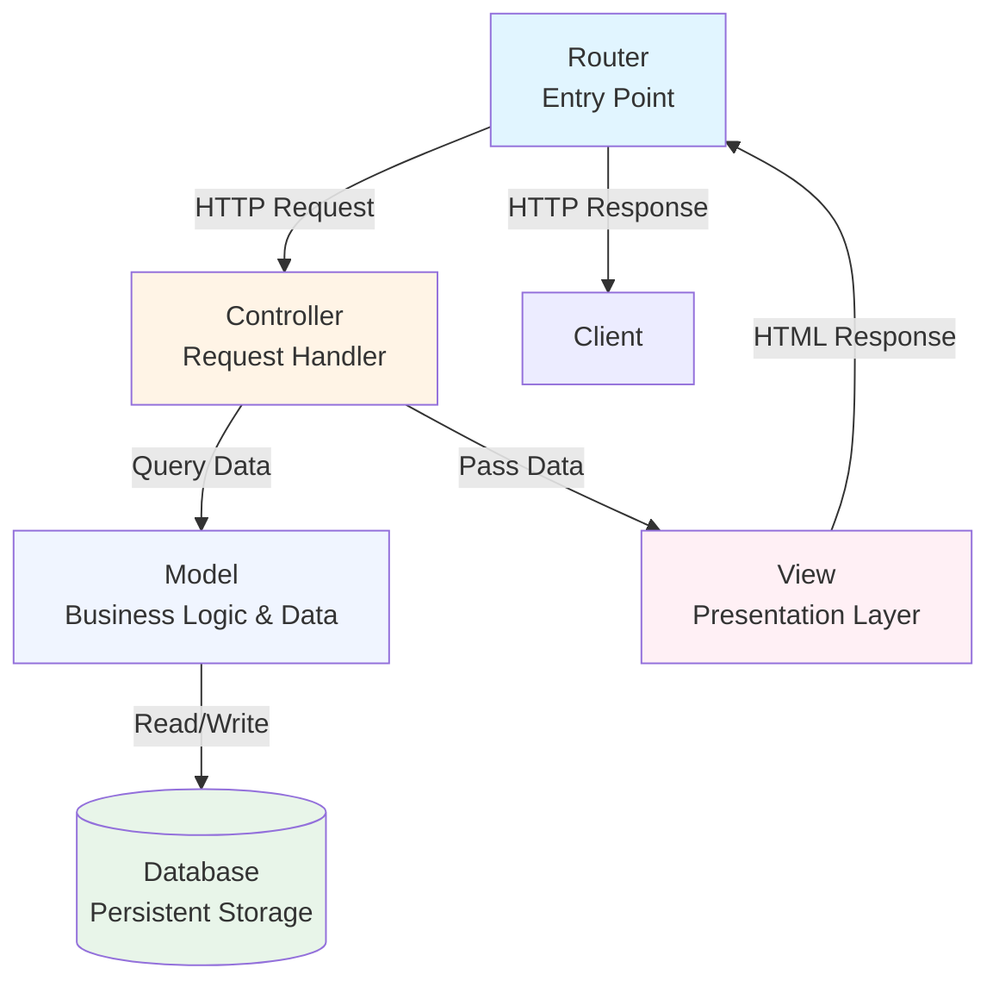

# Model-View-Controller Architecture Diagram

## Visual Overview

## Component Descriptions

### Router
- **Purpose**: Entry point for all HTTP requests
- **Responsibility**: Routes incoming requests to appropriate controllers
- **Data Flow**: Receives HTTP requests, returns HTTP responses

### Controller
- **Purpose**: Orchestrates request handling
- **Responsibility**: Coordinates between Model and View
- **Data Flow**: Receives routed requests, queries Model, passes data to View

### Model
- **Purpose**: Business logic and data access
- **Responsibility**: Manages application state and data rules
- **Data Flow**: Processes queries, reads/writes to Database

### View
- **Purpose**: Presentation layer
- **Responsibility**: Renders UI based on data provided
- **Data Flow**: Receives data from Controller, generates HTML response

### Database
- **Purpose**: Persistent storage
- **Responsibility**: Stores and retrieves application data
- **Data Flow**: Responds to Model queries with data

## Separation of Concerns

| Component | Concern | Dependencies |
|-----------|---------|--------------|
| Router | URL routing | Controller |
| Controller | Request orchestration | Model, View |
| Model | Business logic | Database |
| View | Presentation | None (passive) |
| Database | Data persistence | None |

## Data Flow Sequence

1. **Client Request** → Router receives HTTP request
2. **Routing** → Router directs to appropriate Controller
3. **Controller Action** → Controller queries Model for data
4. **Model Processing** → Model retrieves/manipulates data from Database
5. **Data Return** → Model returns data to Controller
6. **View Rendering** → Controller passes data to View for rendering
7. **Response** → View returns HTML to Router
8. **Client Response** → Router sends HTTP response to client

## Key Principles

✅ **Clear separation**: Each component has a single, well-defined responsibility
✅ **Unidirectional dependencies**: No circular dependencies between components
✅ **Testability**: Components can be tested in isolation
✅ **Flexibility**: Views and Models can vary independently
