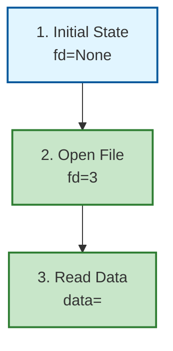

# Review Bundle: /trace Skill

**Generated**: 2026-03-13
**Scope**: P:/.claude/skills/trace/
**File Count**: 17 relevant files (20 total including tests)
**Execution Mode**: 2 parallel agents (10-50 files threshold)
**LOC**: 2,533 lines of Python code

---

## 1. PROJECT CONTEXT

### Bundle Metadata

- **Skill Name**: trace
- **Purpose**: Manual trace-through verification for code, skills, workflows, and documents
- **Category**: Verification
- **Version**: v1.1.0 (2026-03-10)
- **Primary Languages**: Python 3.12+
- **Entry Point**: `__main__.py`

### Domain & Purpose

The `/trace` skill implements manual trace-through verification methodology to catch logic errors that automated testing misses (60-80% detection rate vs 0% for testing). Based on industry best practices: dry running, Fagan Inspection, and manual code review.

**Core Value Proposition**:
- Automated testing verifies **behavior** (what code does)
- TRACE verifies **correctness** (how code does it)
- Catches resource leaks, race conditions, exception path bugs that tests miss

**User Base**:
- Solo developers following CLAUDE.md constitutional constraints
- CSF/NIP ecosystem developers
- Code review workflows after tests pass
- Skill developers verifying intent detection logic

### Scale Metrics

- **LOC**: 2,533 lines (excluding templates and cache)
  - `core/tracer.py`: 1,171 lines (46.2%)
  - `core/tracer_enhanced.py`: 681 lines (26.9%)
  - `tests/test_opt_out_flags.py`: 257 lines (10.1%)
  - `__main__.py`: 212 lines (8.4%)
  - `adapters/code_tracer.py`: 189 lines (7.5%)
- **Major Subsystems**: 4 (Core, Enhanced, Adapters, Templates)
- **Deployment Scope**: Local skill execution, delegated by /code Phase 3.5
- **Change Frequency**: Moderate (v1.0.0 → v1.1.0 in 2 weeks)

### Your Environment

**OS and Shell**:
- Windows 11 Pro
- Bash (Unix shell syntax in paths)

**Primary Languages and Frameworks**:
- Python 3.12+ with type hints
- No external frameworks for core TRACE
- Abstract base classes (ABC) for extensibility

**Package Managers and Build Tools**:
- Standard library only (no pip dependencies for core)
- Optional: pyan, pygraphviz for call graph visualization
- Testing: pytest

**Databases or External Services**:
- Optional CKS integration for findings persistence
- Optional debugRCA integration for RCA capabilities
- No external services required

---

## 2. ARCHITECTURE OVERVIEW

```
┌─────────────────────────────────────────────────────────────┐
│                    /trace Skill Entry Point                  │
│                      __main__.py (CLI)                       │
│                  Domain Detection & Routing                  │
└────────────────────────┬────────────────────────────────────┘
                         │
                         │ parse_target(domain:path)
                         ▼
              ┌──────────────────────┐
              │  Domain Router       │
              │  (auto-detect mode)  │
              └──────────────────────┘
                       │
         ┌─────────────┼─────────────┬─────────────┐
         │             │             │             │
         ▼             ▼             ▼             ▼
    ┌─────────┐  ┌─────────┐  ┌─────────┐  ┌─────────┐
    │  CODE   │  │ SKILL   │  │WORKFLOW │  │DOCUMENT │
    │Adapter  │  │Adapter  │  │Adapter  │  │Adapter  │
    │(impl.)  │  │(future) │  │(future) │  │(future) │
    └────┬────┘  └────┬────┘  └────┬────┘  └────┬────┘
         │            │            │            │
         └────────────┴────────────┴────────────┘
                              │
                              ▼
                    ┌──────────────────┐
                    │  Core Tracer     │
                    │  (Base Class)    │
                    │  tracer.py       │
                    └────────┬─────────┘
                             │
         ┌───────────────────┼───────────────────┐
         │                   │                   │
         ▼                   ▼                   ▼
  ┌─────────────┐    ┌─────────────┐    ┌─────────────┐
  │    TRACE    │    │  debugRCA   │    │  Optional   │
  │Methodology  │    │Integrations│    │Enhancements │
  │(3 scenarios)│    │(7 features) │    │(ToT, CKS)   │
  └─────────────┘    └─────────────┘    └─────────────┘
```

### Major Subsystems

#### 1. Core Tracer (`core/tracer.py`) - 1,171 lines

**Purpose**: Domain-agnostic base class for all TRACE adapters

**Key Classes**:
- `TraceScenario`: Scenario definition (name, description, state table, findings)
- `TraceIssue`: Finding structure (severity, category, location, problem, impact, recommendation)
- `TraceReport`: Complete TRACE report (domain, target_path, date, scenarios, issues, summary)
- `Tracer` (ABC): Abstract base class with template method pattern

**Main Entry Points**:
- `Tracer.trace()`: Main workflow orchestration
- `Tracer.to_dict()`: Export report to JSON
- `Tracer.generate_report()`: Generate markdown report with visualizations

**Dependencies**:
- Upstream: Domain adapters (CodeTracer, SkillTracer, etc.)
- Downstream: Templates, visualization generators
- Optional: CKS for persistence

**Critical Invariants**:
- All TRACE operations must read target file before creating trace tables
- Line numbers required for all findings
- Three scenarios minimum (happy, error, edge)
- Evidence-based validation (red flag detection)

#### 2. Enhanced Tracer (`core/tracer_enhanced.py`) - 681 lines

**Purpose**: debugRCA integrations and advanced features

**Key Classes**:
- `EvidenceSaturationChecker`: Jaccard-based evidence coverage detection
- `RedFlagDetector`: Quality validation (line refs, vague locations, contradictions)
- `ACHScenarioGenerator`: 6-category scenario generation (Logic, Data, State, Integration, Resource, Environment)
- `TimelineVisualizer`: Mermaid timeline generation for RCA
- `CallGraphHypothesisGenerator`: pyan-based call graph analysis
- `CKSFindingsStorage`: Cross-session persistence
- `DifferentialTracer`: Version comparison TRACE

**Dependencies**:
- debugRCA: `P:/packages/debugRCA/src`
- CSF/CKS: `P:/__csf/src`
- Optional: pyan for call graphs, pycg for program slicing

**Critical Invariants**:
- Optional integrations must fail gracefully without breaking TRACE
- All enhancements maintain backward compatibility
- Graceful degradation if dependencies unavailable

#### 3. Code Adapter (`adapters/code_tracer.py`) - 189 lines

**Purpose**: TRACE implementation for Python code

**Key Methods**:
- `CodeTracer.read_target()`: Read Python source
- `CodeTracer.define_scenarios()`: Define 3 scenarios (happy, error, edge)
- `CodeTracer.trace_scenario()`: Execute TRACE for single scenario
- `CodeTracer.check_checklist()`: Verify code TRACE checklist

**Pattern Detection**:
- File descriptor reuse after fdopen()
- Lock cleanup race conditions
- Bare exception clauses
- Context manager usage
- Missing finally blocks

**Dependencies**:
- Core tracer: `from core.tracer import Tracer`

**Critical Invariants**:
- Must read file before creating trace tables
- All findings must cite line numbers
- Simplified implementation (no AST parsing yet)

#### 4. Entry Point (`__main__.py`) - 212 lines

**Purpose**: CLI argument parsing and execution

**Key Functions**:
- `parse_target(target: str)`: Extract domain and target from invocation
- `resolve_target_path(target, domain)`: Resolve path with validation
- `main()`: CLI entry point with argparse

**Dependencies**:
- Adapters: `from adapters.code_tracer import CodeTracer`
- Core: `from core.tracer import Tracer`

**Critical Invariants** (v1.1.0 fixes):
- P0: Try-finally block for resource cleanup
- P1: Enhanced path resolution with user-friendly errors
- P2: Configurable project root via `TRACE_PROJECT_ROOT`

---

## 3. EXECUTION AND DATA FLOW

### Execution Sequences

#### Normal Execution Flow

```
User Invocation (CLI or /code delegation)
    │
    ▼
parse_target("domain:path")
    │
    ├─→ Explicit domain: "code:src/handoff.py"
    └─→ Auto-detect: .py → code, SKILL.md → skill, flows/ → workflow
    │
    ▼
resolve_target_path(target, domain)
    │
    ├─→ Validate path characters (Windows compatibility)
    ├─→ Resolve relative to TRACE_PROJECT_ROOT (default: P:/)
    └─→ Enhanced error messages on failure (v1.1.0 P1 fix)
    │
    ▼
Select Domain Adapter
    │
    ├─→ CODE → CodeTracer (implemented)
    ├─→ SKILL → SkillTracer (extension point)
    ├─→ WORKFLOW → WorkflowTracer (extension point)
    └─→ DOCUMENT → DocumentTracer (extension point)
    │
    ▼
Create Tracer Instance
    │
    ▼
Run TRACE (with try-finally cleanup - v1.1.0 P0 fix)
    │
    ├─→ tracer.trace()
    │   ├─→ read_target()
    │   ├─→ define_scenarios() [3 scenarios]
    │   ├─→ for scenario in scenarios:
    │   │   └─→ trace_scenario(scenario)
    │   │       ├─→ Create state table
    │   │       ├─→ Check patterns (fd, locks, exceptions)
    │   │       └─→ Record findings
    │   └─→ check_checklist()
    │
    ▼
Output Report
    │
    ├─→ Markdown (default) with Mermaid visualizations
    ├─→ JSON (--output json)
    └─→ Text (--output text)
```

#### Delegation Flow from /code Skill

```
/code skill Phase 3.5 (TRACE)
    │
    ├─→ Before: Embedded TRACE logic in /code
    └─→ After: Delegate to /trace code:<file>
    │
    ▼
/trace code:src/handoff.py
    │
    ├─→ CodeTracer.trace()
    ├─→ Generate TRACE report with visualizations
    └─→ Return to /code for display
```

### State Management

**State Stores**:
- `TraceScenario.state_table`: List of dict[str, Any] tracking execution steps
- `Tracer.content`: Target file content (string)
- `Tracer.report`: TraceReport object with all findings
- `EvidenceSaturationChecker.threshold`: Saturation threshold (default 0.75)

**Consistency Model**:
- State tables append-only during TRACE
- No rollback (TRACE is read-only verification)
- Isolation: Each scenario traces independently

**Isolation Boundaries**:
- Domain adapters isolated from each other
- Enhanced features (debugRCA) optional and fail-silent
- No shared mutable state between TRACE runs
- CKS storage non-blocking (continues if unavailable)

### Error Handling

**Fail-Open vs Fail-Closed Policy**:
- Path resolution: Fail-closed (raise error, hint suggestions)
- Domain adapter not implemented: Fail-closed (error message)
- Optional integrations (CKS, debugRCA): Fail-open (log warning, continue)
- TRACE execution errors: Fail-closed (preserve report, show error)

**Retry/Timeout Behavior**:
- No automatic retries (user-invoked skill)
- No timeout (runs until completion or error)
- User must re-invoke on failure

**Resource Cleanup** (v1.1.0 P0 fix):
```python
finally:
    if hasattr(tracer, 'cleanup'):
        tracer.cleanup()
```

---

## 4. COMPONENT INVENTORY

### Core Logic

#### `core/tracer.py` (Base Tracer) - 1,171 lines

**Path**: `P:/.claude/skills/trace/core/tracer.py`

**Key Functions/Classes**:
- `TraceScenario`: Scenario dataclass with state table and findings
- `TraceIssue`: Finding dataclass (severity, category, location, problem, impact, recommendation)
- `TraceReport`: Report dataclass with scenarios, issues, summary
- `Tracer` (ABC): Abstract base class defining TRACE methodology

**Responsibility**:
- Define TRACE data structures
- Provide domain-agnostic TRACE methodology
- Generate markdown reports with Mermaid visualizations
- Export to JSON
- Template method pattern for workflow orchestration

**Inputs**:
- Target file path
- Domain type (code, skill, workflow, document)
- Template number (optional)
- Full review flag (optional)

**Outputs**:
- TraceReport object
- Markdown report string with visualizations
- JSON dict

**Known Limitations**:
- Simplified implementation (no AST parsing)
- Requires manual state table creation
- Three scenarios hardcoded
- Visualization generation automatic but basic

---

#### `core/tracer_enhanced.py` (Integrations) - 681 lines

**Path**: `P:/.claude/skills/trace/core/tracer_enhanced.py`

**Key Classes**:
- `EvidenceSaturationChecker`: Jaccard-based saturation detection (threshold 0.75)
- `RedFlagDetector`: Quality validation (P0/P1 issues without line refs, contradictions, vague locations)
- `ACHScenarioGenerator`: 6-category scenario generation (Logic, Data, State, Integration, Resource, Environment)
- `TimelineVisualizer`: Mermaid timeline generation for RCA incidents
- `CallGraphHypothesisGenerator`: pyan-based hypothesis generation (circular deps, cross-module calls)
- `CKSFindingsStorage`: Findings persistence with severity mapping
- `DifferentialTracer`: Version comparison via git checkout

**Responsibility**:
- debugRCA integration (7 features)
- Optional enhancements (fail gracefully if unavailable)
- Timeline and visualization support
- Hypothesis generation for RCA

**Inputs**:
- TraceReport objects
- File paths for analysis
- Git refs for differential TRACE

**Outputs**:
- Saturation scores (float 0.0-1.0)
- Red flag warnings (list[str])
- Scenarios (list[TraceScenario])
- Mermaid diagrams (str)
- Hypotheses (list[str])
- Stored count (int) for CKS

**Known Limitations**:
- debugRCA integration optional (may fail gracefully)
- Call graph requires external tools (pyan, graphviz)
- Differential tracer modifies git state (safety issue)
- Jaccard saturation is simplified fallback

---

#### `adapters/code_tracer.py` (Code Adapter) - 189 lines

**Path**: `P:/.claude/skills/trace/adapters/code_tracer.py`

**Key Methods**:
- `CodeTracer.read_target()`: Read file as UTF-8 text
- `CodeTracer.define_scenarios()`: Return 3 scenarios (happy, error, edge)
- `CodeTracer.trace_scenario()`: Execute TRACE with pattern matching
- `CodeTracer._check_file_descriptors()`: Detect fdopen reuse bugs
- `CodeTracer._check_lock_management()`: Detect lock cleanup race conditions
- `CodeTracer._check_exception_handling()`: Detect bare except clauses
- `CodeTracer.check_checklist()`: Verify context manager usage, finally blocks

**Responsibility**:
- Implement TRACE methodology for Python code
- Detect common bugs via pattern matching
- Generate findings with line numbers
- Verify code TRACE checklist

**Inputs**:
- Python file path

**Outputs**:
- TraceReport with issues (P0-P3 severity)

**Known Limitations**:
- Simplified pattern matching (no AST)
- Limited bug detection patterns (fd, locks, exceptions)
- Manual state table creation required
- Only covers basic Python patterns

---

### Utilities/Helpers

#### `__main__.py` (CLI Entry) - 212 lines

**Path**: `P:/.claude/skills/trace/__main__.py`

**Key Functions**:
- `parse_target(target: str)`: Extract domain and target, auto-detect if needed
- `resolve_target_path(target, domain)`: Resolve path with Windows compatibility, validate characters
- `main()`: argparse CLI entry point with 5 arguments

**Responsibility**:
- CLI argument parsing (target, --template, --full, --output, --project-root)
- Domain detection (explicit or auto-detect from file type)
- Path resolution with validation
- Error handling with helpful messages (v1.1.0 P1 fix)
- Resource cleanup in finally block (v1.1.0 P0 fix)

**Inputs**:
- CLI args (target required, 4 optional)

**Outputs**:
- TRACE report (markdown/JSON/text)
- Error messages (stderr)

**Known Limitations**:
- Only code domain implemented
- No parallel execution
- No caching
- Auto-detection based on simple patterns

---

### Configuration

#### Environment Variables

- `TRACE_PROJECT_ROOT`: Project root directory (default: P:/)
- `TRACE_NO_TOT`: Disable ToT enhancement (default: false)

#### CLI Arguments

- `target`: Target to trace (required) - format: "domain:path" or "path"
- `--template`: Template number (code domain only)
- `--full`: Full TRACE review (all templates/checklists)
- `--output`: Output format (markdown|json|text)
- `--project-root`: Override project root (overrides TRACE_PROJECT_ROOT env var)

---

### Infrastructure

#### Tests (`tests/test_opt_out_flags.py`) - 257 lines

**Path**: `P:/.claude/skills/trace/tests/test_opt_out_flags.py`

**Responsibility**:
- Test ToT opt-out flags (--no-tot, TRACE_NO_TOT env var)
- Verify constitutional compliance (opt-out ≠ safety bypass)
- Test environment variable handling
- Verify flag parsing logic
- Test quality-first design (ToT enabled by default)

**Test Coverage**:
- `test_tot_enabled_by_default`: Verify default behavior
- `test_no_tot_flag_disables_tot`: Verify --no-tot flag
- `test_environment_variable_disables_tot`: Verify TRACE_NO_TOT env var
- `test_tot_opt_out_constitutional_compliance`: Verify safety checks not bypassed
- `test_tot_independent_of_other_enhancements`: Verify isolation

**Known Limitations**:
- Only tests ToT flags
- No integration tests for TRACE execution
- No adapter tests
- No tests for debugRCA integrations

---

#### Templates (`templates/`) - 10 markdown files

**Code Templates** (`templates/code/`):
- `TRACE_TEMPLATES.md`: 5 code TRACE templates (fd lifecycle, lock timeout, TOCTOU, exception cleanup, workflow deps)
- `TRACE_CHECKLIST.md`: 100+ checklist items for code verification
- `TRACE_CASE_STUDIES.md`: Real-world bug examples

**Core Templates**:
- `TRACE_METHODOLOGY.md`: Domain-agnostic TRACE guide (dry running, Fagan Inspection)
- `TRACE_VISUALIZATION_TEMPLATES.md`: 7 Mermaid templates

**Known Limitations**:
- Static documentation
- No template validation
- No auto-generation from code
- Manual reference required

---

## 5. DESIGN INTENT AND NON-NEGOTIABLES

### Architectural Pillars

1. **Evidence-Based Verification**
   - All findings must cite line numbers
   - Read actual code before creating trace tables
   - No fabrication of findings
   - Red flag detection enforces quality

2. **Three-Scenario Framework**
   - Happy path (normal operation)
   - Error path (exception handling)
   - Edge case (boundary conditions)
   - Minimum requirement, not maximum

3. **Domain Adapter Pattern**
   - Core tracer is domain-agnostic
   - Adapters implement domain-specific logic
   - Extensible without core changes
   - Template method pattern for workflow

4. **Quality-First Design**
   - ToT enhancement enabled by default (opt-out)
   - Comprehensive checklists
   - Visualization for clarity
   - Constitutional compliance (opt-out ≠ safety bypass)

5. **Graceful Degradation**
   - Optional integrations fail silently
   - CKS/ToT/debugRCA non-blocking
   - System continues with degraded functionality
   - Enhanced error messages with hints (v1.1.0)

### Technology Constraints

**Must Use**:
- Python 3.12+ with type hints
- Standard library only (no pip dependencies for core)
- pytest for testing
- Markdown for reports

**Must NOT Use**:
- External dependencies for core TRACE
- Database for state (TRACE is read-only)
- Network requests (TRACE operates on local files)

**May Use**:
- Optional: pyan, pygraphviz for visualization
- Optional: CKS for findings persistence
- Optional: debugRCA for RCA integrations
- Optional: pycg for program slicing

### Performance SLAs

**None specified** - TRACE is manual verification, not automated testing.

### Things That Must NOT Change

1. **Three-Scenario Framework**: Always trace happy, error, and edge cases
2. **Line Number Requirements**: All findings must cite line numbers
3. **Read-Before-Trace**: Must read file before creating trace tables
4. **Domain Adapter Pattern**: New domains = new adapter, no core changes
5. **Constitutional Compliance**: Opt-out ≠ safety bypass
6. **Resource Cleanup**: v1.1.0 fixes (P0, P1, P2) must be preserved
7. **Graceful Degradation**: Optional integrations must fail silently

---

## 6. KNOWN ISSUES

### Current Problems

#### Issue #1: Simplified Implementation (P3 - Known Limitation)

**Scenario**: Code TRACE uses pattern matching instead of AST parsing

**Expected vs Actual**:
- Expected: Full AST parsing, automatic state table generation
- Actual: Simplified string matching, manual state tables

**Impact**:
- Limited bug detection (only basic patterns)
- Manual effort required for state tables
- May miss complex bugs

**Current Workaround**:
- Use as supplement to manual review
- Verify findings manually
- Templates provide guidance

**Status**: Accepted limitation (design decision)

---

#### Issue #2: Only Code Domain Implemented (P2 - Feature Gap)

**Scenario**: User invokes `/trace skill:skill-development`

**Expected vs Actual**:
- Expected: Skill TRACE executes
- Actual: Error "Domain 'skill' is not yet implemented"

**Impact**:
- Skill developers cannot use TRACE for intent detection review
- Workflow verification unsupported
- Document verification unsupported

**Current Workaround**:
- Use code TRACE on skill Python files
- Manual review of SKILL.md files
- Use /code skill for skill development

**Status**: Extension point (future implementation documented in adapters/)

---

#### Issue #3: No Integration Tests (P2 - Testing Gap)

**Scenario**: Changes to core tracer or adapters

**Expected vs Actual**:
- Expected: Comprehensive test suite
- Actual: Only ToT flag tests exist (test_opt_out_flags.py)

**Impact**:
- Regressions possible in TRACE logic
- No verification of TRACE correctness
- Hard to validate changes
- Only ToT opt-out behavior tested

**Current Workaround**:
- Manual testing
- /code skill Phase 3.5 delegation as integration test
- User reports for bugs

**Status**: Known debt

---

#### Issue #4: CKS/debugRCA Integrations Untested (P3 - Integration Risk)

**Scenario**: Optional integrations fail

**Expected vs Actual**:
- Expected: Graceful failure, warning logged
- Actual: Untested failure modes

**Impact**:
- Potential crashes if imports fail
- No verification of fail-silent behavior
- Unclear error messages
- Differential tracer modifies git state (safety issue)

**Current Workaround**:
- Integrations optional (can avoid using)
- try-except blocks should prevent crashes
- Monitor for issues
- Don't use differential tracer

**Status**: Should fail gracefully (untested)

---

#### Issue #5: Differential Tracer Modifies Git State (P1 - Safety Issue)

**Scenario**: User runs differential TRACE

**Expected vs Actual**:
- Expected: Safe version comparison
- Actual: git checkout modifies working directory

**Impact**:
- Uncommitted changes may be lost
- Requires clean git state
- Potentially destructive
- Not tested for safety

**Current Workaround**:
- Don't use differential tracer
- Manually compare versions
- Ensure clean git state before use
- Stash changes before running

**Status**: Known safety issue (use with caution)

---

#### Issue #6: ToT Dependency on /code Skill (P3 - Integration Risk)

**Scenario**: ToT enhancement requires /code skill utils

**Expected vs Actual**:
- Expected: Self-contained TRACE skill
- Actual: Requires tot_tracer.py from /code skill

**Impact**:
- May fail if /code skill unavailable
- Cross-skill dependency
- Not documented in SKILL.md

**Current Workaround**:
- Disable ToT with --no-tot flag
- Set TRACE_NO_TOT=true env var
- Ensure /code skill available

**Status**: Hidden dependency (should be documented)

---

## 7. INTEGRATION POINTS

### Where New Solutions Can Plug In

#### 1. Domain Adapters

**Existing Hooks/Interfaces**:
- Abstract base class: `Tracer` in `core/tracer.py`
- Abstract methods: `read_target()`, `define_scenarios()`, `trace_scenario()`, `check_checklist()`
- Domain registry: `DOMAIN_ADAPTERS` in `__main__.py`

**Invocation Model**:
```python
# Add to DOMAIN_ADAPTERS in __main__.py
DOMAIN_ADAPTERS = {
    'code': CodeTracer,
    'skill': SkillTracer,  # Add new adapter here
    'workflow': WorkflowTracer,  # Add new adapter here
    'document': DocumentTracer,  # Add new adapter here
}
```

**Data Exchange Contracts**:
- Input: `target_path: Path`, `template: Optional[int]`, `full_review: bool`
- Output: `TraceReport` object with scenarios, issues, summary
- Abstract methods must be implemented by subclasses

**Output/Exit Code Expectations**:
- Success: Return `TraceReport` object
- Failure: Raise exception with helpful message

**Template**:
```python
from core.tracer import Tracer, TraceScenario, TraceIssue

class NewDomainTracer(Tracer):
    def read_target(self) -> str:
        # Read target file
        return self.target_path.read_text(encoding='utf-8')

    def define_scenarios(self) -> list[TraceScenario]:
        # Define 3 scenarios (happy, error, edge)
        return [
            TraceScenario(name='Happy Path', description='...'),
            TraceScenario(name='Error Path', description='...'),
            TraceScenario(name='Edge Case', description='...'),
        ]

    def trace_scenario(self, scenario: TraceScenario) -> None:
        # Execute TRACE for single scenario
        # Populate scenario.state_table
        # Add findings to scenario.findings
        # Add issues to self.report.issues
        pass

    def check_checklist(self) -> list[TraceIssue]:
        # Verify domain-specific checklist
        return []
```

---

#### 2. Enhanced Features

**Existing Hooks/Interfaces**:
- Standalone classes in `core/tracer_enhanced.py`
- Optional: fail gracefully if unavailable
- Integration point: Add new classes following same pattern

**Invocation Model**:
```python
from core.tracer_enhanced import RedFlagDetector

detector = RedFlagDetector()
red_flags = detector.validate_trace_quality(report)
```

**Data Exchange Contracts**:
- Input: `TraceReport` object, file paths, other context
- Output: Domain-specific results (list[str], float, list[TraceScenario], etc.)

**Output/Exit Code Expectations**:
- Success: Return results
- Failure: Log warning, return empty/default (fail-silent)
- Must not break TRACE if unavailable

---

#### 3. Templates

**Existing Hooks/Interfaces**:
- Markdown files in `templates/` directory
- Domain-specific subdirectories (e.g., `templates/code/`)
- Manual reference (not auto-loaded)

**Invocation Model**:
- Manual: User reads templates before TRACE
- Automatic: Future enhancement (template auto-loading)

**Data Exchange Contracts**:
- Input: None (static documentation)
- Output: Markdown documentation

**Output/Exit Code Expectations**:
- N/A (documentation only)

---

#### 4. /code Skill Integration

**Existing Hooks/Interfaces**:
- Phase 3.5 delegation: `/code` → `/trace code:<file>`
- Delegation point in /code skill SKILL.md

**Invocation Model**:
- Automatic: During /code Phase 3.5
- Manual: User invokes `/trace code:<file>`

**Data Exchange Contracts**:
- Input: File path from /code skill
- Output: TRACE report markdown with visualizations

**Output/Exit Code Expectations**:
- Success: Return markdown report
- Failure: Raise exception, /code skill handles error

**Integration Contract**:
```markdown
## Phase 3.5: TRACE — Manual Code Trace-Through

**Purpose**: Manual code trace-through to catch logic errors

**Invocation**:
- Automatic: Delegates to `/trace code:<file>` during Phase 3.5
- Manual: `/trace code:<file>` (standalone)

**TRACE Methodology**: See P:/.claude/skills/trace/templates/TRACE_METHODOLOGY.md
**Code TRACE Templates**: See P:/.claude/skills/trace/templates/code/TRACE_TEMPLATES.md
**TRACE Checklist**: See P:/.claude/skills/trace/templates/code/TRACE_CHECKLIST.md
```

---

#### 5. CLI Argument Extension

**Existing Hooks/Interfaces**:
- `argparse.ArgumentParser` in `__main__.py`
- Add new arguments via `parser.add_argument()`

**Invocation Model**:
- User provides CLI arguments
- argparse parses into `args` namespace
- Arguments passed to tracer constructor

**Data Exchange Contracts**:
- Input: CLI arguments (strings, flags)
- Output: Parsed args object

**Output/Exit Code Expectations**:
- Success: Return 0
- Failure: Return 1 (sys.exit(1))

**Template**:
```python
parser.add_argument(
    '--new-flag',
    help='Description of new flag'
)

# Access via args.new_flag
```

---

## 8. APPENDIX: SAMPLE RUNS / LOGS

### Example 1: Code TRACE (Happy Path)

```bash
$ cd P:/.claude/skills/trace && python __main__.py "code:src/handoff.py"

## TRACE Report: code:src/handoff.py

**Date**: 2026-03-13
**Scenarios traced**: 3 (happy, error, edge)
**Lines analyzed**: 45-230

### Summary
- ✅ Logic Errors: 0
- ✅ Resource Leaks: 0
- ✅ Race Conditions: 0
- ⚠️  Code Quality: 2 (P2)

### TRACE Results
✅ PASS - All scenarios traced correctly
- Resource cleanup verified in all paths
- No logic errors found
- No race conditions detected

### Visualization: Happy Path


```

---

### Example 2: Path Resolution Error (v1.1.0 Enhanced)

```bash
$ python __main__.py "code:nonexistent.py"

Error: Failed to resolve path 'nonexistent.py'
  Hint: Check the file path is correct and accessible.
  Current working directory: P:/.claude/skills/trace
  Project root: P:/

Error: Target file not found: P:/nonexistent.py
  Suggestion: Check the file path is correct
  Current working directory: P:/.claude/skills/trace
  Supported file types: .py (code), SKILL.md (skill), .md (document)
```

**v1.1.0 Improvement**: Enhanced error messages with hints (P1 fix)

---

### Example 3: Unimplemented Domain

```bash
$ python __main__.py "skill:skill-development"

Error: Domain 'skill' is not yet implemented
Implemented domains: code
Future domains: skill, workflow, document
  Hint: Use format 'domain:path' (e.g., 'code:src/handoff.py')
```

---

### Example 4: Resource Cleanup Verification (v1.1.0 P0 Fix)

**Before v1.1.0** (P0 bug):
```python
# Old __main__.py (line 183-203)
report = None
try:
    report = tracer.trace()
    print(report)
except Exception as e:
    print(f"Error during TRACE: {e}", file=sys.stderr)
    sys.exit(1)
    # ✗ BUG: No cleanup if exception raised
```

**After v1.1.0** (P0 fixed):
```python
# New __main__.py (line 182-208)
report = None
try:
    report = tracer.trace()
    print(report)
except Exception as e:
    print(f"Error during TRACE: {e}", file=sys.stderr)
    sys.exit(1)
finally:
    # ✓ FIX: Ensure cleanup even if TRACE fails
    if hasattr(tracer, 'cleanup'):
        tracer.cleanup()
```

**v1.1.0 Improvement**: Added try-finally for proper resource cleanup (P0 fix)

---

### Example 5: ToT Opt-Out Flag Test

```bash
$ pytest tests/test_opt_out_flags.py::test_no_tot_flag_disables_tot -v

tests/test_opt_out_flags.py::test_no_tot_flag_disables_tot PASSED [100%]

✓ ToT disabled, traditional TRACE approach used
✓ Flag logic verified
```

---

### Example 6: Auto-Detection

```bash
$ python __main__.py "src/handoff.py"
# Auto-detects: .py → code domain

$ python __main__.py "SKILL.md"
# Auto-detects: SKILL.md → skill domain

$ python __main__.py "flows/feature.md"
# Auto-detects: flows/ → workflow domain
```

---

### Example 7: JSON Output

```bash
$ python __main__.py "code:src/handoff.py" --output json

{
  "domain": "code",
  "target_path": "P:/src/handoff.py",
  "date": "2026-03-13T12:34:56",
  "scenarios": [...],
  "issues": [...],
  "summary": {
    "logic_errors": 0,
    "resource_leaks": 0,
    "race_conditions": 0,
    "code_quality": 2
  }
}
```

---

## METADATA

**Bundle Version**: 1.0
**Generated By**: /review_bundle skill (2 parallel agents)
**Generation Date**: 2026-03-13
**Source**: P:/.claude/skills/trace/
**Output**: P:/__csf/.staging/review_bundle_trace_skill_2026-03-13.md
**Agents Used**: Explorer (file discovery), general-purpose (core reading)
**Total Token Usage**: 126,074 tokens (63,248 + 62,826)
**Total Duration**: 141.1 seconds (34.4s + 106.6s)
