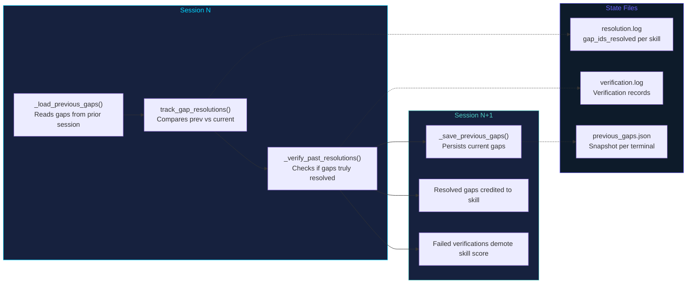
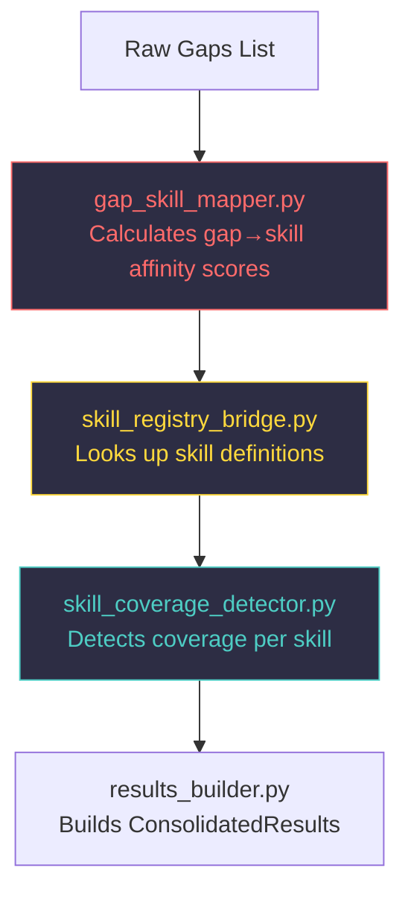
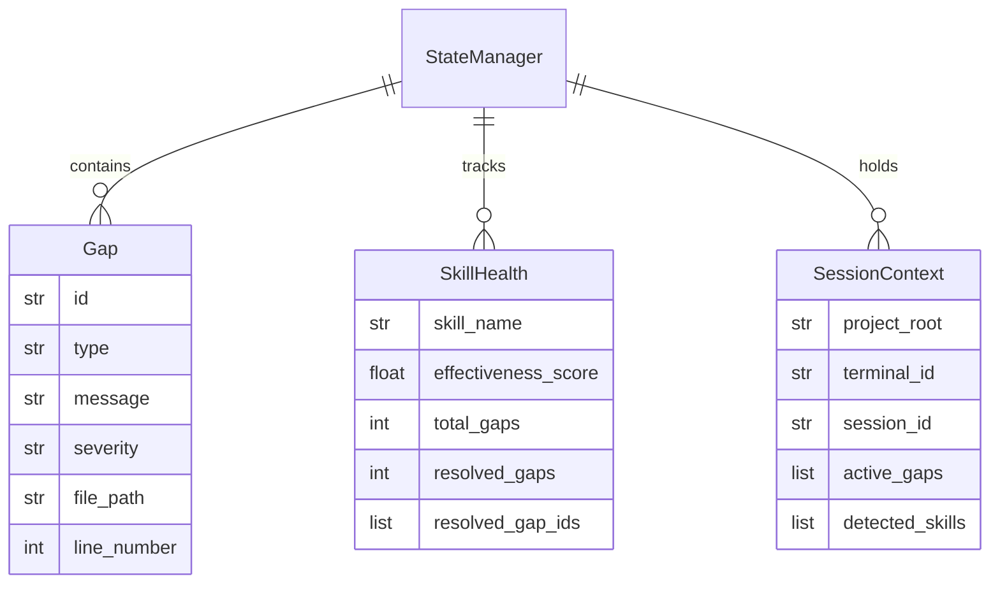

# GTO v3.5 Architecture

## Component Flow Diagram

```mermaid
flowchart TB
    subgraph INPUT["INPUT / Entry Points"]
        CLI["CLI: gto_orchestrator.py"]
        SESSION["Session Context Detection"]
        AUTO["Auto-detect target from conversation"]
    end

    subgraph LAYER1["Layer 1: Deterministic Detectors (Python)"]
        direction TB
        D1["check_test_presence<br/>test_presence_checker.py"]
        D2["check_docs_presence<br/>docs_presence_checker.py"]
        D3["check_viability<br/>viability_gate.py"]
        D4["check_dependencies<br/>dependency_checker.py"]
        D5["scan_code_markers<br/>code_marker_scanner.py"]
        D6["detect_git_context<br/>git_context.py"]
        D7["detect_session_goal<br/>session_goal_detector.py"]
        D8["detect_unfinished_business<br/>unfinished_business_detector.py"]
        D9["detect_suspicion<br/>suspicion_detector.py"]
        D10["detect_session_outcomes<br/>session_outcome_detector.py"]
        D11["check_entry_points<br/>entry_point_checker.py"]
        D12["check_skill_health<br/>skill_self_health_checker.py"]
        D13["check_gto_self_health<br/>gto_self_health_detector.py"]
        D14["check_chain_integrity<br/>chain_integrity_checker.py"]
    end

    subgraph LAYER2["Layer 2: AI Subagents"]
        direction TB
        S1["gap_finder_subagent.py<br/>Finds gaps via AI reasoning"]
        S2["health_calculator_subagent.py<br/>Calculates composite health"]
    end

    subgraph LAYER3["Layer 3: Orchestration"]
        direction TB
        ORCH["gto_orchestrator.py<br/>Coordinates all layers"]
        RESULTS["results_builder.py<br/>Consolidates detector output"]
        FORMAT["next_steps_formatter.py<br/>Formats findings as markdown"]
        SM["state_manager.py<br/>Persists session state"]
        SD["skill_coverage_detector.py<br/>Maps gaps → skills"]
        SDB["skill_registry_bridge.py<br/>Registry lookups"]
        GAP_MAP["gap_skill_mapper.py<br/>Gap → Skill affinity"]
        GAP_TRACK["gap_resolution_tracker.py<br/>Cross-session gap closure"]
    end

    subgraph OUTPUT["Output / Persistence"]
        JSON["JSON artifact<br/>~/.claude/.evidence/gto-outputs/"]
        MD["Markdown report<br/>stdout"]
    end

    INPUT --> LAYER1
    LAYER1 --> LAYER3
    LAYER2 --> LAYER3
    LAYER3 --> OUTPUT

    style LAYER1 fill:#1a1a2e,stroke:#00d4ff,color:#00d4ff
    style LAYER2 fill:#1a1a2e,stroke:#ff6b6b,color:#ff6b6b
    style LAYER3 fill:#1a1a2e,stroke:#ffd93d,color:#ffd93d
    style INPUT fill:#0d1b2a,stroke:#6c63ff,color:#6c63ff
    style OUTPUT fill:#0d1b2a,stroke:#4ecdc4,color:#4ecdc4
```

## Gap Resolution Tracker (Cross-Session Loop Closure)

## Skill Coverage Detection Flow

## State Manager Schema

## File Inventory

| Module | Layer | Responsibility |
|--------|-------|----------------|
| `gto_orchestrator.py` | 3 | Main entry, coordinates all components |
| `lib/state_manager.py` | 3 | State persistence and retrieval |
| `lib/results_builder.py` | 3 | Result consolidation |
| `lib/next_steps_formatter.py` | 3 | Markdown output formatting |
| `lib/gap_resolution_tracker.py` | 3 | Cross-session loop closure |
| `lib/skill_coverage_detector.py` | 3 | Gap→skill coverage mapping |
| `lib/skill_registry_bridge.py` | 3 | Skill registry lookups |
| `lib/gap_skill_mapper.py` | 3 | Gap→skill affinity scoring |
| `lib/viability_gate.py` | 1 | Project viability checks |
| `lib/dependency_checker.py` | 1 | Dependency health |
| `lib/test_presence_checker.py` | 1 | Missing test detection |
| `lib/docs_presence_checker.py` | 1 | Documentation gaps |
| `lib/code_marker_scanner.py` | 1 | TODO/FIXME/BUG markers |
| `lib/git_context.py` | 1 | Git context detection |
| `lib/session_goal_detector.py` | 1 | Session goal detection |
| `lib/unfinished_business_detector.py` | 1 | Unfinished work detection |
| `lib/suspicion_detector.py` | 1 | Suspicious patterns |
| `lib/session_outcome_detector.py` | 1 | Session outcome detection |
| `lib/entry_point_checker.py` | 1 | Entry point validation |
| `lib/skill_self_health_checker.py` | 1 | Skill health checks |
| `lib/gto_self_health_detector.py` | 1 | GTO internal health |
| `lib/chain_integrity_checker.py` | 1 | Chain integrity checks |
| `subagents/gap_finder_subagent.py` | 2 | AI-powered gap finding |
| `subagents/health_calculator_subagent.py` | 2 | AI health calculation |
| `hooks/checklist_gate.py` | Hooks | Pre-execution checklist |
| `hooks/gto_verify_wrapper.py` | Hooks | Verification wrapper |
| `hooks/session_summary.py` | Hooks | Session summary capture |
| `hooks/validate_format.py` | Hooks | Format validation |
| `hooks/gto_failure_capture.py` | Hooks | Failure capture |
