# SIGNATURES

## scripts/core/__init__.py

  (no Python definitions)
## scripts/core/main.py

  def get_version([]) -> ?
## scripts/core/sync.py

  def get_source_version([]) -> str
  def update_plugin_json(['version']) -> bool
  def update_readme(['version']) -> bool
  def validate_sync(['version']) -> bool
  def main([]) -> int
## scripts/create_github_repo.py

  def log_info(['msg']) -> None
  def log_success(['msg']) -> None
  def log_warning(['msg']) -> None
  def log_error(['msg']) -> None
  def run_command(['cmd', 'cwd', 'check']) -> subprocess.CompletedProcess
  def check_gh_cli([]) -> bool
  def get_github_username([]) -> str
  def create_with_gh_cli(['package_name', 'target_dir', 'description']) -> bool
  def show_manual_instructions(['package_name', 'target_dir', 'description']) -> None
  def verify_repository(['package_name']) -> bool
  def main([]) -> ?
## scripts/extract_from_monorepo.py

  def log_info(['msg']) -> None
  def log_success(['msg']) -> None
  def log_warning(['msg']) -> None
  def log_error(['msg']) -> None
  def run_command(['cmd', 'cwd', 'check']) -> subprocess.CompletedProcess
  def check_monorepo(['target_dir']) -> bool
  def get_package_path(['target_dir']) -> Optional[str]
  def extract_subtree_split(['target_dir', 'package_name']) -> bool
  def extract_fresh_init(['target_dir', 'package_name']) -> bool
  def main([]) -> ?
## scripts/finalize_github_repo.py

  def log_info(['msg']) -> None
  def log_success(['msg']) -> None
  def log_warning(['msg']) -> None
  def log_error(['msg']) -> None
  def run_command(['cmd', 'cwd', 'check']) -> subprocess.CompletedProcess
  def check_gh_cli([]) -> bool
  def get_github_username([]) -> str
  def get_package_topics(['package_type']) -> list[str]
  def enable_github_pages(['package_name', 'target_dir']) -> bool
  def create_initial_release(['package_name', 'target_dir', 'version', 'generate_notes']) -> bool
  def add_repository_topics(['package_name', 'package_type']) -> bool
  def generate_codeowners(['package_name', 'target_dir', 'username']) -> bool
  def generate_security_md(['package_name', 'target_dir']) -> bool
  def push_updates(['target_dir']) -> bool
  def verify_finalization(['package_name']) -> dict[str, bool]
  def main([]) -> ?
## scripts/scan_package_quality.py

  def log_info(['msg']) -> None
  def log_success(['msg']) -> None
  def log_warning(['msg']) -> None
  def log_error(['msg']) -> None
  def run_command(['cmd', 'cwd', 'check']) -> subprocess.CompletedProcess
  def check_tool_installed(['tool']) -> bool
  def run_bandit_scan(['target_dir', 'fix']) -> dict[str, any]
  def run_safety_scan(['target_dir']) -> dict[str, any]
  def run_pip_audit(['target_dir']) -> dict[str, any]
  def validate_badges(['target_dir']) -> dict[str, any]
  def check_code_quality_metrics(['target_dir']) -> dict[str, any]
  def generate_report(['target_dir', 'bandit_results', 'safety_results', 'audit_results', 'badge_results', 'quality_metrics']) -> dict
  def save_report(['report', 'target_dir']) -> None
  def main([]) -> ?
## scripts/upload_github_videos.py

  class GitHubVideoUploader:
    def get_page_content(['self', 'page']) -> str
    def upload_video(['self', 'page', 'video_path']) -> str
    def run(['self', 'headless']) -> ?
    def generate_readme_update(['self']) -> ?
  def main([]) -> ?
  def __init__(['self', 'repo_url', 'readme_path', 'video_dir', 'session_file']) -> ?
  def get_page_content(['self', 'page']) -> str
  def upload_video(['self', 'page', 'video_path']) -> str
  def run(['self', 'headless']) -> ?
  def generate_readme_update(['self']) -> ?
## scripts/upload_via_issue.py

  def upload_video_via_issue(['video_path', 'repo_url', 'session_file']) -> ?
  def main([]) -> ?
## scripts/upload_via_issue_simple.py

  def main([]) -> ?
## scripts/validate_banner.py

  def log_info(['msg']) -> None
  def log_success(['msg']) -> None
  def log_warning(['msg']) -> None
  def log_error(['msg']) -> None
  class BannerValidator:
    def validate_basic_properties(['self', 'banner_path']) -> dict[str, Any]
    def validate_with_vision_api(['self', 'banner_path']) -> dict[str, Any]
    def validate(['self', 'banner_path']) -> dict[str, Any]
    def print_report(['self', 'results']) -> None
  def main([]) -> ?
  def __init__(['self', 'zai_api_key']) -> ?
  def validate_basic_properties(['self', 'banner_path']) -> dict[str, Any]
  def validate_with_vision_api(['self', 'banner_path']) -> dict[str, Any]
  def validate(['self', 'banner_path']) -> dict[str, Any]
  def print_report(['self', 'results']) -> None
## scripts/validate_media_assets.py

  def log_info(['msg']) -> None
  def log_success(['msg']) -> None
  def log_warning(['msg']) -> None
  def log_error(['msg']) -> None
  def log_manual(['msg']) -> None
  class AssetType:
    def from_path(['cls', 'path']) -> AssetType
  class QualityDomain:
    def description(['self']) -> str
    def tier(['self']) -> str
  class DomainCheckResult:
    def is_complete(['self']) -> bool
  class AssetValidationResult:
    def calculate_completion(['self']) -> None
    def is_ready(['self']) -> bool
    def get_pending_domains(['self']) -> list[QualityDomain]
    def get_failed_domains(['self']) -> list[QualityDomain]
  class MediaAssetValidator:
    def validate(['self', 'asset_path', 'asset_type']) -> AssetValidationResult
  def main([]) -> ?
  def from_path(['cls', 'path']) -> AssetType
  def description(['self']) -> str
  def tier(['self']) -> str
  def is_complete(['self']) -> bool
  def calculate_completion(['self']) -> None
  def is_ready(['self']) -> bool
  def get_pending_domains(['self']) -> list[QualityDomain]
  def get_failed_domains(['self']) -> list[QualityDomain]
  def __init__(['self', 'zai_api_key', 'domains']) -> ?
  def validate(['self', 'asset_path', 'asset_type']) -> AssetValidationResult
  def _validate_domain(['self', 'asset_path', 'asset_type', 'domain']) -> DomainCheckResult
  def _validate_automated(['self', 'asset_path', 'asset_type', 'domain']) -> DomainCheckResult
  def _validate_vision(['self', 'asset_path', 'asset_type', 'domain']) -> DomainCheckResult
  def _validate_manual(['self', 'asset_path', 'asset_type', 'domain']) -> DomainCheckResult
  def _check_platform_specs(['self', 'asset_path', 'asset_type']) -> DomainCheckResult
  def _check_accessibility(['self', 'asset_path']) -> DomainCheckResult
  def _check_performance(['self', 'asset_path']) -> DomainCheckResult
  def _check_maintainability(['self', 'asset_path', 'asset_type']) -> DomainCheckResult
  def _build_vision_prompt(['self', 'asset_type', 'domain']) -> str
  def _call_vision_api(['self', 'image_data', 'prompt']) -> dict[str, Any] | None
  def _parse_vision_response(['self', 'content']) -> dict[str, Any]
  def _print_domain_result(['self', 'result']) -> None
  def _print_summary(['self', 'result']) -> None
## skills/gitready/resources/create_github_repo_api.py

  def get_github_token([]) -> str
  def create_repo(['name', 'description', 'token', 'private']) -> dict
  def check_repo_exists(['name', 'token', 'owner']) -> dict
  def main([]) -> None
## skills/gitready/resources/phases/test_validate_pointers.py

  class TestValidatePointers:
    def test_valid_pointers_in_skill_md(['self']) -> None
    def test_missing_skill_md(['self']) -> None
    def test_broken_pointer_nonexistent_file(['self']) -> None
    def test_broken_pointer_empty_file(['self']) -> None
    def test_valid_pointer(['self']) -> None
    def test_multiple_pointers_all_valid(['self']) -> None
    def test_multiple_pointers_one_broken(['self']) -> None
  def test_valid_pointers_in_skill_md(['self']) -> None
  def test_missing_skill_md(['self']) -> None
  def test_broken_pointer_nonexistent_file(['self']) -> None
  def test_broken_pointer_empty_file(['self']) -> None
  def test_valid_pointer(['self']) -> None
  def test_multiple_pointers_all_valid(['self']) -> None
  def test_multiple_pointers_one_broken(['self']) -> None
## skills/gitready/resources/phases/track_phases.py

  def find_changelog(['target_dir']) -> Path | None
  def parse_completed_phases(['changelog_path']) -> dict[str, str]
  def append_phase_completion(['changelog_path', 'phase_name', 'phase_desc', 'status']) -> None
  def get_package_type(['target_dir']) -> str | None
  def get_auto_skip_reasons(['target_dir']) -> dict[str, str]
  def print_status_report(['target_dir', 'changelog_path']) -> None
  def main([]) -> None
## skills/gitready/resources/phases/validate_pointers.py

  def sanitize_junction_name(['name']) -> str
  def validate_junction_name(['name']) -> list[str]
  def validate_pointers(['skill_md_path']) -> list[str]
  def main([]) -> int
## skills/gitready/tests/test_validate_pointers.py

  class TestValidatePointers:
    def test_valid_pointers_in_skill_md(['self']) -> None
    def test_missing_skill_md(['self']) -> None
    def test_broken_pointer_nonexistent_file(['self']) -> None
    def test_broken_pointer_empty_file(['self']) -> None
    def test_valid_pointer(['self']) -> None
    def test_multiple_pointers_all_valid(['self']) -> None
    def test_multiple_pointers_one_broken(['self']) -> None
  def test_valid_pointers_in_skill_md(['self']) -> None
  def test_missing_skill_md(['self']) -> None
  def test_broken_pointer_nonexistent_file(['self']) -> None
  def test_broken_pointer_empty_file(['self']) -> None
  def test_valid_pointer(['self']) -> None
  def test_multiple_pointers_all_valid(['self']) -> None
  def test_multiple_pointers_one_broken(['self']) -> None
## tests/__init__.py

  (no Python definitions)
## tests/test_create_github_repo.py

  class TestRunCommand:
    def test_run_command_success(['self', 'mock_run']) -> None
    def test_run_command_failure_raises(['self', 'mock_log', 'mock_run']) -> None
    def test_run_command_check_false(['self', 'mock_run']) -> None
  class TestLogging:
    def test_log_info(['self', 'mock_print']) -> None
    def test_log_success(['self', 'mock_print']) -> None
    def test_log_warning(['self', 'mock_print']) -> None
    def test_log_error(['self', 'mock_print']) -> None
  class TestCheckGhCli:
    def test_check_gh_cli_available_and_authenticated(['self', 'mock_run']) -> None
    def test_check_gh_cli_not_authenticated(['self', 'mock_run']) -> None
    def test_check_gh_cli_not_installed(['self', 'mock_run']) -> None
  class TestGetGithubUsername:
    def test_get_github_username_success(['self', 'mock_run']) -> None
    def test_get_github_username_failure(['self', 'mock_run']) -> None
    def test_get_github_username_exception(['self', 'mock_run']) -> None
  class TestCreateWithGhCli:
    def test_create_with_gh_cli_new_repo(['self', 'mock_succ', 'mock_info', 'mock_run', 'mock_check', 'mock_user', 'tmp_path']) -> None
    def test_create_with_gh_cli_repo_exists(['self', 'mock_succ', 'mock_warn', 'mock_run', 'mock_check', 'mock_user', 'tmp_path']) -> None
    def test_create_with_gh_cli_not_available(['self', 'mock_check', 'tmp_path']) -> None
    def test_create_with_gh_cli_create_fails(['self', 'mock_log', 'mock_run', 'mock_check', 'mock_user', 'tmp_path']) -> None
  class TestShowManualInstructions:
    def test_show_manual_instructions_content(['self', 'mock_log', 'mock_print', 'mock_user', 'tmp_path']) -> None
  class TestVerifyRepository:
    def test_verify_repository_success(['self', 'mock_warn', 'mock_succ', 'mock_info', 'mock_run', 'mock_check', 'mock_user']) -> None
    def test_verify_repository_no_gh(['self', 'mock_warn', 'mock_info', 'mock_check']) -> None
    def test_verify_repository_not_found(['self', 'mock_warn', 'mock_info', 'mock_run', 'mock_check', 'mock_user']) -> None
    def test_verify_repository_private(['self', 'mock_warn', 'mock_succ', 'mock_info', 'mock_run', 'mock_check', 'mock_user']) -> None
  class TestMain:
    def test_main_success(['self', 'mock_exit', 'mock_succ', 'mock_verify', 'mock_create', 'tmp_path']) -> None
    def test_main_gh_cli_fallback(['self', 'mock_exit', 'mock_info', 'mock_manual', 'mock_create', 'tmp_path']) -> None
    def test_main_not_git_repo(['self', 'mock_exit', 'mock_log', 'tmp_path']) -> None
  class TestArgparse:
    def test_positional_args(['self', 'mock_exit', 'mock_succ', 'mock_verify', 'mock_create', 'tmp_path']) -> None
    def test_default_description(['self', 'mock_exit', 'mock_succ', 'mock_verify', 'mock_create', 'tmp_path']) -> None
  def test_run_command_success(['self', 'mock_run']) -> None
  def test_run_command_failure_raises(['self', 'mock_log', 'mock_run']) -> None
  def test_run_command_check_false(['self', 'mock_run']) -> None
  def test_log_info(['self', 'mock_print']) -> None
  def test_log_success(['self', 'mock_print']) -> None
  def test_log_warning(['self', 'mock_print']) -> None
  def test_log_error(['self', 'mock_print']) -> None
  def test_check_gh_cli_available_and_authenticated(['self', 'mock_run']) -> None
  def test_check_gh_cli_not_authenticated(['self', 'mock_run']) -> None
  def test_check_gh_cli_not_installed(['self', 'mock_run']) -> None
  def test_get_github_username_success(['self', 'mock_run']) -> None
  def test_get_github_username_failure(['self', 'mock_run']) -> None
  def test_get_github_username_exception(['self', 'mock_run']) -> None
  def test_create_with_gh_cli_new_repo(['self', 'mock_succ', 'mock_info', 'mock_run', 'mock_check', 'mock_user', 'tmp_path']) -> None
  def test_create_with_gh_cli_repo_exists(['self', 'mock_succ', 'mock_warn', 'mock_run', 'mock_check', 'mock_user', 'tmp_path']) -> None
  def test_create_with_gh_cli_not_available(['self', 'mock_check', 'tmp_path']) -> None
  def test_create_with_gh_cli_create_fails(['self', 'mock_log', 'mock_run', 'mock_check', 'mock_user', 'tmp_path']) -> None
  def test_show_manual_instructions_content(['self', 'mock_log', 'mock_print', 'mock_user', 'tmp_path']) -> None
  def test_verify_repository_success(['self', 'mock_warn', 'mock_succ', 'mock_info', 'mock_run', 'mock_check', 'mock_user']) -> None
  def test_verify_repository_no_gh(['self', 'mock_warn', 'mock_info', 'mock_check']) -> None
  def test_verify_repository_not_found(['self', 'mock_warn', 'mock_info', 'mock_run', 'mock_check', 'mock_user']) -> None
  def test_verify_repository_private(['self', 'mock_warn', 'mock_succ', 'mock_info', 'mock_run', 'mock_check', 'mock_user']) -> None
  def test_main_success(['self', 'mock_exit', 'mock_succ', 'mock_verify', 'mock_create', 'tmp_path']) -> None
  def test_main_gh_cli_fallback(['self', 'mock_exit', 'mock_info', 'mock_manual', 'mock_create', 'tmp_path']) -> None
  def test_main_not_git_repo(['self', 'mock_exit', 'mock_log', 'tmp_path']) -> None
  def test_positional_args(['self', 'mock_exit', 'mock_succ', 'mock_verify', 'mock_create', 'tmp_path']) -> None
  def test_default_description(['self', 'mock_exit', 'mock_succ', 'mock_verify', 'mock_create', 'tmp_path']) -> None
  def run_side_effect(['cmd']) -> ?
  def run_side_effect(['cmd']) -> ?
  def run_side_effect(['cmd']) -> ?
## tests/test_extract_from_monorepo.py

  class TestRunCommand:
    def test_run_command_success(['self', 'mock_run']) -> None
    def test_run_command_with_cwd(['self', 'mock_run']) -> None
    def test_run_command_failure_raises(['self', 'mock_log', 'mock_run']) -> None
    def test_run_command_check_false(['self', 'mock_run']) -> None
  class TestLogging:
    def test_log_info(['self', 'mock_print']) -> None
    def test_log_success(['self', 'mock_print']) -> None
    def test_log_warning(['self', 'mock_print']) -> None
    def test_log_error(['self', 'mock_print']) -> None
  class TestCheckMonorepo:
    def test_check_monorepo_not_git_repo(['self', 'mock_run', 'tmp_path']) -> None
    def test_check_monorepo_p_git_remote(['self', 'mock_run', 'tmp_path']) -> None
    def test_check_monorepo_monorepo_in_remote(['self', 'mock_run', 'tmp_path']) -> None
    def test_check_monorepo_packages_directory(['self', 'mock_run', 'tmp_path']) -> None
    def test_check_monorepo_windows_packages_path(['self', 'mock_run', 'tmp_path']) -> None
    def test_check_monorepo_standalone_repo(['self', 'mock_run', 'tmp_path']) -> None
  class TestGetPackagePath:
    def test_get_package_path_success(['self', 'mock_run', 'tmp_path']) -> None
    def test_get_package_path_git_failure(['self', 'mock_log', 'mock_run', 'tmp_path']) -> None
  class TestExtractFreshInit:
    def test_extract_fresh_init_new_repo(['self', 'mock_warn', 'mock_succ', 'mock_info', 'mock_run', 'tmp_path']) -> None
    def test_extract_fresh_init_backups_existing_git(['self', 'mock_warn', 'mock_run', 'tmp_path', 'tmp_path_factory']) -> None
    def test_extract_fresh_init_empty_repo(['self', 'mock_warn', 'mock_succ', 'mock_info', 'mock_run', 'tmp_path']) -> None
  class TestExtractSubtreeSplit:
    def test_extract_subtree_split_success(['self', 'mock_succ', 'mock_info', 'mock_run', 'mock_pkg_path', 'tmp_path']) -> None
    def test_extract_subtree_split_no_package_path(['self', 'mock_log', 'mock_run', 'mock_pkg_path', 'tmp_path']) -> None
    def test_extract_subtree_split_no_subtree(['self', 'mock_log', 'mock_run', 'mock_pkg_path', 'tmp_path']) -> None
    def test_extract_subtree_split_fails(['self', 'mock_warn', 'mock_log', 'mock_run', 'mock_pkg_path', 'tmp_path']) -> None
  class TestMain:
    def test_main_fresh_init_flag(['self', 'mock_succ', 'mock_info', 'mock_exit', 'mock_extract', 'mock_check', 'tmp_path']) -> None
    def test_main_standalone_no_extraction(['self', 'mock_succ', 'mock_info', 'mock_exit', 'mock_run', 'mock_check', 'tmp_path']) -> None
    def test_main_target_not_exists(['self', 'mock_exit', 'mock_log']) -> None
    def test_main_extraction_failure(['self', 'mock_exit', 'mock_log', 'mock_extract', 'mock_check', 'tmp_path']) -> None
  class TestArgparse:
    def test_positional_args(['self', 'mock_exit', 'mock_extract', 'mock_check', 'tmp_path']) -> None
    def test_fresh_init_default_false(['self', 'mock_warn', 'mock_exit', 'mock_fresh', 'mock_subtree', 'mock_check', 'tmp_path']) -> None
  def test_run_command_success(['self', 'mock_run']) -> None
  def test_run_command_with_cwd(['self', 'mock_run']) -> None
  def test_run_command_failure_raises(['self', 'mock_log', 'mock_run']) -> None
  def test_run_command_check_false(['self', 'mock_run']) -> None
  def test_log_info(['self', 'mock_print']) -> None
  def test_log_success(['self', 'mock_print']) -> None
  def test_log_warning(['self', 'mock_print']) -> None
  def test_log_error(['self', 'mock_print']) -> None
  def test_check_monorepo_not_git_repo(['self', 'mock_run', 'tmp_path']) -> None
  def test_check_monorepo_p_git_remote(['self', 'mock_run', 'tmp_path']) -> None
  def test_check_monorepo_monorepo_in_remote(['self', 'mock_run', 'tmp_path']) -> None
  def test_check_monorepo_packages_directory(['self', 'mock_run', 'tmp_path']) -> None
  def test_check_monorepo_windows_packages_path(['self', 'mock_run', 'tmp_path']) -> None
  def test_check_monorepo_standalone_repo(['self', 'mock_run', 'tmp_path']) -> None
  def test_get_package_path_success(['self', 'mock_run', 'tmp_path']) -> None
  def test_get_package_path_git_failure(['self', 'mock_log', 'mock_run', 'tmp_path']) -> None
  def test_extract_fresh_init_new_repo(['self', 'mock_warn', 'mock_succ', 'mock_info', 'mock_run', 'tmp_path']) -> None
  def test_extract_fresh_init_backups_existing_git(['self', 'mock_warn', 'mock_run', 'tmp_path', 'tmp_path_factory']) -> None
  def test_extract_fresh_init_empty_repo(['self', 'mock_warn', 'mock_succ', 'mock_info', 'mock_run', 'tmp_path']) -> None
  def test_extract_subtree_split_success(['self', 'mock_succ', 'mock_info', 'mock_run', 'mock_pkg_path', 'tmp_path']) -> None
  def test_extract_subtree_split_no_package_path(['self', 'mock_log', 'mock_run', 'mock_pkg_path', 'tmp_path']) -> None
  def test_extract_subtree_split_no_subtree(['self', 'mock_log', 'mock_run', 'mock_pkg_path', 'tmp_path']) -> None
  def test_extract_subtree_split_fails(['self', 'mock_warn', 'mock_log', 'mock_run', 'mock_pkg_path', 'tmp_path']) -> None
  def test_main_fresh_init_flag(['self', 'mock_succ', 'mock_info', 'mock_exit', 'mock_extract', 'mock_check', 'tmp_path']) -> None
  def test_main_standalone_no_extraction(['self', 'mock_succ', 'mock_info', 'mock_exit', 'mock_run', 'mock_check', 'tmp_path']) -> None
  def test_main_target_not_exists(['self', 'mock_exit', 'mock_log']) -> None
  def test_main_extraction_failure(['self', 'mock_exit', 'mock_log', 'mock_extract', 'mock_check', 'tmp_path']) -> None
  def test_positional_args(['self', 'mock_exit', 'mock_extract', 'mock_check', 'tmp_path']) -> None
  def test_fresh_init_default_false(['self', 'mock_warn', 'mock_exit', 'mock_fresh', 'mock_subtree', 'mock_check', 'tmp_path']) -> None
  def run_side_effect(['cmd']) -> ?
  def run_side_effect(['cmd']) -> ?
  def run_side_effect(['cmd']) -> ?
  def run_side_effect(['cmd']) -> ?
  def run_side_effect(['cmd']) -> ?
## tests/test_finalize_github_repo.py

  class TestColors:
    def test_colors_defined(['self']) -> ?
  class TestLoggingFunctions:
    def test_log_info(['self', 'capsys']) -> ?
    def test_log_success(['self', 'capsys']) -> ?
    def test_log_warning(['self', 'capsys']) -> ?
    def test_log_error(['self', 'capsys']) -> ?
  class TestRunCommand:
    def test_run_command_success(['self']) -> ?
    def test_run_command_failure(['self']) -> ?
  class TestCheckGhCli:
    def test_check_gh_cli_available(['self', 'mock_run']) -> ?
    def test_check_gh_cli_not_available(['self', 'mock_run']) -> ?
  class TestGetGithubUsername:
    def test_get_username_success(['self', 'mock_run']) -> ?
    def test_get_username_failure(['self', 'mock_run']) -> ?
  class TestGetPackageTopics:
    def test_plugin_topics(['self']) -> ?
    def test_skill_topics(['self']) -> ?
    def test_mcp_topics(['self']) -> ?
    def test_library_topics(['self']) -> ?
  class TestGenerateCodeowners:
    def test_generate_codeowners_new_file(['self', 'tmp_path']) -> ?
    def test_generate_codeowners_existing_file(['self', 'tmp_path']) -> ?
    def test_generate_codeowners_default_username(['self', 'tmp_path']) -> ?
  class TestGenerateSecurityMd:
    def test_generate_security_md_new_file(['self', 'tmp_path']) -> ?
    def test_generate_security_md_existing_file(['self', 'tmp_path']) -> ?
  class TestEnableGithubPages:
    def test_enable_pages_success(['self', 'mock_run', 'mock_check', 'tmp_path']) -> ?
    def test_enable_pages_no_gh(['self', 'mock_check']) -> ?
  class TestCreateInitialRelease:
    def test_create_release_success(['self', 'mock_run', 'mock_check']) -> ?
    def test_create_release_exists(['self', 'mock_run', 'mock_check', 'tmp_path']) -> ?
  class TestAddRepositoryTopics:
    def test_add_topics_success(['self', 'mock_run', 'mock_check']) -> ?
    def test_add_topics_no_gh(['self', 'mock_check']) -> ?
  class TestVerifyFinalization:
    def test_verify_all_success(['self', 'mock_run', 'mock_check']) -> ?
    def test_verify_no_gh(['self', 'mock_check']) -> ?
  class TestMain:
    def test_main_verify_mode(['self']) -> ?
    def test_main_full_flow(['self', 'mock_check']) -> ?
    def test_main_not_git_repo(['self']) -> ?
  def test_colors_defined(['self']) -> ?
  def test_log_info(['self', 'capsys']) -> ?
  def test_log_success(['self', 'capsys']) -> ?
  def test_log_warning(['self', 'capsys']) -> ?
  def test_log_error(['self', 'capsys']) -> ?
  def test_run_command_success(['self']) -> ?
  def test_run_command_failure(['self']) -> ?
  def test_check_gh_cli_available(['self', 'mock_run']) -> ?
  def test_check_gh_cli_not_available(['self', 'mock_run']) -> ?
  def test_get_username_success(['self', 'mock_run']) -> ?
  def test_get_username_failure(['self', 'mock_run']) -> ?
  def test_plugin_topics(['self']) -> ?
  def test_skill_topics(['self']) -> ?
  def test_mcp_topics(['self']) -> ?
  def test_library_topics(['self']) -> ?
  def test_generate_codeowners_new_file(['self', 'tmp_path']) -> ?
  def test_generate_codeowners_existing_file(['self', 'tmp_path']) -> ?
  def test_generate_codeowners_default_username(['self', 'tmp_path']) -> ?
  def test_generate_security_md_new_file(['self', 'tmp_path']) -> ?
  def test_generate_security_md_existing_file(['self', 'tmp_path']) -> ?
  def test_enable_pages_success(['self', 'mock_run', 'mock_check', 'tmp_path']) -> ?
  def test_enable_pages_no_gh(['self', 'mock_check']) -> ?
  def test_create_release_success(['self', 'mock_run', 'mock_check']) -> ?
  def test_create_release_exists(['self', 'mock_run', 'mock_check', 'tmp_path']) -> ?
  def test_add_topics_success(['self', 'mock_run', 'mock_check']) -> ?
  def test_add_topics_no_gh(['self', 'mock_check']) -> ?
  def test_verify_all_success(['self', 'mock_run', 'mock_check']) -> ?
  def test_verify_no_gh(['self', 'mock_check']) -> ?
  def test_main_verify_mode(['self']) -> ?
  def test_main_full_flow(['self', 'mock_check']) -> ?
  def test_main_not_git_repo(['self']) -> ?
  def side_effect([]) -> ?
  def side_effect([]) -> ?
## tests/test_main.py

  def test_get_version([]) -> ?
  def test_version_format([]) -> ?
## tests/test_mermaid_compat.py

  def _read_text(['path']) -> str
  def test_readme_mermaid_uses_github_compatible_subset([]) -> ?
  def test_diagram_sources_use_github_compatible_subset([]) -> ?
  def test_mermaid_init_directives_use_standard_closing_marker([]) -> ?
## tests/test_scan_package_quality.py

  class TestColors:
    def test_colors_defined(['self']) -> ?
  class TestLoggingFunctions:
    def test_log_info(['self', 'capsys']) -> ?
    def test_log_success(['self', 'capsys']) -> ?
    def test_log_warning(['self', 'capsys']) -> ?
    def test_log_error(['self', 'capsys']) -> ?
  class TestRunCommand:
    def test_run_command_success(['self']) -> ?
    def test_run_command_failure(['self']) -> ?
  class TestCheckToolInstalled:
    def test_check_tool_installed_true(['self', 'mock_run']) -> ?
    def test_check_tool_installed_false(['self', 'mock_run']) -> ?
  class TestRunBanditScan:
    def test_bandit_not_installed(['self', 'mock_check']) -> ?
    def test_bandit_no_issues(['self', 'mock_run', 'mock_check', 'tmp_path']) -> ?
    def test_bandit_with_issues(['self', 'mock_run', 'mock_check']) -> ?
    def test_bandit_no_python_files(['self', 'mock_run', 'mock_check', 'tmp_path']) -> ?
  class TestRunSafetyScan:
    def test_safety_not_installed(['self', 'mock_check']) -> ?
    def test_safety_no_vulnerabilities(['self', 'mock_run', 'mock_check', 'tmp_path']) -> ?
    def test_safety_with_vulnerabilities(['self', 'mock_run', 'mock_check', 'tmp_path']) -> ?
  class TestRunPipAudit:
    def test_pip_audit_not_installed(['self', 'mock_check']) -> ?
    def test_pip_audit_no_vulnerabilities(['self', 'mock_run', 'mock_check']) -> ?
    def test_pip_audit_with_vulnerabilities(['self', 'mock_run', 'mock_check']) -> ?
  class TestValidateBadges:
    def test_validate_badges_with_badges(['self', 'tmp_path']) -> ?
    def test_validate_badges_no_readme(['self', 'tmp_path']) -> ?
    def test_validate_badges_missing_workflow(['self', 'tmp_path']) -> ?
  class TestCheckCodeQualityMetrics:
    def test_quality_metrics_with_files(['self', 'tmp_path']) -> ?
    def test_quality_metrics_no_files(['self', 'tmp_path']) -> ?
  class TestGenerateReport:
    def test_generate_report(['self', 'tmp_path']) -> ?
  class TestSaveReport:
    def test_save_report(['self', 'tmp_path']) -> ?
  class TestMain:
    def test_main_success(['self']) -> ?
    def test_main_with_issues(['self']) -> ?
    def test_main_invalid_directory(['self']) -> ?
  def test_colors_defined(['self']) -> ?
  def test_log_info(['self', 'capsys']) -> ?
  def test_log_success(['self', 'capsys']) -> ?
  def test_log_warning(['self', 'capsys']) -> ?
  def test_log_error(['self', 'capsys']) -> ?
  def test_run_command_success(['self']) -> ?
  def test_run_command_failure(['self']) -> ?
  def test_check_tool_installed_true(['self', 'mock_run']) -> ?
  def test_check_tool_installed_false(['self', 'mock_run']) -> ?
  def test_bandit_not_installed(['self', 'mock_check']) -> ?
  def test_bandit_no_issues(['self', 'mock_run', 'mock_check', 'tmp_path']) -> ?
  def test_bandit_with_issues(['self', 'mock_run', 'mock_check']) -> ?
  def test_bandit_no_python_files(['self', 'mock_run', 'mock_check', 'tmp_path']) -> ?
  def test_safety_not_installed(['self', 'mock_check']) -> ?
  def test_safety_no_vulnerabilities(['self', 'mock_run', 'mock_check', 'tmp_path']) -> ?
  def test_safety_with_vulnerabilities(['self', 'mock_run', 'mock_check', 'tmp_path']) -> ?
  def test_pip_audit_not_installed(['self', 'mock_check']) -> ?
  def test_pip_audit_no_vulnerabilities(['self', 'mock_run', 'mock_check']) -> ?
  def test_pip_audit_with_vulnerabilities(['self', 'mock_run', 'mock_check']) -> ?
  def test_validate_badges_with_badges(['self', 'tmp_path']) -> ?
  def test_validate_badges_no_readme(['self', 'tmp_path']) -> ?
  def test_validate_badges_missing_workflow(['self', 'tmp_path']) -> ?
  def test_quality_metrics_with_files(['self', 'tmp_path']) -> ?
  def test_quality_metrics_no_files(['self', 'tmp_path']) -> ?
  def test_generate_report(['self', 'tmp_path']) -> ?
  def test_save_report(['self', 'tmp_path']) -> ?
  def test_main_success(['self']) -> ?
  def test_main_with_issues(['self']) -> ?
  def test_main_invalid_directory(['self']) -> ?


# APPENDIX: TOP-LEVEL MARKDOWN


## AGENTS.md

# AGENTS.md - gitready Plugin

**For AI coding assistants (Claude, Copilot, etc.) working on this codebase.**

---

## Role & Persona

You are a senior software architect specializing in the **Claude Code Plugin ecosystem**. Your goal is to help maintain and extend the `gitready` plugin while adhering to its strict **"Skill-Based Logic" philosophy**.

---

## Critical Plugin Constraints

### Structure Philosophy

**ALL logic must reside in specialized directories:**
- `scripts/core/` — Python code (no `src/` directory)
- `hooks/` — Hook configuration (hooks.json)
- `skills/` — Auto-activating skills (SKILL.md files)
- `commands/` — Slash commands (.md files)

**DO NOT create:**
- ❌ `src/` directory (Python libraries use `src/`, plugins do NOT)
- ❌ `pyproject.toml` (plugins are not pip packages)
- ❌ Standard Python package structure

### Hooks: No Stderr Policy

**CRITICAL**: Claude Code treats ALL stderr output from hooks as fatal errors.

**Hook rules:**
- NEVER write to stderr in hook scripts
- Redirect errors to stdout or log files
- Use `print()` for output (stdout only)
- Use `sys.exit(0)` for success (not return codes > 0)

**Why this matters**: If your hook writes anything to stderr, the user's Claude Code session will crash with "hook error."

### Portability: CLAUDE_PLUGIN_ROOT

**All internal scripts MUST use `${CLAUDE_PLUGIN_ROOT}` environment variable.**

**Wrong:**
```python
path = "P:\\\\\\packages/gitready/scripts/core/main.py"  # Hardcoded path
```

**Right:**
```python
import os
from pathlib import Path

plugin_root = Path(os.environ.get('CLAUDE_PLUGIN_ROOT'))
path = plugin_root / "core" / "main.py"
```

**Why**: Plugins can be installed in different locations (marketplace, local development, GitHub). Hardcoded paths break portability.

---

## Setup & Dev Commands

### Testing

```bash
# Run test suite
pytest tests/test_main.py -v

# Run with coverage
pytest tests/ --cov=core --cov-report=term-mvv
```

### Version Synchronization

```bash
# Sync version across all artifacts
python scripts/core/sync.py
```

**What this does:**
- Reads version from `scripts/core/__init__.py` (source of truth)
- Updates `.claude-plugin/plugin.json`
- Updates `README.md` version references
- Validates all changes

**When to run:** After ANY version bump in `scripts/core/__init__.py`

### Plugin Validation

```bash
# Test plugin locally (requires Claude Code CLI)
claude --plugin-dir .

# Or with plugin command
/plugin P:\\\\\\packages/gitready
```

---

## Common Workflows

### Adding a New Skill

1. Create `skills/<skill-name>/SKILL.md`
2. Follow Claude Code skill format (imperative language, verification steps)
3. Test by invoking the skill
4. Update README if skill is user-facing

### Updating Hooks

1. Edit `hooks/hooks.json`
2. Ensure matchers are **specific enough** to avoid trigger bloat
3. **CRITICAL**: Never write to stderr in hook commands
4. Test hook triggers

### Version Bumps

1. Update `scripts/core/__init__.py`: `__version__ = "5.6.0"`
2. Run `python scripts/core/sync.py` (updates everything else)
3. Commit changes

### NotebookLM Media Generation

```bash
# Update NotebookLM sources with latest code
nlm source add --file scripts/core/main.py \
               --file .claude-plugin/plugin.json \
               --file README.md \
               --file AGENTS.md \
               --file P:\\\\\\.claude/skills/package/SKILL.md

# Regenerate explainer video
nlm video create --notebook "github-ready-docs" --output assets/explainer.mp4

# Regenerate presentation slides
nlm pdf create --notebook "github-ready-docs" --output assets/slides.pdf
```

---

## Verification Guidelines

Before finishing ANY task, you MUST:

### 1. Version Consistency

- [ ] `scripts/core/__init__.py` version matches `.claude-plugin/plugin.json`
- [ ] `README.md` version references match `scripts/core/__init__.py`
- [ ] Run `python scripts/core/sync.py` if versions are out of sync

### 2. Diagram Validity

- [ ] No GitHub-incompatible Mermaid patterns: `System_Bnd`, `Container_Bnd`, `Component_Bnd`, `UpdateLayoutConfig`, `include:`, or `%%%`
- [ ] `README.md` uses a GitHub-safe Mermaid flowchart for the primary architecture view, not Mermaid C4 blocks
- [ ] Test Mermaid diagrams render with `mmdc` if it is installed

### 3. README Links

- [ ] All NotebookLM asset links are valid (check files exist)
- [ ] Interactive HTML diagram links work (`docs/*.html`)
- [ ] No broken image links

### 4. Hook Compliance

- [ ] Hook commands do NOT write to stderr
- [ ] All paths use `${CLAUDE_PLUGIN_ROOT}`
- [ ] Hook matchers are specific (not overly broad `. *` patterns)

### 5. Code Quality

- [ ] `ruff check` passes (no linting errors)
- [ ] `pytest tests/` passes (all tests green)
- [ ] Type hints included on all public functions

---

## Architecture Overview

### "Skill-Based Logic" Philosophy

**Core principle**: The plugin metadata is minimal. Actual package creation logic lives in the `/package` skill.

**Why this design:**
- Plugins provide metadata and trigger configuration
- Skills contain the workflow logic
- Separation of concerns (discovery vs. execution)

### Component Structure

```
gitready/
├── .claude-plugin/          # Plugin metadata
│   └── plugin.json          # Name, description, author
├── scripts/core/                    # Python code (NOT src/)
│   ├── __init__.py          # Version definition
│   ├── main.py              # Version retrieval API
│   └── sync.py              # Version synchronization
├── hooks/                   # Hook configuration
│   └── hooks.json           # Trigger patterns
├── skills/                  # Optional auto-activating skills
├── commands/                # Optional slash commands
├── tests/                   # Test suite
├── docs/                    # Documentation & diagrams
│   └── diagrams/           # C4 architecture diagrams
└── assets/                  # Generated media assets
    ├── infographics/
    ├── videos/
    └── slides/
```

---

## Non-Negotiable Design Principles

1. **Plugin structure is mandatory** — `.claude-plugin/`, `scripts/core/`, `hooks/` directories required
2. **Semantic versioning required** — Version must be MAJOR.MINOR.PATCH format
3. **No stderr in hooks** — Claude Code treats stderr as fatal errors
4. **CLAUDE_PLUGIN_ROOT usage** — All paths must use this env var for portability
5. **Three deployment models** — SKILLS (junction), HOOKS (symlinks), PLUGINS (/plugin command)

---

## Known Issues & Gotchas

### Issue: Version Mismatch

**Symptom**: README.md says v5.5.5, but `scripts/core/__init__.py` says v5.5.0

**Fix**: Run `python scripts/core/sync.py` to synchronize versions

**Prevention**: Always update `scripts/core/__init__.py` first, then run sync script

### Issue: Author Fields are Placeholders

**Symptom**: plugin.json contains "Your Name" and "your.email@example.com"

**Fix**: Manually edit `.claude-plugin/plugin.json` with real author info

**Note**: This is a one-time setup step, not automated

### Issue: Hooks Write to Stderr

**Symptom**: Claude Code session crashes with "hook error"

**Fix**: Remove ALL stderr writes from hook commands:
- Change `print("error", file=sys.stderr)` → `print("error")` (stdout)
- Change `sys.stderr.write()` → `sys.stdout.write()`
- Use `logging` with stream configuration if needed

### Issue: Hardcoded Paths Break Portability

**Symptom**: Plugin works on your machine but fails for others

**Fix**: Replace hardcoded paths with `${CLAUDE_PLUGIN_ROOT}`:
```python
import os
plugin_root = Path(os.environ.get('CLAUDE_PLUGIN_ROOT', '.'))
config_path = plugin_root / ".claude-plugin" / "plugin.json"
```

---

## Testing Strategy

### Unit Tests (tests/test_main.py)

- `test_get_version()` — Verify version retrieval works
- `test_version_format()` — Validate semantic versioning format

### Manual Verification

After any code changes:

```bash
# 1. Check version sync
python scripts/core/sync.py

# 2. Run linter
ruff check scripts/core/

# 3. Run tests
pytest tests/ -v

# 4. Verify plugin structure
ls -la .claude-plugin/ scripts/core/ hooks/
```

---

## Integration Points

### NotebookLM Integration

**Purpose**: Generate media assets (videos, diagrams, slides) for portfolio presentation

**Workflow:**
1. Upload source files: `nlm source add --file <path>`
2. Generate assets: `nlm video create`, `nlm pdf create`
3. Download artifacts: `nlm download`

**Key sources to upload:**
- `scripts/core/__init__.py` — Version definition
- `scripts/core/main.py` — Core logic
- `.claude-plugin/plugin.json` — Plugin metadata
- `README.md` — User documentation
- `AGENTS.md` — This file (AI agent instructions)
- `P:\\\\\\.claude/skills/package/SKILL.md` — Skill logic (IMPORTANT)

**Note**: The SKILL.md file was previously NOT uploaded to NotebookLM (oversight). Include it for better context in generated media.

### /package Skill

**Location**: `P:\\\\\\.claude/skills/package/SKILL.md`

**Relationship**: This plugin provides metadata for the `/package` skill

**Contract:**
- Plugin provides version, hooks, and structure
- `/package` skill contains workflow logic
- Skill uses plugin metadata during package creation

---

## Troubleshooting

### "Hook error" in Claude Code

**Cause**: Hook wrote to stderr

**Diagnosis**:
```bash
# Check hook script for stderr writes
grep -r "stderr" hooks/
grep -r "sys.stderr" scripts/core/
```

**Fix**: Replace all stderr writes with stdout

### Version mismatch after sync

**Cause**: Multiple version patterns in README not updated

**Diagnosis**:
```bash
grep -r "5\.[0-9]\.[0-9]" README.md
```

**Fix**: Run `python scripts/core/sync.py` again, or manually update remaining references

### Plugin not discovered by Claude Code

**Cause**: `.claude-plugin/plugin.json` is malformed or missing required fields

**Diagnosis**:
```bash
# Validate plugin.json syntax
python -m json.tool .claude-plugin/plugin.json
```

**Fix**: Ensure plugin.json has required fields: `name`, `description`, `author`

---

## Advanced Topics

### Adding MCP Server Integration

**When**: Plugin needs Model Context Protocol server

**Structure:**
- Add `.mcp.json` configuration file (NOT `mcp/` directory)
- Define server command and args in `.mcp.json`
- Update README with MCP usage instructions

**Example .mcp.json:**
```json
{
  "gitready": {
    "command": "python",
    "args": ["-m", "core.mcp.server"]
  }
}
```

### Creating Subagent Commands

**When**: Plugin needs AI-powered commands

**Structure:**
- Add `agents/` directory
- Create agent definitions (`.md` files)
- Define tool permissions in agent files

**Note**: Subagents are advanced — only create if simple skills/commands are insufficient

---

## Contributing Guidelines

### Pull Requests

Before submitting PR:

1. **Run version sync**: `python scripts/core/sync.py`
2. **Run tests**: `pytest tests/ -v`
3. **Run linter**: `ruff check scripts/core/`
4. **Update documentation**: README.md, AGENTS.md if needed
5. **Verify hooks**: Ensure no stderr writes

### Code Style

- Follow PEP 8 for Python code
- Use type hints on all public functions
- Add docstrings to modules and public functions
- Maximum line length: 100 characters (enforced by ruff)

### Testing

- Write tests for new functionality
- Maintain >80% test coverage
- Use descriptive test names (test_<function>_<scenario>)

---

## Resources

- **Plugin Development**: `P:\\\\\\.claude/skills/plugin-development`
- **Hook Development**: `P:\\\\\\.claude/skills/hook-development`
- **MCP Integration**: `P:\\\\\\.claude/skills/mcp-integration`
- **Claude Code Docs**: https://docs.anthropic.com

---

**Last Updated**: 2026-03-11
**Plugin Version**: 5.5.5
**Maintained By**: Your Name <your.email@example.com>


## README.md

# gitready

[](https://github.com/EndUser123/gitready)
[](LICENSE)
[](https://github.com/EndUser123/gitready)
[](https://github.com/EndUser123/gitready/actions)

> Universal Package Creator and Portfolio Polisher v5.15.2

Create GitHub-ready Python libraries, Claude skills, and Claude Code plugins with badges, CI/CD workflows, coverage metrics, media artifacts, and automated GitHub publication.


## Quick Start

```bash
# Create a new package (auto-detects type)
/gitready mylib

# Polish existing repository
/gitready --target P:\\\\\\packages/existing-repo

# Preview what will happen
/gitready --dry-run myproject
```

## See The Transformation

gitready transforms a rough project into a polished GitHub-ready package:

| Aspect | Before | After |
|--------|--------|-------|
| **Documentation** | Missing or minimal README | Full README with badges, install guide, usage |
| **CI/CD** | No workflows | GitHub Actions with pytest, coverage, linting |
| **Versioning** | Manual | Automated CHANGELOG generation |
| **Badges** | None | Version, License, Tests, Coverage badges |
| **Media** | None | Architecture diagram, explainer video, slides |
| **Publication** | Local only | Automated GitHub repo creation and release |

**Before:**

```
my-package/
  my_module.py
  README.md (minimal)
```

**After:**

```
my-package/
  my_module.py
  README.md (polished with badges + media)
  CHANGELOG.md (auto-generated)
  CONTRIBUTING.md
  LICENSE
  .github/
    workflows/
      ci.yml
      release.yml
  assets/
    videos/
    slides/
    banners/
  docs/
    video.html (GitHub Pages player)
```


## Explainer Video

[](https://enduser123.github.io/gitready/docs/video.html)

> **[🎬 Watch the explainer in the browser](https://enduser123.github.io/gitready/docs/video.html)**
> **[⬇️ Download the MP4 directly](https://github.com/EndUser123/gitready/releases/download/media/github_ready_explainer_pbs.mp4)**
> *Browser playback requires GitHub Pages to be enabled for this repository.*

**Quick overview**: Features, workflow, and automated portfolio polish.
*Runtime should match the exported NotebookLM asset; update this text only after verifying the final file duration.*


## What gitready Does

- 🎯 **Intelligent Detection**: Automatically detects package type and requirements from project structure
- 📦 **Multi-Format Support**: Creates Claude skills, Python libraries, and Claude Code plugins
- 🎨 **Portfolio Polish**: Adds badges, CI/CD, CHANGELOG, API docs, and media artifacts
- 🎬 **Media Generation**: Creates banners, diagrams, explainer videos, and presentations
- 🔍 **Code Review**: Automated quality validation before portfolio polish
- 🔄 **Brownfield Conversion**: Converts existing Python libraries to plugins
- 🚀 **GitHub Publication**: Automated monorepo extraction and repository creation

**One command → Full intelligent pipeline:**

1. **DETECT** — Scan repository, identify gaps and needs
2. **ANALYZE** — Determine package type automatically
3. **GENERATE** — Create all missing artifacts (structure, badges, CI/CD, docs, CHANGELOG)
4. **VALIDATE** — Verify everything works
5. **CLEANUP** — Detect and remove obsolete files from refactoring
6. **PUBLISH** — Extract from monorepo, create GitHub repository, push code
7. **REPORT** — Show what was created with evidence


## What Gets Created

gitready generates this complete package structure:

```
{{package-name}}/
├── README.md                    # Polished with badges, media, install guide
├── CHANGELOG.md                # Auto-generated from git commits
├── CONTRIBUTING.md             # Contribution guidelines
├── LICENSE                     # MIT License
├── .github/
│   └── workflows/
│       ├── ci.yml             # Tests, lint, coverage
│       └── release.yml         # Auto-release on tag
├── assets/
│   ├── videos/
│   │   └── {{package-name}}_explainer_pbs.mp4
│   ├── slides/
│   │   └── {{package-name}}_slides.pdf
│   └── banners/
│       └── {{package-name}}_banner.png
├── docs/
│   └── video.html              # GitHub Pages video player
├── skills/                     # (if Claude Skill type)
│   └── {{skill-name}}/
│       └── SKILL.md
├── core/                       # (if Plugin type)
│   └── hooks/
│       └── *.py
└── scripts/
    └── *.py                    # Helper scripts
```


## Which Package Type Do You Need?

| Use Case | Package Type | Description |
|----------|-------------|-------------|
| **Claude Code Workflow Automation** | **Claude Code Plugin** | Add hooks, commands, or agents to Claude Code |
| **Claude Code Skill** | **Claude Skill** | Create reusable `/skill-name` commands |
| **Python Library Distribution** | **Python Library** | pip-installable package on PyPI or GitHub |
| **Convert Existing Code** | **Brownfield Plugin** | Convert legacy code to plugin structure |

Choose based on your goal:

- **Plugin**: You want to extend Claude Code's behavior with hooks, commands, or agents
- **Skill**: You want to create a reusable skill other Claude Code users can install
- **Library**: You have Python code others should be able to `pip install`
- **Brownfield**: You have existing code and want to add plugin capabilities

gitready auto-detects your package type from the structure — or use `--type` to override.


## Development and Deployment

### Three Deployment Models

**IMPORTANT**: This package supports three different deployment modes. Choose the right one for your use case.

#### 1. SKILLS (Dev Deployment) ⭐ **Recommended for Development**

**For**: When you're actively developing this package and want instant feedback.

**Setup:**
```powershell
# Windows (Junction - No admin required)
# For plugins with skills: Junction to the skills/ subdirectory
New-Item -ItemType Junction -Path "$CLAUDE_ROOT/skills\gitready" -Target "P:\\\\\\packages\gitready\skills\gitready"

# For standalone skills (skill/ directory): Junction to the skill/ subdirectory
# New-Item -ItemType Junction -Path "$CLAUDE_ROOT/skills\gitready" -Target "P:\\\\\\packages\gitready\skill"

# macOS/Linux (Symlink)
ln -s /path/to/packages/gitready/skills/gitready ~/.claude/skills/gitready
```

**Key points:**
- ✅ Edit in `P:\\\\\\packages/gitready`, changes work immediately
- ✅ No reinstallation required - skills auto-discover from `P:\\\\\\.claude/skills/`
- ✅ Perfect for active development
- ✅ Junction to `skills/gitready/` for plugin skills, or `skill/` for standalone skills
- ⚠️  **CRITICAL**: The junction target must point to WHERE THE SKILL.md FILE ACTUALLY LIVES:
  - Plugin skills: `package-name/skills/skill-name/SKILL.md` → junction target: `skills/skill-name/`
  - Standalone skills: `package-name/skill/SKILL.md` → junction target: `skill/`

**Important Note on Skill Naming:**
- The junction NAME (`gitready`) should match the skill directory name in the package
- This ensures the skill URL (`/gitready`) works correctly
- Example: If package has `skills/gitready/SKILL.md`, create junction as `P:\\\\\\.claude/skills/gitready/`
- The skill's **aliases** in the frontmatter determine what users type to invoke it

#### 2. HOOKS (Dev Deployment - Hook Files Only)

**For**: When this package has hook files (`.py` files in `core/hooks/`) you want to test.

**Setup:**
```powershell
# Symlink individual hook files to P:\\\\\\.claude/hooks/
cd P:\\\\\\.claude/hooks

# Example: Symlink a specific hook file
cmd /c "mklink HookName.py P:\\\\\\packages\gitready\core\hooks\HookName.py"
```

**Key points:**
- ✅ Symlink individual `.py` hook files only (NOT the entire directory)
- ✅ Symlinks go in `P:\\\\\\.claude/hooks/` (NOT `~/.claude/plugins/`)
- ✅ These are dev-only symlinks for working directly on source code
- ⚠️  After brownfield conversion, check for broken symlinks pointing to old `src/` paths

#### 3. PLUGINS (End User Deployment)

**For**: Distributing this package to other users via marketplace or GitHub.

**Setup:**
```bash
# End users install via /plugin command
/plugin P:\\\\\\packages/gitready

# Or from marketplace (when published)
/plugin install gitready
```

**Key points:**
- ✅ Plugin copied to `~/.claude/plugins/cache/`
- ✅ Registered in `~/.claude/plugins/installed_plugins.json`
- ❌ **NOT for local development** - requires reinstall on every change
- ✅ Use for distributing finished packages to users

### Which Model Should You Use?

| Your Situation | Use This Model | Why |
|----------------|----------------|-----|
| Actively developing this package | **SKILLS** (junction) | Instant feedback, no reinstall |
| Testing hook file changes | **HOOKS** (symlinks) | Direct hook testing |
| Distributing to end users | **PLUGINS** (/plugin) | Proper distribution format |

### Common Mistakes to Avoid

- ❌ Don't use `/plugin` command for local development (requires reinstall on every change)
- ❌ Don't symlink entire directories to `P:\\\\\\.claude/hooks/` (only symlink `.py` files)
- ❌ Don't confuse skills (`P:\\\\\\.claude/skills/`) with plugins (`~/.claude/plugins/`)
- ❌ Don't forget to update symlinks after brownfield conversion - check for `src/` paths


## Additional Media Assets

> 💡 **Note**: These assets were generated using NotebookLM integration and automatically published to GitHub Releases for easy access.

### 📊 Architecture Flowchart

```mermaid
graph TB
    Input[User: /gitready mylib] --> Detect[Detect Package Type]

    Detect --> Type{Package Type?}

    Type -->|Claude Code Plugin| Plugin[Plugin Structure]
    Type -->|Claude Skill| Skill[Skill Structure]
    Type -->|Python Library| Library[Library Structure]

    Plugin --> Scaffold[Scaffolding and Generation]
    Skill --> Scaffold
    Library --> Scaffold

    Scaffold --> Polish[Portfolio Polish]

    Polish --> Badges[Badges and Metrics]
    Polish --> CI[CI/CD Workflows]
    Polish --> Docs[Documentation]
    Polish --> Media[Media Assets]

    Media --> Diagram[Architecture Flowchart]
    Media --> Video[Explainer Videos]
    Media --> Slides[Presentation Slides]

    Badges --> Quality[Quality Validation]
    CI --> Quality
    Docs --> Quality

    Quality --> Output[GitHub-Ready Package]

    style Input fill:#1f6feb
    style Output fill:#238636
    style Detect fill:#21262d
    style Scaffold fill:#21262d
    style Polish fill:#21262d
    style Quality fill:#21262d
```



### 📑 Presentation Slides

[](assets/slides/github_ready_slides.pdf)

**[📄 View Slides (PDF)](assets/slides/github_ready_slides.pdf)**
**[⬇️ Download PDF](assets/slides/github_ready_slides.pdf)**

*Use the PDF for both viewing and download on GitHub.*

### Interactive Course

<details>
<summary>Learn how gitready works →</summary>

## Module 1: What gitready Does

When you run `/gitready mylib`, here's what happens under the hood:

### The Pipeline

```
User: /gitready mylib
     ↓
[DETECT] → What kind of package?
     ↓
[ANALYZE] → What does it need?
     ↓
[GENERATE] → Create the artifacts
     ↓
[VALIDATE] → Is it correct?
     ↓
[CLEANUP] → Remove old files
     ↓
[REPORT] → Here's what I created
```

gitready is a **pipeline** — a series of steps that transform a rough project into a polished GitHub-ready package. Think of it like an assembly line: raw materials come in one end, finished product comes out the other.

### What Gets Created

| Artifact | Why It Matters |
|----------|---------------|
| **README.md** | First impression for visitors — badges, install guide, quick start |
| **CI/CD workflows** | Automated testing so you know nothing broke |
| **CHANGELOG.md** | Shows the project's history and evolution |
| **Badges** | Quick quality signals (tests passing? coverage good?) |
| **Media assets** | Video, slides, diagrams — makes your repo stand out |

---

## Module 2: Meet the Components

gitready has four main scripts in the `scripts/` folder:

### 1. `scan_package_quality.py` — Quality Scanner

This script checks your package for problems before you publish. It's like a **pre-flight checklist** for your code.

```python
class Colors:
    """ANSI color codes for terminal output."""
    BLUE = "\033[0;34m"
    GREEN = "\033[0;32m"
    YELLOW = "\033[1;33m"
    RED = "\033[0;31m"
    NC = "\033[0m"  # No Color
```

**What the colors mean:**
- **BLUE [INFO]** — Normal information messages
- **GREEN [SUCCESS]** — Everything worked
- **YELLOW [WARNING]** — Something might be wrong, but not critical
- **RED [ERROR]** — Something failed

```python
def run_bandit_scan(target_dir: Path, fix: bool = False) -> dict[str, any]:
    """Run bandit security scanner."""
    if not check_tool_installed("bandit"):
        log_warning("Bandit not installed...")
        return {"installed": False, "issues": 0}
```

**Bandit** is a security tool that scans Python code for common vulnerabilities like:
- Hardcoded passwords
- Insecure random number generation
- SQL injection risks
- Eval usage

### 2. `extract_from_monorepo.py` — History Extractor

If your package lives inside a larger "monorepo" (a single git repository containing multiple projects), this script extracts just your package with its git history intact.

Uses **git subtree split** — a powerful git command that can extract a subdirectory while preserving the commit history for just those files.

### 3. `create_github_repo.py` — Repo Creator

Creates a GitHub repository and pushes your code. Uses the **GitHub CLI (`gh`)** when available, falls back to **curl API calls** when `gh` isn't installed.

### 4. `finalize_github_repo.py` — Post-Publish Automation

After your repo is live, this script:
- Enables **GitHub Pages** for documentation hosting
- Creates the **first release** (v0.1.0 or v1.0.0)
- Adds **topics** to improve discoverability
- Generates **CODEOWNERS** file for collaboration
- Creates **SECURITY.md** for vulnerability reporting

---

## Module 3: How the Pieces Talk

### The Detection Flow

When gitready runs on a target directory, it checks for specific markers to determine what kind of package you have:

```
Directory contains...
    ↓
SKILL.md? → Claude Skill
.claude-plugin/? → Claude Code Plugin
src/ or pyproject.toml? → Python Library
hook/ directory? → Hook Package
```

This is called **type detection** — figuring out what you're working with before deciding what to create.

### The Quality Scanning Flow

```
scan_package_quality.py
    ↓
check_tool_installed("bandit") → Is bandit available?
    ↓
run_bandit_scan() → Scan Python files
    ↓
run_safety_scan() → Check dependencies
    ↓
run_pip_audit() → Find vulnerabilities
    ↓
validate_badges() → Verify badge URLs work
    ↓
generate_report() → Combine all results
```

Each tool checks a different aspect:
- **Bandit** — Your code's security
- **Safety** — Known vulnerabilities in dependencies
- **pip-audit** — Detailed vulnerability reports
- **Badge validation** — External links actually work

---

## Module 4: The Clever Patterns

### 1. Color-Coded Output

The `Colors` class uses **ANSI escape codes** — special sequences that tell the terminal to render text in color. These work across Windows, macOS, and Linux.

```python
BLUE = "\033[0;34m"   # \033[ = escape sequence, [0 = normal intensity, 34 = blue
```

**Why this matters:** When you run gitready, you can instantly spot errors (red) vs warnings (yellow) vs success (green).

### 2. Tool Availability Checking

Before running security tools, gitready checks if they're installed:

```python
def check_tool_installed(tool: str) -> bool:
    """Check if a security tool is installed."""
    try:
        run_command([tool, "--version"], check=False)
        return True
    except Exception:
        return False
```

This is **defensive programming** — the script doesn't crash if a tool is missing, it just skips that check and tells you to install it.

### 3. Cross-Platform Path Handling

Windows uses backslashes (`\`), macOS/Linux use forward slashes (`/`). gitready normalizes paths:

```python
path_str = str(f).replace("\\", "/")  # Convert Windows → Unix style
```

---

## Module 5: When Things Break

### "Bandit not installed" Warning

```
[WARNING] Bandit not installed. Install with: pip install bandit
```

**What it means:** The security scanning step was skipped because bandit isn't installed.

**How to fix:**
```bash
pip install bandit
```

### "No Python files found" Warning

```
[WARNING] No Python files found to scan
```

**What it means:** The scanner couldn't find any `.py` files in the target directory.

**How to fix:** Make sure you're pointing to the right directory containing your Python code.

### Badge URL Validation Failures

```
[ERROR] Badge URL returned non-200 status: 404
```

**What it means:** A badge in your README points to a URL that doesn't exist.

**How to fix:** Check if the GitHub Actions workflow name matches what the badge expects.

---

## Module 6: The Big Picture

### Architecture Overview

```
gitready (skill)
    ↓
PHASE 1: Detect package type
    ↓
PHASE 2: Build structure
    ↓
PHASE 3: Generate templates
    ↓
PHASE 4: Validate
    ↓
PHASE 4.5: Quality scanning
    ↓
PHASE 4.7: Media generation
    ↓
PHASE 4.8: Interactive course
    ↓
PHASE 5: Portfolio polish
    ↓
PHASE 6-7: GitHub publication
```

### Why PHASE 4.8 Exists

The **Interactive Course** is a new feature that generates markdown course content directly in your README. Instead of a separate HTML file, visitors learn how your package works right from the repository page.

**What it includes:**
- Module-by-module explanations
- Code ↔ English translations
- Interactive quizzes
- Glossary of terms

This is what you're reading right now — a course about gitready, generated by gitready itself!

---

## Quiz: Test Your Understanding

**Q1:** You run `/gitready` on a directory and see "Bandit not installed" in yellow. What does this tell you?

A) Your code has security vulnerabilities
B) The security scan was skipped because bandit isn't installed
C) gitready is broken and needs to be reinstalled

<details>
<summary>Click for answer</summary>

**Answer: B**

The warning means bandit isn't installed, so that particular security check was skipped. It doesn't mean your code has problems — it just means gitready couldn't check for them.

**Why:** gitready uses defensive programming. If a tool is missing, it warns you but continues with the other checks instead of crashing.
</details>

**Q2:** What tool does `scan_package_quality.py` use to find vulnerabilities in your dependencies?

A) `pytest`
B) `bandit`
C) `pip-audit`

<details>
<summary>Click for answer</summary>

**Answer: C**

`pip-audit` checks your installed dependencies for known vulnerabilities. `bandit` checks your Python code for security issues. `pytest` runs tests.

**Why:** Each tool has a different focus — code security (bandit), dependency vulnerabilities (pip-audit), and testing (pytest).
</details>

---

## Glossary

| Term | Definition |
|------|------------|
| **CLI** | Command Line Interface — text-based commands (like `/gitready`) |
| **CI/CD** | Continuous Integration/Continuous Deployment — automated testing and deployment |
| **GitHub Actions** | CI/CD system built into GitHub — runs tests on every commit |
| **Badges** | Small images in README showing test status, version, etc. |
| **Monorepo** | Single git repository containing multiple projects |
| **Bandit** | Python security tool that finds common vulnerabilities |
| **pip-audit** | Tool that checks dependencies for known security issues |
| **GitHub Pages** | Free web hosting for your documentation |
| **shields.io** | Service that generates badges for GitHub repos |

</details>

---

**💡 Tip**: Keep the slide deck in PDF form for the cleanest GitHub viewing experience.


## Contributing

Contributions are welcome! Please see [CONTRIBUTING.md](CONTRIBUTING.md) for guidelines.

## Changelog

See [CHANGELOG.md](CHANGELOG.md) for version history and updates.

## License

MIT License - see [LICENSE](LICENSE) for details.

## Resources

- [templates/](templates/) - Template files for various package elements
- [Video Workflow Template](templates/video-section-template.md) - Copy-paste template for README videos
- [scripts/extract_from_monorepo.py](scripts/extract_from_monorepo.py) - Extract package from monorepo for GitHub publication
- [scripts/create_github_repo.py](scripts/create_github_repo.py) - Create GitHub repository and push code

---

**gitready** - Create portfolio-worthy Python packages, skills, and plugins


## PHASE 6: GitHub Publication

**PHASE 6** provides end-to-end GitHub repository creation and publishing automation. This is useful for packages developed in a monorepo that need to be published as standalone repositories.

### Prerequisites

- **git 2.30+** for subtree split support
- **GitHub CLI (gh)** for automated repository creation (optional but recommended)
- **GitHub account** with appropriate permissions

### Scripts

Two Python scripts are provided for Windows-compatible GitHub publication:

#### `extract_from_monorepo.py`

Extracts a package from a monorepo with two methods:

1. **Subtree Split** (default): Preserves git history from the monorepo using `git subtree split`
2. **Fresh Init** (`--fresh-init`): Creates a clean git history without monorepo artifacts

```bash
# Extract with history preservation (default)
python scripts/extract_from_monorepo.py P:\\\\\\packages/my-package my-package

# Extract with fresh git history
python scripts/extract_from_monorepo.py P:\\\\\\packages/my-package my-package --fresh-init
```

#### `create_github_repo.py`

Creates a GitHub repository and pushes the extracted code:

```bash
# Create repository with description
python scripts/create_github_repo.py "my-package" "P:\\\\\\packages/my-package" "My awesome library"
```

### Publication Workflow

1. **Extraction**: Run `extract_from_monorepo.py` to extract the package from the monorepo
2. **Repository Creation**: Run `create_github_repo.py` to create the GitHub repository
3. **Verification**: The script verifies the repository was created successfully

### Manual Fallback

If GitHub CLI is not available, `create_github_repo.py` provides manual instructions with curl API commands and GitHub web interface steps.


## PHASE 7: Repository Finalization

**PHASE 7** automates post-publish tasks that should happen immediately after repo creation. This includes GitHub Pages enablement, initial release creation, repository topics, and governance files.

### Prerequisites

- **GitHub CLI (gh)** for automated repository operations
- **GitHub account** with appropriate permissions

### Script: `finalize_github_repo.py`

Automates the following tasks:

1. **GitHub Pages Enablement**
   - Automatically enables GitHub Pages for documentation
   - Sets correct branch/directory (root or /docs)
   - Provides Pages URL for verification

2. **Initial Release Creation**
   - Creates v0.1.0 or v1.0.0 release via `gh release create`
   - Generates release notes from CHANGELOG.md
   - Provides release URL for verification

3. **Repository Topics/Tags**
   - Adds relevant topics based on package type (python, claude-code, plugin, mcp, etc.)
   - Improves repository discoverability

4. **CODEOWNERS File**
   - Generates CODEOWNERS file from git config or provided username
   - Essential for collaborative projects

5. **SECURITY.md File**
   - Generates security policy template
   - Includes vulnerability reporting instructions

```bash
# Finalize after GitHub publication
python scripts/finalize_github_repo.py my-package P:\\\\\\packages/my-package --package-type plugin

# With options
python scripts/finalize_github_repo.py my-package . --release-version 1.0.0 --username myuser

# Skip specific steps
python scripts/finalize_github_repo.py my-package . --skip-pages --skip-release

# Verify finalization status
python scripts/finalize_github_repo.py my-package . --verify
```

### Options

- `--package-type` - Type of package (plugin, skill, mcp, library, tool)
- `--release-version` - Version for initial release (default: 0.1.0)
- `--username` - GitHub username for CODEOWNERS
- `--skip-pages` - Skip GitHub Pages enablement
- `--skip-release` - Skip initial release creation
- `--skip-topics` - Skip adding repository topics
- `--skip-codeowners` - Skip CODEOWNERS file generation
- `--skip-security` - Skip SECURITY.md generation
- `--verify` - Verify finalization status and exit

### Output

Fully finalized GitHub repository with:
- GitHub Pages enabled and URL provided
- Initial release created with notes from CHANGELOG
- Repository topics added for discoverability
- CODEOWNERS file for collaboration
- SECURITY.md file for vulnerability reporting


## PHASE 4.5: Quality Scanning

**PHASE 4.5** provides automated security and dependency scanning during the validation phase. This helps identify potential issues before publishing.

### Prerequisites

- **bandit** for Python security linting (`pip install bandit`)
- **safety** for known vulnerability checks (`pip install safety`)
- **pip-audit** for dependency auditing (`pip install pip-audit`)

### Script: `scan_package_quality.py`

Performs the following checks:

1. **Security Scanning**
   - Runs `bandit` for Python security issues
   - Runs `safety` for known vulnerable dependencies
   - Reports issues by severity (HIGH, MEDIUM, LOW)

2. **Dependency Auditing**
   - Runs `pip-audit` for vulnerability scanning
   - Checks for outdated packages
   - Reports affected versions

3. **Badge Validation**
   - Verifies all badge URLs in README.md are reachable
   - Checks CI/CD badges reference correct workflows
   - Warns about broken badges

4. **Quality Metrics**
   - Counts Python files and test files
   - Calculates test ratio
   - Reports total lines of code

```bash
# Scan package quality
python scripts/scan_package_quality.py P:\\\\\\packages/my-package

# Save report to file
python scripts/scan_package_quality.py . --save-report

# Skip specific checks
python scripts/scan_package_quality.py . --skip-badges --skip-quality

# Exit with error if issues found
python scripts/scan_package_quality.py . --fail-on-issues
```

### Options

- `--skip-security` - Skip security scanning (bandit, safety)
- `--skip-audit` - Skip dependency auditing (pip-audit)
- `--skip-badges` - Skip badge validation
- `--skip-quality` - Skip code quality metrics
- `--save-report` - Save scan results to .quality-report.json
- `--fail-on-issues` - Exit with error code if issues are found

### Output

Quality scan report with:
- Security issues found (if any)
- Known vulnerabilities in dependencies
- Broken or missing badge references
- Code quality metrics (file counts, test ratio, LOC)
- Overall assessment and recommendations


## CHANGELOG.md

# Changelog

All notable changes to this project will be documented in this file.

The format is based on [Keep a Changelog](https://keepachangelog.com/en/1.0.0/),
and this project adheres to [Semantic Versioning](https://semver.org/spec/v2.0.0.html).

## [5.15.2] - 2026-03-18

### Changed
- **Expanded asset generation tool table** - Added alternative tools for each asset type
  - Banner: OpenRouter, Midjourney, Stable Diffusion, PIL (manual)
  - Architecture overview: NotebookLM, DALL-E 3, Mermaid, PlantUML, Graphviz
  - Flowcharts: Mermaid, PlantUML, Graphviz DOT, draw.io
  - Explainer video: NotebookLM, Luma Dream Machine, Runway Gen-3, HeyGen
  - Slide deck: NotebookLM, Marp, Pandoc, PowerPoint
  - Tool selection notes added for choosing best option per use case

## [5.15.1] - 2026-03-18

### Added
- **Banner validation script** - `validate_banner.py` for automated banner quality checking
  - Basic property validation (dimensions, file size, corruption check)
  - Z.ai Vision API integration for quality scoring (1-10 scale)
  - Text readability, professionalism, and visual appeal assessment
  - Structured output with issues and recommendations
  - `--fail-on-issues` flag for CI/CD integration

### Changed
- Updated PHASE 4.7 (Media Generation) documentation with banner validation workflow
- Added quality verification criteria for banner assets (Excellent 8-10, Good 6-7, Needs improvement <6)

## [5.15.0] - 2026-03-18

### Changed
- **Phase renumbering**: Reorganized phases into logical sequential order (0-15)
  - Eliminated fractional phase numbers (1.5, 1.6, 1.7, 4.5, 4.6, 4.7)
  - Moved Quality Scanning to PHASE 7.5 (within Validate phase)
  - Media Generation now PHASE 9 (between Code Review and Portfolio Polish)
  - GitHub Publication now PHASE 11 (was PHASE 6)
  - Repository Finalization now PHASE 12 (was PHASE 7)
  - All subsequent phases renumbered sequentially
- **PHASE 9 auto-run logic fixed**: Now runs when assets are MISSING (not when README lacks images)
  - Auto-run triggers: No assets exist in `assets/` directories OR README.md exists
  - Auto-skip triggers: Assets already exist OR user opts out with `--skip media`
- Updated version to 5.15.0

## [5.12.0] - 2026-03-18

### Added
- **PHASE 6: GitHub Publication** - Complete end-to-end GitHub workflow
  - PHASE 6.1: Monorepo extraction (subtree split or fresh init methods)
  - PHASE 6.2: GitHub repository creation via GitHub CLI (gh)
  - PHASE 6.3: Author/license automation from git config
  - PHASE 6.4: Package-specific validation rules
  - PHASE 6.5: Post-publication verification
- Windows-compatible Python scripts for GitHub publication:
  - `extract_from_monorepo.py` - Monorepo extraction with history preservation
  - `create_github_repo.py` - GitHub repo creation with manual fallback
- `package_validations.json` - Target-specific validation rules for search-research, skill-guard, loop-core, and generic packages
- Junction setup at `.claude/skills/gitready/` for automatic skill file syncing

### Changed
- Renumbered PHASE 6 (Cleanup) → PHASE 7
- Renumbered PHASE 7 (Git Ready + Recruiter) → PHASE 8
- Updated workflow_steps frontmatter to include new PHASE 6

## [5.11.0] - 2026-03-18

### Added
- Initial PHASE 6 implementation planning and structure
- Package validation framework design
- Monorepo extraction strategy documentation

## [5.5.3] - 2026-03-10

### Added
- GitHub video embedding instructions for inline video playback
- Template includes user-images CDN upload guide for both explainer video and podcast
- Clear step-by-step instructions for enabling embedded video via GitHub web editor
- Fallback badge links for repo-hosted videos (download required)

### Changed
- Corrected skill documentation to reflect GitHub DOES support embedded `<video>` tags
- Updated Media Assets section template with proper video embedding structure
- Removed incorrect claim that GitHub doesn't support video embedding

## [5.5.2] - 2026-03-10

### Added
- Explicit CI/CD workflow template in skill documentation
- Clear NO Codecov instruction to prevent external service uploads
- Local coverage reporting only (--cov-report=term)

### Changed
- Updated skill to prevent future Codecov integration confusion

## [5.5.1] - 2026-03-10

### Added
- Comprehensive "Three Deployment Models" documentation in README
- Decision guide table for choosing deployment model
- "Common Mistakes to Avoid" section
- Local development junction setup
- Git initialization and initial commit structure

### Changed
- Enhanced README with complete deployment documentation
- Improved developer onboarding experience

## [5.5.0] - 2026-03-10

### Added
- Initial Claude Code plugin structure
- Core module with version management
- Hook configuration framework
- Test suite with passing tests
- MIT License
- Comprehensive README documentation
- Three deployment models: SKILLS, HOOKS, PLUGINS

### Features
- Universal Package Creator & Portfolio Polisher
- Supports Claude skills, Python libraries, and Claude Code plugins
- Portfolio polish with badges, CI/CD, and media artifacts
- Brownfield conversion from Python libraries to plugins

## [5.4.0] and earlier

See previous skill documentation for historical changes.

[5.15.2]: https://github.com/EndUser123/gitready/compare/v5.15.1...v5.15.2
[5.15.1]: https://github.com/EndUser123/gitready/compare/v5.15.0...v5.15.1
[5.15.0]: https://github.com/EndUser123/gitready/compare/v5.14.0...v5.15.0
[5.14.0]: https://github.com/EndUser123/gitready/compare/v5.12.0...v5.14.0
[5.12.0]: https://github.com/EndUser123/gitready/compare/v5.11.0...v5.12.0
[5.11.0]: https://github.com/EndUser123/gitready/compare/v5.5.3...v5.11.0
[5.5.3]: https://github.com/EndUser123/gitready/compare/v5.5.2...v5.5.3
[5.5.2]: https://github.com/EndUser123/gitready/compare/v5.5.1...v5.5.2
[5.5.1]: https://github.com/EndUser123/gitready/compare/v5.5.0...v5.5.1
[5.5.0]: https://github.com/EndUser123/gitready/compare/v5.4.0...v5.5.0


# APPENDIX: SCRIPTS SOURCE

## scripts/core/__init__.py

"""
gitready - Universal Package Creator & Portfolio Polisher

Create GitHub-ready Python libraries, Claude skills, and Claude Code plugins
with badges, CI/CD workflows, coverage metrics, and media artifacts.
"""

__version__ = "5.5.0"


## scripts/core/main.py

"""
gitready - Main module

Universal Package Creator & Portfolio Polisher
"""

from . import __version__


def get_version():
    """Return the current version."""
    return __version__


## scripts/core/sync.py

"""
Version Synchronization Script for gitready

Ensures version consistency across all project artifacts by treating
core/__init__.py as the single source of truth.

Usage:
    python core/sync.py

What it does:
    1. Reads version from core/__init__.py (source of truth)
    2. Updates .claude-plugin/plugin.json
    3. Updates README.md (all version references)
    4. Validates all changes were applied

Author: gitready automation script
"""

import json
import re
from pathlib import Path


# Version extraction patterns
VERSION_PATTERN = re.compile(r'__version__\s*=\s*["\']([^"\']+)["\']')
README_VERSION_PATTERN = re.compile(r'v?(\d+\.\d+\.\d+[-\w.]*)')


def get_source_version() -> str:
    """
    Read version from core/__init__.py (source of truth).

    Returns:
        Version string (e.g., "5.5.0")

    Raises:
        ValueError: If version cannot be found or parsed
    """
    init_path = Path("core/__init__.py")

    if not init_path.exists():
        raise ValueError(
            "core/__init__.py not found. "
            "Cannot determine source version."
        )

    content = init_path.read_text(encoding='utf-8')

    match = VERSION_PATTERN.search(content)

    if not match:
        raise ValueError(
            "Could not find __version__ in core/__init__.py. "
            "Expected format: __version__ = \"X.Y.Z\""
        )

    return match.group(1)


def update_plugin_json(version: str) -> bool:
    """
    Update version in .claude-plugin/plugin.json.

    Adds 'version' field if it doesn't exist.

    Args:
        version: Version string to write

    Returns:
        True if file was modified, False if no changes needed
    """
    plugin_path = Path(".claude-plugin/plugin.json")

    if not plugin_path.exists():
        print("⚠️  Warning: .claude-plugin/plugin.json not found, skipping")
        return False

    with open(plugin_path, 'r', encoding='utf-8') as f:
        try:
            data = json.load(f)
        except json.JSONDecodeError as e:
            print(f"❌ Error: Failed to parse plugin.json: {e}")
            return False

    # Check if version already matches
    if data.get('version') == version:
        print(f"✓ plugin.json version already synchronized ({version})")
        return False

    # Update version
    data['version'] = version

    # Write back with nice formatting
    with open(plugin_path, 'w', encoding='utf-8') as f:
        json.dump(data, f, indent=4)
        f.write('\n')  # Add trailing newline

    print(f"✓ Updated .claude-plugin/plugin.json → {version}")
    return True


def update_readme(version: str) -> bool:
    """
    Update all version references in README.md.

    Updates patterns like:
    - v5.5.0 → version
    - version-5.5.0-blue → version-X.X.X-blue
    - Version: 5.5.0 → Version: version

    Args:
        version: Version string to write

    Returns:
        True if file was modified, False if no changes needed
    """
    readme_path = Path("README.md")

    if not readme_path.exists():
        print("⚠️  Warning: README.md not found, skipping")
        return False

    content = readme_path.read_text(encoding='utf-8')
    original_content = content

    # Apply each pattern individually with error handling
    patterns = [
        ("Pattern 1", r'(?<=v)(\d+\.\d+\.\d+)(?=[\s\]\)|,|\s])', version),
        ("Pattern 2", r'version-(\d+\.\d+\.\d+)', f'version-{version}'),
        ("Pattern 3", r'Version:\s*\d+\.\d+\.\d+', f'Version: {version}'),
        ("Pattern 4", r'alt="Version badge-\d+\.\d+\.\d+', f'alt="Version badge-{version}"'),
    ]

    for name, pattern, replacement in patterns:
        try:
            content = re.sub(pattern, replacement, content)
        except re.error as e:
            print(f"⚠️  Warning: {name} failed: {e}")
            print(f"   Pattern: {pattern}")
            print("   Skipping README version update")
            return False

    if content == original_content:
        print(f"✓ README.md already synchronized ({version})")
        return False

    readme_path.write_text(content, encoding='utf-8')
    print(f"✓ Updated README.md version references → {version}")
    return True


def validate_sync(version: str) -> bool:
    """
    Validate that all files now have the correct version.

    Args:
        version: Expected version string

    Returns:
        True if all validations pass, False otherwise
    """
    all_valid = True

    # Validate plugin.json
    plugin_path = Path(".claude-plugin/plugin.json")
    if plugin_path.exists():
        with open(plugin_path, 'r', encoding='utf-8') as f:
            data = json.load(f)
            plugin_version = data.get('version')
            if plugin_version != version:
                print(f"❌ Validation failed: plugin.json has version '{plugin_version}', expected '{version}'")
                all_valid = False

    # Validate README.md
    readme_path = Path("README.md")
    if readme_path.exists():
        content = readme_path.read_text(encoding='utf-8')
        # Check for version patterns that DON'T match the expected version
        # This catches cases where old versions weren't updated
        version_pattern = re.compile(r'\bv?\d+\.\d+\.\d+[-\w.]*\b')

        for match in version_pattern.finditer(content):
            found_version = match.group()
            # Extract just the X.Y.Z part
            version_match = re.match(r'(\d+\.\d+\.\d+)', found_version)
            if version_match:
                extracted_version = version_match.group(1)
                # Skip if this is the expected version
                if extracted_version == version:
                    continue
                # Skip badge URLs and shields.io (those are correct)
                if 'shields.io' in content[match.start()-30:match.end()] or '.svg' in found_version:
                    continue
                # Found an outdated version!
                print(f"❌ Validation failed: README.md contains version '{found_version}', expected '{version}'")
                all_valid = False

    return all_valid


def main() -> int:
    """
    Main entry point for version synchronization.

    Returns:
        Exit code (0 = success, 1 = error)
    """
    try:
        print("=== gitready Version Sync ===\n")

        # Step 1: Get source version
        print("📖 Reading version from core/__init__.py...")
        version = get_source_version()
        print(f"   Source version: {version}\n")

        # Step 2: Update plugin.json
        print("📝 Updating .claude-plugin/plugin.json...")
        update_plugin_json(version)

        # Step 3: Update README.md
        print("📝 Updating README.md...")
        update_readme(version)

        # Step 4: Validate
        print("\n✅ Validating synchronization...")
        if validate_sync(version):
            print(f"\n✅ Success! All artifacts synchronized to v{version}")
            return 0
        else:
            print("\n❌ Validation failed. Please check errors above.")
            return 1

    except ValueError as e:
        print(f"\n❌ Error: {e}")
        return 1
    except Exception as e:
        print(f"\n❌ Unexpected error: {e}")
        return 1


if __name__ == "__main__":
    exit(main())


## scripts/create_github_repo.py

#!/usr/bin/env python
"""
create_github_repo.py - Create GitHub repository and push code

This script handles GitHub repository creation via:
1. GitHub CLI (gh) - preferred method
2. Manual instructions with curl API fallback

Usage:
    python create_github_repo.py <package_name> <target_dir> [description]

Examples:
    python create_github_repo.py "search-research" "P:\\\\\\packages/search-research" "Unified search provider"
    python create_github_repo.py "my-lib" "/path/to/my-lib" "My awesome library"
"""

import argparse
import subprocess
import sys
from pathlib import Path
from typing import Optional


class Colors:
    """ANSI color codes for terminal output."""

    BLUE = "\033[0;34m"
    GREEN = "\033[0;32m"
    YELLOW = "\033[1;33m"
    RED = "\033[0;31m"
    NC = "\033[0m"  # No Color


def log_info(msg: str) -> None:
    """Print info message."""
    print(f"{Colors.BLUE}[INFO]{Colors.NC} {msg}")


def log_success(msg: str) -> None:
    """Print success message."""
    print(f"{Colors.GREEN}[SUCCESS]{Colors.NC} {msg}")


def log_warning(msg: str) -> None:
    """Print warning message."""
    print(f"{Colors.YELLOW}[WARNING]{Colors.NC} {msg}")


def log_error(msg: str) -> None:
    """Print error message."""
    print(f"{Colors.RED}[ERROR]{Colors.NC} {msg}")


def run_command(
    cmd: list[str], cwd: Optional[Path] = None, check: bool = True
) -> subprocess.CompletedProcess:
    """Run a shell command."""
    try:
        result = subprocess.run(
            cmd, cwd=cwd, capture_output=True, text=True, check=check
        )
        return result
    except subprocess.CalledProcessError as e:
        log_error(f"Command failed: {' '.join(cmd)}")
        if e.stderr:
            log_error(f"Error: {e.stderr}")
        raise


def check_gh_cli() -> bool:
    """Check if GitHub CLI is available and authenticated."""
    try:
        # Check if gh command exists
        run_command(["gh", "--version"], check=False)

        # Check if authenticated
        result = run_command(["gh", "auth", "status"], check=False)
        return result.returncode == 0
    except Exception:
        return False


def get_github_username() -> str:
    """Get GitHub username from gh CLI or return placeholder."""
    try:
        result = run_command(["gh", "api", "user", "--jq", ".login"], check=False)
        if result.returncode == 0:
            return result.stdout.strip()
    except Exception:
        pass
    return "YOUR_USERNAME"


def create_with_gh_cli(package_name: str, target_dir: Path, description: str) -> bool:
    """Method 1: Create repo using GitHub CLI."""
    log_info("=== Creating GitHub Repository using GitHub CLI ===")

    # Check if gh is available and authenticated
    if not check_gh_cli():
        log_error("GitHub CLI not available or not authenticated")
        return False

    username = get_github_username()

    log_info(f"Username: {username}")
    log_info(f"Repository: {package_name}")
    log_info(f"Description: {description}")

    # Check if repo already exists
    result = run_command(
        ["gh", "repo", "view", f"{username}/{package_name}"], check=False
    )
    if result.returncode == 0:
        log_warning(f"Repository {username}/{package_name} already exists")
        log_info("Will add remote and push instead")

        # Add remote
        run_command(
            [
                "git",
                "remote",
                "add",
                "origin",
                f"https://github.com/{username}/{package_name}.git",
            ],
            cwd=target_dir,
            check=False,
        )
        run_command(
            [
                "git",
                "remote",
                "set-url",
                "origin",
                f"https://github.com/{username}/{package_name}.git",
            ],
            cwd=target_dir,
            check=False,
        )

        # Push to existing repo
        log_info("Pushing to existing repository...")
        run_command(["git", "push", "-u", "origin", "main"], cwd=target_dir)

        log_success("Pushed to existing repository")
        return True

    # Create new repository
    log_info("Creating new public repository...")

    try:
        run_command(
            [
                "gh",
                "repo",
                "create",
                package_name,
                "--public",
                f"--description={description}",
                f"--source={target_dir}",
                "--remote=origin",
                "--push",
            ]
        )
        log_success("Repository created and pushed")
        return True
    except subprocess.CalledProcessError:
        log_error("Failed to create repository with gh CLI")
        return False


def show_manual_instructions(
    package_name: str, target_dir: Path, description: str
) -> None:
    """Method 2: Show manual instructions with curl API."""
    username = get_github_username()

    log_info("=== Manual GitHub Repository Creation ===")
    print()
    print("GitHub CLI not available. Please create repository manually:")
    print()
    print("Option 1: Using GitHub web interface")
    print("  1. Visit: https://github.com/new")
    print(f"  2. Repository name: {package_name}")
    print(f"  3. Description: {description}")
    print("  4. Visibility: Public")
    print("  5. DO NOT initialize with README (we have one)")
    print("  6. Click 'Create repository'")
    print("  7. Run the commands shown below")
    print()
    print("Option 2: Using curl API (requires GitHub personal access token)")
    print()
    print("  # Set your token (create at: https://github.com/settings/tokens)")
    print('  export GITHUB_TOKEN="your_token_here"')
    print()
    print("  # Create the repository")
    print("  curl -X POST \\")
    print('    -H "Authorization: token $GITHUB_TOKEN" \\')
    print('    -H "Accept: application/vnd.github.v3+json" \\')
    print("    https://api.github.com/user/repos \\")
    print("    -d '{")
    print(f'      "name": "{package_name}",')
    print(f'      "description": "{description}",')
    print('      "private": false,')
    print('      "auto_init": false')
    print("    }'")
    print()
    print("  # Add remote and push")
    print(f'  cd "{target_dir}"')
    print(f"  git remote add origin https://github.com/$USERNAME/{package_name}.git")
    print("  git branch -M main")
    print("  git push -u origin main")
    print()
    print("After creating the repository, it will be available at:")
    print(f"  https://github.com/{username}/{package_name}")


def verify_repository(package_name: str) -> bool:
    """Verify repository was created successfully."""
    log_info("=== Verifying Repository ===")

    if not check_gh_cli():
        log_warning("GitHub CLI not available - cannot verify")
        return True

    username = get_github_username()

    result = run_command(
        ["gh", "repo", "view", f"{username}/{package_name}"], check=False
    )
    if result.returncode == 0:
        # Get repo URL
        url_result = run_command(
            [
                "gh",
                "repo",
                "view",
                f"{username}/{package_name}",
                "--json",
                "url",
                "--jq",
                ".url",
            ]
        )
        repo_url = url_result.stdout.strip()

        log_success("Repository verified!")
        log_info(f"URL: {repo_url}")

        # Check visibility
        visibility_result = run_command(
            [
                "gh",
                "repo",
                "view",
                f"{username}/{package_name}",
                "--json",
                "isPublic",
                "--jq",
                ".isPublic",
            ]
        )
        is_public = visibility_result.stdout.strip()

        if is_public == "true":
            log_success("Visibility: Public")
        else:
            log_warning("Visibility: Private (change to Public in repo settings)")

        return True
    else:
        log_warning("Could not verify repository creation")
        log_info("It may still have been created - check GitHub manually")
        return False


def main():
    """Main entry point."""
    parser = argparse.ArgumentParser(
        description="Create GitHub repository and push code"
    )
    parser.add_argument("package_name", help="Name of the package/repository")
    parser.add_argument(
        "target_dir", type=Path, help="Target directory with git repository"
    )
    parser.add_argument(
        "description",
        nargs="?",
        default="A Claude Code package",
        help="Repository description",
    )

    args = parser.parse_args()

    package_name = args.package_name
    target_dir = args.target_dir.resolve()
    description = args.description

    log_info("=== GitHub Repository Creation ===")
    log_info(f"Package: {package_name}")
    log_info(f"Target: {target_dir}")
    log_info(f"Description: {description}")

    # Verify target directory is a git repo
    if not (target_dir / ".git").exists():
        log_error(f"Target directory is not a git repository: {target_dir}")
        log_info("Run extract_from_monorepo.py first")
        sys.exit(1)

    # Try GitHub CLI first
    if create_with_gh_cli(package_name, target_dir, description):
        verify_repository(package_name)
        log_success("=== Repository Creation Complete ===")
    else:
        # Fall back to manual instructions
        show_manual_instructions(package_name, target_dir, description)
        log_info("=== Follow Manual Instructions Above ===")
        sys.exit(1)


if __name__ == "__main__":
    main()


## scripts/extract_from_monorepo.py

#!/usr/bin/env python
"""
extract_from_monorepo.py - Extract package from monorepo for GitHub publication

This script handles two extraction methods:
1. Subtree split: Preserves git history from the monorepo
2. Fresh init: Creates a clean git history without monorepo artifacts

Usage:
    python extract_from_monorepo.py <target_dir> <package_name> [--fresh-init]

Examples:
    python extract_from_monorepo.py P:\\\\\\packages/search-research search-research
    python extract_from_monorepo.py P:\\\\\\packages/my-package my-package --fresh-init
"""

import argparse
import os
import subprocess
import sys
from pathlib import Path
from typing import Optional


class Colors:
    """ANSI color codes for terminal output."""

    BLUE = "\033[0;34m"
    GREEN = "\033[0;32m"
    YELLOW = "\033[1;33m"
    RED = "\033[0;31m"
    NC = "\033[0m"  # No Color


def log_info(msg: str) -> None:
    """Print info message."""
    print(f"{Colors.BLUE}[INFO]{Colors.NC} {msg}")


def log_success(msg: str) -> None:
    """Print success message."""
    print(f"{Colors.GREEN}[SUCCESS]{Colors.NC} {msg}")


def log_warning(msg: str) -> None:
    """Print warning message."""
    print(f"{Colors.YELLOW}[WARNING]{Colors.NC} {msg}")


def log_error(msg: str) -> None:
    """Print error message."""
    print(f"{Colors.RED}[ERROR]{Colors.NC} {msg}")


def run_command(
    cmd: list[str], cwd: Optional[Path] = None, check: bool = True
) -> subprocess.CompletedProcess:
    """Run a shell command."""
    try:
        result = subprocess.run(
            cmd, cwd=cwd, capture_output=True, text=True, check=check
        )
        return result
    except subprocess.CalledProcessError as e:
        log_error(f"Command failed: {' '.join(cmd)}")
        log_error(f"Error: {e.stderr}")
        raise


def check_monorepo(target_dir: Path) -> bool:
    """Check if target is in a monorepo."""
    if not (target_dir / ".git").exists():
        log_info("Not in a git repository - treating as standalone")
        return False

    # Check if this is part of the P: monorepo
    try:
        result = run_command(
            ["git", "remote", "get-url", "origin"], cwd=target_dir, check=False
        )
        remote_url = result.stdout.strip()

        if "P.git" in remote_url or "monorepo" in remote_url:
            log_info(f"Detected monorepo membership (remote: {remote_url})")
            return True
    except Exception:
        pass

    # Check if we're inside a packages/ directory
    if "/packages/" in str(target_dir) or "\\packages\\" in str(target_dir):
        log_info("Detected packages/ directory structure - likely monorepo member")
        return True

    return False


def get_package_path(target_dir: Path) -> Optional[str]:
    """Get relative path from monorepo root."""
    try:
        result = run_command(["git", "rev-parse", "--show-toplevel"], cwd=target_dir)
        monorepo_root = Path(result.stdout.strip())

        # Get relative path from monorepo root to target
        package_path = os.path.relpath(target_dir, monorepo_root)
        return package_path
    except Exception:
        log_error("Cannot determine monorepo root")
        return None


def extract_subtree_split(target_dir: Path, package_name: str) -> bool:
    """Method 1: Subtree split (preserves history)."""
    log_info("=== Method 1: Subtree Split (preserves history) ===")

    package_path = get_package_path(target_dir)
    if not package_path:
        log_error("Failed to determine package path")
        return False

    log_info(f"Package path in monorepo: {package_path}")

    # Check if git subtree is available
    try:
        run_command(["git", "subtree", "--help"], check=False)
    except Exception:
        log_error("git subtree not available. Install git 2.30+ or use --fresh-init")
        return False

    monorepo_root = target_dir
    while (monorepo_root / ".git").exists() and (
        monorepo_root.parent / ".git"
    ).exists():
        monorepo_root = monorepo_root.parent

    # Create a temporary branch for the split
    split_branch = f"split-{package_name}"

    log_info(f"Creating split branch: {split_branch}")

    try:
        run_command(
            [
                "git",
                "subtree",
                "split",
                "--prefix",
                package_path,
                "--branch",
                split_branch,
            ],
            cwd=monorepo_root,
        )
    except subprocess.CalledProcessError:
        log_error("Subtree split failed. Package may not have meaningful history.")
        log_warning("Falling back to fresh init...")
        return False

    log_success(f"Subtree split complete. Branch: {split_branch}")

    # Remove existing .git if present
    if (target_dir / ".git").exists():
        log_warning("Removing existing .git directory")
        import shutil

        shutil.rmtree(target_dir / ".git")

    # Initialize new repo
    log_info("Creating new git repository in target directory")
    run_command(["git", "init"], cwd=target_dir)

    # Copy files from split branch
    # Export the tree from the split branch
    import tempfile

    with tempfile.TemporaryDirectory() as temp_dir:
        temp_path = Path(temp_dir) / package_name
        temp_path.mkdir(parents=True, exist_ok=True)

        # Checkout files from split branch to temp location
        try:
            run_command(
                ["git", "checkout", split_branch, "--", "."],
                cwd=monorepo_root,
                check=False,
            )
        except Exception:
            pass

        # Copy files
        import shutil

        if (monorepo_root / package_path).exists():
            for item in (monorepo_root / package_path).iterdir():
                dest = target_dir / item.name
                if dest.exists():
                    if dest.is_dir():
                        shutil.rmtree(dest)
                    else:
                        dest.unlink()
                shutil.copy2(item, dest)

    # Initial commit
    run_command(["git", "add", "-A"], cwd=target_dir)
    try:
        run_command(
            [
                "git",
                "commit",
                "-m",
                f"Initial commit of {package_name}\n\n"
                f"Extracted from monorepo using git subtree split.\n"
                f"Preserves git history from original development.",
            ],
            cwd=target_dir,
        )
    except subprocess.CalledProcessError:
        log_warning("No files to commit")

    # Cleanup
    try:
        run_command(
            ["git", "branch", "-D", split_branch], cwd=monorepo_root, check=False
        )
    except Exception:
        pass

    log_success("Subtree extraction complete")
    return True


def extract_fresh_init(target_dir: Path, package_name: str) -> bool:
    """Method 2: Fresh init (clean slate)."""
    log_info("=== Method 2: Fresh Init (clean slate) ===")

    # Backup existing .git if present
    if (target_dir / ".git").exists():
        import time
        import shutil

        backup_dir = target_dir / f".git.backup-{int(time.time())}"
        log_warning(f"Backing up existing .git to: {backup_dir}")
        shutil.move(target_dir / ".git", backup_dir)

    # Initialize new git repository
    log_info("Initializing new git repository")
    run_command(["git", "init"], cwd=target_dir)

    # Create initial commit
    log_info("Creating initial commit")
    run_command(["git", "add", "-A"], cwd=target_dir)

    # Check if there are any files to commit
    result = run_command(
        ["git", "diff", "--cached", "--quiet"], cwd=target_dir, check=False
    )
    if result.returncode == 0:
        log_warning("No files to commit. Repository initialized but empty.")
        return True

    run_command(
        [
            "git",
            "commit",
            "-m",
            f"Initial commit of {package_name}\n\n"
            f"Fresh initialization for GitHub publication.\n"
            f"Clean git history without monorepo artifacts.",
        ],
        cwd=target_dir,
    )

    log_success("Fresh init complete")
    return True


def main():
    """Main entry point."""
    parser = argparse.ArgumentParser(
        description="Extract package from monorepo for GitHub publication"
    )
    parser.add_argument("target_dir", type=Path, help="Target directory to extract")
    parser.add_argument("package_name", help="Name of the package")
    parser.add_argument(
        "--fresh-init",
        action="store_true",
        help="Use fresh init instead of subtree split",
    )

    args = parser.parse_args()

    target_dir = args.target_dir.resolve()
    package_name = args.package_name

    log_info("=== Monorepo Extraction ===")
    log_info(f"Target: {target_dir}")
    log_info(f"Package: {package_name}")

    # Verify target directory exists
    if not target_dir.exists():
        log_error(f"Target directory does not exist: {target_dir}")
        sys.exit(1)

    # Check if we need to extract from monorepo
    if check_monorepo(target_dir):
        log_info("Package is in a monorepo - extraction required")

        if args.fresh_init:
            log_info("Using fresh init method (--fresh-init flag specified)")
            if not extract_fresh_init(target_dir, package_name):
                log_error("Extraction failed")
                sys.exit(1)
        else:
            # Try subtree split first, fall back to fresh init
            if not extract_subtree_split(target_dir, package_name):
                log_warning("Subtree split failed, falling back to fresh init")
                if not extract_fresh_init(target_dir, package_name):
                    log_error("Extraction failed")
                    sys.exit(1)
    else:
        log_info("Package is standalone - no extraction needed")
        # Just ensure git is initialized
        if not (target_dir / ".git").exists():
            run_command(["git", "init"], cwd=target_dir)
            run_command(["git", "add", "-A"], cwd=target_dir)
            result = run_command(
                ["git", "diff", "--cached", "--quiet"], cwd=target_dir, check=False
            )
            if result.returncode != 0:
                run_command(
                    ["git", "commit", "-m", f"Initial commit of {package_name}"],
                    cwd=target_dir,
                )

    # Set main branch
    try:
        run_command(["git", "branch", "-M", "main"], cwd=target_dir, check=False)
    except Exception:
        pass

    log_success("=== Extraction Complete ===")
    log_info(f"Git repository ready at: {target_dir}")
    log_info("Branch: main")

    # Show git status
    print()
    log_info("Git status:")
    result = run_command(["git", "status", "--short"], cwd=target_dir, check=False)
    print(result.stdout)


if __name__ == "__main__":
    main()


## scripts/finalize_github_repo.py

#!/usr/bin/env python
"""
finalize_github_repo.py - PHASE 7: Repository Finalization

Automates post-publish tasks that should happen immediately after repo creation:
1. GitHub Pages enablement
2. Initial Release creation
3. Repository Topics/Tags
4. CODEOWNERS file generation

Usage:
    python finalize_github_repo.py <package_name> <target_dir> [options]

Examples:
    python finalize_github_repo.py "search-research" "P:\\\\\\packages/search-research"
    python finalize_github_repo.py "my-lib" "/path/to/my-lib" --release-version 1.0.0
"""

import argparse
import subprocess
import sys
from pathlib import Path


class Colors:
    """ANSI color codes for terminal output."""

    BLUE = "\033[0;34m"
    GREEN = "\033[0;32m"
    YELLOW = "\033[1;33m"
    RED = "\033[0;31m"
    NC = "\033[0m"  # No Color


def log_info(msg: str) -> None:
    """Print info message."""
    print(f"{Colors.BLUE}[INFO]{Colors.NC} {msg}")


def log_success(msg: str) -> None:
    """Print success message."""
    print(f"{Colors.GREEN}[SUCCESS]{Colors.NC} {msg}")


def log_warning(msg: str) -> None:
    """Print warning message."""
    print(f"{Colors.YELLOW}[WARNING]{Colors.NC} {msg}")


def log_error(msg: str) -> None:
    """Print error message."""
    print(f"{Colors.RED}[ERROR]{Colors.NC} {msg}")


def run_command(
    cmd: list[str], cwd: Path | None = None, check: bool = True
) -> subprocess.CompletedProcess:
    """Run a shell command."""
    try:
        result = subprocess.run(
            cmd, cwd=cwd, capture_output=True, text=True, check=check
        )
        return result
    except subprocess.CalledProcessError as e:
        log_error(f"Command failed: {' '.join(cmd)}")
        if e.stderr:
            log_error(f"Error: {e.stderr}")
        raise


def check_gh_cli() -> bool:
    """Check if GitHub CLI is available and authenticated."""
    try:
        # Check if gh command exists
        run_command(["gh", "--version"], check=False)

        # Check if authenticated
        result = run_command(["gh", "auth", "status"], check=False)
        return result.returncode == 0
    except Exception:
        return False


def get_github_username() -> str:
    """Get GitHub username from gh CLI or return placeholder."""
    try:
        result = run_command(["gh", "api", "user", "--jq", ".login"], check=False)
        if result.returncode == 0:
            return result.stdout.strip()
    except Exception:
        pass
    return "YOUR_USERNAME"


def get_package_topics(package_type: str) -> list[str]:
    """Get relevant topics based on package type."""
    # Base topics for all packages
    base_topics = ["python", "gitready"]

    # Type-specific topics
    type_topics = {
        "plugin": ["claude-code", "plugin", "automation"],
        "skill": ["claude-code", "skill", "ai-assistant"],
        "mcp": ["mcp", "model-context-protocol", "ai"],
        "library": ["library", "package"],
        "tool": ["tool", "cli", "utility"],
    }

    return base_topics + type_topics.get(package_type, [])


def enable_github_pages(package_name: str, target_dir: Path) -> bool:
    """Enable GitHub Pages for documentation."""
    log_info("=== Enabling GitHub Pages ===")

    if not check_gh_cli():
        log_warning("GitHub CLI not available - skipping Pages enablement")
        return False

    username = get_github_username()
    repo_slug = f"{username}/{package_name}"

    # Check if docs directory exists
    docs_dir = target_dir / "docs"
    has_docs = docs_dir.exists()

    # Determine source branch and directory
    source_branch = "main"
    source_dir = "/"  # Root directory

    if has_docs:
        source_dir = "/docs"
        log_info(f"Found docs/ directory - will serve from {source_dir}")
    else:
        log_info("No docs/ directory - serving from root")

    try:
        # Enable Pages via gh API
        run_command(
            [
                "gh",
                "api",
                "--method",
                "POST",
                f"repos/{repo_slug}/pages",
                "-f",
                f"source[branch]={source_branch}",
                "-f",
                f"source[path]={source_dir}",
            ],
            check=False,
        )

        log_success("GitHub Pages enabled!")
        log_info(f"  Branch: {source_branch}")
        log_info(f"  Path: {source_dir}")
        log_info(f"  URL: https://{username}.github.io/{package_name}/")
        return True

    except subprocess.CalledProcessError:
        log_warning("Failed to enable GitHub Pages via API")
        log_info("Manual enablement: Go to Settings > Pages in GitHub")
        return False


def create_initial_release(
    package_name: str,
    target_dir: Path,
    version: str = "0.1.0",
    generate_notes: bool = True,
) -> bool:
    """Create initial GitHub release."""
    log_info("=== Creating Initial Release ===")

    if not check_gh_cli():
        log_warning("GitHub CLI not available - skipping release creation")
        return False

    username = get_github_username()
    repo_slug = f"{username}/{package_name}"

    # Check if release already exists
    result = run_command(
        ["gh", "release", "view", f"v{version}", "--repo", repo_slug], check=False
    )
    if result.returncode == 0:
        log_warning(f"Release v{version} already exists")
        return False

    # Generate release notes from CHANGELOG
    notes = f"Release {version} of {package_name}\n\n"

    changelog_path = target_dir / "CHANGELOG.md"
    if changelog_path.exists():
        log_info("Extracting notes from CHANGELOG.md")
        try:
            with open(changelog_path) as f:
                content = f.read()
                # Extract the first version section
                lines = content.split("\n")
                in_section = False
                for line in lines:
                    if f"[{version}]" in line or "## [" in line:
                        in_section = True
                    if in_section:
                        notes += line + "\n"
                        if line.startswith("## [") and f"[{version}]" not in line:
                            break
        except Exception:
            log_warning("Could not parse CHANGELOG.md")
    else:
        log_warning("No CHANGELOG.md found - using generic notes")
        notes += f"Initial release of {package_name}.\n\n"
        notes += "See README.md for details."

    try:
        # Create the release
        cmd = [
            "gh",
            "release",
            "create",
            f"v{version}",
            "--title",
            f"v{version}",
            "--notes",
            notes,
            "--repo",
            repo_slug,
        ]

        run_command(cmd)

        log_success(f"Release v{version} created!")
        log_info(f"  URL: https://github.com/{repo_slug}/releases/tag/v{version}")
        return True

    except subprocess.CalledProcessError:
        log_warning("Failed to create release")
        return False


def add_repository_topics(package_name: str, package_type: str) -> bool:
    """Add repository topics for discoverability."""
    log_info("=== Adding Repository Topics ===")

    if not check_gh_cli():
        log_warning("GitHub CLI not available - skipping topics")
        return False

    username = get_github_username()
    repo_slug = f"{username}/{package_name}"

    topics = get_package_topics(package_type)

    try:
        # Add topics via gh API
        topics_str = ",".join(topics)
        run_command(
            [
                "gh",
                "api",
                "--method",
                "PUT",
                f"repos/{repo_slug}/topics",
                "-f",
                f"names={topics_str}",
            ]
        )

        log_success("Topics added!")
        log_info(f"  Topics: {', '.join(topics)}")
        return True

    except subprocess.CalledProcessError:
        log_warning("Failed to add topics")
        return False


def generate_codeowners(
    package_name: str, target_dir: Path, username: str | None
) -> bool:
    """Generate CODEOWNERS file."""
    log_info("=== Generating CODEOWNERS File ===")

    if username is None:
        username = get_github_username()

    codeowners_path = target_dir / "CODEOWNERS"

    if codeowners_path.exists():
        log_warning("CODEOWNERS file already exists - skipping")
        return False

    try:
        with open(codeowners_path, "w") as f:
            f.write("# CODEOWNERS\n\n")
            f.write("# Default code owner\n")
            f.write(f"* @{username}\n")

        log_success("CODEOWNERS file created!")
        log_info(f"  Path: {codeowners_path}")
        log_info(f"  Owner: @{username}")

        # Commit the file
        run_command(["git", "add", "CODEOWNERS"], cwd=target_dir, check=False)
        run_command(
            ["git", "commit", "-m", "docs: Add CODEOWNERS file"],
            cwd=target_dir,
            check=False,
        )

        return True

    except Exception as e:
        log_error(f"Failed to create CODEOWNERS: {e}")
        return False


def generate_security_md(package_name: str, target_dir: Path) -> bool:
    """Generate SECURITY.md file if not present."""
    log_info("=== Generating SECURITY.md ===")

    security_path = target_dir / "SECURITY.md"

    if security_path.exists():
        log_warning("SECURITY.md already exists - skipping")
        return False

    try:
        with open(security_path, "w") as f:
            f.write(f"# Security Policy for {package_name}\n\n")
            f.write("## Supported Versions\n\n")
            f.write("| Version | Supported          |\n")
            f.write("| ------- | ------------------ |\n")
            f.write("| 0.1.x   | :white_check_mark: |\n\n")
            f.write("## Reporting a Vulnerability\n\n")
            f.write("If you discover a security vulnerability, please email ")
            f.write("us directly. Do not open a public issue.\n\n")
            f.write("Please include as much detail as possible to help us ")
            f.write("understand and reproduce the issue.\n")

        log_success("SECURITY.md file created!")
        log_info(f"  Path: {security_path}")

        # Commit the file
        run_command(["git", "add", "SECURITY.md"], cwd=target_dir, check=False)
        run_command(
            ["git", "commit", "-m", "docs: Add SECURITY.md"],
            cwd=target_dir,
            check=False,
        )

        return True

    except Exception as e:
        log_error(f"Failed to create SECURITY.md: {e}")
        return False


def push_updates(target_dir: Path) -> bool:
    """Push any commits to GitHub."""
    log_info("=== Pushing Updates ===")

    try:
        # Check if there are any commits to push
        result = run_command(
            ["git", "log", "origin/main..HEAD"], cwd=target_dir, check=False
        )

        if result.returncode != 0 or not result.stdout.strip():
            log_info("No new commits to push")
            return True

        run_command(["git", "push", "origin", "main"], cwd=target_dir)
        log_success("Updates pushed to GitHub")
        return True

    except subprocess.CalledProcessError:
        log_warning("Failed to push updates")
        return False


def verify_finalization(package_name: str) -> dict[str, bool]:
    """Verify that finalization tasks were successful."""
    log_info("=== Verifying Finalization ===")

    if not check_gh_cli():
        log_warning("GitHub CLI not available - cannot verify")
        return {}

    username = get_github_username()
    repo_slug = f"{username}/{package_name}"

    results = {}

    # Check Pages status
    try:
        result = run_command(
            [
                "gh",
                "api",
                f"repos/{repo_slug}/pages",
                "--jq",
                ".status",
            ],
            check=False,
        )
        results["pages"] = result.returncode == 0
    except Exception:
        results["pages"] = False

    # Check release
    try:
        result = run_command(
            ["gh", "release", "list", "--repo", repo_slug, "--limit", "1"],
            check=False,
        )
        results["release"] = result.returncode == 0 and bool(result.stdout.strip())
    except Exception:
        results["release"] = False

    # Check topics
    try:
        result = run_command(
            ["gh", "repo", "view", repo_slug, "--json", "topics", "--jq", ".topics"],
            check=False,
        )
        topics = result.stdout.strip().strip("[]").replace('"', "").replace(", ", ",")
        results["topics"] = bool(topics)
    except Exception:
        results["topics"] = False

    # Print summary
    print()
    log_info("Finalization Status:")
    for task, status in results.items():
        status_str = (
            f"{Colors.GREEN}✓{Colors.NC}" if status else f"{Colors.YELLOW}○{Colors.NC}"
        )
        print(f"  {status_str} {task.capitalize()}")

    return results


def main():
    """Main entry point."""
    parser = argparse.ArgumentParser(
        description="PHASE 7: Repository Finalization - Post-publish automation"
    )
    parser.add_argument("package_name", help="Name of the package/repository")
    parser.add_argument(
        "target_dir", type=Path, help="Target directory with git repository"
    )
    parser.add_argument(
        "--package-type",
        default="library",
        choices=["plugin", "skill", "mcp", "library", "tool"],
        help="Type of package (for topics)",
    )
    parser.add_argument(
        "--release-version",
        default="0.1.0",
        help="Version for initial release (default: 0.1.0)",
    )
    parser.add_argument(
        "--username",
        help="GitHub username for CODEOWNERS (default: from gh CLI)",
    )
    parser.add_argument(
        "--skip-pages",
        action="store_true",
        help="Skip GitHub Pages enablement",
    )
    parser.add_argument(
        "--skip-release",
        action="store_true",
        help="Skip initial release creation",
    )
    parser.add_argument(
        "--skip-topics",
        action="store_true",
        help="Skip adding repository topics",
    )
    parser.add_argument(
        "--skip-codeowners",
        action="store_true",
        help="Skip CODEOWNERS file generation",
    )
    parser.add_argument(
        "--skip-security",
        action="store_true",
        help="Skip SECURITY.md generation",
    )
    parser.add_argument(
        "--verify",
        action="store_true",
        help="Verify finalization status and exit",
    )

    args = parser.parse_args()

    package_name = args.package_name
    target_dir = args.target_dir.resolve()

    log_info("=== PHASE 7: Repository Finalization ===")
    log_info(f"Package: {package_name}")
    log_info(f"Target: {target_dir}")

    # Verify target directory is a git repo
    if not (target_dir / ".git").exists():
        log_error(f"Target directory is not a git repository: {target_dir}")
        sys.exit(1)

    # Check for gh CLI
    if not check_gh_cli():
        log_warning("GitHub CLI not available or not authenticated")
        log_warning("Some features will be skipped")
        log_info("Install and authenticate: https://cli.github.com/")

    # Verify mode
    if args.verify:
        verify_finalization(package_name)
        sys.exit(0)

    # Run finalization steps
    tasks_completed = []

    if not args.skip_pages:
        if enable_github_pages(package_name, target_dir):
            tasks_completed.append("GitHub Pages")

    if not args.skip_release:
        if create_initial_release(package_name, target_dir, args.release_version):
            tasks_completed.append("Initial Release")

    if not args.skip_topics:
        if add_repository_topics(package_name, args.package_type):
            tasks_completed.append("Topics")

    if not args.skip_codeowners:
        if generate_codeowners(package_name, target_dir, args.username):
            tasks_completed.append("CODEOWNERS")

    if not args.skip_security:
        if generate_security_md(package_name, target_dir):
            tasks_completed.append("SECURITY.md")

    # Push updates if any files were created
    if not args.skip_codeowners or not args.skip_security:
        push_updates(target_dir)

    # Verify and show summary
    print()
    log_success("=== Finalization Complete ===")
    if tasks_completed:
        log_info(f"Completed tasks: {', '.join(tasks_completed)}")
    else:
        log_warning("No tasks were completed")

    print()
    log_info("Next steps:")
    log_info("  1. Visit your repository on GitHub")
    log_info("  2. Check Settings > Pages for deployment status")
    log_info("  3. Review the initial release")
    log_info("  4. Update topics if needed")

    # Run verification
    verify_finalization(package_name)


if __name__ == "__main__":
    main()


## scripts/scan_package_quality.py

#!/usr/bin/env python
"""
scan_package_quality.py - PHASE 4.5: Package Quality Scanning

Automated security and dependency scanning:
1. Security scanning (bandit, safety)
2. Dependency auditing (pip-audit)
3. Badge validation
4. Quality metrics reporting

Usage:
    python scan_package_quality.py <target_dir> [options]

Examples:
    python scan_package_quality.py P:\\\\\\packages/my-package
    python scan_package_quality.py /path/to/package --skip-security
    python scan_package_quality.py . --fix-bandit
"""

import argparse
import json
import re
import subprocess
import sys
from pathlib import Path


class Colors:
    """ANSI color codes for terminal output."""

    BLUE = "\033[0;34m"
    GREEN = "\033[0;32m"
    YELLOW = "\033[1;33m"
    RED = "\033[0;31m"
    NC = "\033[0m"  # No Color


def log_info(msg: str) -> None:
    """Print info message."""
    print(f"{Colors.BLUE}[INFO]{Colors.NC} {msg}")


def log_success(msg: str) -> None:
    """Print success message."""
    print(f"{Colors.GREEN}[SUCCESS]{Colors.NC} {msg}")


def log_warning(msg: str) -> None:
    """Print warning message."""
    print(f"{Colors.YELLOW}[WARNING]{Colors.NC} {msg}")


def log_error(msg: str) -> None:
    """Print error message."""
    print(f"{Colors.RED}[ERROR]{Colors.NC} {msg}")


def run_command(
    cmd: list[str], cwd: Path | None = None, check: bool = True
) -> subprocess.CompletedProcess:
    """Run a shell command."""
    try:
        result = subprocess.run(
            cmd, cwd=cwd, capture_output=True, text=True, check=check
        )
        return result
    except subprocess.CalledProcessError as e:
        log_error(f"Command failed: {' '.join(cmd)}")
        if e.stderr:
            log_error(f"Error: {e.stderr}")
        raise


def check_tool_installed(tool: str) -> bool:
    """Check if a security tool is installed."""
    try:
        run_command([tool, "--version"], check=False)
        return True
    except Exception:
        return False


def run_bandit_scan(target_dir: Path, fix: bool = False) -> dict[str, any]:
    """Run bandit security scanner."""
    log_info("=== Running Bandit Security Scan ===")

    if not check_tool_installed("bandit"):
        log_warning("Bandit not installed. Install with: pip install bandit")
        return {"installed": False, "issues": 0}

    # Find Python files to scan
    python_files = list(target_dir.rglob("*.py"))
    if not python_files:
        log_warning("No Python files found to scan")
        return {"installed": True, "issues": 0, "skipped": True}

    # Filter out test files and __pycache__
    scan_paths = []
    for f in python_files:
        path_str = str(f).replace("\\", "/")
        # Check if file is in tests directory or is a test file
        in_tests_dir = "/tests/" in path_str
        is_test_file = f.name.startswith("test_")
        # Check only immediate parent directory for test_ prefix
        # Don't scan all ancestors (avoids matching pytest temp dirs)
        parent_has_test = f.parent.name.startswith("test_")

        if (
            "__pycache__" not in path_str
            and "/.git/" not in path_str
            and not in_tests_dir
            and not is_test_file
            and not parent_has_test
        ):
            scan_paths.append(f)

    if not scan_paths:
        log_warning("No non-test Python files found")
        return {"installed": True, "issues": 0, "skipped": True}

    log_info(f"Scanning {len(scan_paths)} files...")

    try:
        cmd = ["bandit", "-f", "json", "-r", str(target_dir)]
        # Exclude test directories
        cmd.extend(["-s", "B101,B601"])  # Skip assert_used and shell_injection_common

        result = run_command(cmd, check=False)

        if result.returncode == 0:
            log_success("No security issues found by Bandit")
            return {"installed": True, "issues": 0, "results": {}}

        # Parse results
        try:
            data = json.loads(result.stdout)
            issues = data.get("results", [])
            error_count = len(issues)

            if error_count > 0:
                log_warning(f"Bandit found {error_count} potential issue(s):")

                # Group by severity
                high = [i for i in issues if i.get("issue_severity") == "HIGH"]
                medium = [i for i in issues if i.get("issue_severity") == "MEDIUM"]
                low = [i for i in issues if i.get("issue_severity") == "LOW"]

                if high:
                    print(f"  {Colors.RED}HIGH:{Colors.NC} {len(high)}")
                if medium:
                    print(f"  {Colors.YELLOW}MEDIUM:{Colors.NC} {len(medium)}")
                if low:
                    print(f"  {Colors.BLUE}LOW:{Colors.NC} {len(low)}")

                # Show first few issues
                for issue in issues[:5]:
                    fname = issue.get("filename", "")
                    line = issue.get("line_number", 0)
                    severity = issue.get("issue_severity", "")
                    text = issue.get("issue_text", "")
                    try:
                        rel_path = str(Path(fname).relative_to(target_dir))
                    except (ValueError, TypeError):
                        # Path can't be made relative, use filename as-is
                        rel_path = fname
                    print(f"    - {rel_path}:{line} [{severity}] {text[:60]}...")

                if len(issues) > 5:
                    print(f"    ... and {len(issues) - 5} more")

            return {
                "installed": True,
                "issues": error_count,
                "results": data,
            }

        except json.JSONDecodeError:
            log_warning("Could not parse Bandit output")
            return {"installed": True, "issues": -1}

    except Exception as e:
        log_warning(f"Bandit scan failed: {e}")
        return {"installed": True, "issues": -1, "error": str(e)}


def run_safety_scan(target_dir: Path) -> dict[str, any]:
    """Run safety check for known vulnerable dependencies."""
    log_info("=== Running Safety Dependency Check ===")

    if not check_tool_installed("safety"):
        log_warning("Safety not installed. Install with: pip install safety")
        return {"installed": False, "vulnerabilities": 0}

    requirements_files = [
        target_dir / "requirements.txt",
        target_dir / "pyproject.toml",
        target_dir / "setup.py",
    ]

    requirements_file = None
    for f in requirements_files:
        if f.exists():
            requirements_file = f
            break

    if not requirements_file:
        log_warning("No requirements file found")
        return {"installed": True, "vulnerabilities": 0, "skipped": True}

    log_info(f"Checking: {requirements_file.name}")

    try:
        cmd = ["safety", "check", "--json", "--file", str(requirements_file)]
        result = run_command(cmd, check=False)

        if result.returncode == 0:
            log_success("No known vulnerabilities found")
            return {"installed": True, "vulnerabilities": 0}
        else:
            try:
                data = json.loads(result.stdout)
                vulns = data if isinstance(data, list) else []
                log_warning(f"Safety found {len(vulns)} known vulnerability(ies)")

                for vuln in vulns[:3]:
                    pkg = vuln.get("package", "unknown")
                    id_ = vuln.get("id", "unknown")
                    affected = vuln.get("affected_versions", [])
                    print(f"    - {pkg}: {id_} (affects {affected})")

                return {
                    "installed": True,
                    "vulnerabilities": len(vulns),
                    "details": vulns,
                }

            except json.JSONDecodeError:
                log_warning("Could not parse Safety output")
                return {"installed": True, "vulnerabilities": -1}

    except Exception as e:
        log_warning(f"Safety check failed: {e}")
        return {"installed": True, "vulnerabilities": -1, "error": str(e)}


def run_pip_audit(target_dir: Path) -> dict[str, any]:
    """Run pip-audit for dependency vulnerability scanning."""
    log_info("=== Running Pip-Audit ===")

    if not check_tool_installed("pip-audit"):
        log_warning("pip-audit not installed. Install with: pip install pip-audit")
        return {"installed": False, "vulnerabilities": 0}

    try:
        # Run in the target directory to pick up local packages
        result = run_command(
            ["pip-audit", "--format", "json"],
            cwd=target_dir,
            check=False,
        )

        if result.returncode == 0:
            log_success("No vulnerabilities found by pip-audit")
            return {"installed": True, "vulnerabilities": 0}

        try:
            data = json.loads(result.stdout)
            vulns = data if isinstance(data, list) else []

            if vulns:
                log_warning(f"pip-audit found {len(vulns)} vulnerability(ies):")

                for vuln in vulns[:5]:
                    name = vuln.get("name", "unknown")
                    vuln_ids = vuln.get("vuln_ids", [])
                    #        fix_versions = vuln.get("fix_versions", ["none"])
                    print(f"    - {name}: {', '.join(vuln_ids)}")

            return {
                "installed": True,
                "vulnerabilities": len(vulns),
                "details": vulns,
            }

        except json.JSONDecodeError:
            log_warning("Could not parse pip-audit output")
            return {"installed": True, "vulnerabilities": -1}

    except Exception as e:
        log_warning(f"pip-audit failed: {e}")
        return {"installed": True, "vulnerabilities": -1, "error": str(e)}


def validate_badges(target_dir: Path) -> dict[str, any]:
    """Validate badge URLs in README.md."""
    log_info("=== Validating Badges ===")

    readme_path = target_dir / "README.md"
    if not readme_path.exists():
        log_warning("No README.md found")
        return {"checked": 0, "valid": 0, "invalid": 0, "missing": []}

    with open(readme_path) as f:
        content = f.read()

    # Find badge URLs (usually shields.io, img.shields.io)
    badge_pattern = r"https?://[a-z0-9\-\.]*shields\.io/[^\s\)]+"
    badges = re.findall(badge_pattern, content)

    if not badges:
        log_warning("No badges found in README.md")
        return {"checked": 0, "valid": 0, "invalid": 0, "missing": []}

    log_info(f"Found {len(badges)} badge(s)")

    # Also check for GitHub workflow badge references
    workflow_pattern = r"/workflows/([^/]+)/badge\.svg"
    workflow_badges = re.findall(workflow_pattern, content)

    # Initialize missing_workflows before the if block
    missing_workflows = []

    if workflow_badges:
        log_info(f"Found {len(workflow_badges)} workflow badge(s)")

        # Verify workflow files exist
        workflows_dir = target_dir / ".github" / "workflows"

        if workflows_dir.exists():
            for workflow in workflow_badges:
                workflow_file = workflows_dir / f"{workflow}.yml"
                if not workflow_file.exists():
                    workflow_file = workflows_dir / f"{workflow}.yaml"
                    if not workflow_file.exists():
                        missing_workflows.append(workflow)

        if missing_workflows:
            log_warning(f"Missing workflow files: {', '.join(missing_workflows)}")
        else:
            log_success("All workflow badges reference existing files")

    return {
        "checked": len(badges),
        "valid": len(badges) - len(missing_workflows),
        "invalid": len(missing_workflows),
        "missing": missing_workflows,
    }


def check_code_quality_metrics(target_dir: Path) -> dict[str, any]:
    """Check basic code quality metrics."""
    log_info("=== Code Quality Metrics ===")

    # Count Python files
    python_files = list(target_dir.rglob("*.py"))
    non_test_files = [
        f
        for f in python_files
        if "__pycache__" not in str(f)
        and "/.git/" not in str(f).replace("\\", "/")
        and "/tests/" not in str(f).replace("\\", "/")
        and "test_" not in f.name
    ]

    # Count test files
    test_files = [
        f
        for f in python_files
        if "/tests/" in str(f).replace("\\", "/") or f.name.startswith("test_")
    ]

    # Count total lines of code
    total_lines = 0
    for f in non_test_files:
        try:
            with open(f) as file:
                total_lines += sum(1 for _ in file)
        except Exception:
            pass

    metrics = {
        "python_files": len(non_test_files),
        "test_files": len(test_files),
        "total_lines": total_lines,
    }

    print(f"  Python files: {len(non_test_files)}")
    print(f"  Test files: {len(test_files)}")

    if test_files:
        test_ratio = len(test_files) / max(len(non_test_files), 1)
        print(f"  Test ratio: {test_ratio:.2%}")

        if test_ratio >= 0.5:
            log_success("Good test coverage (ratio >= 50%)")
        elif test_ratio >= 0.25:
            log_warning("Moderate test coverage (ratio >= 25%)")
        else:
            log_warning("Low test coverage (ratio < 25%)")

    print(f"  Total lines: {total_lines}")

    return metrics


def generate_report(
    target_dir: Path,
    bandit_results: dict,
    safety_results: dict,
    audit_results: dict,
    badge_results: dict,
    quality_metrics: dict,
) -> dict:
    """Generate quality scan report."""
    log_info("=== Quality Scan Summary ===")

    report = {
        "target": str(target_dir),
        "bandit": bandit_results,
        "safety": safety_results,
        "pip_audit": audit_results,
        "badges": badge_results,
        "quality": quality_metrics,
    }

    print()
    log_info("Security:")
    if bandit_results.get("installed"):
        issues = bandit_results.get("issues", 0)
        status = (
            f"{Colors.GREEN}✓{Colors.NC}"
            if issues == 0
            else f"{Colors.YELLOW}!{Colors.NC}"
        )
        print(f"  {status} Bandit: {issues} issue(s)")
    else:
        print(f"  {Colors.YELLOW}○{Colors.NC} Bandit: Not installed")

    if safety_results.get("installed"):
        vulns = safety_results.get("vulnerabilities", 0)
        status = (
            f"{Colors.GREEN}✓{Colors.NC}"
            if vulns == 0
            else f"{Colors.YELLOW}!{Colors.NC}"
        )
        print(f"  {status} Safety: {vulns} known vulnerability(ies)")
    else:
        print(f"  {Colors.YELLOW}○{Colors.NC} Safety: Not installed")

    if audit_results.get("installed"):
        vulns = audit_results.get("vulnerabilities", 0)
        status = (
            f"{Colors.GREEN}✓{Colors.NC}"
            if vulns == 0
            else f"{Colors.YELLOW}!{Colors.NC}"
        )
        print(f"  {status} pip-audit: {vulns} vulnerability(ies)")
    else:
        print(f"  {Colors.YELLOW}○{Colors.NC} pip-audit: Not installed")

    print()
    log_info("Badges:")
    checked = badge_results.get("checked", 0)
    invalid = badge_results.get("invalid", 0)
    status = (
        f"{Colors.GREEN}✓{Colors.NC}"
        if invalid == 0
        else f"{Colors.YELLOW}!{Colors.NC}"
    )
    print(f"  {status} {checked} checked, {invalid} invalid")

    print()
    log_info("Quality Metrics:")
    print(f"  Files: {quality_metrics.get('python_files', 0)}")
    print(f"  Tests: {quality_metrics.get('test_files', 0)}")
    print(f"  Lines: {quality_metrics.get('total_lines', 0)}")

    return report


def save_report(report: dict, target_dir: Path) -> None:
    """Save quality scan report to file."""
    report_path = target_dir / ".quality-report.json"
    with open(report_path, "w") as f:
        json.dump(report, f, indent=2)
    log_info(f"Report saved to: {report_path}")


def main():
    """Main entry point."""
    parser = argparse.ArgumentParser(description="PHASE 4.5: Package Quality Scanning")
    parser.add_argument("target_dir", type=Path, help="Target directory to scan")
    parser.add_argument(
        "--skip-security",
        action="store_true",
        help="Skip security scanning (bandit, safety)",
    )
    parser.add_argument(
        "--skip-audit",
        action="store_true",
        help="Skip dependency auditing (pip-audit)",
    )
    parser.add_argument(
        "--skip-badges",
        action="store_true",
        help="Skip badge validation",
    )
    parser.add_argument(
        "--skip-quality",
        action="store_true",
        help="Skip code quality metrics",
    )
    parser.add_argument(
        "--fix-bandit",
        action="store_true",
        help="Attempt to fix Bandit issues (B104, etc.)",
    )
    parser.add_argument(
        "--save-report",
        action="store_true",
        help="Save scan results to .quality-report.json",
    )
    parser.add_argument(
        "--fail-on-issues",
        action="store_true",
        help="Exit with error code if issues are found",
    )

    args = parser.parse_args()

    target_dir = args.target_dir.resolve()

    log_info("=== Package Quality Scan ===")
    log_info(f"Target: {target_dir}")

    if not target_dir.exists():
        log_error(f"Target directory does not exist: {target_dir}")
        sys.exit(1)

    # Run scans
    bandit_results = {}
    safety_results = {}
    audit_results = {}
    badge_results = {}
    quality_metrics = {}

    if not args.skip_security:
        bandit_results = run_bandit_scan(target_dir, args.fix_bandit)
        safety_results = run_safety_scan(target_dir)

    if not args.skip_audit:
        audit_results = run_pip_audit(target_dir)

    if not args.skip_badges:
        badge_results = validate_badges(target_dir)

    if not args.skip_quality:
        quality_metrics = check_code_quality_metrics(target_dir)

    # Generate report
    report = generate_report(
        target_dir,
        bandit_results,
        safety_results,
        audit_results,
        badge_results,
        quality_metrics,
    )

    if args.save_report:
        save_report(report, target_dir)

    # Determine exit code
    total_issues = (
        bandit_results.get("issues", 0)
        + safety_results.get("vulnerabilities", 0)
        + audit_results.get("vulnerabilities", 0)
        + badge_results.get("invalid", 0)
    )

    print()
    if total_issues > 0:
        log_warning(f"Found {total_issues} total issue(s)")
        if args.fail_on_issues:
            sys.exit(1)
    else:
        log_success("Quality scan passed!")

    sys.exit(0 if total_issues == 0 or not args.fail_on_issues else 1)


if __name__ == "__main__":
    main()


## scripts/upload_github_videos.py

#!/usr/bin/env python
"""
GitHub Video Uploader - Browser Automation (Improved)

Uploads videos to GitHub's user-images CDN via drag-and-drop in web editor.
Extracts CDN links and updates README.md with embedded video tags.

Features:
- Saves browser session (no need to login every time)
- Handles GitHub's CodeMirror editor
- Automatic retry with better error handling
"""

import asyncio
import re
import sys
from pathlib import Path

from playwright.async_api import async_playwright


class GitHubVideoUploader:
    """Automate GitHub video uploads via browser automation."""

    def __init__(self, repo_url: str, readme_path: Path, video_dir: Path, session_file: Path = None):
        self.repo_url = repo_url
        self.readme_path = readme_path
        self.video_dir = video_dir
        self.session_file = session_file or Path.home() / ".github_session.json"
        self.cdn_links = {}

    async def get_page_content(self, page) -> str:
        """Extract page content from GitHub's editor (new or old)."""
        try:
            # Method 1: Try new contenteditable editor (2025+)
            content = await page.evaluate("""
                () => {
                    const editor = document.querySelector('[contenteditable="true"]');
                    return editor ? editor.innerText : '';
                }
            """)
            if content:
                return content
        except:
            pass

        try:
            # Method 2: Try CodeMirror (old GitHub editor)
            content = await page.evaluate("""
                () => {
                    const cm = document.querySelector('.CodeMirror');
                    return cm ? cm.CodeMirror.getValue() : '';
                }
            """)
            if content:
                return content
        except:
            pass

        # Method 3: Try textarea fallback
        try:
            textarea = await page.locator('textarea[name="value"]').input_value()
            if textarea:
                return textarea
        except:
            pass

        return ""

    async def upload_video(self, page, video_path: Path) -> str:
        """
        Upload a single video via drag-and-drop.
        Returns the CDN link.
        """
        print(f"Uploading {video_path.name}...")

        # Wait for page to load completely
        try:
            await page.wait_for_load_state('domcontentloaded', timeout=10000)
        except:
            pass  # Page might already be loaded

        # Wait for editor to be available (new or old)
        try:
            # Try new contenteditable editor first
            try:
                await page.wait_for_selector('[contenteditable="true"]', timeout=5000)
                print("  ✓ Found new GitHub editor (contenteditable)")
            except:
                # Fallback to old CodeMirror editor
                await page.wait_for_selector('.CodeMirror', timeout=5000)
                print("  ✓ Found old GitHub editor (CodeMirror)")
        except Exception as e:
            raise Exception(f"Could not find GitHub editor: {e}")

        # Try multiple upload methods
        upload_success = False

        # Method 1: File input (GitHub's hidden input)
        try:
            file_input = page.locator('input[type="file"]').first
            if await file_input.count() > 0:
                print("  ✓ Found file input, uploading...")
                await file_input.set_input_files(str(video_path))
                upload_success = True
                print("  ✓ File input set")
        except Exception as e:
            print(f"  ⚠️  File input method failed: {e}")

        if not upload_success:
            raise Exception("All upload methods failed")

        # Get editor content BEFORE upload (for comparison)
        content_before = await self.get_page_content(page)

        # Wait for upload to complete - GitHub needs time to process and insert the link
        print("  ⏳ Waiting for GitHub to process upload (this may take 10-30 seconds)...")
        await asyncio.sleep(10)  # Give GitHub more time to upload

        # Check multiple times for the link to appear
        for attempt in range(6):  # Try 6 times (30 seconds total)
            print(f"  🔍 Checking for uploaded file... (attempt {attempt + 1}/6)")

            # Get editor content AFTER upload
            content_after = await self.get_page_content(page)

            # Find NEW URLs that weren't there before
            urls_before = set(re.findall(r'https?://[^\s\)"\>]+', content_before))
            urls_after = set(re.findall(r'https?://[^\s\)"\>]+', content_after))
            new_urls = urls_after - urls_before

            # Debug: Show what we found
            if len(new_urls) > 0:
                print(f"  🆕 Found {len(new_urls)} new URL(s)")
                for url in new_urls:
                    if 'user-attachments/assets' in url or 'user-images.githubusercontent.com' in url:
                        print(f"  ✅ Found upload URL: {url}")
                        return url

            # Debug: Show a snippet of content
            if len(content_after) > 0:
                preview = content_after[:300] if len(content_after) > 300 else content_after
                print(f"  📄 Editor content preview: {preview}...")

            # Wait before next attempt
            if attempt < 5:
                print("  ⏳ Link not found yet, waiting 5 more seconds...")
                await asyncio.sleep(5)

        raise Exception("Could not find uploaded file URL in editor content after 30 seconds")

        # Fallback: Parse from page content
        await asyncio.sleep(2)
        content = await self.get_page_content(page)
        match = re.search(r'https://user-images\.githubusercontent\.com/[^\s\)"\>]+', content)

        if match:
            cdn_link = match.group(0)
            print(f"  ✅ CDN link from content: {cdn_link}")
            return cdn_link

        # Last resort: Check page source
        page_source = await page.content()
        match = re.search(r'https://user-images\.githubusercontent\.com/[^\s\)"\>]+\.mp4', page_source)

        if match:
            cdn_link = match.group(0)
            print(f"  ✅ CDN link from source: {cdn_link}")
            return cdn_link

        raise Exception("Could not extract CDN link")

    async def run(self, headless: bool = False):
        """Main upload workflow."""
        video_files = {
            'github-ready_explainer_video.mp4': 'explainer_video',
            'github-ready_explainer_podcast.mp4': 'explainer_podcast'
        }

        async with async_playwright() as p:
            # Launch browser
            browser = await p.chromium.launch(
                headless=headless,
                args=['--disable-blink-features=AutomationControlled']
            )

            # Load or create browser context
            context = None
            if self.session_file.exists():
                print(f"📂 Loading saved session from {self.session_file}")
                try:
                    context = await browser.new_context(
                        storage_state=str(self.session_file),
                        viewport={'width': 1280, 'height': 800},
                        user_agent='Mozilla/5.0 (Windows NT 10.0; Win64; x64) AppleWebKit/537.36'
                    )
                except Exception as e:
                    print(f"⚠️  Could not load session: {e}")
                    context = None

            if not context:
                context = await browser.new_context(
                    viewport={'width': 1280, 'height': 800},
                    user_agent='Mozilla/5.0 (Windows NT 10.0; Win64; x64) AppleWebKit/537.36'
                )

            page = await context.new_page()

            try:
                # Navigate to README edit page
                edit_url = f"{self.repo_url}/edit/main/README.md"
                print(f"Navigating to: {edit_url}")

                try:
                    await page.goto(edit_url, wait_until='domcontentloaded', timeout=30000)
                except Exception as e:
                    print(f"⚠️  Navigation failed: {e}")
                    print("Retrying with networkidle...")
                    await page.goto(edit_url, wait_until='commit', timeout=60000)

                # Check if authentication is needed
                if 'login' in page.url or 'session' in page.url:
                    print("\n" + "="*60)
                    print("🔐 AUTHENTICATION REQUIRED")
                    print("="*60)
                    print("Please log in to GitHub in the browser window.")
                    print("The script will continue after you're logged in.")
                    print("Your session will be saved for future use.")
                    print("="*60 + "\n")

                    # Wait for user to log in
                    await page.wait_for_url(
                        "**/edit/main/README.md",
                        timeout=180000  # 3 minutes
                    )
                    print("✅ Authentication successful!")

                    # Save session for future use
                    print(f"💾 Saving session to {self.session_file}")
                    await context.storage_state(path=str(self.session_file))
                else:
                    print("✅ Using saved session or public repo accessible")

                # Upload each video
                for video_filename, video_key in video_files.items():
                    video_path = self.video_dir / video_filename

                    if not video_path.exists():
                        print(f"⚠️  Video not found: {video_path}")
                        continue

                    try:
                        cdn_link = await self.upload_video(page, video_path)
                        self.cdn_links[video_key] = cdn_link
                    except Exception as e:
                        print(f"❌ Failed to upload {video_filename}: {e}")
                        continue

                # Print results
                print("\n" + "="*60)
                print("UPLOAD RESULTS")
                print("="*60)
                for video_key, cdn_link in self.cdn_links.items():
                    print(f"{video_key}: {cdn_link}")
                print("="*60 + "\n")

                # Generate updated README section
                self.generate_readme_update()

                return len(self.cdn_links) > 0

            except Exception as e:
                print(f"❌ Error: {e}")
                import traceback
                traceback.print_exc()
                return False

            finally:
                await browser.close()

    def generate_readme_update(self):
        """Generate the updated README section with CDN links."""

        if not self.cdn_links:
            print("⚠️  No CDN links extracted, cannot update README")
            return

        print("README Update Instructions:")
        print("="*60)

        # Explainer Video
        if 'explainer_video' in self.cdn_links:
            cdn_link = self.cdn_links['explainer_video']
            print("\n### 🎬 Explainer Video (22 seconds)")
            print("Replace the video tag with:")
            print(f'<video src="{cdn_link}" controls="controls" style="max-width: 730px; margin: 10px 0;">')
            print("</video>")
            print("\nThen delete the badge link section below it.")

        # Podcast
        if 'explainer_podcast' in self.cdn_links:
            cdn_link = self.cdn_links['explainer_podcast']
            print("\n### 🎙️ Podcast Overview (2m 20s)")
            print("Replace the video tag with:")
            print(f'<video src="{cdn_link}" controls="controls" style="max-width: 730px; margin: 10px 0;">')
            print("</video>")
            print("\nThen delete the badge link section below it.")

        print("\n" + "="*60)


async def main():
    """Main entry point."""
    repo_url = "https://github.com/EndUser123/gitready"
    readme_path = Path("P:\\\\\\packages/gitready/README.md")
    video_dir = Path("P:\\\\\\packages/gitready/assets/videos")
    session_file = Path.home() / ".github_video_uploader_session.json"

    uploader = GitHubVideoUploader(repo_url, readme_path, video_dir, session_file)

    # Run with headed browser for initial authentication
    print("Starting GitHub video uploader...")
    print("Note: Browser window will open for authentication if needed.\n")
    print("Your session will be saved automatically after first login.")
    print("Future runs will not require authentication.\n")

    success = await uploader.run(headless=False)

    if success:
        print("\n✅ Upload completed successfully!")
        print("Follow the instructions above to update your README.")
    else:
        print("\n❌ Upload failed. Please check the errors above.")
        sys.exit(1)


if __name__ == "__main__":
    asyncio.run(main())


## scripts/upload_via_issue.py

#!/usr/bin/env python
"""
Upload video to GitHub via issue comment to get user-images CDN URL.

This method creates a temporary issue, uploads the video as an attachment,
and extracts the resulting user-images.githubusercontent.com URL.
"""

import asyncio
import re
import subprocess
from pathlib import Path

from playwright.async_api import async_playwright


async def upload_video_via_issue(video_path: Path, repo_url: str, session_file: Path):
    """Upload video via GitHub issue to get permanent user-images URL."""

    issue_url = f"{repo_url}/issues/new"

    async with async_playwright() as p:
        browser = await p.chromium.launch(headless=False)
        context = await browser.new_context(
            storage_state=str(session_file),
            viewport={'width': 1280, 'height': 800}
        )
        page = await context.new_page()

        try:
            # Navigate to new issue page
            print(f'Navigating to: {issue_url}')
            await page.goto(issue_url, wait_until='domcontentloaded', timeout=30000)

            # Check if authentication is needed
            if 'login' in page.url or 'session' in page.url:
                print('\n' + '='*60)
                print('🔐 AUTHENTICATION REQUIRED')
                print('='*60)
                print('Please log in to GitHub in the browser window.')
                print('='*60 + '\n')

                await page.wait_for_url('**/issues/new', timeout=180000)
                print('✅ Authentication successful!')

                # Save session for future use
                await context.storage_state(path=str(session_file))

            # Wait for page to load
            await asyncio.sleep(2)

            # Try multiple selectors for issue title
            title_selectors = [
                'input[name="issue[title]"]',
                '#issue_title',
                'input[aria-label="Title"]',
                'input[id*="title"]'
            ]

            title_filled = False
            for selector in title_selectors:
                try:
                    await page.wait_for_selector(selector, timeout=5000)
                    await page.fill(selector, 'Video upload for README (temporary issue)')
                    title_filled = True
                    print(f'✅ Filled title using selector: {selector}')
                    break
                except:
                    continue

            if not title_filled:
                # Try clicking in the title field directly
                print('⚠️  Standard selectors failed, trying alternative approach...')
                try:
                    # Look for any input that might be the title field
                    inputs = await page.locator('input').all()
                    for inp in inputs:
                        placeholder = await inp.get_attribute('placeholder')
                        if placeholder and 'title' in placeholder.lower():
                            await inp.click()
                            await inp.fill('Video upload for README (temporary issue)')
                            title_filled = True
                            print('✅ Filled title via placeholder text')
                            break
                except Exception as e:
                    print(f'⚠️  Alternative approach failed: {e}')

            if not title_filled:
                print('❌ Could not find issue title field. Page may have changed.')
                print('Please fill in the title manually and press Enter...')
                input()

            # Upload video
            print(f'\nUploading video: {video_path.name}')

            # Wait for file input
            try:
                await page.wait_for_selector('input[type="file"]', timeout=10000)
                file_input = page.locator('input[type="file"]').first
                await file_input.set_input_files(str(video_path))
                print('✅ File uploaded, waiting for processing...')
            except Exception as e:
                print(f'❌ File upload failed: {e}')
                await browser.close()
                return None

            # Wait for GitHub to process the upload
            await asyncio.sleep(15)

            # Check multiple locations for the URL
            user_images_url = None

            # Method 1: Check the textarea markdown content
            try:
                body_selectors = [
                    'textarea[name="issue[body]"]',
                    '#issue_body',
                    'textarea[aria-label="Body"]',
                    'textarea[id*="body"]'
                ]

                for selector in body_selectors:
                    try:
                        content = await page.locator(selector).input_value()
                        match = re.search(r'https://user-images\.githubusercontent\.com/[^\s\)\"]*\.mp4', content)
                        if match:
                            user_images_url = match.group(0)
                            print(f'✅ Found URL in body: {user_images_url}')
                            break
                    except:
                        continue
            except Exception as e:
                print(f'⚠️  Method 1 failed: {e}')

            # Method 2: Check page source
            if not user_images_url:
                try:
                    page_source = await page.content()
                    match = re.search(r'https://user-images\.githubusercontent\.com/[^\s\)\"]*\.mp4', page_source)
                    if match:
                        user_images_url = match.group(0)
                        print(f'✅ Found URL in page source: {user_images_url}')
                except Exception as e:
                    print(f'⚠️  Method 2 failed: {e}')

            # Verify URL is accessible
            if user_images_url:
                print('\n🔍 Verifying URL is accessible...')
                result = subprocess.run(
                    ['curl', '-I', user_images_url],
                    capture_output=True,
                    text=True,
                    timeout=10
                )

                if '200' in result.stdout or '206' in result.stdout:
                    print('✅ URL is accessible!')
                    print(f'\n{"="*60}')
                    print('USER-IMAGES CDN URL')
                    print('='*60)
                    print(f'{user_images_url}')
                    print('='*60)

                    print('\n✅ Success! You can now use this URL in your README:')
                    print(f'<video src="{user_images_url}" controls="controls" style="max-width: 730px; margin: 10px 0;">')
                    print('</video>')

                    print('\n⚠️  IMPORTANT: Close the browser WITHOUT submitting the issue.')
                    print('   We don\'t need to actually create the issue.')
                    input('\nPress Enter when ready to close browser...')

                    return user_images_url
                else:
                    print('⚠️  URL returned non-200 status:')
                    print(result.stdout[:300])
            else:
                print('❌ Could not find uploaded video URL')
                print('Please check if the video appears in the issue body, then copy the URL manually.')
                input('\nPress Enter to close browser...')

        except Exception as e:
            print(f'❌ Error: {e}')
            import traceback
            traceback.print_exc()

        finally:
            await browser.close()

    return None


async def main():
    """Main entry point."""
    repo_url = "https://github.com/EndUser123/gitready"
    video_path = Path("P:\\\\\\packages/gitready/assets/videos/github-ready_explainer_video.mp4")
    session_file = Path.home() / ".github_video_uploader_session.json"

    if not video_path.exists():
        print(f'❌ Video not found: {video_path}')
        return

    print('='*60)
    print('GITHUB ISSUE VIDEO UPLOADER')
    print('='*60)
    print('This script will:')
    print('1. Open a browser to create a new GitHub issue')
    print('2. Upload the video as an attachment')
    print('3. Extract the user-images CDN URL')
    print('4. Verify the URL is accessible')
    print('='*60)
    print('\n⚠️  You will need to log in to GitHub if not already authenticated.')
    print('⚠️  DO NOT submit the issue - just close the browser when done.\n')

    input('Press Enter to continue...')

    url = await upload_video_via_issue(video_path, repo_url, session_file)

    if url:
        print(f'\n✅ Successfully obtained user-images URL: {url}')
    else:
        print('\n❌ Failed to obtain user-images URL')


if __name__ == "__main__":
    asyncio.run(main())


## scripts/upload_via_issue_simple.py

#!/usr/bin/env python
"""
Simple upload script - runs without prompts.
"""

import asyncio
import re
import subprocess
from pathlib import Path
from playwright.async_api import async_playwright


async def main():
    repo_url = "https://github.com/EndUser123/gitready"
    video_path = Path("P:\\\\\\packages/gitready/assets/videos/github-ready_explainer_video.mp4")
    session_file = Path.home() / ".github_video_uploader_session.json"

    print('🚀 Starting upload...')

    async with async_playwright() as p:
        browser = await p.chromium.launch(headless=False)
        context = await browser.new_context(
            storage_state=str(session_file) if session_file.exists() else None,
            viewport={'width': 1280, 'height': 800}
        )
        page = await context.new_page()

        try:
            issue_url = f"{repo_url}/issues/new"
            print(f'📍 Navigating to: {issue_url}')
            await page.goto(issue_url, wait_until='domcontentloaded', timeout=30000)

            # Handle authentication if needed
            if 'login' in page.url:
                print('🔐 Authentication required - please log in')
                await page.wait_for_url('**/issues/new', timeout=180000)
                await context.storage_state(path=str(session_file))
                print('✅ Logged in, session saved')

            # Wait and fill title
            await asyncio.sleep(3)
            print('📝 Filling issue title...')

            # Try multiple approaches to fill title
            title_filled = False
            selectors = ['input[name="issue[title]"]', '#issue_title', 'input[aria-label*="title"]', 'input[id*="title"]']

            for selector in selectors:
                try:
                    if await page.locator(selector).count() > 0:
                        await page.fill(selector, 'Video upload for README')
                        title_filled = True
                        print('✅ Title filled')
                        break
                except:
                    continue

            # Upload video
            print(f'📤 Uploading {video_path.name}...')
            file_input = page.locator('input[type="file"]').first
            await file_input.set_input_files(str(video_path))
            print('⏳ Waiting for GitHub to process upload...')

            # Wait for upload to complete
            await asyncio.sleep(20)

            # Look for user-images URL in various places
            user_images_url = None

            # Method 1: Check textarea
            textarea_selectors = ['textarea[name="issue[body]"]', '#issue_body', 'textarea[aria-label*="body"]']
            for selector in textarea_selectors:
                try:
                    if await page.locator(selector).count() > 0:
                        content = await page.locator(selector).input_value()
                        match = re.search(r'https://user-images\.githubusercontent\.com/[^\s\)\"]*\.mp4', content)
                        if match:
                            user_images_url = match.group(0)
                            print('✅ Found URL in textarea')
                            break
                except:
                    continue

            # Method 2: Check page source
            if not user_images_url:
                page_source = await page.content()
                match = re.search(r'https://user-images\.githubusercontent\.com/[^\s\)\"]*\.mp4', page_source)
                if match:
                    user_images_url = match.group(0)
                    print('✅ Found URL in page source')

            if user_images_url:
                # Verify URL works
                print(f'🔍 Verifying URL: {user_images_url}')
                result = subprocess.run(['curl', '-I', user_images_url], capture_output=True, text=True, timeout=10)

                if '200' in result.stdout or '206' in result.stdout:
                    print('\n' + '='*70)
                    print('✅ SUCCESS! Video URL obtained:')
                    print('='*70)
                    print(user_images_url)
                    print('='*70)
                    print('\nUse this in README.md:')
                    print(f'<video src="{user_images_url}" controls style="max-width: 730px;">')
                    print('</video>')
                    print('\n⚠️  Close browser WITHOUT submitting issue')
                    print('Waiting 30 seconds before closing...')
                    await asyncio.sleep(30)
                else:
                    print(f'❌ URL not accessible: {result.stdout[:200]}')
            else:
                print('❌ Could not find video URL')
                print('Check if video appeared in issue body and copy URL manually')
                print('Waiting 60 seconds...')
                await asyncio.sleep(60)

        except Exception as e:
            print(f'❌ Error: {e}')
            import traceback
            traceback.print_exc()

        finally:
            await browser.close()


if __name__ == "__main__":
    asyncio.run(main())


## scripts/validate_banner.py

#!/usr/bin/env python
"""
validate_banner.py - Banner Quality Validation with Z.ai Vision API

Validates generated banner images for:
1. Basic properties (dimensions, file size, corruption)
2. Visual quality using Z.ai Vision API
3. Content validation (text readability, branding, professionalism)

Usage:
    python validate_banner.py <banner_path> [--zai-key KEY]
    python validate_banner.py assets/banners/myproject_banner.png
    python validate_banner.py assets/banners/myproject_banner.png --zai-key $Z_AI_API_KEY

Environment:
    Z_AI_API_KEY - Z.ai API key (or pass via --zai-key)
"""

import argparse
import base64
import os
import sys
from pathlib import Path
from typing import Any

import httpx
from PIL import Image


class Colors:
    """ANSI color codes for terminal output."""

    BLUE = "\033[0;34m"
    GREEN = "\033[0;32m"
    YELLOW = "\033[1;33m"
    RED = "\033[0;31m"
    NC = "\033[0m"  # No Color


def log_info(msg: str) -> None:
    """Print info message."""
    print(f"{Colors.BLUE}[INFO]{Colors.NC} {msg}")


def log_success(msg: str) -> None:
    """Print success message."""
    print(f"{Colors.GREEN}[✓]{Colors.NC} {msg}")


def log_warning(msg: str) -> None:
    """Print warning message."""
    print(f"{Colors.YELLOW}[!]{Colors.NC} {msg}")


def log_error(msg: str) -> None:
    """Print error message."""
    print(f"{Colors.RED}[✗]{Colors.NC} {msg}")


class BannerValidator:
    """Validates banner image quality using basic checks and Z.ai Vision API."""

    # Banner specifications (GitHub social preview standard)
    REQUIRED_WIDTH = 1200
    REQUIRED_HEIGHT = 630
    MIN_FILE_SIZE = 10_000  # 10KB
    MAX_FILE_SIZE = 500_000  # 500KB

    # Z.ai API configuration
    ZAI_API_URL = "https://api.z.ai/api/anthropic/v1/messages"
    ZAI_MODEL = "claude-sonnet-4-20250514"
    ZAI_VERSION = "2023-06-01"
    ZAI_MAX_TOKENS = 1000

    def __init__(self, zai_api_key: str | None = None):
        """Initialize banner validator.

        Args:
            zai_api_key: Z.ai API key. If None, reads from Z_AI_API_KEY env var.
        """
        self.zai_api_key = zai_api_key or os.getenv("Z_AI_API_KEY")
        if not self.zai_api_key:
            log_warning("Z_AI_API_KEY not set - vision analysis will be skipped")

    def validate_basic_properties(self, banner_path: Path) -> dict[str, Any]:
        """Validate basic banner properties.

        Args:
            banner_path: Path to banner image.

        Returns:
            Dictionary with validation results.
        """
        log_info("=== Basic Property Validation ===")

        results = {
            "path": str(banner_path),
            "exists": False,
            "readable": False,
            "dimensions_correct": False,
            "size_correct": False,
            "not_corrupted": False,
            "errors": [],
            "warnings": [],
        }

        # Check if file exists
        if not banner_path.exists():
            results["errors"].append(f"File not found: {banner_path}")
            log_error(f"File not found: {banner_path}")
            return results

        results["exists"] = True
        log_success(f"File exists: {banner_path}")

        # Check file size
        file_size = banner_path.stat().st_size
        results["file_size"] = file_size

        if file_size < self.MIN_FILE_SIZE:
            results["warnings"].append(
                f"File too small: {file_size} bytes (min: {self.MIN_FILE_SIZE})"
            )
            log_warning(
                f"File too small: {file_size} bytes (min: {self.MIN_FILE_SIZE})"
            )
        elif file_size > self.MAX_FILE_SIZE:
            results["errors"].append(
                f"File too large: {file_size} bytes (max: {self.MAX_FILE_SIZE})"
            )
            log_error(f"File too large: {file_size} bytes (max: {self.MAX_FILE_SIZE})")
        else:
            results["size_correct"] = True
            log_success(f"File size: {file_size:,} bytes")

        # Check if image is readable and get dimensions
        try:
            with Image.open(banner_path) as img:
                width, height = img.size
                results["width"] = width
                results["height"] = height
                results["dimensions"] = f"{width}x{height}"
                results["not_corrupted"] = True
                results["readable"] = True

                if width == self.REQUIRED_WIDTH and height == self.REQUIRED_HEIGHT:
                    results["dimensions_correct"] = True
                    log_success(f"Dimensions: {width}x{height} (correct)")
                else:
                    results["errors"].append(
                        f"Wrong dimensions: {width}x{height} (expected: {self.REQUIRED_WIDTH}x{self.REQUIRED_HEIGHT})"
                    )
                    log_error(
                        f"Wrong dimensions: {width}x{height} (expected: {self.REQUIRED_WIDTH}x{self.REQUIRED_HEIGHT})"
                    )

                # Get format info
                results["format"] = img.format
                results["mode"] = img.mode
                log_info(f"Format: {img.format}, Mode: {img.mode}")

        except Exception as e:
            results["errors"].append(f"Cannot read image: {e}")
            results["not_corrupted"] = False
            log_error(f"Cannot read image: {e}")

        return results

    def validate_with_vision_api(self, banner_path: Path) -> dict[str, Any]:
        """Validate banner using Z.ai Vision API.

        Args:
            banner_path: Path to banner image.

        Returns:
            Dictionary with vision analysis results.
        """
        log_info("=== Z.ai Vision Analysis ===")

        results = {
            "analyzed": False,
            "quality_score": None,
            "feedback": "",
            "issues": [],
            "recommendations": [],
        }

        if not self.zai_api_key:
            results["feedback"] = "Skipped - Z_AI_API_KEY not configured"
            log_warning("Skipped - Z_AI_API_KEY not configured")
            return results

        # Encode image as base64
        try:
            with open(banner_path, "rb") as f:
                image_data = base64.b64encode(f.read()).decode("utf-8")
        except Exception as e:
            results["feedback"] = f"Failed to read image: {e}"
            log_error(f"Failed to read image: {e}")
            return results

        # Prepare request
        headers = {
            "x-api-key": self.zai_api_key,
            "anthropic-version": self.ZAI_VERSION,
            "content-type": "application/json",
        }

        prompt = """Analyze this banner image for GitHub repository social preview.

Rate the banner on a scale of 1-10 for each criterion:
1. **Text Readability** - Is text clear and high contrast?
2. **Professionalism** - Does it look polished and intentional?
3. **Branding** - Does it clearly communicate the package name?
4. **Visual Appeal** - Are colors, layout, and design pleasing?

Provide:
- Overall quality score (1-10)
- Specific issues found (if any)
- Recommendations for improvement

Respond in this format:
SCORE: X/10
ISSUES: [list any issues]
RECOMMENDATIONS: [list any suggestions]
FEEDBACK: [brief overall assessment]"""

        payload = {
            "model": self.ZAI_MODEL,
            "messages": [
                {
                    "role": "user",
                    "content": [
                        {
                            "type": "image",
                            "source": {
                                "type": "base64",
                                "media_type": "image/png",
                                "data": image_data,
                            },
                        },
                        {"type": "text", "text": prompt},
                    ],
                }
            ],
            "max_tokens": self.ZAI_MAX_TOKENS,
        }

        # Call Z.ai API
        try:
            log_info("Calling Z.ai Vision API...")
            with httpx.Client(timeout=30.0) as client:
                response = client.post(
                    self.ZAI_API_URL,
                    headers=headers,
                    json=payload,
                )

                if response.status_code == 200:
                    data = response.json()

                    # Extract text content from Anthropic format
                    content = ""
                    for block in data.get("content", []):
                        if block.get("type") == "text":
                            content += block.get("text", "")

                    results["analyzed"] = True
                    results["feedback"] = content

                    # Parse structured response
                    for line in content.split("\n"):
                        if line.startswith("SCORE:"):
                            try:
                                score_str = line.split(":")[1].strip().split("/")[0]
                                results["quality_score"] = int(score_str)
                                log_success(f"Quality Score: {score_str}/10")
                            except (ValueError, IndexError):
                                pass
                        elif line.startswith("ISSUES:"):
                            issues = line.split(":", 1)[1].strip()
                            if issues and issues != "[]":
                                results["issues"] = [
                                    i.strip("- ") for i in issues.split(",")
                                ]
                        elif line.startswith("RECOMMENDATIONS:"):
                            recs = line.split(":", 1)[1].strip()
                            if recs and recs != "[]":
                                results["recommendations"] = [
                                    r.strip("- ") for r in recs.split(",")
                                ]

                else:
                    results["feedback"] = f"API Error: HTTP {response.status_code}"
                    log_error(f"API Error: HTTP {response.status_code}")
                    log_error(f"Response: {response.text[:200]}")

        except httpx.TimeoutException:
            results["feedback"] = "API timeout (30s)"
            log_error("API timeout (30s)")
        except Exception as e:
            results["feedback"] = f"API Error: {e}"
            log_error(f"API Error: {e}")

        return results

    def validate(self, banner_path: Path) -> dict[str, Any]:
        """Run full validation on banner.

        Args:
            banner_path: Path to banner image.

        Returns:
            Complete validation results.
        """
        log_info(f"=== Banner Validation: {banner_path} ===")

        basic_results = self.validate_basic_properties(banner_path)
        vision_results = self.validate_with_vision_api(banner_path)

        # Combine results
        overall_pass = (
            basic_results.get("dimensions_correct", False)
            and basic_results.get("size_correct", False)
            and basic_results.get("not_corrupted", False)
            and len(basic_results.get("errors", [])) == 0
        )

        return {
            "overall_pass": overall_pass,
            "basic": basic_results,
            "vision": vision_results,
        }

    def print_report(self, results: dict[str, Any]) -> None:
        """Print validation report.

        Args:
            results: Validation results from validate().
        """
        print()
        log_info("=== Validation Summary ===")

        basic = results["basic"]
        vision = results["vision"]

        # Basic properties
        if basic.get("dimensions_correct"):
            log_success(f"Dimensions: {basic.get('dimensions', 'N/A')}")
        else:
            log_error(f"Dimensions: {basic.get('dimensions', 'N/A')} (incorrect)")

        if basic.get("size_correct"):
            log_success(f"File Size: {basic.get('file_size', 0):,} bytes")
        else:
            log_warning(
                f"File Size: {basic.get('file_size', 0):,} bytes (out of range)"
            )

        # Vision analysis
        if vision.get("analyzed"):
            score = vision.get("quality_score")
            if score is not None:
                if score >= 8:
                    log_success(f"Quality Score: {score}/10 (Excellent)")
                elif score >= 6:
                    log_warning(f"Quality Score: {score}/10 (Good)")
                else:
                    log_error(f"Quality Score: {score}/10 (Needs improvement)")

            if vision.get("issues"):
                log_warning("Issues found:")
                for issue in vision["issues"]:
                    print(f"  - {issue}")

            if vision.get("recommendations"):
                log_info("Recommendations:")
                for rec in vision["recommendations"]:
                    print(f"  - {rec}")

        # Overall verdict
        print()
        if results["overall_pass"]:
            log_success("Banner validation PASSED")
        else:
            log_error("Banner validation FAILED")

        if basic.get("errors"):
            print()
            log_error("Critical Errors:")
            for error in basic["errors"]:
                print(f"  - {error}")


def main():
    """Main entry point."""
    parser = argparse.ArgumentParser(
        description="Validate banner image quality using Z.ai Vision API"
    )
    parser.add_argument(
        "banner_path",
        type=Path,
        help="Path to banner image file",
    )
    parser.add_argument(
        "--zai-key",
        help="Z.ai API key (or set Z_AI_API_KEY env var)",
    )
    parser.add_argument(
        "--fail-on-issues",
        action="store_true",
        help="Exit with error code if validation fails",
    )

    args = parser.parse_args()

    banner_path = args.banner_path.resolve()

    # Validate
    validator = BannerValidator(zai_api_key=args.zai_key)
    results = validator.validate(banner_path)

    # Print report
    validator.print_report(results)

    # Exit code
    if args.fail_on_issues and not results["overall_pass"]:
        sys.exit(1)

    sys.exit(0)


if __name__ == "__main__":
    main()


## scripts/validate_media_assets.py

#!/usr/bin/env python
"""
validate_media_assets.py - Multi-Domain Media Asset Quality Validation

Validates media assets across 9 quality domains to prevent premature "done" declarations.
Supports all asset types: banners, diagrams, flowcharts, videos, slide decks, player pages.

Quality Domains:
1. Visual Quality - Aesthetic appeal, technical execution
2. Effectiveness/Conversion - Attention-grabbing, engagement potential
3. Platform/GitHub Specifics - Rendering, dimensions, compatibility
4. Brand Identity - Consistency, recognition, differentiation
5. Accessibility - Contrast, screen readers, alt text
6. Performance - File size, format optimization, load time
7. Legal/IP - Licensing, rights, trademarks
8. Maintainability - Reusability, templates, versioning
9. Context Appropriateness - OSS norms, tone, accuracy

Usage:
    python validate_media_assets.py <asset_path> [--asset-type TYPE] [--domains DOMAIN,DOMAIN]
    python validate_media_assets.py assets/banners/myproject_banner.png
    python validate_media_assets.py assets/videos/myproject_explainer.mp4 --asset-type video
    python validate_media_assets.py assets/banners/myproject_banner.png --fail-on-issues
    python validate_media_assets.py assets/banners/myproject_banner.png --domains visual,platform

Environment:
    Z_AI_API_KEY - Z.ai API key for vision analysis (optional, enhances validation)
"""

from __future__ import annotations

import argparse
import base64
import os
import sys
from dataclasses import dataclass, field
from enum import Enum
from pathlib import Path
from typing import Any

import httpx
from PIL import Image


class Colors:
    """ANSI color codes for terminal output."""

    BLUE = "\033[0;34m"
    GREEN = "\033[0;32m"
    YELLOW = "\033[1;33m"
    RED = "\033[0;31m"
    CYAN = "\033[0;36m"
    BOLD = "\033[1m"
    NC = "\033[0m"  # No Color


def log_info(msg: str) -> None:
    """Print info message."""
    print(f"{Colors.BLUE}[INFO]{Colors.NC} {msg}")


def log_success(msg: str) -> None:
    """Print success message."""
    print(f"{Colors.GREEN}[✓]{Colors.NC} {msg}")


def log_warning(msg: str) -> None:
    """Print warning message."""
    print(f"{Colors.YELLOW}[!]{Colors.NC} {msg}")


def log_error(msg: str) -> None:
    """Print error message."""
    print(f"{Colors.RED}[✗]{Colors.NC} {msg}")


def log_manual(msg: str) -> None:
    """Print manual check required message."""
    print(f"{Colors.CYAN}[◐]{Colors.NC} {msg}")


class AssetType(Enum):
    """Supported media asset types."""

    BANNER = "banner"
    DIAGRAM = "diagram"
    FLOWCHART = "flowchart"
    VIDEO = "video"
    SLIDES = "slides"
    PLAYER_PAGE = "player_page"

    @classmethod
    def from_path(cls, path: Path) -> AssetType:
        """Detect asset type from file path."""
        suffix = path.suffix.lower()
        parent = path.parent.name.lower()

        if "banner" in path.name.lower() or parent == "banners":
            return cls.BANNER
        elif "video" in parent or suffix in [".mp4", ".mov", ".webm"]:
            return cls.VIDEO
        elif "slides" in parent or suffix == ".pdf":
            return cls.SLIDES
        elif "flowchart" in path.name.lower() or "workflow" in path.name.lower():
            return cls.FLOWCHART
        elif "diagram" in path.name.lower() or "architecture" in path.name.lower():
            return cls.DIAGRAM
        elif "video.html" in path.name or path.name == "video.html":
            return cls.PLAYER_PAGE
        else:
            # Default to banner for images
            if suffix in [".png", ".jpg", ".jpeg", ".gif", ".webp"]:
                return cls.BANNER
            raise ValueError(f"Cannot detect asset type from path: {path}")


class QualityDomain(Enum):
    """Quality domains for media asset validation."""

    VISUAL_QUALITY = "visual"
    EFFECTIVENESS = "effectiveness"
    PLATFORM = "platform"
    BRAND = "brand"
    ACCESSIBILITY = "accessibility"
    PERFORMANCE = "performance"
    LEGAL = "legal"
    MAINTAINABILITY = "maintainability"
    CONTEXT = "context"

    def description(self) -> str:
        """Get domain description."""
        descriptions = {
            QualityDomain.VISUAL_QUALITY: "Visual quality (readability, professionalism, appeal)",
            QualityDomain.EFFECTIVENESS: "Effectiveness (attention-grabbing, engagement)",
            QualityDomain.PLATFORM: "Platform compatibility (GitHub rendering, dimensions)",
            QualityDomain.BRAND: "Brand identity (consistency, recognition)",
            QualityDomain.ACCESSIBILITY: "Accessibility (contrast, screen readers)",
            QualityDomain.PERFORMANCE: "Performance (file size, format, load time)",
            QualityDomain.LEGAL: "Legal/IP (licensing, rights, trademarks)",
            QualityDomain.MAINTAINABILITY: "Maintainability (templates, reusability)",
            QualityDomain.CONTEXT: "Context appropriateness (OSS norms, tone, accuracy)",
        }
        return descriptions[self.value]

    def tier(self) -> str:
        """Get validation tier (automated, vision, manual)."""
        tiers = {
            QualityDomain.VISUAL_QUALITY: "vision",
            QualityDomain.EFFECTIVENESS: "manual",
            QualityDomain.PLATFORM: "automated",
            QualityDomain.BRAND: "vision",
            QualityDomain.ACCESSIBILITY: "automated",
            QualityDomain.PERFORMANCE: "automated",
            QualityDomain.LEGAL: "manual",
            QualityDomain.MAINTAINABILITY: "automated",
            QualityDomain.CONTEXT: "vision",
        }
        return tiers[self]


@dataclass
class DomainCheckResult:
    """Result of a single domain check."""

    domain: QualityDomain
    passed: bool
    score: int | None = None  # 1-10 for vision checks
    issues: list[str] = field(default_factory=list)
    recommendations: list[str] = field(default_factory=list)
    manual_checks: list[str] = field(default_factory=list)
    tier: str = "automated"

    def is_complete(self) -> bool:
        """Check if this domain has been fully validated."""
        if self.tier == "manual":
            return (
                len(self.manual_checks) == 0
            )  # Manual checks are done when list is empty
        return self.passed


@dataclass
class AssetValidationResult:
    """Complete validation result for a media asset."""

    asset_path: str
    asset_type: AssetType
    domain_results: dict[QualityDomain, DomainCheckResult]
    overall_passed: bool = False
    completion_percentage: float = 0.0

    def calculate_completion(self) -> None:
        """Calculate what percentage of domains are complete."""
        if not self.domain_results:
            self.completion_percentage = 0.0
            return

        complete_count = sum(1 for r in self.domain_results.values() if r.is_complete())
        self.completion_percentage = (complete_count / len(self.domain_results)) * 100

    def is_ready(self) -> bool:
        """Check if asset is ready for deployment (all domains complete)."""
        self.calculate_completion()
        return self.completion_percentage >= 100.0

    def get_pending_domains(self) -> list[QualityDomain]:
        """Get domains that still need validation."""
        return [d for d, r in self.domain_results.items() if not r.is_complete()]

    def get_failed_domains(self) -> list[QualityDomain]:
        """Get domains that failed validation."""
        return [
            d
            for d, r in self.domain_results.items()
            if not r.passed and r.tier != "manual"
        ]


class MediaAssetValidator:
    """Multi-domain media asset validator."""

    # Asset specifications
    SPECS = {
        AssetType.BANNER: {"width": 1200, "height": 630, "max_size": 500_000},
        AssetType.DIAGRAM: {
            "max_width": 1920,
            "max_height": 1080,
            "max_size": 1_000_000,
        },
        AssetType.FLOWCHART: {
            "max_width": 1920,
            "max_height": 1080,
            "max_size": 500_000,
        },
    }

    # Vision API configuration
    VISION_API_URL = "https://api.z.ai/api/anthropic/v1/messages"
    VISION_MODEL = "claude-sonnet-4-20250514"
    VISION_VERSION = "2023-06-01"
    VISION_MAX_TOKENS = 1500

    def __init__(
        self, zai_api_key: str | None = None, domains: list[QualityDomain] | None = None
    ):
        """Initialize media asset validator.

        Args:
            zai_api_key: Z.ai API key for vision analysis. If None, reads from Z_AI_API_KEY env var.
            domains: List of domains to validate. If None, validates all domains.
        """
        self.zai_api_key = zai_api_key or os.getenv("Z_AI_API_KEY")
        self.domains = domains or list(QualityDomain)

    def validate(
        self, asset_path: Path, asset_type: AssetType | None = None
    ) -> AssetValidationResult:
        """Run full multi-domain validation on media asset.

        Args:
            asset_path: Path to media asset file.
            asset_type: Type of asset. If None, auto-detected from path.

        Returns:
            Complete validation results.
        """
        if not asset_type:
            asset_type = AssetType.from_path(asset_path)

        log_info(
            f"{Colors.BOLD}=== Media Asset Validation: {asset_path} ==={Colors.NC}"
        )
        log_info(f"Asset Type: {asset_type.value}")
        log_info(f"Domains: {', '.join(d.value for d in self.domains)}")
        print()

        results: dict[QualityDomain, DomainCheckResult] = {}

        # Run validation for each domain
        for domain in self.domains:
            log_info(f"{Colors.BOLD}--- {domain.description()} ---{Colors.NC}")
            result = self._validate_domain(asset_path, asset_type, domain)
            results[domain] = result
            self._print_domain_result(result)
            print()

        # Calculate completion
        overall_result = AssetValidationResult(
            asset_path=str(asset_path),
            asset_type=asset_type,
            domain_results=results,
        )
        overall_result.calculate_completion()

        # Overall verdict
        self._print_summary(overall_result)

        return overall_result

    def _validate_domain(
        self, asset_path: Path, asset_type: AssetType, domain: QualityDomain
    ) -> DomainCheckResult:
        """Validate a single quality domain."""
        tier = domain.tier()

        if tier == "automated":
            return self._validate_automated(asset_path, asset_type, domain)
        elif tier == "vision":
            return self._validate_vision(asset_path, asset_type, domain)
        else:  # manual
            return self._validate_manual(asset_path, asset_type, domain)

    def _validate_automated(
        self, asset_path: Path, asset_type: AssetType, domain: QualityDomain
    ) -> DomainCheckResult:
        """Run automated technical validation."""
        result = DomainCheckResult(domain=domain, passed=False, tier="automated")

        try:
            if domain == QualityDomain.PLATFORM:
                result = self._check_platform_specs(asset_path, asset_type)
            elif domain == QualityDomain.ACCESSIBILITY:
                result = self._check_accessibility(asset_path)
            elif domain == QualityDomain.PERFORMANCE:
                result = self._check_performance(asset_path)
            elif domain == QualityDomain.MAINTAINABILITY:
                result = self._check_maintainability(asset_path, asset_type)
        except Exception as e:
            result.issues.append(f"Validation error: {e}")
            log_error(f"Error: {e}")

        return result

    def _validate_vision(
        self, asset_path: Path, asset_type: AssetType, domain: QualityDomain
    ) -> DomainCheckResult:
        """Run vision API validation."""
        result = DomainCheckResult(domain=domain, passed=False, tier="vision")

        if not self.zai_api_key:
            result.issues.append(
                "Z_AI_API_KEY not configured - vision analysis skipped"
            )
            result.manual_checks = [
                f"Manually verify {domain.description()}",
                "Consider setting Z_AI_API_KEY for automated vision analysis",
            ]
            log_warning("Z_AI_API_KEY not configured - converting to manual check")
            result.tier = "manual"
            return result

        try:
            # Encode image
            with open(asset_path, "rb") as f:
                image_data = base64.b64encode(f.read()).decode("utf-8")

            # Build prompt based on domain
            prompt = self._build_vision_prompt(asset_type, domain)

            # Call vision API
            response = self._call_vision_api(image_data, prompt)

            if response:
                result.score = response.get("score")
                result.issues.extend(response.get("issues", []))
                result.recommendations.extend(response.get("recommendations", []))
                result.passed = (result.score or 0) >= 6  # Pass threshold
        except Exception as e:
            result.issues.append(f"Vision API error: {e}")
            result.manual_checks = [
                f"Manually verify {domain.description()} (API failed)"
            ]
            log_error(f"Vision API error: {e}")

        return result

    def _validate_manual(
        self, asset_path: Path, asset_type: AssetType, domain: QualityDomain
    ) -> DomainCheckResult:
        """Generate manual checklist for domains requiring human judgment."""
        result = DomainCheckResult(domain=domain, passed=False, tier="manual")

        if domain == QualityDomain.EFFECTIVENESS:
            result.manual_checks = [
                "Does this asset grab attention in a feed/social preview?",
                "Is there a clear call-to-action or value proposition visible?",
                "Would this make you want to click/learn more?",
                "A/B test against alternatives if possible",
            ]
        elif domain == QualityDomain.LEGAL:
            result.manual_checks = [
                "Verify font licenses allow redistribution",
                "Check if any stock images require attribution",
                "Confirm no trademarked logos/brands without permission",
                "Verify CC/MIT/Apache license compatibility for assets",
            ]
        elif domain == QualityDomain.CONTEXT:
            result.manual_checks = [
                "Is tone appropriate for OSS community?",
                "Are technical claims accurate?",
                "Does it match project positioning (hobby vs production)?",
                "Would this be acceptable in a professional portfolio?",
            ]

        return result

    def _check_platform_specs(
        self, asset_path: Path, asset_type: AssetType
    ) -> DomainCheckResult:
        """Check platform-specific specifications (dimensions, format)."""
        result = DomainCheckResult(
            domain=QualityDomain.PLATFORM, passed=False, tier="automated"
        )

        if not asset_path.exists():
            result.issues.append(f"File not found: {asset_path}")
            return result

        # Check image dimensions
        try:
            with Image.open(asset_path) as img:
                width, height = img.size
                result.passed = True

                if asset_type in self.SPECS:
                    specs = self.SPECS[asset_type]
                    if "width" in specs and width != specs["width"]:
                        result.issues.append(
                            f"Width {width}px != expected {specs['width']}px"
                        )
                        result.passed = False
                    if "height" in specs and height != specs["height"]:
                        result.issues.append(
                            f"Height {height}px != expected {specs['height']}px"
                        )
                        result.passed = False

                    # Log dimensions
                    if result.passed:
                        log_success(f"Dimensions: {width}x{height} (correct)")
                    else:
                        log_warning(f"Dimensions: {width}x{height}")

        except Exception as e:
            result.issues.append(f"Cannot read image: {e}")
            log_error(f"Cannot read image: {e}")

        return result

    def _check_accessibility(self, asset_path: Path) -> DomainCheckResult:
        """Check accessibility (contrast, file structure)."""
        result = DomainCheckResult(
            domain=QualityDomain.ACCESSIBILITY, passed=False, tier="automated"
        )

        try:
            with Image.open(asset_path) as img:
                img_rgb = img.convert("RGB")

                # Sample center region for contrast check
                width, height = img.size
                sample_region = img_rgb.crop(
                    (width // 4, height // 4, 3 * width // 4, 3 * height // 4)
                )

                # Check if image has reasonable contrast (simplified check)
                try:
                    pixels_data = sample_region.getdata()
                    pixels_list = list(pixels_data)
                except (TypeError, AttributeError):
                    pixels_list = []

                if len(pixels_list) > 100:
                    # Sample 100 pixels for contrast check
                    import random

                    sample = random.sample(pixels_list, min(100, len(pixels_list)))

                    # Calculate luminance variance as contrast proxy
                    luminance = [
                        0.299 * r + 0.587 * g + 0.114 * b for r, g, b in sample
                    ]
                    if luminance:
                        variance = sum(
                            (l - sum(luminance) / len(luminance)) ** 2
                            for l in luminance
                        ) / len(luminance)
                        if variance > 1000:  # Reasonable contrast threshold
                            result.passed = True
                            log_success(
                                f"Contrast check passed (variance: {variance:.0f})"
                            )
                        else:
                            result.issues.append(
                                f"Low contrast detected (variance: {variance:.0f})"
                            )
                            log_warning(f"Low contrast (variance: {variance:.0f})")

        except Exception as e:
            result.issues.append(f"Accessibility check error: {e}")
            log_error(f"Accessibility check error: {e}")

        # Add manual checks
        result.manual_checks = [
            "Verify alt text exists in README/image references",
            "Check color contrast with online tools (WebAIM Contrast Checker)",
            "Test with screen reader if possible",
        ]

        return result

    def _check_performance(self, asset_path: Path) -> DomainCheckResult:
        """Check performance (file size, format)."""
        result = DomainCheckResult(
            domain=QualityDomain.PERFORMANCE, passed=False, tier="automated"
        )

        file_size = asset_path.stat().st_size
        file_size_kb = file_size / 1024

        # Check if size is reasonable
        if file_size_kb < 10:
            result.issues.append(f"File suspiciously small: {file_size_kb:.1f}KB")
            log_warning(f"File size: {file_size_kb:.1f}KB (suspiciously small)")
        elif file_size_kb > 1000:
            result.issues.append(
                f"File large: {file_size_kb:.1f}KB (consider optimization)"
            )
            log_warning(f"File size: {file_size_kb:.1f}KB (large)")
        else:
            result.passed = True
            log_success(f"File size: {file_size_kb:.1f}KB (acceptable)")

        # Check format
        suffix = asset_path.suffix.lower()
        if suffix == ".png":
            result.recommendations.append(
                "Consider WebP for better compression (if GitHub supports it)"
            )
        elif suffix in [".jpg", ".jpeg"]:
            result.recommendations.append(
                "Consider PNG for text-heavy assets (better sharpness)"
            )

        return result

    def _check_maintainability(
        self, asset_path: Path, asset_type: AssetType
    ) -> DomainCheckResult:
        """Check maintainability (source files, templates)."""
        result = DomainCheckResult(
            domain=QualityDomain.MAINTAINABILITY, passed=True, tier="automated"
        )

        # Check for source files
        asset_dir = asset_path.parent
        possible_sources = [
            asset_dir / f"{asset_path.stem}.svg",  # Vector source
            asset_dir / f"{asset_path.stem}.xcf",  # GIMP
            asset_dir / f"{asset_path.stem}.psd",  # Photoshop
            asset_dir / "sources",
            asset_dir / ".." / "sources",
        ]

        source_exists = any(s.exists() for s in possible_sources)
        if source_exists:
            log_success("Source file detected")
        else:
            result.recommendations.append("Store source files for easier updates")
            log_info("No source file detected (recommend storing editable version)")

        # Check if follows naming convention
        if asset_type == AssetType.BANNER and "_banner" not in asset_path.name:
            result.issues.append(
                "Banner doesn't follow naming convention (expected *_banner.png)"
            )
            result.passed = False
        else:
            log_success("Naming convention followed")

        return result

    def _build_vision_prompt(self, asset_type: AssetType, domain: QualityDomain) -> str:
        """Build vision API prompt for specific asset type and domain."""
        base_prompts = {
            (
                QualityDomain.VISUAL_QUALITY,
                AssetType.BANNER,
            ): """Analyze this banner image for GitHub repository social preview.

Rate on a scale of 1-10:
1. Text Readability - Is text clear, high contrast, and legible at small sizes?
2. Professionalism - Does it look polished, intentional, and high-quality?
3. Visual Appeal - Are colors, layout, and design aesthetically pleasing?
4. Technical Execution - Is there proper alignment, spacing, and composition?

Respond in this format:
SCORE: X/10
ISSUES: [list any issues found]
RECOMMENDATIONS: [list specific improvements]
FEEDBACK: [brief overall assessment]""",
            (
                QualityDomain.BRAND,
                AssetType.BANNER,
            ): """Analyze this banner for brand identity strength.

Rate on a scale of 1-10:
1. Package Name Clarity - Is the package name clearly visible?
2. Brand Recognition - Would this be recognizable as the project's brand?
3. Differentiation - Does it stand out from similar projects?
4. Consistency - Do colors, fonts, and style feel cohesive?

Respond in this format:
SCORE: X/10
ISSUES: [list any brand issues]
RECOMMENDATIONS: [list brand improvements]
FEEDBACK: [brief brand assessment]""",
            (
                QualityDomain.CONTEXT,
                AssetType.BANNER,
            ): """Analyze this banner for open source context appropriateness.

Rate on a scale of 1-10:
1. OSS Community Fit - Is tone appropriate for GitHub/developer audience?
2. Technical Accuracy - Are any technical claims or diagrams accurate?
3. Professional Standards - Would this be acceptable in a production portfolio?
4. Clarity of Purpose - Does it communicate what this project does?

Respond in this format:
SCORE: X/10
ISSUES: [list context issues]
RECOMMENDATIONS: [list context improvements]
FEEDBACK: [brief context assessment]""",
        }

        return base_prompts.get(
            (domain, asset_type),
            f"""Analyze this {asset_type.value} for {domain.description()}.

Rate on a scale of 1-10 and provide specific feedback.

Respond in this format:
SCORE: X/10
ISSUES: [list issues]
RECOMMENDATIONS: [list improvements]
FEEDBACK: [assessment]""",
        )

    def _call_vision_api(self, image_data: str, prompt: str) -> dict[str, Any] | None:
        """Call Z.ai Vision API for image analysis."""
        headers = {
            "x-api-key": self.zai_api_key,
            "anthropic-version": self.VISION_VERSION,
            "content-type": "application/json",
        }

        payload = {
            "model": self.VISION_MODEL,
            "messages": [
                {
                    "role": "user",
                    "content": [
                        {
                            "type": "image",
                            "source": {
                                "type": "base64",
                                "media_type": "image/png",
                                "data": image_data,
                            },
                        },
                        {"type": "text", "text": prompt},
                    ],
                }
            ],
            "max_tokens": self.VISION_MAX_TOKENS,
        }

        try:
            log_info("Calling Vision API...")
            with httpx.Client(timeout=30.0) as client:
                response = client.post(
                    self.VISION_API_URL, headers=headers, json=payload
                )

                if response.status_code == 200:
                    data = response.json()
                    content = ""
                    for block in data.get("content", []):
                        if block.get("type") == "text":
                            content += block.get("text", "")

                    return self._parse_vision_response(content)
                else:
                    log_error(f"API Error: HTTP {response.status_code}")
                    return None
        except httpx.TimeoutException:
            log_error("API timeout (30s)")
            return None
        except Exception as e:
            log_error(f"API Error: {e}")
            return None

    def _parse_vision_response(self, content: str) -> dict[str, Any]:
        """Parse structured response from vision API."""
        result = {
            "score": None,
            "issues": [],
            "recommendations": [],
            "feedback": content,
        }

        for line in content.split("\n"):
            if line.startswith("SCORE:"):
                try:
                    score_str = line.split(":")[1].strip().split("/")[0]
                    result["score"] = int(score_str)
                    log_success(f"Quality Score: {score_str}/10")
                except (ValueError, IndexError):
                    pass
            elif line.startswith("ISSUES:"):
                issues = line.split(":", 1)[1].strip()
                if issues and issues != "[]":
                    result["issues"] = [i.strip("- ") for i in issues.split(",")]
            elif line.startswith("RECOMMENDATIONS:"):
                recs = line.split(":", 1)[1].strip()
                if recs and recs != "[]":
                    result["recommendations"] = [r.strip("- ") for r in recs.split(",")]

        return result

    def _print_domain_result(self, result: DomainCheckResult) -> None:
        """Print result for a single domain."""
        if result.tier == "manual":
            log_manual(f"{Colors.CYAN}Manual verification required{Colors.NC}")
            for check in result.manual_checks:
                print(f"  □ {check}")
        elif result.passed:
            log_success(f"{Colors.GREEN}PASSED{Colors.NC}")
            if result.score is not None:
                print(f"  Score: {result.score}/10")
        else:
            log_error(f"{Colors.RED}FAILED{Colors.NC}")
            for issue in result.issues:
                print(f"  ✗ {issue}")

        if result.recommendations:
            log_info("Recommendations:")
            for rec in result.recommendations:
                print(f"  → {rec}")

    def _print_summary(self, result: AssetValidationResult) -> None:
        """Print validation summary."""
        print(f"{Colors.BOLD}{'=' * 60}{Colors.NC}")
        log_info(f"{Colors.BOLD}Validation Summary{Colors.NC}")
        print(f"{Colors.BOLD}{'=' * 60}{Colors.NC}")

        result.calculate_completion()

        # Completion status
        print(f"\nCompletion: {result.completion_percentage:.0f}%")

        if result.is_ready():
            log_success(
                f"{Colors.GREEN}{Colors.BOLD}ASSET READY FOR DEPLOYMENT{Colors.NC}"
            )
        else:
            pending = result.get_pending_domains()
            log_warning(
                f"Pending domains ({len(pending)}): {', '.join(d.value for d in pending)}"
            )

        # Failed domains
        failed = result.get_failed_domains()
        if failed:
            log_error(f"Failed domains: {', '.join(d.value for d in failed)}")

        # Manual checklist
        all_manual = [d for d, r in result.domain_results.items() if r.tier == "manual"]
        if all_manual:
            print(
                f"\n{Colors.BOLD}Manual Checklist ({len(all_manual)} domains):{Colors.NC}"
            )
            for domain in all_manual:
                domain_result = result.domain_results[domain]
                print(f"\n{Colors.CYAN}{domain.value}:{Colors.NC}")
                for i, check in enumerate(domain_result.manual_checks, 1):
                    print(f"  □ {i}. {check}")


def main():
    """Main entry point."""
    parser = argparse.ArgumentParser(
        description="Multi-domain media asset quality validation",
        formatter_class=argparse.RawDescriptionHelpFormatter,
        epilog="""
Quality Domains:
  visual       Visual quality (readability, professionalism, appeal)
  effectiveness Effectiveness (attention-grabbing, engagement) [manual]
  platform      Platform compatibility (GitHub rendering, dimensions)
  brand         Brand identity (consistency, recognition)
  accessibility Accessibility (contrast, screen readers)
  performance   Performance (file size, format, load time)
  legal         Legal/IP (licensing, rights, trademarks) [manual]
  maintainability Maintainability (templates, reusability)
  context       Context appropriateness (OSS norms, tone, accuracy)

Examples:
  %(prog)s assets/banners/myproject_banner.png
  %(prog)s assets/videos/myproject_explainer.mp4 --asset-type video
  %(prog)s assets/banners/myproject_banner.png --domains visual,platform
  %(prog)s assets/banners/myproject_banner.png --fail-on-issues
        """,
    )
    parser.add_argument("asset_path", type=Path, help="Path to media asset file")
    parser.add_argument(
        "--asset-type",
        choices=[t.value for t in AssetType],
        help="Asset type (auto-detected if not specified)",
    )
    parser.add_argument(
        "--domains",
        help="Comma-separated list of domains to validate (default: all)",
    )
    parser.add_argument(
        "--zai-key",
        help="Z.ai API key for vision analysis (or set Z_AI_API_KEY env var)",
    )
    parser.add_argument(
        "--fail-on-issues",
        action="store_true",
        help="Exit with error code if validation fails or is incomplete",
    )

    args = parser.parse_args()

    # Parse domains
    domains = None
    if args.domains:
        try:
            domains = [QualityDomain(d.strip()) for d in args.domains.split(",")]
        except ValueError as e:
            log_error(f"Invalid domain: {e}")
            sys.exit(1)

    # Parse asset type
    asset_type = None
    if args.asset_type:
        asset_type = AssetType(args.asset_type)

    # Validate
    validator = MediaAssetValidator(zai_api_key=args.zai_key, domains=domains)
    result = validator.validate(args.asset_path, asset_type)

    # Exit code
    if args.fail_on_issues:
        if not result.is_ready() or result.get_failed_domains():
            sys.exit(1)

    sys.exit(0)


if __name__ == "__main__":
    main()


