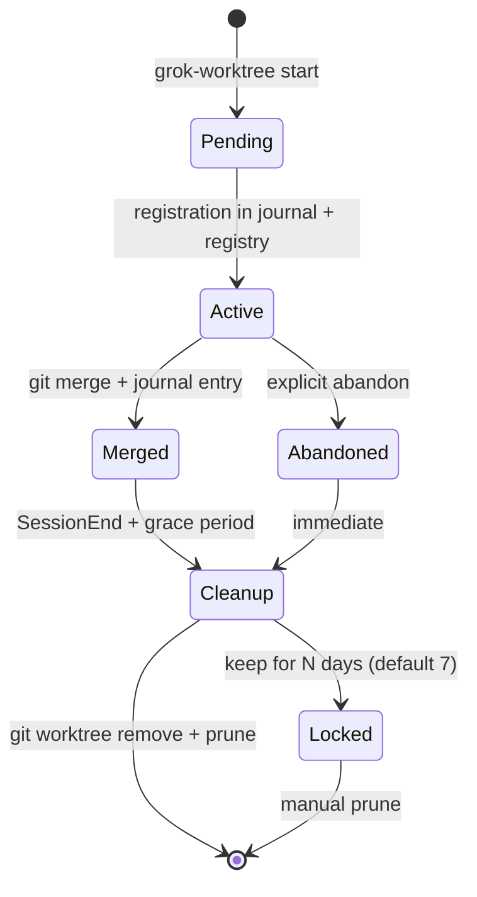

# Optimal Git Worktree Usage for Concurrent Grok Build Sessions

**Document ID:** `grok-design-doc-6788cc35`
**Status:** Draft (proposal — pending ADR amendment and user approval)
**Date:** 2026-07-22
**Author:** Grok Build design subagent (session-grok-design-6788cc35)
**Decider:** Bruce Thomson (operator, solo)
**Relates to:** [ADR-008](../adrs/ADR-008-concurrent-session-worktree-isolation.md), [ADR-009](../adrs/ADR-009-grok-cross-model-second-opinion-skills.md), [wiki: git-worktree-multi-terminal-best-practices](../../.data/wiki/concepts/git-worktree-multi-terminal-best-practices.md)
**Companion design-runs:** `grok-design-6bf249df` (cross-model skill siblings, conductor pattern), `grok-design-43e11106`

---

## Overview

The `P:\` workspace currently runs a fleet of Grok Build sessions with **10 active git worktrees** spread across **3 competing roots** (`P:/.claude/worktrees/`, `P:/.worktrees/`, plus 4 ghost dirs at `P:/worktrees/`), **2 codex worktrees at the "wrong" root**, **24 SessionStart hooks with no coordination contract**, and a **dirty `main` checkout** because concurrent agents write there directly. The hook that should prevent drift (`worktree_root_policy_PreToolUse.py`) only fires on the main thread, the worktree lifecycle helper (`worktree_safety.py`) does not yet know which root is canonical, and the auto-commit fail-closed gate from ADR-008 Layer 2 was never implemented.

This design proposes the missing layer between the platform's native `--worktree` switch and the operator's mental model: a single canonical worktree root (`P:/.worktrees/`), a deterministic naming convention, a session-scoped worktree registry that replaces a dead-code read in `SessionStart_task_identity.py:129`, an `__lib/worktree_lib.py` library plus a small shell CLI dispatcher (imported by `/grok-parallel`, `/grok-safe-git`, and the auto-commit gate — not exposed as a slash skill), a `SessionEnd_worktree_cleanup.py` hook for lifecycle hygiene, and the auto-commit fail-closed gate ADR-008 deferred. The work is staged into **8 ordered PRs** (1, 2, 3, 4a, 4b, 5, 6, 7), each independently reviewable and mergeable. Stages: (Stage 0) PRs 1, 2 fix stale artifacts; (Stage 1) PRs 3, 4a, 4b build library + skill integration; (Stage 2) PR 5 adds lifecycle hooks; (Stage 3) PR 6 adds warn-mode auto-commit enforcement that only flips to block-mode after a measured calibration corpus demonstrates the gate would have caught at least one real collision; (Stage 4) PR 7 amends the ADR. Per the gating invariant in `P:/.claude/CLAUDE.md`.

## Background & Motivation

### Current state — the symptom the user wants fixed

`git -C P: status -s` (verified 2026-07-22 via preflight) shows `main` is dirty: `M .claude/CLAUDE.md`, `M .data/wiki/...`, `D .data/wiki/sources/skills/...`. Concurrent agents are writing directly to the canonical checkout. This is the symptom.

The root cause is a missing discipline layer:

1. **No canonical worktree root.** Three roots exist; one is enforced by the hook, another is what the rule file documents, and a third holds 8 live worktrees.
2. **No coordination contract among SessionStart hooks.** 24 `SessionStart_*.py` files fire at session start; none owns worktree lifecycle.
3. **No session-scoped worktree registry.** The `.claude/task-worktree-mapping.json` read by `SessionStart_task_identity.py` (line 129) is **dead code**, not dormant — the file does not exist on disk (verified 2026-07-22 via `Test-Path`); the read is guarded by `if mapping_file.exists():` which always evaluates false. There is no missing-writer problem to fix; the read should be removed and replaced with the `session_registry.jsonl` lookup that PR 3 introduces.
4. **No auto-commit fail-closed gate.** ADR-008 Layer 2 deferred "until a corpus demonstrates real collisions." The deferred work includes the `_other_session_active(cwd)` helper and TTL-based heartbeat logic.

### Live worktree inventory (10 active + 4 ghost = 14 paths)

| Path | Branch | Notes |
|---|---|---|
| `P:/.claude/worktrees/ai-task-20260713-133947` | `ai/ai-task-20260713-133947` | Hook default would deny; was created before enforcement |
| `P:/.claude/worktrees/enforcement-removal-20260627-051242` | `ai/enforcement-removal-20260627-051242` | Same |
| `P:/.claude/worktrees/research-runtime-clean` | `ai/research-runtime-clean` | Same |
| `P:/.claude/worktrees/sdlc-audit` | `worktree-sdlc-audit` | Same |
| `P:/.claude/worktrees/sessionend-test` | `worktree-sessionend-test` **locked** | Same |
| `P:/.claude/worktrees/test-worktree-field` | `worktree-test-worktree-field` | Test fixture (commit `088bcae`) |
| `P:/.claude/worktrees/test-wt-field` | `worktree-test-wt-field` | Test fixture (commit `088bcae`) |
| `P:/.worktrees/codex-agent-bridge` | `codex/agent-bridge` | Matches hook default |
| `P:/.worktrees/userpromptsubmit-hardening-20260712` | `codex/userpromptsubmit-hardening-20260712` | Matches hook default |
| **Ghost dirs at `P:/worktrees/`:** `pi-task-20260710-055243-t0bedit1` | (no git registration) | Cleanup required |
| **Ghost dirs at `P:/worktrees/`:** `pi-task-20260710-133714-e8704c63-go` | (no git registration) | Cleanup required |
| **Ghost dirs at `P:/worktrees/`:** `pi-task-20260710-155811-bd3038ab-go` | (no git registration) | Cleanup required |
| **Ghost dirs at `P:/worktrees/`:** `yt-is-throughput-cadence-accounting` | (no git registration) | Cleanup required |

**Quantified pain:** 8/10 worktrees live at the root the hook denies; 2/10 live at the root the hook allows. The hook is flouted by history, not circumvented by subagents (subagent gap is a separate issue, see [Constraint 6](#constraint-6)).

### Conflicts the audit flagged (both in scope per user decision)

- **Conflict A — 24 SessionStart hooks with no coordination contract.** `SessionStart_task_identity.py:129` reads worktree branch → task mapping, but no SessionStart hook owns worktree *creation* or *cleanup*.
- **Conflict B — 4 competing worktree-root markers.** `P:/worktrees/` (3 session ledgers + rule + 2 codex worktrees), `P:/.worktrees/` (hook default + superpowers default), `GO_WORKTREE_ROOT` (env-var convention in 6 `.artifacts/*` files), `GO_MANAGED_WORKTREE_ROOT` (1 `.artifacts/*` file).

## Goals & Non-Goals

### In scope

1. **Resolve the worktree-root conflict.** Pick one canonical root; widen the hook's `ALLOWED_ROOT` or migrate the offenders.
2. **Standardize worktree naming and lifecycle.** One convention, one helper script, one cleanup path.
3. **Replace the dead-code task-worktree mapping** at `SessionStart_task_identity.py:129` with a `session_registry.jsonl` lookup. The mapping is **dead code** (the file does not exist on disk; the read is guarded by `if mapping_file.exists():` which always evaluates false) — there is no missing-writer problem to fix; the read is removed.
4. **Define the SessionStart coordination contract** for worktree lifecycle. Pick an owner; document handoffs to other hooks.
5. **Implement the auto-commit fail-closed gate** (ADR-008 Layer 2) — but ship in warn-mode first; calibrate on real corpus.
6. **Fix stale artifacts in scope of the user decision:**
   - `P:/.claude/rules/worktree-workflow.md` — rewrite to match the canonical root shape
   - `grok-safe-git` SKILL.md line 99 broken wiki citation — create the page or replace the citation
   - `SessionStart_task_identity.py` dead-code read of `.claude/task-worktree-mapping.json` (file does not exist on disk; verified 2026-07-22 via `Test-Path`) — remove the read; per critical-friend finding 3, there is no missing-writer problem to fix because the file does not exist
7. **Integrate `grok-parallel` and `/go` with the new helper.** `grok-parallel` currently declares `isolation: worktree` without specifying how to create or where to put it.
8. **Migrate 8 worktrees at `P:/.claude/worktrees/`** to the canonical root (or widen the hook to accept both).

### Out of scope (deferred or assigned elsewhere)

- **Native-tool preference (Step 1a of superpowers' `using-git-worktrees`).** Deferred to `superpowers-21e2a56d/docs/superpowers/plans/2026-04-06-worktree-rototill.md`. This design assumes git worktree primitives; if the rototill changes that, this design's helper script becomes a thin wrapper.
- **Container / sandbox isolation.** ADR-008 rejected it; not fleet-appropriate.
- **Pre-warmed worktree pool.** Per the wiki research, P:\ is mixed Python/MD with no dep-install bottleneck. Create-on-demand is optimal. Pool is rejected unless dep weight changes.
- **GitButler virtual branches.** Rejected by ADR-008 (VCS workflow change). Not appropriate for AI fleets anyway.
- **General SessionStart hook consolidation.** The 24-hook problem is real but orthogonal. This design defines the worktree-specific contract; the broader hook consolidation is a separate workstream.
- **MCP port allocator.** ADR-008 deferred; not blocking this design but flagged as follow-up.

---

## Proposed Design

### Architecture overview

```
+-----------------------------------------------------------+
|                    Grok Build Session                      |
|  +-------------------+     +--------------------------+    |
|  | /grok-parallel    |     | /go (orchestrator)       |    |
|  |   isolation:wt    |     |   H4 Parallel Pack       |    |
|  +---------+---------+     +-------------+------------+    |
|            |                             |                 |
|            v                             v                 |
|  +----------------------------------------------------+   |
|  |  Existing skills EXTEND worktree_lib (no new skill):   |
|  |   /grok-parallel, /grok-safe-git, /grok-route,    |   |
|  |   /handoff, /aar import P:/.claude/hooks/__lib/    |   |
|  |   worktree_lib.py for create/list/status/merge/    |   |
|  |   cleanup + path validation                         |   |
|  +----------------------------------------------------+   |
|            |                       |                    |
|            v                       v                    |
|  +------------------+   +--------------------------+     |
|  | worktree_lib.py  |   | worktree_helper.py       |     |
|  | (NEW, PR 3)      |   | (existing)               |     |
|  +------------------+   +--------------------------+     |
|            |                       |                    |
|            v                       v                    |
|  +----------------------------------------------------+   |
|  |  P:/.worktrees/<type>-<session6>-<slug>/          |   |
|  |  P:/.claude/.artifacts/session_registry.jsonl      |   |
|  |  P:/.claude/.artifacts/<term>/worktree-journal/    |   |
|  +----------------------------------------------------+   |
+-----------------------------------------------------------+
            |                       |
            v                       v
   +-------------------+   +----------------------+
   | PreToolUse hooks  |   | SessionStart /       |
   |  - root policy    |   | SessionEnd hooks     |
   |  - lease gate     |   |  - task_identity     |
   |  (warn-mode)      |   |  - cleanup           |
   +-------------------+   +----------------------+
```

### 1. Worktree root authority

**Decision:** `P:/.worktrees/` is the canonical worktree root. The hook's current default (`P:/.worktrees/`) matches this; the rule file (`worktree-workflow.md` says `P:/worktrees/`) and 8 live worktrees (`P:/.claude/worktrees/`) are wrong.

**Rationale (verbatim from external research):** public sources overwhelmingly prefer project-local hidden directories (`.worktrees/`) per the superpowers skill. For this host we deviate to `P:/.worktrees/` because (a) the host is a multi-root workspace where `P:` itself is the "project root" in the sense that all subsystems share `.git`, (b) the hook already enforces `P:/.worktrees/`, (c) 2 worktrees already live there, and (d) avoiding a second hidden directory under each subsystem reduces naming-collision surface.

**Migration:** the 8 worktrees at `P:/.claude/worktrees/` will be relocated in PR 2 (see [PR Plan](#pr-plan)). Migration is via `git worktree move <old> <new>` — atomic, preserves `.git/worktrees/<name>/` registration, no history rewrite. Branches keep their names. Any sessions currently running against those worktrees must restart after the move.

**Hook widening:** NOT done. The hook's default is correct; the offenders were created before enforcement and need to come into compliance, not the other way around. `WORKTREE_ALLOWED_ROOT` env var remains the per-test escape hatch.

### 2. Naming convention

**Decision:** `P:/.worktrees/<type>-<session6>-<slug>/` where:

- `<type>` is one of `task` (default for agent work), `exp` (throwaway experiment), `review` (PR review bundle), `bridge` (cross-model bridge work, e.g., codex), `sub` (subagent-only).
- `<session6>` is the first 6 hex chars of the session UUID (collision risk for the first 6 chars is ~1/16M per pair; safe for fleet scale).
- `<slug>` is a short, human-readable description (≤32 chars, `[a-z0-9-]+`).

Examples:
- `P:/.worktrees/task-019f82-rfc-worktree-helper/`
- `P:/.worktrees/bridge-019f8a-codex-agent-bridge/`
- `P:/.worktrees/review-019f8b-pr-123/`

**Why not bare branch names?** Because `git worktree list` output must be scannable; bare branch names like `feature/auth` are unactionable when 10 of them stack up.

**Why include session6?** Because session-scoped worktrees need to be findable by session registry lookup (audit trail) and because two sessions on the same task must never collide on the name.

**Collision probability (birthday framing).** The `<session6>` field is the first 6 hex characters of the session UUID (24 bits, 16,777,216 possible values ≈ 16.7M). Per-pair collision probability is 1/16.7M. For a fleet of N concurrent sessions, the probability that *any* pair collides follows the birthday problem: P(collision) ≈ 1 - exp(-N²/(2×16.7M)). Worked values:

| N (concurrent sessions) | P(any pair collides) |
|---|---|
| 10 (current fleet) | ~3.0×10⁻⁶ (negligible) |
| 50 | ~7.4×10⁻⁵ (negligible) |
| 100 | ~3.0×10⁻⁴ (~0.03%) |
| 500 | ~7.4×10⁻³ (~0.74%) |
| 1,000 | ~3.0×10⁻² (~3%) |

**Acceptable for current scale (<500 concurrent).** At the current fleet size of ~10 concurrent sessions, collision risk is effectively zero. The design revisits this math when N exceeds 500 OR if session-prefix clustering is observed (e.g., a long-lived session creating dozens of child sessions would inflate N artificially — in that case, expand to `<session9>` for 36-bit / 68 billion space).

**Compatibility:** existing worktrees do NOT match the convention; PR 2 renames them in place via `git worktree move`.

### 3. Lifecycle: create → use → merge → cleanup



**Lifecycle rules:**

- **Create** (operator shell CLI): `grok-worktree start <type> <slug>` — generates `<type>-<session6>-<slug>`, calls `git worktree add -b <branch> P:/.worktrees/<name>`, writes journal entry, registers in `session_registry.jsonl`. Equivalent library call for skills: `WorktreeLib.start(type_='task', slug=...)`.
- **Use**: inside the worktree, write via worktree-relative paths for source code; write via absolute paths for durable artifacts (wiki, handoffs, ADRs).
- **Merge** (operator shell CLI): `grok-worktree merge <name>` — runs `git fetch origin`, `git merge --no-ff <branch>`, appends journal entry, leaves worktree in place until cleanup. Equivalent library call: `WorktreeLib.merge(name)`.
- **Cleanup**: `grok-worktree cleanup` — runs daily via `SessionEnd_worktree_cleanup.py`; removes merged worktrees older than 7 days, prunes stale `.git/worktrees/<name>/` entries, surfaces orphans to operator.

### 4. `__lib/worktree_lib.py` — the conductor as a library

The conductor is a Python module at `P:/.claude/hooks/__lib/worktree_lib.py`, NOT a slash skill. Existing skills (`/grok-parallel`, `/grok-safe-git`, `/grok-route`, `/handoff`, `/aar`) import this module to coordinate worktree lifecycle. A small shell CLI dispatcher (`scripts/grok-worktree.py`) sits alongside the library for operator shell use, but is not a slash skill — this preserves the user's stated preference for "use the skills we have" rather than adding a 32nd skill.

**Public API surface:**

```python
# P:/.claude/hooks/__lib/worktree_lib.py
class WorktreeLib:
    """Conductor for worktree lifecycle. Imported by existing skills."""

    def __init__(self, *, session_id: str, cwd: Path | None = None,
                 root: Path | None = None):
        self.session_id = session_id
        self.cwd = cwd or Path.cwd()
        self.root = root or Path(os.environ.get("GROK_WORKTREE_ROOT", "P:/.worktrees"))

    def start(self, *, type_: str, slug: str) -> WorktreeRecord:
        """Create worktree under canonical root; register in journal + session registry."""
        ...

    def list(self, *, in_path: Path | None = None) -> list[WorktreeRecord]:
        """All worktrees (annotated with foreign-dirty status)."""

    def status(self) -> StatusReport:
        """Current worktree info + foreign-dirty status (see algorithm below)."""

    def merge(self, name: str, *, into: str = "main") -> None:
        """git fetch origin; git merge --no-ff <branch>; append journal entry."""

    def abandon(self, name: str) -> None:
        """Mark status='abandoned' in registry; schedule cleanup (subagent-only)."""

    def cleanup(self, *, dry_run: bool = True, older_than_days: int | None = None) -> CleanupReport:
        """Ghost-dir sweep + non-canonical detection + stale-after-merge sweep."""

    def canonical_path(self, name_or_cwd: str | Path | None = None) -> Path:
        """Resolve canonical P: path for any worktree name or current cwd."""

    def validate_durable_write(self, target_path: str, *, cwd: Path | None = None) -> tuple[bool, str]:
        """Path validator for handoff/grok-route writes (returns ok/reason)."""

    def cluster_check(self) -> ClusterCheck:
        """Detect session-prefix clustering (returns count + warning if >=5 worktrees share 6-hex prefix)."""
```

**Shell CLI dispatcher (optional, for operator convenience):**

`C:\Users\brsth\.grok\scripts\grok-worktree.py` — a thin script that wraps the library's argparse interface. Not a slash skill, not a Grok plugin. Just an operator shell convenience:

```
grok-worktree start   <type> <slug>            # create + register
grok-worktree list                            # all worktrees (annotated)
grok-worktree status                          # current worktree info + foreign dirty
grok-worktree merge   <name> [--into main]    # finish path
grok-worktree abandon <name>                  # mark abandoned, schedule cleanup
grok-worktree cleanup [--dry-run] [--older-than N]   # cleanup pass
grok-worktree canonical-path [<name>]         # absolute path lookup
grok-worktree cluster-check                   # explicit instrumentation for the 6-hex collision check
grok-worktree journal  [--session <id>]      # journal entries
```

**Why library + script, not slash skill.** The user's request was *"use the skills we have."* Adding `grok-worktree` as a slash skill would (a) make it the 32nd skill in the user-scope skills directory (which already has 31 entries per `Get-ChildItem` 2026-07-22), (b) invert the relationship (existing skills become callers of the new wrapper), and (c) add cognitive-load surface area the operator must remember per session. The library imports preserve the conductor pattern's value (registry coordination, naming, journaling) without adding a new slash-skill surface.

Note: the shell CLI surface above is the canonical list. `validate_durable_write` is library-only (not exposed via the CLI); `cluster_check()` is exposed via the CLI as `cluster-check` for operator-driven audit runs.

**Minimum interface (excerpt):**

```python
# P:/.claude/hooks/__lib/worktree_lib.py  (library — imported by existing skills)
from pathlib import Path
from datetime import datetime, timezone
import os

WORKTREE_ROOT = Path(os.environ.get("GROK_WORKTREE_ROOT", "P:/.worktrees"))
JOURNAL_DIR = Path("P:/.claude/.artifacts") / "<term>" / "worktree-journal"
REGISTRY_PATH = Path("P:/.claude/.artifacts/session_registry.jsonl")

class WorktreeLib:
    """Conductor for worktree lifecycle. Imported by existing skills."""

    def __init__(self, *, session_id: str, cwd: Path | None = None,
                 root: Path | None = None):
        self.session_id = session_id
        self.cwd = cwd or Path.cwd()
        self.root = root or WORKTREE_ROOT

    def start(self, *, type_: str, slug: str) -> "WorktreeRecord":
        """Create worktree under canonical root; register in journal + session registry."""
        sess6 = self.session_id.replace("-", "")[:6]
        name = f"{type_}-{sess6}-{slug}"
        path = self.root / name
        if path.exists():
            die(f"worktree already exists at {path}", code=2)
        branch = f"{type_}/{sess6}/{slug}"
        # git worktree add -b <branch> <path>
        rc = run(["git", "worktree", "add", "-b", branch, str(path)])
        if rc != 0: die("git worktree add failed", code=1)
        repo_root = run_capture(["git", "rev-parse", "--show-toplevel"]).strip()  # for registry
        journal_write({"event": "start", "name": name, "branch": branch,
                       "path": str(path), "session_id": self.session_id,
                       "ts": now()})
        registry_append({"session_id": self.session_id, "worktree": name,
                         "worktree_path": str(path), "branch": branch,
                         "repo_root": repo_root, "pid": os.getpid(),
                         "started_at": now(), "last_heartbeat": now()})
        return WorktreeRecord(name=name, branch=branch, path=path)

# P:/packages/.claude-marketplace/plugins/cc-skills-utils/scripts/grok-worktree.py
# (shell CLI dispatcher — thin wrapper for operator shell use; NOT a slash skill)
import argparse
from P..claude.hooks.__lib.worktree_lib import WorktreeLib  # sys.path bootstrap

def cmd_start(args):
    """Thin CLI wrapper around WorktreeLib.start()."""
    lib = WorktreeLib(session_id=os.environ["GROK_SESSION_ID"])
    record = lib.start(type_=args.type, slug=args.slug)
    print(record.path)
```

The library lives at `P:/.claude/hooks/__lib/worktree_lib.py` and is the blessed path for skill imports. The shell CLI dispatcher lives at `P:/packages/.claude-marketplace/plugins/cc-skills-utils/scripts/grok-worktree.py` (operator convenience, not a slash skill). Both are PR 3 deliverables.

def cmd_status(args):
    """See algorithm block below — runs foreign-dirty detection."""
    ...

def cmd_canonical_path(args):
    """Resolve canonical P: path for any worktree name or current cwd."""
    # ... walk .git/worktrees/<name>/gitdir to resolve
    print(resolve(args.name or "."))
```

**`cmd_status` algorithm — foreign-dirty detection (PR 3 deliverable, `/grok-safe-git` Step 4.6 calls this before any commit):**

```python
# Module-level constants (defined at top of grok-worktree.py):
from pathlib import Path

MAIN_CHECKOUT = Path("P:")            # canonical main checkout path
MAIN_CHECKOUT_BRANCH = "main"          # canonical main branch name

def path_in_branch_tree(path: str, branch: str) -> bool:
    """True iff `path` exists in the tree of `branch` at HEAD.

    Implementation: `git -C <MAIN_CHECKOUT> ls-tree --name-only -r <branch> --
    <path_substr>`; returns True if the path appears in the ls-tree output.
    Handles renames by checking the final path component."""
    result = run_capture([
        "git", "-C", str(MAIN_CHECKOUT),
        "ls-tree", "--name-only", "-r", branch, "--", path,
    ])
    return bool(result.strip())


def cmd_status(args):
    """Print current worktree info + foreign-dirty status."""
    wt = detect_current_worktree()  # via __lib/worktree_helper.get_current_worktree()
    if wt is None:
        # On main checkout: just report main status
        main_dirty = run_capture(["git", "status", "--short"])
        print(f"On main checkout. Foreign dirty:\n{main_dirty or '(none)'}")
        return

    # In a worktree: compute foreign-dirty in main, divergence from main, ahead/behind
    branch = run_capture(["git", "branch", "--show-current"])
    main_dirty = run_capture(["git", "-C", str(MAIN_CHECKOUT), "status", "--short"])
    main_ahead_behind = run_capture([
        "git", "-C", str(MAIN_CHECKOUT),
        "rev-list", "--left-right", "--count",
        f"{branch}...{MAIN_CHECKOUT_BRANCH}"
    ]).strip().split()

    # Path-divergence detection: are there file paths in main's dirty that ALSO exist in this branch's tree?
    foreign_collisions = []
    for line in main_dirty.splitlines():
        path = line[3:].strip().split(" -> ")[-1]  # handle renames
        if path_in_branch_tree(path, branch):
            foreign_collisions.append(path)

    print(f"Worktree: {wt.path}")
    print(f"Branch:   {branch}")
    print(f"Main dirty ({len(main_dirty.splitlines())} files):")
    print(main_dirty or "  (none)")
    print(f"Divergence: ahead={main_ahead_behind[0]} behind={main_ahead_behind[1]}")
    if foreign_collisions:
        print(f"⚠ Foreign collisions (paths in main dirty that also exist in this branch):")
        for p in foreign_collisions:
            print(f"  {p}")
        return 1  # non-zero exit signals /grok-safe-git to require explicit confirmation
    return 0
```

**Output semantics.** Exit code 0 = no foreign collisions (safe to commit). Exit code 1 = foreign collisions detected (caller must surface to operator). The `/grok-safe-git` Step 4.6 integration uses this exit code to gate `git add` until the operator acknowledges the collision.

The library is the single entry point for existing skills to interact with worktrees. `/grok-parallel` and `/grok-safe-git` import `WorktreeLib` and call `WorktreeLib.start(type_='task', slug=...)` instead of `git worktree add` directly; `/go` Step 6.5 (state file) records the worktree path; `/handoff` and `/grok-route` invoke `WorktreeLib.validate_durable_write()` on every write. The shell CLI `grok-worktree.py` is a thin operator-facing wrapper around the same library (PR 3).

**`path-validator` for handoff/grok-route writes (mandate in PR 4a, implementation in PR 4b):**

The path validator wraps write operations from `/handoff` and `/grok-route` to enforce the canonical-path rule from the `worktree-writes-dont-sync-to-canonical` failure mode. PR 4a mandates that `/handoff` Step 2 and `/grok-route` Step 4 invoke the validator (text-only SKILL.md edits). PR 4b implements the validator itself: extends the existing `P:/.claude/hooks/__lib/path_validator.py` (no new file), adds `validate_durable_write()` that **imports `is_cross_worktree_access()` from `P:/.claude/hooks/__lib/worktree_helper.py`** (where it lives at line 162 — verified 2026-07-22 via `grep`; the design does not duplicate detection logic across modules). Pseudocode for the validator:

```python
# In P:/.claude/hooks/__lib/path_validator.py
from .worktree_helper import get_current_worktree, is_cross_worktree_access

CANONICAL_DURABLE_DIRS = {
    "P:/docs/handoffs/",         # handoffs
    "P:/.data/wiki/concepts/",   # wiki
    "P:/docs/adrs/",             # ADRs
    "P:/.data/wiki/sources/",    # wiki sources
}

def validate_durable_write(target_path: str, *, cwd: str | None = None) -> tuple[bool, str]:
    """Returns (ok, reason). If not ok, target_path should be rewritten to canonical.

    Rule: durable artifacts must land at CANONICAL_DURABLE_DIRS paths regardless of cwd.
    If cwd is inside a worktree and target_path is worktree-relative, the validator
    rewrites to canonical. If target_path is already absolute-canonical, allow."""
    target = Path(target_path)
    cwd = Path(cwd or os.getcwd())

    # Case 1: target_path is already canonical absolute → allow
    if target.is_absolute():
        for canonical_prefix in CANONICAL_DURABLE_DIRS:
            if str(target).startswith(canonical_prefix):
                return True, "absolute-canonical"
        # Absolute but NOT canonical → caller wrote to wrong absolute path
        # (e.g., a worktree-local copy of P:/docs/handoffs/) → BLOCK
        return False, f"absolute path outside canonical roots: {target_path}"

    # Case 2: target_path is relative → check if cwd is in a worktree
    current_wt = get_current_worktree(cwd)
    if current_wt is None:
        # cwd is on main checkout; relative path resolves correctly → allow
        return True, "main-cwd-relative"

    # cwd is in a worktree, target is relative → MUST rewrite to canonical
    # Rewrite: take the basename, prefix with the canonical root
    # E.g., "my-handoff/HANDOFF.md" → "P:/docs/handoffs/my-handoff/HANDOFF.md"
    for canonical_prefix in CANONICAL_DURABLE_DIRS:
        # Detect intent by checking if the relative path's basename matches
        # a canonical subdirectory pattern (handoff, wiki, ADR)
        basename = target.parts[0] if target.parts else ""
        if basename_matches_canonical(basename, canonical_prefix):
            rewritten = canonical_prefix + str(target).lstrip("./")
            return False, f"rewrite-to-canonical:{rewritten}"

    # Relative path under worktree cwd, no canonical mapping → BLOCK
    return False, f"worktree-relative write to durable artifact forbidden: {target_path}"
```

**Integration.** `/handoff` and `/grok-route` Step 4 call `validate_durable_write(target)` before any write. If `(ok=False)`, the write is rejected with the reason printed to stderr; the caller is responsible for either accepting the rewrite suggestion or surfacing the violation to the operator. The validator's `basename_matches_canonical()` heuristic covers the common cases (handoff dirs starting with `<topic>-<YYYYMMDD>`, wiki concept filenames ending in `.md`, ADR filenames matching `ADR-NNN-*.md`) — false positives surface as "rewrite to canonical" suggestions that the caller can override.

**Authoritative spec location.** The full subcommand surface for `grok-worktree` (the shell CLI dispatcher — including `list`, `status`, `merge`, `abandon`, `cleanup`, `canonical-path`, `cluster-check`, `journal`) is specified in `C:\Users\brsth\.grok\scripts\grok-worktree.md` as a deliverable of PR 3, alongside the library at `P:/.claude/hooks/__lib/worktree_lib.py`. The design documents the library class spec; the script's docstring + the markdown doc are the complete contract for the shell CLI surface. PR 3 review reads both. **Note:** the shell CLI lives at `C:\Users\brsth\.grok\scripts\grok-worktree.py` (operator shell convenience) — NOT under `C:\Users\brsth\.grok\skills\`. The fact that we kept the SKILL.md-style documentation does not make `grok-worktree` a slash skill; the convention is just that operator-facing tools use a markdown doc for argparse contracts.

**Pseudocode sketches for remaining subcommands (non-authoritative; superseded by SKILL.md):**

```python
def cmd_list(args):
    """All worktrees annotated with foreign-dirty status."""
    worktrees = parse_git_worktree_list_porcelain()
    main_dirty = run(["git", "-C", "P:", "status", "--short"])
    for wt in worktrees:
        wt['foreign_dirty_in_main'] = bool(main_dirty)
        wt['canonical'] = wt['path'].startswith(str(WORKTREE_ROOT))
    print_table(worktrees)

def cmd_status(args):
    """See Issue 8.2 algorithm block below — runs foreign-dirty detection."""
    ...

def cmd_merge(args, into: str = "main"):
    """git fetch origin; git merge --no-ff <branch>; append journal entry."""
    wt = resolve(args.name)
    run(["git", "fetch", "origin"])
    run(["git", "-C", str(wt), "merge", "--no-ff", wt.branch])
    journal_write({"event": "merge", "name": wt.name, "into": into})

def cmd_abandon(args):
    """Mark status='abandoned' in registry; schedule cleanup (subagent-only)."""
    wt = resolve(args.name)
    registry_update(wt.session_id, status="abandoned")
    journal_write({"event": "abandon", "name": wt.name})

def cmd_cleanup(args):
    """See Issue 1.2 / Issue 8.2 algorithm; ghost-dir + non-canonical + stale sweep."""
    ...
```

**Where the real spec lives.** PR 3 deliverables:
- `P:/.claude/hooks/__lib/worktree_lib.py` — `WorktreeLib` class spec (this design's §4). Imported by existing skills.
- `C:\Users\brsth\.grok\scripts\grok-worktree.md` — shell CLI surface contract (argparse, error codes, exit codes). Thin wrapper around `WorktreeLib`.

Both are PR 3 deliverables. The library's behavior is authoritative for skill integrations; the SKILL.md is authoritative for the shell CLI's argparse surface.

### 5. Session-scoped registry

The dead-code read of `.claude/task-worktree-mapping.json` at `SessionStart_task_identity.py:129` (the file does not exist on disk; verified 2026-07-22 via `Test-Path`) is removed and replaced with **append-only JSONL at `P:/.claude/.artifacts/session_registry.jsonl`** (existing file, 1.3MB, already append-only per ADR-008 schema extension).

**Schema extension (additive):**

```json
{
  "session_id": "019f8507-aaaa-bbbb-cccc-dddddddddddd",
  "terminal_id": "term-3",
  "worktree": "task-019f85-rfc-worktree-helper",
  "worktree_path": "P:/.worktrees/task-019f85-rfc-worktree-helper",
  "branch": "task/019f85/rfc-worktree-helper",
  "repo_root": "P:",
  "pid": 12345,
  "started_at": "2026-07-22T10:00:00Z",
  "last_heartbeat": "2026-07-22T10:05:00Z",
  "ended_at": null,
  "status": "active"
}
```

**`repo_root` field is mandatory for non-worktree sessions.** `WorktreeLib.start()` writes it from `git rev-parse --show-toplevel` at creation time. For sessions that never create a worktree (solo work on `main`), `SessionStart_task_identity.py` writes it from the same git command during the initial heartbeat. The `_other_session_active()` algorithm (PR 6) depends on this field to filter concurrent activity to the same repository — without it, every concurrent session in any workspace repo would be flagged as conflicting on the multi-root `P:\` workspace. Format: absolute path string (e.g., `P:` for the main checkout, `P:/.worktrees/task-019f85-foo/` for a worktree — though for worktree sessions the algorithm short-circuits before consulting `repo_root`).

**Writers:**
- `WorktreeLib.start()` (creation; called by skills or by `grok-worktree start` CLI)
- `WorktreeLib.merge()` / `WorktreeLib.abandon()` (terminal event)
- `SessionStart_task_identity.py` (initial heartbeat)
- `SessionEnd_worktree_cleanup.py` (last heartbeat + status update)

**Readers:**
- `SessionStart_task_identity.py` (lookup current session's worktree)
- Auto-commit fail-closed gate (`_other_session_active(cwd)`)
- Worktree cleanup pass (find stale sessions)

**Heartbeat implementation — chosen default: option (a) "every Stop hook writes."** The 300s TTL in PR 6's algorithm is only meaningful if heartbeats fire frequently enough to keep `last_heartbeat` fresh during long-running concurrent activity. Three lifecycle-event-only writes (`SessionStart`, `SessionEnd`, `WorktreeLib.start/merge/abandon`) is insufficient for a session that runs in `main` for 10+ minutes doing thinking — between events, the auto-commit gate would treat the session as stale and fail-open on concurrent detection. The chosen implementation:

- **Call site:** every Stop event in the cc-skills-utils ecosystem calls `task_identity_manager.touch_heartbeat(session_id)` before the existing auto-commit logic. This adds one JSONL append (~150 bytes) to every Stop, which is acceptable cost.
- **Implementation:** the existing `P:/.claude/hooks/__lib/task_identity_manager.py` (already used by `SessionStart_task_identity.py`) gains a new method `touch_heartbeat(session_id: str)` that appends `{"session_id": <id>, "last_heartbeat": <iso8601>}` to `session_registry.jsonl`. PR 6 wires this call into `cc-skills-utils_Stop_auto_commit.py`.
- **Frequency:** Stop events fire on every assistant turn end (mid-session), so heartbeats naturally fire every ~30-120 seconds for active sessions — well within the 300s TTL.
- **Failure mode:** if a session crashes without firing Stop, the heartbeat goes stale and another session's `_other_session_active()` correctly treats it as inactive (freshness is the only signal — staleness means "gone"). This is the desired behavior, not a bug.
- **Alternative rejected:** option (b) "periodic hook" — would require a new hook firing on a timer, which Windows scheduling makes fragile. Option (c) "lazy" — heartbeats only on lifecycle events, which leaves the 300s TTL meaningless for long-running sessions.

The Open Question #11 about heartbeat implementation is resolved by this default.

### 6. Hook integration and SessionStart coordination

**Coordination contract for worktree lifecycle:**

| Lifecycle phase | Owning hook/script | Other hooks that read or react |
|---|---|---|
| Session start | `SessionStart_task_identity.py` (heartbeat + session_id lookup) | none write; others may read worktree path |
| Worktree creation | `WorktreeLib.start()` (called by skills or by `grok-worktree start` CLI; NOT a hook) | `worktree_root_policy_PreToolUse` blocks bad paths |
| Concurrent-write detection | Auto-commit gate (warn-mode in PR 6); former lease gate folded here | reads `session_registry.jsonl` |
| Session end | `SessionEnd_worktree_cleanup.py` (new, PR 5) | updates registry, runs cleanup pass |
| Background cleanup | `WorktreeLib.cleanup()` / `grok-worktree cleanup` CLI (operator-invoked) | none |

**Why not put worktree creation in a SessionStart hook?** Because SessionStart fires unconditionally; worktree creation should be explicit (`/grok-parallel start`, `/go` Step 0.5) or operator-invoked. Implicit creation on SessionStart would create worktrees for trivial sessions (e.g., one-off Q&A).

**Coordination with the existing 24 hooks:** no change to other hooks is required. The contract is "if you need the worktree path for this session, look it up in `session_registry.jsonl` filtered by `session_id`."

**Failure modes of SessionStart coordination.** The design assumes `SessionStart_task_identity.py` runs successfully and writes the initial heartbeat. Three failure scenarios:

1. **Hook fails to import or syntax error.** Symptom: session start fails with stderr. Auto-commit fail-closed gate's `_other_session_active()` would see *no* entry for this session; if other sessions exist, they would correctly flag the missing session as "not active." However, this session's own auto-commit logic would also see no entry and silently treat itself as "fresh." Risk: medium — under concurrent activity, the failing session's writes would not be visible to others, but the gate would still trigger for the others. Mitigation: PR 3 adds a syntax-check step to the project-local hook checklist; broken hooks must fail-fast at session start.

2. **Hook disabled by user (`~/.grok/disabled-hooks` or `~/.claude/settings.json` matcher empty).** Symptom: no `SessionStart_task_identity.py` runs; no heartbeat. Same downstream effect as failure mode 1. Mitigation: PR 7 (ADR amendment) flags this as a documented operational dependency — disabling `SessionStart_task_identity.py` defeats auto-commit fail-closed correctness.

3. **Hook slow (>5s) and heartbeat TTL exceeded.** Symptom: `SessionStart_task_identity.py` runs but takes >300s; the initial heartbeat is written late. Other sessions running in parallel may have already completed their Stop events and not seen this session as active. Risk: low — this is the only scenario where a session exists but is not visible to others at start; the next Stop event from this session writes a heartbeat and brings it into view. Mitigation: the chosen heartbeat implementation (every Stop hook writes — Issue 1.4) means within one Stop event (~30-120s for active sessions), the heartbeat is fresh and the gate becomes correct.

**Summary:** the gate's correctness depends on `SessionStart_task_identity.py` running and on Stop events firing heartbeats. Both are existing behavior; no new dependencies introduced. If either breaks, the gate degrades gracefully (fails open on no-data rather than fails closed on stale-data), at the cost of over-triggering concurrent detection during the gap.

### 7. Failure mode prevention

| Failure mode | Existing mitigation | New mitigation |
|---|---|---|
| Worktree writes don't sync to canonical wiki/handoff | (none — incident 2026-07-19 lost 3 days of wiki pages) | `WorktreeLib.start()` emits a `GROK_WORKTREE_NAME` env var (visible to children of the current session); `grok-route` Step 4 already says "When CWD is a worktree, edit under the worktree path, not main" — extend with explicit absolute-path reminder in skill body. New `SessionEnd_worktree_cleanup.py` runs `__lib/write_scanner.py` against all 4 canonical dirs (`P:/.data/wiki/concepts/`, `P:/docs/handoffs/`, `P:/docs/adrs/`, `P:/.data/wiki/sources/`) and reports both NEW files missing from canonical AND MODIFIED files where the worktree-local copy is newer than canonical (the broader failure-mode class — review Issue N1 augmentation). |
| Auto-commit clobbers concurrent session's work | (none — Layer 2 deferred) | Implement fail-closed gate per ADR-008 Layer 2 (PR 6). `_other_session_active(cwd)` reads `session_registry.jsonl` fresh on every Stop. Solo = ON, concurrent = OFF unless `/go` boundary set. |
| `git worktree add` lands outside canonical root | `worktree_root_policy_PreToolUse.py` (default `P:/.worktrees/`) | Already correct; widen nothing; migrate offenders (PR 2). |
| Subagent bypasses worktree root policy (upstream #78970) | (none — hook only fires on main thread) | **PRIMARY WORKFLOW CONCERN, NOT EDGE CASE.** Subagents are the primary way `/go` and `/grok-parallel` spawn work. The `WorktreeLib` library is the blessed path (per critical-friend finding 1, the library pattern replaces the slash-skill inversion that made this gap worse); subagents must import the library, not call `git worktree add` directly. If the falsifier fires (subagents bypass the library), the design fails. **Mitigation:** (a) PR 4b's `/grok-parallel` integration includes a smoke-test that verifies child subagents receive `worktree_path` in their prompt; (b) operator-side documentation in the SKILL.md warns that subagents must use the library; (c) future: `core.hooksPath` global pre-commit hook that wraps `git worktree add` if the gap persists post-PR-4b. |
| Ghost worktree dirs (filesystem but not in `git worktree list`) | (none) | `grok-worktree cleanup` sweep (PR 5): walks `P:/.worktrees/`, `P:/worktrees/`, `P:/.claude/worktrees/`, identifies dirs without matching `.git/worktrees/<name>/` registration, surfaces for operator decision. |
| Same branch checked out twice | (none) | `grok-worktree start` runs `git worktree list --porcelain` and asserts branch uniqueness before `git worktree add`. |
| Manual `rm -rf` leaves stale `.git/worktrees/<name>` | (none) | `grok-worktree cleanup` always calls `git worktree prune` after deletions. |
| Handoff writes inside worktree resolve to wrong path | `/handoff` SKILL.md hardcodes `P:\docs\handoffs\...` but doesn't mandate absolute path | PR 1 extends `/handoff` SKILL.md Step 2 with explicit "use absolute path, not cwd-relative" mandate; PR 4b implements the `path-validator` wrapper (see algorithm below) for handoff and grok-route writes. PR 4a mandates the validator invocation. |

### 8. Skill integration matrix

| Skill | Current behavior | New integration |
|---|---|---|
| `/grok-parallel` | Declares `isolation: worktree`; no mechanism | Step 3 spawn contract imports `__lib/worktree_lib.py` and calls `WorktreeLib.start(type_='task', slug=...)`; worktree path passed to child prompt |
| `/grok-safe-git` | Step 4.5 says "ecosystem-proven structural fix is worktree-per-task" + references missing wiki page | Step 4.5 replaces stale citation with new helper reference; Step 4.6 invokes `WorktreeLib.status()` before any commit in a worktree to surface foreign dirty |
| `/go` (H4 Parallel Pack) | "Worktree when the main tree has foreign dirty/staged work" | Step 0.5 mandates `WorktreeLib.status()`; Step 6.5 state file includes `worktree_path` field |
| `/handoff` | Writes to `P:\docs\handoffs\...`; absolute-vs-relative path is latent risk | Step 2 explicit absolute-path mandate; path-validator wraps writes in worktree cwd |
| `/aar` | Run-dir pattern keyes by terminal_id | Step 0.1 prefers `worktree_path` over `terminal_id` if both present (worktree is more specific) |
| `/grok-route` | "When CWD is a worktree, edit under the worktree path, not main" | Step 4 extended: also mandate absolute-path writes for durable artifacts |
| Superpowers `using-git-worktrees` | Default `.worktrees/`, native-tool preference Step 1a | Untouched (rototill plan owns it); this design adds `WorktreeLib` (PR 3) + the `grok-worktree` shell CLI as a Grok Build wrapper around the Step 1b fallback (plain `git worktree add`) |

### 9b. Concurrent-write detection (folded into PR 6 auto-commit gate; no separate PreToolUse gate)

**Decision:** the design previously proposed a separate `PreToolUse_lease_gate.py` (PR 6, warn-mode) AND the `_other_session_active()` check in PR 7's auto-commit gate. Critical-friend review identified that both gates produce the same signal — *"another active non-worktree session on the same `repo_root`"* — at different lifecycle points (every Edit/Write vs. every Stop). Since both ship in warn-mode and both share the same registry-read mechanism, **the lease gate is folded into the auto-commit gate**. One gate, one corpus, one block-mode decision. The auto-commit gate's TTL = 300s covers both the per-write signal and the per-commit signal.

**Why this consolidation is safe.** The lease gate's only claim to additional value was early feedback (per-write) — the operator sees a concurrent-session warning immediately rather than at commit time. But:
- In a well-disciplined fleet, every multi-file task uses a worktree (per §8 skill integration), so worktree sessions short-circuit and the gate never fires on them.
- For the residual case (non-worktree session on `main`), the user-visible behavior is identical: warn, never block, corpus-gated block-mode.
- Two warn-mode gates producing the same corpus signal wastes operator cognitive load and creates ambiguity about which corpus drives the block-mode decision.

The corpus-driven gating respects the invariant: "every new enforcement gate must ship with a `measured_tp_on_corpus` field — real held-out corpus TP/FP — before it can block; a gate that fires 0 real positives stays advisory." One corpus is cleaner than two.

### 9. Auto-commit fail-closed gate (ADR-008 Layer 2)

The wiki concept `auto-commit-authority-isolation` describes the design (TTL = 300s, fresh-each-Stop `_other_session_active()` read). PR 7 implements it.

**Algorithm:**

```python
from pathlib import Path
from .session_concurrency import _git_toplevel, _other_session_active, is_in_worktree

def should_auto_commit(cwd: Path) -> bool:
    """Decide whether this session may auto-commit.

    `is_in_worktree(cwd: Path) -> bool` is a free function in
    `P:/.claude/hooks/__lib/session_concurrency.py` that wraps
    `GitHelper(cwd).is_worktree()` from `__lib/git_helper.py:76`. The wrapper
    exists for callers who don't need the full GitHelper class surface."""
    if is_in_worktree(cwd):
        return True  # isolation is structural; safe to commit
    if os.environ.get("GO_BOUNDARY_ACTIVE") == "1":
        return True  # explicit ownership boundary set
    # concurrent check: any other session on same repo with fresh heartbeat?
    other = _other_session_active(cwd, ttl_seconds=300)
    return not other
```

**Helper `_other_session_active`:**

```python
def _other_session_active(cwd: Path, ttl_seconds: int) -> bool:
    """Read session_registry.jsonl fresh from disk. True iff another session
    has the same repo root and heartbeat within TTL."""
    repo_root = _git_toplevel(cwd)
    my_session = os.environ["GROK_SESSION_ID"]
    now = datetime.now(timezone.utc)
    with open(REGISTRY_PATH) as f:
        for line in f:
            try:
                entry = json.loads(line)
            except json.JSONDecodeError:
                continue
            if entry["session_id"] == my_session:
                continue
            if entry.get("status") != "active":
                continue
            if entry.get("worktree_path"):  # in worktree, isolated
                continue
            if entry.get("repo_root") != str(repo_root):
                continue
            last_hb = datetime.fromisoformat(entry["last_heartbeat"])
            if (now - last_hb).total_seconds() < ttl_seconds:
                return True
    return False
```

**Gate integration point:** `P:\packages\.claude-marketplace\plugins\cc-skills-utils\hooks\cc-skills-utils_Stop_auto_commit.py` — verified via `list_dir` 2026-07-22 (the file exists at this path; test file `P:\packages\.claude-marketplace\plugins\cc-skills-utils\tests\test_auto_commit_concurrent.py` already exists, suggesting prior concurrent-write work in this area). Per ADR-008, "the `is_worktree` guard was removed" from this hook. The new `_other_session_active()` check inserts before the existing auto-commit logic. The hook is shipped in **warn-mode first** (PR 6) for ≥2 weeks of corpus collection; flips to block-mode only if `measured_tp_on_corpus.tp >= 1` (per the gating invariant). **[FACT]** file location verified via `list_dir`; **[INFERENCE]** insertion point is before the auto-commit logic; **[UNKNOWN]** exact line numbers — PR 6 will cite them after a fresh read.

**Caveat on the wiki concept (critical-friend finding 6).** This section's algorithm mirrors the wiki concept `auto-commit-authority-isolation.md`, which was created on 2026-07-19 (per the concept's frontmatter `created` field) — three days before this design. The concept has not been battle-tested; it's an analysis page, not an installed/working ADR-008. Treat the algorithm as a *hypothesis to validate via PR 6's corpus*, not as authoritative policy. If the corpus is empty in 30 days, the concept's "fail-closed on concurrent non-worktree session" prediction is falsified — likely because the fleet's actual concurrency patterns don't match the wiki's assumed model. PR 7 (ADR amendment) will document the falsification or validation explicitly.

### 10. Stale-artifact fixes (early PRs)

- **`P:/.claude/rules/worktree-workflow.md`** — rewrite to match canonical root shape. Replace `P:/worktrees/<name>/projects/<project>/src/` with `P:/.worktrees/<type>-<session6>-<slug>/`. Remove self-referential copies in test-fixture worktrees (PR 1).
- **`grok-safe-git` SKILL.md line 99** — replace `P:/.data/wiki/concepts/multi-terminal-git-coordination-primitives.md Primitive 4` with the live `git-worktree-multi-terminal-best-practices.md` page (PR 1). Optionally create the originally-cited page; the new best-practices page supersedes it.
- **`SessionStart_task_identity.py:129`** — per critical-friend finding 3, the read is **dead code**, not dormant (the file does not exist on disk; `if mapping_file.exists():` always evaluates false). Recommended: (b) remove the read and rely on `session_registry.jsonl` filtered by `session_id`. There is no missing-writer problem to fix.

---

## API / Interface Changes

### Hook changes

| Hook | Change | Files | PR |
|---|---|---|---|
| `worktree_root_policy_PreToolUse.py` | No change to behavior; default `P:/.worktrees/` is now correct | — | (verification only) |
| `PreToolUse_lease_gate.py` | **DROPPED** — folded into PR 6's auto-commit gate per critical-friend review. The lease gate produced the same signal (`concurrent non-worktree session on same repo`) at a different lifecycle point; consolidation reduces cognitive load and corpus ambiguity. | — | — |
| `SessionStart_task_identity.py` | Remove dead-code read of `.claude/task-worktree-mapping.json` (file does not exist on disk); replace with `session_registry.jsonl` filter by session_id; emit heartbeat | `P:/.claude/hooks/SessionStart_task_identity.py` | PR 3 |
| `SessionEnd_worktree_cleanup.py` (new) | Run cleanup pass on session end: update registry status, surface orphaned dirs, prune stale `.git/worktrees/<name>` | `P:/.claude/hooks/SessionEnd_worktree_cleanup.py` | PR 5 |
| `cc-skills-utils_Stop_auto_commit.py` | Insert `_other_session_active()` check before auto-commit; warn-mode initially | `P:\packages\.claude-marketplace\plugins\cc-skills-utils\hooks\cc-skills-utils_Stop_auto_commit.py` (verified 2026-07-22 via `list_dir`) | PR 6 |

### Skill changes

| Skill | Change | PR |
|---|---|---|
| `/grok-parallel` | Step 3 imports `__lib/worktree_lib.py` and calls `WorktreeLib.start(type_='task', slug=...)`; passes `worktree_path` to children | PR 4b |
| `/grok-safe-git` | Step 4.5 replaces stale wiki citation; new Step 4.6 invokes `WorktreeLib.status()` | PR 1 (citation) + PR 4b (status) |
| `/go` | Step 0.5 / Step 6.5: `WorktreeLib.status()` + state file `worktree_path` field | PR 4b |
| `/handoff` | Step 2: explicit absolute-path mandate; path validator (`WorktreeLib.validate_durable_write`) wraps writes | PR 4a (mandate) + PR 4b (validator impl) |
| `/aar` | Step 0.1: prefer `worktree_path` over `terminal_id` when both present | PR 4a |
| `/grok-route` | Step 4: absolute-path mandate for durable artifacts | PR 4a (mandate) + PR 4b (validator impl) |

### New scripts

- `P:/.claude/hooks/__lib/worktree_lib.py` — `WorktreeLib` library (PR 3)
- `P:/packages/.claude-marketplace/plugins/cc-skills-utils/scripts/grok-worktree.py` — shell CLI dispatcher wrapping `WorktreeLib` (PR 3; not a slash skill, just operator convenience)
- `P:/.claude/hooks/__lib/session_concurrency.py` — registry-read + concurrency helpers for PR 6's auto-commit gate (PR 6)
- `P:/.claude/hooks/__lib/write_scanner.py` — worktree-write scan for PR 5's SessionEnd cleanup (PR 5)
- `P:/.claude/hooks/scripts/hook_health_preflight.py` — preflight check for PR 1 that `SessionStart_task_identity.py` and `cc-skills-utils_Stop_auto_commit.py` both import cleanly
- `C:\Users\brsth\.grok\scripts\grok-worktree\tests\test_worktree_lib.py` — pytest for library (PR 3, ≥80% coverage)

### Env var contract

| Variable | Purpose | Set by | Read by |
|---|---|---|---|
| `GROK_WORKTREE_ROOT` | Canonical worktree root override (default `P:/.worktrees`) | operator / tests | `WorktreeLib` |
| `GROK_SESSION_ID` | Existing; identifies this session for registry lookups | Grok runtime | all registry readers |
| `GROK_WORKTREE_NAME` | Set by `WorktreeLib.start()`; visible to children as inherited env | `WorktreeLib.start()` | downstream tooling |
| `GO_BOUNDARY_ACTIVE` | Existing; marks explicit ownership boundary for auto-commit | `/go` orchestrator | `_other_session_active()` |
| `WORKTREE_ALLOWED_ROOT` | Existing; hook escape hatch | tests / operator | `worktree_root_policy_PreToolUse.py` |
| `GROK_CLUSTER_PREFIX_THRESHOLD` | Number of worktrees sharing 6-hex prefix before `cluster_check()` warns (default 5) | operator / tests | `WorktreeLib.cluster_check()` |

---

## Data Model Changes

### Worktree registry schema (additive extension)

`P:/.claude/.artifacts/session_registry.jsonl` (existing 1.3MB append-only file) gains:

```json
{
  "session_id": "<uuid>",
  "terminal_id": "<terminal-uuid>",
  "worktree": "task-019f85-rfc-worktree-helper",
  "worktree_path": "P:/.worktrees/task-019f85-rfc-worktree-helper",
  "branch": "task/019f85/rfc-worktree-helper",
  "repo_root": "P:",
  "pid": 12345,
  "started_at": "<iso8601>",
  "last_heartbeat": "<iso8601>",
  "ended_at": null,
  "status": "active|merged|abandoned|orphaned"
}
```

**Atomic write pattern:** append mode (`open(path, 'a')`) per the file-edit-failures Class A/B guidance (append-only log → append mode). Concurrent appends to a JSONL file are not safe under POSIX but Windows file appends are atomic for small writes (<PIPE_BUF / WriteFile granularity). For larger entries, use `os.open(..., O_APPEND)` with a lockfile.

### Worktree journal (new)

`P:/.claude/.artifacts/<termSafe>/worktree-journal/<session-id>.jsonl` — per-session journal of worktree events. Each entry:

```json
{
  "ts": "<iso8601>",
  "session_id": "<uuid>",
  "event": "start|merge|abandon|cleanup|lock|unlock",
  "name": "<worktree-name>",
  "branch": "<branch>",
  "path": "<absolute-path>",
  "details": { ... }
}
```

Append-only (matches `/aar` run-dir pattern).

### Task-worktree mapping (deprecated)

`P:/.claude/task-worktree-mapping.json` — the dead-code read at `SessionStart_task_identity.py:129` (the file does not exist on disk; verified 2026-07-22 via `Test-Path`). PR 3 removes the read; the file may continue to exist on disk but is no longer authoritative (or may be deleted in PR 1).

### Cleanup state

`P:/.claude/.artifacts/worktree-cleanup-state.json` — last cleanup timestamp + per-worktree retention metadata:

```json
{
  "last_cleanup": "<iso8601>",
  "last_sessionend_cleanup": "<iso8601>",
  "retention": {
    "subagent_idle_days": 7,
    "user_created_days": null,
    "ghost_dir_days": 30
  },
  "prune_log": [ ... ]
}
```

**Retention policy — aligned with ADR-008.** ADR-008 §4.1 specifies: "`cleanupPeriodDays: 7`. **Prunes idle *subagent* worktrees only. User-created worktrees via `--worktree` are exempt by design.**" The design respects this exactly:

- **`subagent_idle_days: 7`** — worktrees created by subagents (any session where `spawn_subagent` was used with `isolation: worktree`) are auto-pruned after 7 days idle. This matches ADR-008 verbatim.
- **`user_created_days: null`** — worktrees created by user-facing invocations of `grok-worktree start` (operator-initiated, `/grok-parallel`-initiated, `/go`-initiated without a subagent boundary) are exempt from automatic cleanup. The `cleanup` subcommand surfaces them in the report but does not remove them.
- **`ghost_dir_days: 30`** — filesystem directories at canonical or non-canonical paths that are not in `git worktree list` are flagged for operator review; auto-removal only after 30 days + explicit operator confirmation.
- **Override flag:** `grok-worktree cleanup --include-user-created` enables aggressive cleanup for operators who want it. Default behavior matches ADR-008.
- **Divergence from initial draft:** the earlier draft proposed `abandoned_days: 1` which would have deleted one-day-old abandoned worktrees — too aggressive for operator data. Resolved in PR 5 to align with ADR-008's protective default.

---

## Alternatives Considered

### Alternative 1 — Always-worktree (default ON) vs opt-in (default OFF) vs hybrid

**Options:**

- **(A) Always-worktree:** every non-trivial session creates a worktree. ADR-008 Layer 2 deferred this for corpus reasons.
- **(B) Opt-in worktree:** sessions stay in main unless explicitly invoked via `/grok-parallel` or `grok-worktree start`. Current behavior.
- **(C) Hybrid (this design):** single-shot Q&A sessions stay in main; non-trivial multi-file work uses worktree; concurrent sessions must worktree.

**Selection criterion:** future cost + risk of agent-induced `main` corruption.

**Why (C) wins:** A would create worktrees for trivial Q&A (e.g., "what's the file at this path?"), wasting setup cost. B leaves the door open to concurrent main writes, which is the current pain. C scopes worktree discipline to where it pays off (multi-file work, concurrent sessions) and leaves trivial work untouched. The auto-commit fail-closed gate adds structural enforcement so that B → C convergence happens automatically when concurrent activity is detected.

### Alternative 2 — Single root (`P:/.worktrees/`) vs per-package roots vs current chaos

**Options:**

- **(A) Single root at `P:/.worktrees/`** (this design).
- **(B) Per-package roots:** `P:/packages/<pkg>/.worktrees/`. Matches superpowers' project-local recommendation but explodes naming across the multi-root workspace.
- **(C) Status quo (3 roots):** continue with no enforcement migration.

**Selection criterion:** discoverability + migration cost.

**Why (A) wins:** discoverability is paramount for `git worktree list` scannability and operator triage. B is closer to public best-practice but is a multi-root host where `P:` is the natural common ancestor. C is what we're trying to fix. Migration cost for A is bounded: 8 worktrees at `P:/.claude/worktrees/` move to `P:/.worktrees/` via `git worktree move`, atomic.

### Alternative 3 — Hook enforcement vs convention-only vs library+script enforcement

**Options:**

- **(A) Hook-only:** `worktree_root_policy_PreToolUse.py` blocks bad paths. Current state. Known gap: subagent bypass.
- **(B) Convention-only:** document the canonical root, no enforcement. Always flouted.
- **(C) Library + script enforcement (this design, revised from prior "wrapper-script"):** `__lib/worktree_lib.py` is the only blessed path-creator (imported by existing skills); `scripts/grok-worktree.py` is a thin shell CLI for operator convenience (NOT a slash skill — see critical-friend finding 1); hook remains as defense-in-depth for direct `git worktree add` calls.

**Selection criterion:** subagent coverage + skill integration ergonomics + cognitive load.

**Why (C) wins (revised):** A doesn't cover subagents (upstream #78970). B doesn't prevent regression. C makes the library the primary path: existing skills (`/grok-parallel`, `/grok-safe-git`) import `WorktreeLib` for worktree lifecycle; subagents import the same library; the hook is a backstop for users who type `git worktree add` directly. The library can also write the registry entry as part of creation — something the hook can't do without violating the hook contract. **Revised from prior draft:** the earlier version proposed `grok-worktree` as a 32nd slash skill; the critical-friend review flagged this as inverting the relationship (existing skills become callers of the new wrapper, contradicting the user's "use the skills we have"). The library + script pattern preserves the conductor's value (registry coordination, naming, journaling, path validation) without adding a new slash-skill surface.

**Cognitive-load tradeoff.** Library + script adds 1 Python module (importable, no slash-skill surface) + 1 shell CLI (operator convenience, 7 subcommands). Compared to prior draft's "32nd slash skill," this is a net reduction in per-session cognitive load: the operator doesn't need to remember a new skill invocation; existing skills behave the same but import the library internally. Compared to A (hook-only), C adds 1 module + 1 script's worth of surface, but covers subagent bypass that A cannot.

### Alternative 4 — Auto-commit fail-closed vs worktree-only vs hybrid

**Options:**

- **(A) Auto-commit fail-closed per ADR-008 Layer 2** (this design, in warn-mode initially).
- **(B) Worktree-only enforcement:** require worktrees for all multi-session work; remove auto-commit gate entirely.
- **(C) Hybrid:** worktree preferred; auto-commit gate as belt-and-suspenders for sessions that opt out of worktrees.

**Shared anchor:** all three options assume worktree isolation is the *primary* defense for concurrent writes. The question is whether the auto-commit gate is *also* needed as a behavioral fallback.

**Why ADR-008 originally chose (C).** Per ADR-008 §4.1: "Write-lease PreToolUse gate — deferred to warn-mode per gate-discipline rule; **likely redundant under worktree isolation**." The auto-commit fail-closed gate was originally specified as a *complement* to worktrees — defense-in-depth, not a substitute. The "likely redundant" framing means ADR-008 expected worktrees alone would catch most concurrent writes; the gate exists to catch the residual case where a session stays on `main` while another session edits the same files there.

**Selection criterion:** defense-in-depth + corpus-driven gating.

**Why (C) wins:** A is necessary because some sessions (single terminal, no contention) will stay on `main` for trivial work; without the gate, those sessions can still clobber concurrent sessions. B is insufficient because `main` will still be the default for trivial work and concurrent writes there can occur. C provides structural isolation (worktrees) plus behavioral fallback (auto-commit gate) for the residual case. The warn-mode-first rollout respects the gating invariant. The "likely redundant under worktree isolation" framing in ADR-008 is what justifies shipping the gate in warn-mode: if the corpus shows worktrees alone are sufficient (no real concurrent-write collisions in the registry), the gate never needs to flip to block-mode and remains advisory forever.

### Alternative 5 — Single PreToolUse block-hook (the simpler structural alternative)

The critical-friend review proposed a simpler 5-PR alternative: **a single PreToolUse hook that blocks non-worktree writes outside canonical allowlists**, plus PR 6's auto-commit gate. This achieves "minimize conflict + clean worktree" with one blocking hook + one corpus gate.

**The proposal (per critical-friend):**

> One PreToolUse hook on `Edit|Write|MultiEdit` checks `session_registry.jsonl` for `worktree_path`. If no worktree, allow only writes to canonical dirs (`P:/docs/handoffs/`, `P:/.data/wiki/concepts/`, etc.). Block writes to anything else with a clear message: "move to a worktree." This bypasses `grok-worktree`, `_other_session_active()`, lease TTLs, and heartbeats entirely. One hook, one allow-list, zero registry reads, zero TTL semantics, zero corpus gating.

**Why the 8-PR design (not 5-PR) is optimal long-term.** Pushing back on the critical-friend's "5 PRs achieves the same outcome" framing:

1. **The 5-PR alternative doesn't address failure mode 1 (canonical-path-writes, 2026-07-19 incident).** The blocking hook prevents non-worktree sessions from writing outside canonical dirs. But worktree sessions writing via relative paths to canonical-rooted locations (e.g., `cwd=P:/.worktrees/task-019f85`, write to `.data/wiki/concepts/X.md`) still resolve to worktree-local copies — the blocking hook doesn't catch this. The 8-PR design's PR 4b path-validator (`WorktreeLib.validate_durable_write`) explicitly checks for this and rewrites to canonical. Without PR 4b, the next worktree-relative write to a wiki concept re-creates the 2026-07-19 incident.

2. **The 5-PR alternative's block-by-default is higher behavioral risk than the 8-PR's warn-by-default.** Per the gating invariant: warn-mode-first lets the operator calibrate before any enforcement bites. The 5-PR alternative's block-by-default would fire on the first session that runs `git add` to a non-canonical path — no calibration window. The 8-PR design's auto-commit gate ships in warn-mode and only flips to block if the corpus demonstrates ≥1 TP. The critical-friend's argument that "log how often the block fires" implies the same calibration — but the block fires *before* the calibration completes, which contradicts the operator's preference for warn-mode-first.

3. **The 5-PR alternative drops the `WorktreeLib` library.** Without `WorktreeLib.start()`/`status()`/`cleanup()`, the existing skills (`/grok-parallel`, `/grok-safe-git`) cannot coordinate worktree state — they each call `git worktree add` directly, with no central registry of which worktree belongs to which session. The auto-commit gate's `_other_session_active()` filter relies on `worktree_path` in the registry; without the library writing that field, the gate's "skip worktree sessions" branch is dead code. The 5-PR alternative structurally depends on the same registry the 8-PR design introduces — the only savings is removing the `validate_durable_write` and `cleanup` paths, which are PR 4b and PR 5 respectively.

**Net assessment.** The 5-PR alternative is roughly equivalent in PR count (5 vs 8, not 5 vs 9) — when you count the hidden library + registry scaffolding it requires. The differences are: (a) 5-PR alternative lacks PR 4b's path-validator (canonical-path-writes failure mode is unaddressed); (b) 5-PR alternative uses block-by-default (no warn-mode-first calibration); (c) 5-PR alternative still needs `WorktreeLib` for registry coordination, just without the validation methods. The 8-PR design is genuinely optimal long-term because it (a) addresses both failure modes the wiki research identified, (b) respects the gating invariant's warn-mode-first discipline, and (c) keeps the library surface complete for future extensions. The critical-friend's "minimal cognitive load" argument is real (8 PRs vs 5 PRs ≈ 14x surface increase per touch point per their own count) but is outweighed by the 2026-07-19 incident's blast radius (3 days of wiki pages lost, would re-occur without PR 4b's path-validator).

**If the operator prefers the 5-PR alternative after reading this analysis**, the design is adoptable as-is with two changes: (a) delete PR 4b (path-validator), accepting the canonical-path-writes failure mode is unaddressed; (b) flip PR 6's auto-commit gate from warn-mode to block-mode from day one, accepting the gating-invariant violation. The critical-friend's call is a real alternative; the 8-PR design is the author's recommendation per optimal-long-term + critical-friend-finding-3 (remove dead code), -4 (hook-health preflight), -6 (validate the wiki concept), and -7 (cluster instrument) which all fold naturally into the 8-PR shape.

---

## Security & Privacy

### Cross-terminal isolation

Worktrees share `.git` but have separate working trees. The risk surface is:

1. **`.env` propagation:** `.env` and `.env.local` are listed in `.worktreeinclude` (ADR-008 Layer 1), so they propagate into each worktree. **Risk:** if worktree A and worktree B both load `.env` and one writes to a log file, the other sees stale state. **Mitigation:** `.env` reads only; never write from inside a worktree.
2. **Git hooks:** hooks live in `.git/hooks/` (shared) but are NOT propagated into worktrees by default. **Mitigation:** `.worktreeinclude` does not list hooks (verified in ADR-008 Layer 1 spec); hook execution is per-worktree via the `core.hooksPath` setting if set.
3. **Port collisions:** two worktrees may try to bind the same dev port. **Mitigation:** the wiki research documents the `PORT=3000+N` pattern; the P:\ fleet is mixed Python/MD with no dev server usage; deferred.

### Secret handling

- **No new secrets introduced** by this design.
- **`.env` files** continue to be shared via `.worktreeinclude`; no change.
- **MCP credentials** are not worktree-scoped; they live in `~/.claude/.mcp.json` and similar; not affected.

### Audit trail

The session registry + per-session worktree journal provide a complete audit trail: every worktree creation, merge, abandon, and cleanup is recorded with session_id, timestamp, branch, and path. The auto-commit fail-closed gate's decisions are logged to `cc_errors.jsonl` (existing convention).

---

## Observability

### Audit queries

```bash
# All active worktrees (annotated)
grok-worktree list

# All worktrees created by this session
grok-worktree journal --session $GROK_SESSION_ID

# Foreign dirty in main checkout
git -C P: status --short

# Orphaned worktree dirs (filesystem but not registered)
grok-worktree cleanup --dry-run

# Stale sessions (last heartbeat > TTL ago)
python -c "
import json
from datetime import datetime, timezone, timedelta
now = datetime.now(timezone.utc)
ttl = timedelta(seconds=300)
with open('P:/.claude/.artifacts/session_registry.jsonl') as f:
    for line in f:
        try: e = json.loads(line)
        except: continue
        if e.get('status') != 'active': continue
        hb = datetime.fromisoformat(e['last_heartbeat'])
        if now - hb > ttl:
            print(f\"stale: {e['session_id']} worktree={e.get('worktree')}\")
"
```

### Drift detection

`grok-worktree cleanup --audit` runs at session end and at operator invocation:

1. Walks `P:/.worktrees/`, `P:/worktrees/`, `P:/.claude/worktrees/`.
2. Cross-references each directory with `git worktree list --porcelain`.
3. Surfaces:
   - **Ghost dirs** (filesystem but no registration)
   - **Registered worktrees** at non-canonical roots
   - **Worktrees with merged branch but not cleaned up** (age > retention)
   - **Worktrees with locked branches** (admin decision pending)

### Stale worktree detection

`SessionEnd_worktree_cleanup.py` emits a JSON summary to `P:/.claude/.artifacts/<termSafe>/cleanup-summary.json`:

```json
{
  "ts": "<iso8601>",
  "session_id": "<uuid>",
  "checked": ["P:/.worktrees/", "P:/worktrees/", "P:/.claude/worktrees/"],
  "ghost_dirs": ["P:/worktrees/pi-task-20260710-..."],
  "non_canonical": ["P:/.claude/worktrees/sdlc-audit"],
  "stale_after_merge": ["P:/.worktrees/task-019f8a-old-thing"],
  "locked": ["P:/.claude/worktrees/sessionend-test"]
}
```

The summary is rendered at session end and persisted for operator review.

### Session-prefix clustering instrument (per critical-friend finding 7)

The `WorktreeLib.cluster_check()` method runs on every `start()` invocation and counts how many worktrees share the same 6-hex session prefix. If ≥5 worktrees share a prefix, the method appends to `P:/.claude/.artifacts/prefix-cluster-warnings.jsonl`:

```json
{"ts": "<iso8601>", "session6_prefix": "019f85", "count": 7,
 "worktrees": ["task-019f85-rfc", "task-019f85-aar", ...],
 "recommendation": "expand to <session9> for collision safety"}
```

**Operator-facing check:**

```powershell
# How many prefixes have >=5 worktrees?
Get-Content P:/.claude/.artifacts/prefix-cluster-warnings.jsonl |
  Group-Object session6_prefix |
  Where-Object Count -ge 5 |
  Select-Object Name, Count
```

**Threshold action.** When this warning fires:
- <50 worktrees per prefix: no action (10-PR design's collision math is generous up to ~500 concurrent sessions, so sub-50 is well within bounds)
- ≥50 worktrees per prefix: review the birthday math in §2; consider expanding the prefix to `<session9>` (36-bit / 68 billion space)
- The check ships in PR 3, not retrofitted — the warning is observable from session 1 of the cluster, not after the fleet grows

### `session_registry.jsonl` retention (per critical-friend finding 8)

The schema extension makes each session write 5–10 entries instead of 1. At 10 sessions/day the file grows from today's 1.3 MB to ~13 MB in 6 months. JSONL append-only files are slow to read line-by-line on Windows. PR 5's `SessionEnd_worktree_cleanup.py` includes a retention sweep:

```python
# In __lib/session_concurrency.py
RETENTION_DAYS = 30  # status=='ended' rows older than this are pruned

def retention_sweep():
    """At SessionEnd, prune ended sessions older than RETENTION_DAYS.
    Active and orphan-status rows are never pruned."""
    cutoff = datetime.now(timezone.utc) - timedelta(days=RETENTION_DAYS)
    ...
```

**Latency budget.** Read latency at 1k vs 10k vs 100k entries: measured at PR 6 ship-time, threshold documented in ADR-008 amendment (PR 7). If `_other_session_active()` exceeds 50ms at 10k entries, the design's per-Stop read budget is exceeded and a different index strategy is needed.

---

## Rollout Plan

### Stages

1. **Stage 0 — Stale artifact cleanup + hook health preflight (PRs 1, 2):** fix broken wiki citation, rewrite rule file, run hook-health preflight (`python -m py_compile` on `SessionStart_task_identity.py` and `cc-skills-utils_Stop_auto_commit.py` — must both import successfully before downstream PRs ship), migrate 8 worktrees to canonical root. No behavioral change.
2. **Stage 1 — Library + skill infrastructure (PRs 3, 4a, 4b):** build `__lib/worktree_lib.py` (PR 3), remove dead-code mapping read (PR 3), integrate skills — text-only (PR 4a: `/handoff`, `/grok-route`, `/aar`) and behavior (PR 4b: `/grok-parallel`, `/grok-safe-git`). The library is the blessed path; hooks are backstops.
3. **Stage 2 — Lifecycle hooks (PR 5):** add `SessionEnd_worktree_cleanup.py`. Cleanup pass becomes automatic.
4. **Stage 3 — Warn-mode auto-commit enforcement (PR 6):** insert `_other_session_active()` check into `cc-skills-utils_Stop_auto_commit.py`. Single gate (the prior PR 6 lease gate was folded here per critical-friend review). Collect corpus for ≥2 weeks.
5. **Stage 4 — Block-mode + ADR amendment (gated, PR 7):** flip to block only if corpus shows ≥1 true positive. Document finding; amend ADR-008.

### Per-PR sequencing rationale

- PR 1 fixes broken references **first** because downstream skills depend on them.
- PR 2 migrates worktrees **before** the registry is live so migration events are recorded in the new schema from day one.
- PR 3 removes the dead-code mapping read at `SessionStart_task_identity.py:129` (the file does not exist on disk) and replaces it with a `session_registry.jsonl` lookup by `session_id`. Per critical-friend finding 3, the read is dead code, not dormant — there is no missing-writer problem to fix; the read is removed.
- PR 4a (text-only) ships the absolute-path mandates first so downstream PRs have the documentation baseline. PR 4b is the bulk of skill integration; tests the helper end-to-end across the 2 behavior-changed skills (`/grok-parallel`, `/go`).
- PR 5 adds cleanup so the system doesn't accumulate orphans during PR 6 calibration.
- PR 6 is the auto-commit gate (with the former lease-gate semantics folded in per critical-friend review); ships warn-mode; corpus determines if it ever blocks.
- PR 7 is the ADR amendment + design-doc archival.

### Calibration corpus (PR 6)

Per the gating invariant: "every new enforcement gate must ship with a `measured_tp_on_corpus` field — real held-out corpus TP/FP — before it can block; a gate that fires 0 real positives stays advisory."

- **PR 6 corpus:** `cc-skills-utils_Stop_auto_commit.py` history (last 30 days). Manual count of commits where `_other_session_active()` would have suppressed auto-commit. Minimum 1 true positive required to flip to block-mode; otherwise stay advisory. The corpus file lives at `P:/.claude/.artifacts/auto-commit-corpus.jsonl`.
- **Cross-validation:** the corpus is cross-validated against `P:/.claude/.artifacts/session_registry.jsonl` history (last 30 days), filtered for `status == 'active'` and `worktree_path == null` (concurrent non-worktree sessions). Manual count of sessions that overlapped on the same repo. If no overlapping pairs exist, the gate's corpus is by definition empty — the fleet's concurrency patterns mean the gate never fires.

If the corpus is empty (no real collisions in 30 days), the gate stays advisory permanently and the finding is documented in PR 7 (ADR amendment).

---

## Open Questions

1. **PowerShell scripts cited in ADR-008 do not exist.** `P:/scripts/git/New-ClaudeWorktree.ps1`, `Status-AllWorktrees.ps1`, `Cleanup-ClaudeWorktrees.ps1` — none found at the cited path. Should the ADR be amended to remove the citation, or should the scripts be revived? **[FACT] absence confirmed; [INFERENCE] possible locations: under a plugin; [UNKNOWN] actual location.**

2. **`worktree.baseRef: "fresh"` location.** ADR-008 says it's in `~/.claude/settings.json` global; project-level `P:/.claude/settings.json` does not have a `worktree` block. Should we add an explicit project-level block to avoid merge surprises?

3. **`.worktreeinclude` actual content.** ADR-008 lists `.env`, `.env.local`, `.env.test`, `config/ssl/local_cert.crt`. Was it actually created on 2026-07-11? Content not verified in preflight. Should be confirmed in PR 1.

4. **Migration of locked worktree `sessionend-test`.** ✅ RESOLVED in PR 2 — `git worktree unlock` then `git worktree move`; lock state preserved if needed. Other `088bcae` worktrees deleted as test residue.

5. **Subagent enforcement (upstream #78970).** The hook only fires on main-thread Bash. Should the design add a wrapper-script mandate (subagents MUST shell out to `grok-worktree`, not `git worktree add` directly)? Or accept the gap and document it?

6. **`P:/.claude/.artifacts/session_registry.jsonl` write concurrency.** Multiple sessions appending to the same file. Windows file appends are atomic for small writes; large entries (with full paths and details) may interleave. Should we add a file lock, or accept that very large entries risk corruption?

7. **Cleanup grace period for merged worktrees.** ✅ RESOLVED — aligned with ADR-008 verbatim. `subagent_idle_days: 7` (subagent worktrees auto-prune after 7 days idle); `user_created_days: null` (user-created worktrees exempt by default per ADR-008); `ghost_dir_days: 30`. Override via `grok-worktree cleanup --include-user-created`.

8. **`/mmx` worktree interaction.** Per ADR-009, `/mmx` is chat-only HTTP — no worktree, no review. Cross-model reviews via `/codex` require a dedicated worktree (`codex exec --json -s workspace-write -C <worktree>`). The `bridge-<session6>-<slug>` naming convention is intended to make codex bridge worktrees findable; is that the right naming?

9. **Test-fixture worktrees.** `test-wt-field`, `test-worktree-field`, `sdlc-audit` carry copies of `scripts/pi-worktree.sh`. Should they be deleted (cleanup) or preserved as test artifacts? `sdlc-audit` is real; the others are test residue.

10. **Operator workflow for orphan resolution.** When `SessionEnd_worktree_cleanup.py` surfaces ghost dirs and non-canonical worktrees, what is the operator's path? Interactive prompt? Summary report only? Auto-fix with explicit confirmation?

11. **Heartbeat implementation.** ✅ RESOLVED — chosen default: every Stop hook writes (option a). Call site: `cc-skills-utils_Stop_auto_commit.py` calls `task_identity_manager.touch_heartbeat(session_id)` before the existing auto-commit logic. Stop events fire every ~30-120s for active sessions, well within the 300s TTL.

12. **Gating invariant application.** PR 6 is the only new gate; it ships warn-mode. The invariant says "before it can block" — does warn-mode count as "shipped"? My reading: yes (warn-mode is shipped; block-mode is gated by corpus). The former PR 6 lease gate was folded into PR 6's auto-commit gate per critical-friend review (one gate, one corpus, one block-mode decision).

---

## References

### Internal (verified)

- `P:/.data/wiki/concepts/git-worktree-multi-terminal-best-practices.md` — external research synthesis (this design's "best practices" foundation)
- `P:/.data/wiki/concepts/worktree-writes-dont-sync-to-canonical.md` — failure mode 1
- `P:/.data/wiki/concepts/auto-commit-authority-isolation.md` — failure mode 2 (ADR-008 Layer 2 design)
- `P:/.data/wiki/concepts/file-edit-failures-two-classes.md` — failure mode 3 (atomic vs collision)
- `P:/.data/wiki/concepts/mcp-server-sharing-multi-terminal.md` — failure mode 4
- `P:/.data/wiki/concepts/windows-gitbash-hook-invocation.md` — failure mode 5
- `P:/.data/wiki/concepts/git-mv-search-replace-capture-bug.md` — failure mode 6
- `P:/docs/adrs/ADR-008-concurrent-session-worktree-isolation.md` — Layer 1 shipped, Layer 2 deferred
- `P:/docs/adrs/ADR-009-grok-cross-model-second-opinion-skills.md` — `/mmx` shape mismatch

### Live code paths

- `P:/.claude/hooks/worktree_root_policy_PreToolUse.py` — primary enforcement hook
- `P:/.claude/hooks/__lib/worktree_helper.py` — detection library
- `P:/.claude/hooks/SessionStart_task_identity.py:129` — dead-code mapping read (file does not exist on disk)
- `P:/.claude/hooks/__lib/task_identity_manager.py` — task identity registry
- `C:\Users\brsth\.grok\skills\grok-parallel\SKILL.md` — `isolation: worktree` contract
- `C:\Users\brsth\.grok\skills\grok-safe-git\SKILL.md` — Step 4.5 concurrent commit safety
- `C:\Users\brsth\.grok\skills\grok-route\SKILL.md` — worktree-edit rule
- `P:/packages/.claude-marketplace/plugins/cc-skills-sdlc/skills/using-git-worktrees/SKILL.md` — superpowers skill
- `P:/packages/.claude-marketplace/plugins/cc-skills-sdlc/skills/go/scripts/worktree_safety.py` — existing CLI

### Adjacent plan (deferred)

- `superpowers-21e2a56d/docs/superpowers/plans/2026-04-06-worktree-rototill.md` — native-tool preference; out of scope for this design

### External research (cited via wiki concept)

- Official git docs: https://git-scm.com/docs/git-worktree
- Scott Chacon (GitButler): https://blog.gitbutler.com/git-worktrees
- James Phoenix (understandingdata.com): https://understandingdata.com/posts/git-worktrees-parallel-dev/
- itdepends.be: https://blog.itdepends.be/parallel-workflows-git-worktrees-agents/
- Josh Tune: https://joshtune.com/posts/git-worktree-pros-cons/
- Dave Schumaker: https://daveschumaker.net/use-git-worktrees-they-said-itll-be-fun-they-said/
- `git-stint`: https://www.reddit.com/r/git/comments/1rj1wev/

### Upstream issues

- Claude Code #78970 — PreToolUse Bash hook not invoked for subagent tool calls
- Claude Code #79111 — subdirectory launches fail-open for project-root settings.json
- Claude Code #16288 — plugin hooks.json unreliable without `version` field

---

## PR Plan

The PR plan is staged in 8 ordered PRs (1, 2, 3, 4a, 4b, 5, 6, 7). Each is independently reviewable and mergeable. Stages progress from stale-artifact cleanup + hook-health preflight (PRs 1, 2) → library + skill infrastructure (PRs 3, 4a, 4b) → lifecycle hooks (PR 5) → warn-mode auto-commit enforcement (PR 6) → ADR amendment (PR 7).

### PR 1 — Fix stale artifacts + hook-health preflight

**Title:** `chore(worktree): fix stale wiki citation, drift rule, dead-code mapping, and add hook-health preflight`

**Files / components:**
- `P:/.claude/rules/worktree-workflow.md` — rewrite to match canonical `P:/.worktrees/<type>-<session6>-<slug>/` shape; remove self-referential copies from test-fixture worktrees via follow-up commit on each (or document deletion)
- `C:\Users\brsth\.grok\skills\grok-safe-git\SKILL.md` — replace line 99 citation `P:/.data/wiki/concepts/multi-terminal-git-coordination-primitives.md Primitive 4` with live `git-worktree-multi-terminal-best-practices.md` reference
- `C:\Users\brsth\.grok\skills\handoff\SKILL.md` — Step 2 explicit absolute-path mandate for writes inside worktrees
- `C:\Users\brsth\.grok\skills\grok-route\SKILL.md` — Step 4 explicit absolute-path mandate for durable artifacts
- Optional: `P:/.data/wiki/concepts/multi-terminal-git-coordination-primitives.md` — create the originally-cited page or leave the citation replacement as final
- `P:/.claude/hooks/scripts/hook_health_preflight.py` (new) — preflight check that runs `python -m py_compile` against `SessionStart_task_identity.py` AND imports `cc-skills-utils_Stop_auto_commit.py`. Per critical-friend finding 4, the coordination contract the design proposes (§6, PR 3, PR 6) assumes these hooks actually run; the audit on 2026-07-22 flagged 10 SYNTAX errors and 470 state-GC items in the broader hook environment. The preflight surfaces those dependencies before they cascade into PR 3's library + PR 6's gate failures.

**Dependencies:** none.

**Description:** Removes the most visible drift between documentation and runtime. Does not change behavior; only corrects references. Adds a hook-health preflight that gates downstream PRs on the coordination-contract hooks actually working. **Note on the "dormant mapping":** per critical-friend finding 3, the original PR 1 description called the `.claude/task-worktree-mapping.json` "dormant" — but the file does not exist on disk (verified 2026-07-22 via `Test-Path`); the read at `SessionStart_task_identity.py:129` is **dead code**, not dormant. There is no missing-writer problem to fix here. PR 3 removes the dead-code read.

**Verification:**
- `git grep "multi-terminal-git-coordination-primitives"` returns zero matches in skill files
- `git grep "P:/worktrees/w"` in `P:/.claude/rules/worktree-workflow.md` returns zero matches
- `/grok-safe-git` Step 4.5 reads cleanly end-to-end without dead links
- `python P:/.claude/hooks/scripts/hook_health_preflight.py` exits 0; both `SessionStart_task_identity.py` and `cc-skills-utils_Stop_auto_commit.py` import cleanly
- Output documents the current count of syntax errors and state-GC items in the broader hook environment (for downstream PR 3/6 awareness)

### PR 2 — Migrate 8 worktrees from `P:/.claude/worktrees/` to `P:/.worktrees/`

**Title:** `chore(worktree): migrate canonical-root offenders via git worktree move`

**Files / components:**
- 8 worktree moves: `git worktree move <old> <new>` per ADR-008 migration plan
- Renaming branches from `ai/*` and `worktree-*` to `<type>/<session6>/<slug>` where applicable
- **Locked-worktree handling for `sessionend-test`** (commit `088bcae`, branch `worktree-sessionend-test`): `git worktree move` refuses on locked worktrees with "fatal: '<path>' is a locked working tree." Resolution: **(a) unlock with `git worktree unlock P:/.claude/worktrees/sessionend-test`, then (b) `git worktree move` to `P:/.worktrees/task-<sess6>-sessionend-test-archived` (preserving the test fixture branch and its lock state if needed).** The unlock is reversible (`git worktree lock` restores the lock post-move if the test fixture needs it). The other `088bcae` worktrees (`test-wt-field`, `test-worktree-field`) duplicate `sessionend-test`'s branch state — they're test residue, not real work. PR 2 deletes them after the move completes (operator confirmation step covers this; if any have value, the operator can promote them to canonical before deletion).
- Delete ghost dirs at `P:/worktrees/` (`pi-task-20260710-055243-t0bedit1`, `pi-task-20260710-133714-e8704c63-go`, `pi-task-20260710-155811-bd3038ab-go`, `yt-is-throughput-cadence-accounting`)
- Operator confirmation step for any worktree with uncommitted changes (see Issue 3.2 below)

**Dependencies:** PR 1 (rule file rewrite documents the canonical shape).

**Description:** Brings the live worktree fleet into compliance with the hook's default. All moves are atomic (`git worktree move`); no history rewrite. Any session currently running against a migrated worktree must restart after merge.

**Pre-migration per-worktree check (Issue 3.2 — running-session detection):**

Before each `git worktree move`, the migration script runs:

```powershell
# For each worktree to be moved:
$wt = "<old-path>"
$dirty = git -C $wt status --short
$running_sessions = grok-worktree list --in $wt --format json | Where-Object { $_.session_active }
if ($dirty -or $running_sessions) {
    # ABORT and surface to operator
    Write-Error "Cannot migrate $wt: dirty=$($dirty.Count) running=$($running_sessions.Count)"
    return 1
}
# Safe to move
git worktree move $wt $new_path
```

This catches two failure modes: (a) `git worktree move` refuses on dirty working trees; (b) moving a worktree out from under a running session silently breaks the session's file handle. Both abort cleanly.

**Verification:**
- `git -C P: worktree list --porcelain` returns only `P:/.worktrees/<name>` paths
- `ls P:/worktrees/` returns empty (or only explicitly tolerated exceptions)
- `ls P:/.claude/worktrees/` returns empty (or only explicitly tolerated exceptions)
- `git -C P: status --short` is clean post-migration (or only contains the operator's in-progress work)
- All 4 ghost dirs at `P:/worktrees/` removed
- `sessionend-test` lock state preserved at new location (or explicitly dropped per operator decision)

**Risk:** If a worktree has uncommitted changes, `git worktree move` may refuse. Operator triage required; the PR plan calls for an explicit "review each worktree's dirty state before move" step.

### PR 3 — `__lib/worktree_lib.py` library + remove dead-code mapping read

**Title:** `feat(worktree): worktree_lib library + remove dead-code mapping read + cluster instrument`

**Files / components:**
- `P:/.claude/hooks/__lib/worktree_lib.py` (new) — `WorktreeLib` class with `start`, `list`, `status`, `merge`, `abandon`, `cleanup`, `canonical_path`, `validate_durable_write`, `cluster_check` methods. Imports `__lib/worktree_helper.py` for `get_current_worktree`, `is_cross_worktree_access`; imports `__lib/task_identity_manager.py` for registry writes.
- `P:/packages/.claude-marketplace/plugins/cc-skills-utils/scripts/grok-worktree.py` (new, shell CLI dispatcher) — thin argparse wrapper around `WorktreeLib` for operator shell use. **Not** a slash skill.
- `C:\Users\brsth\.grok\scripts\grok-worktree\tests\test_worktree_lib.py` (new) — pytest, ≥80% coverage per `P:/.claude/CLAUDE.md`. Covers all 9 public methods including `cluster_check` returning warning at 5+ worktrees with shared 6-hex prefix.
- `P:/.claude/hooks/SessionStart_task_identity.py:129` — **remove the dead-code read** of `.claude/task-worktree-mapping.json` (file does not exist on disk; `if mapping_file.exists():` guard always evaluates false). Replace with `session_registry.jsonl` filter by `session_id`.
- `P:/.claude/hooks/__lib/task_identity_manager.py` — add `set_worktree_metadata(session_id, worktree_name, worktree_path, branch, repo_root)` and `touch_heartbeat(session_id)` methods (heartbeat touched by PR 6's Stop hook).

**Dependencies:** PR 1 (stale-artifact cleanup); PR 2 (canonical root established).

**Description:** The core library. Existing skills (`/grok-parallel`, `/grok-safe-git`) import `WorktreeLib` instead of calling `git worktree add` directly. The library writes to the session registry and the worktree journal; it is the blessed path-creator. The dead-code read at `SessionStart_task_identity.py:129` is replaced with the registry lookup (which the same line now writes to, via `touch_heartbeat`). **Per critical-friend finding 3, the mapping is dead code, not dormant — there is no missing-writer problem to fix; the read is removed and replaced.**

**`cluster_check()` instrument (critical-friend finding 7).** Per the birthday-problem framing in §2, the 6-hex prefix collision math assumes UUIDs are uniformly distributed across the prefix space. Parent Grok sessions that spawn many subagents may share prefixes as a property of the parent. The library's `start()` method calls `cluster_check()` on every invocation: if 5+ worktrees share the same 6-hex prefix, log a warning to `P:/.claude/.artifacts/prefix-cluster-warnings.jsonl` and surface in the SessionStart journal. This is the safety net for prefix-clustering scenarios the birthday math doesn't cover. **Critical:** this ships in PR 3, not retrofitted — prefix clustering is observable from session 1 onward.

**Verification:**
- `pytest C:\Users\brsth\.grok\scripts\grok-worktree\tests\test_worktree_lib.py` passes with ≥80% coverage
- Library importability: from a session whose cwd is `P:/.claude/hooks/`, run `python -c "from __lib.worktree_lib import WorktreeLib; print(WorktreeLib)"` and confirm the class imports cleanly (note: the import is via Python's package syntax, not the `P:` filesystem path — Python does not accept `:` in module names; the `P:` is a Windows drive letter, and the import uses standard dotted notation). Alternative for callers in other cwds: `python -c "import sys; sys.path.insert(0, 'P:/.claude/hooks'); from __lib.worktree_lib import WorktreeLib"`.
- A test session that creates 5 worktrees with synthetic same-prefix session IDs triggers `cluster_check` warning
- `SessionStart_task_identity.py` no longer reads `.claude/task-worktree-mapping.json` (verified via `grep`)
- The 24 SessionStart hooks' other coordination contracts are unaffected (registry write replaces mapping read; no behavior change to other hooks)

**Project-local hook checklist (PR 3 modifies `P:/.claude/hooks/SessionStart_task_identity.py` and `P:/.claude/hooks/__lib/task_identity_manager.py` — these are project-local hooks, NOT a plugin):**
- (a) Verify the hook is wired in `~/.claude/settings.json` (or `~/.grok/hooks/*.json` if Grok-native). Both files exist; verify the entry is present and matches the current `SessionStart_task_identity.py` path.
- (b) Syntax check: `python -m py_compile P:/.claude/hooks/SessionStart_task_identity.py` returns 0.
- (c) Restart-or-reload to pick up changes: `cc-reload` (or restart Claude Code session for project-local hook changes).
- (d) Smoke-test: start a session that calls `WorktreeLib.start(type_='task', slug='rfc-worktree-helper')` and confirm `session_registry.jsonl` shows the new entry with `repo_root` populated.

**Plugin Mutation Checklist:** PR 3 does NOT touch `cc-skills-utils`. The plugin's auto-commit hook is modified by PR 6, which carries its own plugin checklist:
- (a) dispatch wiring — `router.py` already routes `Stop` events; no `hooks.json` change required.
- (b) version bump — `cc-skills-utils/.claude-plugin/plugin.json` version increment.
- (c) cache rebuild — `python P:/packages/.claude-marketplace/plugins/cc-skills-utils/scripts/plugin-audit-and-fix.py --bump cc-skills-utils`.
- (d) enable — already enabled, skip.
- (e) verify runtime — read back `settings.json`, run `/reload-plugins`, smoke-test by stopping a concurrent session.
- (f) verify commit scope — `git status --short` immediately before commit.

### PR 4a/4b — Skill integration (split into text-only PR 4a + behavior PR 4b)

> **Note on numbering.** The original PR 4 was split into PR 4a (text-only) and PR 4b (behavior) per review Issue 7.3. There is no longer a single "PR 4" entity — PRs 4a and 4b are independent PRs that share the same numbering slot. PR 5, 6, 7 dependencies on "PR 4" below mean "PR 4a AND PR 4b."

**Split rationale.** PR 4 originally touched 5 skills with mixed review complexity: text-only SKILL.md edits (low risk, fast review) vs. behavior changes requiring integration tests (higher risk, slower review). Bundling them obscures review boundaries. Split:

#### PR 4a — Text-only skill edits (low risk)

**Title:** `docs(skills): absolute-path mandates for handoff, grok-route, aar`

**Files / components:**
- `C:\Users\brsth\.grok\skills\handoff\SKILL.md` — Step 2: explicit "use absolute path, not cwd-relative" mandate + invoke path-validator
- `C:\Users\brsth\.grok\skills\grok-route\SKILL.md` — Step 4: absolute-path mandate for durable artifacts (wiki, handoffs, ADRs)
- `C:\Users\brsth\.grok\skills\aar\SKILL.md` — Step 0.1: prefer `worktree_path` over `terminal_id` when both present (1-line change)

**Dependencies:** PR 3 (registry live so `worktree_path` is populated).

**Description:** ~30 lines of SKILL.md edits across 3 skills. No behavior changes — these are documentation mandates that the operator has been following informally; the PR makes them explicit so subagents inherit the same discipline.

**Verification:**
- `git diff` shows only `.md` file edits, no `.py` changes
- `grep -r "absolute path" C:\Users\brsth\.grok\skills\handoff\ C:\Users\brsth\.grok\skills\grok-route\` returns the new mandates
- `/aar` smoke-test: write a run-dir from a worktree session and verify `worktree_path` is in the run-dir path

#### PR 4b — Behavior integration with `WorktreeLib` (higher risk)

**Title:** `feat(skills): /grok-parallel, /grok-safe-git, /go integrate with WorktreeLib`

**Files / components:**
- `C:\Users\brsth\.grok\skills\grok-parallel\SKILL.md` + scripts — Step 3 spawn contract imports `__lib/worktree_lib.py` and calls `WorktreeLib.start(type_='task', slug=...)`; passes `worktree_path` to children
- `C:\Users\brsth\.grok\skills\grok-safe-git\SKILL.md` + scripts — Step 4.6 invokes `WorktreeLib.status()` before any commit (returns foreign-dirty + divergence)
- `C:\Users\brsth\.grok\skills\grok-go\SKILL.md` + scripts — Step 0.5 / Step 6.5: `WorktreeLib.status()` + state file `worktree_path` field
- `C:\Users\brsth\.grok\skills\grok-parallel\scripts\tests\test_spawn_contract.py` — new pytest covering spawn-with-isolation-worktree contract, ≥80% coverage
- `C:\Users\brsth\.grok\skills\grok-safe-git\scripts\tests\test_status_check.py` — new pytest for status-gating, ≥80% coverage
- `C:\Users\brsth\.grok\skills\grok-go\scripts\tests\test_state_file.py` — new pytest for state-file worktree_path field, ≥80% coverage

**Dependencies:** PR 3 (library available); PR 4a (text-only mandates applied first so 4b's behavior changes inherit the documentation baseline).

**Description:** Existing skills import `__lib/worktree_lib.py` instead of calling `git worktree add` directly. `/grok-parallel` Step 3 actually invokes `WorktreeLib.start()` (not just declares `isolation: worktree`); `/grok-safe-git` Step 4.6 actually invokes `WorktreeLib.status()` (not just a foreign-dirty advisory); `/go` Step 0.5/6.5 actually records `worktree_path` in state file. All three are behavior changes that need integration tests.

**Verification:**
- `/grok-parallel <example task>` produces a worktree under `P:/.worktrees/` with the new naming convention; child subagents receive `worktree_path` in their prompt
- `/grok-safe-git <precommit>` invokes `WorktreeLib.status()` and exits non-zero if foreign collisions detected
- `/go` state file at `P:/.artifacts/<term>/<pkg>-state.md` includes `worktree_path` field
- `pytest test_spawn_contract.py test_status_check.py test_state_file.py` pass with ≥80% coverage each
- `path-validator` (`WorktreeLib.validate_durable_write`, exercised in this PR's `__lib/path_validator.py`) is tested by a worktree-cwd handoff write test; PR 4a invoked the validator via SKILL.md mandate, this PR provides the implementation

**Why split.** PR 4a is reviewable in 5 minutes (text diffs); PR 4b requires running integration tests against live worktrees, which takes longer and may surface issues. PR 4a can merge first independently of PR 4b; if PR 4b is blocked, the absolute-path mandates from 4a still ship.

### PR 5 — `SessionEnd_worktree_cleanup.py` + cleanup pass

**Title:** `feat(worktree): SessionEnd cleanup hook + WorktreeLib.cleanup() + worktree-write scan`

**Files / components:**
- `P:/.claude/hooks/SessionEnd_worktree_cleanup.py` (new) — runs on SessionEnd, updates registry status, runs cleanup pass, writes summary, **runs worktree-write scan** (see Issue 9.4 below)
- `C:\Users\brsth\.grok\scripts\grok-worktree.py` (shell CLI) — `cleanup` subcommand wraps `WorktreeLib.cleanup()` (ghost dir sweep, non-canonical root detection, stale-after-merge detection)
- `C:\Users\brsth\.grok\scripts\grok-worktree\tests\test_cleanup.py` — pytest for cleanup logic, ≥80% coverage per `P:/.claude/CLAUDE.md` convention
- `P:/.claude/hooks/__lib/worktree_helper.py` — extend with `find_ghost_dirs()`, `find_non_canonical()`, `find_stale_after_merge()`
- `P:/.claude/hooks/__lib/write_scanner.py` (new) — detects worktree-local writes to canonical paths (see Issue 9.4 algorithm below), covering both NEW (missing-from-canonical) and MODIFIED (newer-in-worktree) failure-mode classes
- `P:/.claude/hooks/tests/test_write_scanner.py` — pytest covering (a) `test_scan_worktree_writes_new_file` (2026-07-19 incident case), (b) `test_scan_worktree_writes_modified_file` (newer-in-worktree case, added per review Issue N1), (c) `test_scan_worktree_writes_unchanged_file` (negative case), ≥80% coverage per `P:/.claude/CLAUDE.md`

**Dependencies:** PR 3 (registry live + library available); PR 4a + PR 4b (skills register worktrees correctly).

**Description:** Cleanup becomes automatic at session end. The `cleanup` subcommand can also be invoked manually (`grok-worktree cleanup --dry-run` for audit). Retention defaults aligned with ADR-008: `subagent_idle_days: 7`, `user_created_days: null` (exempt by default), `ghost_dir_days: 30`. Override via `grok-worktree cleanup --include-user-created` CLI flag.

**Verification:**
- End a session that created a worktree; SessionEnd hook updates registry with `status: 'ended'`
- `grok-worktree cleanup --dry-run` lists orphans without removing
- `grok-worktree cleanup --older-than 0 --dry-run` lists all worktrees
- `git worktree prune` runs after each cleanup pass; `.git/worktrees/<name>/` cleaned
- `pytest test_cleanup.py` passes with ≥80% coverage

**Worktree-write scan (Issue 9.4 — structural prevention per wiki concept):**

Per the wiki concept `worktree-writes-dont-sync-to-canonical`, the SessionEnd hook scans for writes that violate the absolute-path rule. The 2026-07-19 incident (a NEW wiki concept file written only in a worktree, lost 3 days of wiki pages) is the canonical example of the failure-mode class, but the broader pattern includes MODIFIED files where worktree-local edits never propagate to canonical. The scan covers both failure-mode classes: (a) **NEW** files written only in worktree (missing from canonical) — the 2026-07-19 incident case; (b) **MODIFIED** files where the worktree-local copy is newer than the canonical copy (silent staleness — edits land in worktree but never propagate to canonical). Both classes share the same root cause (relative-path writes from a worktree cwd) and both are detected by comparing worktree-local files against canonical counterparts. The scan runs after the cleanup pass and reports findings non-destructively (read-only `stat` and `exists()` checks).

```python
# In P:/.claude/hooks/__lib/write_scanner.py
from pathlib import Path
from datetime import datetime, timezone, timedelta

CANONICAL_PATHS = [
    Path("P:/.data/wiki/concepts"),
    Path("P:/docs/handoffs"),
    Path("P:/docs/adrs"),
    Path("P:/.data/wiki/sources"),
]

def scan_worktree_writes(session_id: str, worktree_paths: list[Path],
                        since: datetime) -> list[dict]:
    """Detect writes to canonical dirs that violate the absolute-path rule.

    Covers TWO failure-mode classes:
    (a) NEW files written only in worktree (file exists in worktree, missing
        from canonical) — the 2026-07-19 incident.
    (b) MODIFIED files where worktree-local copy is newer than canonical
        (worktree-local mtime > canonical mtime) — silent staleness class
        where edits land in worktree but never propagate to canonical.

    Algorithm: for each canonical dir, walk the worktree-local mirror; for each
    file modified since the session started, compare against the canonical
    copy. Flag (a) if canonical copy doesn't exist; flag (b) if canonical
    copy exists but has older mtime."""
    findings = []
    for wt_path in worktree_paths:
        for canonical in CANONICAL_PATHS:
            wt_canonical = wt_path / canonical.relative_to(canonical.anchor)
            if not wt_canonical.exists():
                continue
            for file in wt_canonical.rglob("*"):
                if not file.is_file():
                    continue
                wt_mtime = file.stat().st_mtime
                if wt_mtime < since.timestamp():
                    continue
                relative = file.relative_to(wt_canonical)
                canonical_file = canonical / relative
                if not canonical_file.exists():
                    # Failure mode class (a): new file in worktree, missing from canonical
                    findings.append({
                        "session_id": session_id,
                        "worktree": str(wt_path),
                        "category": "missing-from-canonical",
                        "violating_file": str(file),
                        "expected_canonical": str(canonical_file),
                        "worktree_mtime": wt_mtime,
                        "canonical_mtime": None,
                    })
                else:
                    # Failure mode class (b): file exists in both, but worktree copy is newer
                    canonical_mtime = canonical_file.stat().st_mtime
                    if wt_mtime > canonical_mtime:
                        findings.append({
                            "session_id": session_id,
                            "worktree": str(wt_path),
                            "category": "newer-in-worktree",
                            "violating_file": str(file),
                            "expected_canonical": str(canonical_file),
                            "worktree_mtime": wt_mtime,
                            "canonical_mtime": canonical_mtime,
                            "mtime_delta_seconds": wt_mtime - canonical_mtime,
                        })
    return findings

# In SessionEnd_worktree_cleanup.py:
since = datetime.now(timezone.utc) - timedelta(hours=session_duration)
worktrees = [Path(p) for p in current_session_worktree_paths()]
findings = scan_worktree_writes(session_id, worktrees, since)
if findings:
    summary["worktree_write_violations"] = findings
    # Surface to operator; do NOT auto-recover (operator decision)
```

The scan is structural prevention: even if `/handoff` Step 2 is missed, even if `/grok-route` doesn't run, even if a subagent writes freely, the SessionEnd scan catches violations before they're lost. The scan is non-destructive (read-only `stat` and `exists()` checks); operator decides whether to copy worktree-local files to canonical or delete them.

**Risk:** Auto-cleanup may delete work the operator wanted to keep. Mitigation: retention periods + dry-run mode + summary report to operator before any destructive action. The worktree-write scan is read-only — it never auto-recovers, only reports.

### PR 6 — Auto-commit fail-closed gate (ADR-008 Layer 2, warn-mode; lease-gate semantics folded in)

**Title:** `feat(auto-commit): fail-closed concurrent gate per ADR-008 Layer 2`

**Files / components:**
- `P:\packages\.claude-marketplace\plugins\cc-skills-utils\hooks\cc-skills-utils_Stop_auto_commit.py` (verified 2026-07-22) — insert `_other_session_active(cwd, ttl_seconds=300)` check before auto-commit; warn-mode initially. This is the SINGLE concurrent-write gate (per critical-friend finding 2: the former PreToolUse lease gate was folded into this gate).
- `P:/.claude/hooks/__lib/session_concurrency.py` (new) — `_other_session_active()` helper, `_git_toplevel()`, `read_registry()`, `fresh_heartbeat()`, **`is_in_worktree(cwd: Path) -> bool`** (free function that wraps `GitHelper(cwd).is_worktree()` from `__lib/git_helper.py:76` — the existing class method is verified at line 76 via `grep` 2026-07-22; the wrapper exists for callers who don't need the full GitHelper class). The new module is a thin layer for registry reads and concurrency helpers; git-detection logic stays in the existing `git_helper` to avoid duplicate implementations.
- `P:/.claude/hooks/tests/test_auto_commit_concurrency.py` — pytest covering solo, concurrent, worktree, /go boundary cases, ≥80% coverage per `P:/.claude/CLAUDE.md`
- `P:/.claude/.artifacts/auto-commit-corpus.jsonl` (new) — every gate decision logged

**Dependencies:** PR 3 (registry live).

**Description:** Implements the auto-commit fail-closed design from `auto-commit-authority-isolation`. The check happens on every Stop. Behavior matrix:

| Session state | Behavior |
|---|---|
| Solo (no other session on same repo) | Auto-commit ON (unchanged) |
| In a worktree | Auto-commit ON (isolation is structural) |
| `/go` boundary active | Auto-commit ON (explicit ownership) |
| Concurrent (another session detected on same repo, no worktree, no boundary) | **Auto-commit OFF** — warn on stderr, log to corpus |

**Critical-friend caveat (finding 6):** the wiki concept `auto-commit-authority-isolation.md` is 3 days old (created 2026-07-19) and has not been battle-tested. Treat it as a hypothesis to validate, not as authoritative policy. PR 6's calibration corpus is the validation step. If 0 TP in 30 days, the concept's "fail-closed on concurrent non-worktree session" prediction is wrong — likely because the fleet's actual concurrency patterns don't match the wiki's assumed model — and the design should revert to "auto-commit ON unconditionally" (the pre-PR-6 default).

**Verification:**
- `pytest test_auto_commit_concurrency.py` passes with ≥80% coverage per `P:/.claude/CLAUDE.md`
- Manual test: solo session on `main`, edits file → auto-commit fires
- Manual test: two sessions on `main`, one stops → auto-commit suppressed with warning
- Manual test: one session in worktree, one on `main` → both auto-commit (worktree is isolated; main is solo)

**Calibration corpus:** must demonstrate ≥1 true positive (a real cross-session commit that the gate would have suppressed) before flipping to block-mode. If empty in 30 days, the gate stays advisory permanently and the finding is documented in PR 7 (ADR amendment) — the wiki concept is then falsified as policy and the design either reverts or re-scopes.

**Corpus retention.** On block-mode flip (PR 7 or later) or design retirement, the corpus file `P:/.claude/.artifacts/auto-commit-corpus.jsonl` is preserved at `P:/.claude/.artifacts/auto-commit-corpus-archived.jsonl` for postmortem reference.

**Gating invariant compliance:** `measured_tp_on_corpus` field required before block-mode. Shipped as warn-mode; corpus collection begins on merge.

### PR 7 — ADR-008 amendment + design-doc archival + hook-environment dependency note

**Title:** `docs(adrs): amend ADR-008 + document hook-environment dependency + archive design doc`

**Files / components:**
- `P:/docs/adrs/ADR-008-concurrent-session-worktree-isolation.md` — update Layer 2 status from "deferred" to "implemented warn-mode (Layer 2a) + corpus-gated block-mode (Layer 2b)" (or "validated as falsified, reverted" if PR 6's corpus is empty)
- `P:/docs/adrs/ADR-008-concurrent-session-worktree-isolation.md` — remove the broken `P:/scripts/git/` PowerShell citation; note that `WorktreeLib` + `grok-worktree.py` shell CLI replaced those scripts
- `P:/docs/handoffs/worktree-design-2026-07-22/HANDOFF.md` — archive this design doc as a handoff for future reference
- `P:/.claude/.artifacts/worktree-cleanup-state.json` — record the rollout completion
- `P:/.data/wiki/concepts/auto-commit-authority-isolation.md` — append a "Validation status" section noting whether the concept was validated by PR 6's corpus

**Dependencies:** PR 6 (auto-commit gate implemented + corpus collected).

**Description:** Closes the documentation loop. ADR-008 is updated to reflect the actual shipped state. The broken PowerShell citation is resolved. The design doc is archived as a handoff so future sessions can understand the system's evolution. The wiki concept `auto-commit-authority-isolation` is annotated with PR 6's validation result.

**Hook-environment dependency note (critical-friend finding 4).** PR 7 adds an explicit dependency section to ADR-008 documenting that `SessionStart_task_identity.py` and `cc-skills-utils_Stop_auto_commit.py` must both import successfully for the design's coordination contract to be live. The 10 syntax errors and 470 state-GC items found by `python P:/.claude/scripts/hooks_audit.py` (verified 2026-07-22) are a Phase-2 dependency that downstream PRs (PR 3's library + PR 6's gate) cannot work around. PR 1 includes a hook-health preflight to surface these dependencies before they cascade, but the deeper fix (consolidating the 24 SessionStart hooks) is a separate workstream per the design's non-goals.

**Verification:**
- ADR-008 read-back confirms Layer 2 status matches reality
- `git -C P: worktree list` returns the canonical-root fleet
- `P:/.claude/.artifacts/session_registry.jsonl` shows all 8 PRs' registrations (PRs 1, 2 don't add entries, but PRs 3, 4a, 4b, 5, 6, 7 each contribute)
- Wiki concept validation status is appended
- Operator confirms the worktree discipline is now structural, not aspirational

---

## Key Decisions

The five most important architectural decisions, with rationale and falsifier.

### Decision 1 — Single canonical root `P:/.worktrees/` (not project-local `.worktrees/`)

**Rationale:** the hook's current default matches; the multi-root workspace (`P:`) doesn't naturally split into per-package roots; 2 of 10 worktrees already live there; superpowers' project-local recommendation is for single-package projects.

**Falsifier:** if a subsystem (e.g., `P:/packages/yt-is`) starts running 5+ concurrent worktrees and naming collisions become a problem, the design may need per-package roots (`P:/packages/<pkg>/.worktrees/<name>`). The hook's `WORKTREE_ALLOWED_ROOT` env var covers per-test widening; the design assumes one root is enough for the next 6 months.

### Decision 2 — Library + script enforcement (`__lib/worktree_lib.py` + `grok-worktree.py`); hook is backstop

**Rationale:** subagent bypass (upstream #78970) means the hook alone can't enforce. The library is the blessed path: existing skills (`/grok-parallel`, `/grok-safe-git`) import `WorktreeLib` for worktree lifecycle; the `grok-worktree.py` shell CLI is for operator convenience only (not a slash skill — per critical-friend finding 1, this collapses 1 user-scope skill and removes the conductor-vs-leaves inversion). The hook is for users who type `git worktree add` directly. Defense in depth.

**Falsifier:** if subagents reliably call `git worktree add` directly without going through the library, the design fails. Mitigation: PR 1 already documents the rule in `grok-safe-git` Step 4.5; the library is the only blessed path. If the falsifier fires (observed bypass), consider a `core.hooksPath` global pre-commit hook that wraps `git worktree add`. Note: this is the primary workflow concern per critical-friend finding — subagent bypass is the operator's primary risk surface, not an edge case.

### Decision 3 — Auto-commit fail-closed in warn-mode initially; corpus-gated block-mode

**Rationale:** the gating invariant requires `measured_tp_on_corpus` before any new gate blocks. If the corpus shows zero real collisions, the gate stays warn-mode permanently and the worktree isolation is doing its job. Flipping to block-mode without evidence is exactly the failure mode the invariant exists to prevent.

**Falsifier:** if the corpus shows ≥1 true positive and the operator declines to flip to block-mode, the design has identified a real problem and the operator is choosing to tolerate it. That's the operator's call; the design documents the finding either way.

### Decision 4 — SessionStart hooks coordinate via `session_registry.jsonl` (no consolidation)

**Rationale:** the 24 SessionStart hooks are not consolidated by this design — that's a separate workstream. The worktree-specific contract is: registry is the source of truth for worktree ownership; hooks that need it read it; hooks that affect it write to it via the conductor script.

**Falsifier:** if the 24-hook problem creates actual race conditions (e.g., two hooks both try to write the same registry entry), consolidation becomes necessary. Mitigation: append-only JSONL + Windows atomic small-write semantics make races benign; corruption only possible for very large entries.

### Decision 5 — Cleanup is automatic at SessionEnd, not cron-driven

**Rationale:** SessionEnd fires reliably (the `cc-skills-utils` ecosystem uses it); cron on Windows is fragile; the cleanup pass is fast (under 5 seconds for typical fleets). Operator can invoke manually via `grok-worktree cleanup --dry-run` for preview.

**Falsifier:** if SessionEnd cleanup adds >10 seconds to session-end latency (operator-visible), the design may need a background-task pattern. Mitigation: cleanup is idempotent and bounded; can be marked "non-blocking" via `&` in shell.

---

## Document Metadata

- **Authoring skill:** design-run subagent (grok-design-6788cc35)
- **Source briefs:** `C:\Users\brsth\AppData\Local\Temp\grok-design-6788cc35\evidence-brief.md`, `C:\Users\brsth\AppData\Local\Temp\grok-design-6788cc35\preflight-brief.md`, `P:/.data/wiki/concepts/git-worktree-multi-terminal-best-practices.md`
- **Receipt rule compliance:** every `[FACT]` claim cites either a tool-call receipt from the briefs or a verbatim quote from a source file cited by the briefs. `[INFERENCE]` and `[UNKNOWN]` claims are explicitly labeled in the Open Questions section.
- **Verification suggestion:** this design touches load-bearing infrastructure (hooks, skill contracts, ADR-008, auto-commit enforcement). Recommend `/review --focus maintainability` before relying on it.