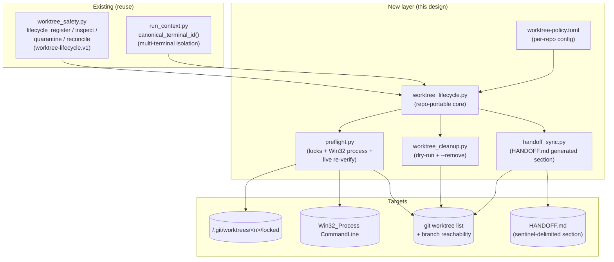
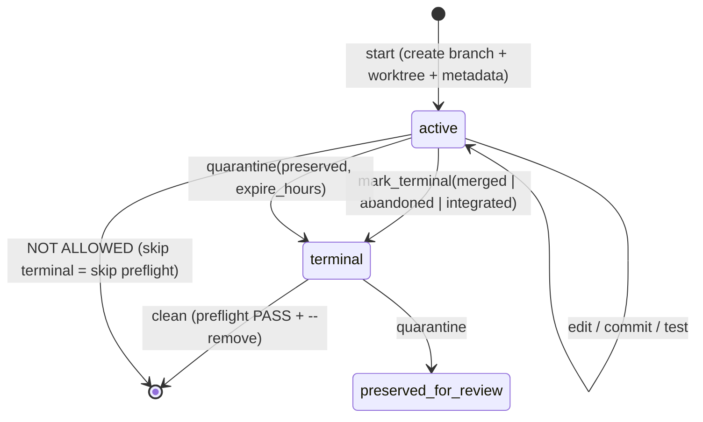

# Worktree Lifecycle Management for `yt-is` and Multi-Worktree Repos

**Author:** (placeholder)
**Date:** 2026-07-18
**Status:** Draft
**Scope:** `P:/packages/yt-is` (pilot) + any future multi-worktree repo under `P:\`
**Triggering incident:** Stale-worktree mess verified live 2026-07-18 (4 worktrees, 1 inside a tracked dir, 1 unreachable branch, stale HANDOFF.md, no naming convention, no lifecycle triggers, no auto-cleanup, no per-worktree metadata).

---

## Overview

`yt-is` (and the broader `P:\` multi-root workspace) accumulated a stale-worktree mess: four worktrees with no owner tracking, one living inside a **tracked** directory of the main repo (`P:/packages/yt-is/.claude/worktrees/ai-task-20260715-182239`, whose gitdir pointer file is committed), one branch (`merge-a2`) with commits **not reachable from `main`** and no owner, a hand-edited `HANDOFF.md` that went stale within 24 hours, no naming convention, no lifecycle triggers, and no cleanup mechanism.

This design specifies a **repo-portable worktree lifecycle layer** that prevents recurrence. It is **built on top of the existing `worktree-lifecycle.v1` primitives already present in `P:/packages/.claude-marketplace/plugins/cc-skills-sdlc/skills/go/scripts/worktree_safety.py`** (lines 466–730) — it generalizes that go-skill-internal layer into a repo-portable module, fixes **three** defects in the existing code (a `git branch -D` call that violates the user's "never destroy code" principle, a missing `import shutil` that makes the cleanup fallback a latent `NameError`, and an unconditional `git worktree remove --force` that bypasses dirty-tree safety), and adds the four pieces the existing layer lacks: a **naming convention**, a **preflight routine** (locks + Win32 process scan + live re-verification), **HANDOFF.md sync**, and a **tracked-gitdir-pointer policy**.

The non-goals are as important as the goals: this is **not** an auto-merging system, **not** an auto-deleting system, and **not** a replacement for `git worktree` itself. Every destructive action requires an explicit preflight pass in the same execution window and an explicit `--remove` flag; the system proposes, the human (or an authorized hook) disposes.

## Background & Motivation

### Verified current state (2026-07-18, this session)

[FACT] `git worktree list` (source: live command, this session) shows two registered worktrees:
- `P:/packages/yt-is` → `main` (`073c4ee`)
- `P:/packages/yt-is/.claude/worktrees/ai-task-20260715-182239` → `ai/import-safe-upsert-20260715-182239` (`4181e27`)

[FACT] The two **external** worktrees (`P:/.worktrees/yt-is-trust-floor-console_c7d7`, `P:/.worktrees/yt-is-refactor-control-planes`) were already removed in Phase C of today's cleanup; `P:/.worktrees/` is now empty/absent.

[FACT] Branch reachability (source: `git merge-base --is-ancestor`, this session):
- `trust-floor/phase-1` → REACHABLE from `main`
- `refactor/yt-is-control-planes` → REACHABLE from `main`
- `ai/import-safe-upsert-20260715-182239` → REACHABLE from `main`
- `merge-a2` → **NOT reachable** from `main` (1 commit ahead, 5 behind)

[FACT] Four annotated backup tags exist (source: `git tag --list "backup/*"`): `backup/trust-floor-phase-1-2026-07-18`, `backup/refactor-control-planes-2026-07-18`, `backup/ai-import-safe-upsert-2026-07-18`, `backup/merge-a2-2026-07-18`. Each points at the corresponding branch tip — so even branch deletion would not lose commits.

[FACT] The remaining AI worktree lives inside a **tracked** path: `git ls-files .claude` includes `.claude/worktrees/ai-task-20260715-182239` (the worktree's gitdir pointer file is committed to `main`). `.claude/worktrees/` is **not** gitignored (`git check-ignore -v .claude/worktrees/foo` returns no match).

[FACT] `HANDOFF.md` was stale before today's Phase B edit: it claimed "C1+C2 Not yet merged to main" while `git log` showed merge commit `073c4ee` at 2026-07-18 01:18. The hand-edited "Worktree status" section was added today but has no mechanism to stay current.

### Existing tooling that MUST be reused (Discovery Before Implementation)

> **Line-number currency note (Issue 1):** all line cites below were verified against the live file this session (`worktree_safety.py`, `orchestrate.py`, `run_record.py`). Re-verify against the file immediately before each PR ships — the file may shift between now and implementation. An engineer copying a cite into a diff must confirm it on the day.

[FACT] `P:/packages/.claude-marketplace/plugins/cc-skills-sdlc/skills/go/scripts/worktree_safety.py` already contains (source: full file read, this session):

- A `worktree-task.v1` metadata schema (per-task JSON, lines 28–215).
- A `worktree-lifecycle.v1` registry schema (lines 466–730) with primitives:
  - `lifecycle_register(worktree_path, branch, run_id, repo_root, worktree_type, owner_session, owner_task, state_dir)`
  - `lifecycle_get_registration(run_id, state_dir)`
  - `lifecycle_mark_terminal(run_id, cleanup_state, state_dir)`
  - `lifecycle_inspect_worktree(worktree_path, repo_root)` — checks disk, git metadata, dirtiness
  - `lifecycle_clean_worktree(...)` (`def` at **line 589**) — **THREE defects, see §Security**: (1) calls `git branch -D` (**line 611**) — CONTRACT VIOLATION; (2) calls `shutil.rmtree(...)` (**line 606**) but `shutil` is **never imported** (imports at lines 19–26 are argparse/json/os/subprocess/sys/datetime/Path/run_context — no `shutil`) → latent `NameError` whenever the rmtree fallback fires; (3) calls `git worktree remove --force` (**line 599**) → bypasses git's dirty-working-tree safety (residual threat, see §Security).
  - `lifecycle_quarantine(...)` — preserves a worktree for review with expiry
  - `lifecycle_reconcile(state_dir, dry_run)` (lines 659–723) — classifies each worktree into **seven** classes: `ACTIVE` / `FOREIGN_OR_UNKNOWN` / `ORPHAN_GIT_METADATA` / `ORPHAN_DIRECTORY` / `RECLAIMABLE` / `PRESERVED_FOR_REVIEW` / `CLEANUP_FAILED` (verified: all seven assignment branches present at lines 693–716).
- Per-terminal state isolation via `_resolve_state_dir()` (`def` at **line 109**; body lines 109–119): resolves to `{cwd}/.claude/.artifacts/{TERMINAL_ID}/go/` by default. **This already satisfies the multi-terminal isolation principle** — no auto-scanning of other terminals' state.
- `MANAGED_WORKTREE_PREFIXES = frozenset({"falsify-", "pi-task-", "wt-"})` (**line 651**) — go-skill-specific; **does not cover** yt-is's `<package>-<purpose>-<terminal>` pattern.

[FACT] **Sibling worktree primitives in the same plugin (must not be reinvented — Issue 4):**
- `orchestrate.create_worktree(dispatch, state_dir, run_id, target_repo)` (`orchestrate.py:1002`) — the go-skill's worktree **creation** path. Creates `<prefix>-task-<ts>-<suffix>` worktrees under `go_worktree_creation_root()`, registers them via `worktree_safety.lifecycle_register`, and writes a `worktree-<run_id>.json` pointer. It does **not** enforce a repo-portable naming policy, does **not** validate the gitignore-of-root rule, and is go-internal (prefix is `pi`/`ai`, not repo-named). The new `worktree_lifecycle.py start` **reuses `create_worktree`'s git mechanics** (`git -C <repo> worktree add -b <branch> <path> HEAD` + `lifecycle_register`) behind a policy-validation + tracked-parent guard that `create_worktree` lacks. See decision **K1a** for the non-overlap rationale.
- `run_record.inventory_worktrees()` (`run_record.py:274`) — wraps `git worktree list --porcelain` (+ `parse_worktree_porcelain`). The new `cmd_list` **reuses this** rather than re-invoking git directly.
- `run_record.current_worktree_path()` (`run_record.py:54`) — `git rev-parse --show-toplevel`. Reused for "am I inside a worktree?" detection.

[FACT] `P:/packages/.claude-marketplace/plugins/cc-skills-sdlc/skills/using-git-worktrees/SKILL.md` already mandates (source: file read, this session):
- Worktrees go in `.worktrees/` (hidden, preferred) or `worktrees/`.
- **MUST verify the directory is gitignored before creating a worktree** (`git check-ignore -q .worktrees`). If not ignored → add to `.gitignore` + commit before proceeding.
- This rule was **violated** by the `ai-task-...` worktree, which lives under `.claude/worktrees/` (tracked, not ignored).

[INFERENCE] The existing layer is ~80% of what we need. The gap is: (a) repo-portable config (not go-skill-hardcoded prefixes), (b) **three** defects in `lifecycle_clean_worktree` — `git branch -D` (line 611) → safe-delete, missing `import shutil` (NameError on the rmtree path), and unconditional `--force` removal (residual destructive surface, superseded by preflight in PR 4); (c) preflight with Win32 process scan + locks, (d) HANDOFF.md sync, (e) tracked-gitdir-pointer policy, (f) branch-reachability-based removal gating. The ~80% figure counts the registry/inspect/quarantine/reconcile primitives in `worktree_safety.py` **plus** the creation+inventory primitives in `orchestrate.py`/`run_record.py` (Issue 4); the new layer is policy + preflight + sync + a policy-validated wrapper around `create_worktree`, not a parallel creation path.

### Pain points (why this can't be hand-discipline)

1. HANDOFF.md went stale in <24 hours despite a hand-edited "Worktree status" section. **Hand-editing does not scale** across sessions, terminals, and merge events.
2. No owner tracking → no way to know whether a worktree is safe to remove. The `ai-task-...` worktree has been idle since 2026-07-15 (3 days) with no signal.
3. The `merge-a2` branch (unreachable from main) would be silently lost on a naive `git worktree remove` + branch delete. Only the backup tag (added today) preserves it.
4. A worktree inside a tracked directory corrupts `main`'s tree: anyone cloning gets a stray gitdir pointer file.

## Goals & Non-Goals

### Goals

1. **G1 — Naming convention.** A documented, machine-checkable pattern: `<package>-<purpose>-<terminal-or-session-id>`.
2. **G2 — Lifecycle triggers.** Explicit `create / mark-done / remove` transitions with documented entry conditions.
3. **G3 — Canonical tracking.** A worktree inventory that is **generated** from `git worktree list` + branch reachability, not hand-edited; stays in sync automatically.
4. **G4 — Auto-cleanup with safety guards.** A dry-run-by-default cleanup command that detects stale/orphan worktrees and proposes removal; **never** force-deletes branches; **never** removes without a fresh preflight pass.
4. **G5 — Multi-terminal safety.** Detect locks and live processes before removal; **no auto-scanning of other terminals' state files** (per `P:/AGENTS.md`).
5. **G6 — HANDOFF.md sync.** A delimited, generated section inside HANDOFF.md that regenerates on every lifecycle event.
6. **G7 — Tracked-gitdir-pointer policy.** A rule + enforcement that worktrees never live under tracked paths; existing violation remediated.
7. **G8 — Branch deletion policy.** Safe-delete (`git branch -d`) only after confirmed reachability from `main`; unreachable branches preserved as refs (backup tag or leave-as-ref).
8. **G9 — Reuse, not reinvent.** Build on `worktree_safety.py` lifecycle primitives; fix its `branch -D` bug; generalize its prefixes via config.

### Non-Goals

1. **Not** an auto-merge system. Merging to `main` stays a human decision (consistent with `P:/AGENTS.md` "Reviewers do not redefine the goal" and the user's "don't destroy code" principle).
2. **Not** a replacement for `git worktree`. We wrap it, we don't reimplement it.
3. **Not** a cross-terminal orchestrator. Per `P:/AGENTS.md`, each terminal writes its own state; we do not auto-discover or mutate other terminals' state files. Cross-terminal safety is achieved via **shared filesystem signals** (git's own `<repo>/.git/worktrees/<name>/locked` files and OS process listing), not by reading other terminals' artifacts.
4. **Not** a CI/CD pipeline. Solo developer (per `P:/.claude/CLAUDE.md`); the mechanism is a local script + optional PreToolUse hook.
5. **Not** retroactive history rewriting. The existing `ai-task-...` tracked pointer is remediated forward (gitignore + remove), not by rewriting `main`'s history.

## Proposed Design

### Architecture overview



The design is **one promoted core module** (`worktree_lifecycle.py`) plus **three thin drivers** (cleanup, preflight, handoff-sync) plus **one per-repo config file**. The core generalizes the sdlc-internal lifecycle layer; the drivers are the user-facing CLI surface.

### Canonical locations

| Artifact | Path | Rationale |
|---|---|---|
| Core module | `P:/packages/.claude-marketplace/plugins/cc-skills-sdlc/skills/go/scripts/worktree_lifecycle.py` (promoted alongside `worktree_safety.py`) | Co-locate with the primitives it generalizes; lives in the sdlc plugin which is already workspace-shared |
| Cleanup CLI | same dir, `worktree_cleanup.py` | Sibling to core |
| Preflight | same dir, `preflight.py` | Sibling to core |
| HANDOFF sync | same dir, `handoff_sync.py` | Sibling to core |
| Per-repo policy | `<repo>/worktree-policy.toml` (e.g. `P:/packages/yt-is/worktree-policy.toml`) | Travels with the repo; each multi-worktree repo declares its own prefixes, canonical branch, HANDOFF path |
| Per-terminal state | `<repo>/.claude/.artifacts/<terminal_id>/worktree-lifecycle/<entry_id>.json` | **Reuses** the existing `_resolve_state_dir()` convention; per-terminal isolation built-in |
| Canonical inventory doc | `<repo>/docs/operations/worktrees.md` (generated) | Per `~/.grok/AGENTS.md` package-docs rule |
| HANDOFF.md inventory section | delimited block inside `<repo>/HANDOFF.md` | HANDOFF stays the cold-start doc; the block is generated, not hand-edited |
| Worktree creation root | `<repo>/.worktrees/` (gitignored) **or** `P:/.worktrees/<package>/` (outside repo) | Per `using-git-worktrees` SKILL.md; **never** under a tracked path |

### A. Naming convention

**Pattern (required):**
```
<package>-<purpose>-<terminal-or-session-id>
```

- `<package>` — repo short-name, lowercase, no slashes (e.g. `yt-is`, `cc-skills-sdlc`).
- `<purpose>` — short kebab-case slug describing the branch of work (e.g. `trust-floor`, `refactor-control-planes`, `import-safe-upsert`). Must match the branch topic; **not** a date.
- `<terminal-or-session-id>` — the canonical terminal id from `run_context.canonical_terminal_id()` (e.g. `console_c7d7...`) or a stable session id. This is the **owner key** for multi-terminal isolation.

**Valid examples:**
- `yt-is-trust-floor-console_c7d7ab12`
- `yt-is-refactor-control-planes-console_0f6b4b0e`
- `cc-skills-sdlc-go-audit-console_d1cca46b`

**Anti-examples (observed, now rejected):**
- `ai-task-20260715-182239` — no package prefix, no terminal id, "ai-task" is content-free, date-only is unstable as an owner key across compaction. **Rejected.**
- `merge-a2` — branch name only; no worktree; no owner. (Allowed as a **branch**, not as a worktree name.)
- `worktrees/w1t4/...` — opaque code, no purpose.

**Enforcement.** `worktree_lifecycle.validate_name(name, policy) -> tuple[bool, str]` is called by `start` and by the reconcile pre-check. A worktree whose name fails validation is classified `FOREIGN_OR_UNKNOWN` by reconcile (not auto-removed).

**Migration.** The existing `ai-task-20260715-182239` worktree is **not** renamed (renaming worktrees is fragile). It is removed (Phase D) once preflight passes; any future work on that branch happens in a correctly-named worktree. The branch `ai/import-safe-upsert-20260715-182239` is preserved as a ref and by backup tag `backup/ai-import-safe-upsert-2026-07-18`.

### B. Lifecycle triggers

State machine (mirrors `worktree-lifecycle.v1` `status` + `cleanup_state` fields):



**CREATE (`start`) entry conditions — all must hold:**
1. Caller supplies `--task-id` (the full `<package>-<purpose>-<terminal>` name) and `--branch`.
2. Name passes `validate_name()`.
3. Worktree creation root is gitignored (`git check-ignore -q <root>`); if not, refuse and print the fix.
4. No existing metadata file for `task_id` unless `--resume`.

> **Implementation note (K1a):** once conditions 1–4 hold, `start` delegates the actual `git worktree add` + `lifecycle_register` to the same mechanics used by `orchestrate.create_worktree` (`orchestrate.py:1002`) — it does **not** re-implement git worktree creation. The new code wraps those mechanics with the policy/tracked-parent checks above.

**MARK-DONE (`mark_terminal`) entry conditions:**
1. Metadata file exists for `task_id`.
2. Caller supplies `cleanup_state ∈ {merged, abandoned, integrated}`.
3. The decision is a **claim** by the owner-terminal; non-owner terminals may mark terminal only with `--force-non-owner` (records `overridden_by` in metadata). This is the multi-terminal safety valve.

**REMOVE (`clean`) entry conditions — the preflight gate (§D):**
1. `status == terminal` (you cannot remove an `active` worktree; mark it terminal first).
2. **Preflight PASS** in the same execution window (see §D).
3. Explicit `--remove` flag (dry-run is default).
4. Branch handling per §H.

### C. Tracking mechanism (canonical inventory)

**The canonical inventory is `git worktree list --porcelain` itself** — git's own on-disk metadata under `<repo>/.git/worktrees/<name>/` is the source of truth. We layer owner metadata on top via the per-terminal `worktree-lifecycle.v1` registry, but we **never** trust the registry over git.

**Sync direction:** git → registry → docs.

1. `git worktree list --porcelain` is the authority for **what worktrees exist**.
2. `lifecycle_reconcile()` cross-references git's list with the registry to classify each worktree. The full classification set is **seven** classes: `ACTIVE` / `FOREIGN_OR_UNKNOWN` / `ORPHAN_GIT_METADATA` / `ORPHAN_DIRECTORY` / `RECLAIMABLE` / `PRESERVED_FOR_REVIEW` / `CLEANUP_FAILED` (the orphan-oriented subset — `ORPHAN_*` / `RECLAIMABLE` / `PRESERVED_FOR_REVIEW` / `CLEANUP_FAILED` — is what cleanup acts on; `ACTIVE` and `FOREIGN_OR_UNKNOWN` are non-actionable informational classes).
3. `handoff_sync.render()` projects the reconciled view into two targets:
   - `<repo>/docs/operations/worktrees.md` (full table + classification + ages)
   - The delimited block inside `<repo>/HANDOFF.md` (compact summary for cold-start)

**Why generated, not hand-edited:** HANDOFF.md's hand-edited section went stale in <24h. Generation eliminates the staleness vector entirely; the section regenerates on every lifecycle event and on an explicit `sync` command.

**HANDOFF.md sentinel block (mermaid-free, markdown-safe):**

```markdown
<!-- BEGIN WORKTREE INVENTORY (generated by handoff_sync.py — do not edit) -->
Last regenerated: 2026-07-18T14:03:11Z by terminal console_c7d7ab12

| Worktree | Branch | Behind main | Reachable | Status | Owner |
|----------|--------|------------:|-----------|--------|-------|
| P:/packages/yt-is | main (073c4ee) | — | — | active | — |
| (none external) | — | — | — | — | — |

Unreachable branches (preserved as refs):
- merge-a2 (250cf51) — backup tag backup/merge-a2-2026-07-18
<!-- END WORKTREE INVENTORY -->
```

The sentinels make the block idempotent: `handoff_sync` locates `BEGIN`/`END`, replaces everything between, leaves the rest of HANDOFF.md untouched.

**Multi-terminal safety of the sync write:** the write uses atomic `.tmp` + `os.replace` (per `P:/.claude/CLAUDE.md` "Atomic JSON Writing" — same pattern for the markdown file). Concurrent terminals writing the same HANDOFF.md is a last-writer-wins on the **generated block only**; because the block is derived from `git worktree list` (shared filesystem truth) and not from per-terminal state, last-writer-wins converges to the same content. The per-terminal registry files are namespaced by `terminal_id` and never collide.

### D. Auto-cleanup mechanism (script spec)

**Command surface:**
```
worktree_cleanup.py --repo-root <path> [--policy <path>] <subcommand> [flags]
  list              # dry-run: classify every worktree + branch
  preflight <path>  # single-worktree preflight; exit 0=PASS, 2=BLOCK
  remove <path>     # require preflight PASS within same window; --force-non-owner
  sync              # regenerate worktrees.md + HANDOFF.md block
```

**Default behavior is dry-run.** `list` never mutates. `remove` requires `--remove` (alias of the `remove` subcommand) AND a fresh preflight.

**What cleanup does NOT do (explicit non-actions):**
1. ❌ Never `git branch -D`. Uses `git branch -d` (safe-delete) only, and only after `git merge-base --is-ancestor <branch> main` confirms reachability.
2. ❌ Never `git worktree remove --force`. The new `cmd_remove` (PR 4) uses plain `git worktree remove` **after** `PF_DIRTY` confirms a clean tree — git's own dirty-tree safety is preserved, never bypassed. (The legacy `lifecycle_clean_worktree` still uses `--force` + `shutil.rmtree(..., ignore_errors=True)`; it is documented as a residual destructive surface in §Security and deprecated as a removal authority once PR 4 lands. PR 1 documents this rather than silently weakening it — see Issue 3.)
3. ❌ Never removes a worktree whose preflight did not pass **in the same process invocation** (no stale preflight; per `P:/packages/yt-is/AGENTS.md` "Time-Sensitive Preflight").
4. ❌ Never removes a worktree registered `active` in another terminal's registry without `--force-non-owner` + recorded `overridden_by`.
5. ❌ Never removes a branch not reachable from `main` without an existing backup tag (auto-creates one if `--auto-tag` given, else refuses).
6. ❌ Never touches worktrees under tracked paths (`<repo>/.claude/worktrees/`, etc.) without `--allow-tracked-parent` AND a printed warning — because removing the worktree leaves a stale tracked gitdir pointer that must be cleaned in a separate commit.

**Concrete function signatures + pseudocode** (repo-portable core):

```python
# worktree_lifecycle.py — repo-portable core (generalizes worktree_safety.py)
from __future__ import annotations
from dataclasses import dataclass, field
from pathlib import Path
from typing import Iterable, Literal
import subprocess, re, os, json
from datetime import datetime, timezone

# Reuse existing primitives (DO NOT reimplement)
import sys as _sys
_s.path.insert(0, str(Path(__file__).parent))
from worktree_safety import (  # noqa: E402
    lifecycle_register, lifecycle_get_registration, lifecycle_mark_terminal,
    lifecycle_inspect_worktree, lifecycle_quarantine, lifecycle_reconcile,
    _resolve_state_dir, _now_iso, _git, _read_json, _write_json,
)

CANONICAL_BRANCH_DEFAULT = "main"

@dataclass
class RepoPolicy:
    """Per-repo config loaded from worktree-policy.toml."""
    package: str                              # e.g. "yt-is"
    canonical_branch: str = CANONICAL_BRANCH_DEFAULT
    handoff_path: Path = Path("HANDOFF.md")
    inventory_doc_path: Path = Path("docs/operations/worktrees.md")
    worktree_creation_root: Path = Path(".worktrees")  # relative to repo
    # Owner segment is config-driven, NOT hardcoded to "console_" (Issue 7).
    # `canonical_terminal_id()` currently always yields a console_-prefixed id
    # (env, ConEmu, and ppid-hash fallbacks all prefix "console_"), but if a
    # future terminal source (tmux_/ssh_/...) appears, every repo's names would
    # silently fail validation. owner_prefix makes this a per-repo knob and is
    # validated separately so the regex stays generic.
    owner_prefix: str = "console_"
    name_pattern: re.Pattern = re.compile(            # enforced
        r"^(?P<pkg>[a-z][a-z0-9-]+)-(?P<purpose>[a-z0-9-]+)-(?P<owner>[a-z]+_[a-z0-9_]+)$"
    )
    managed_prefixes: tuple[str, ...] = ()   # repo-specific extra prefixes
    stale_active_days: int = 7               # ACTIVE + older than this => STALE-ACTIVE
    quarantine_expire_hours: int = 168       # 7 days

def load_policy(repo_root: Path) -> RepoPolicy:
    """Read <repo>/worktree-policy.toml; fall back to defaults."""
    # ... tomllib.load ...
    return RepoPolicy(package=repo_root.name)

def validate_name(name: str, policy: RepoPolicy) -> tuple[bool, str]:
    """Return (ok, reason). Reason empty when ok."""
    if name.startswith(policy.managed_prefixes):
        return True, "matched managed prefix"
    m = policy.name_pattern.match(name)
    if not m:
        return False, (f"name '{name}' does not match <package>-<purpose>-<terminal>; "
                       f"pattern={policy.name_pattern.pattern}")
    # Owner prefix is validated separately so the regex stays generic (Issue 7):
    # today always console_, but config-driven in case a non-console_ terminal
    # source appears.
    owner = m.group("owner")
    if not owner.startswith(policy.owner_prefix):
        return False, (f"owner segment '{owner}' does not start with configured "
                       f"owner_prefix='{policy.owner_prefix}'")
    return True, ""

# ---- Branch-reachability-safe deletion (FIXES worktree_safety.py bug) ----

def safe_delete_branch(repo: Path, branch: str, policy: RepoPolicy,
                       *, auto_tag: bool = False) -> dict:
    """Delete branch ONLY if reachable from canonical; else preserve as ref.

    Replaces the unsafe `git branch -D` at worktree_safety.py:611.
    Returns a report dict; never raises on git failure (records error).
    """
    report = {"branch": branch, "action": "none", "tag_created": "",
              "branch_deleted": False, "reason": "", "errors": []}
    canonical = policy.canonical_branch
    anc = _git(repo, "merge-base", "--is-ancestor", branch, canonical)
    reachable = (anc.returncode == 0)
    if reachable:
        bd = _git(repo, "branch", "-d", branch)   # safe-delete; refuses unmerged
        if bd.returncode == 0:
            report["action"] = "branch-deleted-safe"
            report["branch_deleted"] = True
        else:
            # git refused even though ancestor — shouldn't happen; record + fall back
            report["errors"].append(f"git branch -d: {bd.stderr.strip()}")
            report["action"] = "branch-delete-refused"
        return report
    # NOT reachable from canonical — preserve
    if auto_tag:
        ts = datetime.now(timezone.utc).strftime("%Y-%m-%d")
        slug = branch.replace("/", "-")
        tag = f"backup/{slug}-{ts}"
        _git(repo, "tag", "-a", tag, "-m",
             f"backup before worktree cleanup (branch {branch} not reachable from {canonical})")
        report["tag_created"] = tag
        report["action"] = "preserved-via-backup-tag"
        report["reason"] = f"not reachable from {canonical}; backup tag created"
    else:
        report["action"] = "preserved-as-ref"
        report["reason"] = (f"{branch} NOT reachable from {canonical}; "
                            "left as ref. Re-run with --auto-tag to tag+delete.")
    return report
```

**Cleanup driver** (the user-facing CLI):

```python
# worktree_cleanup.py
def cmd_list(args) -> int:
    policy = load_policy(Path(args.repo_root))
    state_dir = _resolve_state_dir(args.state_dir)
    rec = lifecycle_reconcile(state_dir, dry_run=True)  # existing primitive
    # Augment each entry with branch reachability + age + name validity
    repo = Path(args.repo_root)
    for e in rec["entries"]:
        ok, reason = validate_name(Path(e["path"]).name, policy)
        e["name_valid"] = ok
        e["name_reason"] = reason
        if e["branch"]:
            anc = _git(repo, "merge-base", "--is-ancestor", e["branch"],
                       policy.canonical_branch)
            e["reachable_from_canonical"] = (anc.returncode == 0)
    print(json.dumps(rec, indent=2) if args.json else _render_list(rec))
    return 0

def cmd_remove(args) -> int:
    policy = load_policy(Path(args.repo_root))
    repo = Path(args.repo_root)
    target = Path(args.path)
    # 1. Fresh preflight in THIS window (Time-Sensitive Preflight rule)
    pf = preflight_run(target, repo, policy)
    if not pf["pass"]:
        print(f"ERROR: preflight BLOCK for {target}", file=sys.stderr)
        for f in pf["findings"]:
            print(f"  [{f['severity']}] {f['code']}: {f['message']}", file=sys.stderr)
        return 2
    # 2. Branch handling — NEVER -D
    branch = pf["branch"]
    if branch:
        rep = safe_delete_branch(repo, branch, policy, auto_tag=args.auto_tag)
        if rep["errors"]:
            print(f"WARNING: branch handling errors: {rep['errors']}", file=sys.stderr)
    # 3. Remove the worktree (git first, then rmtree fallback)
    rm = _git(repo, "worktree", "remove", str(target))
    if rm.returncode != 0:
        print(f"WARNING: git worktree remove: {rm.stderr.strip()}", file=sys.stderr)
    # 4. Tracked-gitdir-pointer cleanup (§G)
    _clean_tracked_pointer(repo, target, policy)
    # 5. Mark terminal in registry
    lifecycle_mark_terminal(pf.get("run_id", target.name), "cleaned",
                            _resolve_state_dir(args.state_dir))
    # 6. Sync docs
    cmd_sync(args)
    return 0
```

### E. Multi-terminal safety (preflight routine)

The preflight is the **only** gate that permits removal. It runs:
- **Every time** `remove` is invoked (no cached preflight older than the current process).
- **Optionally** as a PreToolUse hook on `git worktree remove` (advisory by default).

**`preflight.py` — concrete spec:**

```python
# preflight.py
from dataclasses import dataclass, field
from typing import Literal
import subprocess, os

Severity = Literal["block", "warn", "info"]

@dataclass
class Finding:
    code: str
    severity: Severity
    message: str
    evidence: str = ""

@dataclass
class PreflightReport:
    pass_: bool = False
    findings: list[Finding] = field(default_factory=list)

def preflight_run(worktree_path: Path, repo_root: Path,
                  policy: "RepoPolicy") -> PreflightReport:
    """Run ALL checks in one window. pass_ = no [block] finding."""
    r = PreflightReport()
    checks = [
        _check_worktree_exists,
        _check_git_registered,
        _check_lock_file,
        _check_win32_processes,
        _check_dirty,
        _check_branch_reachability,
        _check_other_terminal_ownership,
        _check_tracked_parent,
    ]
    for chk in checks:
        chk(worktree_path, repo_root, policy, r)
    r.pass_ = not any(f.severity == "block" for f in r.findings)
    r.findings.append(Finding(
        code="PF_TIMESTAMP", severity="info",
        message=f"preflight at {datetime.now(timezone.utc).isoformat()}",
    ))
    return r

def _check_worktree_exists(wt, repo, policy, r):
    if not wt.is_dir():
        r.findings.append(Finding("PF_NO_DIR", "block",
            f"worktree directory missing: {wt}"))

def _check_git_registered(wt, repo, policy, r):
    # Live re-verification — never trust cached state
    p = _git(repo, "worktree", "list", "--porcelain")
    registered = any(line.startswith("worktree ") and
                     Path(line[9:].strip()).resolve() == wt.resolve()
                     for line in p.stdout.splitlines())
    if not registered:
        r.findings.append(Finding("PF_NOT_REGISTERED", "block",
            f"{wt} not in `git worktree list` (live re-check)"))

def _check_lock_file(wt, repo, policy, r):
    # git's own per-worktree lock: <repo>/.git/worktrees/<name>/locked
    gitdir_meta = _find_worktree_meta(repo, wt)  # resolves the admin dir
    if gitdir_meta is None:
        r.findings.append(Finding("PF_NO_META", "block",
            "cannot resolve worktree admin dir under .git/worktrees/"))
        return
    locked = gitdir_meta / "locked"
    if locked.exists():
        reason = locked.read_text(encoding="utf-8", errors="replace").strip()
        r.findings.append(Finding("PF_LOCKED", "block",
            f"worktree is git-locked: {reason or '(no reason)'}",
            evidence=str(locked)))

def _check_win32_processes(wt, repo, policy, r):
    """Detect processes whose CommandLine references the worktree path.

    Uses Get-CimInstance Win32_Process (PowerShell). The worktree path is
    passed to PowerShell via the WT_PATH environment variable and read out as
    $env:WT_PATH — it is **never** string-interpolated into the command. This
    removes the PowerShell-injection surface entirely (no metacharacter
    allow-list to maintain); even a crafted path containing quotes, backticks,
    or `$` cannot escape the -Contains argument. This is a SHARED filesystem
    signal (OS process table), not a read of another terminal's state files —
    compliant with P:/AGENTS.md multi-terminal rule. See §Security.
    """
    if os.name != "nt":
        return  # no-op on non-Windows
    # Pass the path via env, NOT via string interpolation (Issue 9 hardening).
    scan_env = {**os.environ, "WT_PATH": str(wt.resolve())}
    ps = (
        "$wt = $env:WT_PATH.ToLower().Replace('\\\\','/'); "
        "Get-CimInstance Win32_Process | "
        "Where-Object { $_.CommandLine -and "
        "$_.CommandLine.ToLower().Replace('\\\\','/').Contains($wt) } | "
        "Select-Object ProcessId, CommandLine | ConvertTo-Json"
    )
    proc = subprocess.run(["powershell", "-NoProfile", "-Command", ps],
                          capture_output=True, text=True, timeout=20,
                          env=scan_env)
    if proc.returncode != 0:
        r.findings.append(Finding("PF_PROC_SCAN_FAIL", "warn",
            f"process scan failed: {proc.stderr.strip()[:200]}"))
        return
    hits = _parse_ps_json(proc.stdout)
    if hits:
        pids = [str(h.get("ProcessId")) for h in hits]
        r.findings.append(Finding("PF_IN_USE", "block",
            f"{len(hits)} process(es) reference {wt}: PIDs {','.join(pids)}"))

def _check_dirty(wt, repo, policy, r):
    p = _git(wt, "status", "--porcelain")
    if p.stdout.strip():
        r.findings.append(Finding("PF_DIRTY", "block",
            "worktree has uncommitted changes; commit/stash first",
            evidence=p.stdout[:300]))

def _check_branch_reachability(wt, repo, policy, r):
    branch = _worktree_branch(repo, wt)
    if not branch:
        r.findings.append(Finding("PF_NO_BRANCH", "warn",
            "detached HEAD or no branch — reachability skip"))
        return
    anc = _git(repo, "merge-base", "--is-ancestor", branch,
               policy.canonical_branch)
    if anc.returncode != 0:
        r.findings.append(Finding("PF_BRANCH_UNREACHABLE", "block",
            f"{branch} NOT reachable from {policy.canonical_branch}; "
            "use --auto-tag to create backup/<branch>-<date> before removing, "
            "or re-run with --force-non-owner + explicit ack"))

def _check_other_terminal_ownership(wt, repo, policy, r):
    """Registry is per-terminal; we CANNOT see other terminals' state files
    (P:/AGENTS.md). We CAN check the shared git lock + process table, already
    done above. This check only flags if THIS terminal's registry marks the
    worktree active AND the caller is not the recorded owner."""
    my_state = _resolve_state_dir(None)
    entry = lifecycle_get_registration(wt.name, my_state)
    if not entry:
        return  # not ours to veto
    if entry.get("status") == "active":
        r.findings.append(Finding("PF_REGISTRY_ACTIVE_OURS", "warn",
            f"our registry marks {wt.name} active; "
            "mark terminal first or use --force-non-owner"))

def _check_tracked_parent(wt, repo, policy, r):
    """Reject removal of worktrees under tracked paths unless explicitly allowed."""
    try:
        rel = wt.resolve().relative_to(repo.resolve())
    except ValueError:
        return  # outside repo (e.g. P:/.worktrees/...) — fine
    tracked = _git(repo, "ls-files", "--", str(rel.parent))
    if tracked.stdout.strip() and not _is_gitignored(repo, rel.parent):
        r.findings.append(Finding("PF_TRACKED_PARENT", "block",
            f"{rel.parent} is a TRACKED directory; removing the worktree "
            "leaves a stale committed gitdir pointer. Use --allow-tracked-parent "
            "AND commit the pointer removal in a follow-up."))
```

**Helper functions referenced by the preflight (Issue 5 — these are new, spec'd here so the preflight block is implementable as-is):**

| Helper | Signature | Behavior / git command it wraps |
|---|---|---|
| `_find_worktree_meta(repo, wt) -> Path \| None` | resolves the worktree's **git admin dir** under `<repo>/.git/worktrees/<admin_name>/` | Reads the `.git` pointer file inside the worktree (`<wt>/.git`), which contains a single line `gitdir: <repo>/.git/worktrees/<admin_name>`. Returns that path (a directory containing `HEAD`, `locked`, etc.), or `None` if the pointer is missing/malformed. **Do NOT** assume `<admin_name>` equals `wt.name` — git may name the admin dir differently; the `.git` pointer is the authoritative resolution. |
| `_worktree_branch(repo, wt) -> str` | the branch checked out in `wt`, or `""` for detached HEAD | Wraps `git -C <wt> rev-parse --abbrev-ref HEAD`; returns `""` when the output is `HEAD` (detached). |
| `_parse_ps_json(stdout) -> list[dict]` | parse `ConvertTo-Json` output from the Win32 process scan | `ConvertTo-Json` emits a single object when there is exactly one match and a JSON array when there are several; this helper `json.loads` the stdout and normalizes both cases to a `list[dict]`. Returns `[]` on empty/invalid stdout (a scan that found nothing emits nothing). |
| `_is_gitignored(repo, rel) -> bool` | whether `rel` (repo-relative path) is ignored | Wraps `git -C <repo> check-ignore -q -- <rel>`; returns `True` iff exit code is 0. |

All four are small, pure, and tested with a real temp worktree + real `.git` pointer in PR 3. `_find_worktree_meta` is the only non-trivial one; it is specified to read the pointer file (not to guess the admin name) precisely because the admin dir name is not stable.

**Frequency:** preflight runs **exactly once per `remove` invocation, in-process, immediately before the destructive op**. No cached results. Per `P:/packages/yt-is/AGENTS.md` "Time-Sensitive Preflight": an earlier pass is not current.

**State that must hold for safe removal (all of):**
1. Directory exists (`PF_NO_DIR` passes).
2. Git registers it (`PF_NOT_REGISTERED` passes — live re-check).
3. Not git-locked (`PF_LOCKED` passes).
4. No Win32 process references the path (`PF_IN_USE` passes).
5. Working tree clean (`PF_DIRTY` passes).
6. Branch reachable from canonical OR `--auto-tag` will preserve (`PF_BRANCH_UNREACHABLE` resolved).
7. Not under a tracked parent unless `--allow-tracked-parent` (`PF_TRACKED_PARENT` passes).
8. Our own registry doesn't mark it active, or `--force-non-owner`.

### F. HANDOFF.md sync

**Triggers (when the inventory block must regenerate):**
1. Immediately after `start` (new worktree).
2. Immediately after `remove` (worktree gone).
3. Immediately after `mark_terminal` (status change).
4. Immediately after `git fetch origin` if `main` moved and any worktree's "behind main" count changed (optional; covered by `sync` subcommand).
5. On cold-start: an agent reading HANDOFF.md should run `worktree_cleanup.py sync` if the regenerated timestamp is older than the most recent `git reflog` entry for `main`.

**Implementation** (`handoff_sync.py`):

```python
BEGIN = "<!-- BEGIN WORKTREE INVENTORY (generated by handoff_sync.py — do not edit) -->"
END   = "<!-- END WORKTREE INVENTORY -->"

def render_block(repo: Path, policy: RepoPolicy) -> str:
    rec = lifecycle_reconcile(_resolve_state_dir(None), dry_run=True)
    now = datetime.now(timezone.utc).strftime("%Y-%m-%dT%H:%M:%SZ")
    tid = os.environ.get("TERMINAL_ID", "unknown")
    lines = [BEGIN, f"Last regenerated: {now} by terminal {tid}", ""]
    lines += ["| Worktree | Branch | Behind main | Reachable | Status | Owner |",
              "|----------|--------|------------:|-----------|--------|-------|"]
    # ... iterate rec["entries"], compute behind-count via git rev-list --count ...
    # ... append unreachable-branches section ...
    lines += ["", END]
    return "\n".join(lines)

def sync_handoff(repo: Path, policy: RepoPolicy) -> None:
    hp = repo / policy.handoff_path
    text = hp.read_text(encoding="utf-8") if hp.exists() else ""
    block = render_block(repo, policy)
    if BEGIN in text and END in text:
        before, _, after = text.partition(BEGIN)
        after = after.split(END, 1)[1]
        new = before + block + after
    else:
        new = text.rstrip() + "\n\n" + block + "\n"
    tmp = hp.with_suffix(hp.suffix + ".tmp")
    tmp.write_text(new, encoding="utf-8")
    os.replace(tmp, hp)  # atomic
```

**Why a sentinel block and not a separate file?** Per `P:/packages/yt-is/HANDOFF.md` and the task brief, "HANDOFF.md is the canonical state-record for the package; future agents read it on cold-start." A separate inventory file would fragment cold-start reading. The sentinel block keeps HANDOFF.md as the single cold-start doc while making the inventory section authoritative-current. The fuller `docs/operations/worktrees.md` is the deep-dive companion.

**Residual staleness window (Issue 8 — stated as a known trade-off, not implied solved):** the block is accurate **at generation time** but can drift between lifecycle events. The block only regenerates on (1) lifecycle events, (2) explicit `sync`, or (3) cold-start if the regenerated timestamp predates the most recent `main` reflog entry. Triggers 1 and 2 are reliable; trigger 3 is **advisory** — it depends on an agent choosing to run `sync` at cold-start, which is exactly the discipline that failed for the hand-edited section. Between the last lifecycle event and the next cold-start `sync`, the block can drift (e.g. a merge lands in another terminal and the "behind main" counts go stale). This **reduces** the staleness problem (generation eliminates the hand-edit drift vector) but does **not eliminate** it. The window is closed by a `post-merge`/`post-commit` hook that regenerates the block — **deferred per Open Question 4**; this section cross-references OQ4 as the resolution path.

### G. Tracked-gitdir-pointer handling

**The problem, restated:** `P:/packages/yt-is/.claude/worktrees/ai-task-20260715-182239` is a worktree whose **gitdir pointer file** (`.claude/worktrees/ai-task-20260715-182239`, a small text file pointing at `.git/worktrees/.../`) is **committed to `main`**. Cloning the repo yields a broken pointer. This violates the `using-git-worktrees` SKILL.md rule that worktree roots must be gitignored.

**Policy (forward):**
1. Worktrees MUST NOT be created under any tracked path. `preflight.PF_TRACKED_PARENT` blocks this at creation time (the `start` command also checks).
2. The directory `.claude/worktrees/` in `yt-is` is **reserved as a workspace pattern** and must be:
   - **gitignored** (add `.claude/worktrees/` to `.gitignore`), AND
   - **kept as a directory slot** via `.claude/worktrees/.gitkeep` (tracked), so the path exists for any tooling that expects it, while worktree contents are never tracked.
3. The existing tracked pointer file (`.claude/worktrees/ai-task-20260715-182239`) is **removed in a follow-up commit** once the worktree itself is removed (Phase D). This is a forward cleanup, not a history rewrite.

**`_clean_tracked_pointer` (called by `cmd_remove` when `PF_TRACKED_PARENT` was overridden):**

```python
def _clean_tracked_pointer(repo: Path, wt: Path, policy: RepoPolicy) -> None:
    """After removing a worktree that lived under a tracked parent, also
    remove the now-stale gitdir pointer file from the index."""
    try:
        rel = wt.resolve().relative_to(repo.resolve())
    except ValueError:
        return
    tracked = _git(repo, "ls-files", "--", str(rel))
    if tracked.stdout.strip():
        _git(repo, "rm", "--quiet", str(rel))
        # NOTE: does NOT commit — leaves staged for the human to review
        print(f"staged removal of tracked pointer: {rel} (review + commit)")
```

**Why `--allow-tracked-parent` is block-by-default:** removing a worktree under a tracked path is a **two-commit operation** (remove worktree + remove pointer). Doing the second automatically would hide the index change from the human. Default-block forces awareness.

### H. Branch deletion policy

**Decision tree (implemented in `safe_delete_branch`):**

```mermaid
flowchart TD
    START([remove worktree]) --> Q1{Branch reachable<br/>from main?}
    Q1 -- yes --> SD[git branch -d<br/>(safe-delete)]
    Q1 -- no --> Q2{--auto-tag given?}
    Q2 -- yes --> TAG[create backup/slug-date<br/>annotated tag]
    TAG --> LEAVE[leave branch as ref<br/>print tag name]
    Q2 -- no --> REFUSE[refuse; print<br/>'re-run with --auto-tag']
    SD --> DONE([done])
    LEAVE --> DONE
    REFUSE --> DONE
```

**The `merge-a2` case:** `merge-a2` (250cf51) is NOT reachable from `main`. Today a backup tag (`backup/merge-a2-2026-07-18`) already exists. Under this design, `safe_delete_branch("merge-a2", auto_tag=False)` would return `action="preserved-as-ref"` and refuse; `auto_tag=True` would create a **new** dated tag only if no `backup/merge-a2-*` tag already exists (dedup by slug prefix). The branch stays as a ref until the human explicitly deletes it after reviewing the tag.

**Why never `-D`:** the user's principle #4 ("Don't destroy code — never `git branch -D`") is a hard rule. `git branch -d` refuses to delete unmerged branches (git's own safety), which is exactly the property we want. The design adds **reachability from canonical** as an additional, stricter gate (a branch can be `-d`-deletable in git's view via a merge into another branch, yet still not reachable from `main` — we want the stricter check).

**Backup tag dedup:** before creating `backup/<slug>-<date>`, the script lists existing `backup/<slug>-*` tags; if one exists pointing at the same commit, it reuses it and skips tag creation.

## API / Interface Changes

### Before (today, ad-hoc)

```bash
# No convention; manual creation
git worktree add -b ai/import-safe-upsert-20260715-182239 \
  .claude/worktrees/ai-task-20260715-182239   # WRONG: tracked parent
git branch -D <branch>                         # WRONG: destroys code
# HANDOFF.md edited by hand; goes stale
```

### After (this design)

```bash
# Create
python worktree_lifecycle.py start \
  --task-id yt-is-trust-floor-console_c7d7ab12 \
  --branch trust-floor/phase-1 \
  --repo-root P:/packages/yt-is \
  --intended-files csf/cache.py,csf/shared_retry_pool.py

# Inspect
python worktree_cleanup.py list --repo-root P:/packages/yt-is --json

# Preflight (single worktree)
python worktree_cleanup.py preflight \
  --repo-root P:/packages/yt-is \
  P:/packages/yt-is/.worktrees/yt-is-trust-floor-console_c7d7ab12

# Remove (preflight runs again in the same process)
python worktree_cleanup.py remove \
  --repo-root P:/packages/yt-is \
  --auto-tag \
  P:/packages/yt-is/.worktrees/yt-is-trust-floor-console_c7d7ab12

# Sync docs
python worktree_cleanup.py sync --repo-root P:/packages/yt-is
```

### New interfaces (signatures)

| Function | Module | Purpose |
|---|---|---|
| `load_policy(repo_root) -> RepoPolicy` | `worktree_lifecycle` | Load per-repo config |
| `validate_name(name, policy) -> (bool, str)` | `worktree_lifecycle` | Enforce naming convention |
| `safe_delete_branch(repo, branch, policy, *, auto_tag) -> dict` | `worktree_lifecycle` | **Replaces** `worktree_safety.py:611` `git branch -D` |
| `preflight_run(wt, repo, policy) -> PreflightReport` | `preflight` | All-gates check; the only removal authority |
| `cmd_list / cmd_remove / cmd_sync` | `worktree_cleanup` | CLI surface |
| `render_block(repo, policy) -> str` / `sync_handoff(repo, policy)` | `handoff_sync` | HANDOFF.md delimited block |

### Modified interfaces (existing)

| Symbol | File:Line | Change |
|---|---|---|
| `lifecycle_clean_worktree` | `worktree_safety.py:589` | Fix **three** defects: add `import shutil` (fixes `NameError` at line 606); replace inline `git branch -D` (line 611) with a call to inline reachability-safe deletion; **document** that `git worktree remove --force` (line 599) remains as a known residual destructive surface until PR 4's preflight-gated `cmd_remove` supersedes this function (see §Security). Preserve signature; add `auto_tag=False` kwarg. |
| `MANAGED_WORKTREE_PREFIXES` | `worktree_safety.py:651` | Keep as default; merge with `policy.managed_prefixes` at runtime. |
| `_resolve_state_dir` | `worktree_safety.py:109` | Unchanged — already multi-terminal-correct. |

## Data Model Changes

### New: `worktree-policy.toml` (per repo)

```toml
# P:/packages/yt-is/worktree-policy.toml
package = "yt-is"
canonical_branch = "main"
handoff_path = "HANDOFF.md"
inventory_doc_path = "docs/operations/worktrees.md"
worktree_creation_root = ".worktrees"
managed_prefixes = ["yt-is-"]          # repo-specific
owner_prefix = "console_"              # config-driven owner segment prefix (Issue 7)
stale_active_days = 7
quarantine_expire_hours = 168

[name_pattern]
# Captures <package>-<purpose>-<terminal>. Owner segment is generic; the prefix
# is validated separately against `owner_prefix` above (Issue 7).
regex = "^(?P<pkg>[a-z][a-z0-9-]+)-(?P<purpose>[a-z0-9-]+)-(?P<owner>[a-z]+_[a-z0-9_]+)$"
```

### Existing: `worktree-lifecycle.v1` registry entry (unchanged schema)

Already defined at `worktree_safety.py:496`. Per-terminal file at `<repo>/.claude/.artifacts/<terminal_id>/worktree-lifecycle/<entry_id>.json`. **No schema change** — we only add policy-driven population.

### Existing: `worktree-task.v1` metadata (unchanged)

Already defined at `worktree_safety.py:178`. **No schema change.**

### New: `worktrees.md` (generated)

Section schema:
- `regenerated_at` (ISO timestamp)
- `regenerated_by` (terminal id)
- `worktrees[]`: `{path, branch, head_short, behind_main, reachable, classification, owner, age_days}`
- `unreachable_branches[]`: `{branch, head_short, protected_by_tag}`
- `policy_snapshot`: `{canonical_branch, stale_active_days}`

### Migration strategy

1. **No data migration.** The registry/metadata formats are unchanged.
2. **Policy introduction** is additive: repos without `worktree-policy.toml` use defaults.
3. **The existing `ai-task-...` worktree** is removed via the new `remove` path (with `--allow-tracked-parent`), and the tracked pointer is staged for a follow-up commit.
4. **`worktree_safety.py` `lifecycle_clean_worktree`** — PR 1 adds `import shutil`, replaces `git branch -D` (line 611) with `safe_delete_branch`, and documents the `--force`/rmtree residual; PR 2 extracts `safe_delete_branch` into the new core. The branch-deletion change is a **bug fix**, not a breaking API change (signature preserved with new optional kwarg).

## Alternatives Considered

All alternatives share one assumption: **the existing `git worktree` command is the substrate**; we are choosing how to layer lifecycle policy on top. The axis that distinguishes them is **where policy lives** (script vs. hook vs. convention-only) and **how destructive ops are gated** (preflight vs. confirmation vs. none).

### Alternative 1: Convention-only (no code)

**What:** Document the naming pattern, lifecycle triggers, and HANDOFF.md section in `P:/packages/yt-is/AGENTS.md`; rely on agent discipline.

**Pros:** Zero code; zero maintenance; zero risk of buggy automation.
**Cons:** This is exactly what failed. HANDOFF.md's hand-edited section went stale in <24h. The `ai-task-...` worktree sat idle 3 days. Discipline-only fails across session boundaries and compaction.

**Selection criterion (reliability across cold-starts):** Fails. Rejected.

### Alternative 2: Pure PreToolUse hook (block at edit time)

**What:** A hook that blocks any `git worktree` invocation that doesn't conform to the naming policy or preflight.

**Pros:** Catches violations at the earliest possible point; no separate CLI to remember.
**Cons:**
- Hooks fire per-tool-call; they cannot enforce "preflight within the same execution window as removal" because the removal is itself a single bash call. The hook would have to run preflight **inside** the hook handler — possible, but then the hook IS the cleanup script, just invoked differently.
- Hooks are host-specific (Grok Build harness here; Claude Code elsewhere). A repo-portable design shouldn't depend on a specific hook host.
- The existing `worktree_safety_PreToolUse.py` (lines 1–78) already shows the pattern; it warns on integration-sensitive file edits, not on worktree lifecycle.

**Selection criterion (portability across harnesses):** Fails. Rejected as primary; **kept as optional advisory layer** (see Rollout).

### Alternative 3: A separate `worktrees/` Git-tracked manifest file

**What:** Commit a `worktrees.yaml` manifest listing every worktree + owner + status; update it on every lifecycle event.

**Pros:** Version-controlled history of worktree state.
**Cons:**
- The manifest would be a **second source of truth** alongside `git worktree list`. Drift between them is inevitable (the whole problem with HANDOFF.md).
- Every lifecycle event creates a commit → noisy history; conflicts when two terminals work concurrently.
- Violates the user's "immune to stale data" principle: a committed manifest is stale by definition between events.

**Selection criterion (single source of truth):** Fails. Rejected.

### Chosen: Generated-from-git + per-terminal registry + opt-in hook

**Why it wins on the selection criterion (reliability-per-portability):**
- Source of truth is `git worktree list` itself (can't drift from git).
- Per-terminal registry adds owner metadata without a global mutable file.
- HANDOFF.md block is generated, not hand-edited → eliminates the staleness vector.
- CLI works in any harness (pure Python on Windows); hook is optional.

## Security & Privacy Considerations

### Threat model

| Threat | Severity | Mitigation |
|---|---|---|
| Accidental loss of unmerged work via `git branch -D` | **High** | `safe_delete_branch` never uses `-D`; uses `-d` + reachability check + backup-tag fallback. **Fixes existing bug at `worktree_safety.py:611`.** |
| `NameError: shutil` aborts `lifecycle_clean_worktree` mid-cleanup | **High** | PR 1 adds `import shutil`. Falsifier: a cleanup where `git worktree remove` leaves a dir must NOT raise — the rmtree fallback must run and record `directory_removed`. |
| Uncommitted changes lost via `--force` removal (existing `lifecycle_clean_worktree`) | **High** | The existing function calls `git worktree remove --force` (line 599) **and** `shutil.rmtree(..., ignore_errors=True)` (line 606), both of which bypass git's dirty-tree safety. PR 1 does **not** silently weaken this (a partial fix — dropping `--force` alone — would create a false sense of safety, since the `ignore_errors=True` rmtree fallback still destroys data). Instead: (a) the **new** `cmd_remove` (PR 4) is the authoritative safe path — it runs `PF_DIRTY` first, then `git worktree remove` **without** `--force`; (b) `lifecycle_clean_worktree`'s `--force`+rmtree behavior is documented as a residual destructive surface and deprecated as a removal authority once PR 4 lands; (c) callers are migrated to `cmd_remove`. Until that migration, no caller should invoke `lifecycle_clean_worktree` on a worktree that may have uncommitted work. |
| Removing a worktree another terminal is actively using | **High** | `PF_LOCKED` (git lock file) + `PF_IN_USE` (Win32 process scan) — both block-level preflight gates. |
| Removing a worktree with uncommitted changes | **High** | `PF_DIRTY` block-level gate. |
| Stale preflight authorizing removal | **Medium** | Preflight runs only in-process, same invocation as removal; no cached results. Timestamp finding recorded. |
| HANDOFF.md write race across terminals | **Low** | Atomic `.tmp` + `os.replace`; generated block derived from shared git truth, so last-writer-wins converges. |
| Worktree under tracked path corrupting clones | **Medium** | `PF_TRACKED_PARENT` block + `--allow-tracked-parent` override + `_clean_tracked_pointer` staging step. |
| Backup tag namespace collision | **Low** | `safe_delete_branch` dedups by `backup/<slug>-*` prefix before creating. |
| PowerShell injection via worktree path in process scan | **Medium** | Path is passed to the scan via an **environment variable** (`$env:WT_PATH`) read inside PowerShell — it is **never string-interpolated** into the command. This removes the injection surface entirely (no allow-list of shell metacharacters to maintain). See §E `_check_win32_processes`. |

### Auth

No auth surface. The system operates entirely on local git + local filesystem.

### Data handling

- Per-terminal state files at `<repo>/.claude/.artifacts/<terminal_id>/worktree-lifecycle/*.json` may contain branch names, owner terminal ids, and worktree paths. No secrets. These are per-terminal and never auto-scanned by other terminals (per `P:/AGENTS.md`).
- Backup tags are annotated with branch name + date — no PII.

## Observability

### Logging

Every `start / mark_terminal / remove / sync` invocation appends a JSONL line to `<repo>/.claude/.artifacts/<terminal_id>/worktree-lifecycle/audit.jsonl`:

```json
{"ts":"2026-07-18T14:03:11Z","terminal":"console_c7d7ab12","cmd":"remove",
 "worktree":"P:/packages/yt-is/.worktrees/yt-is-trust-floor-console_c7d7ab12",
 "branch":"trust-floor/phase-1","preflight_pass":true,
 "branch_action":"branch-deleted-safe","tag_created":"","actor":"human"}
```

### Metrics (derived, offline)

- `worktree_count` per repo (from `list`)
- `worktree_age_days_p50/p95` (from `created_at` in registry)
- `stale_active_count` (ACTIVE + age > `stale_active_days`)
- `preflight_block_count` by code (`PF_DIRTY`, `PF_LOCKED`, `PF_IN_USE`, etc.)
- `unreachable_branch_count`

These are computed on demand by `list --json`; no always-on daemon.

### Alerting

Solo developer; no daemon. The cold-start convention (read HANDOFF.md → if regenerated timestamp older than last `main` reflog entry, run `sync`) is the alerting analog. A `list` that reports any `STALE-ACTIVE` or `ORPHAN_*` classification is the actionable signal.

## Rollout Plan

### Staged rollout

**Stage 0 — Fix the three defects in `lifecycle_clean_worktree` (smallest diff, highest severity).**
PR 1: add `import shutil` (fixes the `NameError` at line 606), replace `git branch -D` (line 611) with reachability-safe deletion, and document the residual `--force`+rmtree destructive surface (line 599/606). Ships first, independent of the rest.

**Stage 1 — Core module + policy for `yt-is`.**
Add `worktree_lifecycle.py`, `preflight.py`, `worktree_cleanup.py`, `handoff_sync.py`. Add `P:/packages/yt-is/worktree-policy.toml`. Run `list` to baseline current state.

**Stage 2 — Remediate the existing mess.**
Use `worktree_cleanup.py remove --allow-tracked-parent --auto-tag` on the `ai-task-...` worktree. Decide on `merge-a2` (preserve as ref per §H). Add `.claude/worktrees/` to `.gitignore` + `.gitkeep`. Commit the tracked-pointer removal.

**Stage 3 — Opt-in PreToolUse hook.**
Register `worktree_safety_PreToolUse.py`-style advisory for `git worktree` invocations in `yt-is` (warn-only by default; `GO_WORKTREE_SAFETY_BLOCK=1` to enforce — matching the existing hook's env var at `worktree_safety_PreToolUse.py:66`).

**Stage 4 — Roll forward to other repos.**
Add `worktree-policy.toml` to the next multi-worktree repo (`cc-skills-sdlc`, then others).

### Feature flags

> **Env-var prefix convention (Issue 6):** the existing hook uses `GO_WORKTREE_SAFETY_BLOCK` (`worktree_safety_PreToolUse.py:66`). All new flags reuse the `GO_WORKTREE_*` prefix so escape hatches are discoverable and consistent across this plugin.

- `YTIS_WORKTREE_POLICY=0` — disable policy enforcement (escape hatch).
- `GO_WORKTREE_LIFECYCLE_HOOK=warn|block|off` — hook mode (matches the `GO_WORKTREE_*` convention).

### Rollback

Each stage is independently revertible:
- Stage 0 rollback: revert the PR 1 diff (restores the three defects — only do this if `safe_delete_branch`/the inlined reachability logic itself misbehaves).
- Stage 1–2 rollback: delete the new modules + policy file; HANDOFF.md sentinel block becomes hand-edited again (the old failure mode returns, but no data is lost).
- Stage 3 rollback: unregister the hook.

No data migration → no rollback data work.

## Open Questions

1. **Where should the canonical worktree creation root live for `yt-is`?** Inside-repo `.worktrees/` (gitignored, travels with clone) vs. outside-repo `P:/.worktrees/yt-is/` (doesn't clutter the repo, but doesn't survive a fresh clone). [INFERENCE] Inside-repo `.worktrees/` matches the `using-git-worktrees` SKILL.md default and survives clone. **Proposed default: inside-repo.** Needs user confirmation.

2. **Should the preflight hook be block-by-default or warn-by-default for `yt-is`?** Warn-by-default is safer for a solo developer who may have legitimate reasons to bypass; block-by-default prevents the next stale-worktree mess. **Proposed: warn-by-default, flip to block after 2 weeks of clean operation.**

3. **Should `merge-a2` (unreachable, no clear owner) be tagged + deleted now, or left as a ref indefinitely?** Per §H, the design refuses without `--auto-tag`. The decision is the user's, not the script's. Backup tag `backup/merge-a2-2026-07-18` already preserves the tip.

4. **Should `handoff_sync` also regenerate on a git `post-merge` hook**, or only on explicit lifecycle commands? Auto-regen on `post-merge` is convenient but adds a hook surface; explicit `sync` is simpler. **Proposed: explicit `sync` + a cold-start check (regenerate if stale).**

5. **Owner terminal id stability across compaction.** `run_context.canonical_terminal_id()` uses env + ppid fallback (ppd unstable across compaction, per `run_context.py` comment). Should the registry key on the **stable env terminal id only** (not ppid) to avoid orphaning entries on compaction? [INFERENCE] Yes — registry entry_id should use the env-derived id; the ppid fallback is for write-time keying only. Needs confirmation against `run_context.canonical_terminal_id_from_env()`.

## References

- **Existing primitives (must reuse):** `P:/packages/.claude-marketplace/plugins/cc-skills-sdlc/skills/go/scripts/worktree_safety.py` (lifecycle layer lines 466–730; `branch -D` bug at line 611; missing `import shutil` at line 606; `--force` removal at line 599)
- **Sibling creation/inventory primitives (must reuse):** `orchestrate.create_worktree` (`orchestrate.py:1002`), `run_record.inventory_worktrees` (`run_record.py:274`), `run_record.current_worktree_path` (`run_record.py:54`)
- **Multi-terminal id:** `P:/packages/.claude-marketplace/plugins/cc-skills-sdlc/skills/go/scripts/run_context.py` (`canonical_terminal_id`, `canonical_terminal_id_from_env`)
- **Worktree skill (gitignore rule):** `P:/packages/.claude-marketplace/plugins/cc-skills-sdlc/skills/using-git-worktrees/SKILL.md`
- **Worktree PreToolUse hook (advisory pattern):** `P:/packages/.claude-marketplace/plugins/cc-skills-sdlc/skills/go/hooks/worktree_safety_PreToolUse.py`
- **Workspace routing rules:** `P:/AGENTS.md` (Search Topology, Workspace Routing, Durable artifacts, Tool friction protocol)
- **Time-sensitive preflight + bounded branch:** `P:/packages/yt-is/AGENTS.md` (Time-Sensitive Preflight, Bounded Branch Execution, Blocker Triage)
- **Atomic write + state isolation conventions:** `P:/.claude/CLAUDE.md` (Atomic JSON Writing, Instance Isolation)
- **Live state at audit time (this session):** `git worktree list`, `git branch -vv`, `git tag --list "backup/*"`, `git ls-files .claude/worktrees`, `git merge-base --is-ancestor` for all four branches
- **HANDOFF.md (current, post-Phase-B):** `P:/packages/yt-is/HANDOFF.md`

---

## Key Decisions

| # | Decision | Rationale |
|---|---|---|
| K1 | **Build on `worktree_safety.py` lifecycle primitives, do not reinvent.** | Discovery Before Implementation rule. 80% of the layer exists; the gap is policy + preflight + sync + bugfix. |
| K1a | **Reuse `orchestrate.create_worktree`'s git mechanics + `run_record.inventory_worktrees`; the new `start`/`list` are policy-validated wrappers, not parallel creation/inventory paths.** | `orchestrate.create_worktree` (`orchestrate.py:1002`) already does `git worktree add` + `lifecycle_register`; `run_record.inventory_worktrees` (`run_record.py:274`) already wraps `git worktree list --porcelain`. Duplicating them would create a second source of truth for worktree creation. The new layer adds naming-policy validation + tracked-parent guard + reachability classification that those siblings lack — non-overlap is on the *policy* axis, not the git-mechanics axis. |
| K2 | **`git worktree list` is the single source of truth; registry is per-terminal owner metadata only.** | Immune-to-stale-data principle. A committed manifest or hand-edited section drifts; git's own metadata can't. |
| K3 | **Never `git branch -D`. Use `git branch -d` + reachability check + backup-tag fallback.** | User principle #4 ("Don't destroy code"). Fixes the existing bug at `worktree_safety.py:611`. |
| K4 | **Preflight is the only removal authority; runs in-process, same invocation as removal.** | Time-Sensitive Preflight rule. No cached preflight. |
| K5 | **HANDOFF.md inventory is a generated sentinel-delimited block, not hand-edited.** | The hand-edited section went stale in <24h; generation eliminates the staleness vector. |
| K6 | **Worktrees never live under tracked paths; `.claude/worktrees/` gets gitignored + `.gitkeep`.** | `using-git-worktrees` SKILL.md rule; fixes the `ai-task-...` clone-corruption vector. |
| K7 | **Multi-terminal safety via shared filesystem signals (git lock files, OS process table), NOT by reading other terminals' state files.** | `P:/AGENTS.md` durable-artifact rule forbids auto-scanning other terminals' state. |
| K8 | **Policy is per-repo (`worktree-policy.toml`), not hardcoded.** | The task asks for `yt-is` AND any future multi-worktree repo. Prefixes, canonical branch, and HANDOFF path must be repo-specific. |
| K9 | **Default is dry-run; `remove` requires explicit flag + fresh preflight.** | User principle: solutions should propose, not auto-destroy. Solo dev ROI — no destructive surprises. |
| K10 | **Backup tags dedup by slug prefix before creating.** | Avoids tag spam on repeated cleanup attempts; preserves the existing `backup/*-2026-07-18` tags. |

---

## PR Plan

Each PR is independently reviewable and mergeable. Stages 0–2 are sequential; 3–4 can parallelize after 1.

### PR 1 — Fix three defects in `lifecycle_clean_worktree` (`worktree_safety.py`)

- **Title:** `fix(worktree-safety): safe branch deletion + import shutil + document --force`
- **Files/components:**
  - `P:/packages/.claude-marketplace/plugins/cc-skills-sdlc/skills/go/scripts/worktree_safety.py` (`lifecycle_clean_worktree`, `def` at line 589; lines ~599–620)
  - `P:/packages/.claude-marketplace/plugins/cc-skills-sdlc/skills/go/tests/test_worktree_lifecycle.py` (**extend the existing file** — it already tests `lifecycle_clean_worktree` with 16 real-repo call sites, including `test_15_branch_deletion_safe`; add the regression cases below alongside them)
- **Dependencies:** none.
- **Description:** Three fixes in the same ~20-line function (a half-fixed function is worse than an unfixed one):
  1. **`import shutil`** at the top of the module (fixes the latent `NameError` at line 606, where `shutil.rmtree(wt, ignore_errors=True)` currently raises because `shutil` is never imported).
  2. **Replace the inline `git branch -D` at line 611** with an inline reachability check + `git branch -d` + fallback-to-preserve. Keep the signature; add `auto_tag=False` kwarg.
  3. **Document (do not silently change) the `git worktree remove --force` at line 599**: add a docstring/comment that this path + the `ignore_errors=True` rmtree fallback bypass git's dirty-tree safety, that this function is **not** a safe removal authority for worktrees with uncommitted work, and that it is superseded by the preflight-gated `cmd_remove` in PR 4. (Dropping `--force` alone here would be a *partial* fix that creates a false sense of safety, because the rmtree fallback still destroys data; the complete safe path lands in PR 4. See §Security.)
  No new modules yet — the safe-delete logic is inlined into `worktree_safety.py` and refactored out in PR 2.
- **Falsifiers (both must pass):**
  1. A test where `lifecycle_clean_worktree` is called on a worktree whose branch is NOT reachable from `main` must NOT delete the branch and must record `branch_deleted: false`.
  2. A test where `git worktree remove` leaves the directory on disk (so the `if wt.exists()` branch fires) must NOT raise `NameError: shutil` — the rmtree fallback must run and `directory_removed` must be set truthily (or the error recorded in `errors[]`, never raised).

### PR 2 — Add repo-portable `worktree_lifecycle.py` core + `RepoPolicy`

- **Title:** `feat(worktree-lifecycle): add repo-portable policy + naming validation`
- **Files/components:**
  - `P:/packages/.claude-marketplace/plugins/cc-skills-sdlc/skills/go/scripts/worktree_lifecycle.py` (new)
  - `P:/packages/.claude-marketplace/plugins/cc-skills-sdlc/skills/go/scripts/worktree_safety.py` (refactor: `safe_delete_branch` extracted here, `lifecycle_clean_worktree` calls it)
  - `P:/packages/.claude-marketplace/plugins/cc-skills-sdlc/skills/go/tests/test_worktree_lifecycle.py` (extend)
- **Dependencies:** PR 1.
- **Description:** Introduces `RepoPolicy`, `load_policy`, `validate_name`, and extracts `safe_delete_branch` into the new core. No CLI yet; pure library + tests. The naming regex is policy-driven (not hardcoded).

### PR 3 — Add `preflight.py` (locks + Win32 process + live re-verify)

- **Title:** `feat(worktree-lifecycle): preflight gate with lock + process + reachability checks`
- **Files/components:**
  - `P:/packages/.claude-marketplace/plugins/cc-skills-sdlc/skills/go/scripts/preflight.py` (new)
  - `P:/packages/.claude-marketplace/plugins/cc-skills-sdlc/skills/go/tests/test_preflight.py` (new)
- **Dependencies:** PR 2.
- **Description:** Implements `preflight_run`, all `_check_*` functions, `Finding`/`PreflightReport` dataclasses. Includes Windows `Get-CimInstance Win32_Process` scan with path-injection hardening. Tested with a real temp worktree + a real locked file + a real spawned process referencing the path.

### PR 4 — Add `worktree_cleanup.py` CLI + `handoff_sync.py`

- **Title:** `feat(worktree-lifecycle): cleanup CLI + HANDOFF.md sync`
- **Files/components:**
  - `P:/packages/.claude-marketplace/plugins/cc-skills-sdlc/skills/go/scripts/worktree_cleanup.py` (new)
  - `P:/packages/.claude-marketplace/plugins/cc-skills-sdlc/skills/go/scripts/handoff_sync.py` (new)
  - `P:/packages/.claude-marketplace/plugins/cc-skills-sdlc/skills/go/tests/test_worktree_cleanup.py` (new)
  - `P:/packages/.claude-marketplace/plugins/cc-skills-sdlc/skills/go/tests/test_handoff_sync.py` (new)
- **Dependencies:** PR 2, PR 3.
- **Description:** CLI surface (`list / preflight / remove / sync`), the `cmd_remove` flow that requires fresh preflight in-process, the `_clean_tracked_pointer` helper, and the sentinel-delimited HANDOFF.md block regeneration with atomic write.

### PR 5 — `yt-is` policy + remediate the existing mess (Phase D)

- **Title:** `chore(yt-is): add worktree-policy.toml + remediate ai-task worktree`
- **Files/components:**
  - `P:/packages/yt-is/worktree-policy.toml` (new)
  - `P:/packages/yt-is/.gitignore` (add `.claude/worktrees/`)
  - `P:/packages/yt-is/.claude/worktrees/.gitkeep` (new, tracked)
  - `P:/packages/yt-is/.claude/worktrees/ai-task-20260715-182239` (removed — the tracked pointer)
  - `P:/packages/yt-is/HANDOFF.md` (regenerated sentinel block)
  - `P:/packages/yt-is/docs/operations/worktrees.md` (new, generated)
  - `P:/packages/yt-is/AGENTS.md` (link to the new policy + naming convention)
- **Dependencies:** PR 4.
- **Description:** The actual cleanup of the mess that triggered this design. Runs `worktree_cleanup.py remove --allow-tracked-parent --auto-tag` on the `ai-task-...` worktree; decides `merge-a2` (preserve as ref, backup tag already exists); adds the gitignore + `.gitkeep`; regenerates HANDOFF.md. The `.claude/worktrees/ai-task-20260715-182239` tracked-pointer removal is its own commit within this PR for reviewability.

### PR 6 — Opt-in PreToolUse advisory hook for `yt-is`

- **Title:** `feat(yt-is): advisory hook for worktree lifecycle policy`
- **Files/components:**
  - `P:/packages/yt-is/.claude/hooks/worktree_policy_PreToolUse.py` (new, warn-by-default)
  - `P:/packages/yt-is/.claude/hooks/hooks.json` (register, per plugin-development.md nested-matcher format)
  - `P:/packages/yt-is/AGENTS.md` (document the hook + `GO_WORKTREE_SAFETY_BLOCK` escape hatch)
- **Dependencies:** PR 5.
- **Description:** Warn-only PreToolUse hook that fires on `git worktree` Bash invocations and advises running `worktree_cleanup.py` instead. Flip to block via `GO_WORKTREE_SAFETY_BLOCK=1` (matching the existing `GO_WORKTREE_*` convention) after 2 weeks of clean operation. This is the convenience layer; the CLI is the authority.

> **Pilot deviation (2026-07-18):** yt-is itself runs **block-by-default** instead of warn-then-block. The hook uses `GO_WORKTREE_SAFETY_BYPASS=1` as the escape-hatch env var (inverse polarity from the cc-skills-sdlc plugin's `GO_WORKTREE_SAFETY_BLOCK=1`). New repos adopting this design should follow the original warn-then-block plan unless the operator specifically requests immediate blocking. See `P:/packages/yt-is/HANDOFF.md` "Worktree policy hook" section for the actual yt-is state.

---

## Revision Summary — Round 3 (Issue 12)

**Round 3 closed the last open issue.** The single remaining nit from the round-2 review (Issue 12: env var line cite off by 2) is resolved.

- **Verification (this session):** `read_file` of `worktree_safety_PreToolUse.py` confirms the `os.environ.get("GO_WORKTREE_SAFETY_BLOCK", "").strip() == "1"` call is at **line 66**, not line 64. Line 64 is part of the warning message string; the env var name also appears in the docstring at **line 7**.
- **Changes applied:** Corrected `worktree_safety_PreToolUse.py:64` → `worktree_safety_PreToolUse.py:66` (the authoritative code site) in the two locations where the bad cite appeared:
  1. **Rollout Plan → Stage 3** (line ~933)
  2. **Feature flags → Env-var prefix convention (Issue 6) note** (line ~940)
- **No third cite existed.** The reviewer flagged "up to 3 places"; the PR 6 description (line ~1069/1071) references the env var by name without a line cite, so it required no change.
- **Issue status:** Issue 12 → addressed. All round-1 issues (1–11) were already addressed in round 2; round 2's two pushbacks (Issues 3 and 10) were upheld. No open or wontfix issues remain.

**Status:** Ready for implementation. No outstanding reviewer issues.

---

*Design document and summary written to `C:\Users\brsth\AppData\Local\Temp\grok-design-bc8ad4d3\grok-design-doc-02b2682d.md` and `C:\Users\brsth\AppData\Local\Temp\grok-design-bc8ad4d3\grok-design-summary-02b2682d.md`.*
