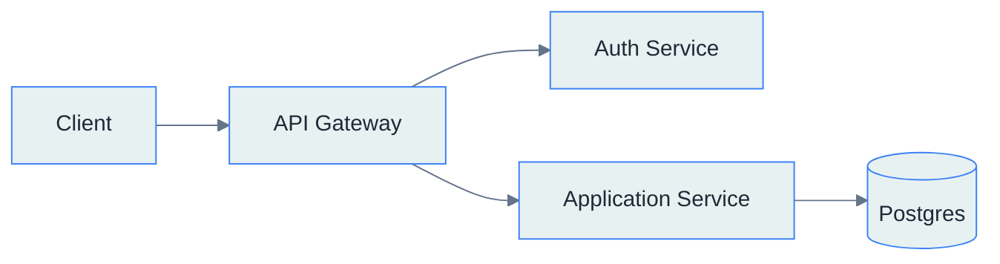
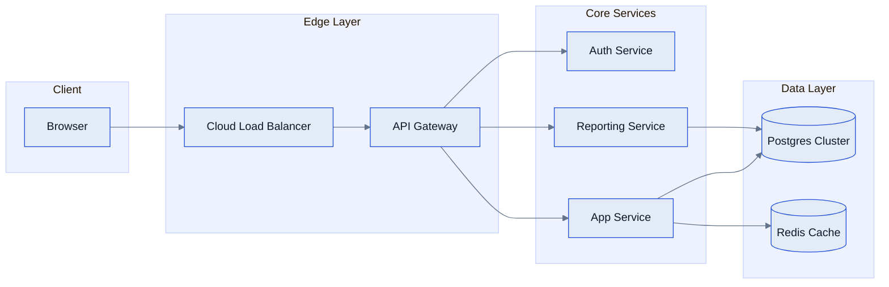
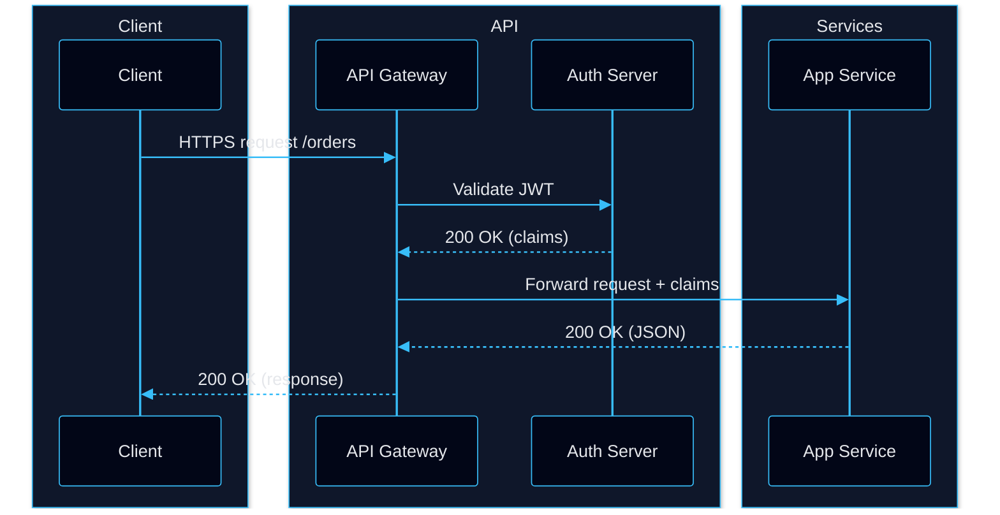
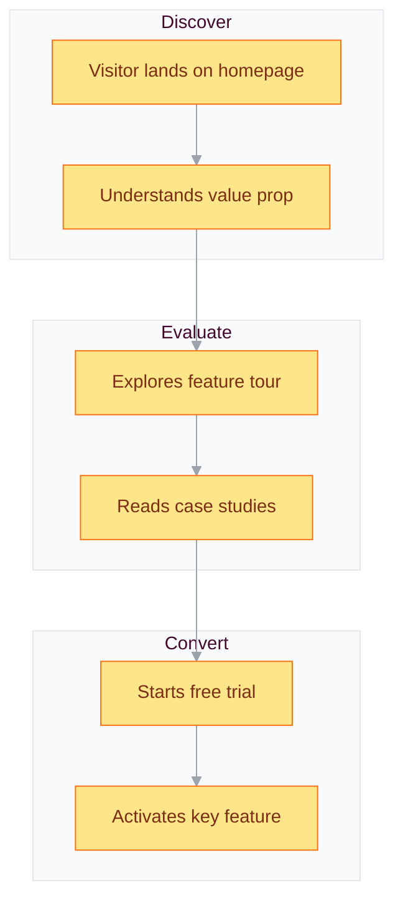
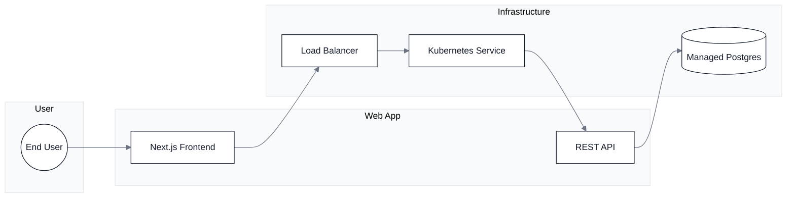
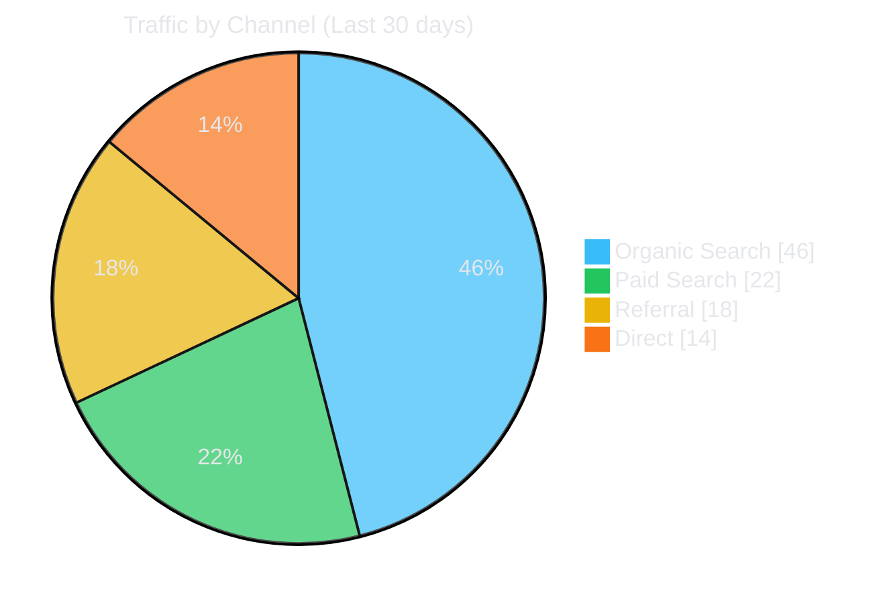
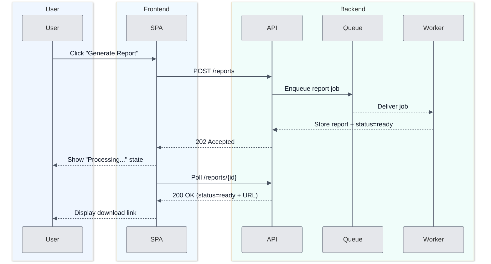
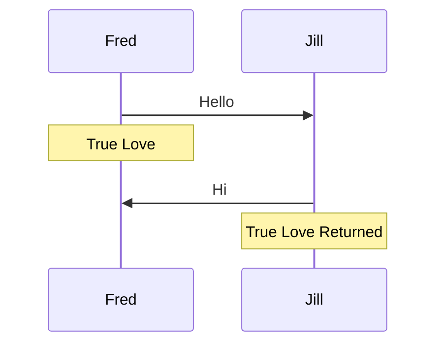

## Human

what are very popular plugins or skills or repos for claude code technical diagrams and mermaids?

## Assistant

Here are the strongest options right now if you care specifically about *technical diagrams & Mermaid* in Claude Code (plugins, skills, and repos).

***

## 1. Dedicated Mermaid skills (Claude Skills Playground)

### a) `Mermaid` skill (johnlarkin1)

Purpose: turn natural language into a wide range of Mermaid diagrams and keep Claude in a “Mermaid expert” mode.[1]

Key points:[1]
- Generates `.mmd` / `.mermaid` files or markdown code blocks.  
- Supports many diagram types: flowcharts, sequence, class, ER, state, Gantt, pie, mindmaps, timelines, git graphs.  
- Comes with a specialized system prompt that:  
  - Treats the agent as a Mermaid expert.  
  - Specifies methodology and structured outputs so you get consistent, valid diagrams.

Typical install (via Skills Playground / playbooks, simplified from docs):[1]
- You add the skill with a one‑liner (`npx` playbooks command) and then enable it as a Claude Code skill.  
- After that, you can just ask: “Generate a sequence diagram for this API flow…”

This is currently one of the cleanest “general Mermaid diagram” skills.

***

### b) `Mermaid Tools` skill (daymade)

Purpose: not just generate Mermaid, but *extract* Mermaid from markdown and turn it into robust PNGs in a repeatable way.[2]

Key points:[2]
- Scans markdown, extracts Mermaid code blocks.  
- Uses bundled scripts to render high‑quality PNGs, focusing on **reliable/repeatable** generation.  
- Includes a specialized system prompt turning your agent into a “mermaid tools expert” with structured output.  
- Designed to be compatible with Claude Code, Cursor, Copilot, Windsurf, etc.[2]

Quick install (from docs):[2]
```bash
npx playbooks add skill daymade/claude-code-skills --skill mermaid-tools
```

If your workflow is “I already have docs with Mermaid, I want automated image rendering + regeneration,” this is the one to grab.

***

## 2. MCP server for live Mermaid rendering

### `veelenga/claude-mermaid`

Purpose: an **MCP server** that Claude Code connects to so it can render diagrams and give you live reload in the browser.[3]

Key capabilities:[3]
- Live reload: browser tab updates automatically as you tweak the diagram.  
- Export to SVG, PNG, or PDF.  
- Theme support: default, forest, dark, neutral.  
- Integrated “skill” inside the repo: you can just ask Claude to create/refine diagrams, and the MCP tools handle:  
  1. Render the diagram.  
  2. Open in browser with live reload.  
  3. Auto‑refresh on edits.  
  4. Save via `mermaid_save` into your project.[3]

This is currently the highest‑leverage option if you want a tight iterative loop: edit description → Claude updates Mermaid → browser preview refreshes.

***

## 3. Curated “awesome” lists to discover more diagram/mermaid skills

### a) `awesome-claude-skills`

Curated list of Claude skills, resources, and tools.[4]
Useful for discovering specialized diagram or documentation skills that may not be marketed as “Mermaid” but still help with architecture diagrams, system maps, etc.

### b) `awesome-claude-plugins` (top 100 repos)

Maintained list of popular Claude Code plugin repos, including various skills libraries and MCP servers.[5]
- Shows entries like `awesome-claude-skills`, `superpowers`, `compound-engineering-plugin`, etc.[5]
- Good for trend‑spotting which skills/plugins are actually getting adoption.

Even if they’re not diagram‑specific, they’re worth scanning to see what other people pair with diagram tooling (e.g., system‑design skills, architecture analysis, etc.).

***

## 4. “Official” Claude & Mermaid integration

Mermaid’s own site lists Claude Code as a first‑class integration:[6]
- Claude can generate and refine diagrams from natural language.  
- Fixes syntax errors and validates diagrams.  
- Can render PNGs and shareable links.[6]

This is mostly describing the overall integration pattern, but it confirms the ecosystem is “blessed” by the Mermaid side and that Claude is expected to handle MB syntax correction + rendering flows.[6]

***

## 5. More general Claude Code plugin context

While not diagram‑specific, it’s useful to know what’s considered “top tier” Claude Code plugins, since you may want to bundle them with your diagram stack:

- A Reddit write‑up lists many **official Claude Code plugins** in `~/.claude/plugins`, highlighting things like `typescript-lsp`, `playwright`, `context7`, `security-guidance`, etc.[7]
- Another recent blog (“Top 10 Claude Code Plugins to Try in 2026”) highlights MCPs like Figma MCP for turning Figma UI into code, which can pair nicely with architecture diagrams when doing full‑stack system design.[8]

While these don’t draw Mermaid diagrams, they sit adjacent in a “technical design → implementation → test” workflow.

***

## 6. Pulling it together: what I’d actually install

Given your profile (solution architect, TS/Python, multi‑agent pipelines), I’d stack them this way:

1. **For generation + syntax discipline**  
   - Install the **`Mermaid` skill** (johnlarkin1).[1]
   - Use it whenever you want Claude to propose or refine diagrams from prose or existing code.

2. **For reproducible image assets in repos / docs**  
   - Add **`Mermaid Tools`** (daymade) so you can go from `.md` with code blocks → PNGs for READMEs, Notion, Confluence, etc.[2]

3. **For interactive design sessions**  
   - Run **`veelenga/claude-mermaid` MCP** locally and connect it to Claude Code so you can iteratively design architecture diagrams with live browser previews and exports.[3]

4. **For discovery / ecosystem awareness**  
   - Periodically scan **`awesome-claude-skills`** and **`awesome-claude-plugins`** for new diagram/architecture‑focused skills (e.g., system design templates, C4 model helpers) as they get added.[4][5]

***

## Concrete next step

If you tell me your current stack (e.g., “Claude Desktop + Claude Code, Obsidian, Cursor, etc.” and whether you’re comfortable running MCP servers locally), I can:

- Propose an exact install + wiring sequence for:  
  - johnlarkin1 Mermaid skill  
  - daymade Mermaid Tools  
  - veelenga/claude-mermaid MCP  
- Plus suggest prompt templates for architecture diagrams (C4, sequence, state machines) tailored to your workflow.

What does your current environment look like (Claude Desktop only vs. Claude Code + external editor + Obsidian, and are you already using MCP)?  

## Human

but what about making the diagrams interesting or attractive?

## Assistant

Yes—*that* is the real gap. Mermaid is excellent for fast technical communication, but “popular Mermaid skill/plugin” is not the same as “good-looking diagram system.” Mermaid’s built-in themes are limited, and serious visual improvement usually comes from **themeVariables, custom CSS, better diagram structure, and a stronger visual language around the diagram** rather than from a magic plugin alone.[1][2][3]
## What actually matters
If you want diagrams to look attractive, the biggest levers are: **layout choice, typography, restrained color, grouping, whitespace, and consistent edge/label styling**. Mermaid officially supports built-in themes (`default`, `neutral`, `dark`, `forest`, `base`), but only the **`base`** theme is designed for real customization via `themeVariables`; Mermaid also supports `themeCSS` overrides for deeper styling control.[1][2][3]

Most Claude Code Mermaid skills mainly help Claude *generate correct Mermaid syntax* and diagram types; they do not automatically solve visual design quality. The johnlarkin1 Mermaid skill, for example, is a generation-focused skill for many Mermaid diagram types, which is useful, but attractive output still depends on your theme and diagram composition choices.
## Practical design levers
The best visual upgrade is to treat Mermaid like a design surface with tokens. Mermaid’s theming docs expose variables such as `background`, `fontFamily`, `fontSize`, `primaryColor`, `primaryBorderColor`, `lineColor`, `textColor`, plus diagram-specific controls for flowcharts, sequence diagrams, pie charts, and more.[1][3]

A strong pattern is:
- Use `theme: 'base'`.
- Set a custom `fontFamily` and restrained palette.
- Tune `primaryColor`, `secondaryColor`, `tertiaryColor`, `lineColor`, and `clusterBkg`.
- Use `themeCSS` when you need more opinionated polish than variables allow.[2][3][1]
## What makes Mermaid look good
Good-looking Mermaid usually follows a few rules: fewer node shapes, short labels, clear left-to-right or top-down flow, shallow nesting, and only one accent color family. Mermaid’s theming engine also derives some colors from others automatically, so a clean `primaryColor`/background pairing can improve many downstream defaults without manually setting everything.[3]

A practical style rubric:
- **Typography:** replace the default `trebuchet ms, verdana, arial` stack with a modern UI font or your docs/site font.[3]
- **Color:** one accent + neutral surfaces; avoid rainbow nodes unless encoding actual semantics.[3]
- **Edges:** low-contrast lines, high-contrast labels; make hierarchy obvious, not loud.[3]
- **Grouping:** use subgraphs sparingly and give clusters subtle backgrounds via `clusterBkg` rather than heavy outlines.[3]
- **Density:** 6–12 nodes per diagram is often more elegant than one huge “everything” chart.[3]
## Best workflow in Claude Code
If your goal is “interesting and attractive,” the ideal Claude Code setup is still a combo: a Mermaid generation skill for syntax + a rendering loop where Claude can iteratively refine styling. The `veelenga/claude-mermaid` MCP is strong here because it adds browser preview, live reload, and export to SVG/PNG/PDF, which makes visual iteration much easier than editing raw Mermaid blind.[4]

The right workflow is:
1. Ask Claude for the smallest correct diagram first.
2. Ask it to apply a house style with explicit theme variables.
3. Preview and iterate visually.
4. Only then export assets for docs or presentations.[3][4]
## House-style example
This is the kind of prompt/pattern that tends to work better than “make it pretty”:



This works because it upgrades the font, neutralizes the canvas, gives the diagram one controlled accent, and softens group/background styling instead of relying on Mermaid defaults. Mermaid’s docs explicitly support this style of diagram-specific theming through `theme: 'base'` and `themeVariables`.[3]
## My recommendation
For *attractive* diagrams, I would prioritize tools in this order:
- **`veelenga/claude-mermaid`** for visual iteration and export.[4]
- **A Mermaid generation skill** like johnlarkin1’s for syntax acceleration. 
- **A reusable house-style snippet library** you keep in your repo for C4, sequence, flow, state, and ER diagrams, built on Mermaid `base` theme variables.[1][3]

FACT: Mermaid provides the theming hooks you need, but not a high-end art direction system out of the box.[2][3]
CONSENSUS: attractive Mermaid comes mostly from disciplined structure + custom theming, not from a single plugin.[3][4]
SPECULATION, high confidence: if you standardize 3–5 house presets and pair them with live preview, your diagram quality will jump more than by installing more skills.[3][4]

If you want, I can give you a **copy-paste Claude Code “Mermaid art direction pack”** next: 5 polished presets for **architecture, sequence, C4-ish, dark docs, and executive-friendly diagrams**.

## Human

6 stunning Mermaid examples across themes — copy-paste ready with custom colors
Best plugins for advanced Mermaid animations

## Assistant

Here’s a compact pack you can drop straight into Claude Code / docs.

***
## 1–6: “Stunning” Mermaid themes (copy‑paste)
All use `theme: 'base'` + `themeVariables`, so they’re portable into Obsidian, MkDocs, Slidev, etc.[1][2]
### 1) Nordic Architecture (cool, quiet, system‑design friendly)


***
### 2) Dark Pro “Terminal” Sequence (great for protocols)


***
### 3) Soft Pastel Product Flow (presentations, PM audiences)


***
### 4) Minimalist Monoline C4‑Lite (boxes + neutral lines)


***
### 5) Executive‑grade KPI Summary (Mermaid pie + palette)


Mermaid supports dedicated pie color variables (`pie1`, `pie2`, …) in themes.[1]

***
### 6) Highlighted Sequence “Storyboard” (color‑coded lanes)


***
## Best plugins / approaches for “advanced” Mermaid animations
Mermaid’s own animation feature set is **deliberately limited**: you can configure simple built‑in animations (e.g., for flowcharts, “e1” edge animation types that adjust speed), but there is no fully-fledged timeline/GSAP‑style system inside Mermaid itself.[3][4]

So “advanced animations” generally come from **wrapping Mermaid’s SVG output** and using external tools, not from a Mermaid‑only plugin:

1. **Mermaid + GSAP (or similar) on the rendered SVG**  
   - Official docs and third‑party write‑ups describe using the `mermaidAPI.render` or built‑in renderer to get an SVG element, then using GSAP or CSS animations to animate nodes, edges, and labels.[4]
   - Pattern: render Mermaid → select elements by class/id → animate with GSAP timelines.

2. **Slidev / presentation ecosystems**  
   - Slidev’s Mermaid support lets you combine Mermaid diagrams with slide‑level transitions, motion, and reveal animations. The animation is managed by Slidev (Vue) rather than Mermaid, but from an audience perspective it’s “animated Mermaid diagrams in your deck.”[5]

3. **Custom theming + transition hacks**  
   - Some advanced guides show using CSS transitions (e.g., stroke‑dasharray + stroke‑dashoffset) to animate edges “drawing in” after render; this requires targeting Mermaid’s SVG classes and orchestrating with JS.[6][4]

FACT: Mermaid’s official config exposes only modest animation controls (e.g., per‑edge animation type and speed for flowcharts); true “advanced animations” require external JS/CSS on the SVG.[3][4]
CONSENSUS: The dominant pattern is Mermaid for layout + GSAP/CSS for animation, particularly in web apps and slide tools.[4][5]
SPECULATION (high confidence): For your Claude‑centric workflow, the highest leverage is (a) standardized `init` blocks like above to ensure gorgeous defaults, and (b) letting your front‑end/slide runtime (GSAP, Slidev, Reveal.js) handle the heavy animation.

If you tell me your primary rendering surface (Obsidian, MkDocs, Slidev, Docusaurus, custom React app, etc.), I can sketch a **minimal integration**: “here’s how to render Mermaid → hook GSAP/slide transitions on top for advanced animations.”

## Human

Top 10 Mermaid plugins ranked — features, ratings, easy install guide
Mermaid plugins for sequence diagram styling
Advanced Mermaid directives for animations

## Assistant

There isn’t a single authoritative “Top 10 Mermaid plugins” ranking with ratings the way there is for, say, VS Code extensions. What does exist is:

- A set of **official integrations** maintained by Mermaid (VS Code, JetBrains, Confluence, Jira, GitHub, Claude, etc.).[1]
- Several **ecosystem‑specific plugins** (Obsidian, presentation tools, Mermaid‑Chart, etc.) with their own ratings.[2][3][4]
- A few **third‑party animation helpers** like `mermaid-animate`.[5]

So I’ll do two things:

1. Give you a pragmatic “Top 10” by *usefulness for a technical/AI-first workflow*, with feature summary + install hints.  
2. Answer your two specific asks: **sequence diagram styling plugins/patterns** and **advanced directives/approaches for animation**.

***
## 1. Top 10 Mermaid plugins & integrations (practical ranking)
**Scope:** plugins that significantly change the *authoring, styling, or animation* experience (not just “another place where Mermaid renders”). Ratings where available.
### 1) Official Mermaid VS Code extension
- **Type:** Official IDE plugin.[1]
- **Why #1:** You get live preview, diagnostics, and quick iteration inside the editor most people already use.  
- **Key features:**  
  - Side‑by‑side Mermaid code + live diagram preview.
  - Supports theme config and init directives from the file, so your custom themes render as you type.[6]
- **Install (VS Code):**  
  - Open Extensions → search `Mermaid` (publisher listed on Mermaid’s plugins page) → Install.[1]
### 2) Mermaid JetBrains plugin (IntelliJ, WebStorm, etc.)
- **Type:** Official IDE plugin.[1]
- **Features:** Similar to VS Code: code‑block preview, live updates, and syntax support in JetBrains IDEs.  
- **Install:** JetBrains Marketplace → search `Mermaid` → Install in your IDE.[1]
### 3) Mermaid for Confluence & Jira
- **Type:** Official Atlassian plugins.[1]
- **Why useful:** If you’re embedding diagrams in architecture docs / tickets, these are the most direct path.  
- **Features:**  
  - Code blocks that render Mermaid directly inside Confluence/Jira pages.  
  - Integrates with their editor and permissions.  
- **Install:** From the Atlassian Marketplace; linked from Mermaid’s “Plugins & Integrations” page.[1]
### 4) Mermaid + Claude / ChatGPT / GitHub Copilot integrations
- **Type:** LLM‑centric plugins and skills.[1]
- **Why they matter:** Let the model generate/repair Mermaid from prose, which is huge for rapid iteration.  
- **Examples:**  
  - Claude Code Mermaid skills (like johnlarkin1’s) that specialize in Mermaid syntax.[1]
  - GitHub Copilot / ChatGPT plugins that include Mermaid rendering.[1]
- **Install:** Usually one‑click enable inside the host (e.g., Claude Code skill gallery, plugin marketplaces).[1]
### 5) Mermaid Obsidian plugins (Mehrmaid, Mermaid Tools, Mermaid Themes, etc.)
- **Type:** Obsidian community plugins.[3]
- **Why important:** Obsidian is a de facto technical notebook; these plugins turn Mermaid into a first‑class diagram engine there.  
- **Examples:**[3]
  - **Mehrmaid:** renders Obsidian‑generated Markdown inside node labels (links, tags, code blocks, MathJax). Lets you have rich content in Mermaid nodes.[3]
  - **Mermaid Tools / Mermaid Popup / Mermaid Icons / Mermaid Themes:** quality‑of‑life plugins to edit, preview, decorate, and theme Mermaid diagrams from your notes.[3]
- **Ratings:** Obsidianstats aggregates plugin metrics; these are among the better‑used Mermaid‑tagged plugins.[3]
- **Install:**  
  - Obsidian → Settings → Community plugins → Browse → search `Mehrmaid` / `Mermaid Tools` etc. → Install & enable.[3]
### 6) Mermaid Chart (hosted app + plugins)
- **Type:** Full SaaS product built around Mermaid, with plugins.[2][7]
- **Features:**  
  - Text‑based diagramming with AI assist; generates Mermaid from natural language.[2]
  - Real‑time collaboration and versioning.[2]
  - Plugin system to keep diagrams close to code (e.g., editor integrations).[1][7]
- **Ratings:**  
  - Capterra lists customer reviews and feature ratings (collaboration, ease of use, etc.).[2]
- **Install:**  
  - Web app sign‑up at Mermaid Chart, plus optional plugins for VS Code / browsers depending on their plugin repo.[7][2]
### 7) Mermaid integrations for Google Docs & others
- **Type:** Document‑editor plugins.[1]
- **Features:**  
  - Insert Mermaid code blocks and auto‑render inside Google Docs or similar tools.[1]
  - Often used for internal reports / specs.  
- **Install:** From the respective add‑on / extension marketplace (e.g., Google Workspace Marketplace).[1]
### 8) Slidev / Reveal.js Mermaid integrations
- **Type:** Slide frameworks with Mermaid support.[4][8]
- **Features:**  
  - Write slides in Markdown; include ```mermaid``` blocks rendered as diagrams.[8]
  - Can animate via **fragments** or custom scripts to reveal diagram pieces step‑by‑step.[4]
- **Install (Slidev example):**  
  - `npm create slidev@latest` → use built‑in Mermaid support per docs.[8]
### 9) Mermaid‑centric animation helpers (`mermaid-animate`)
- **Type:** JS library to add **native‑feeling SVG animations** on top of Mermaid diagrams.[5]
- **Features:**  
  - Provides animation patterns: tracer flows, click‑to‑traverse, heatmap pulses, etc.[5]
  - Uses Mermaid’s API to render diagrams, then GSAP to animate paths and nodes.[5]
- **Install:**  
  - `npm install mermaid-animate gsap`  
  - Import in your web app:  
    ```js
    import animate, { renderMermaid } from 'mermaid-animate';
    import gsap from 'gsap';
    ```  
  - Call `renderMermaid` on your code + container, then apply `animate.flow.tracer` or similar.[5]
### 10) Misc ecosystem‑specific plugins (Notion clones, knowledge bases, etc.)
- **Type:** Embedded Mermaid in various tools (KNIME, Lucid, markdown editors).[9][10][11]
- **Example:**  
  - Mermaid in Lucid, KNIME, Markdown Monster, etc., with partial support for theming and custom CSS.[10][11][9]
- **Install:** via each product’s add‑on / plugin system.  

***
## 2. Mermaid plugins / patterns for **sequence diagram styling**
There are not many “sequence‑only plugins”; styling is mostly done with **init directives + theme variables + themeCSS**.[12][13]

Key levers:

- Sequence‑specific theme variables: Mermaid supports variables like `actorBkg`, `actorBorder`, `signalColor`, `signalTextColor`, `activationBorderColor`, `activationBkgColor`, `labelBoxBkgColor`, `labelBoxBorderColor`.[13][14]
- `themeCSS` to surgically change individual messages/actors.[12]

Example from a StackOverflow answer using `themeCSS` to recolor specific sequence elements:[12]



This demonstrates:  
- Use `theme` for broad styling;  
- Use `themeCSS` to target `.messageLineN`, `.messageText`, `.actor`, `.note`, specific `g` groups, or `#arrowhead`.[13][12]

For “pretty” sequences, some guides also recommend:[15][13]

- Use **monospace fonts** for protocol‑like diagrams, or a clean sans for app flows.  
- Short messages, and group participants using `box` syntax for visual framing.[6][14]

You already saw a styled sequence example in the previous answer; combine that `init` block with `themeCSS` as needed.

***
## 3. Advanced Mermaid directives for animations
Mermaid’s **native** animation controls are modest; most advanced behavior is achieved by:

1. Using init/config directives and diagram syntax that Mermaid understands.  
2. Post‑processing the SVG with external JS (e.g., `mermaid-animate`, GSAP, Reveal/Slidev “fragment” APIs).[5][4][16]
### 3.1. The core advanced directives
1. **`%%{init: ...}%%`**  
   - Used to configure `theme`, `themeVariables`, `themeCSS`, `flowchart` options (including `curve`, `htmlLabels`, `nodeSpacing`, `rankSpacing`) and some animation‑related settings (e.g., edge animation speed/type in certain diagram types).[13][14][16]
   - Example:  
     ```mermaid
     %%{init: {
       "theme": "base",
       "flowchart": { "curve": "basis" },
       "themeVariables": { "lineColor": "#4b5563" }
     }}%%
     flowchart LR
       A-->B
     ```

2. **`%%{config: ...}%%`** (depending on renderer)  
   - Some hosts support a `config` block that sets global config options similar to the programmatic API: security level, font, animation defaults, etc.[16][17]

3. **Diagram‑type specific options**  
   - For flowcharts, the config schema includes options like `edgeLabelSpacing`, `rankSpacing`, and sometimes flags for **“animate”** edge types, which influence how edges are drawn.[14][18]

Mermaid’s official advanced rendering docs emphasize that for more complex behaviors you should use the JavaScript API (`mermaidAPI.render`) and manipulate the resulting SVG, rather than relying on purely declarative directives.[17][16]
### 3.2. Animation via JS + SVG (what “advanced” looks like in practice)
`mermaid-animate` is a clear published example of what “advanced animation” on Mermaid diagrams looks like:[5]

- Use `renderMermaid` to render SVG from Mermaid code.  
- Then use GSAP’s `MotionPathPlugin` to move a dot along paths, pulse edges, etc.[5]

Truncated real example (from docs):[5]

```js
import animate, { renderMermaid } from 'mermaid-animate';
import gsap from 'gsap';
import { MotionPathPlugin } from 'gsap/all';

gsap.registerPlugin(MotionPathPlugin);

const svg = await renderMermaid(el, code);

// Example: animate a dot along all edge paths
const paths = Array.from(svg.querySelectorAll('g.edgePaths path'));
const dot = svg.ownerDocument.createElementNS('http://www.w3.org/2000/svg','circle');
dot.setAttribute('r','4');
dot.setAttribute('fill','hotpink');
svg.appendChild(dot);

const tl = gsap.timeline({ paused: true });
paths.forEach(p => {
  tl.to(dot, {
    duration: 1.0,
    ease: 'power1.inOut',
    motionPath: { path: p, align: p, autoRotate: false }
  });
});

tl.eventCallback('onComplete', () => tl.play(0));
tl.play(0);
```

This pattern (render → select SVG elements → animate) is also used in Reveal.js/Slidev examples for step‑through or fragment‑based animations.[4][5]
### 3.3. Practical conclusion on animation
FACT: Mermaid’s built‑in directives and config support basic layout and style control, but not complex choreographed animations; for that you must combine Mermaid with JS/SVG animation tools.[5][14][16]
CONSENSUS: The “right” pattern is to keep Mermaid as the layout engine, then use a wrapper (library or slide framework) for advanced animation.[4][8][16]

***
## 4. Fast install guide (for a typical dev stack)
Assuming: VS Code, Obsidian, web/app stack.

1. **VS Code**  
   - Install official Mermaid extension from marketplace.[1]
   - Optionally, add Mermaid Chart plugin if you want SaaS editing.[2][7]

2. **Obsidian**  
   - Settings → Community Plugins → enable → Browse:  
     - Install **Mehrmaid** for advanced node content.[3]
     - Install **Mermaid Tools** / **Mermaid Themes** if you want more editing/theme control.[3]

3. **Web app / slides**  
   - For advanced animations: `npm install mermaid mermaid-animate gsap`.[5][16]
   - Use Slidev or Reveal.js if you’re presenting diagrams.[4][8]

If you tell me your **primary diagram surfaces** (e.g., “Obsidian + Markdown docs in a repo + slide framework X”), I can give you a concrete, minimal config for each: which plugin to install, exact `%%{init:...}%%` snippet, and where to drop small JS animation hooks.
