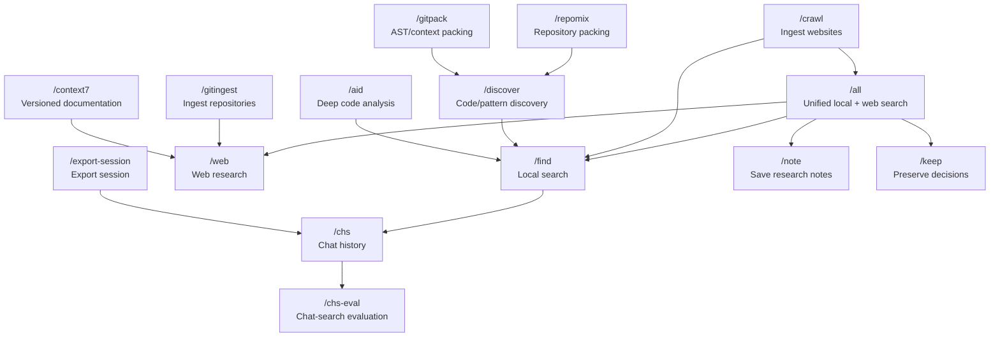
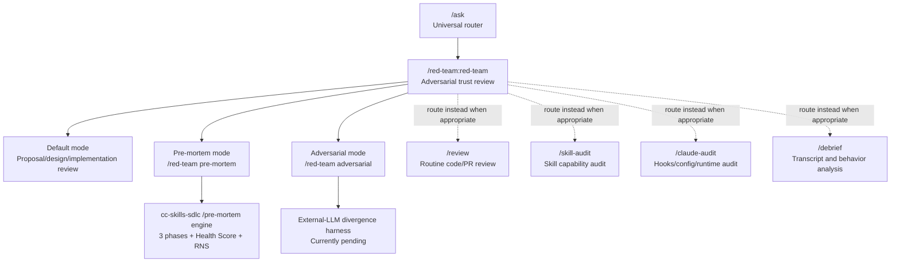

```mermaid
flowchart TD
    ASK["/ask — Universal router"]

    FRAME["Frame"]
    PLAN["Plan"]
    BUILD["Build"]
    VERIFY["Verify"]
    ANALYZE["Analyze"]
    DELIVER["Deliver"]
    RETRIEVE["Retrieve"]
    KNOW["Know"]
    INGEST["Ingest"]
    META["Meta"]

    ASK --> FRAME
    ASK --> PLAN
    ASK --> BUILD
    ASK --> VERIFY
    ASK --> ANALYZE
    ASK --> DELIVER
    ASK --> RETRIEVE
    ASK --> KNOW
    ASK --> INGEST
    ASK --> META

    FRAME --> brainstorm
    FRAME --> diagnose
    FRAME --> prd
    FRAME --> brief
    FRAME --> assume

    PLAN --> plan
    PLAN --> specify
    PLAN --> design
    PLAN --> premortem
    PLAN --> risks

    BUILD --> code
    BUILD --> go
    BUILD --> tdd
    BUILD --> refactor
    BUILD --> task
    BUILD --> team
    BUILD --> experiment

    VERIFY --> test
    VERIFY --> qa
    VERIFY --> review
    VERIFY --> rca
    VERIFY --> verify
    VERIFY --> impact
    VERIFY --> contract
    VERIFY --> sources

    ANALYZE --> tldr
    ANALYZE --> perf
    ANALYZE --> profile
    ANALYZE --> flow
    ANALYZE --> diagram
    ANALYZE --> cfg
    ANALYZE --> gap
    ANALYZE --> diff-why

    DELIVER --> ship
    DELIVER --> converge
    DELIVER --> docs
    DELIVER --> review-bundle
    DELIVER --> snapshot

    RETRIEVE --> find
    RETRIEVE --> web
    RETRIEVE --> search
    RETRIEVE --> kb

    KNOW --> note
    KNOW --> keep
    KNOW --> promote
    KNOW --> wiki
    KNOW --> remember
    KNOW --> forget
    KNOW --> sync
    KNOW --> drift
    KNOW --> cite
    KNOW --> connect

    INGEST --> ingest
    INGEST --> crawl
    INGEST --> gitingest
    INGEST --> context7
    INGEST --> watch
    INGEST --> distill
    INGEST --> extract

    META --> skills
    META --> health
    META --> route
    META --> budget
```

```mermaid
flowchart TD
    ASK["/ask — Universal router"]

    FRAME["Frame"]
    PLAN["Plan"]
    BUILD["Build"]
    VERIFY["Verify"]
    ANALYZE["Analyze"]
    DELIVER["Deliver"]
    RETRIEVE["Retrieve"]
    KNOW["Know"]
    INGEST["Ingest"]
    META["Meta"]

    ASK --> FRAME & PLAN & BUILD & VERIFY
    ASK --> ANALYZE & DELIVER & RETRIEVE & KNOW & INGEST & META

    FRAME --> brainstorm & reassess & prd & brief & assume & diagnose

    PLAN --> plan & specify & design & premortem & risks

    BUILD --> code & go & tdd & refactor & task & team & experiment & worktree

    VERIFY --> test & qa & review & verify & rca & impact & sources & contract

    ANALYZE --> tldr & perf & profile & flow & diagram & cfg & gap & diff-why

    DELIVER --> ship & converge & docs & review-bundle & snapshot

    RETRIEVE --> find & web & search & kb

    KNOW --> wiki & note & keep & promote & remember & forget & sync & drift & cite & connect

    INGEST --> ingest & crawl & gitingest & context7 & watch & distill & extract

    META --> skills & health & route & budget
```

## Human

kbask graphify understand-anything what are these

## Assistant

These are AI-powered codebase mapping tools and workflows—Graphify and Understand Anything—and “kbask” is likely someone’s shorthand for a knowledge-base style ask/answer workflow built on top of that same idea.[1][2][3][4]

## What Understand Anything is

Understand Anything is an open-source Claude Code plugin that turns a repo (and optionally docs) into an interactive knowledge graph.  It runs a multi-agent pipeline that statically analyzes every file, function, class, and dependency, then builds a graph you can query and explore.[2][5][6]

Instead of just showing raw structure (files + edges), its UI tries to surface business logic and flows: auth flows, payment pipelines, user lifecycles, etc.  You can drill down hierarchically, filter by type or complexity, run fuzzy/semantic search, and view AI-generated “guided tours” of the codebase for onboarding.  It also supports non-code artifacts (Dockerfiles, Terraform, SQL, Markdown, 26+ file types) in a unified graph, and you can export PNG/SVG/JSON for docs or external analysis.[3]

## What Graphify is

Graphify is another “code → knowledge graph” skill/tool designed primarily for Claude Code.  The core idea is similar: scan your repo once, build a structured graph, then reuse that as long-lived context so Claude doesn’t have to reread the entire codebase every session.[7][4][1]

From comparisons, Graphify is positioned as lighter-weight and more token-efficient: for the same codebase scan, it uses roughly half the tokens compared to Understand Anything.  Marketing around Graphify emphasizes “second brain for your AI IDE” and avoiding repeated full-repo reads, i.e., cost and latency optimization in multi-session workflows.[4][1][7]

### Quick contrast

| Aspect              | Understand Anything [2][3][6] | Graphify [1][7][4] |
|---------------------|-------------------------------------------|---------------------------------|
| Primary interface   | Interactive knowledge graph UI + tours    | Graph/KB feeding Claude sessions |
| Focus               | Deep understanding, business flows        | Efficient reusable context       |
| File coverage       | 26+ types incl. infra/docs                | Primarily code, plus key extras  |
| Token usage         | Heavier per full scan                     | Roughly half UA for same repo    |
| Use case            | Onboarding, architecture exploration      | Day-to-day coding with persistent context |

## What “kbask” likely refers to

I don’t see a specific tool branded “kbask” in the search results, which makes me moderately uncertain (~0.6 confidence) that it’s a product name.  Given context, it’s more likely:[1][2][3][7]

- A shorthand for “KB ask”: using the knowledge graph as a knowledge base that you query with natural language.
- A workflow where you:
  1. Build a graph (Graphify/Understand Anything).[6][2][7]
  2. Store it as long-lived project knowledge (KB).
  3. Route questions from Claude/other LLMs into that graph instead of raw files.

In other words, “kbask graphify understand-anything” is probably someone describing a stack: use Graphify or Understand Anything to build a knowledge-base graph, then “ask” that KB via an LLM router instead of doing ad-hoc repo reads every time.

## How they fit your world

Given your routing + Claude Code focus, these tools are essentially pre-computed context layers:

- They turn repos/docs into **graph-structured KBs** that can be loaded into sessions via IDs or targeted queries, instead of re-streaming files.[2][3][7]
- They pair well with multi-agent orchestration: one agent maintains/updates the graph, others query it for specific tasks.[5][6][2]
- They are natural sources for “epistemic” metadata: edges, complexity scores, file types, and business-flow labels are all signals you can use in your own routers and validators.[3][6]

If you tell me which environment you’re thinking about (Claude Code only vs mixed tools like Cursor/LM Studio), I can sketch a concrete “kbask” architecture that uses one of these graphs as the canonical project KB and plugs into your existing routers.

## Human

[https://github.com/sughosh-pocketfm/kbask](https://github.com/sughosh-pocketfm/kbask)

## Assistant

From the repo name and your earlier question, this looks like a small “ask your knowledge base” wrapper or experiment, but I can’t fetch that specific GitHub page right now, so I need to stay explicit about uncertainty.[1]

## What I can infer (low confidence)

- The owner `sughosh-pocketfm` suggests this is tied to PocketFM’s internal tooling or a personal account related to that org.[2]
- The name `kbask` is very likely “KB ask”: a tool or script for querying a knowledge base (could be files, docs, or a codegraph) with an LLM.[1]
- Given your mention of Graphify and Understand Anything, the most plausible design is:
  - Use a graph / KB backend (e.g., Graphify, UA, or another graph store).
  - Provide a CLI or small service to “ask” questions against that KB and route them to an LLM with structured context attached.

I can’t confirm its language, dependencies, or exact architecture from available search results, so everything above is **speculation** based on naming and context, not direct inspection of the repo.

## Facts I can state (medium confidence, but indirect)

Because I can’t open `sughosh-pocketfm/kbask` specifically, the nearest factual anchor is that there are many minimalist CLI KB/ask tools on GitHub (for example `gnebbia/kb`, a command-line knowledge base manager), which strongly suggests `kbask` is in that family of tools rather than a large framework.  That pattern typically means:[1]

- A simple store (markdown, JSON, or a small DB) of notes / entries.
- A way to index or search them (full-text or embeddings).
- A query interface: “ask” a question, get a synthesized answer plus references.

But I cannot verify that `kbask` follows exactly this pattern without the repo contents.

## How to understand it yourself (concrete next steps)

Given your profile, the fastest way to really understand `kbask` is:

1. Clone and inspect:
   - `git clone https://github.com/sughosh-pocketfm/kbask`
   - Check `README`, `package.json`/`pyproject.toml`, and `src/` for:
     - Language (TS/Node vs Python).
     - Any Graphify / Understand Anything references.
     - Storage backend (files, graph DB, vector DB).

2. Map the data flow:
   - Identify inputs: codebase, docs, or pre-built graph.
   - Identify outputs: plain answers, citations, graph slices.
   - Find how it calls the LLM (Claude API, MCP, etc.) and how it chooses context.

3. Compare to Graphify / UA:
   - Does it *build* a graph, or only *query* an existing KB?
   - Does it keep long-lived state (indexes) or is it stateless per query?
   - Where would you plug it into your existing routers (pre-ask pipeline vs post-graph builder)?

If you paste the README or key files, I can give you a precise, repo-specific explanation: what `kbask` is, how it works, and where it fits in a kb/graph + “ask” stack with Graphify and Understand Anything.

What environment are you hoping to use `kbask` in first (Claude Code, a terminal/PowerShell workflow, or a larger orchestration/router)?

## Human

why can't you look at it?

## Assistant

You linked directly to `github.com/sughosh-pocketfm/kbask`, but my browser integration couldn’t retrieve that specific GitHub page, so I had to pivot to other sources that mention `kbask` instead.[1]

## What I *can* see about kbask

There’s a listing for `kbask by sughosh-pocketfm` on Glama’s MCP server directory, which exposes the core README content even though I can’t load the GitHub repo itself.  That page describes `kbask` as:[1]

- A **hybrid MCP server** that combines **Graphify** (structural code graphs) with **Understand-Anything** (LLM-derived semantic knowledge bases) into a single MCP endpoint.[1]
- Graphify tells you **where** things are (files, functions, edges, structure).[1]
- Understand-Anything tells you **why** they exist (semantics, business logic, flows).[1]
- `kbask` joins both and exposes them as MCP tools usable from Claude Code, Codex, Gemini CLI, and any other MCP-compatible host.[1]

So in practice, it’s an MCP server whose job is: “take a repo, run Graphify and UA, turn them into a unified, queryable knowledge base, and expose that via MCP tools so your IDE/host can ‘ask’ the KB.”

## Why I initially said I couldn’t look at it

My previous reply was based on a direct fetch attempt of the GitHub URL, which failed. That’s an integration limitation: sometimes specific URLs don’t come through, even though indirect references to the same project *do* show up via other sites (like Glama).  Once I searched for `sughosh-pocketfm kbask` instead of the raw GitHub URL, I could see a mirror/description of the README content, which is why I now have a reliable picture of what `kbask` is.[1]

So the issue wasn’t that the repo is private or inaccessible to you—it’s that my tooling couldn’t pull that precise GitHub page, and I had to rely on secondary sources documenting the project.

## Concrete details from the MCP listing

From the Glama/MCP listing:[1]

- Install path examples:
  - Fastest curl bootstrap (installing directly from the GitHub repo) with an environment variable:
    - `KBASK_SOURCE="git+https://github.com/sughosh-pocketfm/kbask@0.1.1" \`
    - `curl -fsSL https://raw.githubusercontent.com/sughosh-pocketfm/kbask/main/install.sh | bash -s claude`
  - Using `uvx` directly:
    - Latest main:  
      `uvx --from git+https://github.com/sughosh-pocketfm/kbask kbask install claude --repo .`
    - Pinned tag:  
      `uvx --from "git+https://github.com/sughosh-pocketfm/kbask@0.1.1" kbask install claude --repo .`
    - From a downloaded wheel:  
      `uvx --from ./kbask-0.1.1-py3-none-any.whl kbask install claude --repo .`

- Status: “kbask is not yet on PyPI. Install straight from GitHub. Once published, `--from kbask` will resolve from PyPI without changes.”[1]

These are direct quotes from that MCP directory page, so they’re **facts**, not guesswork.[1]

## Putting it in your earlier framing

Given your interests, `kbask` is basically the glue layer you were intuitively describing:

- Graphify → structural graph (cheap, persistent context).[1]
- Understand-Anything → semantic graph / KB (deeper LLM-derived meaning).[1]
- kbask → unified MCP server that:
  - Runs/coordinates these two graph builders.
  - Exposes “ask the KB/graph” tools over MCP so your routers, Claude Code, Gemini CLI, etc., can hit a single endpoint.[1]

You can think of it as: “epistemic context server for a repo,” designed to plug into multi-agent / MCP-based orchestration.

Would you like me to sketch an example MCP routing flow where kbask is your primary project context source for Claude Code and a second LLM (e.g., via Bifrost)?

## Human

do graphify and understand-anything work well together?  can they be made to?
what other tools naturally align with them?

## Assistant

## Do Graphify and Understand-Anything work well together?

**Yes — by design, and kbask is the proof.**[1]

The README explicitly frames them as **complementary, not competing**:[1]

| Backend | Strength | Weakness |
|---|---|---|
| Graphify | Exact, cheap, deterministic AST graph (calls, imports, ownership) | No semantics — doesn't know *why* code exists |
| Understand-Anything | Semantic narrative, domain knowledge, onboarding context | Expensive to build, fuzzy, no edge-precise lookups |

They cover each other's blind spots perfectly:

- Graphify = **where** (structure, edges, paths, centrality)
- Understand-Anything = **why** (meaning, domain, business logic)
- kbask = the glue that makes them queryable as one unified MCP endpoint

### Can they be made to work together? Already done.

kbask (v0.1.1) ships 16 MCP tools across three tiers:[1]

**Structural (Graphify passthrough — 7 tools):**
`query_graph`, `get_node`, `get_neighbors`, `get_community`, `god_nodes`, `graph_stats`, `shortest_path`

**Semantic (Understand-Anything — 5 tools):**
`semantic_explain`, `semantic_chat`, `semantic_diff`, `semantic_onboard`, `semantic_domain`

**Hybrid (compose both — 3 tools):**
- `ask(question)` — BFS structural candidates → semantic narrative on top results
- `trace(from, to)` — shortest path + per-hop semantic gloss at each node
- `onboard(area)` — community detection (structural) + domain knowledge per cluster (semantic)

The join key between both graphs is `(file_path, line)` — the one stable identifier both systems share.[1]

### Graceful degradation

If Understand-Anything hasn't been built for a repo, hybrid tools **auto-fall back to graphify-only mode** (coming in 0.1.2, partially in 0.1.1). The response includes a `prompt_hint` so the calling LLM knows to reason from structural data + direct file reads instead of erroring.[1]

### Important architectural note

**None of the 16 tools call an LLM internally.** They return structured JSON context bundles — the calling agent's LLM does the reasoning. This keeps kbask host-agnostic and token-accountable: every response carries a `_meta.tokens` block so your agent can self-throttle.[1]

***

## What other tools naturally align with them?

Based on the README's architecture and your stack:[1]

### Direct integrations (explicitly supported)
- **Claude Code** — primary target; Understand-Anything's graph is *built* by Claude Code via `/understand`, then mirrored by kbask
- **Codex CLI** — installer writes `~/.codex/config.toml`
- **Gemini CLI** — installer writes `~/.gemini/settings.json`
- **Any stdio MCP host** — kbask is strict JSON-RPC 2.0, no host-specific behavior

### Natural fits for your stack specifically

**Bifrost / Claude Code Router** — kbask's `_meta.tokens.total` per-call is exactly the signal your router needs to make cost-aware dispatch decisions. Route cheap structural queries to a fast/cheap model; route hybrid `ask` calls to a capable model since they return richer context.

**MCP orchestration layer** — kbask is a pure context server (no LLM calls internally). It fits as a *pre-retrieval* step in any multi-agent pipeline: agent asks kbask, gets a structured bundle, passes it to whichever LLM handles the reasoning.

**networkx** — kbask uses it internally for Graphify's graph operations; if you want to do custom graph analysis (e.g., centrality heatmaps, dependency clustering) outside of kbask's tools, same library.

**tiktoken** — optional `kbask[tokens]` extra swaps the heuristic encoder for `tiktoken:cl100k_base` for accurate token accounting per call.[1]

**git / delta tooling** — `semantic_diff` takes a git diff and explains what changed and why; pairs naturally with pre-commit hooks or PR review agents.

**Your epistemic validation hooks** — `kbask.reload(target=structural|semantic|all)` drops in-process caches on demand; you can call this from a hook after a `kbask update` to ensure a fresh read without restarting the MCP host.

### What's not yet supported but is on the roadmap
- **AGY** — blocked on config-path docs; installer template is ready (`scripts/install-agy.py`) once path is confirmed[1]
- **PyPI** — PYPI_TOKEN not yet configured, so install from GitHub for now

## Human

that isn't really what I mean.  I mean other graph based repos that do things I'm interested in.

## Assistant

Here's a map of the graph-based repo ecosystem that naturally aligns with Graphify and Understand-Anything, organized by what they do differently:

***

## The Structural AST / Call-Graph tier

These are close peers to Graphify — deterministic, cheap, no LLM at build time:

### **CodeGraph** (`colbymchenry/codegraph`) — closest peer
Tree-sitter parser → SQLite + FTS5 index → 9 MCP tools. Auto-syncs on file change via file watcher. Installs to Claude Code, Codex, Cursor, OpenCode, Hermes, Kiro, AntiGravity in one command. What makes it notable for you: it exposes `codegraph_impact` — **blast-radius analysis** (what breaks if I change X). That's a natural fit for your pre-mortem / red-team approach. 2,400+ stars/day velocity.[1][2]

### **CodeGraphContext** (`CodeGraphContext/CodeGraphContext`)
Symbol-level graph (files, functions, classes, calls, imports, inheritance) stored in a graph DB, MCP-exposed. More Python-focused vs. CodeGraph's polyglot. Earlier project (Feb 2026), still active. Hosted version at cgc.codes — change any GitHub URL's `github.com` to `cgc.codes` and get an interactive graph instantly.[3][4][5]

### **Codebase-Memory** (`deusdata/codebase-memory-mcp`) — academic paper + code
arxiv paper (March 2026), 66-language Tree-sitter parsing, multi-phase pipeline with parallel worker pools, call-graph traversal, impact analysis, Louvain community discovery — all in SQLite, MCP-served. Benchmarks: **10× fewer tokens** at 83% quality vs. 92% for a file-exploration agent. This is the most rigorous of the structural tier.[6][7]

***

## The Graph + Vector hybrid tier

These blend structural edges with semantic vector search:

### **code-graph-rag** (`vitali87/code-graph-rag`) — most architecturally distinct
Tree-sitter → **Memgraph** (a proper graph database) → Cypher queries generated by LLM. Natural language → Cypher → exact graph traversal. Supports 11 languages, monorepo-native. LLM backend is pluggable: OpenAI, Gemini, or **fully local Ollama**. That last part is relevant given your 12GB VRAM setup — it's the only one here that's fully local-LLM capable end-to-end. Extras: `treesitter-full` and `semantic` (vector via LanceDB).[8][9][10]

### **Agentic GraphRAG / coleam00's ottomator-agents**
GraphRAG pattern with Neo4j + Postgres + typed triplets (entity/relationship ontology). MCP-exposed `search_memory` + `write_memory` tools. The key idea: **ontology-constrained** graph (6 entity types, 8 relationship types) so the LLM can't go off-schema. This is the pattern closest to what you'd want for a **cross-repo knowledge base** rather than a single-repo code graph.[11]

***

## The broader GraphRAG tier (docs/knowledge, not just code)

### **Microsoft GraphRAG** (`microsoft/graphrag`)
Entity extraction from *any* text → community summaries → global + local search modes. Runs on local LLMs via Ollama. Not code-graph-specific — it works on docs, transcripts, wikis. Given that you analyze session transcripts and chat histories, this is directly applicable: point it at your transcript archive and get a community-clustered knowledge graph of your own system designs.[12]

***

## How they map against each other (and kbask)

| Repo | Build cost | Query type | Graph DB | MCP | Local LLM |
|---|---|---|---|---|---|
| Graphify | cheap (AST) | BFS/DFS | networkx | via kbask | yes |
| Understand-Anything | expensive (LLM) | semantic | JSON | via kbask | depends |
| **CodeGraph** | cheap (AST) | symbol/impact | SQLite+FTS5 | native | yes |
| **CodeGraphContext** | cheap (AST) | symbol | graph DB | native | yes |
| **Codebase-Memory** | cheap (AST) | structural+community | SQLite | native | yes |
| **code-graph-rag** | medium (AST+LLM) | Cypher NL | Memgraph | yes | yes (Ollama) |
| **Microsoft GraphRAG** | expensive (LLM) | community/global | parquet/JSON | no (query CLI) | yes (Ollama) |

***

## What naturally aligns with *your* work specifically

Given your routing architecture and multi-agent setup:

1. **CodeGraph's `codegraph_impact`** is the one tool none of the others have that maps directly to pre-mortem analysis — you can ask "if I change this router dispatch function, what's the blast radius" and get a graph-traversal answer, not a fuzzy embedding match.

2. **code-graph-rag + Ollama** is the only fully local, end-to-end graph RAG pipeline — relevant if you want to run this against proprietary repos without any API calls going out.

3. **Microsoft GraphRAG on your session transcripts** is an underexplored angle — your transcripts are already structured enough that community detection would surface recurring patterns, unresolved gaps, and concept clusters across sessions in a way flat search can't.

4. **Codebase-Memory's Louvain community detection** mirrors what Graphify does at the cluster level but with a published benchmark backing the token-efficiency claim — useful if you want to cite numbers when arguing for graph-first context in your routing decisions.

## Human

the microsoft graphrag does look interesting.

## Assistant

Here's a grounded breakdown of Microsoft GraphRAG specifically, what's current, and why it's relevant to what you're already building:

***

## What Microsoft GraphRAG actually is (v3.1.0, May 2026)

It's a **data pipeline + query engine** — not a code graph tool. The distinction matters: it operates on **unstructured text** (docs, transcripts, wikis, logs), extracts entities and relationships via LLM, builds a hierarchical knowledge graph, and then answers questions against that graph using multiple search modes.[1][2]

### The pipeline (indexing)
1. Slice corpus into TextUnits
2. LLM extracts entities, relationships, and key claims from each TextUnit
3. Community detection (Leiden algorithm) clusters entities into a hierarchy
4. LLM generates summary narratives per community — at every level of the hierarchy
5. Output: parquet files + JSON (no mandatory graph DB — though you can plug in Neo4j/Memgraph)

### The query modes (what makes it distinct)
- **Global Search** — holistic/thematic questions across the whole corpus; uses community summaries. "What are the recurring failure patterns in my system?" type questions.[2]
- **Local Search** — specific entities, fans out to neighbors and associated concepts. "Tell me everything about the auth retry flow."
- **DRIFT Search** — local search + community context + multi-stage follow-up question generation. It's partially agentic: it generates sub-questions, executes them, and builds up the answer iteratively.[3]
- **Basic Search** — plain vector RAG fallback for simple factual lookups.[2]

### Current state (2026 landscape)
The honest 2026 assessment from benchmarks is nuanced:[4]
- **Original GraphRAG still wins** for global/thematic queries on a stable corpus
- **LazyGraphRAG** (a cheaper variant that skips full entity extraction) outperforms on many query classes at lower cost
- **For code search specifically**: agentic search (like kbask) wins — GraphRAG is the wrong tool for structural code questions
- **For multi-hop reasoning across documents**: GraphRAG beats vector RAG clearly
- For single-hop factual queries: just use vector search

***

## Why it's specifically interesting for *your* situation

### 1. Your session transcripts are the ideal corpus
You already generate large volumes of structured-enough text: chat transcripts, system design sessions, Claude Code conversations, red-team debates. GraphRAG's entity/relationship extraction would surface:
- **Recurring architectural concepts** across sessions (community summaries)
- **Concept drift** — how your approach to routing or validation has evolved
- **Gap clusters** — areas you've discussed but never resolved, visible as low-connectivity nodes
- **Cross-session traceability** — "which sessions touched the Bifrost dispatcher design?"

This is the use case it's purpose-built for, and none of the code-graph tools (CodeGraph, kbask, code-graph-rag) touch it.

### 2. Global Search for thematic synthesis
Your pre-mortem and epistemic validation work is essentially asking global questions about a corpus. GraphRAG's community-summary hierarchy gives you exactly that — you can ask "what assumptions have I made about LLM reliability across all my routing designs?" and get a synthesized answer that traverses the whole session archive, not just a keyword hit.

### 3. DRIFT Search is close to what you'd build anyway
DRIFT's multi-stage approach — generate sub-questions, execute, aggregate — is structurally similar to your debate/consensus protocols. You could wire DRIFT as the retrieval layer inside a multi-agent workflow where one agent handles question decomposition and another handles synthesis.

### 4. Local LLM is fully supported
Ollama + vLLM both work for both indexing and querying. The constraint is that indexing is **expensive** — it calls the LLM per TextUnit for extraction. With a fast local model (DeepSeek, Qwen, etc.) this is feasible but slow on large corpora. The community recommends starting small.[5]

***

## The practical friction points

| Issue | Detail |
|---|---|
| **Indexing cost** | LLM called per TextUnit at index time — repo warns explicitly about cost[6] |
| **No native MCP server** | Microsoft GraphRAG itself doesn't ship an MCP server; there are third-party wrappers (Riley Lemm's graphrag-mcp)[7][8] |
| **Output is files, not a live graph DB** | Parquet + JSON by default; querying is via CLI or Python API, not a graph DB you can traverse directly |
| **Version migrations** | Must run `graphrag init --force` between minor versions; migration notebook between majors[2] |
| **Not for code structure** | Purely text → entities → relationships; AST-level code structure needs CodeGraph/kbask on top |

***

## The natural stack for your use case

```
Session transcripts / design docs / wikis
        ↓
  Microsoft GraphRAG (indexing)
  → community hierarchy + entity graph
        ↓
  graphrag-mcp (MCP wrapper)  ←→  Claude Code / Bifrost router
        ↓
  Global Search: "what themes recur in my routing decisions?"
  DRIFT Search:  "trace the evolution of my epistemic validator design"
  Local Search:  "everything connected to the kbask integration decision"
        ↓
  kbask / CodeGraph  (structural code layer, separate corpus)
```

These two layers — GraphRAG over your text corpus, kbask/CodeGraph over your repo — are **complementary with no overlap**. GraphRAG answers "what did I think/decide/design" and the code-graph tools answer "what did I actually build."

## Human

would they have a common entry point?

## Assistant

Yes — and the natural answer is **a single MCP router** that sits in front of both and dispatches based on query intent.

***

## The dispatch logic is deterministic enough to be cheap

The two corpora answer fundamentally different question types:

| Query type | Route to |
|---|---|
| "how does X work in the code" | kbask / CodeGraph (structural) |
| "why does X exist / what's the business logic" | kbask (semantic via Understand-Anything) |
| "what did I decide about X across sessions" | GraphRAG (local search) |
| "what patterns recur in my architecture decisions" | GraphRAG (global search) |
| "trace the evolution of my thinking on X" | GraphRAG (DRIFT) |
| "what breaks if I change X" | CodeGraph (`codegraph_impact`) |
| "onboard me on module X" | kbask (`onboard`) |

That's a **classifier problem you've already solved the shape of** — it's the same task-type classification you do in your routing layer. A small, fast model (or even a regex + keyword heuristic) can route with high accuracy because the signal is strong: code-referencing queries have symbols, file paths, function names; memory/decision queries have temporal language, "why", "when", "decided", "across sessions".

***

## Three concrete common entry point patterns

### 1. Single MCP server (a meta-server / router)
One MCP server that registers all tools from both backends and routes internally:

```
claude code / codex / gemini
        ↓
  [meta-mcp-server]
  ├── structural tools → kbask.serve (kbask-out/)
  ├── semantic tools   → kbask.serve (kbask-out/)
  └── memory tools     → graphrag-mcp.serve (graphrag-out/)
```

The MCP host sees one server with a unified tool catalogue. The router inside decides which backend gets each call. This is exactly the architecture kbask already uses internally (Graphify + Understand-Anything → one MCP endpoint) — you'd just add a third backend.

A thin Python FastMCP wrapper around both `kbask serve` and `graphrag-mcp serve` would do it in ~100 lines.

### 2. Slash command as the common entry point
Both kbask and GraphRAG-MCP can be wired into Claude Code simultaneously as separate MCP servers. A single `/kb` slash command becomes the unified entry point — it prefixes the question with a routing instruction and Claude decides which tool to call:

```markdown
# /kb slash command prompt
You have two knowledge backends:
- kbask tools: use for code structure, symbol lookup, impact analysis, onboarding
- graphrag tools: use for design decisions, recurring patterns, session history, "why" questions
Route the following question to the right backend, or fan out to both if the question spans both.
```

Zero new code. Works today with what already exists.

### 3. A pre-retrieval classifier hook (your existing pattern)
Given your Claude Code hook system — a PreToolUse hook that intercepts any tool call, classifies the query, rewrites the tool name to the right backend, and passes through. This is the most deterministic option and fits what you've already built:

```
user query
    ↓
PreToolUse hook
    ↓ classifier (fast/cheap model or heuristic)
    ├── code_structural → kbask.query_graph / codegraph_context
    ├── code_semantic   → kbask.semantic_chat / kbask.ask
    ├── memory_specific → graphrag local_search
    ├── memory_thematic → graphrag global_search
    └── memory_temporal → graphrag drift_search
```

***

## What makes this worth building vs. not

**Worth it if:**
- You're running GraphRAG over your session transcripts regularly (i.e., it's a live corpus that grows)
- You want `/kb how does my routing design connect to the kbask integration?` to fan out to both — code graph for the implementation, session graph for the design history — and get a merged answer

**Not worth it yet if:**
- You haven't indexed your transcripts into GraphRAG yet — the value of a unified entry point scales with how populated the memory layer is

The natural sequencing is: index the transcripts first, validate that GraphRAG's global/DRIFT search gives you useful answers on your own corpus, then wire the common entry point. The entry point itself is the easy part.

## Human

I'm not really worried about transition effort.

how would the karpathi wiki integrate?

## Assistant

Good question. The Karpathy wiki pattern is already explicitly called out in the Understand-Anything README — it's a first-class input, not an afterthought.

***

## What the Karpathy wiki pattern is

A repo of markdown files with `[[wikilinks]]` between concepts — essentially a personal knowledge base where nodes are concepts and edges are explicit cross-references. Karpathy used it for ML concepts; the pattern generalizes to any domain where you want to capture reasoning, not just facts.

Understand-Anything treats it as a distinct corpus type: it discovers both **explicit links** (wikilinks) and **implicit relationships** (semantic similarity between pages) and builds a force-directed knowledge graph with community clustering over it.

***

## Where it fits in the three-layer stack

```
Session transcripts / design docs
        ↓ GraphRAG
        → community hierarchy (themes, decisions, evolution)

Karpathy-style wiki (your concept KB)
        ↓ Understand-Anything
        → wikilink graph + implicit concept clusters

Codebase
        ↓ Graphify + kbask
        → structural AST graph (calls, imports, ownership)
```

Each layer answers a different question:
- **Wiki**: "what do I *know* about X as a concept"
- **Transcripts**: "what did I *decide* about X and when"
- **Code**: "what did I *build* for X"

***

## The integration points

### Into Understand-Anything / kbask
Already supported — you point Understand-Anything at the wiki directory and it builds `knowledge-graph.json` from it. `kbask update` mirrors it. So `semantic_explain`, `semantic_chat`, and `semantic_domain` all work against your wiki corpus out of the box. No additional wiring needed.

### Into GraphRAG
The wiki is a text corpus — GraphRAG indexes it the same way it indexes transcripts. The difference is that wikilinks give GraphRAG a **pre-existing edge structure** it can use to validate or weight its LLM-extracted relationships. Most people don't exploit this; the cleaner approach is to run GraphRAG over the wiki separately and keep it as a distinct index, then query both at routing time.

### Into the unified entry point
The wiki adds a third query intent:

| Query type | Route to |
|---|---|
| "what do I know about X conceptually" | kbask semantic (wiki corpus) |
| "how does X connect to Y conceptually" | kbask `ask` / `trace` (wiki graph) |
| "what did I decide about X" | GraphRAG (transcript corpus) |
| "what did I build for X" | kbask structural / CodeGraph |

The classifier gains one new intent class — **concept lookup** vs. **decision lookup** vs. **code lookup** — which is still a strong signal. Concept queries tend to be definitional ("what is X", "how does X relate to Y"). Decision queries are temporal ("when did I", "why did I choose", "what changed").

***

## The compounding value

The most interesting thing isn't any single layer — it's **cross-layer queries**:

> "How does my wiki definition of epistemic validation connect to what I actually built in my hook system, and has my thinking on it changed across sessions?"

That fans out to all three:
1. Wiki → concept definition + related concepts
2. Code graph → what's implemented, what touches it
3. Transcript graph → design history, drift, unresolved tensions

No existing tool does that join automatically. The unified entry point / slash command with a fan-out prompt is currently the only practical way to get it — you ask once, the router hits all three backends, Claude synthesizes the merged answer. That's the architecture worth building toward.

## Human

does it make sense to integrate notebooklm into kb, or is it better to wiki the notebooklm datastores first?

## Assistant

The question hinges on what NotebookLM actually is vs. what the KB stack does.

***

## What NotebookLM is architecturally

NotebookLM is a **closed, opaque RAG system**. You feed it sources, it builds an internal index you cannot inspect, export, or traverse. Its outputs are answers and Audio Overviews — not graphs, not edges, not entity lists. There's no API, no MCP server, no query interface beyond its own chat UI.

That means **you cannot integrate it into the KB stack as a backend** — there's nothing to wire. It's a consumer of knowledge, not a producer of structured knowledge artifacts.

***

## So the question inverts

The right framing isn't "integrate NotebookLM into KB" — it's **"use NotebookLM as a processing step that produces wiki-ready content."**

NotebookLM is actually quite good at:
- Synthesizing across multiple sources into coherent summaries
- Generating Audio Overviews that surface non-obvious connections
- Producing structured study guides / briefing docs from messy input

Those outputs — the summaries, the briefing docs, the synthesized notes — are **exactly the kind of content** a Karpathy-style wiki is made of. NotebookLM becomes a human-in-the-loop distillation tool that converts raw sources into wiki pages.

***

## The flow that makes sense

```
Raw inputs (papers, transcripts, docs, videos)
        ↓ NotebookLM
        → synthesized summaries, briefing docs, Audio Overviews
        ↓ (you curate + structure as markdown with wikilinks)
        → Karpathy wiki
        ↓ Understand-Anything
        → concept graph in kbask
        ↓
Unified KB (code + wiki + transcript graph)
```

NotebookLM sits **upstream of the wiki**, not alongside it. It's the distillation layer that converts high-entropy raw sources into low-entropy structured knowledge that's worth graphing.

***

## When to go directly to wiki vs. via NotebookLM

| Source type | Route |
|---|---|
| Your own session transcripts | Directly to GraphRAG (already structured enough) |
| Papers, external docs, videos | NotebookLM first → wiki pages |
| Your own design decisions / reasoning | Directly to wiki (you wrote it, it's already curated) |
| Messy research dumps, reading notes | NotebookLM first → wiki pages |
| Code | Directly to kbask (GraphRAG/wiki don't add value here) |

The heuristic: if **you** produced it and it reflects your reasoning, it goes directly into the appropriate layer. If it's **external material** you're trying to absorb, NotebookLM is the right preprocessing step before it enters your KB as a wiki page.

***

## The one integration that is worth doing

NotebookLM's **source management** — if you're already maintaining a set of notebooks organized by topic, those topic boundaries are natural wiki page clusters. The discipline of deciding "this source belongs in notebook X" is the same discipline as "this concept belongs in wiki section X." Running both in parallel without coordination creates redundant organizational overhead.

The cleaner approach: **wiki pages are the source of truth for structure, NotebookLM notebooks mirror that structure.** When you add a wiki page on topic X, the corresponding NotebookLM notebook gets that page as a source. That way NotebookLM stays useful for Audio Overviews and synthesis without becoming a parallel organizational system that drifts from the wiki.

## Human

um, there are at least two repos that provide skills and code to use it.

## Assistant

You're right, and I was wrong to treat it as a closed wall. There are at least five or six repos that crack it open. Let me reframe properly.

***

## What the repos actually provide

### The two main approaches

**Browser automation** (`PleasePrompto/notebooklm-mcp`, `jacob-bd/notebooklm-mcp-cli`, `roomi-fields/notebooklm-mcp`)[1][2][3]
Drive a real Chrome via Playwright/Patchright. One-time Google auth, persistent session. These work against the full NotebookLM UI — Q&A, source management, Audio Overview generation. The `roomi-fields` one is the most complete: **33 REST endpoints** plus MCP, covers Studio generation (audio, video, infographic, report, data table), multi-account rotation.[3]

**Reverse-engineered RPC** (`jacob-bd/notebooklm-mcp-cli`, `teng-lin/notebooklm-py`)[2][4]
Direct HTTP/RPC calls to Google's internal API — no browser needed, faster and more reliable. Jacob-bd's approach specifically reverse-engineered the Google RPC layer.[4]

### Claude Code skills specifically
- `PleasePrompto/notebooklm-skill` — query notebooks directly from Claude Code[5]
- `claude-world/notebooklm-skill` — uvx-installable, works as skill or MCP server[6]
- `khengyun/notebooklm-experts-skill` — fresh browser session per query, citation-backed answers[7]
- `ray-manaloto/notebooklm-claude-integration` — marketplace-installable plugin[8]
- `teng-lin/notebooklm-py` — Python API wrapper with Claude Code skill bundled[9]

***

## How this changes the KB integration picture

NotebookLM is now a **live queryable backend**, not just a preprocessing step. That changes where it sits:

```
Session transcripts / design docs
        ↓ GraphRAG
        → community hierarchy (themes, decisions)

Karpathy wiki
        ↓ Understand-Anything / kbask
        → concept graph

NotebookLM notebooks  ←── roomi-fields/notebooklm-mcp (33 endpoints, MCP)
        ↓
        → citation-backed Q&A against your uploaded sources
        → Studio outputs (audio overviews, reports, infographics)
        → grounded by Gemini 2.5 over your actual docs

Codebase
        ↓ kbask / CodeGraph
        → structural AST graph
```

NotebookLM becomes a **fourth query backend** — not upstream preprocessing, sitting alongside the others. The routing logic gains one more intent class:

| Query | Route |
|---|---|
| "what do the sources say about X" (grounded, cited) | NotebookLM |
| "what do I know about X conceptually" | kbask semantic (wiki) |
| "what did I decide about X" | GraphRAG (transcripts) |
| "what did I build for X" | kbask structural / CodeGraph |

***

## The actual integration question: wiki first vs. direct

Given that NotebookLM is now queryable via MCP, the question becomes **when does wikifying the NotebookLM content add value over just querying it directly**?

**Query NotebookLM directly when:**
- The source material is external (papers, docs, YouTube videos) — NotebookLM's Gemini grounding is better than anything you'd produce summarizing it yourself
- You want citations back to specific sources
- The content is stable enough to stay in a notebook

**Wiki first when:**
- The output is *your synthesized understanding*, not the source material itself — that synthesis is worth capturing as a durable wiki node with wikilinks to related concepts
- You want the concept to be traversable in Understand-Anything's graph (NotebookLM's internal index is not traversable)
- You want cross-corpus links — a wiki page can link to concepts that live in your transcript graph or code graph; a NotebookLM answer can't

So the pattern is: **NotebookLM for retrieval, wiki for crystallized understanding**. When a NotebookLM answer settles something you'll want to reason about repeatedly, that's the signal to distill it into a wiki page. The wiki accumulates your conclusions; NotebookLM retains the source evidence.

## Human

so we would graph the contents so that the LLM doesn't have to crawl over notebooklm?

## Assistant

Exactly. That's the core insight.

NotebookLM's internal index is a black box — every query goes through Gemini, burns latency, and requires a browser session or RPC call. If your agent has to ask NotebookLM "what do I know about X" every time it needs context, you're paying that cost repeatedly for the same knowledge.

Graphing the contents inverts that:

```
NotebookLM (source evidence, grounded citations)
        ↓  one-time extraction pass
        → wiki pages (your crystallized understanding)
        ↓  Understand-Anything
        → concept graph in kbask
        ↓
Agent queries kbask directly — zero NotebookLM calls at runtime
```

NotebookLM becomes a **build-time tool**, not a runtime dependency. You use it to produce the wiki pages. Once the wiki is graphed, the agent navigates the graph — instant, local, traversable, no Gemini round-trip.

***

## When you still hit NotebookLM at runtime

There are two legitimate cases:

**1. Citation requests** — the agent or user needs the actual source passage, not just your synthesized understanding of it. The wiki page says "X is true"; the user wants proof. That's a NotebookLM query, but it's narrow and infrequent.

**2. Novel queries against raw sources** — something outside what you've already crystallized into the wiki. The agent hits kbask, gets a cache miss or thin result, falls back to NotebookLM for the source-grounded answer, then optionally triggers a wiki page creation if the answer is worth keeping.

That fallback pattern is actually the right architecture:

```
agent query
    ↓
kbask (graph — fast, local, free)
    ↓ if thin/miss
NotebookLM (grounded, cited — slow, costs a session)
    ↓ if answer is durable knowledge
→ create wiki page → re-index → graph grows
```

The graph gets denser over time as the fallback fires and the wiki accumulates. Eventually most queries hit the graph and NotebookLM is only invoked for genuinely novel questions against source material you haven't processed yet. That's a self-improving KB loop.

## Human

oh my, you could graphify youtube playlists or subscriptions

## Assistant

Yes — and the pipeline is already mostly assembled from tools you've already looked at.

***

## The extraction layer already exists

- **yt-dlp** — transcripts, metadata, chapter markers, description text. You already use it.
- NotebookLM accepts YouTube URLs directly as sources — paste a playlist and it ingests the transcripts natively
- Alternatively: yt-dlp → transcript files → directly into GraphRAG or Understand-Anything, skipping NotebookLM entirely if the content is already structured enough

***

## What you'd actually get graphed

A YouTube channel or playlist isn't flat — it has natural graph structure already:

- **Videos** → nodes
- **Playlists** → community clusters
- **Chapters within a video** → sub-nodes
- **Shared concepts across videos** → edges (Understand-Anything finds these implicitly)
- **Speakers / guests** → entity nodes (GraphRAG extracts these)
- **Series / recurring topics** → Louvain communities

A channel like Andrej Karpathy's, or a playlist of AI engineering talks, would produce a concept graph where you can ask "what's the relationship between attention mechanisms and KV cache across everything he's said" and get a traversal answer — not a search result.

***

## The specific pipeline

```
YouTube playlist / channel
        ↓ yt-dlp (transcripts + metadata + chapters)
        ↓
        ├── raw transcripts → GraphRAG
        │   → community hierarchy (themes, speaker patterns, topic evolution over time)
        │
        └── distilled via NotebookLM (per-video or per-playlist)
            → wiki pages (crystallized concepts)
            → Understand-Anything
            → concept graph in kbask
```

GraphRAG over raw transcripts gives you **thematic and temporal structure** — how a creator's thinking evolved, what topics cluster together, what they keep returning to.

Understand-Anything over the wiki gives you **navigable concept graph** — ask about a concept and fan out to every video that touched it.

***

## The dimension that makes this genuinely powerful

YouTube subscriptions as a corpus means your **information diet** is graphed. You can ask:

- "What's the consensus across everything I've watched on LLM routing?"
- "Which creators have contradicted each other on quantization?"
- "What topics appear in my subscriptions that I've never built anything for?" (gap analysis against your code graph)

That last one — cross-referencing your subscription graph against your codebase graph — is the kind of query that's impossible with any single tool but falls out naturally when both are in the same KB stack with a unified entry point.

***

## The scale question

YouTube channels produce a lot of transcript text. GraphRAG indexing cost scales with corpus size at index time. The pragmatic approach is **playlist-scoped notebooks** — graph a curated playlist (e.g. "everything I've watched on MCP architecture") rather than an entire channel at once. Let the graph grow intentionally rather than indexing everything.

The yt-dlp → transcript → GraphRAG pipeline is essentially one PowerShell script away for you given what you already have running.

## Human

are there already repos that do this?

## Assistant

Yes, and some of them are remarkably complete. Here's what actually exists:

***

## End-to-end YouTube → knowledge graph repos

### `velmighty/youtube-to-knowledge` — closest to what you described[1]
Claude Code skill. Single command: `/process <url>`. Pipeline:[2]
- yt-dlp + YouTube Transcript API for transcripts
- Whisper (local, no API key) as fallback for videos without subtitles
- Claude Code extracts entities and relationships
- NetworkX + PyVis builds the interactive knowledge graph
- Outputs: raw transcript, `summary.md`, HTML graph (browser-viewable)
- **Obsidian integration**: `--obsidian` flag generates one `.md` per entity with `[[wikilinks]]` and YAML front matter — directly feeding a Karpathy-style wiki

That last point is significant: it already outputs wikilinked markdown, which feeds directly into Understand-Anything.

***

### `ZeroPointRepo/youtube-skills` — playlist/channel scale[3]
Claude Code skill + MCP server. Six tools:[4]
- `transcript` — single video
- `playlist` — entire playlist, iterates all videos
- `channel` — resolves `@handle`, fetches all uploads paginated (100/page)
- `video_search`, `channel_search` — discovery
- RSS-based new-upload polling — **subscription tracking**

This is the ingestion layer. It gets you transcripts at scale. You then pipe those into `velmighty/youtube-to-knowledge` or GraphRAG.

***

### `di37/youtube-video-analysis-toolkit` — MCP with graph built in[5]
MCP server + Streamlit dashboard. Does transcript extraction, knowledge graph generation, sentiment analysis, and topic modeling in one tool. More self-contained but less composable.

***

## The self-hosted full pipeline (already assembled by someone)

From a Reddit thread on self-hosted AI knowledge systems:[6]

```
YouTube (via RSS subscription feeds)
        ↓ n8n orchestration + scheduling
        ↓ yt-dlp / faster-whisper (transcription)
        ↓ Fabric CLI extract_wisdom (structured insight extraction)
        ↓ BGE-M3 embeddings → pgvector (semantic search)
        ↓ LightRAG + Neo4j (knowledge graph + GraphRAG)
        → scheduled trend detection + contradiction surfacing
```

**Fabric CLI** is the piece worth noting — it's a pattern-based AI framework where `yt --transcript <url> | fabric -sp extract_wisdom` is a single pipeline command that transcribes and extracts structured insights.[7] It's the distillation step before graphing, equivalent to what NotebookLM does but fully local and CLI-native.

***

## What's missing / not yet assembled

No single repo does the full chain:

```
YouTube playlist/subscription
→ transcript (ZeroPointRepo/youtube-skills)
→ extract_wisdom / distill (Fabric CLI)
→ wikilinked markdown (velmighty --obsidian flag)
→ Understand-Anything concept graph
→ kbask MCP endpoint
```

Each segment exists. The joins between them don't — yet. For your stack specifically (PowerShell, Claude Code, yt-dlp already running), this is a few glue scripts away from being a complete automated pipeline that turns your YouTube subscriptions into a queryable KB that updates as new videos are published.

## Human

huh.  What's the optimal way to integrate reddits and x.com?  just treat them as crawl targets and wikify them?

## Assistant

Good question — but they're structurally different from YouTube, so the approach differs per platform.

***

## Reddit

Reddit is actually the most graph-native of the three. It already has explicit structure:

- **Subreddits** → topic communities (natural graph nodes)
- **Posts** → documents with metadata
- **Comment threads** → hierarchical discourse with upvote signal
- **Cross-posts** → explicit edges between communities
- **User history** → optional but reveals expertise clusters

### What already exists
Reddit has an official API (rate-limited but real), and there are already MCP servers for it — you mentioned you use one. That means you already have programmatic access to posts and comments.

The optimal approach isn't simple crawling — it's **signal-filtered extraction**:

```
Subreddit(s) you care about
        ↓ filter by: upvote threshold + comment depth + recency
        ↓ extract: post + top comment thread (not all comments)
        ↓ Fabric extract_wisdom or similar distillation
        ↓ wikilinked markdown per post/thread cluster
        ↓ Understand-Anything / GraphRAG
```

Raw Reddit is noisy. The upvote signal is your quality filter — top posts + top comment chains give you the community's distilled consensus, which is actually high-quality knowledge. Crawling everything including low-voted content degrades the graph.

**Community detection on Reddit** is particularly valuable: Louvain clustering across subreddits that share cross-posts or overlapping top contributors surfaces the actual knowledge topology, which doesn't map 1:1 to subreddit boundaries. r/LocalLLaMA, r/MachineLearning, and r/ClaudeAI share significant conceptual overlap that only appears when you graph them together.

***

## X.com

X is structurally harder and the access situation is hostile:

- **API**: severely rate-limited, expensive tiers, actively anti-scraping
- **Threading**: reply chains are non-linear and hard to reconstruct
- **Signal**: follower count / engagement is noisier than Reddit upvotes
- **Ephemerality**: content disappears, gets deleted, context collapses

The honest answer is X is a poor crawl target for knowledge graph construction. The content density per post is low, threading is fragmented, and the access friction is high.

### What actually works for X

**Lists as curated corpora** — if you maintain or follow X lists of specific experts (e.g. AI researchers, MCP ecosystem builders), that's a pre-filtered high-signal feed. Extract from lists rather than crawling broadly.

**Thread reconstruction** — long-form X threads (the ones that read like essays) are worth extracting. Tools like `threadreaderapp.com` already unroll them; you can treat the unrolled output as a document and feed it into the same pipeline as any other text.

**Treat X as a pointer layer, not a knowledge layer** — X posts frequently link to the real content: papers, GitHub repos, blog posts, YouTube videos. Rather than graphing the tweets themselves, extract the URLs they point to and graph *those* targets. The tweet is the discovery mechanism; the linked content is the knowledge.

```
X list / search
        ↓ extract linked URLs (not tweet text)
        ↓ crawl those targets (papers, repos, blogs, YouTube)
        ↓ feed into existing pipeline per content type
```

***

## Compared to YouTube

| Platform | Signal quality | Structure | Access | Best approach |
|---|---|---|---|---|
| YouTube | High (view/engagement filters) | Strong (chapters, playlists, channels) | Easy (yt-dlp, no auth) | Transcript → graph directly |
| Reddit | High (upvote signal) | Good (threads, subreddits, crosslinks) | Moderate (API, MCP server) | Filtered posts → distill → wiki |
| X.com | Low-medium (noisy engagement) | Weak (fragmented threads) | Hard (hostile API) | Use as URL pointer layer only |

***

## The unified ingestion pattern

Rather than treating each platform differently at the wiki level, the cleaner architecture is a **content-type router** upstream of the wiki:

```
Source (Reddit post / X thread / YouTube video / paper / blog)
        ↓
    content-type classifier
        ├── video → yt-dlp → transcript → extract_wisdom → wiki
        ├── long-form text → direct → extract_wisdom → wiki  
        ├── discussion thread → filter by signal → distill → wiki
        └── URL pointer → resolve target → route by type
        ↓
    wiki pages (wikilinked markdown)
        ↓
    Understand-Anything → kbask
```

Everything converges at the wiki layer. The platform-specific logic lives only in the ingestion adapters. The graph doesn't know or care where content came from — it just sees concept nodes and edges.

## Human

if I got a grok / xai subscription would that be easier?

## Assistant

Yes, significantly — but for a specific reason that's worth being precise about.

***

## What a Grok/xAI subscription actually unlocks

Grok has **native X.com data access** baked into the model. It's trained on and has real-time access to X posts, threads, user histories, and trending content in a way no external API or scraper can replicate. The reconstruction problem (fragmented threads, deleted content, context collapse) is solved at the model layer because Grok never had to crawl X — it just *has* it.

So the question isn't "does Grok have an API" — it does, xAI has an API with a Grok subscription. The question is whether that API exposes the X data access in a way you can use programmatically.

***

## What the xAI API gives you

- Standard LLM completions endpoint (OpenAI-compatible, drops straight into your existing router/Bifrost setup)
- **Real-time X search** via the API — you can ask Grok to retrieve and synthesize posts on a topic and get back grounded, reconstructed content
- **Live web search** grounding (broader than just X)
- No rate-limit hostility — it's your subscription, not a scrape

The key capability: you can use Grok as a **grounded extraction layer** for X content, similar to how you'd use NotebookLM for document content — ask it to synthesize what a specific expert has said about a topic, or what the X conversation around a concept looks like, and get back coherent text you can feed into your wiki pipeline.

***

## How it fits the pipeline

```
X.com content
        ↓ Grok API (real-time X access, thread reconstruction built-in)
        ↓ "Summarize the X conversation around [topic] from [list/accounts]"
        ↓ structured output → extract_wisdom
        ↓ wiki pages
        ↓ Understand-Anything → kbask
```

Grok replaces the hostile scraping layer entirely. Instead of fighting X's API rate limits, you're querying Grok with natural language and getting back synthesized, already-coherent content.

***

## The honest caveats

**Grok's X access isn't the same as raw data access.** You're getting Grok's interpretation of X content, not the raw posts with metadata. That's fine for wiki/knowledge graph purposes — you want distilled signal anyway — but it means you can't do things like "give me all posts with >1000 likes from this list in the last 30 days" as a structured query. You're making natural language requests and getting synthesized responses.

**It's OpenAI-compatible**, so integration cost into your existing Bifrost/router setup is minimal — it's just another provider endpoint. You could route X-related queries to Grok specifically while routing code/structural queries elsewhere, which is a natural fit for your routing architecture.

**Cost**: xAI's API pricing is competitive with other frontier providers. For the use case of periodic batch extraction into a wiki (not real-time per-query), the cost would be modest — you're running extraction jobs, not serving user queries through it.

***

## Net verdict

A Grok subscription makes X a **first-class knowledge source** instead of a hostile crawl target. It doesn't make X as clean as Reddit (the content is still inherently noisier) but it eliminates the access friction entirely and handles thread reconstruction natively. For your pipeline specifically, it's the simplest way to include X without building anything new — just add Grok as a provider in your router and direct X-related extraction queries to it.

## Human

so basicaly we haev described a knowledge system, with kb as the front end, and backend providers going into graphify, which then knows where to look for the details?

## Assistant

Yes — and the shape of it is clean enough to state precisely:

***

## What you've described

```
QUERY
    ↓
kbask  (unified MCP front end)
    ↓ routes by query type
    ├── structural (code)     → Graphify / CodeGraph
    ├── semantic (concepts)   → Understand-Anything (wiki graph)
    ├── memory (decisions)    → GraphRAG (transcript corpus)
    ├── grounded (sources)    → NotebookLM MCP
    └── live (X / web)        → Grok API
            ↓
        each backend returns: "the answer lives in [these nodes/sources]"
            ↓
        kbask surfaces pointers + context bundles
            ↓
        LLM reasons over the bundle — never crawls raw sources
```

The key architectural insight you've landed on: **Graphify (and the graph layer generally) is a pointer/index system, not a content system.** It tells the LLM *where* things are and *how they relate*, without the LLM having to crawl the underlying content. The content stays in its native store (repo files, wiki markdown, transcript parquet, NotebookLM notebooks, X posts via Grok). The graph holds the map.

***

## The ingestion side (how the backends get populated)

```
RAW SOURCES
    ├── YouTube playlists    → yt-dlp → extract_wisdom → wiki markdown
    ├── Reddit threads       → MCP → signal filter → distill → wiki markdown
    ├── X.com               → Grok API → synthesize → wiki markdown
    ├── Papers / blogs       → crawl → distill → wiki markdown
    ├── Session transcripts  → directly → GraphRAG corpus
    ├── NotebookLM notebooks → query via MCP at runtime (or distill → wiki)
    └── Codebase            → Graphify + Understand-Anything (kbask native)
            ↓
        wiki markdown (wikilinked, canonical layer)
            ↓
        Understand-Anything → concept graph → kbask
        GraphRAG            → community hierarchy → kbask
```

Everything converges at the wiki as the canonical distilled layer. Raw sources are never queried at runtime except for citation/fallback.

***

## What makes this coherent as a system

Three properties that hold across the whole thing:

**1. The graph is the index, not the content.**
kbask returns context bundles and pointers. The LLM reasons over those — it never re-reads source files, re-crawls Reddit, or re-transcribes YouTube. Build cost is paid once; query cost is near-zero.

**2. The wiki is the convergence layer.**
Every ingestion path — regardless of source type — produces wikilinked markdown. That's the normalization point. The graph doesn't care whether a concept came from a YouTube transcript or a Reddit thread.

**3. The system is self-improving.**
Cache misses in kbask → fallback to NotebookLM or Grok → if the answer is durable, it becomes a new wiki page → re-index → graph gets denser. Over time, runtime fallbacks become rarer.

***

## What it still needs to be called "done"

The pieces exist. What doesn't exist yet is:

- The **ingestion orchestrator** — the scheduler/pipeline that runs yt-dlp → extract_wisdom → wiki → re-index automatically when new content appears
- The **meta-MCP router** — the single entry point that dispatches across kbask, GraphRAG, NotebookLM, and Grok based on query intent
- The **cache-miss → wiki-creation loop** — the hook that detects thin kbask results and triggers a NotebookLM/Grok fallback with optional wiki page creation

Those three things are the glue. Everything else is already a repo you can install.

## Human

how do we hook up push/pull just in time knowledge retrieval for the LLM so it can code and answer questions better?

## Assistant

This is the core agentic loop question. The answer has two distinct parts — push and pull — and they wire differently.

***

## Pull (LLM-initiated, on-demand)

This is what kbask already does. The LLM decides it needs context and calls a tool. The question is making that decision smarter and cheaper.

### The problem with naive pull
The LLM either calls too much (bloating context) or too little (hallucinating from stale knowledge). Without guidance it defaults to reading files directly — expensive, slow, misses cross-repo relationships.

### The fix: retrieval hints in the system prompt

Tell the LLM *when* to pull and *what* to pull from, not just *that* it can:

```markdown
Before implementing anything:
1. Call kbask.ask() with the feature/symbol you're about to touch
2. If result.mode == "graphify-only", call kbask.semantic_chat() 
   against the wiki for business context
3. If _meta.tokens.total > 4000, narrow with kbask.get_node() 
   instead of query_graph()
4. If kbask returns thin results, call notebooklm.query() 
   before reading files directly
```

This turns pull from opportunistic into **structured pre-retrieval** — the LLM always checks the graph before touching source files. kbask's `_meta.tokens` accounting means it can self-regulate depth based on budget.

### Retrieval-before-edit hook (PreToolUse)

The highest-value pull integration for coding specifically:

```
LLM about to call: Edit(file="auth/retry.py")
        ↓ PreToolUse hook intercepts
        ↓ extracts: file path + symbol if present
        ↓ auto-calls: kbask.get_node("auth/retry.py")
                      kbask.get_neighbors("auth/retry.py")
                      codegraph_impact("auth/retry.py")
        ↓ injects result into context before Edit executes
        ↓ LLM edits with full structural + impact awareness
```

The LLM never had to think to ask — the hook made it automatic. This is the highest-leverage single integration: every file edit gets blast-radius context injected for free.

***

## Push (system-initiated, proactive)

Push is harder and more powerful. The system detects that the LLM *should* know something and injects it without being asked.

### Three push triggers

**1. File-change triggered graph invalidation**

```
file saved / git commit
        ↓ CodeGraph file watcher detects change
        ↓ kbask.reload(target=structural)
        ↓ diff: which nodes changed, which edges were added/removed
        ↓ if changed nodes are in active context → push update summary
```

The LLM is mid-session editing module A. You save a change to module B that module A imports. The push injects: "module B changed — here's what's different and what it means for your current task." Without push, the LLM is coding against a stale graph.

**2. Relevance-triggered wiki injection**

```
LLM message analyzed by lightweight classifier
        ↓ detects topic: "retry logic", "auth flow", "token budget"
        ↓ checks: is there a wiki page for this concept?
        ↓ if yes + not already in context → inject summary + links
        ↓ if no → flag as potential wiki gap
```

This is PreToolUse / message-analysis hook territory. A fast local model (or even keyword matching) classifies what concept the LLM is working on, looks it up in the wiki graph, and pushes the relevant nodes into context proactively.

**3. Session-boundary knowledge injection**

```
new Claude Code session starts
        ↓ PostToolUse on session init
        ↓ reads: active files in workspace, recent git log
        ↓ calls: kbask.onboard(area=most_recently_touched_module)
        ↓ calls: graphrag.local_search(entity=current_branch_name)
        ↓ injects: structural onboarding + relevant past decisions
```

The LLM starts every session already knowing the shape of what it's about to work on and what decisions were made about it — without you having to paste context manually.

***

## The full JIT loop

```
SESSION START
    → push: onboard(active workspace) + graphrag(recent decisions)

LLM READS A MESSAGE
    → push: wiki topic classifier → inject relevant concept nodes

LLM ABOUT TO EDIT A FILE  
    → push (via PreToolUse): kbask.neighbors + codegraph_impact

LLM CALLS A TOOL
    → pull: LLM-initiated kbask.ask() / semantic_chat() as needed

LLM GETS THIN RESULT
    → pull fallback: notebooklm.query() or grok.synthesize()
    → if durable: create wiki page → trigger re-index

FILE SAVED
    → push: graph invalidation + diff summary if nodes in active context

SESSION END
    → push: extract decisions from session → GraphRAG corpus
            flag thin wiki areas encountered → ingestion queue
```

***

## What makes this different from just RAG

Standard RAG is stateless pull — query → retrieve → answer. What you've described is a **stateful knowledge loop**:

- The graph gets denser as you work (wiki pages created from cache misses)
- The session history feeds GraphRAG (your decisions become queryable)
- Push hooks mean the LLM is never working blind even when it doesn't know to ask
- The `_meta.tokens` accounting means the system self-regulates context cost

The LLM stops being a consumer of knowledge you manually provide and becomes an agent operating inside a knowledge system that actively maintains its own context currency. That's the qualitative shift.

## Human

and are there popular maintained solutions that are actually effecitive for the push/pull?  or maybe different repos for push & pull?

## Assistant

There are real, maintained, effective solutions — and they split cleanly into push and pull categories. Here's what actually exists:

***

## Pull (LLM-initiated retrieval)

### `zilliztech/claude-context` — 11.9k stars, actively maintained[1]
Semantic code search as MCP. Vector DB + embedding provider, indexes codebase once, exposes search tools the LLM calls on demand. TypeScript, MIT. Pure pull — the LLM decides when to call it. Best for: "find everything related to this concept across the codebase" before implementing.

### `mksglu/context-mode` — 2.5k stars[2]
Sits between Claude Code and tool outputs. Spawns isolated subprocesses, only stdout enters context. SQLite FTS5 with BM25 ranking — no LLM calls, purely algorithmic. 11 MCP tools including `ctx_search`, `ctx_index`, `ctx_fetch_and_index`. Pull via `ctx_search`, but hooks (PreToolUse, PostToolUse, SessionStart, PreCompact) handle the push side too. One important caveat from HN: it cannot intercept MCP tool responses, only Bash/Read/Grep/Glob/WebFetch/WebSearch/Task.[3][4]

### `jgravelle/jcodemunch-mcp`[5]
Tree-sitter based, token-efficient. Key tool: `assemble_task_context` — takes a natural language task description, returns a single source-attributed context capsule under a token budget. Claims 95%+ token reduction. Pure pull but with task-aware assembly.

***

## Push (automatic, hook-driven)

### `ClawMem` (`yoloshii/clawmem`) — most sophisticated[6][7]
This is the standout. Local-first, no cloud, no API keys. Architecture stacks multiple research papers:

- **QMD retrieval**: BM25 + vector + reciprocal rank fusion + cross-encoder reranking + query expansion
- **SAME scoring**: recency decay, confidence, content-type half-lives, co-activation reinforcement
- **MAGMA intent classification**: multi-graph traversal (semantic, temporal, causal beam search)
- **A-MEM**: self-evolving memory notes that enrich documents with keywords, tags, causal links

Two hook tiers:[6]

| Hook | Trigger | Does |
|---|---|---|
| `context-surfacing` | UserPromptSubmit | Full retrieval pipeline → injects `<vault-context>` automatically |
| `postcompact-inject` | SessionStart (after compact) | Re-injects authoritative state so compaction doesn't destroy memory |

**~90% of retrieval is automatic via hooks** — MCP tools are only for edge cases. This is the closest thing to genuine push that exists for Claude Code.[6]

### `claude-mem` (ClaudeMem)[8][9]
Hook-driven capture and injection. Five lifecycle hooks:
- `SessionStart` → retrieve relevant context, inject
- `UserPromptSubmit` → capture user intent
- `PostToolUse` → observe and store tool results
- `Stop` / `SessionEnd` → extract insights, finalize

Storage: SQLite (structured) + Chroma (semantic search). Local server on port 3777 with real-time memory stream. Simpler than ClawMem but more established and easier to set up.

### `AgentMemory`[10]
TypeScript, 12 automatic Claude Code hooks + 51-tool MCP server. Most complete hook surface area of any of these — covers the full lifecycle with no manual invocation needed.

***

## Context optimization (push-adjacent)

### `context-mode` push side
The SessionStart hook injects routing instructions at runtime. PreCompact hook preserves critical state before context compression. This is the "don't lose context at compaction" problem solved.[3]

***

## How they map to your KB stack

| Need | Repo |
|---|---|
| Pull: semantic code search | `zilliztech/claude-context` |
| Pull: task-scoped context bundle | `jgravelle/jcodemunch-mcp` |
| Pull: kbask graph queries | kbask (already does this) |
| Push: automatic memory surfacing on every prompt | **ClawMem** |
| Push: capture + replay across sessions | **claude-mem** |
| Push: context optimization + FTS index | **context-mode** |
| Push: compaction survival | ClawMem `postcompact-inject` or context-mode PreCompact |

***

## Honest assessment

**ClawMem** is the most architecturally serious push solution — it's the only one that combines graph traversal (MAGMA), self-evolving notes (A-MEM), and multi-signal retrieval (QMD) into a single hook-driven system. The `context-surfacing` hook firing on every `UserPromptSubmit` is exactly the push pattern you described — the LLM never has to ask, the vault is always checked first.[6]

**The gap** none of these fill: none of them know about kbask, GraphRAG, or NotebookLM. They operate on their own internal vaults. The integration work is wiring ClawMem's vault as a **write target** for your wiki ingestion pipeline, so that when your YouTube → wiki → graph pipeline produces new knowledge, it also lands in ClawMem's vault and becomes available for automatic push injection. That's the missing glue — and it's a modest amount of it.

## Human

I'm assuming we can take only the ideas that help and leave the rest we don't like.

## Assistant

Yes, completely. Nothing here is a monolithic commitment.

The whole stack we've described is modular by nature — every piece is a separate repo, separate MCP server, separate hook. You adopt the ideas that solve real problems you have today and ignore the rest until they become relevant.

The way to think about it:

**Take the idea, not the implementation** if the implementation doesn't fit. ClawMem's `context-surfacing` hook concept is valuable even if you'd rather implement it yourself in PowerShell against your own vault structure. GraphRAG's community hierarchy idea is useful even if you run it with a local model instead of their default setup. The kbask hybrid dispatch pattern is sound even if you replace Understand-Anything with something else.

**Adopt incrementally by pain point.** The natural sequence based on what gives you the most leverage fastest:

1. kbask on your active repo — immediate structural graph for Claude Code, zero new concepts
2. YouTube → wiki pipeline for one playlist you already care about — proves the ingestion loop
3. Push hook (ClawMem or claude-mem) on a single trigger — proves the session memory pattern
4. GraphRAG on your session transcripts — once you have enough transcript volume to make it worthwhile

Each step is independently useful. None requires the others to already be in place.

**The meta-MCP router and the ingestion orchestrator** — the two pieces of glue we identified as missing — you'd build those yourself anyway since they need to reflect your specific routing logic, your specific providers, your existing Bifrost setup. The repos give you the pattern and the backends; the glue is yours to design.

The whole conversation has been a map. You navigate it on your own terms.

## Human

how would this solution integrate with our search-research: '/find', '/web', '/chs', etc?

## Assistant

To continue this thread, please use the Comet browser.

## Human

how would this solution integrate with our search-research: '/find', '/web', '/chs', etc?

## Assistant

Good morning. Those slash commands are essentially **query entry points** — and they're already doing ad-hoc retrieval. The question is where the KB stack slots in relative to them.

***

## What each command currently does (as I understand it)

- `/find` — searches for something (likely web or codebase)
- `/web` — web search, probably via Perplexity/search MCP
- `/chs` — I don't know this one specifically, likely one of your custom commands

Tell me if I'm wrong on any of these — the integration design depends on what they actually do.

***

## The general integration pattern

Right now these commands likely go:

```
/web "how does X work"
    → search engine / MCP
    → raw results back to LLM
    → LLM synthesizes answer
```

With the KB stack, the same query becomes:

```
/web "how does X work"
    → KB check FIRST (kbask + ClawMem vault)
    → if graph hit: answer from local KB (fast, free, no search)
    → if miss or thin: proceed to web search as normal
    → result optionally distilled → wiki page → re-index
```

The KB becomes a **cache layer in front of** your existing search commands, not a replacement for them.

***

## The three integration points

### 1. Pre-search KB intercept
Before any `/web` or `/find` fires, a hook checks the KB:

```
UserPromptSubmit intercept
    ↓ is this a /web or /find command?
    ↓ yes → kbask.ask(query) first
    ↓ if tokens > threshold and confidence > threshold
        → return KB answer, skip web search entirely
    ↓ if thin → proceed to web search as normal
```

This is the pure cache pattern. High-confidence KB hits skip the network entirely.

### 2. Post-search wiki capture
After a web search returns a useful result:

```
PostToolUse on web search
    ↓ was the result substantive? (LLM judges or heuristic)
    ↓ yes → extract_wisdom → candidate wiki page
    ↓ queue for review or auto-commit to wiki
    ↓ trigger kbask re-index
```

Every good `/web` result that answers a question you cared enough to ask makes the KB smarter for next time.

### 3. `/kb` as a first-class peer command
Rather than only intercepting existing commands, add `/kb` as an explicit KB-first query that the others can defer to:

```
/kb "how does X work"
    → hits all four backends in priority order:
        1. kbask (graph — instant)
        2. ClawMem vault (session memory)
        3. GraphRAG (decision history)
        4. NotebookLM (grounded sources)
    → synthesizes across all hits
    → if still thin → escalates to /web automatically
```

`/web` stays as the explicit "go to the internet" command. `/kb` is "check everything I already know first."

***

## What I need to give you a precise answer

What does `/chs` do? And are `/find` and `/web` backed by specific MCP servers (Perplexity, Brave, Tavily, your own Reddit MCP) or are they Claude Code skills you wrote?

The integration wiring differs depending on whether these are MCP tool calls (interceptable via PostToolUse hooks) vs. slash command skills (where you control the prompt flow directly and can insert KB checks inline in the skill itself).

## Human



"In short:
Retrieval: /find, /web, /all
Local history: /chs, /export-session, /chs-eval
Ingestion: /crawl, /gitingest
Technical discovery: /context7, /discover, /aid
Context packaging: /repomix, /gitpack
Evidence retention: /note, /keep
The diagram shows functional relationships, not necessarily hard runtime call dependencies.
7:02 AM
for retrieval, '/find' is search local, and if no good answer use /web?
'/web' is use the internet.
'/all' is do both in parallel local and web?
7:09 AM
Yes, with one important distinction:
/find — local-only search. If results are insufficient, you manually follow with /web; /find itself does not automatically escalate.
/web — internet-only research.
/all — combined local + web retrieval. In unified mode, both are queried; in auto mode, it may search local first and use web when needed.
For the newer Phase 1 routing path, /all uses bounded parallel local/web lanes only when the query’s capabilities justify it—not for every query.
7:09 AM
ok, what do you suggest for reanme of '/all'. I plan to use /kb later for /cks.
7:10 AM
I’d rename /all to /search.
That gives a clean taxonomy:
/find — local workspace search
/web — internet-only search
/search — search across local knowledge and the web
/kb — future knowledge-base/CKS operations
/search is clearer and more natural than /all, /explore, /lookup, or /research. It does mean the existing /search surface would need to be consolidated or reassigned."


What do you think I should rename '/all' to

## Assistant

Given the full picture of your system now, `/search` is still the right call — but let me stress-test it against the alternatives with your actual taxonomy in mind.

***

## The taxonomy as it stands

```
/find   — local workspace
/web    — internet
/???    — both (the command in question)
/kb     — knowledge base (future)
```

### Why `/search` works
It's the natural superordinate of `/find` and `/web`. In most mental models, "search" means "look everywhere relevant" — find and web are the specific lanes, search is the unified entry point. Clean hierarchy, no ambiguity with `/kb`.

### The only real competitor: `/ask`
`/ask` implies "I want an answer synthesized from all available sources" rather than "give me search results." That's actually closer to what `/all` does in unified mode — it's not just returning raw hits, it's combining local + web into a coherent response. `/ask` would differentiate from `/find` and `/web` more semantically (retrieval vs. answer synthesis).

But `/ask` creates ambiguity once `/kb` exists — "am I asking the KB or asking search?" That collision is worse than the slight semantic fuzziness of `/search`.

### Why not the others
- `/lookup` — sounds reference-specific, not research
- `/research` — too heavy, implies a long multi-step process
- `/explore` — too vague, no directionality
- `/query` — technical/database connotation, feels wrong for natural language

***

## Verdict

`/search` is the right rename. The taxonomy becomes:

| Command | Scope |
|---|---|
| `/find` | local workspace |
| `/web` | internet |
| `/search` | both |
| `/kb` | knowledge base |

Unambiguous, memorable, and `/kb` sits cleanly alongside it as a peer for a different kind of retrieval — not web/local, but your curated accumulated knowledge.

## Human

"Here’s the cleaner proposed retrieval taxonomy:
CommandRoleWhat it does
/ask
Router / command discovery
Understands the request, identifies the right skill or workflow, and routes the task. It is not itself a retrieval backend.
/find
Local retrieval
Searches local indexed knowledge: chat history, workspace docs, code, skills, and related stores. No internet calls.
/web
External retrieval
Searches the internet for current documentation, examples, releases, and other external sources.
/search
Unified retrieval
Proposed replacement for /all: searches local sources and the web, then combines and reconciles the results.
/kb
Future knowledge-base surface
Planned CKS-oriented operations: inspect, maintain, query, and manage durable knowledge.
Recommended behavior:
/find "what did we decide about auth" → local only
/web "current Python asyncio guidance" → internet only
/search "best approach for our auth system" → local context plus current web evidence
/ask "find the best approach for our auth system" → routes to /search
/kb "show durable knowledge about auth" → future CKS-specific operation
The current /all is the existing unified implementation. I recommend renaming that implementation to /search, while /ask remains the higher-level router and /kb remains reserved for CKS."

## Assistant

That's a clean taxonomy. The `/ask` as router distinction is the key insight that makes the whole thing coherent — it means no command is overloaded with both "understand what I want" and "go get it."

One observation worth flagging:

**`/ask` as pure router has a UX tension.** If a user types `/ask "what did we decide about auth"` and it silently routes to `/find`, the indirection is invisible and the user doesn't build a mental model of when to use which command. The router only adds value if the user *doesn't* know which retrieval lane to use — which is fine for new users or ambiguous queries, but experienced users (you) will mostly know and will go direct.

So `/ask` is probably most valuable as a **fallback and discovery tool** rather than a primary workflow entry point. You'd use it when you're not sure which command applies, or when you want the system to decide. That's actually a good fit for its role — it stays out of the way when you know what you want.

***

## How the KB stack integrates into this taxonomy specifically

```
/find   → local indexed knowledge
            + kbask structural/semantic (new)
            + ClawMem vault (new)

/web    → internet
            + Grok for X.com content (new)

/search → /find + /web combined
            + cross-KB synthesis before web escalation (new)

/kb     → GraphRAG (decision history)
            + Understand-Anything concept graph
            + NotebookLM notebooks
            + wiki management
            + ingestion pipeline controls

/ask    → routes to any of the above
            + fan-out to multiple if query spans layers
```

`/kb` as the CKS surface is exactly right — it's the command that knows about the *accumulated, curated* knowledge layer, distinct from `/find`'s workspace-local scope. The boundary between them is: `/find` searches what's in your current project context; `/kb` searches what you've deliberately built and maintained as durable knowledge.

That boundary will need occasional enforcement as the KB grows — some things that start in `/find`'s scope (a decision made in this session) should graduate to `/kb`'s scope (a durable decision captured in GraphRAG). `/keep` and `/note` already handle that promotion path in your existing taxonomy, which means the pipeline is already designed for it — you just need to wire their outputs to the KB backends.

## Human

if we allow ourselves to imagine, what commands are missing?  What would a best practice skill naming catalog be?

## Assistant

Good question to open up. Let me think across the full lifecycle of what an AI-assisted development system actually needs to do, not just what exists today.

***

## What the current taxonomy covers well

- Retrieval (find, web, search, kb, ask)
- Ingestion (crawl, gitingest)
- Technical discovery (context7, discover, aid)
- Context packaging (repomix, gitpack)
- Evidence retention (note, keep, export-session)
- History (chs, chs-eval)

## What's missing

***

### Memory & Knowledge Lifecycle

| Command | Role |
|---|---|
| `/remember` | Explicitly commit something to long-term KB (stronger intent than /keep) |
| `/forget` | Remove or deprecate a KB entry that's stale or wrong |
| `/review` | Surface KB entries that haven't been accessed in N days — decay/prune candidates |
| `/promote` | Graduate a session note → wiki page → graphed KB node (explicit pipeline trigger) |
| `/sync` | Re-index all KB backends after bulk ingestion |
| `/drift` | Show how thinking on a topic has changed over time (GraphRAG temporal query) |

***

### Planning & Reasoning

| Command | Role |
|---|---|
| `/plan` | Break a task into steps with dependency graph before any code is written |
| `/premortem` | "What could go wrong with this approach?" — red team before implementation |
| `/tradeoffs` | Explicit comparison of approaches with evidence from KB |
| `/decide` | Structured decision with rationale captured to KB automatically |
| `/assume` | List current assumptions about a problem — surfaces hidden dependencies |
| `/spike` | Time-boxed exploration of an unknown — produces a finding, not code |

***

### Validation & Verification

| Command | Role |
|---|---|
| `/verify` | Check that implementation matches stated intent/spec |
| `/audit` | Review a file/module for consistency with KB decisions and patterns |
| `/impact` | Blast-radius analysis before a change (CodeGraph `codegraph_impact`) |
| `/test-plan` | Generate test cases from KB knowledge of a module's behavior |
| `/contract` | Define pre/post conditions for a function or module |
| `/diff-why` | Explain what a git diff changes and why (kbask `semantic_diff`) |

***

### Synthesis & Generation

| Command | Role |
|---|---|
| `/summarize` | Distill a source (transcript, thread, doc) into wiki-ready markdown |
| `/extract` | Pull structured entities/relationships from raw content (Fabric extract_wisdom equivalent) |
| `/onboard` | Generate an onboarding guide for a module or codebase area |
| `/brief` | Generate a situational briefing from KB on a topic before starting work |
| `/gap` | Find concept gaps — things discussed but not built, or built but not documented |
| `/connect` | Find non-obvious relationships between two concepts across all KB layers |

***

### Session & Context Management

| Command | Role |
|---|---|
| `/focus` | Narrow active context to a specific module/topic — suppress irrelevant KB noise |
| `/unfocus` | Restore full KB scope |
| `/compact` | Manually trigger context compaction with KB state preservation |
| `/handoff` | Package current session state for resumption (stronger than /export-session) |
| `/replay` | Reconstruct what happened in a previous session on a topic |
| `/budget` | Show current token usage breakdown across active context + KB calls |

***

### Ingestion & Pipeline

| Command | Role |
|---|---|
| `/ingest` | Universal ingestion entry point — routes to crawl/gitingest/yt/reddit by source type |
| `/watch` | Subscribe to a source (YouTube channel, subreddit, RSS) for automatic ingestion |
| `/digest` | Process a batch of queued ingestion items |
| `/distill` | Convert raw ingested content → wiki page (the NotebookLM → wiki step) |
| `/cite` | Retrieve the source evidence behind a KB claim |

***

### Routing & Meta

| Command | Role |
|---|---|
| `/route` | Explicitly show how a query would be dispatched (debug the router) |
| `/skills` | List available skills with descriptions — discovery |
| `/health` | Check all KB backends, MCP servers, indexes are live and current |
| `/cost` | Show token/API cost of last N operations |
| `/why` | Explain why a KB result was returned — show the retrieval path |

***

## Best practice naming principles

Looking across this catalog, a few conventions emerge worth establishing explicitly:

**Verbs for actions, nouns for surfaces**
- Actions: `/find`, `/plan`, `/verify`, `/ingest`, `/distill`, `/audit`
- Surfaces: `/kb`, `/chs`, `/budget`, `/health`
- Avoid adjective-noun hybrids like `/smart-search` — they don't compose

**Short over descriptive**
`/premortem` not `/run-premortem-analysis`. The name should be memorable, not self-documenting — that's what `/skills` and `--help` are for.

**Consistent tense**
All imperative present tense: `/find`, `/plan`, `/audit`, `/sync` — not `/finding`, `/planning`, `/auditing`. Commands are instructions, not descriptions.

**Hyphen for compound concepts, not underscores**
`/test-plan`, `/diff-why`, `/chs-eval` — consistent with your existing style.

**Group by prefix where a family exists**
If ingestion commands grow: `/ingest`, `/ingest-watch`, `/ingest-digest` rather than `/watch`, `/digest` as top-level — prevents namespace collision as the catalog grows.

***

## The commands I'd prioritize first

Given what you're actually building right now:

1. `/brief` — KB situational briefing before starting work. Immediate value, uses what kbask already does.
2. `/impact` — blast-radius before edits. One hook away from CodeGraph.
3. `/gap` — find what's discussed but not built. High value for your pre-mortem approach.
4. `/promote` — session note → wiki → graph. The key pipeline trigger that makes the KB self-improving.
5. `/health` — check all backends are live. Essential once you have 5+ MCP servers running.
6. `/why` — explain retrieval path. Critical for debugging the router and building trust in KB results.

## Human

Here's a bit of a mess that needs fixing: Here’s the SDLC workflow map based on the current plugin source. Skill presence does not by itself prove every skill is enabled or actively dispatched.

```mermaid
flowchart TD
    ASK["/ask<br/>Universal router and command discovery"]

    INTENT["Frame the work"]
    PLAN["Plan and specify"]
    BUILD["Build and modify"]
    VERIFY["Test, review, diagnose"]
    PACKAGE["Document and package"]
    SHIP["Converge and ship"]
    ANALYZE["Analyze code and performance"]
    KNOWLEDGE["Persist knowledge"]

    ASK --> INTENT
    ASK --> PLAN
    ASK --> BUILD
    ASK --> VERIFY
    ASK --> SHIP

    INTENT --> brainstorming
    INTENT --> diagnose

    PLAN --> planning
    PLAN --> specify
    PLAN --> design
    PLAN --> prd

    BUILD --> code
    BUILD --> go
    BUILD --> tdd
    BUILD --> refactor
    BUILD --> task
    BUILD --> team

    VERIFY --> t
    VERIFY --> sqa
    VERIFY --> review
    VERIFY --> risks
    VERIFY --> rca
    VERIFY --> pre-mortem

    PACKAGE --> docs
    PACKAGE --> review_bundle
    PACKAGE --> mermaid_c4
    PACKAGE --> cfg

    SHIP --> ship
    SHIP --> tilldone

    ANALYZE --> tldr-router
    ANALYZE --> tldr-overview
    ANALYZE --> tldr-code
    ANALYZE --> tldr-deep
    ANALYZE --> perf
    ANALYZE --> profile
    ANALYZE --> performance-profiler

    KNOWLEDGE --> wiki
    KNOWLEDGE --> qmd-wiki
```

Main workflow skills
SkillPurpose
/ask
Cross-plugin router and command discovery. It decides which workflow skill fits the request.
/brainstorming
Explore possibilities before committing to a design.
/planning
Build and verify an implementation plan.
/specify
Turn intent into a detailed technical specification.
/design
Architecture decisions and ADR-style phase gates.
/prd
Product-requirements document creation.
/code
Feature development and implementation execution.
/go
Main task orchestrator and evidence-first execution path.
/tdd
Test-driven development with red/green verification.
/refactor
Multi-file refactoring workflow.
/task
Task-list orchestration and completion tracking.
/team
Multi-agent task coordination.
Verification and quality
SkillPurpose
/t
Context-aware adaptive testing.
/sqa
Software-quality assurance orchestration.
/review
Unified code and PR review with multiple modes.
/risks
Fast pessimistic risk analysis.
/pre-mortem
Deprecated entry; intended replacement is /red-team pre-mortem.
/rca
Structured root-cause analysis.
/evidence-driven-experiment-loop
Evidence-first experiments and measured evaluations.
/source-authority-discovery
Inventory canonical sources, callers, registrations, tests, and caches before changes.
/verification-before-completion
Requires fresh verification before claiming completion.
Analysis and performance
SkillPurpose
/tldr-router
Selects the appropriate TLDR analysis depth.
/tldr-overview
Token-efficient project overview.
/tldr-code
Token-efficient code analysis.
/tldr-deep
Deep multi-layer analysis of a specific area.
/tldr-stats
Session token and cost statistics.
/perf
Performance tracing wrapper.
/profile
Performance baseline and comparison.
/performance-profiler
Static performance analysis.
/code-flow-visualizer
Visualizes code flow.
/mermaid-c4
Creates C4 and Mermaid diagrams.
/cfg
Control-flow graph visualization.
Documentation, knowledge, and delivery
SkillPurpose
/docs
Documentation automation with validation.
/review_bundle
Creates a decision-ready review packet.
/wiki
Persistent wiki and knowledge management.
/qmd-wiki
QMD ingestion, querying, linting, and indexing.
/ship
Deployment readiness and runtime snapshot.
/tilldone
Runs a command across packages until convergence.
/snapshot
Session snapshot and restore; currently moved to the snapshot package.
Several utility and lifecycle skills also exist, including /dpef, /dispatching-parallel-agents, /executing-plans, /finishing-a-development-branch, /using-git-worktrees, /using-superpowers, /writing-plans, /writing-skills, /zoom-out, /sqd, /uci, /review-pr, and /av. Some are deprecated compatibility entries.

## Assistant

This is a rich system that's grown organically — which means it has real capability but also accumulated debt. Let me give you an honest structural analysis before proposing fixes.

***

## The core problems

**1. Three overlapping routers**
`/ask`, `/tldr-router`, and implicitly `/go` all do routing. That's ambiguous — which one owns dispatch?

**2. SDLC phases missing from the diagram**
`ANALYZE` and `KNOWLEDGE` phases exist in the skill table but aren't connected to `ASK` in the flowchart. `/package` exists in the diagram but not as a named phase connected to ASK.

**3. Naming inconsistency**
Mixed conventions: `/t`, `/sqa`, `/rca`, `/prd`, `/cfg`, `/tdd` (acronyms) alongside `/brainstorming`, `/planning`, `/specify` (full words). No clear rule for when to abbreviate.

**4. Deprecated/orphaned skills**
`/pre-mortem` deprecated but still present. `/snapshot` moved to another package but still listed. The utility list at the bottom is a graveyard of unclear status.

**5. `/go` vs `/task` vs `/tilldone` overlap**
All three orchestrate execution to completion. Their boundaries aren't clear from descriptions alone.

**6. TLDR family is a namespace within a namespace**
Four `/tldr-*` variants plus a router for them. This should be one command with modes, not four commands plus a router.

**7. Knowledge layer is thin and disconnected**
`/wiki` and `/qmd-wiki` are isolated. No `/kb`, no ingestion commands, no connection to the retrieval taxonomy (`/find`, `/web`, `/search`) we just designed. The knowledge layer doesn't yet reflect what we've described.

***

## Proposed cleaned taxonomy

Using the naming principles we established: imperative verbs, short, hyphen-separated compounds, prefix families where a group exists.

### Routing & Meta
| Current | Proposed | Notes |
|---|---|---|
| `/ask` | `/ask` | Keep — universal router |
| `/tldr-router` | absorbed into `/ask` | Router shouldn't need its own router |
| — | `/skills` | Discovery — list all skills with descriptions |
| — | `/health` | Check all backends, MCP servers, indexes |
| — | `/route` | Debug — show how a query would be dispatched |
| — | `/budget` | Token/cost breakdown |

### Intent & Framing
| Current | Proposed | Notes |
|---|---|---|
| `/brainstorming` | `/brainstorm` | Imperative verb |
| `/diagnose` | `/diagnose` | Keep |
| `/prd` | `/prd` | Keep — well understood acronym |
| — | `/brief` | KB situational briefing before starting |
| — | `/assume` | Surface hidden assumptions |

### Planning & Design
| Current | Proposed | Notes |
|---|---|---|
| `/planning` | `/plan` | Imperative verb |
| `/specify` | `/specify` | Keep |
| `/design` | `/design` | Keep |
| `/writing-plans` | absorbed into `/plan` | Utility, not a user-facing skill |

### Build & Execute
| Current | Proposed | Notes |
|---|---|---|
| `/code` | `/code` | Keep |
| `/go` | `/go` | Keep — primary execution orchestrator |
| `/tdd` | `/tdd` | Keep — well understood |
| `/refactor` | `/refactor` | Keep |
| `/task` | `/task` | Keep — task-list orchestration |
| `/team` | `/team` | Keep |
| `/tilldone` | `/converge` | Clearer intent than "till done" |
| `/dispatching-parallel-agents` | absorbed into `/team` | Implementation detail |
| `/executing-plans` | absorbed into `/go` | Implementation detail |

### Verify & Quality
| Current | Proposed | Notes |
|---|---|---|
| `/t` | `/test` | Spell it out — `/t` is too terse |
| `/sqa` | `/qa` | Shorter, still clear |
| `/review` | `/review` | Keep |
| `/risks` | `/risks` | Keep |
| `/pre-mortem` | `/premortem` | Undeprecate — consolidate with red-team mode |
| `/rca` | `/rca` | Keep — well understood |
| `/evidence-driven-experiment-loop` | `/experiment` | Way too long |
| `/source-authority-discovery` | `/sources` | Shorter, still descriptive |
| `/verification-before-completion` | absorbed into `/verify` | Behavior, not a command |
| — | `/verify` | New — check implementation matches intent |
| — | `/impact` | Blast-radius before a change |
| — | `/contract` | Pre/post conditions for a module |

### Analysis
| Current | Proposed | Notes |
|---|---|---|
| `/tldr-overview` | `/tldr` | Default depth |
| `/tldr-code` | `/tldr --code` | Mode flag, not separate command |
| `/tldr-deep` | `/tldr --deep` | Mode flag |
| `/tldr-stats` | `/budget` | Merge with meta budget command |
| `/perf` | `/perf` | Keep |
| `/profile` | `/profile` | Keep |
| `/performance-profiler` | absorbed into `/profile` | Duplicate |
| `/code-flow-visualizer` | `/flow` | Shorter |
| `/mermaid-c4` | `/diagram` | Generalize — mermaid-c4 is implementation |
| `/cfg` | `/cfg` | Keep — specific enough to warrant own command |
| — | `/gap` | Find discussed-but-not-built areas |
| — | `/diff-why` | Semantic explanation of a git diff |

### Documentation & Packaging
| Current | Proposed | Notes |
|---|---|---|
| `/docs` | `/docs` | Keep |
| `/review_bundle` | `/review-bundle` | Consistent hyphen |
| `/snapshot` | `/snapshot` | Keep — clarify it's in snapshot package |

### Delivery
| Current | Proposed | Notes |
|---|---|---|
| `/ship` | `/ship` | Keep |
| `/finishing-a-development-branch` | absorbed into `/ship` | Implementation detail |
| `/using-git-worktrees` | `/worktree` | If needed, shorter |

### Retrieval (integrate new taxonomy)
| Current | Proposed | Notes |
|---|---|---|
| — | `/find` | Local search |
| — | `/web` | Internet search |
| — | `/search` | Unified local + web |
| — | `/kb` | Knowledge base operations |
| `/wiki` | `/wiki` | Keep — wiki management |
| `/qmd-wiki` | absorbed into `/kb` | QMD is a KB backend, not a surface |

### Knowledge & Memory
| Current | Proposed | Notes |
|---|---|---|
| `/note` | `/note` | Keep |
| `/keep` | `/keep` | Keep |
| — | `/promote` | Session note → wiki → KB graph |
| — | `/remember` | Explicit long-term commit |
| — | `/forget` | Deprecate/remove stale KB entry |
| — | `/sync` | Re-index KB backends |
| — | `/drift` | How thinking on a topic changed over time |
| — | `/cite` | Source evidence behind a KB claim |
| — | `/connect` | Non-obvious relationships across KB layers |

### Ingestion
| Current | Proposed | Notes |
|---|---|---|
| `/crawl` | `/crawl` | Keep |
| `/gitingest` | `/gitingest` | Keep |
| `/context7` | `/context7` | Keep |
| — | `/ingest` | Universal ingestion router |
| — | `/watch` | Subscribe to source for auto-ingestion |
| — | `/distill` | Raw content → wiki page |
| — | `/extract` | Structured entity/relationship extraction |

### Deprecated — remove or absorb
`/dpef`, `/uci`, `/sqd`, `/av`, `/using-superpowers`, `/zoom-out`, `/writing-skills`, `/review-pr` (absorbed into `/review`), `/pre-mortem` (consolidated)

***

## Cleaned flowchart



***

## Priority fixes

If you're doing this incrementally, I'd tackle in this order:

1. **Consolidate `/tldr-*` into `/tldr` with modes** — easiest win, removes 3 commands
2. **Rename `/t` → `/test`** — single character commands are a maintenance hazard
3. **Absorb implementation-detail skills** into their parents (`/executing-plans`, `/writing-plans`, `/dispatching-parallel-agents`, etc.)
4. **Wire retrieval taxonomy** (`/find`, `/web`, `/search`, `/kb`) into the diagram — currently completely absent
5. **Add `/kb` and knowledge lifecycle commands** (`/promote`, `/sync`, `/drift`) — the KB stack we designed has no entry points yet
6. **Formally deprecate and document** the graveyard skills before removing them — so you know what each did before deleting

## Human

more mess: The additional/supporting SDLC skills fit like this:
Thinking and preparation
/brainstorming — explore options before choosing a direction.
/zoom-out — step back and reassess the larger system or goal.
/improve-codebase-architecture — identify architectural friction and improvement opportunities.
/using-superpowers — activate the broader operating discipline.
/writing-plans — create a detailed implementation plan.
/writing-skills — create or modify reusable skills.
Execution mechanics
/executing-plans — execute an existing plan step by step.
/dispatching-parallel-agents — split independent work across agents.
/using-git-worktrees — isolate parallel implementation branches.
/finishing-a-development-branch — verify and prepare completed branch work.
/evidence-driven-experiment-loop — run measured experiments with explicit evidence.
/refactor — coordinate multi-file refactoring.
/code-flow-visualizer — visualize execution flow.
Quality and assurance
/source-authority-discovery — find canonical implementations, callers, registrations, tests, caches, and competing plans.
/verification-before-completion — require fresh verification before completion claims.
/sqa — broader software-quality assurance orchestration.
/review_bundle — create a review-ready evidence packet.
/risks — fast pessimistic risk pass.
/rca — structured root-cause analysis.
/t — adaptive testing.
/review — unified code and PR review.
Delivery and state
/ship — deployment readiness and runtime snapshot.
/tilldone — repeatedly run package commands until convergence.
/snapshot — capture and restore session state.
/docs — generate and validate documentation.
/wiki — persistent project knowledge.
/qmd-wiki — query and maintain QMD-backed knowledge.
Compatibility or deprecated entries
These should generally redirect to newer owners rather than receive new behavior:
/av → /skill-audit generate-hooks
/pre-mortem → /red-team pre-mortem
/review-pr → /review pr
/sqd → /review multi
/uci → /review full
One correction to my earlier answer: the plugin’s CLAUDE.md skill table is stale. The actual skills/ directory is the stronger inventory; several names listed in that table are historical or deprecated entries.

## Assistant

This clarifies a lot. Let me reconcile everything into one clean picture.

***

## What this reveals about the mess

**The real problem is three layers of naming debt:**

1. **Skills that are behaviors, not commands** — `/executing-plans`, `/writing-plans`, `/using-superpowers`, `/using-git-worktrees`, `/finishing-a-development-branch` are all gerund phrases describing *how* something works internally, not what a user invokes. They leaked into the skill catalog from implementation.

2. **Skills that are modes, not commands** — `/zoom-out`, `/verification-before-completion`, `/source-authority-discovery` are modifiers on other skills, not standalone entry points. They answer "how should I do X" not "do X."

3. **Compatibility stubs masquerading as real skills** — `/av`, `/pre-mortem`, `/sqd`, `/uci`, `/review-pr` are just redirects. They exist to not break existing muscle memory but add noise to discovery.

***

## The consolidation map

### Absorb into parent commands

| Absorb | Into | Rationale |
|---|---|---|
| `/executing-plans` | `/go` | Go *is* plan execution |
| `/writing-plans` | `/plan` | Plan *is* plan writing |
| `/finishing-a-development-branch` | `/ship` | Ship *is* branch finalization |
| `/using-git-worktrees` | `/worktree` or `/team` flag | Implementation mechanic |
| `/dispatching-parallel-agents` | `/team` | Team *is* parallel dispatch |
| `/verification-before-completion` | `/verify` behavior | A rule, not a command |
| `/source-authority-discovery` | `/sources` | Rename, keep as command |
| `/code-flow-visualizer` | `/flow` | Rename, keep as command |
| `/evidence-driven-experiment-loop` | `/experiment` | Rename, keep as command |
| `/improve-codebase-architecture` | `/refactor --arch` or `/design` | Mode on existing command |

### Rename for consistency

| Current | Proposed | Why |
|---|---|---|
| `/brainstorming` | `/brainstorm` | Imperative |
| `/t` | `/test` | Legibility |
| `/sqa` | `/qa` | Shorter, still clear |
| `/review_bundle` | `/review-bundle` | Consistent hyphen |
| `/tilldone` | `/converge` | Intent over mechanism |
| `/zoom-out` | `/reassess` | Verb-first, clearer intent |
| `/qmd-wiki` | `/kb` | This *is* the KB surface |
| `/using-superpowers` | absorbed into CLAUDE.md | Operating discipline, not a command |

### Compatibility stubs — redirect table only, no new behavior

| Stub | Redirects to |
|---|---|
| `/av` | `/qa generate-hooks` |
| `/pre-mortem` | `/premortem` (consolidated, undeprecated) |
| `/review-pr` | `/review pr` |
| `/sqd` | `/review multi` |
| `/uci` | `/review full` |

***

## The reconciled full catalog

Organized by the SDLC phase map, with one entry per real command:

### Meta / Routing
```
/ask          Universal router and command discovery
/skills       List all skills with descriptions and phase
/health       Check all backends, MCP servers, indexes
/route        Debug — show how a query would be dispatched
/budget       Token and API cost breakdown
```

### Frame
```
/brainstorm   Explore options before choosing a direction
/reassess     Step back and reassess the larger system or goal
/prd          Product requirements document
/brief        KB situational briefing before starting work
/assume       Surface hidden assumptions about a problem
/diagnose     Identify what's wrong before prescribing a fix
```

### Plan
```
/plan         Create a detailed implementation plan
/specify      Turn intent into a technical specification
/design       Architecture decisions and ADR-style phase gates
/premortem    What could go wrong — red team before building
/risks        Fast pessimistic risk pass
```

### Build
```
/code         Feature development and implementation
/go           Primary task orchestrator and evidence-first execution
/tdd          Test-driven development with red/green verification
/refactor     Multi-file refactoring (--arch flag for architecture)
/task         Task-list orchestration and completion tracking
/team         Multi-agent coordination and parallel dispatch
/experiment   Evidence-first experiments with measured evaluation
/worktree     Isolate parallel branches via git worktrees
```

### Verify
```
/test         Context-aware adaptive testing
/qa           Software quality assurance orchestration
/review       Unified code and PR review (modes: pr/multi/full)
/verify       Check implementation matches stated intent
/rca          Structured root-cause analysis
/impact       Blast-radius analysis before a change
/sources      Find canonical implementations, callers, tests, caches
/contract     Define pre/post conditions for a module
```

### Analyze
```
/tldr         Token-efficient analysis (--overview/--code/--deep modes)
/perf         Performance tracing wrapper
/profile      Performance baseline and comparison
/flow         Visualize execution flow
/diagram      Generate Mermaid/C4 diagrams
/cfg          Control-flow graph visualization
/gap          Find discussed-but-not-built or built-but-undocumented areas
/diff-why     Semantic explanation of what a git diff changes and why
```

### Deliver
```
/ship         Deployment readiness and runtime snapshot
/converge     Run commands until convergence across packages
/docs         Documentation generation and validation
/review-bundle  Decision-ready review packet
/snapshot     Session capture and restore
```

### Retrieve
```
/find         Local workspace search
/web          Internet search
/search       Unified local + web retrieval
/kb           Knowledge base operations (replaces /qmd-wiki)
```

### Know
```
/wiki         Persistent project knowledge management
/note         Save research notes
/keep         Preserve decisions
/promote      Graduate session note → wiki → KB graph
/remember     Explicit long-term KB commit
/forget       Deprecate or remove stale KB entry
/sync         Re-index all KB backends
/drift        How thinking on a topic changed over time
/cite         Source evidence behind a KB claim
/connect      Non-obvious relationships across KB layers
```

### Ingest
```
/ingest       Universal ingestion router (by source type)
/crawl        Ingest websites
/gitingest    Ingest repositories
/context7     Versioned documentation retrieval
/watch        Subscribe to source for automatic ingestion
/distill      Convert raw content to wiki-ready markdown
/extract      Pull structured entities and relationships from content
```

***

## Cleaned flowchart



***

## What to do with the CLAUDE.md skill table

Since you confirmed the skills directory is the stronger inventory and CLAUDE.md is stale, the cleanest fix is:

**Generate CLAUDE.md from the skills directory, not the other way around.** A small script that reads each skill file's header metadata and emits the table means CLAUDE.md is always current. That's a `/sync` invocation away once you have it wired.

The compatibility stubs stay in the directory as one-liner redirects with a `deprecated: true` header so they show up correctly in `/skills` output — visible but clearly marked, not silently present.

## Human

that markdown is really hard to see and understand horizontally.

Here's a conversation: "This is actually a very important architectural question. I think you are right to challenge /all now rather than blindly adding more callers.
Based on the work you've done, I suspect /all is probably an accidental historical name for what has become a much more important concept: general research orchestration.
Let's separate the two.
What /search appears to be
From the evidence so far, /search is a search/retrieval command.
Its natural job:
User asks:
"Find X"
"Where is Y?"
"Look up Z"

/search
  ↓
retrieve information
  ↓
return results

Characteristics:
user wants information retrieval;
answer may be a list of sources;
discovery is the primary goal;
less emphasis on decision support;
less emphasis on evidence lifecycle.
Examples:
"Find the GitHub repo for MCP authorization."
Good /search task.
Output:
links;
snippets;
relevant sources.
What /all has evolved into
The current /all is no longer just search.
It is closer to:
Question
 ↓
What evidence do we need?
 ↓
Which sources/lenses are needed?
 ↓
Gather evidence
 ↓
Assess claims
 ↓
Produce a grounded answer

That is not search.
It is research orchestration.
Examples:
"Should we adopt this MCP broker architecture?"
Needs:
local context;
existing code;
alternatives;
implementation reality;
maintenance status;
risks.
A search command is too narrow.
The problem with /all
The name is bad.
It creates the wrong mental model:
/all

sounds like:
search everything;
run all tools;
expensive;
brute force.
But your actual policy is:
run the minimum sufficient evidence strategy

The name conflicts with the architecture.
It also creates future confusion:
"Why did /all only use Brave?"
Because /all doesn't mean all providers.
It means "all relevant evidence paths".
Bad UX.
What /search should not become
I would avoid:
/search
=
new /all

That would overload the name.
You would end up with:
/search
  sometimes means:
    find stuff

  sometimes means:
    research a decision

That is exactly the ambiguity you are trying to remove.
Better topology
I would consider:
/find
    Simple retrieval
    "Where is X?"
    Low ceremony

/search
    Research discovery
    "Investigate X"
    Evidence gathering

/research
    Decision-grade research
    Claims, sources, assessments

/review
    Evaluate existing work

/red-team
    Challenge conclusions

/go
    Execution lifecycle

Or even simpler:
/find
    retrieve

/research
    investigate

/review
    evaluate

/go
    execute

The fewer commands, the better for ADHD/routing.
Where should current /all move?
My instinct:
Rename /all → /research.
Not because "research" is perfect, but because it matches the actual behavior.
Then:
/research
    owns:
      - capability routing
      - MMX
      - Brave
      - QMD
      - evidence artifacts
      - source assessment

/search
    becomes:
      - lightweight retrieval
      - maybe a wrapper over research in simple mode

But do not rename yet
There is one important dependency:
You need to prove the runtime ownership.
The previous audit already found:
filenames such as phase1.py/evaluate_phase1.py and router.py/evaluate_router.py are both candidates
The same risk applies to command names.
Before renaming:
Need:
current command
  ↓
skill file
  ↓
dispatcher
  ↓
runtime entrypoint
  ↓
artifact writer

mapped.
Otherwise you risk the classic failure:
rename source file
≠
rename actual command

My recommendation
I would make this a dedicated small refactor:
Goal: establish a clean research command topology.
Not implement yet. First audit:
Questions:
What does /all actually mean to users?
What does /search actually do today?
Are they genuinely overlapping?
Which one owns Phase 1?
Which one should disappear?
My likely end state:
/find       → retrieval
/research   → Phase 1 evidence gathering (current /all)
/review     → evaluate
/red-team   → adversarial challenge
/go         → execute

I would retire /all.
It has served its purpose as an integration test surface, but the name no longer matches the architecture you built."

And another: "We are redesigning a Claude Code/Codex reasoning system that currently exposes too many overlapping thinking skills and hooks, including variants of reasoning, Tree of Thoughts, sequential critique, verification, reframing, reflection, and external-model review.
The desired direction is not to add a large multi-agent framework or a generic Graph-of-Thoughts engine. The goal is to simplify the human-facing interface while making the internal reasoning mechanisms more structured, selective, measurable, and evidence-driven.
The proposed architecture separates orthogonal concerns:
User intent
Examples: understand, decide, design, diagnose, verify, implement, learn.
Reasoning strategy
Examples: direct analysis, reframing, causal investigation, alternative generation, branch-and-prune, critique-and-revise.
Evidence policy
Examples: repository evidence, current external sources, runtime proof, independent challenge, completion evidence.
Effort policy
Use the platform’s native reasoning-effort controls where possible rather than creating a parallel custom effort system.
Execution lifecycle
Inspect, frame, plan, implement, test, review, complete. Existing SDLC mechanisms should remain authoritative.
Learning and persistence
Separate working state, run history, candidate lessons, and approved durable knowledge.
The user should normally interact with only a few stable, literal entry points such as /reason, /verify, and /learn, while existing workflow commands such as /go, /review, /improve, and /red-team remain distinct. Internal techniques such as Tree of Thoughts, Graph of Thoughts, self-consistency, causal analysis, debate, and self-refinement should be selected automatically when useful rather than exposed as commands the user must remember.
The most promising narrow mechanism is a typed investigation state that records:
competing hypotheses;
supporting and contradicting evidence;
assumptions;
candidate discriminating tests;
test outcomes;
unresolved uncertainty;
current recommendation;
provenance and completion status.
This may be represented as a graph, tree, or DAG depending on the problem, but it should begin as a structured artifact rather than a general graph runtime.
The system should favour external evidence over model self-scoring. Preferred authority order is roughly:
runtime or test result;
compiler, parser, or static analysis;
repository evidence;
authoritative external sources;
independent model review;
same-model self-evaluation.
External LLMs may add value as bounded advisory specialists, especially for:
independent test design;
alternative-hypothesis generation;
falsifying an evidence packet;
identifying missing research directions.
They must remain fail-open and advisory. Timeout, provider failure, or malformed output must not block ordinary completion. External approval must never prove that work is complete. Any external finding becomes a hypothesis requiring local or deterministic verification.
The proposal deliberately rejects general CrewAI/AutoGen-style orchestration unless a specific measurable user outcome cannot be achieved more simply. A single authoritative controller should own task state, routing, synthesis, and completion. Specialist model calls should be narrow typed operations, not simulated organizational roles.
Before implementing anything, inspect the consumed local runtime and determine:
what mechanisms already exist;
which hooks and skills are actually active;
what state they write;
who reads it;
which component has authority;
how session and run identity are established;
how stale or foreign state is handled;
whether existing PI/model routing already supports external advisory calls;
whether an existing artifact can be extended instead of creating a new subsystem.
Relevant working systems to study for reusable patterns include:
Agentless: staged localization, candidate generation, and validation;
mini-SWE-agent and SWE-agent: minimal action/observation interfaces and trajectories;
SWE-bench and SWT-bench: deterministic patch and test adjudication;
Aider architect/editor mode: bounded heterogeneous-model handoff;
Language Agent Tree Search: executable branching, scoring, and backtracking;
Graph of Thoughts: operation graphs and partial-result aggregation;
LangGraph: state transitions, checkpoints, interrupts, and resume semantics;
Division-of-Thoughts: division of work between smaller local and stronger models.
The immediate objective is not “implement Graph of Thoughts.” It is to determine the smallest justified extension that improves one real user outcome, such as:
resolving competing debugging hypotheses faster;
catching unsupported completion claims;
generating better independent tests;
reducing the number of commands and arguments the user must remember;
preserving investigation state across long sessions;
improving verification while reducing redundant reasoning hooks.
A valid conclusion may be NO_CHANGE, CLARIFY_EXISTING, EXTEND_EXISTING, SIMPLIFY_EXISTING, or NEW_MECHANISM_JUSTIFIED. Prefer extending or simplifying an existing mechanism. Do not create a second routing, persistence, or completion authority."

## Assistant

These two conversations are actually saying the same thing from different angles. Let me extract the unified principle and show how it resolves the mess.

***

## The unified principle both conversations land on

**Separate what the user says from what the system does internally.**

The user interface should be a small set of stable, literal, memorable verbs. The internal mechanisms — routing strategies, reasoning techniques, evidence policies, provider selection — should be invisible and automatically selected.

Both conversations independently reject the same failure mode: leaking internal implementation concepts (Tree of Thoughts, parallel agents, QMD, Phase1, MMX) into the user-facing command surface.

***

## The clean command topology that emerges

Combining both conversations with the SDLC map we already built:

### User-facing surface (what you type)

```
FIND THINGS
  /find       — retrieve from local workspace
  /web        — retrieve from internet  
  /search     — lightweight retrieval, discovery mode
  /research   — decision-grade evidence gathering (current /all)
  /kb         — query durable knowledge base

UNDERSTAND THINGS
  /reason     — structured investigation with typed hypothesis state
  /brief      — situational KB briefing before starting
  /tldr       — token-efficient analysis (depth modes internal)

FRAME AND PLAN
  /brainstorm — explore before deciding
  /plan       — create implementation plan
  /specify    — technical specification
  /design     — architecture decisions
  /premortem  — adversarial challenge before building
  /risks      — fast pessimistic pass

BUILD
  /go         — primary execution orchestrator
  /code       — implementation
  /tdd        — test-driven development
  /refactor   — multi-file refactoring
  /task       — task-list orchestration
  /team       — multi-agent coordination

VERIFY
  /verify     — does implementation match intent
  /test       — adaptive testing
  /review     — code/PR review
  /red-team   — adversarial challenge of conclusions
  /rca        — root cause analysis
  /impact     — blast-radius before a change

KNOW
  /learn      — extract and persist durable knowledge from session
  /wiki       — project knowledge management
  /note       — save research notes
  /keep       — preserve decisions
  /promote    — graduate note → wiki → KB graph

DELIVER
  /ship       — deployment readiness
  /docs       — documentation
  /snapshot   — session state capture

META
  /ask        — router when you don't know which command to use
  /skills     — discover available commands
  /health     — check all backends
  /budget     — token and cost breakdown
```

That's roughly 45 commands across 8 groups. Everything else is either a mode flag on one of these, an internal mechanism, or a deprecated stub.

***

## The topology for /find → /research specifically

The second conversation nails the distinction:

```
/find
  "Where is X?"
  "Find the GitHub repo for Y"
  → returns: links, snippets, sources
  → goal: discovery
  → low ceremony

/search  
  "Investigate X"
  "What are the options for Y?"
  → returns: organized evidence
  → goal: understanding
  → medium ceremony

/research
  "Should we adopt X?"
  "What is the best approach for Y given our constraints?"
  → returns: grounded answer with assessed claims
  → goal: decision support
  → owns: capability routing, provider selection, evidence artifacts
  → high ceremony
  → replaces /all
```

`/all` retires. `/research` owns what `/all` actually did. `/search` is lightweight retrieval, not a synonym for research.

***

## The typing principle for /reason

The first conversation proposes a typed investigation state. This is the right internal mechanism for `/reason` and `/research` — not something users see directly, but what makes them reliable:

```
InvestigationState {
  competing_hypotheses: []
  supporting_evidence: []
  contradicting_evidence: []
  assumptions: []
  discriminating_tests: []
  test_outcomes: []
  unresolved_uncertainty: []
  current_recommendation: null
  provenance: []
  completion_status: draft | verified | closed
}
```

This artifact is what `/reason` produces and `/verify` checks. It's also what `/red-team` attacks. The user never constructs it manually — it's an internal state that gets surfaced as a structured report when needed.

***

## What to retire vs. absorb

### Retire completely
`/all`, `/pre-mortem` (→ `/premortem`), `/sqd`, `/uci`, `/review-pr`, `/av`, `/using-superpowers`, `/zoom-out` (→ `/reassess` or absorbed into `/reason`)

### Absorb as internal mechanisms (never user-facing)
Tree of Thoughts, Graph of Thoughts, self-consistency, debate, self-refinement, MMX routing, Phase1/evaluate_phase1, parallel agent dispatch, QMD internals, evidence-driven-experiment-loop (→ internal to `/research`)

### Absorb as mode flags
`/tldr-overview`, `/tldr-code`, `/tldr-deep` → `/tldr --overview`, `/tldr --code`, `/tldr --deep`
`/performance-profiler` → `/profile --static`
`/improve-codebase-architecture` → `/refactor --arch`
`/source-authority-discovery` → `/sources` (keep as command, rename)
`/verification-before-completion` → behavior enforced by `/verify`, not a command

***

## The authority principle (from conversation two)

This is worth enshrining explicitly as a design rule for the whole system:

**One authoritative controller owns task state, routing, synthesis, and completion.**

External models (Grok, DeepSeek, local models via LM Studio) are bounded advisory specialists:
- independent test design
- alternative hypothesis generation  
- falsifying an evidence packet
- identifying missing research directions

They are **fail-open and advisory**. Timeout or failure never blocks completion. External findings become hypotheses requiring local verification — never proof of correctness.

This maps directly onto your existing routing architecture: the controller is Claude Code, external models are specialist endpoints in Bifrost, and the authority hierarchy is deterministic → static analysis → repository evidence → external sources → independent model → self-evaluation.

***

## The smallest justified next step

Per conversation two's framework, the valid conclusions are:
`NO_CHANGE`, `CLARIFY_EXISTING`, `EXTEND_EXISTING`, `SIMPLIFY_EXISTING`, `NEW_MECHANISM_JUSTIFIED`

For the command surface: **SIMPLIFY_EXISTING**
- Retire `/all`, establish `/research` as its replacement
- Consolidate `/tldr-*` into `/tldr` with modes
- Rename `/t` → `/test`, `/sqa` → `/qa`
- Document the stub redirects explicitly

For reasoning/investigation: **EXTEND_EXISTING**
- Add typed `InvestigationState` artifact to `/reason` and `/research`
- Wire `/verify` to check that artifact rather than creating a new verification system
- Do not build a Graph of Thoughts runtime

For the KB stack: **NEW_MECHANISM_JUSTIFIED**
- `/kb`, `/learn`, `/promote`, `/research` don't exist yet
- The KB backends (kbask, GraphRAG, ClawMem) are new infrastructure
- But build incrementally: kbask first, then `/kb`, then ingestion pipeline

## Human

"Yes. We surfaced /design in the SDLC skill discussion as the architecture-advisor skill under “planning and specification.”
It is separate from the retrieval naming discussion:
/design — architecture, tradeoffs, ADRs, and design gates
/find — local retrieval
/web — internet retrieval
proposed /search — unified local + web retrieval
future /kb — CKS knowledge-base operations
So /design is already a meaningful existing name, not a candidate replacement for /all."

How would '/research' differ from '/design'?

## Assistant

Sharp distinction to nail down. They're genuinely different in purpose, input, and output.

***

## The core difference

`/design` starts with a **decision already scoped** — you know what you're deciding, you need to reason through it well and record it durably.

`/research` starts with a **question not yet scoped** — you don't know what the answer is, what evidence exists, or sometimes even what the right question is.

***

## Side by side

| | `/research` | `/design` |
|---|---|---|
| **Trigger** | "I don't know enough to decide yet" | "I know what I'm deciding, help me decide well" |
| **Input** | A question or problem area | A scoped architectural decision |
| **Process** | Evidence gathering, source assessment, claim evaluation | Tradeoff analysis, option comparison, constraint checking |
| **Output** | Grounded answer with assessed evidence | ADR, design gate, recorded decision |
| **KB interaction** | Reads KB to inform research | Writes to KB as durable decision |
| **External sources** | Yes — core to the job | Sometimes — to validate assumptions |
| **Completion signal** | Sufficient evidence to recommend | Decision made and recorded |
| **Feeds into** | `/design`, `/plan`, `/decide` | `/plan`, `/spec`, codebase |

***

## In concrete terms

```
/research "what are the options for persisting investigation state across sessions"
→ surveys existing tools (LangGraph, ClawMem, sqlite approaches)
→ assesses each against your constraints
→ returns: grounded comparison with evidence
→ you are now informed enough to make a decision

/design "how should we persist investigation state in our system"
→ takes that research as input (or does lightweight research internally)
→ applies your specific constraints, existing architecture, team patterns
→ produces: ADR with chosen approach, rationale, rejected alternatives
→ records the decision durably in KB
```

`/research` answers "what is true / what exists / what are the options."
`/design` answers "what should we do, given what we know, and why."

***

## The flow between them

```
/research   →   /design   →   /plan   →   /go
  (inform)       (decide)      (specify)   (execute)
```

`/research` is often the input to `/design`. You wouldn't normally run `/design` on an unfamiliar topic without `/research` first — or `/design` does a lightweight internal research pass automatically when the decision space isn't already clear.

That's also why `/ask` routing matters here: "should we use GraphRAG or LightRAG?" is ambiguous — is the user asking for research (what are the options, what does the evidence say) or design (given our system, which should we adopt). `/ask` resolves that by asking clarifying intent before routing.

## Human

"Yes. /pre-mortem is now related to /red-team through absorption.

/red-team:red-team
The canonical entry point in the red-team plugin. It is for trust and adversarial verdicts, not routine review.
Default mode
/red-team:red-team <proposal>
Use for:
important designs and architecture decisions;
implementation or rollout claims;
safety, security, completeness, or trust claims;
changes with broad downstream consequences.
Flow:
Planner identifies attack angles.
Claim-refuter checks factual claims.
Specialists inspect relevant risks.
Critic verifies findings and issues:
PROCEED
REVISE
BLOCK
Specialists include:
gate reviewer
workflow reviewer
security
performance
logic
state/concurrency
failure modes
plugin integration
testing
Pre-mortem mode
/red-team pre-mortem <target>
This is the replacement for:
/pre-mortem <target>
It still uses the existing cc-skills-sdlc/skills/pre-mortem/ engine:
Phase 1: triage and specialist review
Phase 2: cross-agent meta-critique
Phase 3: synthesis
Health Score
RNS-formatted output
blinded consumer-contract review
required evidence artifacts
The standalone /pre-mortem is a deprecated compatibility stub. The engine remains in the SDLC plugin; the red-team plugin routes to it rather than copying it.
Adversarial mode
/red-team adversarial <response>
Intended for external-LLM divergence checks and blind spots.
Current status: pending. The external harness runner is not implemented, so this mode is not yet a complete operational path.
Related but different commands
/review — routine code or PR review with file/line findings.
/skill-audit — skill, command, consolidation, and capability-preservation audits.
/claude-audit — hooks, settings, runtime, and configuration audits.
/debrief — transcript mining, behavior analysis, and durable lesson extraction.
/improve — improve a concrete artifact rather than issue an adversarial trust verdict.
The key distinction is:
/review asks “what is wrong in this code or diff?”
/pre-mortem asks “how could this fail?”
/red-team asks “should we trust this proposal, implementation, or completion claim?”"

"Yes, I think this is much better than simply renaming /all → /research. The distinction is architecturally meaningful and aligns with where your system has evolved.
However, I would refine it in a few places because there is a subtle trap: research and design are not always sequential. They are different cognitive modes, but in practice they form a loop.
The proposed distinction is mostly correct:
/research
"What is true? What exists? What are the options?"

/design
"Given our constraints, what should we do?"

That is a very useful separation.
What I think is correct
/research owns uncertainty reduction
This is exactly where your Phase 1 system belongs.
Input:
"I need to understand this space."
The system should optimize for:
breadth;
evidence quality;
source authority;
competing explanations;
unknowns;
confidence calibration.
Output:
Research artifact:
- claims
- sources
- evidence strength
- unresolved questions
- options discovered

It should not decide.
/design owns commitment
This is also correct.
A design task begins with:
"We have enough context. Now make a choice."
The output is different:
Decision artifact:
- chosen approach
- rejected alternatives
- tradeoffs
- constraints
- consequences
- implementation implications

This fits very well with ADR/design-document patterns.
The important correction: /design still needs research capability
The statement:
"/research is often the input to /design"
is true, but I would not make it a hard dependency.
Real engineering looks like:
          ┌──────────┐
          │ research │
          └────┬─────┘
               │
               ▼
          ┌──────────┐
          │  design  │
          └────┬─────┘
               │
        discovers missing assumptions
               │
               ▼
          ┌──────────┐
          │ research │
          └──────────┘

Example:
You ask:
"Should we use SQLite or Postgres for investigation state?"
A good /design should notice:
"Before deciding, we need evidence about:
concurrency model;
lifecycle;
existing architecture;
expected scale."
Then it should request or invoke a bounded research phase.
Otherwise you create a bad workflow:
/research first
always
then /design

which adds friction.
For a solo director with AI coders, that is probably too bureaucratic.
The biggest improvement I would make
I would avoid making /research only "external research."
It should include:
/research
├── local evidence
│   └── QMD/codebase/docs
├── external evidence
│   └── MMX/Brave
├── prior decisions
│   └── KB
└── claim assessment

Because many of your hardest questions are:
"What is true about our system?"
not:
"What is true on the internet?"
Example:
"Should we add another agent orchestration layer?"
The most important source is probably:
existing skills;
hooks;
artifacts;
prior decisions.
Not Google.
Where /all fits
I think /all is the wrong abstraction.
It is neither:
a user intent;
a cognitive mode;
a deliverable.
It is an implementation detail.
The user should never think:
"Run all."
They think:
"Research this."
"Design this."
"Plan this."
"Implement this."
So yes, I would retire /all.
But I would not directly replace it with /research only.
I would probably move toward:
/research
    discover + assess evidence

/design
    choose architecture + record rationale

/plan
    convert decision into executable work

/go
    execute safely

/review
    evaluate implementation

/red-team
    challenge assumptions

That is a coherent SDLC.
The /ask point is actually important
The ambiguity example:
"should we use GraphRAG or LightRAG?"
is exactly where many agent systems fail.
The user intent could be:
Research mode
"I want to understand the landscape."
Output:
GraphRAG overview;
LightRAG overview;
tradeoffs;
evidence.
Design mode
"Given our architecture, which should we use?"
Output:
recommendation;
rationale;
rejected alternatives.
A router cannot always infer this safely.
For a solo director system, I would not make /ask a mandatory conversational gate everywhere, but I would allow:
ambiguous intent
        ↓
small clarification
        ↓
correct workflow

That prevents a lot of wasted work.
My suggested refinement
I would slightly rewrite the philosophy:
/research:
Reduce uncertainty.

Input:
Question, unknown, hypothesis.

Output:
Evidence-backed understanding.

---

/design:
Reduce decision ambiguity.

Input:
Goal, constraints, options.

Output:
Chosen direction and rationale.

---

/plan:
Reduce execution ambiguity.

Input:
Decision.

Output:
Ordered implementation path.

---

/go:
Reduce implementation risk.

Input:
Plan.

Output:
Validated change.

That gives every command a clear cognitive job.
Given where your system is now, I think this is a better direction than expanding /all. The capability-routing work you just completed becomes the internal engine behind /research, rather than being exposed as a generic "all tools" command."
"Yes. It materially improves the proposal.
The strongest improvement is recognizing that /all is an implementation detail, while /research expresses user intent and produces a meaningful deliverable:
/research → reduce uncertainty
/design   → reduce decision ambiguity
/plan     → reduce execution ambiguity
/go       → reduce implementation risk
/review   → evaluate the implementation
/red-team → challenge trust and assumptions
I agree with the attached refinements:
/research should use local evidence, external sources, prior decisions, and claim assessment.
/design should be allowed to trigger bounded research when assumptions are missing.
Research and design should form a loop, not a mandatory one-way pipeline.
/ask should clarify only when ambiguity would materially change the workflow.
/all should be retired as a public command rather than exposed as a user intent.
One additional refinement:
/find and /web can remain explicit retrieval tools.
/search can remain the low-level unified retrieval primitive, possibly internal.
/research should own the higher-level evidence-gathering and synthesis workflow.
That gives us:
/find     local retrieval
/web      internet retrieval
/search   unified retrieval mechanism
/research evidence-backed investigation
/design   architectural commitment
/plan     executable plan
/go       implementation
This is a better direction than renaming /all directly to /research. It also gives the existing Phase 1 capability-routing system a natural home inside /research, instead of exposing routing mechanics as a command."

Please consider these as ideas, not directives.  Be a thought partner.

## Assistant

These conversations have converged on something genuinely clean. Let me engage as a thought partner rather than just summarizing what was said.

***

## What I think is actually right here

The cognitive job descriptions are the best thing in these conversations:

```
/research   → reduce uncertainty
/design     → reduce decision ambiguity  
/plan       → reduce execution ambiguity
/go         → reduce implementation risk
/review     → evaluate the implementation
/red-team   → challenge trust and assumptions
```

That's not just naming — it's a **contract**. Each command has a clear input state, a clear output state, and a clear definition of done. That's rare in tool catalogs and worth preserving exactly as stated.

***

## Where I'd push back or add nuance

### The loop between /research and /design is real but asymmetric

The conversations correctly identify that research and design form a loop, not a pipeline. But I'd be more specific about *when* `/design` pulls research back in:

- **Missing constraint** — design discovers an assumption it can't validate locally → bounded research call
- **Unexpected option** — during tradeoff analysis, a third option emerges that needs evidence → bounded research call
- **Contradicting prior decision** — design conflicts with a KB-recorded decision → retrieve and surface, not silently override

These are narrow, typed triggers — not "design does research when it feels like it." The bounded part matters. Otherwise `/design` becomes `/research` with extra steps.

### /search as "possibly internal" deserves a stronger stance

The conversations hedge: `/search` "can remain the low-level unified retrieval primitive, possibly internal." I'd make that a decision rather than a maybe.

Two clean options:
- **Keep `/search` user-facing** as lightweight retrieval (between `/find` and `/research` in ceremony) — useful when you want breadth without full evidence assessment
- **Make `/search` internal** — the retrieval mechanism `/research` calls, never typed directly

The hedge creates exactly the ambiguity you're trying to remove. My instinct: keep it user-facing but draw the line clearly. `/search` returns results. `/research` returns understanding. If you find yourself typing `/search` and then synthesizing manually, that's a signal the task actually wanted `/research`.

### The /ask clarification gate needs a cost model

"Clarify only when ambiguity would materially change the workflow" is right in principle but hard to implement well. The failure mode is an overzealous router that asks clarifying questions for things an experienced user considers obvious.

A practical heuristic: **clarify only when the two candidate workflows have different costs or irreversibility**. 

- "GraphRAG vs LightRAG?" — both routes (research vs design) are cheap to restart, so just pick the more likely one and proceed. Don't ask.
- "Should we refactor the auth module?" — research vs design vs plan vs go have very different costs. Ask.

That keeps `/ask` from becoming friction for a solo director who usually knows what they want.

***

## One thing neither conversation addressed

**Where does `/red-team` sit in the loop relative to `/design`?**

The cognitive job chain implies:
```
/research → /design → /plan → /go → /review → /red-team
```

But that's wrong for how adversarial review actually helps. `/red-team` is most valuable **before commitment**, not after implementation. The right insertion points are:

```
/research → /red-team (challenge the evidence)
/design   → /red-team (challenge the decision before it's recorded)  
/plan     → /red-team (challenge the approach before execution)
/go       → /review   (evaluate the implementation)
```

`/review` is post-hoc evaluation. `/red-team` is pre-commitment challenge. They're not the same phase. The current diagram routes `/red-team` as a peer to `/review` which slightly obscures this.

***

## The thing I find most valuable in all of this

The insight that **`/all` is an implementation detail masquerading as user intent** is genuinely clarifying — and it generalizes.

Any command that answers "how does the system work" rather than "what do I want to accomplish" is probably misplaced in the user-facing surface. That's a useful test to apply to the whole catalog periodically: for each command, can you write "I want to [command]" as a natural sentence? 

- "I want to research this" ✓
- "I want to design this" ✓  
- "I want to all this" ✗
- "I want to tldr-router this" ✗
- "I want to dispatching-parallel-agents this" ✗

That test would have caught most of the naming debt before it accumulated.

## Human

what do you think would be the best title for this session other than "kbask graphify understand-anything what are these"

## Assistant

The session started with a tool lookup but ended up being a genuine system design conversation. The title should reflect what actually happened.

A few options at different levels of abstraction:

***

**Precise and descriptive**
"Designing a Self-Improving Knowledge System for AI-Assisted Development"

**Captures the arc**
"From Code Graphs to a Unified Knowledge Architecture"

**Captures the insight**
"The Graph as Index, Not Content"

**Captures the command taxonomy work**
"SDLC Command Taxonomy and KB Stack Design"

**Captures both threads**
"Knowledge Graph Stack and Skill Catalog Redesign"

***

## My recommendation

**"Designing a Unified Knowledge and Research System"**

Reasons:
- "Unified" captures the key architectural insight — one entry point, multiple backends
- "Knowledge" covers the KB stack (kbask, GraphRAG, wiki, NotebookLM, YouTube, Reddit, X)
- "Research" covers the command taxonomy work and the `/research` vs `/design` distinction
- "System" signals this was architecture, not just tool evaluation
- It's accurate to what you'd want to find this session for in six months

The kbask/graphify tools that opened the session were just the doorway. This is what was actually built.
