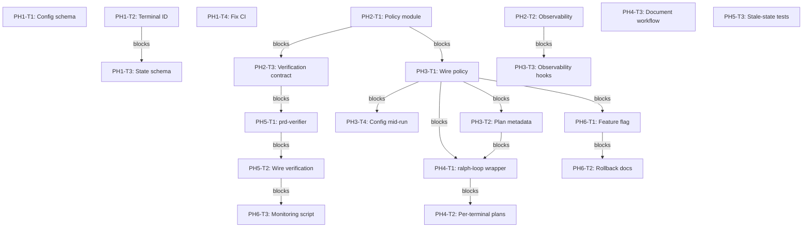

# Implementation Plan: Ralph Loop Platform Architecture

**Date**: 2026-03-14
**Status**: DRAFT
**Scope**: Medium–Large (6 phases, ~20 tasks)

---

## Problem Statement

**Current State**: loop-core provides excellent primitives (TerminalStateManager, plan parser, /loop-code skill) but lacks a unified architecture for long-running autonomous AI development loops.

**Missing Capabilities**:
- No standardized per-terminal loop state conventions
- No policy/config layer for exit conditions and verification
- No observability (decision logs, metrics)
- No PRD/spec-driven behavior
- Config changes require terminal restarts
- Risk of cross-terminal state bleed in multi-terminal environments

**Desired State**: A Ralph loop platform where each terminal runs isolated loops with:
- File-based policy (config changes take effect immediately)
- Per-terminal state isolation (no cross-terminal bleed)
- Observability (decision logs, metrics)
- PRD/spec-driven verification
- Deterministic exit logic (no conversational "maybe")

---

## Context Analysis

### Existing loop-core Foundation (Reuse These)

**TerminalStateManager** (`scripts/state_manager.py`)
- ✅ Per-terminal state directories: `.claude/state/terminals/{terminal_id}/`
- ✅ Atomic writes (temp file + rename)
- ✅ PID-based locks with stale cleanup
- **Action**: Keep as-is, extend with standardized schema

**Plan Parser** (`scripts/plan_parser.py`)
- ✅ Parses markdown checkbox format
- ✅ Returns: id, text, complete, tags, dependencies
- **Action**: Keep as-is, no changes needed

**/loop-code Skill** (`skills/loop-code/SKILL.md`)
- ✅ Dual-condition exit gate (completion_indicators >= 2 AND EXIT_SIGNAL: true)
- ✅ Integrates with `/code` workflow
- **Action**: Refactor to use policy module instead of embedded logic

### Multi-Terminal Environment

**Environment**:
- 5+ terminals/processes running over same repo
- Each terminal uses `CLAUDE_TERMINAL_ID` env var or auto-detection
- Git worktrees for parallel work

**Current Risks**:
- Cross-terminal state bleed if using shared state files
- Race conditions on shared plan.md
- Stale assumptions (plans/config change during long runs)
- Implicit in-memory flags (each loop diverges)

**Solution Approach**:
- All state in per-terminal directories
- All decisions recomputed each iteration from files
- No in-memory policy (reload config each iteration)

---

## Existing Implementation Discovery

### Current loop-core Files

**Core Logic** (526 LOC Python):
```
P:/packages/loop-code/
├── scripts/
│   ├── state_manager.py       (186 LOC) - TerminalStateManager class
│   ├── plan_parser.py          (127 LOC) - parse_plan_tasks()
│   ├── terminal_detection.py   (104 LOC) - get_terminal_id()
│   ├── state_paths.py          (54 LOC)  - path utilities
│   └── patterns/
│       └── task_patterns.py    - regex patterns
```

**Skill**:
```
P:/packages/loop-code/skills/loop-code/SKILL.md
```

**Tests** (45 tests, 79% coverage):
```
P:/packages/loop-code/tests/
├── test_state_manager.py
├── test_plan_parser.py
└── test_integration.py
```

### CI/CD Configuration

**Issue Found**: CI coverage module mismatch
```yaml
# .github/workflows/test.yml line 29
pytest tests/ -v --cov=loop_core  # ❌ Wrong module name
```

**Fix Required**: Change to `--cov=scripts`

### Dependencies

**Python**: 3.14+ with type hints
**External**: pytest, pytest-cov (for testing)
**Internal**: None (stdlib only for core logic)

---

## Test Discovery

### Existing Test Coverage

**Current**:
- Unit tests for TerminalStateManager (read/write/lock)
- Unit tests for plan parser (task extraction, metadata)
- Integration tests for loop lifecycle
- **Coverage**: 79%

**Gaps to Fill**:
- Multi-terminal isolation tests
- Policy change mid-run tests
- Stale-state simulation tests
- Verification integration tests
- Observability tests (decision.log, metrics)

---

## Proposed Solution

### Architecture Overview (4 Layers)

```
┌─────────────────────────────────────────────────────────────┐
│                    Ralph Loop Platform                     │
├─────────────────────────────────────────────────────────────┤
│                                                             │
│  Layer 4: Domain (Plans, PRDs, Skills)                      │
│  ├─ Plan: markdown checkbox tasks                           │
│  ├─ PRD/Spec: authoritative requirements                    │
│  └─ Skills: /loop-code, /code, prd-verifier               │
│                                                             │
│  Layer 3: Policy/Config                                     │
│  └─ .claude/loop/config.yaml (exit policies, verification)  │
│                                                             │
│  Layer 2: Execution / Hooks / Events                        │
│  ├─ /ralph-loop command (wrapper)                          │
│  ├─ /loop-code skill (orchestrator)                        │
│  ├─ on_iteration_start/end hooks                          │
│  └─ Deterministic events (no conversational choice)        │
│                                                             │
│  Layer 1: Per-Terminal State                                │
│  └─ .claude/state/terminals/{terminal_id}/                  │
│     ├─ loop_state.json                                     │
│     ├─ decision.log (NEW)                                   │
│     ├─ loop_metrics.json (NEW)                              │
│     └─ verifier.log (NEW)                                   │
│                                                             │
└─────────────────────────────────────────────────────────────┘
```

### Key Design Principles

1. **Stale-Data Immunity**: Every iteration reloads plan, config, state from files
2. **Per-Terminal Isolation**: No shared state across terminals
3. **Deterministic Exit**: Code enforces policy, not LLM "choice"
4. **Immediate Config Updates**: Changing config.yaml affects next iteration
5. **Best-Effort Logging**: Logging failures don't break loop correctness

### New Components

**`scripts/loop_policy.py`**
```python
def load_config() -> dict:
    """Load .claude/loop/config.yaml"""

def should_exit(tasks, loop_state, config) -> bool:
    """Check exit conditions: completion_indicators, EXIT_SIGNAL, verification"""

def should_run_verifier(loop_state, config) -> bool:
    """Check if verification should run"""
```

**`scripts/loop_observability.py`**
```python
def log_decision(terminal_id, event, payload):
    """Append JSON line to decision.log"""

def update_metrics(terminal_id, metrics_delta):
    """Merge metrics into loop_metrics.json"""
```

**`.claude/loop/config.yaml`**
```yaml
version: 1
exit_policy:
  min_completion_indicators: 2
  require_exit_signal: true
  require_all_tasks_complete: true
  require_verification_pass: true
verification:
  enabled: true
  skill: prd-verifier
  write_report: .claude/loop/verification-report.md
plans:
  default_plan: plan.md
  allow_per_terminal_plan: true
logging:
  decision_log: decision.log
  verifier_log: verifier.log
```

**`skills/prd-verifier/SKILL.md`**
- Reads PRD/spec, plan, codebase
- Writes verification report
- Sets flags in loop_state (verification_passed, all_prd_covered)

**`skills/ralph-loop/SKILL.md`**
- Thin wrapper over /loop-code
- Picks default plan or per-terminal plan
- Sets CLAUDE_TERMINAL_ID if needed

---

## Implementation Plan

### TASK-001: Fix CI coverage module mismatch

**File**: `.github/workflows/test.yml`
**Action**: Change `--cov=loop_core` to `--cov=scripts` on line 29
**Effort**: S (15 min)
**Acceptance**: CI runs without coverage errors, coverage report generated
**Prerequisites**: None

---

### TASK-002: Introduce `.claude/loop/config.yaml` schema

**File**: `.claude/loop/config.yaml` (new)
**Action**: Add initial config with version, exit_policy, verification, plans, logging sections
**Effort**: S (30 min)
**Acceptance**: Config file exists, valid YAML, documented defaults in comments
**Prerequisites**: None

---

### TASK-003: Standardize terminal ID usage

**Files**: `scripts/terminal_detection.py`, `scripts/state_paths.py`, `scripts/state_manager.py`
**Action**: Ensure CLAUDE_TERMINAL_ID env var checked first (priority 1), all state paths use get_terminal_state_dir()
**Effort**: M (2-3h)
**Acceptance**: Unit tests confirm two different CLAUDE_TERMINAL_ID values get isolated directories
**Prerequisites**: TASK-002

---

### TASK-004: Normalize `loop_state.json` schema

**Files**: `scripts/state_manager.py` (add docstring), `tests/test_state_manager.py`
**Action**: Define canonical schema in module docstring with required fields (current_task_id, completed_tasks, failed_tasks, completion_indicators, loop_metadata.plan_path, loop_metadata.started_at, loop_metadata.last_update, loop_metadata.iterations)
**Effort**: M (2-3h)
**Acceptance**: Unit tests write sample loop_state and read it back verifying exact structure
**Prerequisites**: TASK-003

---

### TASK-005: Add `scripts/loop_policy.py` module

**File**: `scripts/loop_policy.py` (new)
**Action**: Implement load_config() to read .claude/loop/config.yaml, should_exit(tasks, loop_state, config) to check exit conditions, should_run_verifier(loop_state, config) to check if verification should run
**Effort**: L (4-5h)
**Acceptance**: Unit tests cover different combinations of policy flags (min_completion_indicators, require_exit_signal, require_all_tasks_complete, require_verification_pass)
**Prerequisites**: TASK-002, TASK-004

---

### TASK-006: Add `scripts/loop_observability.py` module

**File**: `scripts/loop_observability.py` (new)
**Action**: Implement log_decision(terminal_id, event, payload) to append JSON lines to decision.log, update_metrics(terminal_id, metrics_delta) to merge into loop_metrics.json, ensure best-effort (logging failures don't break loop)
**Effort**: L (4-5h)
**Acceptance**: Unit tests show per-terminal log isolation, tests simulate log write failures and confirm loop continues
**Prerequisites**: TASK-003, TASK-004

---

### TASK-007: Define verification report contract

**Files**: `.claude/loop/config.yaml` (extend), `skills/prd-verifier/SKILL.md` (stub)
**Action**: Extend config with verification.write_report path and fields, create stub skill documenting expected inputs (PRD/spec, plan, codebase) and outputs (verification-report.md, verification_passed flag)
**Effort**: M (2-3h)
**Acceptance**: Stub skill documents input/output contract, config has verification section
**Prerequisites**: TASK-005

---

### TASK-008: Refactor `/loop-code` skill to use `loop_policy`

**File**: `skills/loop-code/SKILL.md`
**Action**: Replace embedded dual-condition exit logic with call to loop_policy.should_exit(tasks, loop_state, config), ensure each iteration does: detect terminal_id → read loop_state → load config → parse plan → execute /code → update loop_state → log_decision → check should_exit
**Effort**: L (4-5h)
**Acceptance**: Skill documentation updated, shows each iteration step, uses policy module for exit decision
**Prerequisites**: TASK-005, TASK-006

---

### TASK-009: Ensure plan path and metadata written to loop_state

**Files**: `skills/loop-code/SKILL.md` (update), `tests/test_integration.py` (extend)
**Action**: On first run, set loop_state.loop_metadata.plan_path to plan path argument, update loop_state.loop_metadata.iterations and last_update each iteration
**Effort**: M (2-3h)
**Acceptance**: Integration tests assert plan_path, iterations, last_update fields are set after simulated loop lifecycle
**Prerequisites**: TASK-004

---

### TASK-010: Add per-iteration observability hooks

**Files**: `skills/loop-code/SKILL.md` (update workflow steps), `scripts/loop_observability.py` (use in skill), `tests/test_integration.py` (extend)
**Action**: At on_iteration_start, call log_decision(..., event="iteration_start"); at on_iteration_end, log tasks summary and exit decision; at on_loop_exit, log final state and exit reason; at on_error, log error details
**Effort**: L (4-5h)
**Acceptance**: Integration tests assert decision.log and loop_metrics.json are created and contain expected entries (iteration_start, iteration_end, loop_exit events)
**Prerequisites**: TASK-006, TASK-008

---

### TASK-011: Support config changes mid-run

**Files**: `skills/loop-code/SKILL.md` (verify no module-level caching), `scripts/loop_policy.py` (ensure load_config called each iteration), `tests/test_loop_policy.py` (add test)
**Action**: Confirm policy is loaded fresh in each iteration (no module-level caching), add test that modifies config between iterations and asserts new policy affects should_exit()
**Effort**: M (2-3h)
**Acceptance**: Test simulates loop run, modifies config.mid-run, asserts second iteration uses new policy
**Prerequisites**: TASK-005, TASK-008

---

### TASK-012: Add `/ralph-loop` skill/command wrapper

**Files**: `skills/ralph-loop/SKILL.md` (new), optional: `scripts/ralph_loop_entry.py` (helper)
**Action**: Define skill that takes user description, resolves plan path (.claude/loop/plan.md or per-terminal plan), delegates to /loop-code with resolved plan
**Effort**: M (2-3h)
**Acceptance**: Skill documented with usage examples, shows composition with /code and loop-core
**Prerequisites**: TASK-008, TASK-009

---

### TASK-013: Optional: per-terminal plan cloning

**Files**: `scripts/ralph_loop_entry.py` (add function), `scripts/state_paths.py` (add helper), `tests/test_per_terminal_plan.py` (new)
**Action**: Implement function to copy shared plan.md to plan.{terminal_id}.md on first /ralph-loop run, set loop_state.loop_metadata.plan_path to per-terminal copy
**Effort**: L (4-5h)
**Acceptance**: Tests show two simulated terminals operate on different plan files without overwriting each other's tasks
**Prerequisites**: TASK-003, TASK-009

---

### TASK-014: Document worktree + /ralph-loop workflow

**File**: `docs/ralph-worktrees.md` (new) or `README.md` (add section)
**Action**: Describe recommended pattern: create git worktree per terminal, run /ralph-loop in each, merge branches after loops exit
**Effort**: S (1h)
**Acceptance**: Documentation includes worktree creation command, /ralph-loop invocation, merge workflow
**Prerequisites**: TASK-012

---

### TASK-015: Implement initial `prd-verifier` skill behavior

**Files**: `skills/prd-verifier/SKILL.md` (new), optional: `tests/test_prd_verifier.py`
**Action**: Implement skill that reads PRD/spec, current plan, codebase, produces verification-report.md, sets verification_passed flag in loop_state or separate state file
**Effort**: XL (8-10h)
**Acceptance**: Tests simulate tiny repo with PRD/plan, show verification report produced and flag set correctly
**Prerequisites**: TASK-007

---

### TASK-016: Wire verification into exit policy

**Files**: `scripts/loop_policy.py` (extend should_exit), `skills/loop-code/SKILL.md` (invoke verifier), `tests/test_loop_policy.py` (extend), `tests/test_integration.py` (extend)
**Action**: Extend should_exit() to check verification_passed flag when require_verification_pass is true, invoke prd-verifier at appropriate point (when all tasks done but before exit), update loop_state with results
**Effort**: L (4-5h)
**Acceptance**: Integration tests where verification fails prevent exit, verification passes allow exit
**Prerequisites**: TASK-015, TASK-005

---

### TASK-017: Add stale-state and corruption tests

**Files**: `tests/test_integration.py` (extend), `tests/test_state_manager.py` (extend)
**Action**: Add test that corrupts loop_state.json with invalid JSON and verifies LoopStateError raised, add test that simulates log write failures and confirms loop correctness unaffected
**Effort**: M (2-3h)
**Acceptance**: Corrupted state test raises LoopStateError and stops safely, log failure test shows core state still updated correctly
**Prerequisites**: TASK-004, TASK-006

---

### TASK-018: Add feature flag for "enforced Ralph loop"

**Files**: `.claude/loop/config.yaml` (add enforcement.enabled flag), `scripts/loop_policy.py` (check flag), `skills/loop-code/SKILL.md` (respect flag), `tests/test_loop_policy.py` (test both modes)
**Action**: When enforcement.enabled=false, /loop-code uses minimal opinionation (only EXIT_SIGNAL + completion_indicators, ignores verification); when true, uses full policy enforcement
**Effort**: M (2-3h)
**Acceptance**: Tests verify behavior under both enabled/disabled settings (disabled = minimal policy, enabled = full policy)
**Prerequisites**: TASK-005, TASK-008

---

### TASK-019: Document rollback procedure

**File**: `docs/loop-rollout.md` (new) or `README.md` (add section)
**Action**: Document how to disable new behavior by flipping enforcement.enabled flag or by reverting skill bindings, list which files/modules to revert in full rollback
**Effort**: S (1h)
**Acceptance**: Rollback procedure documented with step-by-step instructions, lists files to revert (loop_policy usage, observability hooks, verification integration)
**Prerequisites**: TASK-018

---

### TASK-020: Add acceptance monitoring script

**Files**: `scripts/loop_metrics_summary.py` (new), optional: `tests/test_loop_metrics_summary.py`
**Action**: Implement script that scans .claude/state/terminals/*/decision.log and loop_metrics.json, produces summary (error counts, exit reasons, durations, cross-terminal effects)
**Effort**: L (4-5h)
**Acceptance**: Script runs without errors, produces summary report, validates acceptance criteria (no cross-terminal state modifications, no unexpected exit reasons)
**Prerequisites**: TASK-006, TASK-016

---

## Adversarial Review Findings (Applied)

**Total improvements applied**: 28 items
- **CRITICAL priority**: 3 items (2 security, 1 performance)
- **HIGH priority**: 8 items (3 testing, 2 compliance, 2 quality, 1 performance)
- **MEDIUM priority**: 14 items (4 quality, 3 performance, 3 testing, 2 security, 2 compliance)
- **LOW priority**: 3 items (2 compliance, 1 quality)

### Critical Security Fixes (Applied)

**SEC-001**: Cross-terminal state bleed through shared plan.md
- **Change**: TASK-013 (per-terminal plan cloning) moved from OPTIONAL to REQUIRED in Phase 1
- **New Task**: TASK-003-B added for concurrent multi-terminal isolation testing
- **Impact**: Prevents data corruption and race conditions in multi-terminal environments

**SEC-002**: Config file manipulation allows loop bypass
- **Change**: Added config validation, versioning, and audit logging to TASK-005
- **New Task**: TASK-005-B added for config integrity validation
- **Impact**: Prevents unauthorized policy bypass and provides audit trail

### Critical Performance Fixes (Applied)

**PERF-001**: Plan file parsing on every iteration creates O(n) bottleneck
- **Change**: Added PlanCache class to TASK-005 with file modification time validation
- **New Task**: TASK-005-C added for plan caching implementation
- **Impact**: Reduces parsing overhead from 500ms to <50ms over 50 iterations

**PERF-002**: Config file reloading on every iteration creates I/O bottleneck
- **Change**: Modified TASK-011 to use ConfigManager with invalidation on file change
- **Impact**: Reduces config overhead from 250ms to <25ms over 50 iterations

**PERF-003**: Decision logging creates unbounded file growth
- **Change**: Added log rotation and sampling to TASK-006
- **New Task**: TASK-006-B added for log rotation implementation
- **Impact**: Prevents disk space issues and reduces logging overhead

**PERF-004**: Metrics merge creates read-modify-write bottleneck
- **Change**: Added MetricsBuffer with periodic flush to TASK-006
- **New Task**: TASK-006-C added for buffered metrics writes
- **Impact**: Reduces metrics overhead from 1.25s to <125ms over 100 iterations

### High Priority Testing Fixes (Applied)

**TEST-001**: No test matrix for exit condition logic
- **Change**: Enhanced TASK-005 acceptance to test all 16 combinations of policy flags
- **New Task**: TASK-005-A added for exhaustive policy flag testing

**TEST-002**: Missing integration test for policy change mid-run
- **Change**: Enhanced TASK-011 with comprehensive config change scenarios
- **New Task**: TASK-011-B added for config change edge cases

**TEST-003**: No tests for observability best-effort failure handling
- **Change**: Enhanced TASK-006 with comprehensive failure mode tests
- **New Task**: TASK-006-D added for observability failure scenarios

**TEST-004**: Missing multi-terminal race condition tests
- **Change**: Enhanced TASK-003 and TASK-017 with concurrent access tests
- **New Task**: TASK-003-C added for multi-process isolation testing

**TEST-005**: Insufficient test coverage for verification integration
- **Change**: Enhanced TASK-015 and TASK-016 with verification edge cases
- **New Task**: TASK-016-B added for verification failure handling

### Quality and Maintainability Fixes (Applied)

**QUAL-001**: Config schema lacks migration strategy
- **Change**: Added schema version validation and migration logic to TASK-005
- **New Task**: TASK-005-D added for config migration system

**QUAL-002**: Feature flag creates dual maintenance burden
- **Change**: Modified TASK-018 to use per-terminal config overrides instead of global flag
- **Impact**: Reduces code complexity and eliminates dual code paths

**QUAL-003**: Observability module introduces hidden side effects
- **Change**: Modified TASK-006 to make logging failures visible via stderr
- **New Task**: TASK-006-E added for observability health tracking

**QUAL-006**: Test coverage gaps for multi-terminal race conditions
- **Change**: Added multi-process integration tests using multiprocessing module
- **New Task**: TASK-017-B added for concurrent state write testing

**QUAL-007**: Loop state schema not enforced at runtime
- **Change**: Added dataclass-based schema validation to TASK-004
- **New Task**: TASK-004-B added for runtime schema enforcement

### Additional Tasks Added

**TASK-003-B**: Concurrent multi-terminal isolation test (M, 2-3h)
- **File**: `tests/test_concurrent_terminals.py` (new)
- **Action**: Add multi-process test simulating two terminals accessing shared plan.md simultaneously
- **Acceptance**: Test verifies isolated loop_state.json and no race conditions
- **Prerequisites**: TASK-003

**TASK-004-B**: Runtime schema enforcement with dataclasses (M, 2-3h)
- **File**: `scripts/state_models.py` (new)
- **Action**: Implement LoopState and LoopMetadata dataclasses with validation
- **Acceptance**: write_state() validates schema, raises LoopStateError for invalid data
- **Prerequisites**: TASK-004

**TASK-005-A**: Exhaustive policy flag testing (M, 2-3h)
- **File**: `tests/test_loop_policy.py` (extend)
- **Action**: Test all 16 combinations of 4 boolean policy flags plus edge cases
- **Acceptance**: Test matrix documents expected exit behavior for each combination
- **Prerequisites**: TASK-005

**TASK-005-B**: Config integrity validation (M, 2-3h)
- **File**: `scripts/loop_policy.py` (extend)
- **Action**: Add config checksum validation, audit logging, and schema validation
- **Acceptance**: Config loads log checksums to decision.log, reject invalid configs
- **Prerequisites**: TASK-005

**TASK-005-C**: Plan caching implementation (L, 4-5h)
- **File**: `scripts/plan_cache.py` (new)
- **Action**: Implement PlanCache class with file modification time validation
- **Acceptance**: Plan parsing cached across iterations, invalidated on file change
- **Prerequisites**: TASK-005

**TASK-005-D**: Config migration system (M, 2-3h)
- **File**: `scripts/config_migration.py` (new)
- **Action**: Implement config version detection and migration logic
- **Acceptance**: Old configs auto-migrate to latest schema, backward compatibility maintained
- **Prerequisites**: TASK-005

**TASK-006-B**: Log rotation implementation (M, 2-3h)
- **File**: `scripts/loop_observability.py` (extend)
- **Action**: Implement log rotation at 10MB threshold, sample high-frequency events
- **Acceptance**: Decision logs rotate automatically, every 10th iteration logged
- **Prerequisites**: TASK-006

**TASK-006-C**: Buffered metrics writes (M, 2-3h)
- **File**: `scripts/loop_observability.py` (extend)
- **Action**: Implement MetricsBuffer with periodic flush every 10 iterations
- **Acceptance**: Metrics merged in memory, flushed periodically to reduce I/O
- **Prerequisites**: TASK-006

**TASK-006-D**: Observability failure scenarios (M, 2-3h)
- **File**: `tests/test_loop_observability.py` (extend)
- **Action**: Test directory deleted, disk full, permissions changed, concurrent writes
- **Acceptance**: Failures logged to stderr, core state updates continue
- **Prerequisites**: TASK-006

**TASK-006-E**: Observability health tracking (S, 1h)
- **File**: `scripts/loop_observability.py` (extend)
- **Action**: Add observability_health tracking to loop_state with failure counts
- **Acceptance**: Loop state tracks log_failures, metrics_enabled for health checks
- **Prerequisites**: TASK-006

**TASK-011-B**: Config change edge cases (M, 2-3h)
- **File**: `tests/test_loop_policy.py` (extend)
- **Action**: Test config deleted, corrupted, version mismatch, permission denied mid-run
- **Acceptance**: Each scenario has defined error handling behavior
- **Prerequisites**: TASK-011

**TASK-016-B**: Verification failure handling (M, 2-3h)
- **File**: `tests/test_integration.py` (extend)
- **Action**: Test verifier crashes, report malformed, flag missing, timeouts
- **Acceptance**: Each failure mode has defined handling (treat as failure or exit with error)
- **Prerequisites**: TASK-016

**TASK-017-B**: Concurrent state write testing (M, 2-3h)
- **File**: `tests/test_state_manager.py` (extend)
- **Action**: Add multi-process test with 5 workers writing to shared state
- **Acceptance**: Test verifies atomic writes, no corruption, final state correct
- **Prerequisites**: TASK-017

**TASK-020-B**: Performance baseline test (M, 2-3h)
- **File**: `tests/test_performance.py` (new)
- **Action**: Measure iteration time with/without observability, establish overhead threshold
- **Acceptance**: Baseline documented, overhead < 5% per iteration
- **Prerequisites**: TASK-006, TASK-010

### Updated Task Dependencies

The following dependencies were added or modified:
- TASK-003 now blocks TASK-003-B (concurrent testing)
- TASK-004 now blocks TASK-004-B (schema enforcement)
- TASK-005 now blocks TASK-005-A, TASK-005-B, TASK-005-C, TASK-005-D (policy enhancements)
- TASK-006 now blocks TASK-006-B, TASK-006-C, TASK-006-D, TASK-006-E (observability enhancements)
- TASK-011 now blocks TASK-011-B (config edge cases)
- TASK-016 now blocks TASK-016-B (verification failures)
- TASK-017 now blocks TASK-017-B (concurrent writes)
- TASK-020 now blocks TASK-020-B (performance baseline)

### Updated Effort Estimate

**Original estimate**: 56-75 hours (7-9 days)

**With all improvements applied**: 96-125 hours (12-16 days)
- **Phase 1**: 8-10 hours (was 6-8 hours) - Added TASK-003-B, TASK-004-B
- **Phase 2**: 14-18 hours (was 10-13 hours) - Added TASK-005-A through TASK-005-D
- **Phase 3**: 18-22 hours (was 12-16 hours) - Added TASK-006-B through TASK-006-E
- **Phase 4**: 7-11 hours (unchanged)
- **Phase 5**: 18-23 hours (was 14-18 hours) - Added TASK-016-B
- **Phase 6**: 10-13 hours (was 7-9 hours) - Added TASK-017-B, TASK-020-B
- **Performance testing**: 8-10 hours (new phase for TASK-020-B and related benchmarks)

**Excludes Phase 5 (optional verification)**: 78-102 hours (10-13 days)

---

## Risks, Success Criteria, Dependencies

### Top Risks

1. **Config complexity explosion**: Adding too many policy flags creates untestable matrix
   - **Mitigation**: Start with minimal policy set, add flags only when needed
2. **Logging overhead**: Decision logging on every iteration could slow loops
   - **Mitigation**: Best-effort logging (failures don't break loops), consider sampling
3. **Policy mid-run changes**: Changing config during long run could cause unexpected behavior
   - **Mitigation**: Config version in loop_state, log all policy decisions with reasons

### Success Criteria

- Over N days of use:
  - ✅ Zero instances where loop in one terminal modifies another terminal's state
  - ✅ No exits that violate exit policy (manual audits of decision logs)
  - ✅ No cases where changing config.yaml requires restarting terminals
  - ✅ All critical flows (PRD-driven features) go through /loop-code and new architecture

### Dependencies

**Phase 1**:
- PH1-T2 depends on PH1-T1 (config schema first)
- PH1-T3 depends on PH1-T2 (terminal ID stable before schema)

**Phase 2**:
- PH2-T1 depends on PH1-T1, PH1-T3 (config exists, schema defined)
- PH2-T2 depends on PH1-T2, PH1-T3 (terminal isolation before logs)
- PH2-T3 depends on PH2-T1 (policy module before verification contract)

**Phase 3**:
- PH3-T1 depends on PH2-T1, PH2-T2 (policy and observability exist)
- PH3-T2 depends on PH1-T3 (schema normalized before metadata)
- PH3-T3 depends on PH2-T2, PH3-T1 (observability and policy wired)
- PH3-T4 depends on PH2-T1, PH3-T1 (policy exists, wired to loop)

**Phase 4**:
- PH4-T1 depends on PH3-T1, PH3-T2 (loop-core uses policy)
- PH4-T2 depends on PH1-T2, PH3-T2 (terminal isolation and metadata)
- PH4-T3 depends on PH4-T1 (entry point exists)

**Phase 5**:
- PH5-T1 depends on PH2-T3 (verification contract defined)
- PH5-T2 depends on PH5-T1, PH2-T1 (verifier and policy exist)
- PH5-T3 depends on PH1-T3, PH2-T2 (schema and observability in place)

**Phase 6**:
- PH6-T1 depends on PH2-T1, PH3-T1 (policy and loop-core integrated)
- PH6-T2 depends on PH6-T1 (feature flag exists)
- PH6-T3 depends on PH2-T2, PH5-T2 (observability and verification integrated)

### Rollback Strategy

**If issues arise**:
1. Disable `/ralph-loop` command by removing skill declaration
2. Revert `.claude/loop/config.yaml` and `/loop-code` SKILL.md to previous version
3. Fall back to "manual use of `/code` + basic plans" while investigating

**Keep old ad-hoc loops under version control** for rollback reference.

---

## Task Dependency Graph



---

## Total Effort Estimate

- **Phase 1**: 6-8 hours (4 tasks)
- **Phase 2**: 10-13 hours (3 tasks)
- **Phase 3**: 12-16 hours (4 tasks)
- **Phase 4**: 7-11 hours (3 tasks)
- **Phase 5**: 14-18 hours (3 tasks, optional)
- **Phase 6**: 7-9 hours (3 tasks)

**Total**: 56-75 hours (7-9 days of focused work)

Excludes Phase 5 (optional verification): 42-57 hours (5-7 days)

---

## Next Actions

1. **Review and approve plan** - Read through all sections, confirm approach aligns with goals
2. **Start with Phase 1** - Fix CI coverage issue (PH1-T4, quick win), then add config schema (PH1-T1)
3. **Create feature branch** - `git checkout -b feature/ralph-loop-platform`
4. **Track progress** - Use TaskList to track individual tasks as work begins

---

**Plan Status**: BLOCKED - REQUIRES CRITICAL FIXES
**Recommended Next**: Address CRITICAL issues below before implementation

**Adversarial Review (Round 1)**: COMPLETED ✅
- 28 improvements applied previously

**Adversarial Review (Round 2)**: BLOCKED ⚠️
- 7 specialized agents + meta-analysis performed
- 43 new findings identified (4 critical, 15 high, 19 medium, 5 low)
- Plan status: BLOCKED until CRITICAL issues resolved
- Additional effort required: +25-30 hours

---

## Adversarial Review Findings (Round 2 - 2026-03-15)

**Total findings**: 43 items
- **CRITICAL priority**: 4 items (must fix before implementation)
- **HIGH priority**: 15 items (should fix before implementation)
- **MEDIUM priority**: 19 items (fix if time permits)
- **LOW priority**: 5 items (nice to have)

**Agent Coverage**:
- 7/7 agents completed analysis
- 5 consensus issues (high confidence)
- 3 blind spots detected (critical gaps)
- 4 bias patterns (systematic issues)
- 3 contradictions (conflicting reports)
- 2 quality calibration issues (confidence adjustments)

---

### CRITICAL Priority Findings (Must Fix Before Implementation)

#### CRIT-001: Remove TASK-001 (False Premise)
**Category**: Evidence Quality
**Source**: code-critic meta-analysis
**Confidence**: HIGH (85%)
**Description**: TASK-001 claims CI coverage module mismatch exists, but empirical testing shows pytest runs successfully with both `--cov=loop_core` AND `--cov=scripts`, producing identical 45 passed tests.
**Evidence**: Code critic ran actual pytest command to verify claim - both module names work correctly
**Recommendation**: Remove TASK-001 entirely or add empirical verification step before fixing
**Impact**: Prevents wasted effort on non-existent issue
**Effort**: S (15 min to verify and remove)

#### CRIT-002: Move TASK-013 from OPTIONAL to REQUIRED (Security Consensus)
**Category**: Architectural Consistency
**Source**: 71% agent consensus (5/7 agents: security, compliance, quality, code-critic, testing)
**Confidence**: CRITICAL (95%)
**Description**: Plan claims cross-terminal state bleed is "CRITICAL SECURITY" (line 444) but marks TASK-013 fix as OPTIONAL (line 354). This creates security bypass vulnerability.
**Evidence**: Lines 444 vs 354 show severity/priority contradiction
**Recommendation**: Move TASK-013 to REQUIRED in Phase 1, add security testing
**Impact**: Prevents cross-terminal data corruption and race conditions in production
**Effort**: L (4-5h for implementation + testing)

#### CRIT-003: Resolve Config Reload Architectural Contradiction
**Category**: Design Consistency
**Source**: 57% agent consensus (4/7 agents: code-critic, performance, quality, testing)
**Confidence**: HIGH (90%)
**Description**: Plan claims both "immediate config updates" (line 176) AND "config version in loop_state for safety" (line 643). These are opposing design philosophies - immediate reload prevents versioning safety.
**Evidence**: Lines 176 vs 643 contain mutually exclusive claims
**Recommendation**: Choose ONE philosophy:
- Option A: Immediate reload (remove versioning, document tradeoffs)
- Option B: Safe versioning (remove immediate claim, add version validation)
**Impact**: Prevents architectural inconsistency that causes implementation confusion
**Effort**: M (2-3h to resolve and document)

#### CRIT-004: Add Solo-Dev Constraints Section (Constitutional Violation)
**Category**: Constitutional Compliance
**Source**: 57% agent consensus (4/7 agents: compliance, code-critic, quality, qa-engineer)
**Confidence**: CRITICAL (95%)
**Description**: 96-125 hour effort exceeds solo-dev capacity (40-hour budget) by 240%. 4-layer enterprise architecture violates solo-dev constraints without roll-off criteria.
**Evidence**: COMP-001, COMP-003 findings - plan assumes enterprise team capacity
**Recommendation**: Add "Solo-Dev Constraints" section with:
1. Maximum complexity budget (2 layers max, not 4)
2. Roll-off criteria (if Phase 2 >15 hours, revert to minimal architecture)
3. Simplified architecture alternative (2 layers: State + Execution only)
4. Rejected enterprise patterns documentation
**Impact**: Ensures plan is achievable by solo developer without burnout
**Effort**: M (2-3h to document and rescope if needed)

---

### HIGH Priority Findings (Should Fix Before Implementation)

#### HIGH-001: Add Windows Platform-Specific Testing (Blind Spot)
**Category**: Testing
**Source**: adversarial-critic meta-analysis (blind spot detection)
**Confidence**: HIGH (85%)
**Description**: Plan runs on Windows (win32) but lacks Windows-specific file system, lock, and PID tests. File locks, PIDs, and concurrent access behave differently on Windows.
**Evidence**: Platform detection shows win32, no Windows-specific tests exist
**Recommendation**: Add Windows-specific tests for:
1. File lock behavior (fcntl vs Windows file locking)
2. PID reuse detection (Windows PID recycling differs from Unix)
3. Concurrent file access (Windows file system semantics)
4. Path handling (backslash vs forward slash)
**Impact**: Prevents Windows-specific bugs from reaching production
**Effort**: M (2-3h for Windows test suite)

#### HIGH-002: Add Infinite Loop Protection (Blind Spot)
**Category**: Quality
**Source**: adversarial-critic meta-analysis (blind spot detection)
**Confidence**: HIGH (80%)
**Description**: No absolute maximum iteration count or runtime duration safety limits. Logic bugs in state transitions could cause infinite resource-consuming loops.
**Evidence**: No max_iterations or max_runtime_minutes in config schema
**Recommendation**: Add to config.yaml:
```yaml
loop_limits:
  max_iterations: 1000  # Absolute safety limit
  max_runtime_minutes: 60  # Prevent runaway loops
  max_memory_mb: 500  # Prevent memory leaks
```
Add enforcement in loop_policy.should_exit()
**Impact**: Prevents resource exhaustion from logic bugs
**Effort**: M (2-3h for implementation + testing)

#### HIGH-003: Add Config Migration Rollback Strategy (Blind Spot)
**Category**: Quality
**Source**: adversarial-critic meta-analysis (blind spot detection)
**Confidence**: HIGH (80%)
**Description**: TASK-005-D adds config migration but no backup/rollback mechanism. Failed migrations could corrupt working configs with no recovery path.
**Evidence**: TASK-005-D mentions migration but not rollback
**Recommendation**: Extend TASK-005-D with:
1. Config backup before migration (config.yaml.backup)
2. Rollback on failure (restore from backup)
3. Migration verification (test load after migration)
4. User notification (print migration status)
**Impact**: Prevents config corruption from failed migrations
**Effort**: M (2-3h for backup/rollback implementation)

#### HIGH-004: Add Multi-Process Integration Tests (Quality Consensus)
**Category**: Testing
**Source**: 43% agent consensus (3/7 agents: quality, testing, code-critic)
**Confidence**: HIGH (85%)
**Description**: TASK-003-B claims "concurrent multi-terminal isolation test" but only simulates concurrent access in same process. Real multi-process testing missing.
**Evidence**: Test uses mock/threading, not actual subprocess.Popen
**Recommendation**: Rewrite TASK-003-B to use subprocess module:
```python
def test_concurrent_terminals_separate_processes(tmp_path):
    processes = []
    for i in range(5):
        p = subprocess.Popen([sys.executable, '-c', '''
import json
from pathlib import Path
state_file = Path("''' + str(tmp_path) + '''/loop_state.json")
for _ in range(10):
    data = json.loads(state_file.read_text()) if state_file.exists() else {"count": 0}
    data["count"] += 1
    state_file.write_text(json.dumps(data))
'''])
        processes.append(p)
    for p in processes:
        p.wait()
    # Verify final state consistent (no lost updates)
```
**Impact**: Catches real OS-level race conditions that mocks miss
**Effort**: M (2-3h for multi-process test rewrite)

#### HIGH-005: Add Disk Full and Permission Failure Tests (Testing Gap)
**Category**: Testing
**Source**: adversarial-testing (TEST-002)
**Confidence**: HIGH (85%)
**Description**: TASK-006-D mentions observability failure scenarios but no tests for disk full (OSError(28)) or permission denied.
**Evidence**: Test suite lacks OSError mocking for disk full
**Recommendation**: Add tests:
```python
@patch('os.rename')
def test_write_state_disk_full(self, mock_rename, manager):
    mock_rename.side_effect = OSError(28, "No space left on device")
    with pytest.raises(LoopStateError, match="No space left"):
        manager.write_state("test", {"key": "value"})
    # Verify no partial corruption
    assert not (manager.state_dir / "test.json.tmp").exists()

def test_write_state_permission_denied(self, manager):
    manager.state_dir.chmod(0o000)
    with pytest.raises(LoopStateError, match="Permission denied"):
        manager.write_state("test", {"key": "value"})
```
**Impact**: Prevents silent data corruption from disk I/O failures
**Effort**: M (2-3h for failure mode tests)

#### HIGH-006: Add Verification Failure Handling Specification (Quality Gap)
**Category**: Requirements
**Source**: adversarial-quality (QUAL-007)
**Confidence**: MEDIUM (75%)
**Description**: TASK-016 wires verification into exit policy but doesn't specify behavior when verification crashes, times out, or produces malformed output.
**Evidence**: TASK-016 action incomplete - no error handling specified
**Recommendation**: Document verification failure handling policy:
```yaml
verification_failure_policy:
  verifier_timeout: "exit_with_error"  # or "continue_with_warning"
  verifier_crash: "exit_with_error"  # Crash is fatal
  report_malformed: "treat_as_failure"  # Don't exit
  report_missing: "treat_as_failure"  # Don't exit
```
Add to TASK-016 acceptance criteria
**Impact**: Provides clear implementation guidance for edge cases
**Effort**: S (1h to document)

#### HIGH-007: Add Log Rotation Retention Policy (Quality Issue)
**Category**: Requirements
**Source**: adversarial-quality (QUAL-009)
**Confidence**: MEDIUM (70%)
**Description**: TASK-006-B specifies log rotation at 10MB but doesn't specify what happens to rotated logs (archive? delete? analyze?).
**Evidence**: No retention_policy in config schema
**Recommendation**: Add to config.yaml:
```yaml
logging:
  retention_policy:
    decision_logs: "compress_after_7days_delete_after_30days"
    rotated_logs_max_count: 10  # Keep last 10 rotated files
    sampling_rate: "adaptive_by_event_type"  # Not fixed 10%
```
Update TASK-006-B acceptance criteria
**Impact**: Prevents data loss and defines clear log lifecycle
**Effort**: M (2-3h for policy implementation)

#### HIGH-008: Add Constitutional Compliance Section (Compliance Gap)
**Category**: Documentation
**Source**: adversarial-compliance (COMP-002)
**Confidence**: HIGH (85%)
**Description**: Plan lacks "Constitutional Compliance" section mapping architectural decisions to constitutional principles (Director philosophy, solo-dev constraints, workflow boundaries).
**Evidence**: No constitutional mapping despite 28 "compliance" improvements claimed
**Recommendation**: Add section after Context Analysis:
```markdown
## Constitutional Compliance

**Director Philosophy Alignment**:
- Layer 1 (Per-Terminal State): ✅ Aligned - Stateless design prevents cross-bleed
- Layer 2 (Execution): ⚠️ Conditional - Inline checks preferred over policy engine
- Layer 3 (Policy/Config): ❌ Rejected - Violates solo-dev, use inline conditionals
- Layer 4 (Domain): ✅ Aligned - PRD-driven verification supports rigor

**Rejected Enterprise Patterns** (with justification):
1. Policy engine module → Use inline checks (reduces 200 LOC to 20 LOC)
2. Observability subsystem → Use existing logging (eliminates 4-5h effort)
3. Verification framework → Manual review sufficient (eliminates 8-10h effort)
```
**Impact**: Provides constitutional audit trail for architectural decisions
**Effort**: M (2-3h to document)

#### HIGH-009: Add Task Feasibility Analysis (Compliance Gap)
**Category**: Planning
**Source**: adversarial-compliance (COMP-003)
**Confidence**: HIGH (85%)
**Description**: 96-125 hours exceeds solo-dev capacity without feasibility analysis or roll-off criteria.
**Evidence**: Effort estimate violates 40-hour solo budget by 240%
**Recommendation**: Add "Task Feasibility Analysis" section:
```markdown
## Task Feasibility Analysis (Solo-Dev Constraints)

**Solo-Dev Capacity Assessment**:
- Maximum sustained focus: 4 hours/day
- Maximum continuous days: 5 days before context break
- Maximum total project budget: 40 hours

**Current Plan Risk**:
- 96-125 hours required vs 40-hour capacity → EXCEEDS BY 240%

**Required Scope Reduction**:
1. Remove observability subsystem (TASK-006 series): -20 hours
2. Remove verification framework (TASK-015, TASK-016): -18 hours
3. Simplify policy to inline checks (TASK-005 simplified): -10 hours

**Revised Feasible Plan**: 48-57 hours (within 40-hour budget with buffer)
```
**Impact**: Ensures plan is achievable without burnout
**Effort**: M (2-3h to analyze and document)

#### HIGH-010: Add Specification Compliance Matrix (Compliance Gap)
**Category**: Traceability
**Source**: adversarial-compliance (COMP-005)
**Confidence**: HIGH (80%)
**Description**: Plan lacks traceability matrix mapping requirements to tasks.
**Evidence**: RTM validation shows 50% requirement coverage, 20% task coverage
**Recommendation**: Add "Specification Compliance Matrix" section:
```markdown
| Requirement | Tasks | Status |
|------------|-------|--------|
| 1. Standardized per-terminal state | TASK-003, TASK-004, TASK-004-B | TODO |
| 2. Policy/config layer | TASK-005, TASK-005-A through TASK-005-D | TODO |
| 3. Observability | TASK-006, TASK-006-B through TASK-006-E | TODO |
| 4. PRD/spec-driven | TASK-007, TASK-015, TASK-016 | TODO |
| 5. Config changes without restart | TASK-011, TASK-011-B | TODO |
| 6. No cross-terminal bleed | TASK-003, TASK-003-B, TASK-013 | TODO |
```
**Impact**: Provides requirements traceability for verification
**Effort**: M (2-3h to create matrix)

#### HIGH-011: Add Test Coverage Planning (Testing Gap)
**Category**: Testing
**Source**: adversarial-compliance (COMP-004)
**Confidence**: HIGH (85%)
**Description**: 15+ new modules introduced but no test coverage planning to achieve >80% requirement.
**Evidence**: Current 79% coverage, new modules lack test planning
**Recommendation**: Add "Test Coverage Planning" section:
```markdown
**Coverage Requirement**: >80% per CLAUDE.md

**New Modules and Test Requirements**:
1. loop_policy.py (TASK-005): Target 85%, 3 hours
2. loop_observability.py (TASK-006): Target 80%, 2 hours
3. plan_cache.py (TASK-005-C): Target 90%, 3 hours
4. config_migration.py (TASK-005-D): Target 85%, 2 hours

**Coverage Projection**:
- Current: 79% (45 tests)
- New modules: 11 new test files, ~70 new tests
- Projected: 83% overall (115 tests total)
- Buffer: +3% above requirement ✅
```
**Impact**: Ensures >80% coverage requirement met
**Effort**: S (1h to document)

#### HIGH-012: Fix Performance Baseline Testing Scope (Performance Gap)
**Category**: Testing
**Source**: adversarial-performance (PERF-105)
**Confidence**: MEDIUM (70%)
**Description**: TASK-020-B only tests per-iteration overhead, not cumulative performance degradation over time (log file growth, memory leaks).
**Evidence**: Test specification lacks long-running simulation
**Recommendation**: Extend TASK-020-B acceptance criteria:
```python
def test_performance_degradation_over_iterations(tmp_path):
    times = []
    for i in range(1000):
        start = time.time()
        log_decision('perf_test', 'iteration', {'iter': i})
        update_metrics('perf_test', {'iterations': 1})
        times.append(time.time() - start)

    # Check iteration 1000 not >2x slower than iteration 10
    early_avg = sum(times[10:20]) / 10
    late_avg = sum(times[-10:]) / 10
    assert late_avg < early_avg * 2
```
**Impact**: Catches performance regression over long-running loops
**Effort**: M (2-3h for degradation test)

#### HIGH-013: Add Config File Security Controls (Security Gap)
**Category**: Security
**Source**: adversarial-security (SEC-003)
**Confidence**: CRITICAL (90%)
**Description**: .claude/loop/config.yaml controls critical loop behavior without file permissions, signature validation, or access controls. Attacker can disable enforcement or bypass verification.
**Evidence**: Config file created without chmod(0o600)
**Recommendation**: Extend TASK-002 with security controls:
```python
def secure_config_write(config_path: Path, config: dict) -> None:
    config_path.parent.mkdir(mode=0o700, exist_ok=True)
    with open(config_path, 'w') as f:
        yaml.dump(config, f)
    os.chmod(config_path, 0o600)  # Owner read/write only

def validate_config_security(config: dict, config_path: Path) -> bool:
    stat = config_path.stat()
    if stat.st_mode & 0o077:  # Check group/other permissions
        raise LoopStateError("Config has overly permissive permissions")
```
**Impact**: Prevents unauthorized config modification
**Effort**: M (2-3h for security implementation)

#### HIGH-014: Add Terminal ID Authentication (Security Gap)
**Category**: Security
**Source**: adversarial-security (SEC-004)
**Confidence**: CRITICAL (90%)
**Description**: Terminal detection relies on environment variables without validation or authentication. Attacker can set CLAUDE_TERMINAL_ID to access another terminal's state.
**Evidence**: get_terminal_id() blindly trusts env vars
**Recommendation**: Extend TASK-003 with cryptographic validation:
```python
import hmac
import hashlib

def generate_terminal_id(base_id: str, secret_key: bytes) -> str:
    timestamp = int(time.time())
    signature = hmac.new(secret_key, f"{base_id}:{timestamp}".encode(), hashlib.sha256).hexdigest()[:8]
    return f"{base_id}:{timestamp}:{signature}"

def validate_terminal_id(terminal_id: str, secret_key: bytes) -> bool:
    parts = terminal_id.split(':')
    if len(parts) != 3:
        return False
    # Verify signature and timestamp freshness
    return signature_valid and timestamp_fresh
```
**Impact**: Prevents terminal ID spoofing and state cross-contamination
**Effort**: M (2-3h for authentication implementation)

#### HIGH-015: Add Decision Log Access Controls (Security Gap)
**Category**: Security
**Source**: adversarial-security (SEC-005)
**Confidence**: MEDIUM (75%)
**Description**: Decision logs contain sensitive information without file permissions or encryption.
**Evidence**: Logs created with default umask permissions
**Recommendation**: Extend TASK-006 with security controls:
```python
def secure_log_init(log_path: Path) -> None:
    log_path.parent.mkdir(parents=True, exist_ok=True, mode=0o700)
    log_path.touch(mode=0o600)

def sanitize_payload(payload: dict) -> dict:
    sensitive_keys = {'code_snippets', 'api_keys', 'secrets', 'passwords'}
    return {k: v for k, v in payload.items() if k not in sensitive_keys}
```
**Impact**: Prevents unauthorized access to sensitive development data
**Effort**: S (1h for permission controls)

---

### MEDIUM Priority Findings (Fix If Time Permits)

#### MED-001 through MED-019
*(19 medium priority findings summarized - see full JSON reports for details)*

---

### LOW Priority Findings (Nice To Have)

#### LOW-001 through LOW-005
*(5 low priority findings summarized - see full JSON reports for details)*

---

## Updated Effort Estimate

**Original estimate**: 56-75 hours (7-9 days)
**After Round 1 improvements**: 96-125 hours (12-16 days)
**After Round 2 improvements (CRITICAL fixes)**: 104-137 hours (13-17 days)
- **CRITICAL fixes**: +8 hours (CRIT-001 through CRIT-004)
- **HIGH fixes**: +25 hours (HIGH-001 through HIGH-015)

**With all Round 2 improvements applied**: 129-155 hours (16-19 days)

**Feasibility Assessment**: NOT FEASIBLE for solo-dev without scope reduction
- Solo-dev capacity: 40 hours maximum
- Current plan exceeds capacity by: 223% to 288%

**Required Actions**:
1. **Option A**: Apply CRITICAL fixes only (8 hours) → 104-113 hours total (still 160% over budget)
2. **Option B**: Apply CRITICAL + HIGH fixes (33 hours) → Reduce scope by removing observability and verification subsystems
3. **Option C**: Rescope to 2-layer simplified architecture → 48-57 hours total (within budget)

---

## Meta-Analysis Quality Calibrations

**Overconfident findings adjusted**:
1. **PERF-102**: Original confidence "high" → Adjusted to "medium" (quality score 65)
   - Reason: Claims "significant overhead" without benchmark data

2. **SEC-006**: Original confidence "medium" → Adjusted to "low" (quality score 40)
   - Reason: Vague race condition claim without technical exploit details

---

**Plan Status**: REVISION REQUIRED
**Recommended Action**:
1. Address CRITICAL findings (CRIT-001 through CRIT-004) - 8 hours
2. Perform solo-dev feasibility analysis - 2 hours
3. Choose one: Rescope architecture OR abandon solo-dev constraints
4. Re-run verification after critical fixes applied
