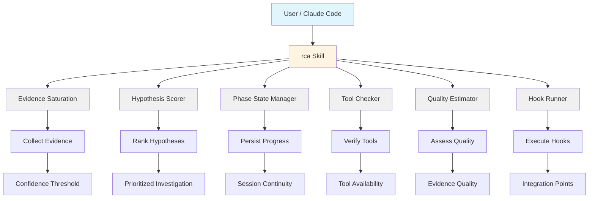

# rca: AI Root Cause Analysis Library + Claude Code Skill

> Unified debugging and Root Cause Analysis toolkit for Claude Code

[](https://github.com/EndUser123/rca/actions)  [](https://opensource.org/licenses/MIT) [](https://codecov.io/gh/EndUser123/rca)

## 📺 Assets & Media

Architecture diagrams and explainer videos are available in the [assets/](./assets/) directory:

- **Architecture Diagram**: See [assets/diagrams/architecture.md](./assets/diagrams/architecture.md) for system design overview with Tier 1 evidence saturation
- **Explainer Video**: Watch the [assets/videos/rca_explainer_pbs.mp4](./assets/videos/rca_explainer_pbs.mp4) for PBS-structured explainer (2:15)
- **Integration Guide**: Examples for integrating with Claude Code hooks and state management

Note: Media assets are generated using NotebookLM and Claude Code's built-in diagramming tools.

**Current Version**: 2.5.0 (Phase 3: Auto-Learning) | **Python Module**: `rca` | **Pip Package**: `rca`

Python library + Claude skill for hypothesis-driven debugging with Tier 1 evidence saturation and phase state management.

## Features

### Core RCA Engine (Tier 1)
- **Evidence Saturation Algorithm**: Accumulates evidence until confidence threshold is met
- **Phase State Persistence**: Track investigation progress across sessions
- **Tool Availability Checking**: Verify required tools before starting analysis
- **Hypothesis Scoring**: Rank hypotheses by reproducibility, recency, and impact
- **Quality Estimation**: Assess evidence quality for confidence ceilings
- **Local-Only Fallback**: Graceful degradation when external services unavailable

### Phase 2: Multi-Angle Search Enforcement
- **Real-time Search Classification**: Automatically categorizes searches as mechanism, functional, temporal, or contextual
- **Mechanism-Only Detection**: Warns when 3+ consecutive implementation searches occur without searching for visible symptoms
- **Context-Aware Suggestions**: Suggests functional search patterns based on mechanism context (e.g., `Progress(` → `yt-api:`)
- **Cross-Terminal Safety**: Terminal ID isolation prevents state pollution between concurrent sessions

### Phase 3: Auto-Learning System
- **Pattern Extraction**: Automatically extracts mechanism→functional relationships from search behavior
- **Symptom Classification**: Classifies issues into 5 types (PERFORMANCE, ERROR, INTEGRATION, INTERMITTENT, SECURITY)
- **Confidence Scoring**: Stores only high-confidence patterns (≥0.5) in CKS
- **CKS Integration**: Persists learned patterns to Constitutional Knowledge System for future sessions
- **Continuous Improvement**: System learns from every mechanism-only search miss

## Quick Start

### Installation

```bash
pip install rca
```

### Basic Usage

```python
from rca import (
  EvidenceSaturation,
  PhaseStateManager,
  HypothesisScorer,
  ToolChecker,
  QualityEstimator,
  run_hook,
)

# Evidence saturation - collect until confidence threshold
saturation = EvidenceSaturation(threshold=0.85)
while not saturation.is_sufficient():
  evidence = collect_evidence()
  saturation.add_evidence(evidence)

# Phase state persistence - track investigation progress
state_mgr = PhaseStateManager("investigation_123")
state_mgr.save_phase("evidence_collection", {"items_collected": 5})

# Hypothesis scoring - rank by multiple factors
scorer = HypothesisScorer()
score = scorer.score_hypothesis(
  hypothesis="Database connection timeout",
  reproducibility=0.8,
  recency_days=1,
  impact=0.9
)
```

### Claude Code Skill

```bash
# Invoke via Claude Code
/rca "app crashes on login"
```

## Architecture

### System Architecture



**Component Overview**:
- **User Interface**: Claude Code skill or Python API
- **Core Modules**: Evidence collection, hypothesis scoring, state management
- **Quality Layer**: Tool checking, quality estimation, confidence assessment
- **Integration**: Hook execution for external tool integration

### Tier 1 Architecture

The `rca.tier1` module provides:

| Module | Purpose |
|--------|---------|
| `evidence_saturation.py` | Collect evidence until confidence threshold |
| `phase_state_manager.py` | Persist investigation phases across sessions |
| `hypothesis_scorer.py` | Score hypotheses by reproducibility, recency, impact |
| `tool_checker.py` | Verify required tools are available |
| `quality_estimator.py` | Assess evidence quality for confidence ceilings |
| `run_hook.py` | Unified hook execution interface |
| `config.py` | Configuration management |

## Claude Code Hooks Architecture

rca uses **scale-based standalone Python hooks** for real-time workflow enforcement. All hooks are in `skill/hooks/` and communicate via JSON stdin/stdout.

### Hook Types

| Hook | Trigger | Purpose |
|------|---------|---------|
| `PostToolUse_rca_init.py` | Skill invocation | Initialize session state, check prerequisites |
| `PostToolUse_rca_phase_tracker.py` | Any tool use | Track investigation phase transitions |
| `PostToolUse_rca_action_tracker.py` | Any tool use | Log actions for evidence trail |
| `PostToolUse_rca_search_validator.py` | **Grep only** | Detect mechanism-only searches (Phase 2) + auto-learning (Phase 3) |
| `PostToolUse_rca_research_storage.py` | WebSearch/WebFetch | Store research findings for session |
| `SessionEnd_rca_cleanup.py` | Session end | Cleanup state, save summary |
| `StopHook_rca_enforcement.py` | Stop events | Quality gate before completion |

### Phase 2: Multi-Angle Search Workflow

```
User searches: Progress(, class Progress, def update_progress
     ↓
PostToolUse_rca_search_validator.py classifies searches
     ↓
Detects: 3 mechanism searches, 0 functional searches
     ↓
Warning: "⚠️ MECHANISM-ONLY SEARCH DETECTED"
Suggestion: grep("yt-api:", "src/")
```

**Search Classification**:
- **Mechanism**: How is it implemented? (`class Foo`, `def bar`, `import`)
- **Functional**: What does the user see? (`yt-api:`, `error:`, `status:`)
- **Temporal**: What changed recently? (`git log`, timestamps)
- **Contextual**: What calls it? (imports, references)

### Phase 3: Auto-Learning Workflow

```
Mechanism-only search detected (3+ consecutive)
     ↓
Extract pattern from search state
     ↓
Classify symptom: PERFORMANCE
     ↓
Suggest functional: yt-api:
     ↓
Calculate confidence: 0.8 (high)
     ↓
Store to CKS: ~/.claude/memory/cks/rca_patterns/PERFORMANCE_*.md
     ↓
Future session queries CKS for PERFORMANCE patterns
     ↓
System suggests: "Also search for 'yt-api:'"
```

**CKS Pattern Storage**:
- Location: `~/.claude/memory/cks/rca_patterns/`
- Format: Markdown + JSON metadata
- Confidence threshold: ≥0.5
- Symptom types: PERFORMANCE, ERROR, INTEGRATION, INTERMITTENT, SECURITY

**Example CKS Entry**:
```markdown
# RCA Search Pattern: PERFORMANCE

**Symptom Type:** PERFORMANCE
**Confidence:** 0.8

## Pattern
When searching for **mechanism**: `Progress(, class Progress, def update`

**Also search for functional symptom:** `yt-api:`

## Relationship
When searching for PERFORMANCE implementation (mechanism patterns),
also search for visible symptom: "yt-api:"

## Usage
In your RCA Step 1.5 (Multi-Angle Search), add:
grep("yt-api:", "src/")
```

### State Management

| State File | Location | Purpose |
|------------|----------|---------|
| `search_validator.json` | `~/.claude/state/rca/` | Search classification history |
| `phase_state.json` | `~/.claude/state/rca/` | Investigation phase tracking |
| `action_log.jsonl` | `~/.claude/state/rca/` | Complete action audit trail |
| `*_TIMESTAMP.md` | `~/.claude/memory/cks/rca_patterns/` | Learned patterns |

All state files have:
- **TTL**: 2 hours (auto-expiry)
- **Terminal ID isolation**: Concurrent sessions don't interfere
- **FileLock**: Cross-terminal safety with portalocker

## Configuration

### Environment Variables

| Variable | Purpose | Default |
|----------|---------|---------|
| `DEBUG_RCA_STATE_DIR` | RCA workflow state directory | `~/.claude/state/rca` |
| `DEBUG_RCA_CSF_SRC` | CSF source path for DaemonClient integration | optional |
| `DEBUG_RCA_VALIDATION_MODE` | Validation mode | `lite` or `strict` |

### Python Module vs Package Name

**Note**: The pip package name is `rca`, and the Python module is `rca` (underscores). This is intentional for Python naming conventions.

```python
# Correct import
from rca import EvidenceSaturation

# Package install name
pip install rca

# CLI command
rca analyze "error message"
```

## Development

### Automated Setup (Windows)

```bash
# Run the automated development setup script
scripts\install-dev.bat
```

This script:
- Creates virtual environment
- Installs in editable mode with dev dependencies
- Installs pre-commit hooks
- Creates Claude Code skill junction at `P:/.claude/skills/rca`

### Manual Setup

```bash
# Install from source (editable mode)
pip install -e P:/packages/rca/

# Run tests
pytest skill/tests/ # Hook/integration tests
pytest tests/     # Python library tests

# Lint
ruff check src/
```

**Note**: The automated script is recommended for Windows development. Manual setup is provided for other platforms or custom configurations.

## Testing Phase 2 & 3 Features

### Test Multi-Angle Search (Phase 2)

```bash
# Run the search validator tests
pytest skill/tests/test_phase2_search_validator.py -v

# Manual test: Trigger mechanism-only warning
cd P:/packages/rca/skill
grep("Progress(", "hooks/")
grep("class Progress", "hooks/")
grep("def update", "hooks/")
# Third mechanism search should trigger warning
```

### Test Auto-Learning (Phase 3)

```bash
# Run the auto-learning test suite
pytest skill/tests/test_phase3_auto_learning.py -v

# View stored patterns
ls ~/.claude/memory/cks/rca_patterns/

# Inspect a learned pattern
cat ~/.claude/memory/cks/rca_patterns/*.md | head -20
```

### Hook Testing

All hooks support direct execution for testing:

```bash
# Test search validator directly
echo '{"tool_name":"Grep","tool_input":{"pattern":"Progress("},"tool_response":{}}' | \
 python skill/hooks/PostToolUse_rca_search_validator.py

# Expected output: JSON with search classification
# {"type":"mechanism","searches":[...]}
```

## Troubleshooting

### Common Issues

**Issue: "ModuleNotFoundError: No module named 'rca'"**
- **Cause**: Package not installed or installed in wrong environment
- **Fix**:
 ```bash
 pip install rca
 # Or for development:
 pip install -e P:/packages/rca/
 ```

**Issue: "Phase state file not found"**
- **Cause**: State directory doesn't exist or permissions issue
- **Fix**:
 ```bash
 mkdir -p ~/.claude/state/rca
 export DEBUG_RCA_STATE_DIR=~/.claude/state/rca
 ```

**Issue: "Tool checker reports tool unavailable"**
- **Cause**: Required tool not in PATH or not installed
- **Fix**: Install the missing tool or set `DEBUG_RCA_VALIDATION_MODE=lite` to skip checks

**Issue: "Evidence saturation never reaches threshold"**
- **Cause**: Insufficient evidence or threshold too high
- **Fix**:
 - Lower threshold: `EvidenceSaturation(threshold=0.70)`
 - Collect more evidence from different sources
 - Check evidence quality (low-quality evidence doesn't increase confidence)

**Issue: "Hypothesis scoring returns low scores"**
- **Cause**: Hypothesis has low reproducibility, old, or low impact
- **Fix**: Focus on recent, high-impact, reproducible hypotheses
 ```python
 score = scorer.score_hypothesis(
   hypothesis="Database timeout",
   reproducibility=0.9, # High - easily reproduced
   recency_days=0,    # Recent - happened today
   impact=0.9      # High - affects many users
 )
 ```

**Issue: "Search validator warning doesn't appear"**
- **Cause**: Hook not installed or Grep tool not being used
- **Fix**:
 ```bash
 # Verify junction exists
 test -d "P:/.claude/skills/rca" || echo "Junction missing"

 # Re-run install script
 cd P:/packages/rca && scripts/install-dev.bat

 # Verify hook file exists
 ls P:/.claude/skills/rca/hooks/PostToolUse_rca_search_validator.py
 ```

**Issue: "CKS patterns not being stored"**
- **Cause**: Confidence score below threshold (0.5) or CKS directory missing
- **Fix**:
 ```bash
 # Create CKS directory
 mkdir -p ~/.claude/memory/cks/rca_patterns

 # Check confidence score in pattern
 cat ~/.claude/memory/cks/rca_patterns/*.json | grep confidence

 # Lower threshold for testing (modify cks_integration.py)
 # Change: if learning.get("confidence", 0) >= 0.5:
 # To:   if learning.get("confidence", 0) >= 0.3:
 ```

**Issue: "Mechanism-only warning is a false positive"**
- **Cause**: Search pattern misclassified or legitimate mechanism-only investigation
- **Fix**:
 - Add one functional search to dismiss warning: `grep("visible-output:", "src/")`
 - Or disable temporarily: `export DEBUG_RCA_VALIDATION_MODE=lite`
 - Report misclassification: https://github.com/EndUser123/rca/issues

### Debug Mode

Enable verbose logging for troubleshooting:

```python
import logging
logging.basicConfig(level=logging.DEBUG)

# Or set environment variable
export DEBUG_RCA_VALIDATION_MODE=strict
```

## Project Structure

```
rca/
├── src/rca/       # Python library (tier1 modules)
│  ├── tier1/         # Core RCA algorithms
│  └── hook_launcher.py    # Hook dispatcher
├── skill/           # Claude Code skill
│  ├── hooks/         # Scale-based Python hooks
│  │  ├── PostToolUse_rca_*.py
│  │  ├── SessionEnd_rca_*.py
│  │  ├── StopHook_rca_*.py
│  │  ├── pattern_extractor.py   # Phase 3
│  │  └── cks_integration.py    # Phase 3
│  ├── tests/         # Hook tests
│  └── SKILL.md        # Skill documentation
├── tests/           # Python library tests
├── scripts/          # Setup utilities
│  └── install-dev.bat     # Windows dev setup
└── README.md          # This file
```

## Getting Help

- **Documentation**: See CONTRIBUTING.md for development setup
- **Issues**: Report bugs at https://github.com/EndUser123/rca/issues
- **Security**: See SECURITY.md for vulnerability reporting

## License

MIT License - see [LICENSE](LICENSE) file.

## Repository

https://github.com/EndUser123/rca
