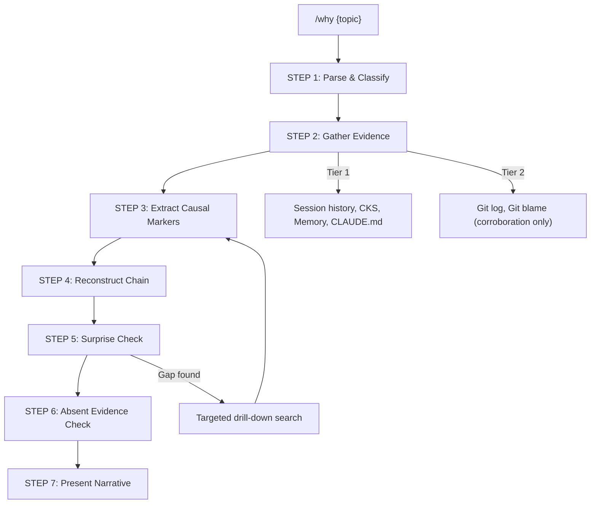

# /why — Decision Archaeology for Claude Code

> Trace backward through sessions to reconstruct why something exists, what caused it, and the reasoning chain behind it.

[](https://github.com)
[](https://github.com)
[](https://opensource.org/licenses/MIT)

## What It Does

**Not `/recap`.** `/recap` tells you what happened chronologically. `/why` traces backward through decisions to reconstruct causal chains — who decided what, why, based on what assumptions.

Inspired by the journalistic five whys technique, adapted for AI-assisted development with evidence-based reconstruction.

## Architecture



### Question Types

| Type | Example | Output |
|------|---------|--------|
| Decision chain | `/why did we change the auth flow?` | Causal chain from origin to current state |
| Existence rationale | `/why do we have nlm?` | Pain point, solution selection, maintenance contract |
| Self-referential | `/why are we building /why?` | Meta — traces the skill's own creation |
| Open | `/why` | Prompts: "What topic do you want to trace?" |

### Data Sources

**Tier 1 — Primary** (terminal-attributed, authoritative):
- Session history via `/recap` CLI
- CKS knowledge base
- Memory files
- CLAUDE.md and ADRs

**Tier 2 — Supplementary** (corroboration only):
- Git log, git blame — cannot attribute to specific terminals

## Key Features

- **Evidence-first**: Every claim traces to a specific data source
- **Causal, not chronological**: Ordered by causation, not time
- **Surprise check**: Iterative five whys — each link is challenged for unexpected gaps
- **Absent evidence detection**: Missing expected evidence flagged as `[ABSENT EVIDENCE]`
- **Multi-terminal aware**: Git is Tier 2 — transcript data is authoritative
- **Compaction resilient**: Falls back to `history.jsonl` summaries via `walk_chain_simple()`

## Installation

### As a Claude Code Plugin

```bash
# Install from local directory
/plugin P:/packages/why
```

### Development Setup (Junction)

```powershell
# Windows — junction the skill directory (no admin required)
New-Item -ItemType Junction -Path "P:\.claude\skills\why" -Target "P:\packages\why\skills\why"
```

### Manual

Copy `skills/why/SKILL.md` to `.claude/skills/why/SKILL.md` in your project.

## Usage

```
/why auth flow                    # Trace auth flow decisions
/why do we have gitingest?        # Why does gitingest exist?
/why did we change the planner?   # Decision chain for planner changes
/why                              # Open — asks what to trace
```

## Dependencies

- `/recap` skill — session history via `recap_cli.py`
- CKS (Constitutional Knowledge System) — stored decisions
- Memory files — project context

## Plugin Structure

```
why/
├── .claude-plugin/
│   └── plugin.json          # Plugin manifest
├── skills/
│   └── why/
│       └── SKILL.md         # Skill definition (261 lines)
├── README.md
├── LICENSE
└── .gitignore
```

## License

MIT
