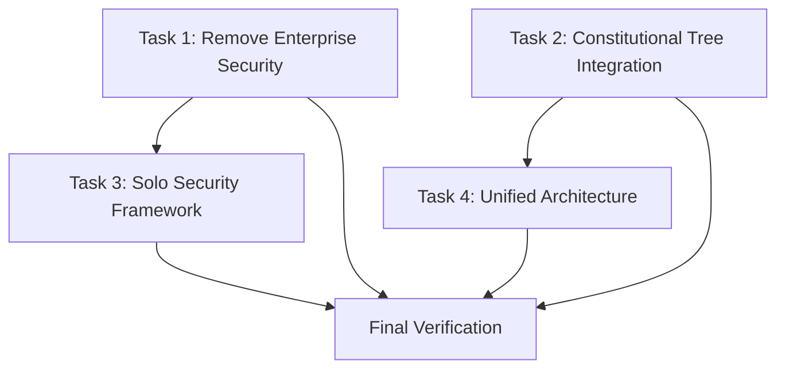

# Parallel Task Breakdown - Constitutional Compliance Fix

## Task Breakdown

### **Task 1: Remove Enterprise Security Theater (PARALLEL)**
**Priority:** CRITICAL | **Owner:** Security Specialist | **Estimate:** 2 hours
**Dependencies:** None | **Parallel:** YES

**Subtasks:**
- [ ] 1.1 Remove OWASP Top 10 enterprise security from smart-review.md
- [ ] 1.2 Remove enterprise vulnerability scanner implementations
- [ ] 1.3 Remove CVSS scoring enterprise components
- [ ] 1.4 Remove "100% OWASP coverage" claims
- [ ] 1.5 Add solo developer security validation principles

**Completion Criteria:**
- No enterprise security theater references remain
- Solo developer security validation implemented
- Truth validator passes with ≥95% confidence

---

### **Task 2: Constitutional Tree Integration (PARALLEL)**
**Priority:** CRITICAL | **Owner:** Architecture Specialist | **Estimate:** 3 hours
**Dependencies:** None | **Parallel:** YES

**Subtasks:**
- [ ] 2.1 Add constitutional tree validation to comply system
- [ ] 2.2 Implement Part J Constitutional Tree Verification Mandate
- [ ] 2.3 Replace self-defined validation with constitutional authority
- [ ] 2.4 Add evidence-based development compliance (§3.6)
- [ ] 2.5 Remove unconstitutional fallback mechanisms

**Completion Criteria:**
- Comply system uses constitutional tree authority
- No self-defined validation criteria remain
- Constitutional compliance verification functional

---

### **Task 3: Solo Developer Security Framework (PARALLEL)**
**Priority:** HIGH | **Owner:** Security Architect | **Estimate:** 4 hours
**Dependencies:** Task 1 completion | **Parallel:** YES

**Subtasks:**
- [ ] 3.1 Design solo developer security validation principles
- [ ] 3.2 Implement practical security threat assessment
- [ ] 3.3 Create solo-appropriate security tooling
- [ ] 3.4 Add effectiveness multiplication security metrics
- [ ] 3.5 Document solo security best practices

**Completion Criteria:**
- Solo developer security framework operational
- Enterprise security theater eliminated
- Practical security validation implemented

---

### **Task 4: Unified Compliance Architecture (PARALLEL)**
**Priority:** HIGH | **Owner:** System Architect | **Estimate:** 5 hours
**Dependencies:** Task 2 completion | **Parallel:** YES

**Subtasks:**
- [ ] 4.1 Design unified constitutional compliance system
- [ ] 4.2 Integrate comply system with constitutional tree
- [ ] 4.3 Implement continuous compliance monitoring
- [ ] 4.4 Add compliance rollback mechanisms
- [ ] 4.5 Create compliance documentation and tests

**Completion Criteria:**
- Unified compliance architecture implemented
- Continuous monitoring operational
- Rollback mechanisms tested and functional

---

## Dependencies

**Critical Path:** Tasks 1 & 2 (parallel) → Tasks 3 & 4 (parallel) → Final Verification

## Completion Criteria

### **System Level:**
- [ ] Constitutional tree integration 100% functional
- [ ] Enterprise security theater completely removed
- [ ] Solo developer security validation operational
- [ ] Truth validator score ≥99% for all changes
- [ ] No unconstitutional bypass mechanisms

### **Quality Gates:**
- [ ] All security changes pass solo developer validation
- [ ] Constitutional compliance verified by truth validator
- [ ] Rollback capabilities tested and documented
- [ ] Evidence-based development compliance achieved

### **Verification Requirements:**
- [ ] `/truth` validation passes with ≥99% confidence
- [ ] `/comply` validates against constitutional tree
- [ ] Solo developer security validation operational
- [ ] No enterprise security patterns detected

## Resource Requirements

### **Specialist Agents:**
- Security Specialist (Task 1, 3)
- Architecture Specialist (Task 2, 4)
- Constitutional Compliance Validator (All tasks)
- Truth Verification Specialist (All verification)

### **Tools Required:**
- Constitutional tree validator
- Truth validator with 0.99 threshold
- Security pattern detector
- Evidence collection system
- Rollback testing framework

### **Parallel Execution Strategy:**
**Phase 1 (0-3 hours):** Tasks 1 & 2 in parallel
**Phase 2 (3-8 hours):** Tasks 3 & 4 in parallel
**Phase 3 (8-12 hours):** Final verification and documentation