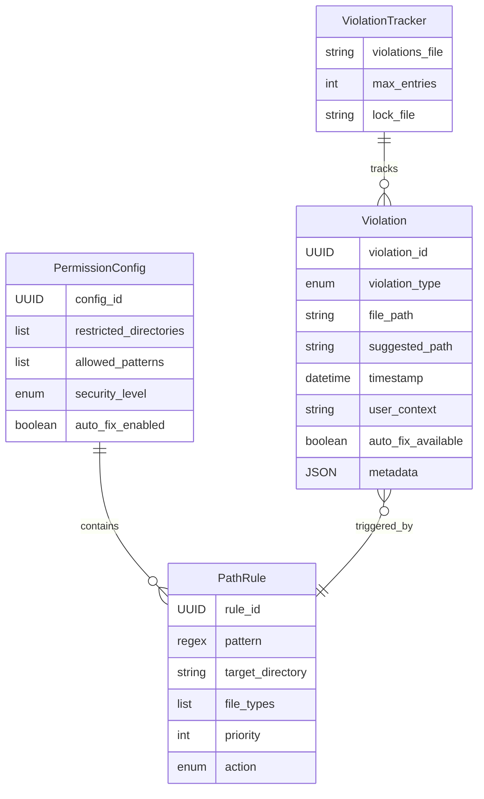

# Data Model: File Permission Protection System

## Overview

This document defines the comprehensive data model for the File Permission Protection System (TSK-FILE-PERMISSION-PROTECTION-20241209-1000). The system is designed to track, manage, and enforce file access permissions with automatic violation detection and remediation capabilities.

## Architecture Decision: File-Based Storage

The system uses a file-based approach rather than a traditional database because:
- **Simplicity**: No external dependencies
- **Portability**: Easy to move and backup
- **Performance**: Direct file I/O for violation tracking
- **Atomicity**: File locks ensure data consistency
- **Scalability**: 1000-entry limit prevents unbounded growth

## Core Entities

### 1. Violation

Represents a single file permission violation detected by the system.

```json
{
  "violation_id": "550e8400-e29b-41d4-a716-446655440000",
  "violation_type": "RESTRICTED_DIRECTORY_ACCESS",
  "file_path": "P:/Windows/System32/sensitive.dll",
  "suggested_path": "P:/temp/safe_location/sensitive.dll",
  "timestamp": "2025-12-09T12:30:45.123Z",
  "user_context": "Attempting to read system file during backup operation",
  "auto_fix_available": true,
  "metadata": {
    "user_id": "user123",
    "process_id": 4567,
    "operation": "READ",
    "security_level": "HIGH",
    "rule_matched": "SYSTEM_FILES_RESTRICTED",
    "remediation_attempts": 0
  }
}
```

#### Field Details:
- **violation_id** (UUID): Primary identifier, generated using `uuid.uuid4()`
- **violation_type** (enum): Type of violation detected
- **file_path** (string): Absolute path that violated permissions
- **suggested_path** (string): Recommended safe alternative path
- **timestamp** (datetime): ISO 8601 formatted UTC timestamp
- **user_context** (string): Description of what the user was doing
- **auto_fix_available** (boolean): Whether automatic remediation is possible
- **metadata** (JSON): Additional context-specific information

#### Violation Types (Enum):
```python
class ViolationType(Enum):
    RESTRICTED_DIRECTORY_ACCESS = "RESTRICTED_DIRECTORY_ACCESS"
    FORBIDDEN_FILE_PATTERN = "FORBIDDEN_FILE_PATTERN"
    UNAUTHORIZED_FILE_TYPE = "UNAUTHORIZED_FILE_TYPE"
    SECURITY_LEVEL_VIOLATION = "SECURITY_LEVEL_VIOLATION"
    PATH_TRAVERSAL_ATTEMPT = "PATH_TRAVERSAL_ATTEMPT"
    SUSPICIOUS_OPERATION = "SUSPICIOUS_OPERATION"
```

### 2. ViolationTracker

Manages the collection and persistence of violations.

```json
{
  "violations_file": "P:/.claude/memory/file_permission_violations.json",
  "max_entries": 1000,
  "lock_file": "P:/.claude/memory/file_permission_violations.lock",
  "backup_file": "P:/.claude/memory/file_permission_violations.backup.json",
  "rotation_policy": {
    "strategy": "FIFO",
    "backup_before_rotation": true,
    "compression_enabled": false
  }
}
```

#### Key Operations:
- **Add Violation**: Thread-safe append to violations array
- **Read Violations**: Atomic read with file locking
- **Rotate Log**: FIFO rotation when max_entries exceeded
- **Backup**: Automatic backup before rotation

### 3. PathRule

Defines routing rules for file path redirection and validation.

```json
{
  "rule_id": "550e8400-e29b-41d4-a716-446655440001",
  "pattern": "^P:/Windows/System32/.*\\.(dll|exe|sys)$",
  "target_directory": "P:/temp/redirected_system_files",
  "file_types": ["dll", "exe", "sys"],
  "priority": 100,
  "action": "REDIRECT",
  "description": "Redirect system file access to safe location",
  "enabled": true,
  "created_at": "2025-12-09T10:00:00Z",
  "updated_at": "2025-12-09T12:00:00Z"
}
```

#### Field Details:
- **rule_id** (UUID): Unique identifier for the rule
- **pattern** (regex): Python regex pattern to match file paths
- **target_directory** (string): Where files should be redirected
- **file_types** (list): Specific file extensions this rule applies to
- **priority** (int): Higher numbers have higher precedence (1-1000)
- **action** (enum): What action to take when rule matches

#### Rule Actions (Enum):
```python
class RuleAction(Enum):
    REDIRECT = "REDIRECT"          # Move to target directory
    COPY = "COPY"                  # Copy to target directory
    BLOCK = "BLOCK"                # Deny access
    WARN = "WARN"                  # Allow but log warning
    QUARANTINE = "QUARANTINE"      # Move to quarantine
```

### 4. PermissionConfig

Central configuration for permission settings and security policies.

```json
{
  "config_id": "550e8400-e29b-41d4-a716-446655440002",
  "restricted_directories": [
    "P:/Windows/System32",
    "P:/Windows/SysWOW64",
    "P:/Program Files/Common Files/System",
    "C:/Windows/System32"
  ],
  "allowed_patterns": [
    "^P:/Users/[^/]+/Documents/.*",
    "^P:/Users/[^/]+/Desktop/.*",
    "^P:/temp/.*",
    "^P:/workspace/.*"
  ],
  "security_level": "HIGH",
  "auto_fix_enabled": true,
  "audit_logging": true,
  "notification_settings": {
    "email_enabled": false,
    "console_enabled": true,
    "file_logging": true
  },
  "version": "1.0.0",
  "last_modified": "2025-12-09T12:00:00Z"
}
```

#### Security Levels (Enum):
```python
class SecurityLevel(Enum):
    LOW = "LOW"        # Minimal restrictions, warnings only
    MEDIUM = "MEDIUM"  # Block dangerous operations
    HIGH = "HIGH"      # Strict enforcement, auto-fix enabled
    CRITICAL = "CRITICAL"  # Maximum security, quarantine everything
```

## Relationships



## Data Storage Format

### Violations File Structure
```json
{
  "version": "1.0",
  "created_at": "2025-12-09T10:00:00Z",
  "last_updated": "2025-12-09T12:30:45Z",
  "total_violations": 42,
  "violations": [
    {
      "violation_id": "...",
      "violation_type": "...",
      "...": "..."
    }
  ]
}
```

### Rules Configuration File
```json
{
  "version": "1.0",
  "config": {
    "config_id": "...",
    "security_level": "HIGH",
    "...": "..."
  },
  "rules": [
    {
      "rule_id": "...",
      "pattern": "...",
      "...": "..."
    }
  ]
}
```

## Data Integrity Constraints

### 1. Atomic Operations
```python
# File writing with atomic rename
def write_violations_atomically(data, filepath):
    temp_file = f"{filepath}.tmp.{uuid.uuid4()}"
    try:
        with open(temp_file, 'w') as f:
            json.dump(data, f, indent=2)
        os.rename(temp_file, filepath)  # Atomic on POSIX, near-atomic on Windows
    except Exception:
        if os.path.exists(temp_file):
            os.remove(temp_file)
        raise
```

### 2. Thread-Safe Access
```python
import fcntl
import time

class FileLock:
    def __init__(self, filepath, timeout=30):
        self.lockfile = f"{filepath}.lock"
        self.timeout = timeout
        self.fd = None

    def __enter__(self):
        start = time.time()
        while True:
            try:
                self.fd = open(self.lockfile, 'w')
                fcntl.flock(self.fd.fileno(), fcntl.LOCK_EX | fcntl.LOCK_NB)
                return
            except (IOError, OSError):
                if time.time() - start > self.timeout:
                    raise TimeoutError(f"Could not acquire lock on {self.lockfile}")
                time.sleep(0.1)

    def __exit__(self, exc_type, exc_val, exc_tb):
        if self.fd:
            fcntl.flock(self.fd.fileno(), fcntl.LOCK_UN)
            self.fd.close()
            os.remove(self.lockfile)
```

### 3. Size Limits
- Maximum violations: 1000 entries
- Maximum violation JSON size: 1KB per entry
- Maximum file size: ~1MB for violations file
- Automatic rotation when limits exceeded

### 4. JSON Schema Validation
```python
from jsonschema import validate, ValidationError

VIOLATION_SCHEMA = {
    "type": "object",
    "required": ["violation_id", "violation_type", "file_path", "timestamp"],
    "properties": {
        "violation_id": {
            "type": "string",
            "pattern": "^[0-9a-f]{8}-[0-9a-f]{4}-[0-9a-f]{4}-[0-9a-f]{4}-[0-9a-f]{12}$"
        },
        "violation_type": {
            "type": "string",
            "enum": ["RESTRICTED_DIRECTORY_ACCESS", "FORBIDDEN_FILE_PATTERN",
                    "UNAUTHORIZED_FILE_TYPE", "SECURITY_LEVEL_VIOLATION",
                    "PATH_TRAVERSAL_ATTEMPT", "SUSPICIOUS_OPERATION"]
        },
        "file_path": {
            "type": "string",
            "minLength": 1,
            "maxLength": 260  # Windows MAX_PATH limit
        },
        "auto_fix_available": {
            "type": "boolean"
        },
        "metadata": {
            "type": "object",
            "additionalProperties": True
        }
    }
}
```

## Indexing Strategy

### 1. In-Memory Indexes
```python
class ViolationIndex:
    def __init__(self):
        self.by_id = {}           # UUID -> Violation
        self.by_timestamp = []    # Sorted list of (timestamp, violation_id)
        self.by_type = {}         # type -> Set[violation_id]
        self.by_file_path = {}    # file_path -> violation_id

    def add(self, violation):
        # Update all indexes
        self.by_id[violation["violation_id"]] = violation

        # Maintained sorted order
        bisect.insort(self.by_timestamp,
                     (violation["timestamp"], violation["violation_id"]))

        # Type index
        if violation["violation_type"] not in self.by_type:
            self.by_type[violation["violation_type"]] = set()
        self.by_type[violation["violation_type"]].add(violation["violation_id"])

        # Path index (exact match)
        self.by_file_path[violation["file_path"]] = violation["violation_id"]
```

### 2. Query Patterns Optimized
- **Recent Violations**: `by_timestamp` index, slice from end
- **Violation by ID**: `by_id` hash lookup
- **Violations by Type**: `by_type` set lookup
- **Specific File Violations**: `by_file_path` hash lookup

## Validation Rules

### 1. Path Validation
```python
def validate_path(path):
    if not path:
        raise ValueError("Path cannot be empty")

    # Normalize path
    path = os.path.normpath(path)

    # Check for path traversal
    if ".." in path.split(os.sep):
        raise ValueError("Path traversal detected")

    # Check length
    if len(path) > 260:
        raise ValueError("Path exceeds maximum length")

    # Check for invalid characters (Windows)
    invalid_chars = '<>:"|?*'
    if any(char in path for char in invalid_chars):
        raise ValueError(f"Path contains invalid characters: {invalid_chars}")

    return path
```

### 2. Rule Validation
```python
def validate_rule(rule):
    # Rule ID must be valid UUID
    try:
        uuid.UUID(rule["rule_id"])
    except ValueError:
        raise ValueError("Invalid rule_id UUID")

    # Priority must be 1-1000
    if not 1 <= rule["priority"] <= 1000:
        raise ValueError("Priority must be between 1 and 1000")

    # Pattern must be valid regex
    try:
        re.compile(rule["pattern"])
    except re.error as e:
        raise ValueError(f"Invalid regex pattern: {e}")

    # Target directory must exist or be creatable
    target = rule["target_directory"]
    if not os.path.exists(os.path.dirname(target)):
        raise ValueError("Parent directory of target does not exist")
```

## Migration and Versioning

### Version History
- **v1.0**: Initial implementation
  - Core entities: Violation, ViolationTracker, PathRule, PermissionConfig
  - File-based storage with JSON
  - Thread-safe operations

### Migration Strategy
```python
def migrate_violations_v1_to_v2(old_file, new_file):
    """Migrate from v1.0 to v2.0 format"""
    with open(old_file, 'r') as f:
        old_data = json.load(f)

    new_data = {
        "version": "2.0",
        "created_at": old_data.get("created_at", datetime.utcnow().isoformat()),
        "last_updated": datetime.utcnow().isoformat(),
        "total_violations": len(old_data.get("violations", [])),
        "violations": []
    }

    for old_violation in old_data.get("violations", []):
        new_violation = migrate_violation(old_violation)
        new_data["violations"].append(new_violation)

    write_violations_atomically(new_data, new_file)
```

## Performance Considerations

### 1. Lazy Loading
- Load violations on demand
- Keep only recent violations in memory (last 100)
- Full file scan only when necessary

### 2. Batch Operations
```python
def add_violations_batch(violations):
    """Add multiple violations efficiently"""
    with FileLock(VIOLATIONS_FILE):
        data = load_violations()

        # Validate all first
        for v in violations:
            validate_violation(v)

        # Add all at once
        data["violations"].extend(violations)

        # Rotate if necessary
        if len(data["violations"]) > MAX_VIOLATIONS:
            excess = len(data["violations"]) - MAX_VIOLATIONS
            data["violations"] = data["violations"][excess:]

        write_violations_atomically(data, VIOLATIONS_FILE)
```

### 3. Caching
```python
from functools import lru_cache

@lru_cache(maxsize=128)
def get_rule_by_id(rule_id):
    """Cached rule lookup"""
    rules = load_rules()
    for rule in rules:
        if rule["rule_id"] == rule_id:
            return rule
    return None
```

## Security Considerations

### 1. File Permissions
- Violations file: Read-only for normal users
- Configuration: Admin-only write access
- Lock files: Mode 0600 (owner read/write only)

### 2. Data Sanitization
```python
def sanitize_user_input(text):
    """Remove potentially dangerous characters"""
    if not text:
        return ""

    # Remove control characters except newline, tab
    sanitized = ''.join(char for char in text
                       if char.isprintable() or char in '\n\t')

    # Limit length
    return sanitized[:1000]
```

### 3. Backup and Recovery
- Automatic backup before rotation
- Versioned backups with timestamp
- Restore functionality with validation

## Error Handling

### 1. Corruption Detection
```python
def validate_violations_file(filepath):
    """Check if violations file is valid JSON"""
    try:
        with open(filepath, 'r') as f:
            data = json.load(f)

        # Check required fields
        if "violations" not in data:
            raise ValueError("Missing violations array")

        # Validate each violation
        for violation in data["violations"]:
            validate_instance(violation, VIOLATION_SCHEMA)

        return True
    except (json.JSONDecodeError, ValidationError) as e:
        logger.error(f"Corruption detected in {filepath}: {e}")
        return False
```

### 2. Recovery Procedures
- Detect corruption on load
- Fall back to backup file
- Rebuild from logs if necessary
- Alert administrator

## Monitoring and Metrics

### 1. Key Metrics
- Violations per hour
- Violation types distribution
- Auto-fix success rate
- File rotation frequency

### 2. Health Checks
```python
def health_check():
    """Perform system health check"""
    status = {
        "healthy": True,
        "checks": {}
    }

    # Check file accessibility
    try:
        with open(VIOLATIONS_FILE, 'r') as f:
            pass
        status["checks"]["file_access"] = "OK"
    except Exception as e:
        status["checks"]["file_access"] = f"ERROR: {e}"
        status["healthy"] = False

    # Check file size
    size = os.path.getsize(VIOLATIONS_FILE)
    if size > MAX_FILE_SIZE:
        status["checks"]["file_size"] = f"WARN: {size} bytes"
    else:
        status["checks"]["file_size"] = "OK"

    # Check lock files
    if os.path.exists(LOCK_FILE):
        status["checks"]["lock_file"] = "WARN: Lock file exists"
    else:
        status["checks"]["lock_file"] = "OK"

    return status
```

This data model provides a robust, scalable foundation for the file permission protection system, ensuring data integrity, thread safety, and efficient query performance while maintaining simplicity and portability.