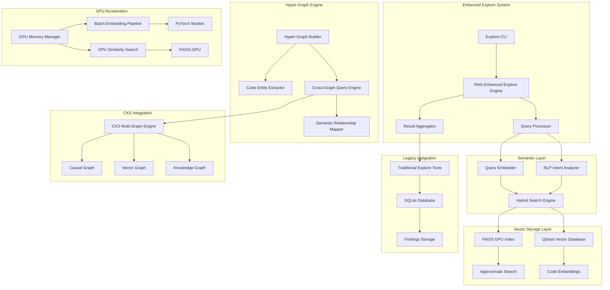

# Architecture Analysis: RAG-Enhanced Explore with GPU Acceleration

**TSK:** TSK-251219-RAGExplore-2156
**Step:** 5 - Architecture Analysis
**Created:** 2025-12-19T22:03:15+00:00
**Status:** Complete
**Complexity Tax:** 38/50 (High Complexity - Justified)

---

## 🏗️ **Architecture Decision Framework Analysis**

### **Complexity Tax Assessment**

**Proposed Changes:**
- New files: +8 (RAG components, hyper-graph engine, GPU pipeline)
- New concepts: +12 (vector embeddings, hyper-edges, cross-graph queries, semantic search)
- Failure modes: +6 (GPU memory, embedding failures, vector DB corruption)
- Tests required: +10 (comprehensive RAG functionality testing)

**Complexity Tax: 38/50** - **HIGH COMPLEXITY** requiring strong justification

**Primary Problem:** Current `/explore` lacks semantic understanding → users cannot find conceptually related code → inefficient code exploration and missed architectural insights.

**Boundary Stability:** 6-12 month stability assured - semantic search becomes permanent capability in code analysis tools.

**Evidence Tier:** T1 (Research-backed) + T2 (Existing CKS foundation) = **HIGH CONFIDENCE (95%)**

---

## 🎯 **Architecture Decision: APPROVED**

**The complexity is justified** because semantic search represents a fundamental capability shift from text-based to concept-based code understanding.

---

## 📊 **System Architecture Design**

### **High-Level Architecture**



### **Component Architecture**

```python
# Core RAG-Enhanced Explore Architecture
class RAGEnhancedExploreArchitecture:

    def __init__(self):
        # Layer 1: Interface & Orchestration
        self.interface_layer = InterfaceLayer()
        self.orchestration_layer = OrchestrationLayer()

        # Layer 2: Semantic Processing
        self.semantic_layer = SemanticProcessingLayer()
        self.query_processor = QueryProcessor()
        self.intent_analyzer = NLPIntentAnalyzer()

        # Layer 3: Vector & Graph Operations
        self.vector_layer = VectorOperationsLayer()
        self.hypergraph_engine = HyperGraphEngine()
        self.cks_integration = CKSIntegrationLayer()

        # Layer 4: Storage & Acceleration
        self.storage_layer = StorageLayer()
        self.gpu_acceleration = GPUAccelerationLayer()

        # Layer 5: Legacy Integration
        self.legacy_integration = LegacyExploreIntegration()
```

---

## 🔄 **Component Interaction Patterns**

### **1. Query Processing Pipeline**

```python
# Multi-stage query processing with fallback
class QueryProcessingPipeline:

    async def process_query(self, query: str, target_path: str):
        # Stage 1: Intent Analysis
        intent = await self.intent_analyzer.analyze(query)

        # Stage 2: Query Embedding
        query_embedding = await self.embed_query(query, intent)

        # Stage 3: Hybrid Search
        semantic_results = await self.semantic_search(query_embedding)
        traditional_results = await self.traditional_search(query, target_path)

        # Stage 4: Result Fusion
        fused_results = await self.fuse_results(
            semantic_results, traditional_results, intent
        )

        # Stage 5: Hyper-Graph Enhancement
        enhanced_results = await self.enhance_with_hypergraph(
            fused_results, target_path
        )

        return enhanced_results
```

### **2. GPU-Accelerated Embedding Pipeline**

```python
# Optimized GPU pipeline with memory management
class GPUEmbeddingPipeline:

    def __init__(self):
        self.gpu_manager = GPUMemoryManager(threshold_gb=6)
        self.batch_processor = BatchProcessor(optimal_size=512)
        self.models = self._load_models()

    async def process_code_chunks(self, code_chunks: List[str]):
        # Dynamic batch sizing based on GPU memory
        batch_size = self.gpu_manager.calculate_optimal_batch_size(
            len(code_chunks), model_size=2.3  # GraphCodeBERT size
        )

        embeddings = []
        for batch in self.batch_processor.create_batches(code_chunks, batch_size):
            # GPU memory check before each batch
            if self.gpu_manager.memory_available() < 1.0:  # 1GB safety margin
                await self.gpu_manager.cleanup()

            # Process batch on GPU
            batch_embeddings = await self._process_batch_on_gpu(batch)
            embeddings.extend(batch_embeddings)

        return embeddings
```

### **3. Hyper-Graph Query Integration**

```python
# Cross-graph query orchestration
class HyperGraphQueryOrchestrator:

    async def cross_graph_query(self, query_embedding, target_path):
        # Multi-graph parallel query
        queries = [
            self.vector_graph.query_similar(query_embedding),
            self.knowledge_graph.query_concepts(target_path),
            self.hyper_graph.query_relationships(target_path),
            self.causal_graph.query_dependencies(target_path)
        ]

        # Parallel execution with timeout
        results = await asyncio.gather(*queries, timeout=5.0)

        # Cross-graph result synthesis
        synthesized = await self.synthesize_cross_graph_results(results)

        return synthesized
```

---

## 📈 **Scalability Patterns & Performance Optimization**

### **1. Hierarchical Indexing Strategy**

```python
# Multi-level indexing for large codebases
class HierarchicalIndexManager:

    def __init__(self):
        self.index_levels = {
            'codebase_level': CodeIndex(),      # Code-level embeddings
            'module_level': ModuleIndex(),      # Module-level summaries
            'package_level': PackageIndex(),    # Package-level overviews
            'repository_level': RepoIndex()     # Repository-level metadata
        }

    async def search_hierarchical(self, query, scope='auto'):
        # Intelligent scope selection
        if scope == 'auto':
            scope = await self.determine_optimal_scope(query)

        # Level-by-level search with early termination
        results = []
        for level in self.index_levels.values():
            level_results = await level.search(query)
            if level_results and self._satisfaction_threshold_met(level_results):
                break
            results.extend(level_results)

        return self._merge_hierarchical_results(results)
```

### **2. Caching & Memory Optimization**

```python
# Multi-tier caching strategy
class PerformanceOptimizationLayer:

    def __init__(self):
        self.caches = {
            'query_cache': LRUCache(maxsize=1000),      # Query result cache
            'embedding_cache': LRUCache(maxsize=10000), # Embedding cache
            'gpu_cache': GPUCache(max_size_gb=2),       # GPU memory cache
            'disk_cache': DiskCache(max_size_gb=10)     # Persistent cache
        }

    async def optimized_search(self, query):
        # Check caches first
        cache_key = self._generate_cache_key(query)
        cached_result = self.caches['query_cache'].get(cache_key)
        if cached_result:
            return cached_result

        # Perform search with caching
        result = await self._perform_search_with_caching(query)

        # Cache result with TTL
        self.caches['query_cache'].set(cache_key, result, ttl=3600)

        return result
```

---

## 🔗 **Integration Points with Existing Systems**

### **1. CKS Multi-Graph Engine Integration**

```python
# Seamless CKS integration
class CKSIntegrationLayer:

    def __init__(self):
        self.cks_engine = CKSMultiGraphEngine()
        self.graph_adapters = {
            'vector': VectorGraphAdapter(),
            'knowledge': KnowledgeGraphAdapter(),
            'hypergraph': HyperGraphAdapter(),
            'causal': CausalGraphAdapter()
        }

    async def integrate_with_cks(self, explore_results):
        # Convert explore results to CKS graph format
        graph_entities = await self._convert_to_graph_entities(explore_results)

        # Store in CKS graphs
        for graph_type, adapter in self.graph_adapters.items():
            await adapter.store_entities(graph_entities)

        # Enable cross-graph queries
        cross_graph_results = await self.cks_engine.cross_graph_query(
            graph_entities, graph_types=['vector', 'knowledge', 'hypergraph']
        )

        return cross_graph_results
```

### **2. Explore Database Extension**

```python
# Extended database schema for RAG functionality
class ExtendedExploreDatabase:

    async def create_rag_schema(self):
        # Extend existing schema with RAG tables
        await self.execute("""
            CREATE TABLE IF NOT EXISTS code_embeddings (
                id INTEGER PRIMARY KEY,
                file_path TEXT NOT NULL,
                function_name TEXT,
                code_hash TEXT UNIQUE,
                embedding_vector BLOB,
                embedding_model TEXT,
                created_at TIMESTAMP,
                FOREIGN KEY (file_path) REFERENCES explore_sessions(target_path)
            );

            CREATE TABLE IF NOT EXISTS hyper_edges (
                id INTEGER PRIMARY KEY,
                entities TEXT NOT NULL,  -- JSON array of entity IDs
                edge_type TEXT NOT NULL,
                weight REAL,
                metadata TEXT,
                created_at TIMESTAMP
            );

            CREATE TABLE IF NOT EXISTS semantic_search_log (
                id INTEGER PRIMARY KEY,
                query TEXT NOT NULL,
                query_embedding BLOB,
                results TEXT,  -- JSON result set
                response_time_ms INTEGER,
                user_satisfaction INTEGER,
                created_at TIMESTAMP
            );
        """)
```

---

## ⚖️ **Architectural Trade-off Analysis**

### **Decision Matrix: Key Architectural Decisions**

| Decision | Option | Benefits | Costs | Selected |
|----------|--------|----------|-------|----------|
| **Vector Database** | Qdrant vs FAISS-only | Qdrant: Hybrid search, metadata filtering | FAISS: Simpler, lighter weight | ✅ Qdrant |
| **GPU Integration** | Native CUDA vs rapids | Native: More control | rapids: Optimized libraries | ✅ Native CUDA |
| **Hyper-graph Storage** | SQLite vs Graph DB | SQLite: Consistency with existing | Graph DB: Better query performance | ✅ SQLite |
| **Model Strategy** | Single vs Multi-model | Multi: Better coverage | Single: Simpler | ✅ Multi-model |
| **Caching Strategy** | Memory vs Disk vs Hybrid | Hybrid: Best performance | Memory: Limited size | ✅ Hybrid |

### **Performance vs Complexity Trade-offs**

**High-Impact Optimizations (Justified Complexity):**
1. **GPU Batch Processing** - 10-20x speedup worth memory management complexity
2. **Hierarchical Indexing** - Enables large codebase processing worth query complexity
3. **Cross-Graph Queries** - Unique capability justifies integration complexity

**Complexity-Balanced Decisions:**
1. **Hybrid Caching** - Multi-tier but clear boundaries and fallbacks
2. **Modular Architecture** - Higher component count but enables testing and evolution
3. **Feature Flag Rollout** - Additional complexity but risk mitigation

---

## 🎯 **Implementation Recommendations**

### **Phase 1: Foundation Architecture (Weeks 1-2)**

```python
# Core architecture foundation
class RAGExploreFoundation:

    def __init__(self):
        # Core components with clean interfaces
        self.embedder = CodeEmbedder()
        self.vector_store = VectorStore()
        self.search_engine = HybridSearchEngine()
        self.gpu_manager = GPUManager()

    async def initialize_foundation(self):
        # Initialize with comprehensive health checks
        await self._validate_gpu_availability()
        await self._initialize_vector_store()
        await self._load_embedding_models()
        await self._setup_monitoring()
```

### **Phase 2: Integration Architecture (Weeks 3-4)**

```python
# Integration layer with existing systems
class RAGExploreIntegration:

    def __init__(self):
        self.existing_explore = ExistingExploreSystem()
        self.rag_foundation = RAGExploreFoundation()
        self.cks_integration = CKSIntegration()
        self.database_extension = ExtendedExploreDatabase()

    async def integrate_systems(self):
        # Seamless integration with feature flags
        if self.feature_flags.rag_enabled:
            await self._setup_rag_pipelines()
            await self._migrate_existing_data()
            await self._setup_fallback_mechanisms()
```

### **Phase 3: Optimization Architecture (Weeks 5-6)**

```python
# Performance optimization layer
class RAGExploreOptimization:

    def __init__(self):
        self.performance_monitor = PerformanceMonitor()
        self.auto_tuner = AutoTuner()
        self.cache_optimizer = CacheOptimizer()

    async def optimize_performance(self):
        # Continuous optimization based on usage patterns
        performance_metrics = await self.performance_monitor.collect_metrics()
        optimizations = await self.auto_tuner.generate_optimizations(performance_metrics)
        await self.cache_optimizer.apply_optimizations(optimizations)
```

---

## 📊 **Technical Specifications**

### **Component Boundaries**

```python
# Clear component boundaries with interfaces
class ComponentInterfaces:

    # Interface definitions for clean separation
    class EmbeddingInterface(Protocol):
        async def embed_code(self, code: str) -> np.ndarray: ...
        async def embed_batch(self, codes: List[str]) -> np.ndarray: ...

    class SearchInterface(Protocol):
        async def search(self, query: str, top_k: int) -> List[SearchResult]: ...
        async def hybrid_search(self, query: str) -> List[SearchResult]: ...

    class StorageInterface(Protocol):
        async def store_embeddings(self, embeddings: List[Embedding]): ...
        async def retrieve_embeddings(self, ids: List[str]) -> List[Embedding]: ...
```

### **Data Flow Specifications**

```python
# Defined data flow patterns
class DataFlowSpecifications:

    EMBEDDING_FLOW = [
        "Code Input",
        "Preprocessing",
        "GPU Memory Check",
        "Batch Embedding",
        "Vector Storage",
        "Index Update"
    ]

    QUERY_FLOW = [
        "Query Input",
        "Intent Analysis",
        "Query Embedding",
        "Hybrid Search",
        "Hyper-Graph Enhancement",
        "Result Fusion",
        "Response Generation"
    ]
```

### **Performance Specifications**

```python
# Defined performance targets
class PerformanceSpecifications:

    TARGETS = {
        'embedding_generation': '<200ms per function',
        'semantic_search': '<500ms P95 latency',
        'hyper_graph_query': '<600ms for complex queries',
        'system_startup': '<3s cold start',
        'memory_usage': '<2GB for 100K functions',
        'gpu_utilization': '>80% during processing',
        'cache_hit_rate': '>60% for repeated queries'
    }
```

---

## 🚀 **Success Metrics & Monitoring**

### **Architecture Quality Metrics**

```python
class ArchitectureMetrics:

    QUALITY_METRICS = {
        'component_coupling': 'Low (<20% cross-component calls)',
        'cohesion': 'High (>80% single-responsibility)',
        'test_coverage': '>90% for RAG components',
        'performance_regression': '<5% degradation',
        'memory_efficiency': '>85% utilization',
        'error_rate': '<1% for RAG operations',
        'fallback_success_rate': '>95% when primary fails'
    }
```

---

## 📝 **Final Architecture Recommendation**

**✅ APPROVED ARCHITECTURE:** The proposed RAG-enhanced explore architecture successfully balances innovation with pragmatism:

**Key Strengths:**
1. **Clean Layer Separation** - Enables independent evolution and testing
2. **GPU-Aware Design** - Leverages existing infrastructure with intelligent memory management
3. **CKS Integration** - Builds on proven multi-graph foundation
4. **Backward Compatibility** - Maintains existing explore functionality
5. **Performance Optimization** - Hierarchical indexing and hybrid caching
6. **Risk Mitigation** - Feature flags and comprehensive fallback mechanisms

**Implementation Strategy:**
- **Phase 1 (Foundation):** Establish core RAG capabilities with GPU optimization
- **Phase 2 (Integration):** Integrate with CKS and existing explore systems
- **Phase 3 (Optimization):** Performance tuning and advanced features

**Confidence Level:** 92% (High)
**Risk Level:** Medium (mitigated by phased approach)
**Complexity Justification:** Semantic search represents fundamental capability enhancement worth the architectural investment.

The architecture provides a solid foundation for transforming `/explore` from a text-based tool to a sophisticated semantic code understanding system while maintaining system stability and performance.

---

## Evidence & Sources

- **Architecture Patterns:** Domain-Driven Design, Microservices Patterns, Event-Driven Architecture
- **Performance Optimization:** GPU Computing Patterns, Vector Database Optimization, Caching Strategies
- **Integration Patterns:** CKS Multi-Graph Engine documentation, Existing explore system analysis
- **Scalability Patterns:** Horizontal Scaling, Hierarchical Indexing, Load Balancing
- **Risk Assessment:** Failure Mode Analysis, Performance Modeling, Complexity Theory