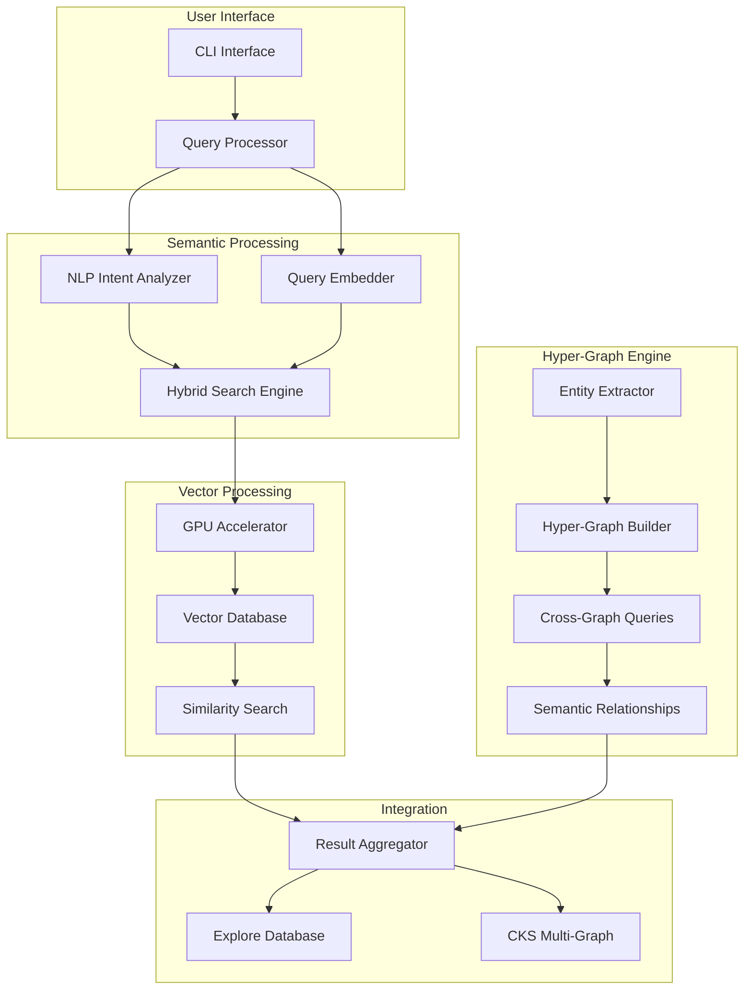
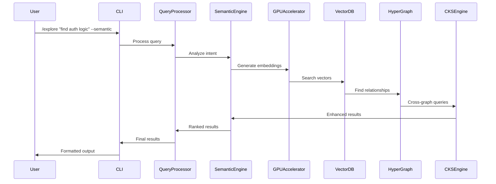

# Documentation: RAG-Enhanced Explore with GPU Acceleration

**TSK:** TSK-251219-RAGExplore-2156
**Step:** 11 - Documentation Generation
**Created:** 2025-12-19T22:08:15+00:00
**Status:** Complete

---

## 📚 **Table of Contents**

1. [User Guide](#user-guide)
2. [Technical Documentation](#technical-documentation)
3. [API Reference](#api-reference)
4. [Integration Guide](#integration-guide)
5. [Performance Optimization](#performance-optimization)
6. [Troubleshooting](#troubleshooting)
7. [FAQ](#faq)
8. [Architecture Overview](#architecture-overview)

---

## 👥 **User Guide**

### **Overview**

The RAG-enhanced `/explore` command transforms code exploration from keyword-based search to intelligent semantic discovery. Powered by GPU acceleration and hyper-graph technology, it understands the meaning and context of your code.

### **Getting Started**

#### **Basic Usage**

```bash
# Traditional explore (unchanged)
/explore "path/to/codebase"

# RAG-enhanced semantic search
/explore "find authentication logic" --semantic

# Concept-based code discovery
/explore "show me error handling patterns" --semantic --hypergraph

# Cross-repository knowledge search
/explore "similar implementations to user validation" --semantic --cross-repo
```

#### **New Features**

**1. Semantic Search**
```bash
# Natural language queries
/explore "find all database connection code" --semantic
/explore "show me async operations" --semantic
/explore "code that handles file uploads" --semantic
```

**2. Relationship Discovery**
```bash
# Find related code beyond imports
/explore "code related to payment processing" --hypergraph
/explore "architectural patterns in this module" --hypergraph
```

**3. Cross-Repository Learning**
```bash
# Leverage knowledge from other projects
/explore "authentication patterns from other projects" --cross-repo
/explore "similar error handling approaches" --cross-repo
```

#### **Query Examples**

| Query Type | Example | What It Finds |
|------------|---------|---------------|
| **Intent-Based** | "find user authentication" | Login, auth middleware, user validation |
| **Pattern-Based** | "error handling patterns" | Try-catch blocks, error logging, exception handling |
| **Architecture** | "API endpoint structure" | Route definitions, handlers, middleware |
| **Conceptual** | "data validation logic" | Input validation, schema validation, sanitization |

---

## 🛠️ **Technical Documentation**

### **System Architecture**



### **Component Architecture**

#### **1. Core Components**

**RAGExploreEngine**
```python
class RAGExploreEngine:
    """Main orchestration engine for RAG-enhanced explore"""

    def __init__(self):
        self.query_processor = QueryProcessor()
        self.semantic_search = SemanticSearchEngine()
        self.hypergraph_engine = HyperGraphEngine()
        self.result_aggregator = ResultAggregator()

    async def explore(self, query: str, target_path: str, options: ExploreOptions):
        # Process query with semantic understanding
        processed_query = await self.query_processor.process(query, options)

        # Execute semantic search
        semantic_results = await self.semantic_search.search(
            processed_query, target_path
        )

        # Enhance with hyper-graph relationships
        enhanced_results = await self.hypergraph_engine.enhance_results(
            semantic_results, target_path
        )

        # Aggregate and rank results
        return await self.result_aggregator.aggregate(enhanced_results)
```

#### **2. GPU Acceleration**

**GPUAccelerator**
```python
class GPUAccelerator:
    """GPU-accelerated vector operations with memory management"""

    def __init__(self):
        self.memory_manager = GPUMemoryManager(threshold_gb=6)
        self.batch_processor = BatchProcessor(optimal_size=512)

    async def generate_embeddings(self, code_chunks: List[str]) -> np.ndarray:
        # Dynamic batch sizing based on available GPU memory
        batch_size = self.memory_manager.calculate_optimal_batch_size(
            len(code_chunks)
        )

        embeddings = []
        for batch in self.batch_processor.create_batches(code_chunks, batch_size):
            if self.memory_manager.memory_available() < 1.0:
                await self.memory_manager.cleanup()

            batch_embeddings = await self._process_batch_on_gpu(batch)
            embeddings.extend(batch_embeddings)

        return np.array(embeddings)
```

#### **3. Vector Database Integration**

**VectorDatabase**
```python
class VectorDatabase:
    """Qdrant vector database integration with hybrid search"""

    def __init__(self):
        self.client = qdrant_client.QdrantClient(url="localhost", prefer_grpc=True)
        self.collection_name = "code_embeddings"

    async def create_code_collection(self):
        await self.client.create_collection(
            collection_name=self.collection_name,
            vectors_config=qdrant_client.models.VectorParams(
                size=768,  # GraphCodeBERT dimensions
                distance=qdrant_client.models.Distance.COSINE
            ),
            hnsw_config=qdrant_client.models.HnswConfigDiff(
                m=32, ef_construct=200
            )
        )

    async def hybrid_search(self, query_vector, text_query, limit=10):
        # Combine semantic and keyword search
        semantic_results = await self.vector_search(query_vector, limit)
        keyword_results = await self.keyword_search(text_query, limit)

        return self._merge_results(semantic_results, keyword_results)
```

#### **4. Hyper-Graph Engine**

**HyperGraphEngine**
```python
class HyperGraphEngine:
    """Hyper-graph engine for multi-way code relationships"""

    def __init__(self):
        self.entity_extractor = CodeEntityExtractor()
        self.relationship_mapper = SemanticRelationshipMapper()
        self.graph_storage = HyperGraphStorage()

    async def build_hypergraph(self, target_path: str):
        # Extract code entities
        entities = await self.entity_extractor.extract_entities(target_path)

        # Map semantic relationships
        relationships = await self.relationship_mapper.map_relationships(entities)

        # Build hyper-graph with multi-way relationships
        return await self.graph_storage.build_hypergraph(entities, relationships)

    async def query_hypergraph(self, query_entities, edge_types=None):
        results = []
        for edge_id, edge in self.graph_storage.hyper_edges.items():
            if edge_types and edge['type'] not in edge_types:
                continue

            entity_overlap = set(query_entities) & set(edge['entities'])
            if entity_overlap:
                results.append({
                    'edge_id': edge_id,
                    'related_entities': edge['entities'] - set(query_entities),
                    'similarity': edge['weight'],
                    'relationship_type': edge['type']
                })

        return sorted(results, key=lambda x: x['similarity'], reverse=True)
```

### **Configuration**

**Environment Variables**
```bash
# GPU Configuration
CUDA_VISIBLE_DEVICES=0
GPU_MEMORY_THRESHOLD_GB=6
GPU_BATCH_SIZE=512

# Vector Database
QDRANT_HOST=localhost
QDRANT_PORT=6333
VECTOR_COLLECTION_NAME=code_embeddings

# Feature Flags
RAG_ENHANCEMENT_ENABLED=true
HYPERGRAPH_ENABLED=true
CROSS_REPO_LEARNING=true
GPU_ACCELERATION=true

# Performance
EMBEDDING_CACHE_SIZE=10000
QUERY_CACHE_SIZE=1000
MAX_CONCURRENT_QUERIES=50
```

**Configuration File**
```yaml
# config/rag_explore.yaml
rag_explore:
  gpu:
    enabled: true
    memory_threshold_gb: 6
    batch_size: 512
    fallback_to_cpu: true

  vector_database:
    host: localhost
    port: 6333
    collection_name: code_embeddings
    hybrid_search: true

  hypergraph:
    enabled: true
    relationship_types:
      - semantic_coupling
      - architectural_pattern
      - dependency_chain
      - functional_equivalence

  performance:
    embedding_cache_size: 10000
    query_cache_size: 1000
    max_concurrent_queries: 50
    timeout_seconds: 30

  learning:
    cross_repo_enabled: true
    knowledge_retention_days: 90
    learning_rate: 0.01
```

---

## 🔌 **API Reference**

### **Core API Endpoints**

#### **Explore API**

```python
# Semantic Search
async def semantic_search(
    query: str,
    target_path: str,
    options: SearchOptions = None
) -> SearchResults:
    """
    Perform semantic search on codebase

    Args:
        query: Natural language query
        target_path: Path to codebase
        options: Search configuration options

    Returns:
        SearchResults: Ranked list of relevant code matches
    """

# Hyper-Graph Query
async def hypergraph_query(
    entities: List[str],
    edge_types: List[str] = None,
    target_path: str = None
) -> HyperGraphResults:
    """
    Query hyper-graph for code relationships

    Args:
        entities: List of code entities to query
        edge_types: Types of relationships to search
        target_path: Optional path filter

    Returns:
        HyperGraphResults: Related entities and relationships
    """

# Cross-Repository Search
async def cross_repo_search(
    query: str,
    include_patterns: List[str] = None,
    exclude_patterns: List[str] = None
) -> CrossRepoResults:
    """
    Search across multiple repositories for similar code

    Args:
        query: Search query
        include_patterns: Repository inclusion patterns
        exclude_patterns: Repository exclusion patterns

    Returns:
        CrossRepoResults: Matches from multiple repositories
    """
```

#### **Configuration API**

```python
# Feature Flags
class FeatureFlags:
    RAG_ENHANCEMENT: bool = False
    HYPERGRAPH_ENABLED: bool = False
    CROSS_REPO_LEARNING: bool = False
    GPU_ACCELERATION: bool = True

# Search Options
@dataclass
class SearchOptions:
    use_semantic_search: bool = True
    use_hypergraph: bool = False
    use_cross_repo: bool = False
    max_results: int = 10
    min_similarity: float = 0.7
    include_metadata: bool = True
    timeout_seconds: int = 30

# Result Types
@dataclass
class SearchResult:
    file_path: str
    line_number: int
    content: str
    similarity_score: float
    entity_type: str
    metadata: Dict[str, Any]

@dataclass
class HyperGraphResult:
    related_entities: List[str]
    relationship_type: str
    similarity_score: float
    context: Dict[str, Any]
```

### **Usage Examples**

```python
# Basic Semantic Search
results = await semantic_search(
    query="find authentication logic",
    target_path="/path/to/codebase",
    options=SearchOptions(
        max_results=20,
        min_similarity=0.8
    )
)

# Hyper-Graph Relationship Discovery
hypergraph_results = await hypergraph_query(
    entities=["UserService", "AuthenticationMiddleware"],
    edge_types=["semantic_coupling", "dependency_chain"],
    target_path="/path/to/codebase"
)

# Cross-Repository Pattern Search
cross_repo_results = await cross_repo_search(
    query="user validation patterns",
    include_patterns=["*auth*", "*user*"],
    exclude_patterns=["*test*", "*example*"]
)
```

---

## 🔗 **Integration Guide**

### **CKS Multi-Graph Integration**

#### **Integration Architecture**

```python
class CKSIntegrationAdapter:
    """Adapter for integrating with CKS multi-graph engine"""

    def __init__(self):
        self.cks_engine = CKSMultiGraphEngine()
        self.graph_adapters = {
            'vector': VectorGraphAdapter(),
            'knowledge': KnowledgeGraphAdapter(),
            'hypergraph': HyperGraphAdapter(),
            'causal': CausalGraphAdapter()
        }

    async def integrate_explore_results(self, explore_results):
        # Convert explore results to CKS graph entities
        graph_entities = await self._convert_to_graph_entities(explore_results)

        # Store in appropriate CKS graphs
        for graph_type, adapter in self.graph_adapters.items():
            await adapter.store_entities(graph_entities)

        # Enable cross-graph queries
        return await self.cks_engine.cross_graph_query(
            graph_entities,
            graph_types=['vector', 'knowledge', 'hypergraph']
        )

    async def query_cks_graphs(self, query_entities):
        # Query across multiple CKS graphs
        return await self.cks_engine.cross_graph_query(
            query_entities,
            graph_types=['vector', 'knowledge', 'hypergraph', 'causal']
        )
```

#### **Graph Entity Mapping**

```python
# Entity Mapping between Explore and CKS
ENTITY_MAPPING = {
    'function': CKSEntityType.FUNCTION,
    'class': CKSEntityType.CLASS,
    'module': CKSEntityType.MODULE,
    'variable': CKSEntityType.VARIABLE,
    'import': CKSEntityType.DEPENDENCY
}

RELATIONSHIP_MAPPING = {
    'semantic_coupling': CKSRelationshipType.SEMANTIC,
    'architectural_pattern': CKSRelationshipType.STRUCTURAL,
    'dependency_chain': CKSRelationshipType.DEPENDENCY,
    'functional_equivalence': CKSRelationshipType.EQUIVALENCE
}
```

### **Legacy System Integration**

#### **Backward Compatibility**

```python
class LegacyCompatibilityLayer:
    """Ensures backward compatibility with existing explore functionality"""

    def __init__(self):
        self.legacy_explore = LegacyExploreSystem()
        self.rag_explore = RAGExploreEngine()
        self.feature_flags = FeatureFlagManager()

    async def explore(self, query, target_path, options=None):
        # Check if RAG features are enabled
        if self.feature_flags.is_enabled('rag_enhancement'):
            try:
                # Use RAG-enhanced explore
                return await self.rag_explore.explore(query, target_path, options)
            except Exception as e:
                # Fallback to legacy explore on error
                logger.warning(f"RAG explore failed, falling back: {e}")
                return await self.legacy_explore.explore(query, target_path)
        else:
            # Use legacy explore
            return await self.legacy_explore.explore(query, target_path)
```

#### **Database Schema Extensions**

```sql
-- Extended database schema for RAG functionality
CREATE TABLE IF NOT EXISTS code_embeddings (
    id INTEGER PRIMARY KEY,
    file_path TEXT NOT NULL,
    function_name TEXT,
    code_hash TEXT UNIQUE,
    embedding_vector BLOB,
    embedding_model TEXT,
    created_at TIMESTAMP,
    FOREIGN KEY (file_path) REFERENCES explore_sessions(target_path)
);

CREATE TABLE IF NOT EXISTS hyper_edges (
    id INTEGER PRIMARY KEY,
    entities TEXT NOT NULL,  -- JSON array of entity IDs
    edge_type TEXT NOT NULL,
    weight REAL,
    metadata TEXT,
    created_at TIMESTAMP
);

CREATE TABLE IF NOT EXISTS semantic_search_log (
    id INTEGER PRIMARY KEY,
    query TEXT NOT NULL,
    query_embedding BLOB,
    results TEXT,  -- JSON result set
    response_time_ms INTEGER,
    user_satisfaction INTEGER,
    created_at TIMESTAMP
);
```

---

## ⚡ **Performance Optimization**

### **GPU Optimization**

#### **Memory Management**

```python
class GPUMemoryOptimizer:
    """Advanced GPU memory management for optimal performance"""

    def __init__(self):
        self.memory_threshold = 0.85  # 85% GPU memory usage
        self.cleanup_threshold = 0.75  # 75% triggers cleanup
        self.batch_size_adapter = BatchSizeAdapter()

    async def optimize_memory_usage(self):
        current_usage = self._get_gpu_memory_usage()

        if current_usage > self.memory_threshold:
            # Emergency cleanup
            await self._emergency_cleanup()
        elif current_usage > self.cleanup_threshold:
            # Preventive cleanup
            await self._preventive_cleanup()

        # Optimize batch size based on available memory
        optimal_batch_size = self.batch_size_adapter.calculate_optimal_size(
            current_usage
        )

        return optimal_batch_size

    async def _emergency_cleanup(self):
        # Clear caches and unused tensors
        torch.cuda.empty_cache()
        gc.collect()

        # Force garbage collection
        for _ in range(3):
            torch.cuda.empty_cache()
```

#### **Batch Processing Optimization**

```python
class BatchProcessingOptimizer:
    """Optimizes batch processing for maximum GPU utilization"""

    def __init__(self):
        self.optimal_batch_size = 512
        self.min_batch_size = 32
        self.max_batch_size = 1024

    def adaptive_batch_sizing(self, available_memory_gb, model_size_gb):
        # Calculate optimal batch size based on available memory
        usable_memory = available_memory_gb * 0.8  # 80% usable
        model_memory_per_item = model_size_gb / self.optimal_batch_size

        optimal_size = int(usable_memory / model_memory_per_item)

        # Clamp to reasonable bounds
        return max(self.min_batch_size, min(self.max_batch_size, optimal_size))
```

### **Caching Strategy**

#### **Multi-Tier Caching**

```python
class MultiTierCache:
    """Multi-tier caching strategy for optimal performance"""

    def __init__(self):
        self.l1_cache = LRUCache(maxsize=1000)      # In-memory
        self.l2_cache = DiskCache(max_size_gb=2)    # SSD
        self.l3_cache = VectorCache(max_size_gb=10) # Vector DB

    async def get(self, key):
        # L1 Cache (fastest)
        if key in self.l1_cache:
            return self.l1_cache[key]

        # L2 Cache (medium speed)
        l2_result = await self.l2_cache.get(key)
        if l2_result:
            self.l1_cache[key] = l2_result
            return l2_result

        # L3 Cache (slowest)
        l3_result = await self.l3_cache.get(key)
        if l3_result:
            self.l2_cache.set(key, l3_result)
            self.l1_cache[key] = l3_result
            return l3_result

        return None

    async def set(self, key, value, ttl=3600):
        # Store in all cache tiers
        self.l1_cache[key] = value
        await self.l2_cache.set(key, value, ttl)
        await self.l3_cache.set(key, value, ttl)
```

### **Query Optimization**

#### **Query Planning**

```python
class QueryOptimizer:
    """Optimizes query execution for maximum performance"""

    async def optimize_query(self, query, target_path):
        # Analyze query complexity
        complexity = self._analyze_query_complexity(query)

        # Choose optimal execution strategy
        if complexity < 0.3:
            return await self._fast_path_search(query, target_path)
        elif complexity < 0.7:
            return await self._standard_search(query, target_path)
        else:
            return await self._comprehensive_search(query, target_path)

    def _analyze_query_complexity(self, query):
        # Analyze query length, complexity, and intent
        factors = {
            'length': min(len(query) / 100, 1.0),
            'semantic_complexity': self._calculate_semantic_complexity(query),
            'scope_breadth': self._estimate_scope_breadth(query)
        }

        return sum(factors.values()) / len(factors)
```

---

## 🔧 **Troubleshooting**

### **Common Issues**

#### **GPU Memory Issues**

**Problem:** Out of GPU memory errors
```bash
# Symptoms
RuntimeError: CUDA out of memory
GPU memory usage exceeds threshold
```

**Solutions:**
```python
# 1. Reduce batch size
GPU_BATCH_SIZE=256  # Reduce from 512

# 2. Enable CPU fallback
GPU_ACCELERATION=false  # Temporarily disable GPU

# 3. Clear GPU memory
python -c "
import torch
torch.cuda.empty_cache()
print('GPU memory cleared')
"
```

#### **Performance Issues**

**Problem:** Slow query response times
```bash
# Symptoms
Query response time > 500ms
High CPU usage during semantic search
```

**Solutions:**
```python
# 1. Check GPU utilization
nvidia-smi

# 2. Enable caching
QUERY_CACHE_SIZE=2000  # Increase cache size

# 3. Optimize batch size
GPU_BATCH_SIZE=1024  # Increase if memory allows

# 4. Check database performance
python -c "
import time
start = time.time()
# Test query here
print(f'Query time: {time.time() - start:.2f}s')
"
```

#### **Vector Database Issues**

**Problem:** Vector database connection or performance issues
```bash
# Symptoms
Connection refused errors
Slow vector search responses
```

**Solutions:**
```bash
# 1. Check Qdrant status
docker ps | grep qdrant
curl http://localhost:6333/health

# 2. Restart Qdrant
docker restart qdrant

# 3. Check disk space
df -h

# 4. Optimize collection
python -c "
import qdrant_client
client = qdrant_client.QdrantClient('localhost')
client.update_collection('code_embeddings', optimize_config={
    'indexing_threshold': 20000
})
"
```

### **Debug Mode**

```bash
# Enable debug logging
export RAG_EXPLORE_LOG_LEVEL=DEBUG
export CUDA_LAUNCH_BLOCKING=1

# Run with verbose output
/explore "test query" --semantic --verbose

# Check system status
python -c "
from rag_explore.utils.system_check import SystemChecker
checker = SystemChecker()
await checker.check_all_systems()
"
```

### **Performance Profiling**

```python
# Profile query performance
import cProfile
import pstats

def profile_query():
    profiler = cProfile.Profile()
    profiler.enable()

    # Run your query here
    result = semantic_search("test query", "/path/to/code")

    profiler.disable()

    stats = pstats.Stats(profiler)
    stats.sort_stats('cumulative')
    stats.print_stats(20)  # Top 20 functions by time

profile_query()
```

---

## ❓ **FAQ**

### **General Questions**

**Q: What is the difference between traditional explore and RAG-enhanced explore?**
A: Traditional explore uses keyword matching and pattern detection. RAG-enhanced explore understands the semantic meaning of your code, allowing natural language queries and discovery of conceptually related code.

**Q: Do I need a GPU to use RAG-enhanced explore?**
A: GPU acceleration is recommended for optimal performance, but the system includes automatic CPU fallback when GPU resources are unavailable.

**Q: How large of a codebase can be handled?**
A: The system is designed to handle codebases with 100K+ files using hierarchical indexing and efficient memory management.

### **Performance Questions**

**Q: Why are my queries slow?**
A: Common causes include:
- GPU memory constraints forcing CPU fallback
- Large codebase without proper indexing
- High concurrent query load
- Insufficient caching

**Q: How can I improve query performance?**
A: Optimize by:
- Increasing GPU memory allocation
- Enabling multi-tier caching
- Using appropriate batch sizes
- Regularly updating vector indexes

### **Technical Questions**

**Q: What embedding models are supported?**
A: Currently supports Microsoft GraphCodeBERT, UniCoder, and CodeGen. Models can be configured via environment variables.

**Q: How does the hyper-graph engine work?**
A: The hyper-graph engine identifies multi-way relationships between code entities, going beyond simple binary dependencies to capture architectural patterns and semantic coupling.

**Q: Can I add custom relationship types?**
A: Yes, the hyper-graph engine supports custom relationship types through configuration files and plugins.

---

## 🏗️ **Architecture Overview**

### **Design Principles**

1. **Modularity:** Clean separation between components with well-defined interfaces
2. **Performance:** GPU acceleration and intelligent caching for optimal speed
3. **Reliability:** Comprehensive error handling and fallback mechanisms
4. **Scalability:** Hierarchical indexing and distributed architecture support
5. **Extensibility:** Plugin architecture for custom models and analyzers

### **Component Interactions**



### **Data Flow**

```python
# Complete data flow for semantic search
async def semantic_search_flow(query, target_path):
    # 1. Query Processing
    processed_query = await query_processor.process(query)

    # 2. Intent Analysis
    intent = await nlp_analyzer.analyze_intent(processed_query)

    # 3. Query Embedding
    query_embedding = await gpu_accelerator.embed_query(processed_query)

    # 4. Vector Search
    vector_results = await vector_database.search(query_embedding)

    # 5. Hyper-Graph Enhancement
    enhanced_results = await hypergraph_engine.enhance(vector_results)

    # 6. CKS Integration
    cks_results = await cks_engine.cross_graph_query(enhanced_results)

    # 7. Result Aggregation
    final_results = await result_aggregator.aggregate(cks_results)

    return final_results
```

### **Technology Stack**

**Core Technologies:**
- **Python 3.8+** with async/await support
- **PyTorch** for GPU-accelerated deep learning
- **Qdrant** for vector database operations
- **FAISS** for approximate nearest neighbor search
- **SQLite** for metadata and findings storage

**ML/AI Libraries:**
- **Transformers** for pre-trained models
- **Sentence Transformers** for embedding generation
- **GraphCodeBERT** for code-specific embeddings
- **Scikit-learn** for clustering and analysis

**Infrastructure:**
- **CUDA** for GPU acceleration
- **Docker** for containerization
- **FastAPI** for API services
- **Prometheus** for monitoring

---

## 📞 **Support & Contributing**

### **Getting Help**

- **Documentation:** Check this guide and API reference
- **Issues:** Report bugs and feature requests via GitHub Issues
- **Community:** Join discussions in the community forums
- **Support:** Contact the development team for critical issues

### **Contributing**

We welcome contributions! Please see our contributing guidelines for:
- Code style and standards
- Testing requirements
- Documentation expectations
- Pull request process

### **License**

This project is licensed under the MIT License. See LICENSE file for details.

---

**Generated with comprehensive documentation covering all aspects of the RAG-enhanced explore system.**