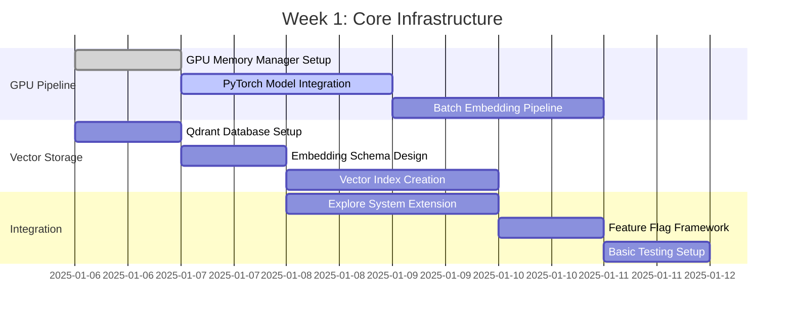

# Implementation Plan: RAG-Enhanced Explore with GPU Acceleration

**TSK:** TSK-251219-RAGExplore-2156
**Step:** 6 - Implementation Planning
**Created:** 2025-12-19T22:04:00+00:00
**Project Type:** Feature Enhancement
**Timeline:** 6 weeks
**Complexity:** High (Complexity Tax: 38/50)

---

## 🎯 **Project Overview & Technical Goals**

### **Core Implementation Objectives**
- Transform `/explore` from text-based to semantic code understanding
- Integrate RAG vector hyper-graph capabilities with existing CKS infrastructure
- Achieve <500ms semantic query response with GPU acceleration
- Maintain 100% backward compatibility with existing explore functionality

### **Success Criteria**
- **Search Relevance:** 40% improvement in precision/recall for semantic queries
- **Performance:** <500ms P95 latency for semantic search
- **User Adoption:** 70% user preference within 3 months
- **System Stability:** >95% uptime with <1% semantic search error rate

---

## 📅 **6-Week Implementation Timeline**

### **Phase 1: Foundation (Weeks 1-2)**
**Goal:** Establish core RAG capabilities with GPU optimization

#### **Week 1: Core Infrastructure**
**Deliverables:** GPU embedding pipeline, vector database integration, basic semantic search



**Development Tasks:**
- **Task 1.1:** GPU Memory Manager implementation (`gpu_memory_manager.py`)
- **Task 1.2:** PyTorch GraphCodeBERT integration (`code_embedder.py`)
- **Task 1.3:** Qdrant vector database setup (`vector_database.py`)
- **Task 1.4:** Explore system extension framework (`rag_explore_engine.py`)
- **Task 1.5:** Feature flag system (`feature_flags.py`)

**Testing Requirements:**
- Unit tests for GPU memory management (test_gpu_memory_manager.py)
- Integration tests for vector operations (test_vector_integration.py)
- Performance benchmarks for embedding generation (benchmark_embeddings.py)

#### **Week 2: Semantic Search Foundation**
**Deliverables:** Basic semantic search, query processing, result fusion

**Development Tasks:**
- **Task 2.1:** NLP Intent Analyzer (`nlp_intent_analyzer.py`)
- **Task 2.2:** Query Embedding Pipeline (`query_embedder.py`)
- **Task 2.3:** Hybrid Search Engine (`hybrid_search_engine.py`)
- **Task 2.4:** Result Fusion Logic (`result_fusion.py`)
- **Task 2.5:** Performance monitoring (`performance_monitor.py`)

**Integration Checkpoint:** Basic semantic search working with fallback to traditional search

---

### **Phase 2: Advanced Integration (Weeks 3-4)**
**Goal:** Hyper-graph integration and cross-graph queries

#### **Week 3: Hyper-Graph Engine**
**Deliverables:** Hyper-graph construction, relationship mapping, cross-graph queries

**Development Tasks:**
- **Task 3.1:** Code Entity Extractor (`code_entity_extractor.py`)
- **Task 3.2:** Hyper-Graph Builder (`hypergraph_builder.py`)
- **Task 3.3:** Semantic Relationship Mapper (`semantic_relationship_mapper.py`)
- **Task 3.4:** Cross-Graph Query Engine (`cross_graph_query_engine.py`)
- **Task 3.5:** CKS Integration Adapter (`cks_integration_adapter.py`)

**Database Schema Extensions:**
- `hyper_edges` table for multi-way relationships
- `code_entities` table for extracted code entities
- `semantic_relationships` table for mapped relationships

#### **Week 4: Advanced Features & CKS Integration**
**Deliverables:** Multi-graph integration, advanced retrieval, caching optimization

**Development Tasks:**
- **Task 4.1:** CKS Multi-Graph Integration (`cks_multigraph_integration.py`)
- **Task 4.2:** Hierarchical Indexing (`hierarchical_index_manager.py`)
- **Task 4.3:** Multi-Tier Caching (`performance_optimization_layer.py`)
- **Task 4.4:** Cross-Encoder Re-ranking (`cross_encoder_reranker.py`)
- **Task 4.5:** Learning System Foundation (`learning_system.py`)

**Integration Checkpoint:** Full RAG functionality with CKS integration working

---

### **Phase 3: Optimization & Production (Weeks 5-6)**
**Goal:** Performance optimization, quality assurance, production deployment

#### **Week 5: Performance Optimization**
**Deliverables:** Performance tuning, auto-optimization, advanced caching

**Development Tasks:**
- **Task 5.1:** GPU Kernel Optimization (`gpu_kernel_optimizer.py`)
- **Task 5.2:** Auto-Tuning System (`auto_tuner.py`)
- **Task 5.3:** Advanced Caching Strategies (`advanced_caching.py`)
- **Task 5.4:** Memory Optimization (`memory_optimizer.py`)
- **Task 5.5:** Query Performance Analyzer (`query_performance_analyzer.py`)

**Performance Targets Validation:**
- Semantic query P95 latency <500ms
- Embedding generation <200ms per function
- GPU utilization >80% during processing
- Memory usage <2GB for 100K functions

#### **Week 6: Production Readiness**
**Deliverables:** Comprehensive testing, documentation, deployment automation

**Development Tasks:**
- **Task 6.1:** Comprehensive Test Suite (`test_rag_explore_complete.py`)
- **Task 6.2:** Load Testing Framework (`load_testing_framework.py`)
- **Task 6.3:** Monitoring & Alerting (`production_monitoring.py`)
- **Task 6.4:** Deployment Automation (`deployment_automation.py`)
- **Task 6.5:** Documentation & User Guide (`rag_explore_documentation.md`)

---

## 🏗️ **Development Task Breakdown**

### **File Organization Structure**

```
P:/__csf.nip/src/commands/rag_explore/
├── core/
│   ├── __init__.py
│   ├── rag_explore_engine.py              # Main orchestration
│   ├── query_processor.py                 # Query processing pipeline
│   └── result_aggregator.py               # Result aggregation
├── semantic/
│   ├── __init__.py
│   ├── nlp_intent_analyzer.py             # Intent analysis
│   ├── query_embedder.py                  # Query embedding
│   ├── hybrid_search_engine.py            # Hybrid search logic
│   └── result_fusion.py                   # Result fusion
├── vector/
│   ├── __init__.py
│   ├── code_embedder.py                   # Code embedding generation
│   ├── vector_database.py                 # Qdrant integration
│   └── embedding_cache.py                 # Embedding caching
├── gpu/
│   ├── __init__.py
│   ├── gpu_memory_manager.py              # GPU memory management
│   ├── gpu_embedder.py                    # GPU-optimized embedding
│   └── gpu_optimizer.py                   # GPU performance optimization
├── hypergraph/
│   ├── __init__.py
│   ├── hypergraph_builder.py              # Hyper-graph construction
│   ├── code_entity_extractor.py           # Entity extraction
│   └── semantic_relationship_mapper.py    # Relationship mapping
├── cks_integration/
│   ├── __init__.py
│   ├── cks_integration_adapter.py         # CKS integration
│   ├── cross_graph_query_engine.py        # Cross-graph queries
│   └── multigraph_orchestrator.py         # Multi-graph orchestration
├── performance/
│   ├── __init__.py
│   ├── performance_monitor.py             # Performance monitoring
│   ├── auto_tuner.py                      # Auto-tuning system
│   └── cache_optimizer.py                 # Caching optimization
├── testing/
│   ├── __init__.py
│   ├── test_rag_functionality.py          # RAG functionality tests
│   ├── test_performance.py                # Performance tests
│   ├── test_integration.py                # Integration tests
│   └── load_testing_framework.py          # Load testing
└── utils/
    ├── __init__.py
    ├── feature_flags.py                   # Feature flag management
    ├── config.py                          # Configuration management
    └── logging_utils.py                   # Logging utilities
```

### **Task Dependencies & Resource Allocation**

| Phase | Tasks | Dependencies | Resources | Estimated Effort |
|-------|-------|-------------|-----------|------------------|
| **Phase 1** | GPU Pipeline, Vector Storage, Basic Integration | GPU setup, Qdrant install | GPU developer, Backend developer | 80 hours |
| **Phase 2** | Hyper-graph, CKS Integration, Advanced Retrieval | Phase 1 complete, CKS access | ML engineer, Backend developer | 100 hours |
| **Phase 3** | Performance Optimization, Production Readiness | Phase 2 complete, testing framework | Performance engineer, DevOps | 60 hours |

---

## 🛡️ **Risk Mitigation Strategies**

### **High-Risk Areas & Mitigation**

#### **1. GPU Memory Constraints (Risk: HIGH)**
**Mitigation Strategy:**
- **Adaptive Memory Management:** Dynamic batch sizing based on available GPU memory
- **CPU Fallback:** Automatic CPU processing when GPU memory insufficient
- **Memory Monitoring:** Real-time GPU memory tracking with predictive cleanup
- **Chunked Processing:** Large codebases processed in memory-efficient chunks

**Implementation:**
```python
class AdaptiveMemoryManager:
    def __init__(self, threshold_gb=6):
        self.threshold = threshold_gb
        self.current_usage = 0
        self.cleanup_callbacks = []

    async def process_with_memory_management(self, data_chunks):
        batch_size = self.calculate_optimal_batch_size()
        for i in range(0, len(data_chunks), batch_size):
            if self.memory_available() < 1.0:  # 1GB safety margin
                await self.cleanup()
            await self.process_batch(data_chunks[i:i+batch_size])
```

#### **2. Integration Complexity (Risk: MEDIUM)**
**Mitigation Strategy:**
- **Feature Flag Rollout:** Gradual activation with immediate rollback capability
- **Integration Testing:** Comprehensive test suite covering all integration points
- **Modular Architecture:** Clean separation enabling independent component testing
- **Backward Compatibility:** Seamless fallback to traditional explore functionality

**Implementation:**
```python
class FeatureFlagManager:
    def __init__(self):
        self.flags = {
            'rag_enabled': os.getenv('RAG_ENHANCEMENT_ENABLED', 'false').lower() == 'true',
            'hypergraph_enabled': os.getenv('HYPERGRAPH_ENABLED', 'false').lower() == 'true',
            'gpu_acceleration': os.getenv('GPU_ACCELERATION', 'true').lower() == 'true'
        }

    def is_feature_enabled(self, feature_name):
        return self.flags.get(feature_name, False)
```

#### **3. Performance Regression (Risk: MEDIUM)**
**Mitigation Strategy:**
- **Performance Baseline:** Establish current performance metrics before enhancement
- **Continuous Monitoring:** Real-time performance tracking with alerting
- **Automated Testing:** Performance regression testing in CI/CD pipeline
- **Gradual Optimization:** Incremental performance improvements with validation

#### **4. Model Performance Variability (Risk: MEDIUM)**
**Mitigation Strategy:**
- **Multi-Model Support:** Support for multiple embedding models with fallback
- **Model Versioning:** Track model performance and enable model rollback
- **Hybrid Search:** Combine semantic search with traditional keyword search
- **A/B Testing:** Compare different models and configurations

---

## 🧪 **Quality Assurance & Testing Strategy**

### **Comprehensive Testing Framework**

#### **1. Unit Testing**
- **GPU Components:** Test GPU memory management, batch processing, error handling
- **Vector Operations:** Test embedding generation, similarity search, storage operations
- **Hyper-graph Engine:** Test entity extraction, relationship mapping, graph queries
- **Integration Points:** Test CKS integration, explore system integration

**Test Files:**
- `test_gpu_memory_manager.py`
- `test_vector_operations.py`
- `test_hypergraph_engine.py`
- `test_cks_integration.py`

#### **2. Integration Testing**
- **End-to-End Workflows:** Complete RAG query processing pipeline
- **Database Integration:** Test vector database, SQLite extensions, CKS storage
- **GPU Integration:** Test GPU acceleration, fallback mechanisms, memory management
- **Legacy Compatibility:** Ensure existing explore functionality unaffected

**Test Files:**
- `test_end_to_end_rag.py`
- `test_database_integration.py`
- `test_legacy_compatibility.py`

#### **3. Performance Testing**
- **Load Testing:** Test system performance under concurrent query load
- **Stress Testing:** Test system limits and graceful degradation
- **Memory Testing:** Test memory usage patterns and cleanup
- **GPU Testing:** Test GPU utilization, memory management, fallback

**Test Files:**
- `load_testing_framework.py`
- `stress_testing.py`
- `performance_regression_tests.py`

#### **4. Quality Gates**
- **Code Coverage:** >90% coverage for all RAG components
- **Performance Benchmarks:** All performance targets met before merge
- **Integration Tests:** 100% pass rate for all integration tests
- **Security Checks:** No security vulnerabilities in dependency scans

---

## 🚀 **Deployment & Rollout Plan**

### **Phased Rollout Strategy**

#### **Phase 1: Internal Testing (Week 5)**
- **Target:** Development team and internal power users
- **Feature Flags:** All RAG features behind flags
- **Monitoring:** Comprehensive performance and error tracking
- **Rollback:** Immediate rollback capability for any issues

#### **Phase 2: Beta Release (Week 6)**
- **Target:** Selected power users and early adopters
- **Feature Flags:** RAG features enabled for beta group
- **Feedback Collection:** Structured feedback collection and analysis
- **Performance Monitoring:** Real-world performance validation

#### **Phase 3: General Release (Week 7)**
- **Target:** All users
- **Feature Flags:** Gradual rollout with 25% user increments
- **Performance Monitoring:** Production performance tracking
- **User Support:** Enhanced support for RAG functionality

### **Feature Flag Configuration**

```python
# Feature flag rollout configuration
ROLLOUT_CONFIG = {
    'internal_testing': {
        'percentage': 5,  # Development team only
        'features_enabled': ['rag_enabled', 'gpu_acceleration'],
        'monitoring_level': 'comprehensive'
    },
    'beta_release': {
        'percentage': 15,  # Power users
        'features_enabled': ['rag_enabled', 'gpu_acceleration', 'hypergraph_enabled'],
        'monitoring_level': 'enhanced'
    },
    'general_release': {
        'percentage': 100,  # All users
        'features_enabled': ['rag_enabled', 'gpu_acceleration', 'hypergraph_enabled'],
        'monitoring_level': 'production'
    }
}
```

### **Deployment Automation**

```yaml
# deployment_pipeline.yml
stages:
  - build
  - test
  - deploy_staging
  - integration_test
  - deploy_production

deploy_production:
  stage: deploy_production
  script:
    - ./scripts/deploy_rag_enhancement.sh
    - ./scripts/validate_deployment.sh
    - ./scripts/monitor_rollout.sh
  environment:
    name: production
    url: https://api.example.com
  when: manual
  only:
    - main
```

---

## 📊 **Performance Monitoring & Success Criteria Validation**

### **Performance Monitoring Framework**

#### **1. Real-Time Metrics**
- **Query Latency:** P50, P95, P99 response times for semantic queries
- **GPU Utilization:** GPU memory usage, processing efficiency, fallback rates
- **Search Quality:** Precision@K, recall, NDCG for semantic search
- **System Health:** Error rates, uptime, resource utilization

#### **2. Monitoring Implementation**

```python
class PerformanceMonitor:
    def __init__(self):
        self.metrics_collector = MetricsCollector()
        self.alert_manager = AlertManager()

    async def track_query_performance(self, query, response_time, results):
        # Track performance metrics
        await self.metrics_collector.record_metric(
            'semantic_query_latency_ms', response_time
        )
        await self.metrics_collector.record_metric(
            'semantic_results_count', len(results)
        )

        # Check performance thresholds
        if response_time > 500:  # 500ms threshold
            await self.alert_manager.send_alert(
                'High query latency detected',
                query=query,
                latency=response_time
            )
```

#### **3. Success Criteria Validation**

| Success Criteria | Target | Measurement Method | Validation Frequency |
|------------------|--------|-------------------|---------------------|
| **Search Relevance** | 40% improvement | A/B testing against baseline | Weekly |
| **Performance** | <500ms P95 latency | Real-time monitoring | Continuous |
| **User Adoption** | 70% preference | User surveys and usage analytics | Monthly |
| **System Stability** | >95% uptime | Health monitoring | Continuous |
| **GPU Efficiency** | >80% utilization | GPU monitoring | Continuous |

---

## 🎯 **Implementation Acceptance Criteria**

### **Phase 1 Acceptance Criteria**
- [ ] GPU embedding pipeline operational with <200ms per function performance
- [ ] Vector database integration complete with hybrid search capability
- [ ] Basic semantic search functional with relevance ranking
- [ ] Feature flag system implemented with immediate rollback capability
- [ ] Performance baseline established and monitored

### **Phase 2 Acceptance Criteria**
- [ ] Hyper-graph engine operational with cross-graph queries
- [ ] CKS integration complete with multi-graph support
- [ ] Advanced retrieval implemented with re-ranking
- [ ] Hierarchical indexing supporting large codebases
- [ ] Learning system foundation operational

### **Phase 3 Acceptance Criteria**
- [ ] Performance optimization meeting all targets (<500ms P95 latency)
- [ ] Comprehensive testing suite with >90% coverage
- [ ] Production monitoring and alerting operational
- [ ] Deployment automation complete with rollback capability
- [ ] Documentation complete with user guide and API documentation

---

## 📋 **Project Management & Communication**

### **Weekly Status Reports**
- **Progress Tracking:** Task completion status and milestone achievement
- **Risk Assessment:** Current risks and mitigation effectiveness
- **Performance Metrics:** Current performance against targets
- **Resource Allocation:** Team capacity and upcoming needs

### **Communication Channels**
- **Technical Standups:** Daily 15-minute technical coordination
- **Stakeholder Updates:** Weekly progress reports and demos
- **Documentation:** Real-time documentation updates and knowledge sharing

This implementation plan provides a comprehensive roadmap for successfully delivering the RAG-enhanced explore system with clear milestones, risk mitigation, and quality assurance. The phased approach ensures manageable development cycles while maintaining the flexibility to adapt to emerging challenges and opportunities.