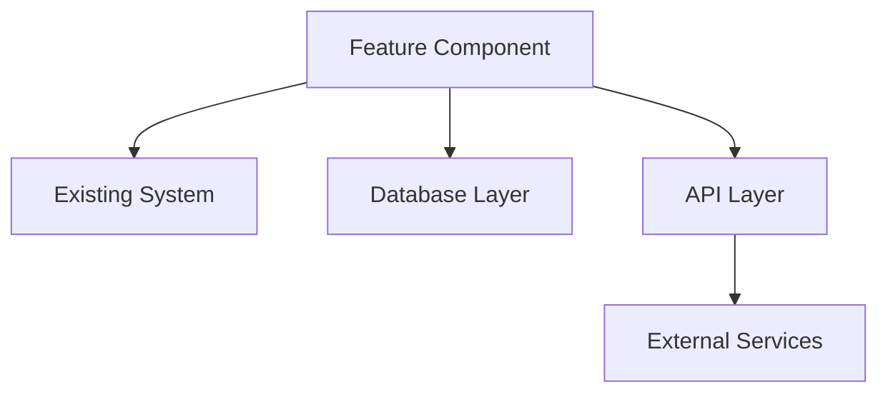
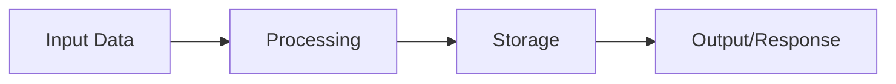

# Feature Architecture & Implementation Plan

## Project Information
- **Project ID**: TSK-XXX
- **Project Name**: [Feature Name]
- **Work Type**: Feature Development
- **Created**: [Date]
- **Phase**: PLAN
- **Session ID**: [UUID]

## Specification Review
### Specification Compliance
- [ ] All functional requirements addressed
- [ ] All non-functional requirements addressed
- [ ] User stories mapped to implementation tasks
- [ ] Constraints documented in design

### Knowledge Integration Review
- [ ] Architecture patterns applied from knowledge base
- [ ] Security best practices integrated
- [ ] Similar implementation references used
- [ ] Lessons learned incorporated

## System Architecture

### High-Level Architecture


### Component Design
#### New Components
- **[Component Name]**: [Purpose and responsibilities]
- **[Component Name]**: [Purpose and responsibilities]

#### Modified Components
- **[Component Name]**: [Changes required]
- **[Component Name]**: [Changes required]

### Data Architecture
#### Data Models
- **[Entity Name]**: [Description and relationships]
- **[Entity Name]**: [Description and relationships]

#### Data Flow


### API Design
#### Endpoints
- **[METHOD] /path/to/endpoint**: [Description]
  - Request: [Request schema]
  - Response: [Response schema]
  - Authentication: [Auth method]

#### Integration Points
- **[External System]**: [Integration approach]
- **[Internal Service]**: [Integration method]

## TDD Strategy

### Test Pyramid Structure
```
    E2E Tests (10%)
   ─────────────────
  Integration Tests (20%)
 ─────────────────────────
Unit Tests (70%)
```

### Test Strategy by Component
#### [Component Name]
- **Unit Tests**: [Coverage requirements and key test cases]
- **Integration Tests**: [Integration points to validate]
- **E2E Tests**: [User journey coverage]

#### Test Infrastructure Requirements
- **Test Framework**: [e.g., pytest, jest, unittest]
- **Mocking Strategy**: [Approach for test doubles]
- **Test Data**: [Test data management approach]
- **CI/CD Integration**: [Test automation pipeline]

### Test-First Implementation Order
1. **Test Infrastructure Setup**
   - [ ] Framework configuration
   - [ ] Mock/stub setup
   - [ ] Test data preparation

2. **Core Logic Tests**
   - [ ] Unit tests for business logic
   - [ ] Edge case validation
   - [ ] Error handling tests

3. **Integration Tests**
   - [ ] API endpoint tests
   - [ ] Database integration tests
   - [ ] External service integration tests

4. **E2E Tests**
   - [ ] User journey tests
   - [ ] Performance tests
   - [ ] Security tests

## Implementation Strategy

### Development Phases
#### Phase 1: Foundation
- [ ] Infrastructure setup
- [ ] Core framework implementation
- [ ] Basic functionality

#### Phase 2: Core Features
- [ ] Primary feature implementation
- [ ] Integration with existing systems
- [ ] Basic testing

#### Phase 3: Enhancement
- [ ] Advanced features
- [ ] Performance optimization
- [ ] Comprehensive testing

#### Phase 4: Polish & Deployment
- [ ] UI/UX refinement
- [ ] Documentation
- [ ] Deployment preparation

### Technology Stack
#### Backend Technologies
- **Language**: [e.g., Python, JavaScript, Java]
- **Framework**: [e.g., FastAPI, Express, Spring]
- **Database**: [e.g., PostgreSQL, MongoDB]
- **Cache**: [e.g., Redis, Memcached]

#### Frontend Technologies
- **Framework**: [e.g., React, Vue, Angular]
- **State Management**: [e.g., Redux, Vuex, NgRx]
- **Styling**: [e.g., Tailwind, Material-UI]

#### Infrastructure
- **Deployment**: [e.g., Docker, Kubernetes]
- **Monitoring**: [e.g., Prometheus, Grafana]
- **Logging**: [e.g., ELK Stack, Splunk]

## Quality Assurance

### Code Quality Standards
- **Linting**: [Linting tools and configuration]
- **Type Checking**: [Static type checking approach]
- **Code Coverage**: [Minimum coverage requirements]
- **Documentation**: [Documentation standards]

### Security Measures
- **Authentication**: [Auth implementation approach]
- **Authorization**: [Permission model]
- **Data Validation**: [Input validation strategy]
- **Encryption**: [Data encryption requirements]

### Performance Requirements
- **Response Time**: [Maximum acceptable response time]
- **Throughput**: [Requests per second requirement]
- **Scalability**: [Horizontal/vertical scaling approach]
- **Resource Limits**: [Memory, CPU, storage constraints]

## Risk Mitigation

### Technical Risks
- **[Risk]**: [Mitigation strategy]
- **[Risk]**: [Mitigation strategy]

### Integration Risks
- **[Risk]**: [Mitigation strategy]
- **[Risk]**: [Mitigation strategy]

### Performance Risks
- **[Risk]**: [Mitigation strategy]
- **[Risk]**: [Mitigation strategy]

## Resource Planning

### Team Requirements
- **Backend Developer**: [Effort estimate]
- **Frontend Developer**: [Effort estimate]
- **QA Engineer**: [Effort estimate]
- **DevOps Engineer**: [Effort estimate]

### Timeline
- **Total Duration**: [Estimated duration]
- **Milestones**: [Key delivery dates]
- **Dependencies**: [External dependencies]

## Monitoring & Observability

### Metrics to Track
- **Performance Metrics**: [Key performance indicators]
- **Business Metrics**: [Business impact indicators]
- **Technical Metrics**: [System health indicators]

### Alerting Strategy
- **Critical Alerts**: [Immediate notification conditions]
- **Warning Alerts**: [Early warning conditions]

## Next Phase Readiness

### Task Breakdown Prerequisites
- [ ] Architecture approved and documented
- [ ] TDD strategy defined and validated
- [ ] Technology stack selected and justified
- [ ] Risks identified and mitigated
- [ ] Resources allocated and scheduled

### Implementation Inputs
- [Detailed task breakdown ready]
- [Test cases prepared for TDD approach]
- [Development environment setup requirements]
- [Integration test scenarios defined]

---
**Plan Status**: DRAFT / REVIEW / APPROVED
**Last Updated**: [Date]
**Next Review**: [Date]
**Phase Transition**: Ready for TASKS phase
