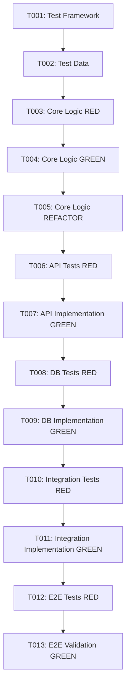

# Feature Implementation Task Breakdown

## Project Information
- **Project ID**: TSK-XXX
- **Project Name**: [Feature Name]
- **Work Type**: Feature Development
- **Created**: [Date]
- **Phase**: TASKS
- **Session ID**: [UUID]

## Plan Review
### Architecture Compliance
- [ ] All architectural components addressed in tasks
- [ ] TDD strategy reflected in task ordering
- [ ] Integration points properly sequenced
- [ ] Quality gates integrated into task flow

### Task Structure Validation
- [ ] Tasks are atomic and testable
- [ ] Dependencies clearly identified
- [ ] Acceptance criteria defined for each task
- [ ] TDD red-green-refactor cycles incorporated

## TDD-Driven Task Organization

### Test Infrastructure Tasks (Priority 1)
#### [T001] Setup Test Framework and Infrastructure
- **Description**: Configure test environment and frameworks
- **Type**: Test Infrastructure
- **Priority**: Critical
- **Estimated Effort**: [Hours]
- **Dependencies**: None
- **TDD Cycle**: RED (write failing tests for test infrastructure)

**Acceptance Criteria**:
- [ ] Test framework configured and working
- [ ] CI/CD pipeline includes automated tests
- [ ] Test database environment ready
- [ ] Mock/stub infrastructure in place

**Test Cases**:
- [ ] Framework initialization test
- [ ] CI/CD integration test
- [ ] Mock service validation test

---

#### [T002] Create Test Data Management System
- **Description**: Implement test data creation and cleanup utilities
- **Type**: Test Infrastructure
- **Priority**: Critical
- **Estimated Effort**: [Hours]
- **Dependencies**: T001
- **TDD Cycle**: RED (write failing tests for data management)

**Acceptance Criteria**:
- [ ] Test data factory implemented
- [ ] Database cleanup utilities working
- [ ] Test data isolation achieved
- [ ] Data consistency validated

**Test Cases**:
- [ ] Data creation test
- [ ] Data cleanup test
- [ ] Isolation verification test

---

### Core Feature Tasks (Priority 2)

#### [T003] Implement Core Business Logic - RED
- **Description**: Write failing tests for core business logic
- **Type**: Test-First Development
- **Priority**: Critical
- **Estimated Effort**: [Hours]
- **Dependencies**: T001, T002
- **TDD Cycle**: RED (write failing tests before implementation)

**Acceptance Criteria**:
- [ ] Comprehensive failing tests written
- [ ] Edge cases identified and tested
- [ ] Error scenarios defined
- [ ] Test coverage targets met

**Test Cases to Write**:
- [ ] Happy path test
- [ ] Edge case test 1
- [ ] Edge case test 2
- [ ] Error handling test
- [ ] Performance boundary test

---

#### [T004] Implement Core Business Logic - GREEN
- **Description**: Implement minimum code to pass failing tests
- **Type**: Test-First Development
- **Priority**: Critical
- **Estimated Effort**: [Hours]
- **Dependencies**: T003
- **TDD Cycle**: GREEN (write minimal implementation)

**Acceptance Criteria**:
- [ ] All failing tests now pass
- [ ] Implementation is minimal and focused
- [ ] No unnecessary code added
- [ ] Tests maintain fast execution

**Implementation Tasks**:
- [ ] Write minimal business logic
- [ ] Run test suite
- [ ] Fix any failing tests
- [ ] Ensure all tests pass

---

#### [T005] Refactor Core Business Logic - REFACTOR
- **Description**: Improve code quality while maintaining test coverage
- **Type**: Test-First Development
- **Priority**: High
- **Estimated Effort**: [Hours]
- **Dependencies**: T004
- **TDD Cycle**: REFACTOR (improve design with tests as safety net)

**Acceptance Criteria**:
- [ ] All tests continue to pass
- [ ] Code readability improved
- [ ] Design patterns applied appropriately
- [ ] Performance optimized where needed

**Refactoring Tasks**:
- [ ] Extract reusable methods
- [ ] Apply design patterns
- [ ] Optimize algorithms
- [ ] Update documentation

---

### API Development Tasks (Priority 3)

#### [T006] API Endpoint Tests - RED
- **Description**: Write failing tests for API endpoints
- **Type**: API Development
- **Priority**: High
- **Estimated Effort**: [Hours]
- **Dependencies**: T005
- **TDD Cycle**: RED (API test specification)

**Acceptance Criteria**:
- [ ] Endpoint behavior fully specified in tests
- [ ] Request/response schemas validated
- [ ] Error scenarios tested
- [ ] Authentication/authorization tested

**Test Cases**:
- [ ] Happy path API test
- [ ] Validation error test
- [ ] Authentication error test
- [ ] Rate limiting test

---

#### [T007] API Endpoint Implementation - GREEN
- **Description**: Implement API endpoints to pass tests
- **Type**: API Development
- **Priority**: High
- **Estimated Effort**: [Hours]
- **Dependencies**: T006
- **TDD Cycle**: GREEN (API implementation)

**Acceptance Criteria**:
- [ ] All API tests pass
- [ ] Endpoints follow REST conventions
- [ ] Error handling consistent
- [ ] Documentation generated

**Implementation Tasks**:
- [ ] Implement endpoint handlers
- [ ] Add request validation
- [ ] Implement error handling
- [ ] Generate API documentation

---

### Database Integration Tasks (Priority 4)

#### [T008] Database Schema Tests - RED
- **Description**: Write tests for database operations
- **Type**: Database Development
- **Priority**: High
- **Estimated Effort**: [Hours]
- **Dependencies**: T007
- **TDD Cycle**: RED (database behavior specification)

**Acceptance Criteria**:
- [ ] Data persistence behavior tested
- [ ] Constraint validation tested
- [ ] Transaction handling tested
- [ ] Performance benchmarks defined

**Test Cases**:
- [ ] Create operation test
- [ ] Read operation test
- [ ] Update operation test
- [ ] Delete operation test
- [ ] Transaction rollback test

---

#### [T009] Database Implementation - GREEN
- **Description**: Implement database operations
- **Type**: Database Development
- **Priority**: High
- **Estimated Effort**: [Hours]
- **Dependencies**: T008
- **TDD Cycle**: GREEN (database implementation)

**Acceptance Criteria**:
- [ ] All database tests pass
- [ ] Schema properly migrated
- [ ] Indexes optimized
- [ ] Data integrity maintained

**Implementation Tasks**:
- [ ] Create migration scripts
- [ ] Implement data access layer
- [ ] Add database indexes
- [ ] Set up connection pooling

---

### Integration Tasks (Priority 5)

#### [T010] External Service Integration Tests - RED
- **Description**: Write tests for external service integration
- **Type**: Integration Development
- **Priority**: Medium
- **Estimated Effort**: [Hours]
- **Dependencies**: T009
- **TDD Cycle**: RED (integration behavior specification)

**Acceptance Criteria**:
- [ ] External API behavior tested
- [ ] Error scenarios covered
- [ ] Timeout handling tested
- [ ] Retry logic tested

**Test Cases**:
- [ ] Successful integration test
- [ ] Service unavailable test
- [ ] Timeout handling test
- [ ] Retry mechanism test

---

#### [T011] External Service Integration - GREEN
- **Description**: Implement external service integration
- **Type**: Integration Development
- **Priority**: Medium
- **Estimated Effort**: [Hours]
- **Dependencies**: T010
- **TDD Cycle**: GREEN (integration implementation)

**Acceptance Criteria**:
- [ ] All integration tests pass
- [ ] Error handling robust
- [ ] Monitoring implemented
- [ ] Circuit breaker pattern applied

**Implementation Tasks**:
- [ ] Implement service client
- [ ] Add error handling
- [ ] Implement retry logic
- [ ] Add monitoring/health checks

---

### End-to-End Tests (Priority 6)

#### [T012] User Journey Tests - RED
- **Description**: Write comprehensive end-to-end tests
- **Type**: E2E Testing
- **Priority**: Medium
- **Estimated Effort**: [Hours]
- **Dependencies**: T011
- **TDD Cycle**: RED (user journey specification)

**Acceptance Criteria**:
- [ ] Critical user paths tested
- [ ] Cross-component integration verified
- [ ] Performance baselines established
- [ ] Accessibility tested

**Test Cases**:
- [ ] Complete user workflow test
- [ ] Performance benchmark test
- [ ] Accessibility compliance test
- [ ] Cross-browser compatibility test

---

#### [T013] User Journey Validation - GREEN
- **Description**: Validate complete user journeys work end-to-end
- **Type**: E2E Validation
- **Priority**: Medium
- **Estimated Effort**: [Hours]
- **Dependencies**: T012
- **TDD Cycle**: GREEN (E2E validation)

**Acceptance Criteria**:
- [ ] All E2E tests pass
- [ ] Performance targets met
- [ ] User experience validated
- [ ] Production readiness confirmed

**Validation Tasks**:
- [ ] Run complete test suite
- [ ] Verify performance metrics
- [ ] Test user acceptance criteria
- [ ] Validate production deployment

---

## Task Dependencies Graph

## Quality Gates

### Per-Task Quality Gates
- [ ] All tests pass (100% pass rate)
- [ ] Code coverage targets met
- [ ] Code quality checks pass
- [ ] Security scans pass
- [ ] Documentation updated

### Phase Quality Gates
- [ ] Test Infrastructure Complete (T001-T002)
- [ ] Core Logic Implemented (T003-T005)
- [ ] API Layer Functional (T006-T007)
- [ ] Database Integration Complete (T008-T009)
- [ ] External Services Integrated (T010-T011)
- [ ] E2E Validation Passed (T012-T013)

## Risk Monitoring

### Task-Level Risks
- **Test Quality**: Risk of insufficient test coverage
  - **Mitigation**: Regular code reviews, coverage requirements
- **Performance**: Risk of performance degradation
  - **Mitigation**: Performance testing at each phase
- **Integration**: Risk of integration failures
  - **Mitigation**: Early integration testing, mocking strategies

### Schedule Risks
- **Complexity Underestimation**: Tasks taking longer than expected
  - **Mitigation**: Buffer time, regular check-ins
- **Dependency Delays**: External factors causing delays
  - **Mitigation**: Parallel work streams, early dependency testing

## Success Metrics

### Task Completion Metrics
- **Task Completion Rate**: [% of tasks completed on time]
- **Test Pass Rate**: [% of tests passing consistently]
- **Code Quality Score**: [Static analysis score]
- **Coverage Metric**: [% of code covered by tests]

### TDD Effectiveness Metrics
- **Red-Green-Refactor Cycle Time**: [Average time per cycle]
- **Test Failure Rate**: [% of new tests that fail initially]
- **Refactoring Success**: [% of refactorings that maintain test pass rate]

## Next Phase Readiness

### Implementation Prerequisites
- [ ] All tasks defined with clear acceptance criteria
- [ ] TDD cycle structure established
- [ ] Dependencies mapped and sequenced
- [ ] Quality gates defined and automated
- [ ] Risk mitigation strategies in place

### Development Environment Setup
- [ ] Development environments provisioned
- [ ] CI/CD pipeline configured
- [ ] Monitoring and logging set up
- [ ] Code review process established

---
**Tasks Status**: DRAFT / REVIEW / APPROVED
**Last Updated**: [Date]
**Total Estimated Effort**: [Hours]
**Phase Transition**: Ready for IMPLEMENT phase
