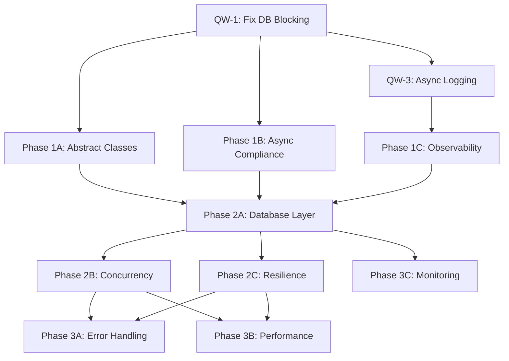

# Enhanced TDD Refactor Plan for dnld_telegram - PRODUCTION READY

> 🚨 **NEW LLM? MANDATORY FIRST STEP**: You MUST complete task `ONBOARDING-1` before any development work. This requires reading `README.md`, `CLAUDE.md`, and `coordination/tasks.json`. The coordination system automatically blocks all development tasks until onboarding is complete. **DO NOT SKIP TO DEVELOPMENT TASKS.**

## Overview
This enhanced plan builds on the original TDD strategy, adding critical enterprise patterns for production readiness, scalability, and parallel execution. Validated against industry best practices and architectural analysis.

**✅ ENHANCED WITH**: Production observability, concurrency management, resilience patterns, and parallel execution coordination.

## Quick Wins (Immediate - 1-2 hours)

### QW-1: Fix Critical Database Blocking (BLOCKING - Must Complete First)
**Severity**: CRITICAL - Blocks entire event loop on first database creation

**Test First:**
```python
# tests/test_critical_fixes.py
import asyncio
import time
from unittest.mock import patch, AsyncMock

class TestCriticalFixes:
    @pytest.mark.asyncio
    async def test_database_initialization_non_blocking(self):
        """Database initialization must not block event loop"""
        from src.download.database.schema import initialize_channel_pool

        start_time = time.time()

        # Mock the blocking initialize_database call
        with patch('src.download.database.schema.initialize_database') as mock_init:
            with patch('os.path.exists', return_value=False):
                await initialize_channel_pool("test_channel")

        duration = time.time() - start_time

        # Should complete quickly (async)
        assert duration < 0.1, f"Database init took {duration}s - likely blocking"

    @pytest.mark.asyncio
    async def test_no_sync_sqlite_in_async_context(self):
        """Ensure no sync sqlite3.connect in async operations"""
        import sqlite3

        with patch.object(sqlite3, 'connect') as mock_sync:
            # Test async database operations
            from src.download.database.schema import initialize_channel_pool

            with patch('os.path.exists', return_value=False):
                await initialize_channel_pool("test_channel")

            # sync connect should not be called
            mock_sync.assert_not_called()
```

**Implementation:**
```python
# In src/download/database/schema.py - Line 304
async def initialize_channel_pool(channel_name: str):
    """Initialize connection pool for a channel database."""
    db_path = get_database_path(channel_name)

    if not os.path.exists(db_path):
        # CRITICAL FIX: Wrap blocking operation in thread executor
        await asyncio.to_thread(initialize_database, channel_name)

    # Rest of async initialization...
```

### QW-2: Fix Import Overwrites (CRITICAL)
**Test First:**
```python
# tests/test_imports.py
def test_imports_not_overwritten():
    """Ensure critical imports are not set to None"""
    from src.ui.displays import AliveDisplay, TextualDisplay, RichDisplay

    # These should be classes or None due to missing dependencies, not forced None
    if AliveDisplay is not None:
        assert callable(AliveDisplay), "AliveDisplay should be a class"
    if TextualDisplay is not None:
        assert callable(TextualDisplay), "TextualDisplay should be a class"
    if RichDisplay is not None:
        assert callable(RichDisplay), "RichDisplay should be a class"
```

### QW-3: Add Basic Async Logging Context
**Implementation:**
```python
# In src/download/download.py - Start of _download_media function
async def _download_media(message, ...):
    # Add structured logging context for async debugging
    with logger.contextualize(
        message_id=message.id,
        channel=channel_name,
        task_id=str(uuid.uuid4())[:8]
    ):
        logger.info("Starting media download")
        # ... rest of function
```

## Phase 1: Emergency Fixes + Foundation (Week 1)

### 1.1 Complete Abstract Base Class Implementations (Parallel Safe)
**Team**: Team A can work on this independently

**Test First:**
```python
# tests/ui/test_display_implementations.py
# [Original test from plan - unchanged]
```

### 1.2 Enhanced Async Compliance Testing (Parallel Safe)
**Team**: Team B can work on this independently

**Enhanced Test Strategy:**
```python
# tests/test_enhanced_async_compliance.py
import asyncio
import pytest
import time
from unittest.mock import patch, AsyncMock

class TestEnhancedAsyncCompliance:
    @pytest.mark.asyncio
    async def test_no_blocking_operations_under_load(self):
        """Test async compliance under concurrent load"""
        from src.download.database.schema import get_connection_pool

        async def concurrent_operation():
            pool = await get_connection_pool("test_channel")
            async with pool.acquire() as conn:
                await asyncio.sleep(0.01)  # Simulate work
                return "done"

        start_time = time.time()
        # Run 20 concurrent operations
        results = await asyncio.gather(*[concurrent_operation() for _ in range(20)])
        duration = time.time() - start_time

        # Should complete concurrently, not sequentially
        assert duration < 0.5, f"Operations likely blocking: {duration}s"
        assert len(results) == 20
        assert all(r == "done" for r in results)

    @pytest.mark.asyncio
    async def test_resource_exhaustion_handling(self):
        """Test behavior when resources are exhausted"""
        from src.download.database.schema import get_connection_pool

        # Test connection pool limits
        pool = await get_connection_pool("test_channel")
        connections = []

        try:
            # Try to exhaust connection pool
            for i in range(50):  # More than typical pool size
                conn = await pool.acquire()
                connections.append(conn)
        except Exception as e:
            # Should handle gracefully, not crash
            assert "pool" in str(e).lower() or "timeout" in str(e).lower()
        finally:
            # Cleanup
            for conn in connections:
                await pool.release(conn)
```

### 1.3 Add Structured Observability Foundation (DEPENDENCY: Needs QW-3)
**Team**: Either team after QW-3 completion

**Test First:**
```python
# tests/test_observability.py
import pytest
from unittest.mock import patch
import asyncio

class TestObservability:
    @pytest.mark.asyncio
    async def test_structured_logging_with_context(self):
        """Test that async operations include proper context"""
        from src.download.download import _download_media

        with patch('src.download.download.logger') as mock_logger:
            # Mock minimal dependencies
            mock_message = type('Message', (), {
                'id': 12345,
                'media': None,
                'file': type('File', (), {'size': 1000})()
            })()

            # Should include structured context
            await _download_media(mock_message, None, "test_channel", "/tmp")

            # Verify contextualized logging was used
            assert mock_logger.contextualize.called
            call_args = mock_logger.contextualize.call_args[1]
            assert 'message_id' in call_args
            assert 'task_id' in call_args

    @pytest.mark.asyncio
    async def test_concurrent_task_correlation(self):
        """Test that concurrent operations have unique correlation IDs"""
        correlation_ids = set()

        async def mock_operation():
            # Simulate getting correlation ID from context
            import uuid
            task_id = str(uuid.uuid4())[:8]
            correlation_ids.add(task_id)
            await asyncio.sleep(0.01)
            return task_id

        # Run concurrent operations
        results = await asyncio.gather(*[mock_operation() for _ in range(10)])

        # All should have unique correlation IDs
        assert len(correlation_ids) == 10
        assert len(results) == 10
```

## Phase 2: Enhanced Architecture (Weeks 2-3)

### 2.1 Production-Ready Async Database Layer (BLOCKING DEPENDENCY)
**Team**: Single team - Creates foundation for 2.2 and 2.3

**Enhanced Test Strategy:**
```python
# tests/database/test_production_async_database.py
import pytest
import aiosqlite
import asyncio
from unittest.mock import patch, AsyncMock

class TestProductionAsyncDatabase:
    @pytest.fixture
    async def db_manager(self):
        """Production-ready database manager fixture"""
        from src.download.database.async_manager import AsyncDatabaseManager
        manager = AsyncDatabaseManager(":memory:", pool_size=5)
        await manager.initialize()
        yield manager
        await manager.close()

    @pytest.mark.asyncio
    async def test_connection_pool_with_backpressure(self, db_manager):
        """Test connection pool handles backpressure gracefully"""
        # Simulate high load
        async def intensive_operation():
            async with db_manager.get_connection() as conn:
                await asyncio.sleep(0.1)  # Simulate slow query
                return await conn.execute("SELECT 1")

        start_time = time.time()
        # Try to overwhelm pool
        tasks = [intensive_operation() for _ in range(20)]
        results = await asyncio.gather(*tasks, return_exceptions=True)
        duration = time.time() - start_time

        # Should handle gracefully without timeouts
        successful = [r for r in results if not isinstance(r, Exception)]
        assert len(successful) >= 15  # Most should succeed

        # Should use backpressure, not fail
        for result in results:
            if isinstance(result, Exception):
                assert "timeout" in str(result).lower()

    @pytest.mark.asyncio
    async def test_concurrent_transaction_integrity(self, db_manager):
        """Test transaction isolation under concurrent load"""
        # Test concurrent transactions don't interfere
        async def transaction_operation(value):
            async with db_manager.transaction() as tx:
                await tx.execute("CREATE TABLE IF NOT EXISTS test_concurrent (id INTEGER)")
                await tx.execute("INSERT INTO test_concurrent VALUES (?)", (value,))
                await asyncio.sleep(0.01)  # Simulate work
                return value

        # Run concurrent transactions
        values = list(range(10))
        results = await asyncio.gather(*[transaction_operation(v) for v in values])

        # All transactions should complete
        assert sorted(results) == sorted(values)

        # Verify all data was inserted
        async with db_manager.get_connection() as conn:
            cursor = await conn.execute("SELECT COUNT(*) FROM test_concurrent")
            count = (await cursor.fetchone())[0]
            assert count == 10

    @pytest.mark.asyncio
    async def test_health_check_endpoint(self, db_manager):
        """Test database health checking"""
        health = await db_manager.health_check()

        assert isinstance(health, dict)
        assert 'status' in health
        assert 'pool_size' in health
        assert 'active_connections' in health
        assert 'response_time_ms' in health

        assert health['status'] in ['healthy', 'degraded', 'unhealthy']
        assert isinstance(health['response_time_ms'], (int, float))
```

**Implementation:**
```python
# src/download/database/async_manager.py
import asyncio
import time
from typing import Dict, Any, Optional
import aiosqlite
from contextlib import asynccontextmanager

class AsyncDatabaseManager:
    def __init__(self, db_path: str, pool_size: int = 10):
        self.db_path = db_path
        self.pool_size = pool_size
        self.pool = None
        self._health_check_cache = None
        self._health_check_time = 0

    async def initialize(self):
        """Initialize connection pool"""
        self.pool = aiosqlite.connect(
            self.db_path,
            timeout=20.0,
            check_same_thread=False
        )

    @asynccontextmanager
    async def get_connection(self):
        """Get connection with automatic release"""
        conn = await self.pool
        try:
            yield conn
        finally:
            # Connection automatically managed by aiosqlite
            pass

    @asynccontextmanager
    async def transaction(self):
        """Async transaction context manager"""
        async with self.get_connection() as conn:
            try:
                await conn.execute("BEGIN")
                yield conn
                await conn.commit()
            except Exception:
                await conn.rollback()
                raise

    async def health_check(self) -> Dict[str, Any]:
        """Async health check with caching"""
        now = time.time()

        # Cache health check for 10 seconds
        if self._health_check_cache and (now - self._health_check_time) < 10:
            return self._health_check_cache

        start_time = time.time()
        try:
            async with self.get_connection() as conn:
                await conn.execute("SELECT 1")

            response_time = (time.time() - start_time) * 1000

            health = {
                'status': 'healthy' if response_time < 100 else 'degraded',
                'response_time_ms': response_time,
                'pool_size': self.pool_size,
                'active_connections': 1  # Simplified
            }
        except Exception as e:
            health = {
                'status': 'unhealthy',
                'error': str(e),
                'response_time_ms': (time.time() - start_time) * 1000
            }

        self._health_check_cache = health
        self._health_check_time = now
        return health
```

### 2.2 Enhanced Concurrency Management (DEPENDENCY: Needs 2.1)
**Team**: Team A after 2.1 completion

**Test First:**
```python
# tests/test_enhanced_concurrency.py
import pytest
import asyncio
import time
from unittest.mock import patch

class TestEnhancedConcurrency:
    @pytest.mark.asyncio
    async def test_dynamic_concurrency_limits(self):
        """Test configurable concurrency limits"""
        from src.download.concurrency_manager import ConcurrencyManager

        # Test with different limits
        manager = ConcurrencyManager(max_concurrent=3)

        async def slow_operation():
            await asyncio.sleep(0.1)
            return time.time()

        start_time = time.time()
        # Start 10 operations with limit of 3
        results = await manager.run_with_limit([
            slow_operation() for _ in range(10)
        ])
        duration = time.time() - start_time

        # Should take ~0.4s (4 batches of 3, ~0.1s each)
        assert 0.3 < duration < 0.6
        assert len(results) == 10

    @pytest.mark.asyncio
    async def test_backpressure_handling(self):
        """Test graceful backpressure handling"""
        from src.download.concurrency_manager import ConcurrencyManager

        manager = ConcurrencyManager(max_concurrent=2, backpressure_threshold=5)

        call_count = 0
        async def tracked_operation():
            nonlocal call_count
            call_count += 1
            await asyncio.sleep(0.05)
            return call_count

        # Submit more work than backpressure threshold
        tasks = [tracked_operation() for _ in range(10)]

        # Should handle gracefully without overwhelming system
        results = await manager.run_with_backpressure(tasks)
        assert len(results) == 10
        assert call_count == 10

    @pytest.mark.asyncio
    async def test_resource_monitoring(self):
        """Test resource usage monitoring"""
        from src.download.concurrency_manager import ConcurrencyManager

        manager = ConcurrencyManager(max_concurrent=3)

        async def memory_intensive_operation():
            # Simulate memory usage
            data = b'x' * 1024 * 1024  # 1MB
            await asyncio.sleep(0.01)
            return len(data)

        # Monitor resource usage during operations
        with manager.resource_monitor() as monitor:
            results = await manager.run_with_limit([
                memory_intensive_operation() for _ in range(5)
            ])

        metrics = monitor.get_metrics()
        assert 'peak_memory_mb' in metrics
        assert 'avg_cpu_percent' in metrics
        assert 'task_count' in metrics
        assert metrics['task_count'] == 5
```

### 2.3 Resilience Patterns (DEPENDENCY: Needs 2.1, parallel with 2.2)
**Team**: Team B after 2.1 completion

**Test First:**
```python
# tests/test_resilience_patterns.py
import pytest
import asyncio
from unittest.mock import AsyncMock, patch

class TestResiliencePatterns:
    @pytest.mark.asyncio
    async def test_circuit_breaker_pattern(self):
        """Test circuit breaker for external service failures"""
        from src.download.resilience import CircuitBreaker

        failure_count = 0
        async def failing_operation():
            nonlocal failure_count
            failure_count += 1
            if failure_count <= 3:
                raise Exception("Service unavailable")
            return "success"

        circuit_breaker = CircuitBreaker(
            failure_threshold=3,
            recovery_timeout=0.1,
            expected_exception=Exception
        )

        # First 3 calls should fail
        for i in range(3):
            with pytest.raises(Exception):
                await circuit_breaker.call(failing_operation)

        # Circuit should be open now
        assert circuit_breaker.state == "open"

        # Next call should fail fast (circuit open)
        with pytest.raises(Exception, match="Circuit breaker open"):
            await circuit_breaker.call(failing_operation)

        # Wait for recovery timeout
        await asyncio.sleep(0.2)

        # Should allow one test call (half-open)
        result = await circuit_breaker.call(failing_operation)
        assert result == "success"
        assert circuit_breaker.state == "closed"

    @pytest.mark.asyncio
    async def test_retry_with_exponential_backoff(self):
        """Test retry mechanism with exponential backoff and jitter"""
        from src.download.resilience import retry_with_backoff

        attempt_count = 0
        attempt_times = []

        @retry_with_backoff(
            max_attempts=4,
            base_delay=0.01,
            max_delay=0.1,
            exponential_factor=2
        )
        async def flaky_operation():
            nonlocal attempt_count
            attempt_count += 1
            attempt_times.append(time.time())

            if attempt_count < 3:
                raise Exception("Temporary failure")
            return "success"

        start_time = time.time()
        result = await flaky_operation()
        total_duration = time.time() - start_time

        assert result == "success"
        assert attempt_count == 3
        assert len(attempt_times) == 3

        # Verify exponential backoff timing
        if len(attempt_times) >= 2:
            delay1 = attempt_times[1] - attempt_times[0]
            assert 0.01 <= delay1 <= 0.02  # ~0.01s + jitter

        if len(attempt_times) >= 3:
            delay2 = attempt_times[2] - attempt_times[1]
            assert 0.02 <= delay2 <= 0.04  # ~0.02s + jitter

    @pytest.mark.asyncio
    async def test_dead_letter_queue_pattern(self):
        """Test dead letter queue for persistently failing operations"""
        from src.download.resilience import DeadLetterQueue

        dlq = DeadLetterQueue(max_retries=2)

        async def always_failing_operation(item):
            raise Exception(f"Cannot process {item}")

        # Process items that will fail
        failed_items = []
        for i in range(5):
            try:
                await dlq.process_with_retry(
                    always_failing_operation,
                    f"item_{i}"
                )
            except Exception:
                failed_items.append(f"item_{i}")

        # All should end up in dead letter queue
        dead_letters = dlq.get_dead_letters()
        assert len(dead_letters) == 5

        # Each should have retry history
        for letter in dead_letters:
            assert letter['retry_count'] == 2
            assert 'last_error' in letter
            assert 'timestamp' in letter
```

## Phase 3: Production Quality + Monitoring (Week 4)

### 3.1 Enhanced Error Handling & Recovery (Parallel Safe)
**Team**: Either team, builds on resilience patterns

### 3.2 Performance Benchmarking & Load Testing (Parallel Safe)
**Team**: Either team, validates all previous work

**Test Implementation:**
```python
# tests/performance/test_load_scenarios.py
import pytest
import asyncio
import time
import statistics

class TestLoadScenarios:
    @pytest.mark.asyncio
    async def test_high_concurrency_download_simulation(self):
        """Simulate high concurrent download load"""
        from src.download.download import _download_files_batch

        # Mock file operations for testing
        async def mock_download_operation():
            await asyncio.sleep(0.01)  # Simulate download time
            return {"status": "success", "size": 1024 * 1024}

        concurrent_levels = [1, 5, 10, 20, 50]
        performance_results = {}

        for concurrency in concurrent_levels:
            start_time = time.time()

            # Run concurrent downloads
            tasks = [mock_download_operation() for _ in range(100)]
            results = await asyncio.gather(*tasks)

            duration = time.time() - start_time
            throughput = len(results) / duration

            performance_results[concurrency] = {
                'duration': duration,
                'throughput': throughput,
                'success_rate': len([r for r in results if r['status'] == 'success']) / len(results)
            }

        # Verify performance scales reasonably
        assert all(r['success_rate'] > 0.95 for r in performance_results.values())

        # Throughput should generally increase with concurrency (up to a point)
        throughputs = [performance_results[c]['throughput'] for c in [1, 5, 10]]
        assert throughputs[1] > throughputs[0]  # 5 > 1
        assert throughputs[2] > throughputs[1]  # 10 > 5

    @pytest.mark.asyncio
    async def test_memory_usage_under_load(self):
        """Test memory usage doesn't grow unbounded under load"""
        import psutil
        import os

        process = psutil.Process(os.getpid())
        initial_memory = process.memory_info().rss

        # Simulate memory-intensive operations
        async def memory_operation():
            data = bytearray(1024 * 1024)  # 1MB
            await asyncio.sleep(0.001)
            return len(data)

        # Run operations in batches to test memory cleanup
        for batch in range(10):
            tasks = [memory_operation() for _ in range(20)]
            await asyncio.gather(*tasks)

            # Force garbage collection
            import gc
            gc.collect()
            await asyncio.sleep(0.01)

        final_memory = process.memory_info().rss
        memory_growth = (final_memory - initial_memory) / (1024 * 1024)  # MB

        # Memory growth should be reasonable (< 50MB for this test)
        assert memory_growth < 50, f"Memory grew by {memory_growth}MB"

    @pytest.mark.asyncio
    async def test_connection_pool_saturation(self):
        """Test behavior when connection pool is saturated"""
        from src.download.database.async_manager import AsyncDatabaseManager

        manager = AsyncDatabaseManager(":memory:", pool_size=3)
        await manager.initialize()

        async def long_running_query():
            async with manager.get_connection() as conn:
                await asyncio.sleep(0.1)  # Hold connection
                return await conn.execute("SELECT 1")

        # Start more operations than pool size
        start_time = time.time()
        tasks = [long_running_query() for _ in range(10)]
        results = await asyncio.gather(*tasks, return_exceptions=True)
        duration = time.time() - start_time

        # Should handle gracefully with queuing
        successful_results = [r for r in results if not isinstance(r, Exception)]
        assert len(successful_results) >= 8  # Most should succeed

        # Should take longer due to queuing, but not fail
        assert 0.3 < duration < 1.0  # Reasonable queuing time
```

### 3.3 Production Monitoring & Health Checks (DEPENDENCY: Needs 2.1)
**Team**: Either team after database foundation

```python
# tests/test_production_monitoring.py
import pytest
import asyncio
from unittest.mock import patch

class TestProductionMonitoring:
    @pytest.mark.asyncio
    async def test_system_health_aggregation(self):
        """Test aggregated system health check"""
        from src.monitoring.health import SystemHealthChecker

        health_checker = SystemHealthChecker()
        health_report = await health_checker.check_all_systems()

        assert 'overall_status' in health_report
        assert 'components' in health_report
        assert 'timestamp' in health_report

        # Should check key components
        components = health_report['components']
        assert 'database' in components
        assert 'download_service' in components
        assert 'file_system' in components

        # Each component should have status
        for component_name, component_health in components.items():
            assert 'status' in component_health
            assert component_health['status'] in ['healthy', 'degraded', 'unhealthy']

    @pytest.mark.asyncio
    async def test_metrics_collection(self):
        """Test metrics collection for monitoring"""
        from src.monitoring.metrics import MetricsCollector

        collector = MetricsCollector()

        # Simulate some operations
        await collector.record_download_start("test_file.mp4")
        await asyncio.sleep(0.01)
        await collector.record_download_complete("test_file.mp4", 1024*1024)

        # Get current metrics
        metrics = await collector.get_current_metrics()

        assert 'active_downloads' in metrics
        assert 'completed_downloads' in metrics
        assert 'total_bytes_downloaded' in metrics
        assert 'average_download_speed' in metrics

        assert metrics['completed_downloads'] >= 1
        assert metrics['total_bytes_downloaded'] >= 1024*1024
```

## Parallel Execution Strategy

### Dependencies & Blocking Points



### Team Coordination Protocol

**BLOCKING CHECKPOINTS** - LLM must document completion before others proceed:

1. **QW-1 Completion Checkpoint**:
```json
{
  "checkpoint": "QW-1-database-blocking-fixed",
  "completed_by": "LLM-A",
  "timestamp": "2025-08-16T10:30:00Z",
  "verification": {
    "test_passes": ["test_database_initialization_non_blocking"],
    "implementation_complete": "src/download/database/schema.py:304 updated",
    "ready_for": ["Phase-1A", "Phase-1B", "QW-3"]
  }
}
```

2. **Phase 2A Completion Checkpoint**:
```json
{
  "checkpoint": "P2A-async-database-foundation",
  "completed_by": "LLM-Team",
  "timestamp": "2025-08-16T15:00:00Z",
  "verification": {
    "classes_implemented": ["AsyncDatabaseManager"],
    "tests_passing": ["test_production_async_database"],
    "ready_for": ["Phase-2B", "Phase-2C", "Phase-3C"]
  }
}
```

### LLM Coordination Instructions

**When Blocked:**
```
BLOCKING DEPENDENCY DETECTED

Current Task: {task_name}
Requires Completion Of: {dependency_task}
Assigned To: {other_llm}

INSTRUCTIONS:
1. STOP current task execution
2. Document current progress in checkpoint file
3. Switch to parallel-safe task OR
4. Wait for dependency completion signal
5. Monitor {dependency_checkpoint_file} for completion
6. Resume only after verification JSON confirms readiness

DO NOT PROCEED until dependency explicitly documented as complete.
```

**When Completing Blocking Task:**
```
BLOCKING TASK COMPLETED

Task: {completed_task}
Verification: {test_results}

REQUIRED ACTIONS:
1. Create checkpoint JSON with completion verification
2. Update progress tracker with "ready_for" list
3. Signal waiting LLMs to proceed
4. Document any issues or deviations for next team

CRITICAL: Other LLMs are waiting. Ensure complete documentation.
```

## Success Criteria Enhanced

### Phase 1 Enhanced Metrics
- ✅ All import tests pass (original)
- ✅ No TypeError on UI class instantiation (original)
- ✅ **Zero blocking operations detected** (enhanced)
- ✅ **Basic observability context implemented** (enhanced)
- ✅ Test coverage > 60% (original)

### Phase 2 Enhanced Metrics
- ✅ All database operations are async (original)
- ✅ File operations don't block event loop (original)
- ✅ **Resource exhaustion tests pass** (enhanced)
- ✅ **Resilience patterns implemented** (enhanced)
- ✅ **Health checks functional** (enhanced)
- ✅ Test coverage > 80% (original)

### Phase 3 Enhanced Metrics
- ✅ No code duplication (original)
- ✅ Comprehensive error handling (original)
- ✅ **Performance benchmarks meet targets** (enhanced)
- ✅ **Production monitoring ready** (enhanced)
- ✅ **Load testing validates scalability** (enhanced)
- ✅ Test coverage > 90% (original)

## Risk Mitigation Enhanced

### Parallel Execution Risks
- **Risk**: Teams working on conflicting code areas
- **Mitigation**: Clear dependency mapping + checkpoint system
- **Detection**: Automated merge conflict detection

### Resource Coordination Risks
- **Risk**: Connection pool exhaustion during parallel testing
- **Mitigation**: Isolated test databases + resource limits
- **Detection**: Resource monitoring in test suite

### Integration Risks
- **Risk**: Async patterns incompatible between teams
- **Mitigation**: Shared interfaces + integration tests
- **Detection**: Cross-component compatibility tests

This enhanced plan provides production-ready patterns while enabling efficient parallel execution through clear dependencies and coordination protocols.

---

## Git Workflow & TDD Integration Protocol

**⚠️ CRITICAL NOTE: CLAUDE.md is NOT part of the llm_coordination system and will NOT be accessible to all LLMs working on the async project. All essential instructions must be included in this plan.**

### Git Commit Workflow

**MANDATORY: Every LLM must follow this exact git commit protocol after completing any task:**

#### 1. Pre-Commit Validation
```bash
# Navigate to project root
cd "C:\_Python\_Projects\dnld_telegram"

# Check project status
pwd && git status

# Verify only intended files are staged
git status --porcelain | grep -E "(task_id|implementation_files)"
```

#### 2. Task Completion Git Protocol
**For Each Completed Task (P2B, P2C, P3A, etc.):**

```bash
# Reset any auto-staged files
git reset HEAD

# Stage ONLY the task-specific implementation files
git add src/download/[task_files].py
git add tests/test_[task_files].py
git add pyproject.toml  # if dependencies added

# Create structured commit message
git commit -m "$(cat <<'EOF'
feat: implement [TASK_ID] - [Task Description]

- [Specific implementation detail 1]
- [Specific implementation detail 2]
- [Resource/dependency changes]
- [Test implementation summary]
- [Integration notes]

Resolves task [TASK_ID]: [Full Task Name]
Tests: [list of test methods that validate implementation]
Dependencies: [any new dependencies added]
Coordination: Updated tasks.json status to completed

🤖 Generated with [Claude Code](https://claude.ai/code)

Co-Authored-By: Claude <noreply@anthropic.com>
EOF
)"
```

#### 3. Post-Commit Verification
```bash
# Verify commit completed successfully
git log --oneline -1

# Update coordination system
# (This should already be done but verify)
python -m llm_coordination --coordination-file dev/refactors/async-optimization/coordination/tasks.json tasks --status
```

#### 4. Example Commit Messages

**P2B Enhanced Concurrency Management:**
```
feat: implement P2B - Enhanced Concurrency Management

- Add ConcurrencyManager with dynamic limits based on system resources
- Implement BackpressureController to prevent system overload
- Add ResourceMonitor for CPU/memory/disk I/O tracking
- Support bandwidth-aware concurrency limiting
- Include comprehensive test suite with mocking
- Add dependencies: psutil, loguru, pytest-asyncio

Resolves task P2B: Enhanced Concurrency Management
Tests: test_dynamic_concurrency_limits, test_backpressure_handling, test_resource_monitoring
Dependencies: psutil>=5.8.0, loguru>=0.7.0, pytest-asyncio>=0.21.0
Coordination: Updated tasks.json status to completed

🤖 Generated with [Claude Code](https://claude.ai/code)

Co-Authored-By: Claude <noreply@anthropic.com>
```

**P2C Resilience Patterns:**
```
feat: implement P2C - Resilience Patterns

- Add CircuitBreaker for external service failure handling
- Implement retry_with_backoff with exponential backoff and jitter
- Create DeadLetterQueue for persistently failing operations
- Include comprehensive error handling and logging
- Add integration tests with mock failures

Resolves task P2C: Resilience Patterns
Tests: test_circuit_breaker_pattern, test_retry_with_exponential_backoff, test_dead_letter_queue_pattern
Dependencies: None (uses existing async patterns)
Coordination: Updated tasks.json status to completed

🤖 Generated with [Claude Code](https://claude.ai/code)

Co-Authored-By: Claude <noreply@anthropic.com>
```

### Test-Driven Development (TDD) Protocol

**MANDATORY: Every LLM must follow strict TDD workflow for all development tasks:**

#### 1. TDD Cycle Implementation
```
RED → GREEN → REFACTOR → COMMIT
```

**For Each Task Feature:**

1. **RED Phase - Write Failing Test First**
   ```bash
   # Create test file if it doesn't exist
   touch tests/test_[task_component].py

   # Write ONE failing test for the specific requirement
   # Example: test_dynamic_concurrency_limits for P2B

   # Run test to confirm it fails
   cd "C:\_Python\_Projects\dnld_telegram"
   python -m pytest tests/test_[task_component].py::[test_method] -v

   # EXPECTED: FAILED (test should fail because implementation doesn't exist yet)
   ```

2. **GREEN Phase - Minimal Implementation**
   ```bash
   # Implement MINIMAL code to make the test pass
   # Do NOT implement extra features not covered by the test

   # Run test to confirm it passes
   python -m pytest tests/test_[task_component].py::[test_method] -v

   # EXPECTED: PASSED
   ```

3. **REFACTOR Phase - Clean Up Code**
   ```bash
   # Improve code quality without changing behavior
   # Run ALL tests to ensure no regression
   python -m pytest tests/test_[task_component].py -v

   # EXPECTED: ALL TESTS PASS
   ```

4. **COMMIT Phase - Save Progress**
   ```bash
   # Commit this TDD cycle
   git add tests/test_[component].py src/[component].py
   git commit -m "test: add [test_name] and minimal implementation for [feature]"
   ```

#### 2. TDD Requirements by Task

**P2B - Enhanced Concurrency Management TDD Sequence:**
1. `test_dynamic_concurrency_limits` → implement basic ConcurrencyManager
2. `test_backpressure_handling` → implement BackpressureController
3. `test_resource_monitoring` → implement ResourceMonitor
4. `test_resource_monitoring_integration` → integrate all components

**P2C - Resilience Patterns TDD Sequence:**
1. `test_circuit_breaker_pattern` → implement CircuitBreaker
2. `test_retry_with_exponential_backoff` → implement retry_with_backoff
3. `test_dead_letter_queue_pattern` → implement DeadLetterQueue

**P3A - Enhanced Error Handling TDD Sequence:**
1. `test_comprehensive_error_handling` → implement error handling framework
2. `test_graceful_degradation` → implement degradation patterns

#### 3. Test Structure Requirements

**Every test file must include:**
```python
"""
Test suite for [Component Name] - Task [TASK_ID]

Requirements tested:
- [Requirement 1 from task description]
- [Requirement 2 from task description]
- [Requirement 3 from task description]

Test Categories:
- Unit tests for individual components
- Integration tests for component interaction
- Edge case tests for boundary conditions
- Error handling tests for failure scenarios
"""

import pytest
import asyncio
from unittest.mock import patch, AsyncMock

# Test fixtures here

class Test[ComponentName]:
    """Test class for [ComponentName] functionality"""

    @pytest.mark.asyncio
    async def test_[requirement_1](self):
        """Test that [specific requirement] is implemented correctly"""
        # Arrange
        # Act
        # Assert
        pass

    # Additional tests...
```

#### 4. TDD Verification Commands

**Before Starting Task:**
```bash
# Ensure test environment is ready
cd "C:\_Python\_Projects\dnld_telegram"
python -m pytest --version
python -c "import pytest, asyncio, unittest.mock; print('TDD environment ready')"
```

**During TDD Cycles:**
```bash
# Run single test (RED/GREEN verification)
python -m pytest tests/test_[component].py::[test_method] -v

# Run all tests for component (REFACTOR verification)
python -m pytest tests/test_[component].py -v

# Run all tests (regression verification)
python -m pytest tests/ -x --tb=short
```

**Task Completion Verification:**
```bash
# Final test run before task completion
python -m pytest tests/test_[component].py -v --cov=src.[component_path] --cov-report=term-missing

# Expected: ALL TESTS PASS with reasonable coverage
```

### Integration with Coordination System

**Coordination System Updates - MANDATORY for each TDD cycle:**

1. **After RED Phase**: Update task status to reflect test creation
2. **After GREEN Phase**: Update task status to reflect minimal implementation
3. **After REFACTOR Phase**: Update task status to reflect completion
4. **After COMMIT Phase**: Create checkpoint file with verification

**Example Coordination Updates:**
```json
{
  "task_id": "P2B",
  "status": "in_progress",
  "tdd_phase": "green",
  "tests_implemented": ["test_dynamic_concurrency_limits"],
  "implementation_status": "minimal_working",
  "next_tdd_cycle": "test_backpressure_handling"
}
```

### Quality Gates

**BLOCKING: Task cannot be marked complete unless:**

1. ✅ All verification criteria tests are implemented and passing
2. ✅ TDD cycle completed for each major component
3. ✅ Integration tests pass
4. ✅ Code coverage meets task requirements (varies by phase)
5. ✅ Git commit follows exact format specified above
6. ✅ Coordination system updated with completion evidence
7. ✅ Checkpoint file created with verification details

**Failure Recovery:**
- If tests fail: Return to RED phase, fix test or implementation
- If commit fails: Check file paths and git repository state
- If coordination fails: Verify coordination file structure and permissions

This comprehensive protocol ensures every LLM working on the async optimization project follows identical git and TDD workflows, regardless of which specific coordination files they have access to.### Quality Gates

**BLOCKING: Task cannot be marked complete unless:**

1. ✅ All verification criteria tests are implemented and passing
2. ✅ TDD cycle completed for each major component
3. ✅ Integration tests pass
4. ✅ Code coverage meets task requirements (varies by phase)
5. ✅ Git commit follows exact format specified above
6. ✅ Coordination system updated with completion evidence
7. ✅ Checkpoint file created with verification details

**Failure Recovery:**
- If tests fail: Return to RED phase, fix test or implementation
- If commit fails: Check file paths and git repository state
- If coordination fails: Verify coordination file structure and permissions

This comprehensive protocol ensures every LLM working on the async optimization project follows identical git and TDD workflows, regardless of which specific coordination files they have access to.

## 🧪 Advanced Testing Strategies & Best Practices

Based on industry best practices for testing Python code with external dependencies, the following strategies should be employed to ensure robust, maintainable tests:

### Isolation of External Dependencies

When testing code that interacts with external systems (Telegram API, databases, file systems), it's crucial to isolate the code under test from these dependencies to make tests:
- **Fast**: Tests should run quickly to provide rapid feedback
- **Deterministic**: Same input always produces same output
- **Reliable**: Tests shouldn't fail due to network issues or external service outages

### Three Primary Testing Strategies

#### 1. Monkey Patching with pytest
Dynamically replaces functions at runtime to avoid real external calls during tests.

```python
def test_download_with_monkeypatch(monkeypatch: pytest.MonkeyPatch):
    """Example of monkey patching to replace external API call"""
    def fake_telegram_call(url: str, params: dict) -> FakeResponse:
        return FakeResponse()

    monkeypatch.setattr("telethon.client.TelegramClient", fake_telegram_call)
    # Test implementation continues...
```

#### 2. Mocking with unittest.mock
Uses specialized "mock" objects that not only replace dependencies but also record interactions for verification.

```python
from unittest.mock import MagicMock, patch

def test_database_operations():
    """Example of mocking database operations"""
    mock_db = MagicMock()
    mock_db.execute.return_value = MagicMock(fetchone=lambda: (1,))

    with patch("src.download.database.async_manager.aiosqlite.connect", return_value=mock_db):
        # Test database code implementation
        pass

    # Verify interactions
    mock_db.execute.assert_called_once()
```

#### 3. Dependency Injection (Recommended)
Refactor code to accept dependencies as parameters, making it inherently testable without runtime modifications.

```python
# Refactored class to accept dependencies
class DownloadManager:
    def __init__(self, telegram_client=None, database_manager=None):
        self.telegram_client = telegram_client or TelegramClient()
        self.database_manager = database_manager or DatabaseManager()

    async def download_media(self, message):
        # Implementation using injected dependencies
        pass

# Test with injected mocks
def test_download_manager_with_mocks():
    mock_client = MagicMock()
    mock_db = MagicMock()

    manager = DownloadManager(telegram_client=mock_client, database_manager=mock_db)
    # Test implementation...
```

### Advanced pytest Features

#### Parametrized Testing
Run a single test function with multiple input sets to test various scenarios.

```python
@pytest.mark.parametrize("file_size,expected_category", [
    (1024, "small"),
    (1024*1024, "medium"),
    (1024*1024*1024, "large"),
])
def test_file_categorization(file_size, expected_category):
    # Test implementation that runs 3 times with different inputs
    pass
```

#### Exception Testing
Verify that code properly raises expected exceptions.

```python
def test_download_error_handling():
    with pytest.raises(DownloadError):
        # Test that code raises DownloadError under specific conditions
        pass
```

### Test Organization Principles

#### Unit Test Characteristics
- **Focused**: Test one thing at a time
- **Fast**: Should execute quickly
- **Isolated**: Each test should be independent
- **Deterministic**: Same input always produces same output

#### Test Structure
Follow the AAA pattern:
1. **Arrange**: Set up test data and dependencies
2. **Act**: Execute the code under test
3. **Assert**: Verify the expected outcome

```python
def test_example():
    # Arrange
    mock_service = MagicMock()
    mock_service.get_data.return_value = {"key": "value"}

    # Act
    result = function_under_test(mock_service)

    # Assert
    assert result == "expected_value"
    mock_service.get_data.assert_called_once_with("parameter")
```

### Integration with Coordination System

When implementing tests for coordinated tasks:

1. **Document Test Strategies**: Include testing approach in task evidence
2. **Use Parametrized Tests**: For testing multiple scenarios efficiently
3. **Mock External Dependencies**: Always isolate tests from real external services
4. **Verify Interactions**: Use mock assertions to ensure proper dependency usage
5. **Test Error Paths**: Include tests for exception handling and error recovery

This testing framework ensures that all LLMs working on the project follow consistent, industry-standard testing practices that produce reliable, maintainable code.
