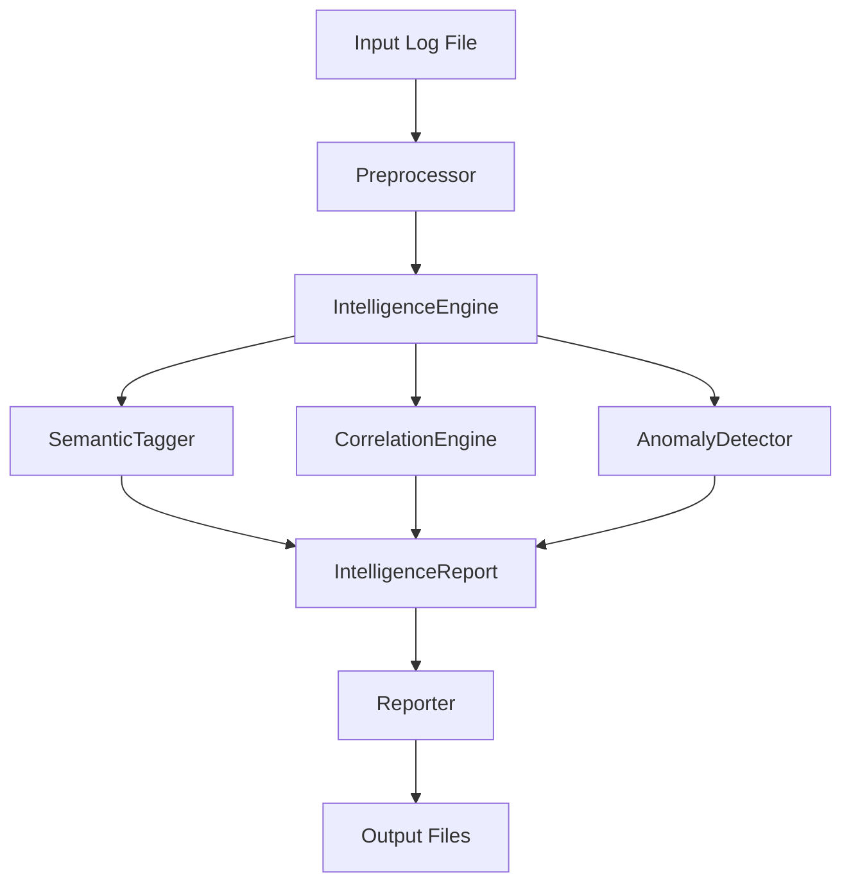

# Developer Guide

A comprehensive guide for developers working on the Advanced Log Chunking Framework, including architecture, plugin development, and contribution guidelines.

## Table of Contents

1. [Project Architecture](#project-architecture)
2. [Development Setup](#development-setup)
3. [Code Organization](#code-organization)
4. [Plugin Development](#plugin-development)
5. [Testing](#testing)
6. [Contributing](#contributing)
7. [Release Process](#release-process)

## Project Architecture

### Core Components

```
log_chunker/
├── log_chunker.py          # Main entry point and CLI coordination
├── cli.py                  # Command-line interface and argument parsing
├── config.py               # Configuration models and validation
├── data_models.py          # Core data structures and types
├── chunking_engine.py      # Main processing orchestration
├── plugin_manager.py       # Plugin system management
├── preprocessor.py         # Log preprocessing and normalization
├── intelligence_engine.py       # Advanced analysis and pattern recognition
├── reporter.py             # Multi-format report generation
├── adaptive_config.py      # Content analysis and auto-configuration
├── logging_config.py       # Logging setup and configuration
└── plugins/                # Plugin implementations
    ├── base.py            # Plugin interface definitions
    ├── semantic.py        # Semantic similarity chunking
    └── other_plugins.py   # Additional chunking strategies
```

### Data Flow



### Design Patterns

#### Plugin Architecture
The framework uses a plugin-based architecture implementing the Strategy pattern:

```python
from abc import ABC, abstractmethod
from typing import List, Protocol

class ChunkingPlugin(Protocol):
    """Plugin interface for chunking strategies"""

    @property
    def name(self) -> str:
        """Plugin identifier"""
        ...

    def initialize(self, config: ChunkingConfig, console: Console) -> bool:
        """Initialize plugin with configuration"""
        ...

    def find_boundaries(self, text: str, log_entries: List[LogEntry]) -> List[int]:
        """Find potential chunk boundaries"""
        ...

    def score_chunk(self, chunk: str, info: ChunkInfo) -> float:
        """Score chunk quality (0.0-1.0)"""
        ...

    def cleanup(self) -> None:
        """Cleanup resources"""
        ...
```

#### Configuration Management
Uses Pydantic for type-safe configuration with validation:

```python
from pydantic import BaseModel, Field, validator
from typing import List, Dict, Optional

class ChunkingConfig(BaseModel):
    target_tokens: int = Field(100000, gt=0, description="Target tokens per chunk")
    overlap_ratio: float = Field(0.15, ge=0, le=1, description="Overlap between chunks")
    enabled_plugins: List[str] = Field(default_factory=lambda: ["semantic", "temporal", "pattern"])

    @validator('target_tokens')
    def validate_target_tokens(cls, v):
        if v > 1000000:
            raise ValueError('Target tokens too large (max: 1M)')
        return v
```

## Development Setup

### Prerequisites
- Python 3.8+ (development: 3.9+)
- Git
- Virtual environment tool (venv/conda)

### Environment Setup

```bash
# Clone repository
git clone <repository-url>
cd log_chunker

# Create virtual environment
python -m venv dev_env
source dev_env/bin/activate  # or dev_env\Scripts\activate on Windows

# Install development dependencies
pip install -r requirements.txt
pip install -r requirements-dev.txt  # If exists

# Install in development mode
pip install -e .
```

### Development Dependencies

Create `requirements-dev.txt`:
```
# Testing
pytest>=7.0.0
pytest-cov>=4.0.0
pytest-asyncio>=0.21.0

# Code quality
black>=23.0.0
isort>=5.12.0
flake8>=6.0.0
mypy>=1.0.0

# Documentation
sphinx>=6.0.0
sphinx-rtd-theme>=1.2.0

# Development tools
pre-commit>=3.0.0
ipython>=8.0.0
```

### Code Style Setup

Create `.pre-commit-config.yaml`:
```yaml
repos:
  - repo: https://github.com/psf/black
    rev: 23.1.0
    hooks:
      - id: black
        language_version: python3

  - repo: https://github.com/pycqa/isort
    rev: 5.12.0
    hooks:
      - id: isort

  - repo: https://github.com/pycqa/flake8
    rev: 6.0.0
    hooks:
      - id: flake8
```

Install pre-commit hooks:
```bash
pre-commit install
```

## Code Organization

### Module Responsibilities

#### `log_chunker.py` - Main Entry Point
- CLI argument parsing and validation
- High-level workflow orchestration
- Error handling and user feedback
- Configuration loading and merging

#### `chunking_engine.py` - Core Processing
- Plugin coordination and management
- Boundary detection and fusion
- Chunk creation and quality assessment
- Performance optimization and caching

#### `plugin_manager.py` - Plugin System
- Plugin discovery and loading
- Plugin lifecycle management
- Boundary fusion algorithms
- Plugin configuration and validation

#### `intelligence_engine.py` - Core Intelligence
- Orchestrates all analysis sub-modules (semantic, correlation, anomaly).
- Takes `LogEntry` objects as input.
- Produces a single, comprehensive `IntelligenceReport` as output.
- Contains the primary `analyze()` method.

#### `reporter.py` - Output Generation
- Multi-format report generation
- LLM-optimized output formatting
- Metadata serialization and preservation
- Template-based report creation

### Error Handling Strategy

```python
# Custom exception hierarchy
class LogChunkerError(Exception):
    """Base exception for all log chunker errors"""
    pass

class ConfigurationError(LogChunkerError):
    """Configuration validation errors"""
    pass

class PluginError(LogChunkerError):
    """Plugin loading or execution errors"""
    pass

class ProcessingError(LogChunkerError):
    """Log processing and chunking errors"""
    pass

# Error handling pattern
try:
    result = process_logs(config)
except ConfigurationError as e:
    logger.error(f"Configuration error: {e}")
    return 1
except PluginError as e:
    logger.warning(f"Plugin error (continuing with available plugins): {e}")
    # Graceful degradation
except ProcessingError as e:
    logger.error(f"Processing failed: {e}")
    return 1
```

### Logging Strategy

```python
from loguru import logger
import sys

# Configure structured logging
logger.remove()
logger.add(
    sys.stderr,
    format="<green>{time:YYYY-MM-DD HH:mm:ss}</green> | <level>{level: <8}</level> | <cyan>{name}</cyan>:<cyan>{function}</cyan>:<cyan>{line}</cyan> - <level>{message}</level>",
    level="INFO"
)

# Context-aware logging
logger.bind(plugin="semantic", operation="boundary_detection").info("Processing chunk boundaries")
```

## Plugin Development

### Creating a New Plugin

1. **Generate Plugin Template**
```bash
python log_chunker.py create-plugin my_custom_plugin
```

2. **Implement Plugin Interface**
```python
from plugins.base import BaseChunkingPlugin
from typing import List
import re

class MyCustomPlugin(BaseChunkingPlugin):
    def __init__(self):
        self.name = "my_custom"
        self.description = "Custom chunking strategy"

    def initialize(self, config: ChunkingConfig, console: Console) -> bool:
        """Initialize plugin with configuration"""
        self.config = config
        self.console = console
        logger.info(f"Initialized {self.name} plugin")
        return True

    def find_boundaries(self, text: str, log_entries: List[LogEntry]) -> List[int]:
        """Find boundaries using custom logic"""
        boundaries = []
        lines = text.split('\n')

        for i, line in enumerate(lines):
            # Custom boundary detection logic
            if self._is_boundary(line):
                boundaries.append(i)

        return boundaries

    def analyze_chunks(self, chunks: List[Tuple[str, ChunkInfo]]) -> Dict[str, Any]:
        """Perform a detailed analysis on the generated chunks."""
        # Add your analysis logic here
        return {"my_custom_analysis": {"status": "ok"}}

    def _is_boundary(self, line: str) -> bool:
        """Custom boundary detection logic"""
        # Example: Detect section headers
        return re.match(r'^=+\s+\w+\s+=+

### Plugin Best Practices

#### Performance Guidelines
- Use efficient algorithms for boundary detection
- Cache expensive computations
- Handle large inputs gracefully
- Implement proper resource cleanup

#### Error Handling
```python
def find_boundaries(self, text: str, log_entries: List[LogEntry]) -> List[int]:
    try:
        return self._find_boundaries_impl(text, log_entries)
    except Exception as e:
        logger.warning(f"Plugin {self.name} failed: {e}")
        return []  # Graceful fallback
```

#### Configuration Integration
```python
def initialize(self, config: ChunkingConfig, console: Console) -> bool:
    self.threshold = getattr(config, f'{self.name}_threshold', 0.5)
    self.enabled = self.name in config.enabled_plugins

    if not self.enabled:
        logger.info(f"Plugin {self.name} disabled in configuration")
        return False

    return True
```

### Plugin Testing

Create `test_my_plugin.py`:
```python
import pytest
from plugins.my_custom_plugin import MyCustomPlugin
from config import ChunkingConfig
from data_models import LogEntry

class TestMyCustomPlugin:
    def setup_method(self):
        self.plugin = MyCustomPlugin()
        self.config = ChunkingConfig()

    def test_initialization(self):
        assert self.plugin.initialize(self.config, None) == True

    def test_boundary_detection(self):
        text = "Line 1\n=== Section ===\nLine 3"
        boundaries = self.plugin.find_boundaries(text, [])
        assert 1 in boundaries  # Section header line

    def test_empty_input(self):
        boundaries = self.plugin.find_boundaries("", [])
        assert boundaries == []
```

## Testing

### Test Structure
```
tests/
├── unit/
│   ├── test_config.py
│   ├── test_chunking_engine.py
│   ├── test_plugin_manager.py
│   └── plugins/
│       ├── test_semantic.py
│       └── test_pattern.py
├── integration/
│   ├── test_full_pipeline.py
│   └── test_cli_interface.py
└── fixtures/
    ├── sample_logs/
    └── expected_outputs/
```

### Running Tests
```bash
# Run all tests
pytest

# Run with coverage
pytest --cov=src --cov-report=html

# Run specific test file
pytest tests/unit/test_config.py

# Run with verbose output
pytest -v

# Run only failing tests
pytest --lf
```

### Test Guidelines

#### Unit Tests
- Test individual functions and methods
- Use mocks for external dependencies
- Cover edge cases and error conditions
- Maintain >90% code coverage

#### Integration Tests
- Test component interactions
- Use real data when possible
- Validate end-to-end workflows
- Test configuration combinations

#### Example Test
```python
import pytest
from unittest.mock import Mock, patch
from chunking_engine import AdvancedChunkingEngine
from config import ChunkingConfig

class TestChunkingEngine:
    @pytest.fixture
    def engine(self):
        config = ChunkingConfig(target_tokens=1000)
        console = Mock()
        return AdvancedChunkingEngine(config, console)

    def test_chunk_creation(self, engine):
        text = "Line 1\nLine 2\nLine 3"
        result = engine.chunk_text(text)

        assert len(result.chunks) > 0
        assert result.total_processing_time > 0
        assert 'processed_lines' in result.preprocessing_stats

    @patch('plugins.semantic.SemanticChunkingPlugin')
    def test_plugin_failure_handling(self, mock_plugin, engine):
        mock_plugin.return_value.find_boundaries.side_effect = Exception("Plugin error")

        # Should not raise exception
        result = engine.chunk_text("test")
        assert result is not None
```

## Contributing

### Development Workflow

1. **Create Feature Branch**
```bash
git checkout -b feature/my-enhancement
```

2. **Make Changes**
- Follow code style guidelines
- Add tests for new functionality
- Update documentation as needed

3. **Quality Checks**
```bash
# Format code
black .
isort .

# Check style
flake8

# Type checking
mypy src/

# Run tests
pytest
```

4. **Commit Changes**
```bash
git add .
git commit -m "feat: add new chunking strategy for database logs"
```

5. **Submit Pull Request**
- Include clear description
- Reference related issues
- Ensure CI passes

### Commit Message Format
Follow [Conventional Commits](https://www.conventionalcommits.org/):

```
feat(plugins): add database log chunking strategy
fix(config): resolve validation error for large token limits
docs(readme): update installation instructions
test(semantic): add edge case tests for empty input
refactor(engine): improve boundary fusion algorithm performance
```

### Code Review Guidelines

#### For Authors
- Write clear, focused commits
- Include comprehensive tests
- Update documentation
- Consider performance implications

#### For Reviewers
- Check correctness and edge cases
- Verify test coverage
- Review performance impact
- Ensure documentation quality

## Release Process

### Version Management
Uses semantic versioning: `MAJOR.MINOR.PATCH`

- **MAJOR**: Breaking changes
- **MINOR**: New features (backward compatible)
- **PATCH**: Bug fixes (backward compatible)

### Release Checklist

1. **Update Version**
```python
# In __init__.py
__version__ = "1.2.0"
```

2. **Update Changelog**
```markdown
## [1.2.0] - 2024-01-15

### Added
- New database log chunking plugin
- Enhanced smart analysis features

### Fixed
- Configuration validation edge cases
- Memory usage optimization

### Changed
- Improved boundary detection accuracy
```

3. **Run Full Test Suite**
```bash
pytest --cov=src --cov-report=html
```

4. **Create Release**
```bash
git tag v1.2.0
git push origin v1.2.0
```

### Documentation Updates
- Update README with new features
- Regenerate API documentation
- Update user guide examples
- Review configuration reference

## Performance Considerations

### Profiling
```python
import cProfile
import pstats

def profile_chunking():
    pr = cProfile.Profile()
    pr.enable()

    # Chunking operations
    engine.chunk_text(large_text)

    pr.disable()
    stats = pstats.Stats(pr)
    stats.sort_stats('cumulative')
    stats.print_stats()
```

### Memory Optimization
- Use generators for large datasets
- Implement streaming for huge files
- Clear caches periodically
- Monitor memory usage in tests

### Performance Targets
- **Processing Speed**: >10,000 lines/second
- **Memory Usage**: <500MB for 100MB files
- **GPU Utilization**: >80% when available
- **Cache Hit Rate**: >70% for repeated operations

## Debugging

### Common Issues

#### Plugin Loading Failures
```python
# Add debug logging
logger.debug(f"Loading plugin from: {plugin_path}")
logger.debug(f"Plugin classes found: {[name for name, obj in inspect.getmembers(module)]}")
```

#### Memory Issues
```python
# Monitor memory usage
import psutil
process = psutil.Process()
memory_mb = process.memory_info().rss / 1024 / 1024
logger.info(f"Memory usage: {memory_mb:.1f} MB")
```

#### Performance Issues
```python
# Add timing measurements
import time
start_time = time.time()
# Operation
elapsed = time.time() - start_time
logger.info(f"Operation took {elapsed:.2f} seconds")
```

### Development Tools

#### Interactive Development
```python
# IPython integration
from IPython import embed
embed()  # Drop into interactive shell
```

#### Configuration Debugging
```bash
# Generate debug configuration
python log_chunker.py sample-config --debug

# Validate configuration
python log_chunker.py validate-config my_config.json
```

## Best Practices

### Code Quality
- Write self-documenting code
- Use type hints consistently
- Follow PEP 8 style guidelines
- Keep functions focused and small

### Documentation
- Document public APIs thoroughly
- Include usage examples
- Maintain up-to-date README
- Use docstrings for all modules

### Testing
- Test edge cases and error conditions
- Use descriptive test names
- Mock external dependencies
- Maintain high test coverage

### Performance
- Profile before optimizing
- Use appropriate data structures
- Cache expensive operations
- Consider memory usage patterns, line) is not None
```

3. **Test Plugin**
```bash
python log_chunker.py analyze test.log --plugin my_custom_plugin.py
```


### Plugin Best Practices

#### Performance Guidelines
- Use efficient algorithms for boundary detection
- Cache expensive computations
- Handle large inputs gracefully
- Implement proper resource cleanup

#### Error Handling
```python
def find_boundaries(self, text: str, log_entries: List[LogEntry]) -> List[int]:
    try:
        return self._find_boundaries_impl(text, log_entries)
    except Exception as e:
        logger.warning(f"Plugin {self.name} failed: {e}")
        return []  # Graceful fallback
```

#### Configuration Integration
```python
def initialize(self, config: ChunkingConfig, console: Console) -> bool:
    self.threshold = getattr(config, f'{self.name}_threshold', 0.5)
    self.enabled = self.name in config.enabled_plugins

    if not self.enabled:
        logger.info(f"Plugin {self.name} disabled in configuration")
        return False

    return True
```

### Plugin Testing

Create `test_my_plugin.py`:
```python
import pytest
from plugins.my_custom_plugin import MyCustomPlugin
from config import ChunkingConfig
from data_models import LogEntry

class TestMyCustomPlugin:
    def setup_method(self):
        self.plugin = MyCustomPlugin()
        self.config = ChunkingConfig()

    def test_initialization(self):
        assert self.plugin.initialize(self.config, None) == True

    def test_boundary_detection(self):
        text = "Line 1\n=== Section ===\nLine 3"
        boundaries = self.plugin.find_boundaries(text, [])
        assert 1 in boundaries  # Section header line

    def test_empty_input(self):
        boundaries = self.plugin.find_boundaries("", [])
        assert boundaries == []
```

## Testing

### Test Structure
```
tests/
├── unit/
│   ├── test_config.py
│   ├── test_chunking_engine.py
│   ├── test_plugin_manager.py
│   └── plugins/
│       ├── test_semantic.py
│       └── test_pattern.py
├── integration/
│   ├── test_full_pipeline.py
│   └── test_cli_interface.py
└── fixtures/
    ├── sample_logs/
    └── expected_outputs/
```

### Running Tests
```bash
# Run all tests
pytest

# Run with coverage
pytest --cov=src --cov-report=html

# Run specific test file
pytest tests/unit/test_config.py

# Run with verbose output
pytest -v

# Run only failing tests
pytest --lf
```

### Test Guidelines

#### Unit Tests
- Test individual functions and methods
- Use mocks for external dependencies
- Cover edge cases and error conditions
- Maintain >90% code coverage

#### Integration Tests
- Test component interactions
- Use real data when possible
- Validate end-to-end workflows
- Test configuration combinations

#### Example Test
```python
import pytest
from unittest.mock import Mock, patch
from chunking_engine import AdvancedChunkingEngine
from config import ChunkingConfig

class TestChunkingEngine:
    @pytest.fixture
    def engine(self):
        config = ChunkingConfig(target_tokens=1000)
        console = Mock()
        return AdvancedChunkingEngine(config, console)

    def test_chunk_creation(self, engine):
        text = "Line 1\nLine 2\nLine 3"
        result = engine.chunk_text(text)

        assert len(result.chunks) > 0
        assert result.total_processing_time > 0
        assert 'processed_lines' in result.preprocessing_stats

    @patch('plugins.semantic.SemanticChunkingPlugin')
    def test_plugin_failure_handling(self, mock_plugin, engine):
        mock_plugin.return_value.find_boundaries.side_effect = Exception("Plugin error")

        # Should not raise exception
        result = engine.chunk_text("test")
        assert result is not None
```

## Contributing

### Development Workflow

1. **Create Feature Branch**
```bash
git checkout -b feature/my-enhancement
```

2. **Make Changes**
- Follow code style guidelines
- Add tests for new functionality
- Update documentation as needed

3. **Quality Checks**
```bash
# Format code
black .
isort .

# Check style
flake8

# Type checking
mypy src/

# Run tests
pytest
```

4. **Commit Changes**
```bash
git add .
git commit -m "feat: add new chunking strategy for database logs"
```

5. **Submit Pull Request**
- Include clear description
- Reference related issues
- Ensure CI passes

### Commit Message Format
Follow [Conventional Commits](https://www.conventionalcommits.org/):

```
feat(plugins): add database log chunking strategy
fix(config): resolve validation error for large token limits
docs(readme): update installation instructions
test(semantic): add edge case tests for empty input
refactor(engine): improve boundary fusion algorithm performance
```

### Code Review Guidelines

#### For Authors
- Write clear, focused commits
- Include comprehensive tests
- Update documentation
- Consider performance implications

#### For Reviewers
- Check correctness and edge cases
- Verify test coverage
- Review performance impact
- Ensure documentation quality

## Release Process

### Version Management
Uses semantic versioning: `MAJOR.MINOR.PATCH`

- **MAJOR**: Breaking changes
- **MINOR**: New features (backward compatible)
- **PATCH**: Bug fixes (backward compatible)

### Release Checklist

1. **Update Version**
```python
# In __init__.py
__version__ = "1.2.0"
```

2. **Update Changelog**
```markdown
## [1.2.0] - 2024-01-15

### Added
- New database log chunking plugin
- Enhanced smart analysis features

### Fixed
- Configuration validation edge cases
- Memory usage optimization

### Changed
- Improved boundary detection accuracy
```

3. **Run Full Test Suite**
```bash
pytest --cov=src --cov-report=html
```

4. **Create Release**
```bash
git tag v1.2.0
git push origin v1.2.0
```

### Documentation Updates
- Update README with new features
- Regenerate API documentation
- Update user guide examples
- Review configuration reference

## Performance Considerations

### Profiling
```python
import cProfile
import pstats

def profile_chunking():
    pr = cProfile.Profile()
    pr.enable()

    # Chunking operations
    engine.chunk_text(large_text)

    pr.disable()
    stats = pstats.Stats(pr)
    stats.sort_stats('cumulative')
    stats.print_stats()
```

### Memory Optimization
- Use generators for large datasets
- Implement streaming for huge files
- Clear caches periodically
- Monitor memory usage in tests

### Performance Targets
- **Processing Speed**: >10,000 lines/second
- **Memory Usage**: <500MB for 100MB files
- **GPU Utilization**: >80% when available
- **Cache Hit Rate**: >70% for repeated operations

## Debugging

### Common Issues

#### Plugin Loading Failures
```python
# Add debug logging
logger.debug(f"Loading plugin from: {plugin_path}")
logger.debug(f"Plugin classes found: {[name for name, obj in inspect.getmembers(module)]}")
```

#### Memory Issues
```python
# Monitor memory usage
import psutil
process = psutil.Process()
memory_mb = process.memory_info().rss / 1024 / 1024
logger.info(f"Memory usage: {memory_mb:.1f} MB")
```

#### Performance Issues
```python
# Add timing measurements
import time
start_time = time.time()
# Operation
elapsed = time.time() - start_time
logger.info(f"Operation took {elapsed:.2f} seconds")
```

### Development Tools

#### Interactive Development
```python
# IPython integration
from IPython import embed
embed()  # Drop into interactive shell
```

#### Configuration Debugging
```bash
# Generate debug configuration
python log_chunker.py sample-config --debug

# Validate configuration
python log_chunker.py validate-config my_config.json
```

## Best Practices

### Code Quality
- Write self-documenting code
- Use type hints consistently
- Follow PEP 8 style guidelines
- Keep functions focused and small

### Documentation
- Document public APIs thoroughly
- Include usage examples
- Maintain up-to-date README
- Use docstrings for all modules

### Testing
- Test edge cases and error conditions
- Use descriptive test names
- Mock external dependencies
- Maintain high test coverage

### Performance
- Profile before optimizing
- Use appropriate data structures
- Cache expensive operations
- Consider memory usage patterns
