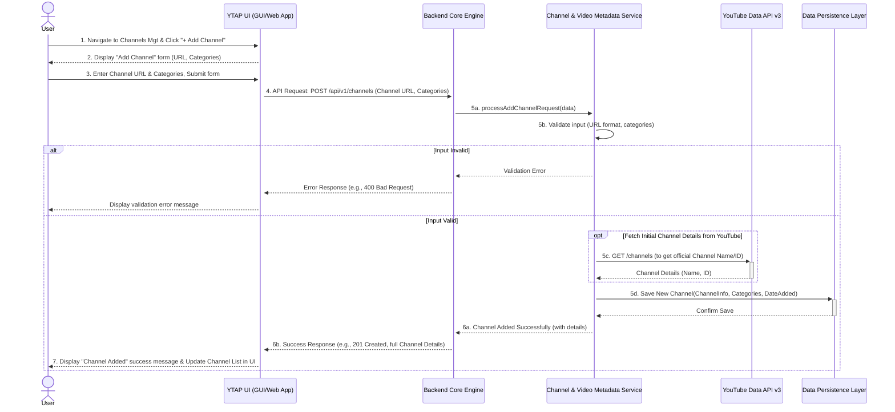

```mermaid
sequenceDiagram
    actor User
    participant UI as YTAP UI (GUI/Web App)
    participant Backend as Backend Core Engine
    participant ChanVidService as Channel & Video Metadata Service
    participant ExtYouTubeAPI as YouTube Data API v3
    participant Persistence as Data Persistence Layer

    User->>+UI: 1. Navigate to Channels Mgt & Click "+ Add Channel"
    UI-->>User: 2. Display "Add Channel" form (URL, Categories)
    User->>+UI: 3. Enter Channel URL & Categories, Submit form
    UI->>+Backend: 4. API Request: POST /api/v1/channels (Channel URL, Categories)
    Backend->>+ChanVidService: 5a. processAddChannelRequest(data)
    ChanVidService->>ChanVidService: 5b. Validate input (URL format, categories)

    alt Input Invalid
        ChanVidService-->>Backend: Validation Error
        Backend-->>UI: Error Response (e.g., 400 Bad Request)
        UI-->>User: Display validation error message
    else Input Valid
        opt Fetch Initial Channel Details from YouTube
            ChanVidService->>+ExtYouTubeAPI: 5c. GET /channels (to get official Channel Name/ID)
            ExtYouTubeAPI-->>-ChanVidService: Channel Details (Name, ID)
        end

        ChanVidService->>+Persistence: 5d. Save New Channel(ChannelInfo, Categories, DateAdded)
        Persistence-->>-ChanVidService: Confirm Save

        ChanVidService-->>Backend: 6a. Channel Added Successfully (with details)
        Backend-->>UI: 6b. Success Response (e.g., 201 Created, full Channel Details)
        UI-->>User: 7. Display "Channel Added" success message & Update Channel List in UI
    end
```
