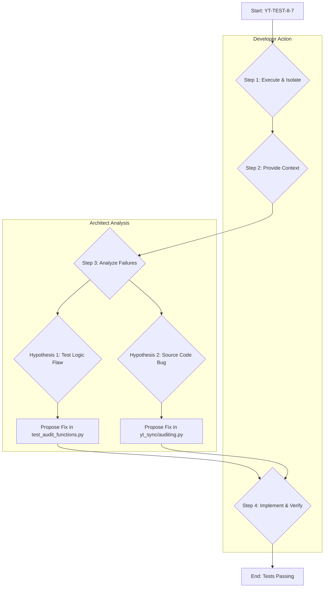

Excellent. Let's proceed with **YT-TEST-8-7: Fix failing tests in `test_audit_functions.py`**.

### Plan for Task YT-TEST-8-7

To efficiently diagnose and resolve the failing tests, I will follow a structured debugging process. My primary role here is to perform the analysis, so I will need you to provide the necessary data (error logs and source code).

Here is the proposed debugging workflow:



**Step-by-Step Breakdown:**

1.  **Execute & Isolate (Developer Task):** Please run `pytest` focused specifically on the failing module and provide the complete, unabridged output. This will give us the exact assertion errors and tracebacks.
    ```bash
    pytest tests/test_audit_functions.py -vv
    ```

2.  **Provide Context (Developer Task):** For my analysis, please provide the complete contents of the following two files:
    *   `tests/test_audit_functions.py`
    *   `yt_sync/auditing.py`

3.  **Analyze Failures (Architect Task):** Once I have the `pytest` output and the source code, I will perform a detailed analysis of the tracebacks to pinpoint the root cause. My analysis will focus on:
    *   The precise line of code where the `AssertionError` or exception occurs.
    *   The data state (variables, mock objects) at the time of failure.
    *   The logical flow in both the test and the source code that leads to the failure.

4.  **Implement & Verify (Developer Task):** Based on my analysis, I will propose a code change (either as a snippet or a complete file). You will then implement that change and re-run the tests to verify the fix.

To start, please provide the `pytest` output and the two requested files.
