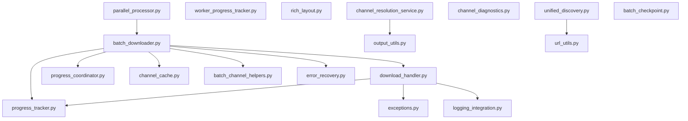

---
code_map:
  version: "1.0"
  subsystem: "download"
  project: "yt-fts"
  last_updated: "2026-01-20"
  total_files: 41
  total_loc: ~17237

summary:
  critical_risks: 1
  high_risks: 3
  complexity_hotspots: 13
  type_gaps: 25
  circular_dependencies: 0

quick_index:
  # For LLM: Check this index first to determine if full document is needed
  # Format: file -> {sections, cc_max, risks, severity}

  batch_downloader.py:
    sections: [1_dependencies, 3_complexity, 4_risks, 5_types]
    cc_max: 30
    risks: [god_class, high_params, deadlock]
    severity: critical
    lines: 3649

  download_handler.py:
    sections: [1_dependencies, 3_complexity, 4_risks, 5_types]
    cc_max: 15
    risks: [god_class, untyped_returns, resource_leaks]
    severity: high
    lines: 3508

  parallel_processor.py:
    sections: [1_dependencies, 3_complexity, 4_risks]
    cc_max: 15
    risks: [duplicate_code, shared_state]
    severity: medium
    lines: 1217

  progress_coordinator.py:
    sections: [4_risks]
    cc_max: 8
    risks: [race_conditions]
    severity: medium
    lines: ~200

  unified_discovery.py:
    sections: [4_risks]
    cc_max: 5
    risks: [nested_tpe, silent_exceptions]
    severity: critical
    lines: ~400

lookup_by_concern:
  # For LLM: Jump to section based on concern
  deadlock: "Section 4 - Risk Register / unified_discovery.py:98-107"
  high_cc: "Section 3 - Complexity Hotspots / 13 functions listed"
  god_classes: "Section 3 - Classes with >10 methods"
  types: "Section 5 - Type Safety Gaps / 25+ instances"
  race_conditions: "Section 4 - Risk Register / progress_coordinator.py"
  database_locks: "Section 4 - Risk Register / Thread-Local DB connections"

section_map:
  "1": "Dependency Map (which modules import which)"
  "2": "Data Flow Diagrams (RSS → API → yt-dlp → DB)"
  "3": "Complexity Hotspots (CC > 15, functions >100 lines)"
  "4": "Risk Register (predicted issues with severity)"
  "5": "Type Safety Gaps (dict[str, Any], missing types)"
  "6": "Predictive Analysis (future issues by probability)"
  "7": "Refactoring Priority (immediate/short/long-term)"
  "8": "Maintenance Guidelines (safe modification patterns)"
  "9": "Integration Points (external/internal boundaries)"
  "10": "When to Update (maintenance cadence)"

# For human readers: Continue below for full document
---

# Code Map: Download Subsystem

**Project:** yt-fts
**Subsystem:** `src/yt_fts/download/`
**Analysis Date:** 2026-01-20
**Purpose:** Architectural reference, risk prediction, and maintenance guide

---

## Quick Reference for LLMs

**When investigating a file in this subsystem:**
1. Check `quick_index[file]` above - if file not listed, low-risk
2. Check `sections` array - only read relevant sections
3. Check `risks` array - known issues to be aware of
4. Check `severity` - critical/high/medium/low priority

**When investigating a concern:**
1. Check `lookup_by_concern[concern]` above for direct link
2. Jump to section indicated

**Example:**
- Investigating `batch_downloader.py` deadlock → See `lookup_by_concern.deadlock` → Section 4
- Investigating high CC function → See `lookup_by_concern.high_cc` → Section 3
- Investigating type errors → See `lookup_by_concern.types` → Section 5

---

## Executive Summary

| Metric | Value | Status |
|--------|-------|--------|
| Python Files | 41 | ✓ |
| Lines of Code | ~17,237 | ✓ |
| Critical Risks | 1 (nested TPE deadlock) | ⚠️ Action needed |
| High Risks | 3 (globals, DB connections, error handling) | ⚠️ Action needed |
| Complexity Hotspots | 13 functions (CC > 15) | ⚠️ Refactor candidates |
| Type Safety Gaps | 25+ instances | Medium |

**Overall Assessment:** The download subsystem has good architectural separation (no circular dependencies, clean layered design) but suffers from god classes (`BatchDownloader`, `DownloadHandler`) and complexity hotspots that increase maintenance burden.

---

## 1. Dependency Map

### Dependency Graph (Mermaid)



### Key Findings

| Finding | Details |
|----------|---------|
| **Most imported** | `batch_downloader.py` (by __init__.py, parallel_processor.py) |
| **Most dependent** | `batch_downloader.py` (imports 13 internal modules) |
| **Circular dependencies** | **None** - Clean DAG structure ✓ |
| **Architecture pattern** | Hub-and-spoke with batch_downloader.py as central hub |

---

## 2. Data Flow Diagrams

### Flow 1: RSS Check Flow (Zero-Quota)

```
batch_downloader.py:_perform_rss_check_and_determine_status()
    ↓
batch_channel_helpers.py:perform_rss_check()
    ↓
[youtube.com/feed URL fetch]
    ↓
Compare video IDs with database
    ↓
Return: (status, message, skip, new_count, video_ids, new_channel_flag)
```

**Characteristics:** Read-only, no DB writes

---

### Flow 2: API Backfill Flow

```
batch_downloader.py:_backfill_new_channel_metadata()
    ↓
metadata_backfill_api.py:YouTubeAPIBackfill.fetch_all_videos_from_channel()
    ↓
[YouTube Data API call]
    ↓
Write to Channels table (subscriber_count, is_verified)
Write to Videos table (metadata)
    ↓
Return: (api_mismatch, should_skip, skip_reason)
```

**Characteristics:** DB writes, quota consumed

---

### Flow 3: yt-dlp Download Flow

```
download_handler.py:download_vtts()
    ↓
[yt-dlp download --write-subtitle --skip-download]
    ↓
VTT files in tmp_dir
    ↓
download_handler.py:vtt_to_db()
    ↓
Parse VTT → Extract transcript
    ↓
Write to Subtitles table
```

**Characteristics:** File I/O heavy, deferred DB writes

---

### Flow 4: Handle Resolution Flow

```
Handle URL (@1veritasium)
    ↓
Database lookup (channel_cache.py)
    ↓
[If not found]
    ↓
batch_downloader.py:yt-dlp fallback with socket_timeout
    ↓
Extract UC channel_id from yt-dlp response
    ↓
Validate UC format
    ↓
Write to Channels table
```

**Characteristics:** Fallback retry, transient errors suppressed

---

## 3. Complexity Hotspots

### Critical (CC > 20)

| Function | File | CC | Lines | Parameters | Priority |
|----------|------|-----|-------|------------|----------|
| `download_all` | batch_downloader.py | 30+ | 420+ | 0 | HIGH |
| `__init__` | batch_downloader.py | 25+ | 170+ | 28 | HIGH |
| `_resolve_and_validate_channels` | batch_downloader.py | 18+ | 95+ | 1 | HIGH |
| `_execute_ytdlp_download_for_channel` | batch_downloader.py | 16+ | 100+ | 11 | HIGH |

### High (CC 15-20)

| Function | File | CC | Lines | Priority |
|----------|------|-----|-------|----------|
| `__init__` | download_handler.py | 15+ | 100+ | HIGH |
| `__init__` | parallel_processor.py | 12+ | 70+ | MEDIUM |
| `_process_channels_with_rich` | parallel_processor.py | 15+ | 175+ | MEDIUM |
| `_process_channels_simple` | parallel_processor.py | 14+ | 220+ | MEDIUM |

### God Classes

| Class | File | Methods | Lines | Recommendation |
|-------|------|---------|-------|----------------|
| `BatchDownloader` | batch_downloader.py | 40+ | 3,649 | Split into 3-4 classes |
| `DownloadHandler` | download_handler.py | 35+ | 3,508 | Split into 3-4 classes |
| `ParallelBatchProcessor` | parallel_processor.py | 15+ | 1,217 | Extract output formatters |

---

## 4. Risk Register

### Critical Severity

| Risk | Location | Issue | Mitigation |
|------|----------|-------|------------|
| **Nested TPE Deadlock** | unified_discovery.py:98-107 | ThreadPoolExecutor inside ThreadPoolExecutor detection can fail | Use signal.alarm() or threading.Timer instead |

### High Severity

| Risk | Location | Issue | Mitigation |
|------|----------|-------|------------|
| **Global module state** | channel_cache.py:14-20 | `_cache_stats_lock` and `_cache_stats` shared across threads | Move to class instance or dependency injection |
| **DB connection leaks** | batch_downloader.py:187-190 | Thread-local connections may not close on error | Use context manager + atexit fallback |
| **Silent exception swallowing** | unified_discovery.py:322-323 | Bare `except Exception:` masks errors | Use specific exception types + logging.exception() |

### Medium Severity

| Risk | Location | Issue | Mitigation |
|------|----------|-------|------------|
| **Shared BatchDownloader** | parallel_processor.py:415-434 | Single instance accessed by worker threads | Audit instance variables, add locks or create per-thread instances |
| **Progress coordinator races** | progress_coordinator.py:73-88 | Task ID lock doesn't cover progress.update() | Extend lock or use Copy-on-Write |
| **Temp file leaks** | cookie_extractor.py:234-263 | `delete=False` may not cleanup on error | Use try/finally or atexit handler |
| **DB schema coupling** | channel_cache.py:79-146 | Hardcoded SQL creates tight coupling | Create repository/DAO layer |

---

## 5. Type Safety Gaps

### dict[str, Any] Returns (9 instances)

| Function | File | Impact | Fix |
|----------|------|--------|-----|
| `_dry_run_channels` | batch_downloader.py:453 | Structure not enforced | Create `DryRunResult` TypedDict |
| `download_all` | batch_downloader.py:2589 | 4+ keys unenforced | Create `DownloadAllResult` TypedDict |
| `_build_video_list_ydl_opts` | download_handler.py:1242 | yt-dlp options untyped | Create `VideoListYdlOpts` TypedDict |
| `_build_discovery_ydl_opts` | download_handler.py:1402 | yt-dlp options untyped | Create `DiscoveryYdlOpts` TypedDict |
| `_build_vtt_ydl_options` | download_handler.py:2925 | yt-dlp options untyped | Create `VttYdlOpts` TypedDict |

### Missing Return Types (13 instances)

| Function | File | Current | Should Be |
|----------|------|---------|----------|
| `cleanup_cookie_file` | cookie_extractor.py:314 | None | `-> None` |
| `_cancel_remaining_futures` | download_handler.py:1848 | None | `-> None` |
| `_get_whisper_engine` | download_handler.py:2256 | None | `-> LocalWhisperEngine \| None` |
| `_extract_video_metadata` | download_handler.py:3053 | None | Create `VideoMetadata` TypedDict |
| `_get_vtt_files_from_tmpdir` | download_handler.py:3155 | None | `-> list[str] \| None` |

### Untyped Optional (2 instances)

| Function | File | Current | Should Be |
|----------|------|---------|----------|
| `__init__` | cookie_extractor.py:28 | `console: Console = None` | `console: Console \| None = None` |
| `auto_extract_cookies` | cookie_extractor.py:324 | `console: Console = None` | `console: Console \| None = None` |

---

## 6. Predictive Analysis

### High-Probability Future Issues

Based on complexity hotspots and architectural patterns, these issues are **predicted to occur**:

#### Issue 1: Parameter Object Explosion (Probability: 80%)

**Where:** `BatchDownloader.__init__` (28 parameters)
**Predicted problem:** Adding new features will require modifying the signature, breaking existing code.
**When:** Next feature addition (quota management, new output format)
**Prevention:** Create `BatchDownloaderConfig` dataclass now

#### Issue 2: Progress Bar Race Conditions (Probability: 60%)

**Where:** `progress_coordinator.py:73-88`
**Predicted problem:** Under high parallelism (>8 workers), task ID lookups will race with task removal.
**When:** User increases parallelism beyond current defaults
**Prevention:** Extend lock to cover progress.update() call

#### Issue 3: Database Lock Contention (Probability: 70%)

**Where:** Thread-local DB connections without pooling
**Predicted problem:** Under Windows, "database is locked" errors will increase with worker count.
**When:** Parallel downloads >4 channels simultaneously
**Prevention:** Implement connection pooling with explicit timeout

#### Issue 4: Transient Error Masking (Probability: 50%)

**Where:** `unified_discovery.py:322-323` (silent except)
**Predicted problem:** Real errors will be swallowed and attributed to "transient" issues.
**When:** Non-transient errors occur (e.g., API key exhaustion)
**Prevention:** Replace bare `except Exception:` with specific types

---

## 7. Refactoring Priority

### Immediate (This Sprint)

1. **Fix nested TPE deadlock** (Critical)
   - Replace `with_timeout()` ThreadPoolExecutor nesting
   - Use `threading.Timer` or `signal.alarm()`

2. **Eliminate global state** in channel_cache.py
   - Move `_cache_stats` to class instance
   - Pass via dependency injection

3. **Add return types** to all functions (Type safety)
   - Start with high-risk functions: `_extract_video_metadata`, `download_all`

### Short-Term (Next Sprint)

4. **Extract config objects** (Reduce parameter count)
   - `BatchDownloaderConfig` dataclass
   - `DownloadHandlerConfig` dataclass
   - `ParallelProcessorConfig` dataclass

5. **Split god classes**
   - `BatchDownloader` → orchestrator + resolver + downloader
   - `DownloadHandler` → downloader + validator + progress

6. **Create TypedDict contracts** for complex returns
   - `DownloadAllResult`
   - `VideoMetadata`
   - `DryRunResult`

### Long-Term (Technical Debt)

7. **Implement repository pattern** for database access
8. **Add complexity monitoring** to CI/CD (radon)
9. **Extract output formatter strategies** from ParallelBatchProcessor
10. **Add integration tests** for batch download pipeline

---

## 8. Maintenance Guidelines

### Before Modifying These Files

**High-risk files** - Read twice, code once:

1. **`batch_downloader.py`** (3,649 lines)
   - God class with 40+ methods
   - Touch 3-4 other modules per change
   - High coupling to progress tracking

2. **`download_handler.py`** (3,508 lines)
   - God class with 35+ methods
   - Complex yt-dlp integration
   - Thread-local database connections

3. **`parallel_processor.py`** (1,217 lines)
   - 4 output modes with duplicated code
   - Shared BatchDownloader across workers

### Safe Modification Pattern

```
1. Read CODE_MAP.md section for the file
2. Check dependency graph for downstream consumers
3. Write characterization test FIRST (TDD)
4. Make minimal change
5. Run regression tests
```

---

## 9. Integration Points

### External Dependencies

| Module | Dependency | Coupling | Risk |
|--------|------------|----------|------|
| All modules | `yt_fts.core.database` | High | DB schema changes break code |
| All modules | `yt_fts.utils.dual_sink_logger` | Low | Stable logging interface |
| `batch_downloader.py` | `yt_fts.db.channels` | Medium | Direct SQL queries |
| `download_handler.py` | `yt_dlp` | High | Library changes affect behavior |

### Internal API Boundaries

| Boundary | Contract | Status |
|----------|----------|--------|
| Progress tracking | `ProgressCoordinator` API | Stable |
| Error recovery | `ErrorRecoveryManager` | Stable |
| Metadata caching | `channel_cache.py` functions | Implicit (needs doc) |
| yt-dlp options | dict[str, Any] | **Untyped** (gap) |

---

## 10. When to Update This Document

Update `CODE_MAP.md` when:

1. **New file added** to download subsystem
2. **Function signature changed** (parameters, return type)
3. **New dependency added** between modules
4. **Complexity reduced** (CC drop below threshold)
5. **Risk mitigated** (issue from this document resolved)

**Maintenance cadence:** Review quarterly or after major refactoring.

---

**Document Version:** 1.0
**Last Updated:** 2026-01-20
**Maintained by:** Development team
